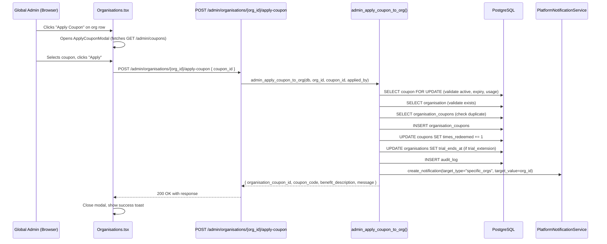
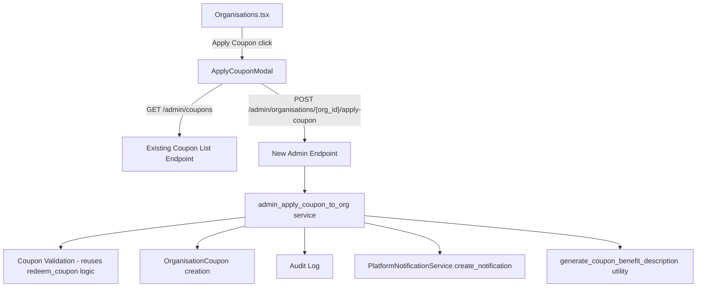

# Design Document: Organisation Coupon Application from Global Admin Console

## Overview

This feature adds the ability for Global Admins to apply coupons directly to organisations from the Organisations page in the Global Admin Console. Currently, coupons can only be redeemed by organisations themselves via the public `POST /coupons/redeem` endpoint. This feature introduces an admin-initiated flow that:

1. Adds an "Apply Coupon" button to each non-deleted organisation row on the Organisations page
2. Opens a modal for searching and selecting active coupons
3. Calls a new dedicated admin endpoint to validate and apply the coupon
4. Creates an in-app `PlatformNotification` informing the target organisation
5. Provides a utility function for generating human-readable coupon benefit descriptions

The design reuses existing infrastructure: `Coupon` and `OrganisationCoupon` models, the validation logic from `redeem_coupon`, `PlatformNotificationService`, and the existing `GET /admin/coupons` endpoint for listing coupons.

## Architecture

### Data Flow



### Component Interaction



## Components and Interfaces

### Backend

#### New Endpoint: `POST /admin/organisations/{org_id}/apply-coupon`

**Location:** `app/modules/admin/router.py`

- **Auth:** `require_role("global_admin")`
- **Path param:** `org_id` (UUID string)
- **Request body:** `AdminApplyCouponRequest` — contains `coupon_id: str` (UUID)
- **Success response (200):** `AdminApplyCouponResponse`
- **Error responses:** 400 (expired/usage limit), 404 (coupon/org not found), 409 (already applied), 422 (validation)

#### New Service Function: `admin_apply_coupon_to_org()`

**Location:** `app/modules/admin/service.py`

```python
async def admin_apply_coupon_to_org(
    db: AsyncSession,
    *,
    org_id: uuid.UUID,
    coupon_id: uuid.UUID,
    applied_by: uuid.UUID,
    ip_address: str | None = None,
) -> dict:
```

**Logic:**
1. `SELECT coupon WHERE id = coupon_id FOR UPDATE` — lock row for atomic update
2. Validate: coupon exists, `is_active=True`, not expired, not past usage limit
3. `SELECT organisation WHERE id = org_id` — validate org exists
4. `SELECT organisation_coupons WHERE org_id AND coupon_id` — check duplicate
5. `INSERT organisation_coupons` with `applied_at=now()`
6. `UPDATE coupons SET times_redeemed += 1`
7. If `discount_type == "trial_extension"`: extend `organisation.trial_ends_at`
8. `write_audit_log(action="coupon.admin_applied", ...)`
9. Call `PlatformNotificationService.create_notification(...)` with `target_type="specific_orgs"`, `target_value=json.dumps([str(org_id)])`
10. Return response dict with `organisation_coupon_id`, `coupon_code`, `benefit_description`, `message`

**Error mapping:**
- Coupon not found / inactive → raise `ValueError("Coupon not found")` → router returns 404
- Coupon expired / usage limit → raise `ValueError("Coupon has expired" | "Coupon usage limit reached")` → router returns 400
- Already applied → raise `ValueError("Coupon already applied to this organisation")` → router returns 409
- Org not found → raise `ValueError("Organisation not found")` → router returns 404

#### New Utility: `generate_coupon_benefit_description()`

**Location:** `app/modules/admin/service.py` (alongside existing coupon functions)

```python
def generate_coupon_benefit_description(
    discount_type: str,
    discount_value: float,
    duration_months: int | None = None,
) -> str:
```

**Pure function** — no DB access, no side effects. Returns:
- `"percentage"` → `"{X}% discount on your subscription for {Y} months"` or `"... ongoing"`
- `"fixed_amount"` → `"${X} off per billing cycle for {Y} months"` or `"... ongoing"`
- `"trial_extension"` → `"Trial extended by {X} days"`

#### New Pydantic Schemas

**Location:** `app/modules/admin/schemas.py`

```python
class AdminApplyCouponRequest(BaseModel):
    coupon_id: str = Field(..., description="UUID of the coupon to apply")

class AdminApplyCouponResponse(BaseModel):
    message: str
    organisation_coupon_id: str
    coupon_code: str
    benefit_description: str
```

### Frontend

#### ApplyCouponModal Component

**Location:** `frontend/src/pages/admin/Organisations.tsx` (inline, following existing modal pattern)

**Props:**
```typescript
interface ApplyCouponModalProps {
  open: boolean
  onClose: () => void
  onSuccess: () => void
  orgName: string
  orgId: string
}
```

**State:**
- `coupons: CouponItem[]` — loaded from `GET /admin/coupons`
- `search: string` — filter text
- `selectedCouponId: string | null`
- `loading: boolean` — initial coupon list load
- `applying: boolean` — apply request in progress
- `error: string` — inline error message

**Behavior:**
1. On open: fetch `GET /admin/coupons` with AbortController cleanup
2. Filter coupons client-side by code/description matching search text (case-insensitive)
3. Display each coupon: code, description, discount type badge, discount value, remaining uses
4. On coupon select: highlight row, show benefit description preview
5. On "Apply" click: `POST /admin/organisations/{orgId}/apply-coupon` with `{ coupon_id }`
6. On success: call `onSuccess()` (parent closes modal, shows toast)
7. On error: display inline error based on status code (409 → "already applied", 400/404 → backend detail, other → generic)

**Safety patterns (per steering rules):**
- `setCoupons(res.data?.coupons ?? [])` — safe array access
- `setTotal(res.data?.total ?? 0)` — safe number access
- AbortController cleanup in useEffect
- No `as any` — typed API generics
- Field names match `CouponResponse` Pydantic schema exactly

#### Integration into Organisations.tsx

**Changes (additive only — no existing UI replaced):**
1. Add `applyCouponOrg` state: `useState<Organisation | null>(null)`
2. Add "Apply Coupon" button in the actions column (alongside existing Suspend, Move plan, etc.)
3. Add `<ApplyCouponModal>` at the bottom of the component alongside existing modals
4. Add `handleApplyCouponSuccess` callback that closes modal, shows success toast, and refreshes org list

**Button placement:** After "Billing date" button, before "Soft Delete" button. Only shown when `row.status !== 'deleted'`.

## Data Models

### Existing Models (No Changes Required)

| Model | Table | Key Fields |
|-------|-------|------------|
| `Coupon` | `coupons` | `id`, `code`, `description`, `discount_type`, `discount_value`, `duration_months`, `usage_limit`, `times_redeemed`, `is_active`, `starts_at`, `expires_at` |
| `OrganisationCoupon` | `organisation_coupons` | `id`, `org_id`, `coupon_id`, `applied_at`, `billing_months_used`, `is_expired` |
| `PlatformNotification` | `platform_notifications` | `id`, `notification_type`, `title`, `message`, `severity`, `target_type`, `target_value`, `published_at` |
| `Organisation` | `organisations` | `id`, `name`, `status`, `trial_ends_at` |

**No new tables or columns are needed.** The feature uses existing models and relationships. No Alembic migration required.

### Coupon Discount Types

| Type | `discount_value` meaning | Effect on application |
|------|--------------------------|----------------------|
| `percentage` | Percentage off (e.g., 20.0 = 20%) | Creates OrganisationCoupon record |
| `fixed_amount` | Dollar amount off (e.g., 50.0 = $50) | Creates OrganisationCoupon record |
| `trial_extension` | Days to extend (e.g., 14.0 = 14 days) | Creates OrganisationCoupon + extends `trial_ends_at` |

## Correctness Properties

*A property is a characteristic or behavior that should hold true across all valid executions of a system — essentially, a formal statement about what the system should do. Properties serve as the bridge between human-readable specifications and machine-verifiable correctness guarantees.*

### Property 1: Benefit description format matches coupon type

*For any* coupon with a valid `discount_type` in `{percentage, fixed_amount, trial_extension}`, a `discount_value` > 0, and an optional `duration_months`, `generate_coupon_benefit_description()` SHALL return a non-empty string that:
- Contains the discount value
- For `percentage`: contains "%" and "discount on your subscription"
- For `fixed_amount`: contains "$" and "off per billing cycle"
- For `trial_extension`: contains "Trial extended by" and "days"
- When `duration_months` is set (and type is not `trial_extension`): contains "for {N} months"
- When `duration_months` is None (and type is not `trial_extension`): contains "ongoing"

**Validates: Requirements 5.1, 5.2, 5.3**

### Property 2: Coupon search filter returns only matching coupons

*For any* list of coupons and any search string, filtering the list by code or description should return only coupons where the code or description contains the search string (case-insensitive). The filtered list should be a subset of the original list, and every item in the filtered list should match the search criteria.

**Validates: Requirements 2.4**

### Property 3: Validation rejects invalid coupon applications

*For any* coupon that is inactive, expired, past its usage limit, or already applied to the target organisation, `admin_apply_coupon_to_org()` SHALL raise a `ValueError` and NOT create an `OrganisationCoupon` record. Specifically:
- If `is_active=False` or coupon not found → error
- If `expires_at < now` → error
- If `times_redeemed >= usage_limit` (when usage_limit is set) → error
- If an `OrganisationCoupon` record already exists for (org_id, coupon_id) → error

**Validates: Requirements 3.1, 3.2, 3.3, 3.7, 3.8, 3.9**

### Property 4: Successful application creates correct state

*For any* valid coupon (active, not expired, within usage limit, not already applied) and any existing non-deleted organisation, after `admin_apply_coupon_to_org()` completes successfully:
- An `OrganisationCoupon` record exists with the correct `org_id`, `coupon_id`, and `applied_at` timestamp
- The coupon's `times_redeemed` is incremented by exactly 1
- If `discount_type == "trial_extension"`, the organisation's `trial_ends_at` is extended by `discount_value` days

**Validates: Requirements 3.4**

### Property 5: Successful response contains required fields

*For any* successful coupon application, the returned dict SHALL contain:
- `organisation_coupon_id`: a valid UUID string
- `coupon_code`: a non-empty string matching the applied coupon's code
- `benefit_description`: a non-empty string (matching the output of `generate_coupon_benefit_description`)
- `message`: a non-empty string

**Validates: Requirements 3.6, 7.4**

## Error Handling

### Backend Error Strategy

| Scenario | HTTP Status | Error Detail | Service Exception |
|----------|-------------|--------------|-------------------|
| Invalid `org_id` UUID format | 400 | "Invalid org_id format" | Router-level check |
| Invalid `coupon_id` UUID format | 422 | Pydantic validation error | Schema validation |
| Organisation not found | 404 | "Organisation not found" | `ValueError` |
| Coupon not found or inactive | 404 | "Coupon not found" | `ValueError` |
| Coupon expired | 400 | "Coupon has expired" | `ValueError` |
| Coupon not yet active | 400 | "Coupon is not yet active" | `ValueError` |
| Coupon usage limit reached | 400 | "Coupon usage limit reached" | `ValueError` |
| Coupon already applied | 409 | "Coupon already applied to this organisation" | `ValueError` (mapped to 409) |
| Unexpected DB error | 500 | "An error occurred while applying the coupon" | Catch-all `Exception` |

**Error mapping in router:**
```python
try:
    result = await admin_apply_coupon_to_org(db, ...)
except ValueError as exc:
    msg = str(exc)
    if "not found" in msg.lower():
        return JSONResponse(status_code=404, content={"detail": msg})
    if "already applied" in msg.lower():
        return JSONResponse(status_code=409, content={"detail": msg})
    return JSONResponse(status_code=400, content={"detail": msg})
except Exception:
    logger.exception("Unexpected error applying coupon")
    return JSONResponse(status_code=500, content={"detail": "An error occurred while applying the coupon"})
```

### Frontend Error Strategy

| Backend Status | Modal Behavior |
|----------------|----------------|
| 200 | Close modal, show success toast "Coupon applied to {orgName}" |
| 409 | Show inline error: "This coupon has already been applied to this organisation" |
| 400 | Show inline error with backend `detail` message |
| 404 | Show inline error with backend `detail` message |
| Other / network | Show inline error: "Failed to apply coupon. Please try again." |

**Pattern:**
```typescript
try {
  const res = await apiClient.post<AdminApplyCouponResponse>(
    `/admin/organisations/${orgId}/apply-coupon`,
    { coupon_id: selectedCouponId }
  )
  onSuccess()
  addToast('success', `Coupon applied to ${orgName}`)
} catch (err: any) {
  const status = err?.response?.status
  const detail = err?.response?.data?.detail
  if (status === 409) {
    setError('This coupon has already been applied to this organisation')
  } else if (detail) {
    setError(detail)
  } else {
    setError('Failed to apply coupon. Please try again.')
  }
} finally {
  setApplying(false)
}
```

### Notification Error Handling

If `PlatformNotificationService.create_notification()` fails, the coupon application should still succeed. The notification creation is wrapped in a try/except that logs the error but does not roll back the coupon application. This follows the performance-and-resilience steering rule about not blocking the main operation for secondary effects.

## Testing Strategy

### Property-Based Tests (Hypothesis)

**Library:** Hypothesis (already used in the project — see `.hypothesis/` directory)
**Minimum iterations:** 100 per property

| Property | Test File | What It Tests |
|----------|-----------|---------------|
| Property 1: Benefit description format | `tests/test_coupon_benefit_description_props.py` | `generate_coupon_benefit_description()` pure function |
| Property 2: Coupon search filter | `tests/test_coupon_search_filter_props.py` | Client-side coupon filtering logic (extracted to testable function) |
| Property 3: Validation rejects invalid | `tests/test_admin_apply_coupon_props.py` | `admin_apply_coupon_to_org()` with mocked DB |
| Property 4: Successful application state | `tests/test_admin_apply_coupon_props.py` | `admin_apply_coupon_to_org()` with mocked DB |
| Property 5: Response shape | `tests/test_admin_apply_coupon_props.py` | Response dict structure validation |

**Tag format:** `# Feature: org-coupon-application, Property {N}: {description}`

### Unit Tests (pytest)

| Test | What It Covers |
|------|----------------|
| `test_benefit_description_percentage_with_duration` | Specific example: 20% for 3 months |
| `test_benefit_description_fixed_ongoing` | Specific example: $50 ongoing |
| `test_benefit_description_trial_extension` | Specific example: 14 days |
| `test_apply_coupon_endpoint_auth` | 401 without token, 403 without global_admin |
| `test_apply_coupon_invalid_org_uuid` | 400 for malformed UUID |
| `test_apply_coupon_nonexistent_org` | 404 for valid UUID that doesn't exist |
| `test_apply_coupon_success_creates_notification` | Verify PlatformNotification created |
| `test_apply_coupon_success_creates_audit_log` | Verify audit log entry |

### End-to-End Test Script

**Location:** `scripts/test_org_coupon_application_e2e.py`

**Pattern:** Follows `scripts/test_*_e2e.py` convention with `httpx`, `asyncio`, `ok`/`fail` helpers.

**Test steps:**
1. Login as global_admin (`admin@orainvoice.com` / `admin123`)
2. List organisations (`GET /admin/organisations`) — verify response shape
3. List coupons (`GET /admin/coupons`) — verify response shape
4. Pick a test org and a test coupon
5. Apply coupon (`POST /admin/organisations/{org_id}/apply-coupon`) — verify 200 response with correct fields
6. Verify OrganisationCoupon record exists (direct DB query via asyncpg)
7. Verify coupon `times_redeemed` incremented
8. Verify PlatformNotification created for the org
9. Verify audit log entry exists
10. Try applying same coupon again — verify 409
11. Try applying with non-existent coupon_id — verify 404
12. Try applying with non-existent org_id — verify 404
13. **OWASP checks:**
    - Try without auth token → 401
    - Try with org_admin token → 403
    - SQL injection in coupon_id field → 422
    - XSS payload in coupon_id → 422
14. Clean up: delete the OrganisationCoupon record, decrement times_redeemed

**Usage:**
```bash
docker exec invoicing-app-1 python scripts/test_org_coupon_application_e2e.py
```
