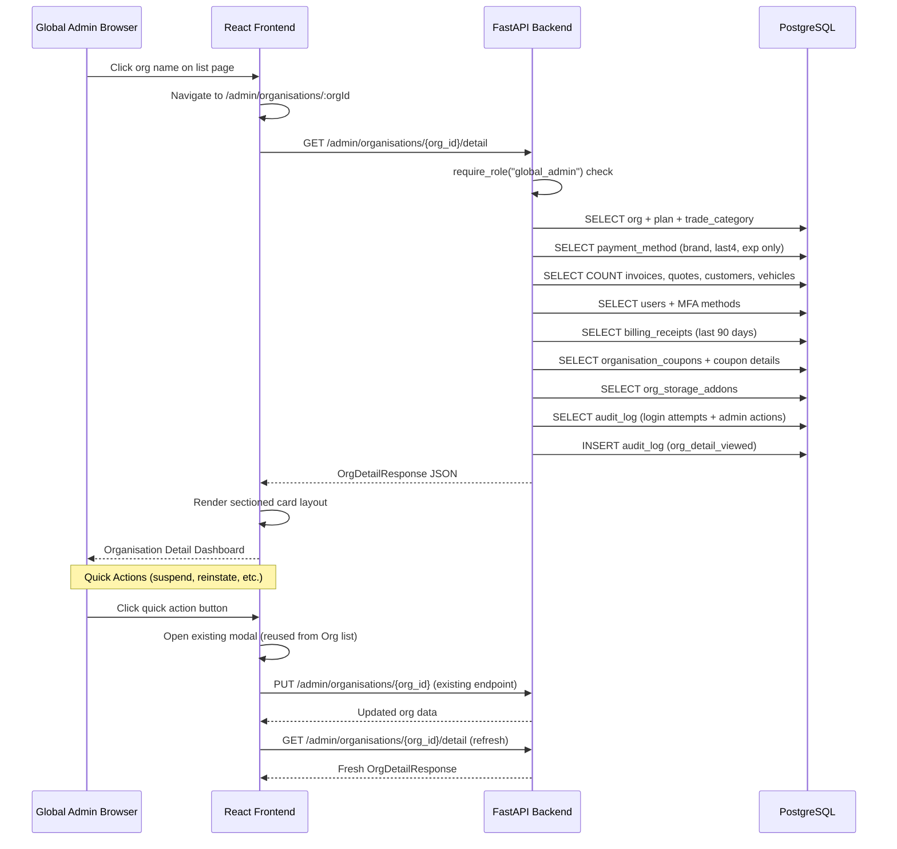
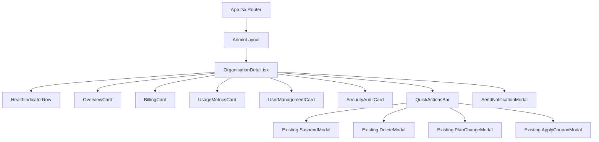

# Design Document: Organisation Detail Dashboard

## Overview

The Organisation Detail Dashboard provides Global Admins with a single-page, compliance-safe deep-dive into any organisation on the OraInvoice platform. It is accessed by clicking an organisation name on the existing Organisations list page, navigating to `/admin/organisations/:orgId`.

The feature consists of:
- **One new backend endpoint** (`GET /admin/organisations/{org_id}/detail`) that aggregates data from 10+ existing tables into a single response
- **One new frontend page** (`OrganisationDetail.tsx`) with sectioned card layout
- **No new database tables** — all data comes from existing models via aggregate queries
- **PCI DSS compliance** — payment method data is masked server-side; no raw customer PII or invoice content is returned
- **Audit logging** — every access to the detail endpoint is recorded

### Key Design Decisions

| Decision | Rationale |
|---|---|
| Single API endpoint | Reduces frontend round-trips; the detail page loads in one request |
| Server-side masking of payment data | PCI DSS compliance — card data never reaches the frontend unmasked |
| Aggregate counts only for invoices/quotes/customers/vehicles | Privacy boundary — Global Admin sees utilisation, not content |
| Reuse existing modals for quick actions | No-shortcut rule — suspend/reinstate/plan-change modals already exist on Org list page |
| No new tables or migrations | All data is queryable from existing models with JOINs and COUNT aggregates |

---

## Architecture

### Data Flow Diagram



### Component Architecture



All section components are defined within `OrganisationDetail.tsx` as local components (not separate files) since they are tightly coupled to the detail page data shape and not reused elsewhere.

---

## Components and Interfaces

### Backend Components

#### 1. New Endpoint: `GET /admin/organisations/{org_id}/detail`

**Location:** `app/modules/admin/router.py`

```python
@router.get(
    "/organisations/{org_id}/detail",
    response_model=OrgDetailResponse,
    summary="Get organisation detail dashboard data",
)
async def get_organisation_detail(
    org_id: uuid.UUID,
    request: Request,
    db: AsyncSession = Depends(get_db_session),
    current_user: User = Depends(require_role("global_admin")),
) -> OrgDetailResponse:
    data = await get_org_detail(
        db,
        org_id=org_id,
        admin_user_id=current_user.id,
        ip_address=request.client.host if request.client else None,
        device_info=request.headers.get("user-agent"),
    )
    if data is None:
        raise HTTPException(status_code=404, detail="Organisation not found")
    return data
```

**Behaviour:**
1. Validate `org_id` exists — return 404 if not found
2. Record audit log entry: `action="org_detail_viewed"`, `entity_type="organisation"`, `entity_id=org_id`
3. Aggregate all section data via service function
4. Return `OrgDetailResponse`

#### 2. New Service Function: `get_org_detail`

**Location:** `app/modules/admin/service.py`

```python
async def get_org_detail(
    db: AsyncSession,
    *,
    org_id: uuid.UUID,
    admin_user_id: uuid.UUID,
    ip_address: str | None = None,
    device_info: str | None = None,
) -> dict | None:
```

**Responsibilities:**
- Query organisation with plan JOIN and trade_category LEFT JOIN
- Query default payment method from `org_payment_methods` (brand, last4, exp_month, exp_year only — never `stripe_payment_method_id`)
- Query aggregate counts: invoices, quotes, customers, org_vehicles (using `text()` with bound params to bypass RLS)
- Query users with MFA enrollment status (subquery on `user_mfa_methods` checking `verified=true`)
- Query billing receipts from last 90 days (partition by status: 'paid' vs 'failed')
- Query active organisation coupons with coupon details (JOIN `coupons` WHERE `is_expired=false`)
- Query storage add-on from `org_storage_addons`
- Query `audit_log` for login attempts (action IN ('login_success','login_failed'), last 30 days, limit 50, ORDER BY created_at DESC)
- Query `audit_log` for admin actions on this org (action IN ('org_suspended','org_reinstated','org_plan_changed','org_coupon_applied','org_deleted','org_detail_viewed'), last 90 days, limit 50)
- Insert audit log entry for the view action
- Compute health indicators from the aggregated data
- Return structured dict matching `OrgDetailResponse` schema

#### 3. Health Indicator Computation (pure function)

```python
def compute_health_indicators(
    *,
    status: str,
    receipts_failed_90d: int,
    storage_used_bytes: int,
    storage_quota_gb: int,
    active_user_count: int,
    seat_limit: int,
    mfa_enrolled_count: int,
    total_users: int,
) -> dict:
    storage_ratio = storage_used_bytes / max(storage_quota_gb * 1_073_741_824, 1)
    mfa_ratio = mfa_enrolled_count / max(total_users, 1)
    return {
        "billing_ok": receipts_failed_90d == 0,
        "storage_ok": storage_ratio <= 0.9,
        "storage_warning": 0.8 < storage_ratio <= 0.9,
        "seats_ok": active_user_count < seat_limit,
        "mfa_ok": mfa_ratio >= 0.5,
        "status_ok": status not in ("suspended", "payment_pending"),
    }
```

This is extracted as a pure function to enable property-based testing.

### Frontend Components

#### 1. New Page: `OrganisationDetail.tsx`

**Location:** `frontend/src/pages/admin/OrganisationDetail.tsx`

**Imports:** Uses existing components only — `Badge`, `Button`, `Spinner`, `AlertBanner`, `DataTable`, `Modal`, `Input`, `Select`, `Toast`, `apiClient`.

**State management:**
```typescript
const [data, setData] = useState<OrgDetailData | null>(null)
const [loading, setLoading] = useState(true)
const [error, setError] = useState<string | null>(null)
// Modal states for quick actions
const [suspendOpen, setSuspendOpen] = useState(false)
const [deleteOpen, setDeleteOpen] = useState(false)
const [planChangeOpen, setPlanChangeOpen] = useState(false)
const [couponOpen, setCouponOpen] = useState(false)
const [notificationOpen, setNotificationOpen] = useState(false)
```

**Data fetching pattern (safe-api-consumption compliant):**
```typescript
useEffect(() => {
  const controller = new AbortController()
  const fetchDetail = async () => {
    try {
      setLoading(true)
      const res = await apiClient.get<OrgDetailData>(
        `/admin/organisations/${orgId}/detail`,
        { signal: controller.signal }
      )
      setData(res.data)
    } catch (err) {
      if (!controller.signal.aborted) {
        if (axios.isAxiosError(err) && err.response?.status === 404) {
          setError('Organisation not found')
        } else {
          setError('Failed to load organisation details')
        }
      }
    } finally {
      if (!controller.signal.aborted) setLoading(false)
    }
  }
  fetchDetail()
  return () => controller.abort()
}, [orgId])
```

**Section components (defined locally within the file):**

| Component | Props | Renders |
|---|---|---|
| `HealthIndicatorRow` | `health: OrgDetailHealth` | Compact row of icon+label+colour indicators |
| `OverviewCard` | `overview: OrgDetailOverview` | Org name, status badge, plan, dates, business type |
| `BillingCard` | `billing: OrgDetailBilling` | Plan, payment method, coupons, storage addon, receipt summary |
| `UsageMetricsCard` | `usage: OrgDetailUsage` | Counts + progress bars for storage/carjam/sms |
| `UserManagementCard` | `users: OrgDetailUserSection` | User table with seat count, MFA status, stale login highlighting |
| `SecurityAuditCard` | `security: OrgDetailSecurity` | Login attempts table, admin actions table, MFA summary |
| `QuickActionsBar` | `status: string, onAction: fn` | Conditional action buttons based on org status |
| `SendNotificationModal` | `orgId, orgName, open, onClose` | Form for title, message, severity, type |

#### 2. Route Registration

**Location:** `frontend/src/App.tsx`

Add within the existing admin `<Route path="/admin" element={<AdminLayout />}>` group:
```tsx
<Route path="organisations/:orgId" element={<SafePage name="admin-org-detail"><OrganisationDetail /></SafePage>} />
```

This must be placed **before** the existing `organisations` route to ensure React Router matches the more specific path first.

#### 3. Navigation from Org List

**Location:** `frontend/src/pages/admin/Organisations.tsx`

Update the organisation name column in the DataTable to be a clickable link:
```tsx
import { Link } from 'react-router-dom'

// In the columns definition:
{
  key: 'name',
  header: 'Organisation',
  render: (org) => (
    <Link
      to={`/admin/organisations/${org.id}`}
      className="text-blue-600 hover:text-blue-800 hover:underline font-medium"
    >
      {org.name}
    </Link>
  ),
}
```

#### 4. TypeScript Interfaces

**Location:** `frontend/src/pages/admin/OrganisationDetail.tsx`

```typescript
interface OrgDetailPaymentMethod {
  brand: string
  last4: string
  exp_month: number
  exp_year: number
}

interface OrgDetailCoupon {
  coupon_code: string
  discount_type: string
  discount_value: number
  duration_months: number | null
  billing_months_used: number
  is_expired: boolean
}

interface OrgDetailStorageAddon {
  package_name: string | null
  quantity_gb: number
  price_nzd_per_month: number
  is_custom: boolean
}

interface OrgDetailBilling {
  plan_name: string
  monthly_price_nzd: number
  billing_interval: string
  next_billing_date: string | null
  payment_method: OrgDetailPaymentMethod | null
  coupons: OrgDetailCoupon[]
  storage_addon: OrgDetailStorageAddon | null
  receipts_success_90d: number
  receipts_failed_90d: number
  last_failure_date: string | null
}

interface OrgDetailUsage {
  invoice_count: number
  quote_count: number
  customer_count: number
  vehicle_count: number
  storage_used_bytes: number
  storage_quota_gb: number
  carjam_lookups_this_month: number
  carjam_lookups_included: number
  sms_sent_this_month: number
  sms_included_quota: number
}

interface OrgDetailUser {
  id: string
  name: string
  email: string
  role: string
  is_active: boolean
  last_login_at: string | null
  mfa_enabled: boolean
}

interface OrgDetailUserSection {
  users: OrgDetailUser[]
  active_count: number
  seat_limit: number
}

interface OrgDetailLoginAttempt {
  user_email: string
  success: boolean
  ip_address: string | null
  device_info: string | null
  timestamp: string
}

interface OrgDetailAdminAction {
  action: string
  admin_email: string | null
  ip_address: string | null
  timestamp: string
}

interface OrgDetailSecurity {
  login_attempts: OrgDetailLoginAttempt[]
  admin_actions: OrgDetailAdminAction[]
  mfa_enrolled_count: number
  mfa_total_users: number
  failed_payments_90d: number
}

interface OrgDetailHealth {
  billing_ok: boolean
  storage_ok: boolean
  storage_warning: boolean
  seats_ok: boolean
  mfa_ok: boolean
  status_ok: boolean
}

interface OrgDetailOverview {
  id: string
  name: string
  status: string
  plan_name: string
  plan_id: string
  signup_date: string
  business_type: string | null
  trade_category_name: string | null
  billing_interval: string
  trial_ends_at: string | null
  timezone: string
  locale: string
}

interface OrgDetailData {
  overview: OrgDetailOverview
  billing: OrgDetailBilling
  usage: OrgDetailUsage
  users: OrgDetailUserSection
  security: OrgDetailSecurity
  health: OrgDetailHealth
}
```

---

## Data Models

No new database tables are required. The endpoint aggregates data from these existing tables:

### Tables Queried

| Table | Data Extracted | Join/Query Type |
|---|---|---|
| `organisations` | Core org fields (name, status, billing_interval, timezone, locale, etc.) | Primary query |
| `subscription_plans` | Plan name, monthly_price_nzd, user_seats, storage_quota_gb, carjam_lookups_included, sms_included_quota | JOIN on org.plan_id |
| `trade_categories` | display_name (trade category name) | LEFT JOIN on org.trade_category_id |
| `org_payment_methods` | brand, last4, exp_month, exp_year (default method only) | WHERE org_id AND is_default=true |
| `invoices` | COUNT(*) | WHERE org_id (raw SQL, bypasses RLS) |
| `quotes` | COUNT(*) | WHERE org_id (raw SQL, bypasses RLS) |
| `customers` | COUNT(*) | WHERE org_id (raw SQL, bypasses RLS) |
| `org_vehicles` | COUNT(*) | WHERE org_id (raw SQL, bypasses RLS) |
| `users` | id, first_name, last_name, email, role, is_active, last_login_at | WHERE org_id |
| `user_mfa_methods` | EXISTS(verified=true) per user | Correlated subquery per user |
| `billing_receipts` | Count by status (last 90 days), most recent failure date | WHERE org_id AND billing_date > now()-90d |
| `organisation_coupons` + `coupons` | Active coupon details | JOIN WHERE org_id AND NOT is_expired |
| `org_storage_addons` | Addon details | WHERE org_id (unique per org) |
| `audit_log` | Login attempts (last 30d, limit 50), admin actions (last 90d, limit 50) | WHERE org_id, filtered by action type |

### Pydantic Response Schema

**Location:** `app/modules/admin/schemas.py`

```python
class OrgDetailPaymentMethod(BaseModel):
    brand: str
    last4: str
    exp_month: int
    exp_year: int

class OrgDetailCoupon(BaseModel):
    coupon_code: str
    discount_type: str
    discount_value: float
    duration_months: int | None = None
    billing_months_used: int
    is_expired: bool

class OrgDetailStorageAddon(BaseModel):
    package_name: str | None = None
    quantity_gb: int
    price_nzd_per_month: float
    is_custom: bool

class OrgDetailBilling(BaseModel):
    plan_name: str
    monthly_price_nzd: float
    billing_interval: str
    next_billing_date: str | None = None
    payment_method: OrgDetailPaymentMethod | None = None
    coupons: list[OrgDetailCoupon] = []
    storage_addon: OrgDetailStorageAddon | None = None
    receipts_success_90d: int = 0
    receipts_failed_90d: int = 0
    last_failure_date: str | None = None

class OrgDetailUsage(BaseModel):
    invoice_count: int = 0
    quote_count: int = 0
    customer_count: int = 0
    vehicle_count: int = 0
    storage_used_bytes: int = 0
    storage_quota_gb: int = 0
    carjam_lookups_this_month: int = 0
    carjam_lookups_included: int = 0
    sms_sent_this_month: int = 0
    sms_included_quota: int = 0

class OrgDetailUser(BaseModel):
    id: str
    name: str
    email: str
    role: str
    is_active: bool
    last_login_at: str | None = None
    mfa_enabled: bool

class OrgDetailUserSection(BaseModel):
    users: list[OrgDetailUser] = []
    active_count: int = 0
    seat_limit: int = 0

class OrgDetailLoginAttempt(BaseModel):
    user_email: str
    success: bool
    ip_address: str | None = None
    device_info: str | None = None
    timestamp: str

class OrgDetailAdminAction(BaseModel):
    action: str
    admin_email: str | None = None
    ip_address: str | None = None
    timestamp: str

class OrgDetailSecurity(BaseModel):
    login_attempts: list[OrgDetailLoginAttempt] = []
    admin_actions: list[OrgDetailAdminAction] = []
    mfa_enrolled_count: int = 0
    mfa_total_users: int = 0
    failed_payments_90d: int = 0

class OrgDetailHealth(BaseModel):
    billing_ok: bool = True
    storage_ok: bool = True
    storage_warning: bool = False
    seats_ok: bool = True
    mfa_ok: bool = True
    status_ok: bool = True

class OrgDetailOverview(BaseModel):
    id: str
    name: str
    status: str
    plan_name: str
    plan_id: str
    signup_date: str
    business_type: str | None = None
    trade_category_name: str | None = None
    billing_interval: str
    trial_ends_at: str | None = None
    timezone: str
    locale: str

class OrgDetailResponse(BaseModel):
    overview: OrgDetailOverview
    billing: OrgDetailBilling
    usage: OrgDetailUsage
    users: OrgDetailUserSection
    security: OrgDetailSecurity
    health: OrgDetailHealth
```

### Query Strategy

All aggregate counts use `SELECT COUNT(*)` with bound parameters for `org_id`. Since these tables have RLS enabled, the service function uses **raw SQL via `text()`** with the admin session (which bypasses RLS as the admin role has no org context set via `SET LOCAL`). This is the same pattern used by `list_organisations` and `get_org_overview_report` in the existing admin service.

Example count query pattern:
```python
invoice_count = (await db.execute(
    text("SELECT COUNT(*) FROM invoices WHERE org_id = :oid"),
    {"oid": str(org_id)},
)).scalar() or 0
```

The user query uses SQLAlchemy ORM with a correlated subquery for MFA status:
```python
mfa_sq = (
    select(func.count())
    .where(UserMfaMethod.user_id == User.id)
    .where(UserMfaMethod.verified == True)
    .correlate(User)
    .scalar_subquery()
)

users_q = (
    select(User, mfa_sq.label("mfa_count"))
    .where(User.org_id == org_id)
    .order_by(User.created_at)
)
```

---

## Correctness Properties

*A property is a characteristic or behavior that should hold true across all valid executions of a system — essentially, a formal statement about what the system should do. Properties serve as the bridge between human-readable specifications and machine-verifiable correctness guarantees.*

### Property 1: Payment method masking invariant

*For any* organisation detail response where a payment method is present, the payment_method object SHALL contain only the keys `brand`, `last4`, `exp_month`, and `exp_year`. The `last4` field SHALL be exactly 4 characters long. No field named `stripe_payment_method_id`, `cvv`, `card_number`, or `full_number` SHALL appear anywhere in the serialised response.

**Validates: Requirements 3.3, 3.4, 8.2, 9.3**

### Property 2: Aggregate counts are non-negative integers

*For any* organisation detail response, all count fields (`invoice_count`, `quote_count`, `customer_count`, `vehicle_count`, `receipts_success_90d`, `receipts_failed_90d`, `active_count`, `seat_limit`, `mfa_enrolled_count`, `mfa_total_users`, `failed_payments_90d`, `storage_used_bytes`, `storage_quota_gb`, `carjam_lookups_this_month`, `carjam_lookups_included`, `sms_sent_this_month`, `sms_included_quota`) SHALL be non-negative integers.

**Validates: Requirements 4.1, 4.2, 4.3, 4.4, 5.1, 6.7**

### Property 3: User section seat count consistency

*For any* organisation detail response, the `active_count` in the users section SHALL equal the number of users in the `users` list where `is_active` is true, and `active_count` SHALL be less than or equal to `seat_limit`.

**Validates: Requirements 5.1, 5.6**

### Property 4: Health indicator derivation consistency

*For any* set of organisation metrics, the health indicators SHALL be deterministically derivable: `billing_ok` is false if and only if `receipts_failed_90d > 0`; `storage_ok` is false if and only if `storage_used_bytes / (storage_quota_gb * 1073741824) > 0.9`; `seats_ok` is false if and only if `active_count >= seat_limit`; `mfa_ok` is false if and only if `mfa_enrolled_count < ceil(mfa_total_users * 0.5)`; `status_ok` is false if and only if status is in `{"suspended", "payment_pending"}`.

**Validates: Requirements 10.1, 10.2, 10.3, 10.4, 10.5, 10.6**

### Property 5: Audit log entry creation on access

*For any* call to the organisation detail service function with a valid org_id, the function SHALL add exactly one new audit_log record to the session with `action="org_detail_viewed"`, `entity_type="organisation"`, and `entity_id` equal to the requested org_id.

**Validates: Requirements 8.1, 9.7**

### Property 6: No sensitive data leakage in response

*For any* organisation detail response serialised to JSON, the JSON string SHALL NOT contain any key named `password_hash`, `secret_encrypted`, `stripe_payment_method_id`, `before_value`, `after_value`, `authentication_token`, `refresh_token`, `line_items`, `customer_address`, `customer_phone`, or `invoice_content`.

**Validates: Requirements 4.10, 6.5, 8.3, 9.4, 9.5**

### Property 7: Login attempts bounded by time window and count limit

*For any* organisation detail response, all entries in `security.login_attempts` SHALL have a timestamp within the last 30 days from the query time, and the list length SHALL be at most 50.

**Validates: Requirements 6.1, 6.2**

### Property 8: Admin actions bounded by time window and count limit

*For any* organisation detail response, all entries in `security.admin_actions` SHALL have a timestamp within the last 90 days from the query time, and the list length SHALL be at most 50.

**Validates: Requirements 6.3, 6.4**

---

## Error Handling

### Backend Error Handling

| Scenario | HTTP Status | Response | Behaviour |
|---|---|---|---|
| `org_id` not found | 404 | `{"detail": "Organisation not found"}` | No audit log entry created |
| `org_id` invalid UUID format | 422 | FastAPI validation error | Automatic via path param type |
| Non-global-admin user | 403 | `{"detail": "Forbidden"}` | `require_role("global_admin")` guard |
| Unauthenticated request | 401 | `{"detail": "Not authenticated"}` | Auth middleware |
| Database error during aggregation | 500 | `{"detail": "Internal server error"}` | Logged server-side, generic message returned |
| Payment method query fails | 200 | `payment_method: null` | Graceful degradation — section shows "No payment method" |

**Error handling principles:**
- Never leak stack traces, SQL, or internal paths in error responses (per security-hardening-checklist)
- Payment method data comes from the local `org_payment_methods` table, not live Stripe API calls — no external dependency for the main flow
- If any sub-query fails (e.g., count query), log the error and return 0 for that count rather than failing the entire request
- Use `try/except` around each sub-query section with logging, so a failure in one section doesn't block the others

### Frontend Error Handling

| Scenario | Behaviour |
|---|---|
| API returns 404 | Display "Organisation not found" AlertBanner with link back to org list |
| API returns 403/401 | Handled by auth interceptor — redirect to login |
| API returns 500 | Display AlertBanner with "Failed to load organisation details" and retry button |
| Network error / timeout | Display AlertBanner with "Failed to load" message |
| Partial data (null fields) | All renders use `?.` and `?? fallback` per safe-api-consumption rules |
| Quick action fails | Toast error message, keep modal open for correction |
| AbortController signal | Suppress error on component unmount (standard pattern) |
| Send notification fails | Toast error, keep notification modal open |
| Send notification succeeds | Toast success, close modal |

---

## Testing Strategy

### Property-Based Tests (Hypothesis)

The feature is suitable for property-based testing because the service function transforms database query results into a structured response with specific invariants (masking, count consistency, health derivation). The `compute_health_indicators` function is a pure function ideal for PBT, and the response schema has universal constraints (no PII, bounded lists, non-negative counts) that hold across all valid inputs.

**Library:** Hypothesis (already used in the project — see `.hypothesis/` directory and existing tests in `tests/property/`)

**Configuration:** Minimum 100 iterations per property test, using `@settings(max_examples=100)`.

**Tag format:** `Feature: org-detail-dashboard, Property {N}: {description}`

Each correctness property maps to one Hypothesis test:

| Property | Test File | Strategy |
|---|---|---|
| 1: Payment masking | `tests/property/test_org_detail_properties.py` | Generate random `OrgDetailResponse` dicts with payment_method present, serialise to JSON, assert only allowed keys and no forbidden fields |
| 2: Non-negative counts | `tests/property/test_org_detail_properties.py` | Generate random response dicts with `st.integers(min_value=0)` for all count fields, validate schema accepts them; generate negative values, validate schema rejects them |
| 3: Seat count consistency | `tests/property/test_org_detail_properties.py` | Generate random user lists with `st.booleans()` for `is_active`, compute `active_count`, assert it matches `sum(u.is_active for u in users)` |
| 4: Health derivation | `tests/property/test_org_detail_properties.py` | Generate random metric inputs (storage bytes, quota GB, user counts, failure counts, status strings), call `compute_health_indicators`, assert each flag matches the derivation formula |
| 5: Audit log creation | `tests/property/test_org_detail_properties.py` | Generate random valid UUIDs, mock DB session, call service function, assert exactly one `AuditLog` added to session with correct fields |
| 6: No sensitive data | `tests/property/test_org_detail_properties.py` | Generate random response dicts, serialise to JSON string, assert none of the forbidden field names appear as keys |
| 7: Login attempts bounded | `tests/property/test_org_detail_properties.py` | Generate random login attempt lists with timestamps, filter through the service logic, assert all within 30 days and len <= 50 |
| 8: Admin actions bounded | `tests/property/test_org_detail_properties.py` | Generate random admin action lists with timestamps, filter through the service logic, assert all within 90 days and len <= 50 |

### Unit Tests (pytest)

**File:** `tests/test_org_detail.py`

| Test | Description |
|---|---|
| `test_detail_404_for_missing_org` | Call endpoint with non-existent UUID, assert 404 |
| `test_detail_403_for_non_admin` | Call endpoint as org_admin user, assert 403 |
| `test_payment_method_masking` | Seed org with payment method, call endpoint, verify `stripe_payment_method_id` absent from response |
| `test_empty_org_returns_zero_counts` | Seed org with no invoices/users/billing, assert all counts are 0 |
| `test_storage_threshold_health_80_percent` | Set storage to 80% of quota, assert `storage_ok=true`, `storage_warning=false` (boundary) |
| `test_storage_threshold_health_81_percent` | Set storage to 81% of quota, assert `storage_warning=true` |
| `test_storage_threshold_health_91_percent` | Set storage to 91% of quota, assert `storage_ok=false` |
| `test_mfa_threshold_49_percent` | 49% MFA adoption, assert `mfa_ok=false` |
| `test_mfa_threshold_50_percent` | 50% MFA adoption, assert `mfa_ok=true` |
| `test_coupon_display_active_only` | Seed org with active and expired coupons, assert only active shown |
| `test_audit_log_created_on_access` | Call endpoint, query audit_log, verify entry with `org_detail_viewed` |
| `test_no_before_after_values_in_admin_actions` | Seed audit_log with before/after values, call endpoint, verify absent from response |
| `test_user_data_no_password_hash` | Seed users, call endpoint, verify no `password_hash` in response |
| `test_login_attempts_30_day_window` | Seed login attempts older than 30 days, verify excluded |
| `test_admin_actions_90_day_window` | Seed admin actions older than 90 days, verify excluded |
| `test_login_attempts_limit_50` | Seed 60 login attempts, verify only 50 returned |

### Frontend Tests (Vitest + React Testing Library)

**File:** `frontend/src/__tests__/admin-org-detail.test.tsx`

| Test | Description |
|---|---|
| `test_navigates_to_detail_on_org_click` | Render org list, click org name, assert URL changed |
| `test_breadcrumb_navigation` | Render detail page, click breadcrumb, assert navigation to list |
| `test_loading_state` | Assert Spinner shown while data loads |
| `test_404_error_state` | Mock 404 response, assert error message and back link |
| `test_all_sections_render` | Mock full response, assert all section headings present |
| `test_suspend_button_for_active_org` | Mock active org, assert Suspend button visible |
| `test_reinstate_button_for_suspended_org` | Mock suspended org, assert Reinstate button visible |
| `test_send_notification_modal` | Click Send Notification, assert modal opens with pre-filled org |
| `test_empty_states` | Mock response with empty arrays, assert empty state messages |
| `test_storage_progress_bar_colours` | Mock various storage percentages, assert correct bar colours |

### Integration Tests

**File:** `tests/integration/test_org_detail_integration.py`

| Test | Description |
|---|---|
| `test_full_endpoint_response_shape` | Seed test org with known data, call endpoint, validate response matches `OrgDetailResponse` schema |
| `test_audit_log_persisted` | Call endpoint, commit, query audit_log table directly, verify entry exists |
| `test_rbac_enforcement` | Call endpoint as org_admin, verify 403; call as global_admin, verify 200 |
