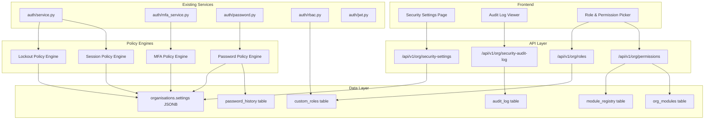
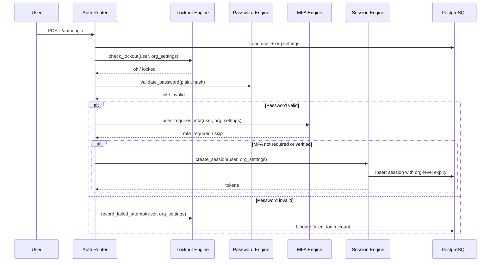

# Design Document — Org Security Settings

## Overview

This feature transforms OraInvoice's hardcoded security parameters into org-level configurable settings, accessible through a new "Security" section in the Settings page. It covers six functional areas: MFA enforcement (with per-role and per-user granularity), password policies (complexity, expiry, history), account lockout configuration, custom roles with dynamic permissions derived from the module registry, session management overrides, and a security audit log viewer.

The design follows a "policy engine" pattern: each security domain (MFA, password, lockout, session) has a backend engine that reads org-level configuration from the `organisations.settings` JSONB column, falling back to current hardcoded defaults when no org-level config exists. This ensures zero-disruption deployment — existing behaviour is preserved until an Org_Admin explicitly configures new values.

The Permission Registry introduces a dynamic permission system that derives available permissions from the `module_registry` table, replacing the static `ROLE_PERMISSIONS` dict in `rbac.py` for custom roles while keeping built-in roles unchanged.

### Key Design Decisions

1. **JSONB over new tables for policies**: MFA, password, lockout, and session policies are stored in the existing `organisations.settings` JSONB column under namespaced keys. This avoids new tables for simple key-value config and leverages the existing pattern.
2. **New `custom_roles` table for roles**: Custom roles need relational integrity (FK to org, created_by user), so they get a dedicated table rather than JSONB.
3. **New `password_history` table**: Password history hashes need per-user tracking with timestamps, requiring a normalised table.
4. **Fallback-first approach**: Every policy engine reads org config first, then falls back to current hardcoded values. No migration of existing data required.
5. **Permission Registry is read-only derivation**: Permissions are computed from `module_registry` + `org_modules` at query time (with Redis caching), not stored separately.

## Architecture



### Request Flow for Policy Enforcement



## Components and Interfaces

### 1. Security Settings Service (`app/modules/auth/security_settings_service.py`)

New service module responsible for reading/writing org security settings.

```python
# Key functions
async def get_security_settings(db: AsyncSession, org_id: UUID) -> OrgSecuritySettings:
    """Read security settings from organisations.settings JSONB, merging with defaults."""

async def update_security_settings(
    db: AsyncSession, org_id: UUID, user_id: UUID,
    updates: SecuritySettingsUpdate, ip_address: str | None, device_info: str | None,
) -> OrgSecuritySettings:
    """Partial update of security settings. Validates, persists, audits."""
```

### 2. Policy Engines

Each engine is a set of pure/async functions in the relevant module:

**MFA Policy Engine** (extends `app/modules/auth/mfa_service.py`):
```python
async def user_requires_mfa_setup(db: AsyncSession, user: User, org_settings: dict) -> bool:
    """Evaluate MFA requirement based on org policy, role, and exclusion list."""
```

**Password Policy Engine** (`app/modules/auth/password_policy.py` — new file):
```python
def validate_password_against_policy(password: str, policy: PasswordPolicy) -> list[str]:
    """Return list of unmet requirements. Empty list = valid."""

async def check_password_history(db: AsyncSession, user_id: UUID, password: str, history_count: int) -> bool:
    """Return True if password matches any of the last N hashes."""

async def record_password_in_history(db: AsyncSession, user_id: UUID, password_hash: str) -> None:
    """Store a password hash in the history table."""

def is_password_expired(user: User, policy: PasswordPolicy) -> bool:
    """Check if user's password age exceeds the configured expiry days."""
```

**Lockout Policy Engine** (refactors constants in `app/modules/auth/service.py`):
```python
def get_lockout_policy(org_settings: dict) -> LockoutPolicy:
    """Extract lockout policy from org settings, falling back to hardcoded defaults."""
```

**Session Policy Engine** (extends `app/modules/auth/jwt.py` and session creation):
```python
def get_session_policy(org_settings: dict) -> SessionPolicy:
    """Extract session policy from org settings, falling back to global config."""
```

### 3. Permission Registry (`app/modules/auth/permission_registry.py` — new file)

```python
STANDARD_ACTIONS = ["create", "read", "update", "delete"]

async def get_available_permissions(db: AsyncSession, org_id: UUID) -> list[PermissionGroup]:
    """Derive permissions from module_registry + org_modules. Returns grouped by module."""

def evaluate_custom_role_permissions(
    role_permissions: list[str], disabled_modules: set[str],
) -> list[str]:
    """Filter out permissions for disabled modules from a custom role's permission list."""
```

### 4. Custom Roles Service (`app/modules/auth/custom_roles_service.py` — new file)

```python
async def list_roles(db: AsyncSession, org_id: UUID) -> list[RoleResponse]:
    """List built-in + custom roles for the org."""

async def create_custom_role(db: AsyncSession, org_id: UUID, ...) -> CustomRole:
async def update_custom_role(db: AsyncSession, role_id: UUID, ...) -> CustomRole:
async def delete_custom_role(db: AsyncSession, role_id: UUID, ...) -> None:
```

### 5. Security Audit Log Service (`app/modules/auth/security_audit_service.py` — new file)

```python
async def get_security_audit_log(
    db: AsyncSession, org_id: UUID,
    filters: AuditLogFilters,
) -> AuditLogPage:
    """Query audit_log for security-related actions, paginated."""
```

### 6. API Router (`app/modules/auth/security_settings_router.py` — new file)

```
GET  /api/v1/org/security-settings      → OrgSecuritySettings
PUT  /api/v1/org/security-settings      → OrgSecuritySettings
GET  /api/v1/org/security-audit-log     → AuditLogPage
GET  /api/v1/org/roles                  → RoleListResponse
POST /api/v1/org/roles                  → RoleResponse
PUT  /api/v1/org/roles/{role_id}        → RoleResponse
DELETE /api/v1/org/roles/{role_id}      → {message: str}
GET  /api/v1/org/permissions            → PermissionListResponse
```

All endpoints gated with `require_role("org_admin")`.

### 7. Frontend Components


New page: `frontend/src/pages/settings/SecuritySettings.tsx`

Sub-components:
- `MfaEnforcementSection.tsx` — MFA mode selector, exclusion list
- `PasswordPolicySection.tsx` — complexity fields, expiry, history
- `LockoutPolicySection.tsx` — threshold and duration fields
- `RolesPermissionsSection.tsx` — role list, create/edit modal with permission picker
- `SessionPolicySection.tsx` — token lifetime, max sessions, exclusions
- `SecurityAuditLogSection.tsx` — filterable, paginated audit log table

Integration into `Settings.tsx`:
- Add `'security'` to `SettingsSection` union type
- Add nav item `{ id: 'security', label: 'Security', icon: '🔒', adminOnly: true }` after `'users'` and before `'billing'`
- Add `SecuritySettings` to `SECTION_COMPONENTS` map

### 8. RBAC Integration for Custom Roles

The existing `has_permission()` function in `rbac.py` already accepts an `overrides` parameter. For custom roles, the approach is:

1. When a user has a custom role (stored as their `role` field or via a new `custom_role_id` FK on `users`), the auth middleware loads the custom role's permissions from the `custom_roles` table.
2. The `enforce_rbac` middleware is extended to check custom role permissions via the Permission Registry, filtering out disabled module permissions at evaluation time.
3. Built-in roles continue using the static `ROLE_PERMISSIONS` dict unchanged.

## Data Models

### Org Security Settings JSONB Schema

Stored in `organisations.settings` under namespaced keys:

```json
{
  "mfa_policy": {
    "mode": "optional",
    "excluded_user_ids": []
  },
  "password_policy": {
    "min_length": 8,
    "require_uppercase": false,
    "require_lowercase": false,
    "require_digit": false,
    "require_special": false,
    "expiry_days": 0,
    "history_count": 0
  },
  "lockout_policy": {
    "temp_lock_threshold": 5,
    "temp_lock_minutes": 15,
    "permanent_lock_threshold": 10
  },
  "session_policy": {
    "access_token_expire_minutes": 30,
    "refresh_token_expire_days": 7,
    "max_sessions_per_user": 5,
    "excluded_user_ids": [],
    "excluded_roles": []
  }
}
```

### New Table: `custom_roles`

```sql
CREATE TABLE custom_roles (
    id UUID PRIMARY KEY DEFAULT gen_random_uuid(),
    org_id UUID NOT NULL REFERENCES organisations(id),
    name VARCHAR(100) NOT NULL,
    slug VARCHAR(100) NOT NULL,
    description TEXT,
    permissions JSONB NOT NULL DEFAULT '[]',
    is_system BOOLEAN NOT NULL DEFAULT false,
    created_by UUID REFERENCES users(id),
    created_at TIMESTAMPTZ NOT NULL DEFAULT now(),
    updated_at TIMESTAMPTZ NOT NULL DEFAULT now(),
    UNIQUE(org_id, slug)
);
CREATE INDEX idx_custom_roles_org ON custom_roles(org_id);
```

### New Table: `password_history`

```sql
CREATE TABLE password_history (
    id UUID PRIMARY KEY DEFAULT gen_random_uuid(),
    user_id UUID NOT NULL REFERENCES users(id) ON DELETE CASCADE,
    password_hash VARCHAR(255) NOT NULL,
    created_at TIMESTAMPTZ NOT NULL DEFAULT now()
);
CREATE INDEX idx_password_history_user ON password_history(user_id);
CREATE INDEX idx_password_history_created ON password_history(user_id, created_at DESC);
```

### New Column: `users.password_changed_at`

```sql
ALTER TABLE users ADD COLUMN password_changed_at TIMESTAMPTZ;
```

Used by the Password Policy Engine to determine password age for expiry enforcement.

### New Column: `users.custom_role_id`

```sql
ALTER TABLE users ADD COLUMN custom_role_id UUID REFERENCES custom_roles(id) ON DELETE SET NULL;
```

When set, the RBAC system uses the custom role's permissions instead of the built-in `ROLE_PERMISSIONS` dict. The existing `role` column remains for backward compatibility and built-in role assignment.

### Pydantic Schemas (`app/modules/auth/security_settings_schemas.py`)

```python
class MfaPolicy(BaseModel):
    mode: Literal["optional", "mandatory_all", "mandatory_admins_only"] = "optional"
    excluded_user_ids: list[UUID] = []

class PasswordPolicy(BaseModel):
    min_length: int = Field(default=8, ge=8, le=128)
    require_uppercase: bool = False
    require_lowercase: bool = False
    require_digit: bool = False
    require_special: bool = False
    expiry_days: int = Field(default=0, ge=0, le=365)
    history_count: int = Field(default=0, ge=0, le=24)

class LockoutPolicy(BaseModel):
    temp_lock_threshold: int = Field(default=5, ge=3, le=10)
    temp_lock_minutes: int = Field(default=15, ge=5, le=60)
    permanent_lock_threshold: int = Field(default=10, ge=5, le=20)

class SessionPolicy(BaseModel):
    access_token_expire_minutes: int = Field(default=30, ge=5, le=120)
    refresh_token_expire_days: int = Field(default=7, ge=1, le=90)
    max_sessions_per_user: int = Field(default=5, ge=1, le=10)
    excluded_user_ids: list[UUID] = []
    excluded_roles: list[str] = []

class OrgSecuritySettings(BaseModel):
    mfa_policy: MfaPolicy = MfaPolicy()
    password_policy: PasswordPolicy = PasswordPolicy()
    lockout_policy: LockoutPolicy = LockoutPolicy()
    session_policy: SessionPolicy = SessionPolicy()

class SecuritySettingsUpdate(BaseModel):
    """Partial update — all fields optional."""
    mfa_policy: MfaPolicy | None = None
    password_policy: PasswordPolicy | None = None
    lockout_policy: LockoutPolicy | None = None
    session_policy: SessionPolicy | None = None

class LockoutPolicyUpdate(LockoutPolicy):
    @model_validator(mode="after")
    def permanent_gt_temporary(self) -> "LockoutPolicyUpdate":
        if self.permanent_lock_threshold <= self.temp_lock_threshold:
            raise ValueError("permanent_lock_threshold must be greater than temp_lock_threshold")
        return self

class CustomRoleCreate(BaseModel):
    name: str = Field(min_length=1, max_length=100)
    description: str | None = None
    permissions: list[str]

class CustomRoleUpdate(BaseModel):
    name: str | None = Field(default=None, min_length=1, max_length=100)
    description: str | None = None
    permissions: list[str] | None = None

class RoleResponse(BaseModel):
    id: UUID
    org_id: UUID
    name: str
    slug: str
    description: str | None
    permissions: list[str]
    is_system: bool
    user_count: int
    created_at: datetime

class PermissionItem(BaseModel):
    key: str  # e.g. "invoices.create"
    label: str  # e.g. "Create Invoices"

class PermissionGroup(BaseModel):
    module_slug: str
    module_name: str
    permissions: list[PermissionItem]

class AuditLogFilters(BaseModel):
    start_date: datetime | None = None
    end_date: datetime | None = None
    action: str | None = None
    user_id: UUID | None = None
    page: int = Field(default=1, ge=1)
    page_size: int = Field(default=25)

class AuditLogEntry(BaseModel):
    id: UUID
    timestamp: datetime
    user_email: str | None
    action: str
    action_description: str
    ip_address: str | None
    browser: str | None
    os: str | None
    entity_type: str | None
    entity_id: str | None
    before_value: dict | None
    after_value: dict | None

class AuditLogPage(BaseModel):
    items: list[AuditLogEntry]
    total: int
    page: int
    page_size: int
    truncated: bool = False  # True when >10,000 entries matched
```

### Action Description Mapping

```python
ACTION_DESCRIPTIONS: dict[str, str] = {
    "auth.login_success": "Successful Login",
    "auth.login_failed_invalid_password": "Failed Login — Invalid Password",
    "auth.login_failed_unknown_email": "Failed Login — Unknown Email",
    "auth.login_failed_account_inactive": "Failed Login — Account Inactive",
    "auth.login_failed_account_locked": "Failed Login — Account Locked",
    "auth.login_failed_ip_blocked": "Failed Login — IP Blocked",
    "auth.mfa_verified": "MFA Verified",
    "auth.mfa_failed": "MFA Failed",
    "auth.password_changed": "Password Changed",
    "auth.password_reset": "Password Reset",
    "auth.session_revoked": "Session Revoked",
    "auth.all_sessions_revoked": "All Sessions Revoked",
    "org.mfa_policy_updated": "MFA Policy Updated",
    "org.security_settings_updated": "Security Settings Updated",
    "org.custom_role_created": "Custom Role Created",
    "org.custom_role_updated": "Custom Role Updated",
    "org.custom_role_deleted": "Custom Role Deleted",
}
```


## Correctness Properties

*A property is a characteristic or behavior that should hold true across all valid executions of a system — essentially, a formal statement about what the system should do. Properties serve as the bridge between human-readable specifications and machine-verifiable correctness guarantees.*

### Property 1: MFA Policy Engine evaluates correctly for all users and modes

*For any* user (with any role), *for any* MFA policy mode (`optional`, `mandatory_all`, `mandatory_admins_only`), and *for any* exclusion list, the MFA Policy Engine should return:
- `false` when mode is `optional`
- `false` when the user is in the exclusion list (regardless of mode)
- `true` when mode is `mandatory_all` and user is not excluded
- `true` when mode is `mandatory_admins_only` and user has role `org_admin` or `branch_admin` and is not excluded
- `false` when mode is `mandatory_admins_only` and user has any other role

**Validates: Requirements 1.2, 1.3, 1.4, 1.5**

### Property 2: Org_Admin cannot self-exclude from MFA under mandatory modes

*For any* org_admin user and *for any* mandatory MFA mode (`mandatory_all` or `mandatory_admins_only`), attempting to add that user's own ID to the exclusion list should be rejected with a validation error.

**Validates: Requirements 1.7**

### Property 3: Password validation returns exactly the unmet requirements

*For any* password string and *for any* valid password policy configuration, the `validate_password_against_policy` function should return an error list where each item corresponds to exactly one unmet requirement (length, uppercase, lowercase, digit, special character), and the list is empty if and only if the password satisfies all configured requirements.

**Validates: Requirements 2.3, 2.4**

### Property 4: Password expiry detection is correct

*For any* user with a `password_changed_at` timestamp and *for any* password policy with `expiry_days > 0`, `is_password_expired` should return `true` if and only if the number of days since `password_changed_at` exceeds `expiry_days`. When `expiry_days` is 0, it should always return `false`.

**Validates: Requirements 2.6**

### Property 5: Password history rejects previously used passwords

*For any* user with N password hashes in their history and *for any* `history_count` value, `check_password_history` should return `true` (match found) if the candidate password matches any of the most recent `min(N, history_count)` hashes, and `false` otherwise. When `history_count` is 0, it should always return `false`.

**Validates: Requirements 2.8**

### Property 6: Security settings round-trip persistence

*For any* valid `OrgSecuritySettings` object (with all fields within their allowed ranges), saving it to the `organisations.settings` JSONB and reading it back should produce an equivalent `OrgSecuritySettings` object.

**Validates: Requirements 2.2, 3.2, 5.2**

### Property 7: Lockout engine applies correct thresholds

*For any* user and *for any* valid lockout policy, when `failed_login_count` reaches `temp_lock_threshold`, the account should be temporarily locked for `temp_lock_minutes`. When `failed_login_count` reaches `permanent_lock_threshold`, the account should be deactivated (`is_active = false`). When `failed_login_count` is below `temp_lock_threshold`, no lockout should be applied.

**Validates: Requirements 3.3, 3.4**

### Property 8: Permanent lock threshold must exceed temporary lock threshold

*For any* pair of integers `(temp_threshold, permanent_threshold)` where `permanent_threshold <= temp_threshold`, the `LockoutPolicy` validator should reject the configuration. For any pair where `permanent_threshold > temp_threshold` (both within allowed ranges), it should accept.

**Validates: Requirements 3.7**

### Property 9: Permission Registry derives permissions from module registry

*For any* set of modules in the `module_registry` table, the Permission Registry should generate permission keys in the format `{module_slug}.{action}` for each standard action (`create`, `read`, `update`, `delete`), and the set of generated module slugs should exactly match the set of module slugs in the registry.

**Validates: Requirements 4.1, 4.2**

### Property 10: Disabled modules are excluded from effective custom role permissions

*For any* custom role with a set of permission keys and *for any* set of disabled module slugs, `evaluate_custom_role_permissions` should return only permissions whose module prefix is not in the disabled set, while the stored permission list remains unchanged.

**Validates: Requirements 4.4, 4.7**

### Property 11: Custom role permissions are used for users with custom roles

*For any* user assigned a custom role with a specific permission list, `has_permission` should return `true` for permissions in that list and `false` for permissions not in that list (after module filtering), regardless of what the static `ROLE_PERMISSIONS` dict says for any built-in role.

**Validates: Requirements 4.6**

### Property 12: Built-in roles cannot be deleted

*For any* built-in role slug (`global_admin`, `org_admin`, `branch_admin`, `location_manager`, `salesperson`, `staff_member`, `kiosk`, `franchise_admin`), attempting to delete it should be rejected.

**Validates: Requirements 4.8**

### Property 13: Session policy engine respects org overrides and exclusions

*For any* user and *for any* org session policy, the Session Policy Engine should return org-level values unless the user (by ID or role) is in the exclusion list, in which case it should return global defaults. When no org-level session policy exists, it should always return global defaults.

**Validates: Requirements 5.3, 5.4, 5.5**

### Property 14: Session limit enforcement revokes oldest sessions

*For any* user with N active sessions and *for any* new `max_sessions_per_user` value M where M < N, after the next login the user should have at most M active sessions, and the revoked sessions should be the N - M oldest by `created_at`.

**Validates: Requirements 5.7**

### Property 15: Audit log query returns only org-scoped security actions in correct order

*For any* org ID, *for any* date range filter, action filter, and user filter, all returned audit log entries should: (a) belong to the queried org, (b) have a security-related action prefix (`auth.` or `org.mfa_policy_updated` or `org.security_settings_updated` or `org.custom_role_*`), (c) match all applied filters, (d) be ordered descending by `created_at`, and (e) not exceed the requested `page_size`.

**Validates: Requirements 6.1, 6.3, 6.4, 6.5**

### Property 16: Audit log entries contain all required fields with human-readable descriptions

*For any* audit log entry returned by the Security Audit Log service, the response should include `timestamp`, `user_email` (resolved from user_id), `action`, `action_description` (a non-empty human-readable string), `ip_address`, `browser`, and `os`. For any known action key in `ACTION_DESCRIPTIONS`, the `action_description` should match the mapped value.

**Validates: Requirements 6.2, 6.6**

### Property 17: Partial settings update preserves unmodified sections

*For any* existing `OrgSecuritySettings` and *for any* `SecuritySettingsUpdate` that modifies only a subset of sections, after applying the update, the unmodified sections should remain identical to their previous values.

**Validates: Requirements 7.2**

### Property 18: Settings validation rejects out-of-range values

*For any* field in the security settings schemas with a defined range constraint (`min_length` 8–128, `expiry_days` 0–365, `history_count` 0–24, `temp_lock_threshold` 3–10, `temp_lock_minutes` 5–60, `permanent_lock_threshold` 5–20, `access_token_expire_minutes` 5–120, `refresh_token_expire_days` 1–90, `max_sessions_per_user` 1–10), any value outside the range should be rejected by Pydantic validation, and any value within the range should be accepted.

**Validates: Requirements 7.3, 8.1, 8.2, 8.4, 8.5**

### Property 19: Security endpoints reject non-admin users

*For any* user with a role other than `org_admin` (and not `global_admin`), all security settings endpoints should return HTTP 403.

**Validates: Requirements 7.4**

## Error Handling

### API Validation Errors

- All Pydantic validation errors return HTTP 422 with a structured error body listing each invalid field and the constraint violated.
- The `LockoutPolicy` cross-field validator (`permanent_lock_threshold > temp_lock_threshold`) returns a clear message: `"permanent_lock_threshold must be greater than temp_lock_threshold"`.
- MFA self-exclusion attempts return HTTP 400 with message: `"Cannot exclude yourself from MFA enforcement"`.
- Deleting a built-in role returns HTTP 400 with message: `"Cannot delete built-in role"`.
- Deleting a custom role with assigned users returns HTTP 409 with `{ "message": "Role is assigned to N users", "user_count": N }` — the frontend shows a confirmation dialog.

### Policy Engine Fallbacks

- All policy engines gracefully handle missing or malformed JSONB keys by falling back to hardcoded defaults. No exception is raised for missing config.
- If `organisations.settings` is `NULL` or `{}`, all engines return default policies.

### Audit Log Edge Cases

- When `user_id` in an audit log entry references a deleted user, `user_email` is returned as `null` (not an error).
- When `device_info` cannot be parsed into browser/OS, both fields are returned as `null`.
- When the query matches >10,000 entries, the response includes `truncated: true` and only the most recent 10,000 entries.

### Password History

- `check_password_history` uses bcrypt `checkpw` against stored hashes — this is intentionally slow (O(N) bcrypt comparisons for N history entries). The maximum `history_count` of 24 bounds this to at most 24 comparisons.
- If the `password_history` table has fewer entries than `history_count`, only the available entries are checked.

## Testing Strategy

### Property-Based Testing (Hypothesis)

The project already uses Hypothesis for property-based tests (see `pyproject.toml` dev dependencies). Each correctness property above maps to a single Hypothesis test.

**Configuration:**
- Minimum 100 examples per test (`@settings(max_examples=100)`)
- Each test tagged with a comment: `# Feature: org-security-settings, Property N: <title>`
- Test file: `tests/test_org_security_settings_property.py`

**Key generators needed:**
- `st_mfa_policy()` — generates random MFA policy configs (mode, exclusion lists)
- `st_password_policy()` — generates random password policies within valid ranges
- `st_lockout_policy()` — generates random lockout policies within valid ranges
- `st_session_policy()` — generates random session policies within valid ranges
- `st_password(policy)` — generates passwords that may or may not satisfy a given policy
- `st_user(roles)` — generates user-like objects with random roles and IDs
- `st_audit_entries(org_id)` — generates audit log entries with random actions and timestamps

**Properties to implement:**
1. MFA policy evaluation (Property 1)
2. Admin self-exclusion rejection (Property 2)
3. Password validation correctness (Property 3)
4. Password expiry detection (Property 4)
5. Password history check (Property 5)
6. Settings round-trip persistence (Property 6)
7. Lockout threshold application (Property 7)
8. Lockout threshold ordering validation (Property 8)
9. Permission derivation from module registry (Property 9)
10. Disabled module permission filtering (Property 10)
11. Custom role permission evaluation (Property 11)
12. Built-in role deletion prevention (Property 12)
13. Session policy with exclusions (Property 13)
14. Session limit enforcement (Property 14)
15. Audit log query correctness (Property 15)
16. Audit log entry completeness (Property 16)
17. Partial update preservation (Property 17)
18. Range validation (Property 18)
19. Role-based endpoint access (Property 19)

### Unit Tests

Unit tests complement property tests for specific examples, edge cases, and integration points:

- **Edge cases**: Empty org settings (all defaults), `history_count=0` (no history check), `expiry_days=0` (no expiry), single-session limit
- **Integration**: API endpoint round-trips (create settings → GET → verify), custom role CRUD lifecycle, audit log pagination with real DB
- **Specific examples**: Known password against known policy, specific lockout sequence (5 failures → temp lock → 5 more → permanent lock)
- **Error conditions**: Invalid JSON in settings JSONB, deleted user references in audit log, concurrent session creation race conditions

### Frontend Tests

- Component rendering tests for each section (Vitest + React Testing Library)
- Navigation visibility based on role
- Form validation feedback display
- Permission picker grouping by module

### Migration

- Alembic migration for `custom_roles` table, `password_history` table, `users.password_changed_at` column, and `users.custom_role_id` column
- Migration should be idempotent (use `IF NOT EXISTS` patterns per project conventions)
- Update `ck_users_role` CHECK constraint to allow custom role slugs (or remove the constraint since custom roles are validated at the application level)
