# Design Document — Organisation Employee Portal

## Overview

The Organisation Employee Portal gives each organisation an optional, self-contained login surface for its own staff, reachable at an organisation-branded URL derived from a unique organisation slug. An `org_admin` enables the portal from organisation settings, picks a unique slug (validated live against a real-time availability check), and the platform exposes a branded login at that slug. Employees authenticate against **dedicated, organisation-scoped portal-user credentials** that are stored in a separate identity store from the global org-user (`users`) pool, so a portal user can never authenticate against the staff app and a staff app credential can never authenticate as a portal user.

This feature is, by deliberate design, a **near-clone of the B2B Fleet Portal** (`app/modules/fleet_portal/`): a cookie-authenticated, org-scoped, non-staff portal-user login surface with its own HttpOnly session cookie, its own readable double-submit CSRF cookie, path-scoped cookies, per-account lockout, and a dedicated audit log. The customer portal (`app/modules/portal/`) and the fleet portal continue to operate unchanged in parallel. We mirror the fleet pattern rather than reinventing it.

A hard prerequisite is that employee identity resolves to **exactly one** staff member per organisation. The `staff_members` table today has no database-level uniqueness on email or employee identifier — the only guard is the racy, case-sensitive, app-level `_check_duplicates`. This feature introduces **database-enforced, org-scoped, case-insensitive** uniqueness for staff identity (plus a de-duplication migration step) so the portal can resolve one staff member per login.

The feature also extends the single Capacitor mobile app (`mobile/`) with a first-run **Portal_Type_Selector** (Employee/Staff, Fleet, Organisation), an organisation lookup for the employee/fleet portals, per-portal API base/origin resolution, and persistence via Capacitor Preferences so the selection survives app restarts until logout or an explicit "switch portal" action.

### Open design decisions — resolved

These five decisions (D1–D5 from `requirements.md`) are resolved here with rationale; the rest of the design builds on them.

#### D1 — Web URL path shape for the branded login → **`/e/{slug}`**

The active web app (`frontend-v2/src/App.tsx`) has these top-level public route shapes already claimed:

- `/portal/:token`, `/portal/recover`, `/portal/signed-out`, `/portal/:token/payment-success` (customer portal)
- `/book/:orgSlug` (public booking), `/pay/:token`, `/public/staff-roster/:token`, `/onboard/:token`, `/payments/qr-*`
- `/login`, `/signup`, `/dashboard`, `/admin/*`, and every authenticated org route
- a final **catch-all `<Route path="*" element={<PublicPageRenderer />} />`** that resolves *any* unclaimed top-level segment as a marketing/editor-published page slug
- the **fleet portal** is a separate front-end app served under `/fleet`

A bare `/{org_slug}` (the requirement's illustrative `localhost/acme`) is **rejected**: it collides directly with the `PublicPageRenderer` catch-all, which already treats every top-level segment as a candidate marketing-page slug. Resolving `/acme` would be ambiguous between "org slug" and "published page slug", and would force the catch-all to consult the org-slug table on every unmatched URL.

**Decision: a dedicated, reserved single-segment prefix `/e/{slug}`** (e.g. `/e/acme`). Rationale:

- It is short and memorable (satisfies the "memorable address" user story) while occupying exactly **one** reserved top-level segment, `e`, that is trivially added to `Reserved_Slug` and to the React route table *above* the catch-all.
- It cannot collide with `/portal`, `/fleet`, `/public`, `/book`, `/pay`, `/onboard`, `/login`, `/signup`, `/admin`, or any editor page slug, because `e` is reserved platform-wide (R8.4, R8.5).
- Authenticated portal pages nest under the same prefix (`/e/{slug}/...`), so a single React route subtree and a single cookie path (`/e`) cover the whole portal — exactly mirroring how fleet uses `/fleet`.
- The matching **backend** API surface is mounted under **`/e/api/...`** so the session/CSRF cookies are path-scoped to `/e` and are sent on both the SPA navigation and its XHR calls — a 1:1 mirror of the fleet portal's `/fleet` + `/fleet/api` split.

Alternatives considered and recorded: `/org/{slug}/login` (more verbose; `/org` is close to existing admin org URLs and less brandable) and `/staff-portal/{slug}` (clear but long). `/e/{slug}` wins on brevity + a single clean reserved segment; `staff-portal` is also added to `Reserved_Slug` defensively.

#### D2 — Slug mutability → **changeable by `org_admin`, immediate hard cut-over, old slug freed**

**Decision:** a slug is **mutable** by an `org_admin`. On change to a value that passes all of R2.2–R2.6, the new slug takes effect **immediately** and the **old slug is freed for reuse** (hard cut-over — no redirect, no grace window). Rationale:

- Slug changes are rare, deliberate, admin-initiated events; building redirect/grace infrastructure (a slug-history table, 301 handling, TTL expiry) is disproportionate to the value.
- Freeing the old slug avoids permanent hoarding of the global slug namespace by abandoned values.
- Save-time re-validation (R2.9) already re-checks `Reserved_Slug` + global uniqueness, so the change path is safe against races.

**Old-URL behaviour (R2.11):** after a change, the previous slug no longer resolves. A request to the old `/e/{old}` returns the **same** neutral "portal unavailable / not found" page that any unknown slug returns (R8.3) — it does **not** reveal that the org moved, and it does **not** redirect. This is the hard cut-over branch of R2.9/R2.11; the immutable-after-set branch (R2.10) is therefore **not** adopted.

#### D3 — MVP employee-portal scope → **profile view + roster/schedule view only**

**Decision:** the MVP capability floor (R7.2) is exactly two read surfaces for the authenticated staff member:

1. **Profile view** — the staff member's own profile sourced from the **onboarding-collected** `staff_members` fields (name, contact, employment basics; PII like IRD/bank is masked, reusing `app/modules/staff/security.py`).
2. **Roster / schedule view** — the staff member's own roster, sourced from the **existing staff roster viewer** data path (`app/modules/staff/public_router.py` / scheduling), reusing that surface rather than duplicating it (R7.4).

**Explicitly deferred to follow-ups** (R7.6, recorded so reviewers don't flag omissions): **payslips**, **clock in/out**, **leave requests**, and **document access**. These are named candidates in R7.3 but are **out of scope for the MVP** and will not be exposed in this release. When added later, each must obey R7.1/R7.3/R7.5 (own-records-only, owning-staff scoping).

#### D4 — Portal-user data model → **dedicated `employee_portal_users` table**

**Decision:** create a **dedicated `employee_portal_users` table** rather than reusing/extending the fleet `portal_accounts` table. Rationale:

- `portal_accounts.customer_id` is **`NOT NULL`** with an FK to `customers` and a CHECK constraint `portal_user_role IN ('fleet_admin','driver')` plus a `fleet_account_id` FK to `portal_fleet_accounts`. Employees are **not** customers and have **no** fleet account. Reusing the table would mean making `customer_id` nullable, widening the role CHECK, and carrying always-NULL fleet columns — polluting a tightly-constrained fleet model and risking the fleet portal's invariants.
- A dedicated table links cleanly to `staff_members` via `staff_id` (R5.3) and mirrors only the **security-relevant** columns of `portal_accounts` (password hash, lockout state machine, invite/reset tokens) — the shape the fleet portal already proved out.
- Per-org **case-insensitive** email uniqueness (R5.2) is enforced with a partial unique index on `(org_id, lower(email)) WHERE is_active`, identical in spirit to the fleet portal's `lower(email)` index.

The behaviour specified by R4/R5 (issuance, invite, lockout, revoke) is independent of the table choice, so this decision is purely structural.

#### D5 — Slug storage → **dedicated indexed column `organisations.slug`**

**Decision:** store the slug as a **dedicated `organisations.slug` column** (nullable `text`) with a **unique functional index on `lower(slug)`**, *not* as a `settings` JSONB field. Rationale: the requirement demands **database-enforced** global uniqueness (R2.5), and a JSONB key **cannot** carry a unique constraint across rows. A dedicated column also makes slug→org resolution a fast, indexed lookup on the hot login path. The `employee_portal_enabled` **flag**, by contrast, is a per-org boolean with no uniqueness requirement, so it stays in the existing `settings` JSONB allow-list (`SETTINGS_JSONB_KEYS`) managed by `get_org_settings`/`update_org_settings`.

### Reuse table

This feature reuses the existing portal/auth/staff/email infrastructure wherever possible. We reinvent nothing that already exists.

| Concern | Existing thing we reuse | Source |
|---|---|---|
| Cookie-auth portal-user login (architectural template) | Fleet portal router + session/CSRF cookies + per-account lockout | `app/modules/fleet_portal/router.py`, `services/session_service.py`, `auth.py` |
| HttpOnly session cookie + readable CSRF cookie, path-scoped | `_set_session_cookies` / `_clear_session_cookies` (`fleet_portal_session` + `fleet_portal_csrf`, `path="/fleet"`) | `app/modules/fleet_portal/router.py` |
| Portal account security columns (hash, lockout, invite/reset tokens) | `PortalAccount` shape (password_hash, failed_login_attempts, locked_until, invite_token, reset_token…) | `app/modules/fleet_portal/models.py` |
| Per-account lockout state machine (5 attempts → 15 min) | `check_locked` / `record_failed_attempt` / `reset_lockout` | `app/modules/fleet_portal/auth.py` |
| Portal auth audit log (nullable account id for unknown-email attempts) | `PortalAuditLog` (`portal_audit_log`) | `app/modules/fleet_portal/models.py` |
| JWT bypass for cookie-auth portal prefixes | `PUBLIC_PREFIXES` (contains `/fleet/api/`); add `/e/api/` | `app/middleware/auth.py` (`_is_public`) |
| CSRF exemption for portal auth endpoints (own CSRF) | `_CSRF_EXEMPT_PREFIXES` (contains `/fleet/api/auth/`); add `/e/api/auth/` | `app/middleware/security_headers.py` |
| Per-IP sliding-window rate limiting (login/lookup/reset) | `RateLimitMiddleware` prefix blocks (`_PUBLIC_STAFF_ROSTER_*`, `_PASSWORD_RESET_PATHS`) | `app/middleware/rate_limit.py` |
| Org settings allow-list + cache invalidation (enablement flag) | `SETTINGS_JSONB_KEYS`, `get_org_settings`, `update_org_settings`, `invalidate_org_settings_cache` | `app/modules/organisations/service.py` |
| Org branding fields (logo, colours, name) | `logo_url`, `primary_colour`, `secondary_colour` in settings; `logo_data`/`logo_content_type` on `organisations` | `app/modules/organisations/service.py`, `app/modules/admin/models.py` |
| Staff identity + app-level dup check to align | `StaffMember`, `_check_duplicates` | `app/modules/staff/models.py`, `app/modules/staff/service.py` |
| Staff roster viewer (MVP roster source) | `staff_public_router` + roster token viewer | `app/modules/staff/public_router.py` |
| Onboarding link as login destination (R5.4) | `StaffOnboardingToken` + onboarding submit | `.kiro/specs/staff-onboarding-link/`, `app/modules/staff/models.py` |
| PII masking on profile read | `mask_ird` / `mask_bank_account` | `app/modules/staff/security.py` |
| Password hashing / verification | bcrypt verify/hashing helpers used by fleet portal auth | `app/modules/fleet_portal/auth.py` |
| Multi-provider email + failover (credential-setup + reset) | `EmailMessage` + `send_email` + `render_transactional_html(... cta_url, cta_label)` | `app/integrations/email_sender.py` |
| Token entropy | `secrets.token_urlsafe(32)` | `app/modules/fleet_portal/services/session_service.py` |
| Audit log (org settings changes) | `write_audit_log` | `app/core/audit.py` |
| Mobile API client + Capacitor base-URL switch | `apiClient`, `Capacitor.isNativePlatform()` base resolution | `mobile/src/api/client.ts` |
| Mobile auth/session context | `AuthProvider` / `useAuth` | `mobile/src/contexts/AuthContext.tsx` |
| Mobile persisted key/value (survives restart) | `@capacitor/preferences` (Preferences API) | `mobile/` (Capacitor 7 plugin set per steering) |
| RLS tenant isolation (org-scoped queries) | PostgreSQL RLS + `app.current_org_id` GUC pattern | platform-wide (`_set_rls_org_id` usage in public routers) |
| Alembic CONCURRENTLY index + idempotent guards | database-migration-checklist steering, prior staff index migrations | `alembic/versions/0204_staff_phase1_indexes.py` |

### Requirements coverage map

- **R1** — DB-enforced org-scoped case-insensitive staff uniqueness → *Data Models* (partial unique indexes), *Migration plan* (dedup-before-constraint), *Components* (aligned `_check_duplicates`)
- **R2** — Unique org slug, format/reserved/uniqueness rules, mutability (D2) → *Data Models* (`organisations.slug` + unique index), *Components* (slug set + validation), *Security*
- **R3** — Real-time slug availability check → *Components* (`GET /api/v2/organisations/slug-availability`), *Architecture* (debounce), *Error Handling*
- **R4** — Enable/disable portal, org_admin-only, audit, session invalidation → *Components* (settings endpoints), *Data Models* (enablement flag), *Security*
- **R5** — Credential issuance, invite, per-org email uniqueness, revoke → *Data Models* (`employee_portal_users`), *Components* (issuance/invite/revoke endpoints)
- **R6** — Login + session (cookies, lockout, CSRF, idle/absolute timeout, single-org resolution) → *Architecture* (login sequence), *Data Models* (sessions + cookies), *Components*, *Security*
- **R7** — Portal capabilities + own-records-only scoping (D3 MVP) → *Components* (profile + roster), *Security* (tenant isolation), *Scope decisions*
- **R8** — Web routing (D1 `/e/{slug}`), collision avoidance, Reserved_Slug, HTTPS, noindex → *Architecture* (routing), *Components* (web routes + branding resolve), *Security*
- **R9** — Slug-resolution endpoint for mobile lookup (disambiguation, minimal exposure, rate limit) → *Components* (`GET /api/v2/public/portal-resolve`), *Security*
- **R10** — Mobile first-run Portal_Type_Selector → *Components* (mobile screens), *Architecture* (mobile sequence)
- **R11** — Mobile persistence + switching of portal selection, per-portal base/origin → *Components* (mobile `PortalSelectionContext` + Preferences), *Architecture*
- **R12** — Mobile error/offline states → *Components* (mobile), *Error Handling*
- **R13** — Org-branded login presentation (web + mobile) → *Components* (branding resolve + branded login), *Error Handling*
- **R14** — Employee portal password reset → *Components* (reset endpoints), *Data Models* (reset token), *Security*
- **R15** — Credential-issuance + reset email notifications → *Components* (`employee_portal_delivery`), *Error Handling*
- **R16** — Security, tenant isolation, auditing, rate limits, cookie rejection → *Security*
- **R17** — Migration & backward compatibility → *Migration plan*
- **R18** — Trade-family gating decision → *Scope and gating decisions*
- **R19** — Versioning & changelog → *Migration plan* (changelog), *Components* (mobile version surface)

### Scope and gating decisions

These are explicit, documented decisions so a reviewer does not flag them as omissions.

- **Trade-family gating: none for the portal as a whole (universal feature).** Per R18 and the always-loaded trade-family-gating steering, the Employee Portal is a universal capability — every trade family hires staff who view their profile and roster. We therefore apply **no** `tradeFamily` gate to the portal, its login, its profile view, or its roster view (R18.1). The MVP surfaces (profile, roster) carry **no** trade-specific data, so no internal gated sub-region applies yet (R18.2/R18.3). Should a future capability surface trade-specific data, it will use the standard frontend element gating + conditional payload inclusion, treating a null/unset trade family as `automotive-transport` (R18.4).
- **Enablement gating: per-org runtime flag, not a module/trade gate.** The portal is reachable only when `employee_portal_enabled = true` **and** a valid slug is set (R4.4). This is a runtime org setting, distinct from trade-family or subscription-module gating.
- **Mobile scope.** The mobile app historically serves **org users only** (per the mobile steering). This feature deliberately widens that: the same Capacitor app now also routes **employee** and **fleet** portal-users via the Portal_Type_Selector. The selector and the employee/fleet branded logins are **new mobile surfaces**; the existing org-user login flow is unchanged and existing org-user sessions are never forced to re-select (R17.4). How `AuthContext`/base-URL switch per portal type is specified in *Components → Mobile*.

## Architecture

### Component / data-model diagram

```mermaid
flowchart TB
  subgraph Web["frontend-v2 (React + Vite)"]
    SettingsUI["Org Settings → Employee Portal panel<br/>slug input + live availability<br/>enable/disable toggle"]
    BrandedLogin["/e/{slug}  EmployeePortalLogin<br/>(public, branded, noindex)"]
    PortalApp["/e/{slug}/...  EmployeePortalApp<br/>profile + roster (MVP)"]
    Catchall["* PublicPageRenderer<br/>(marketing/editor — unchanged)"]
  end

  subgraph Mobile["mobile/ (Capacitor 7)"]
    Selector["PortalTypeSelector (first-run)<br/>Employee / Fleet / Organisation"]
    OrgLookup["OrgLookupScreen<br/>name-or-slug input"]
    MobileBranded["EmployeePortalLoginScreen<br/>(branded)"]
    PortalSelCtx["PortalSelectionContext<br/>(Capacitor Preferences)"]
  end

  subgraph AdminAPI["Authenticated org API (/api/v2, JWT)"]
    SlugAvail["GET /organisations/slug-availability"]
    SlugSet["PUT /organisations/slug + portal toggle"]
    Issue["POST /staff/{id}/portal-access (issue/revoke)"]
  end

  subgraph PublicAPI["Public API (no JWT)"]
    Resolve["GET /api/v2/public/portal-resolve<br/>(mobile lookup, rate-limited)"]
    Branding["GET /e/api/branding/{slug}<br/>(web branded login)"]
  end

  subgraph PortalAPI["Employee portal API (/e/api, cookie auth)"]
    PLogin["POST /e/api/auth/login"]
    PLogout["POST /e/api/auth/logout"]
    PMe["GET /e/api/auth/me"]
    PReset["POST /e/api/auth/password/reset-request|reset"]
    PSetPw["POST /e/api/auth/accept-invite/{token}"]
    PProfile["GET /e/api/profile"]
    PRoster["GET /e/api/roster"]
  end

  subgraph Services["Service layer"]
    SlugSvc["slug_service<br/>normalise / validate / reserved / availability"]
    EPAuth["employee_portal/auth<br/>lockout + password verify (mirrors fleet)"]
    EPSession["employee_portal/session_service<br/>create/destroy/validate"]
    EPAccounts["employee_portal/account_service<br/>issue / invite / reset / revoke"]
    EPDelivery["employee_portal_delivery<br/>credential-setup + reset emails"]
    StaffSvc["StaffService (_check_duplicates aligned)"]
  end

  subgraph Data["PostgreSQL (RLS, org-scoped)"]
    Orgs[("organisations.slug + unique idx")]
    EPU[("employee_portal_users")]
    EPS[("employee_portal_sessions")]
    EPAudit[("employee_portal_audit_log")]
    Staff[("staff_members + partial unique idx")]
  end

  Email["integrations.email_sender.send_email<br/>(multi-provider failover)"]

  SettingsUI --> SlugAvail --> SlugSvc --> Orgs
  SettingsUI --> SlugSet --> Orgs
  Issue --> EPAccounts --> EPU
  Issue --> EPDelivery --> Email
  BrandedLogin --> Branding --> SlugSvc
  BrandedLogin --> PLogin --> EPAuth --> EPU
  PLogin --> EPSession --> EPS
  PortalApp --> PProfile & PRoster
  PProfile --> Staff
  PRoster --> Staff
  PReset --> EPAccounts --> EPDelivery --> Email
  PSetPw --> EPAccounts
  PMe --> EPSession
  Selector --> PortalSelCtx
  OrgLookup --> Resolve --> SlugSvc
  MobileBranded --> PLogin
  EPAuth --> EPAudit
  EPAccounts --> EPAudit
  Catchall -.no collision.-> Orgs
```



### Sequence — Web employee login via the branded slug URL (R6, R8, R13)

```mermaid
sequenceDiagram
  participant E as Employee (browser)
  participant SPA as frontend-v2 SPA
  participant B as GET /e/api/branding/{slug} (public)
  participant L as POST /e/api/auth/login (cookie, CSRF-exempt)
  participant DB as PostgreSQL (RLS)
  participant AU as employee_portal_audit_log

  E->>SPA: navigate /e/acme
  Note over SPA: route sits ABOVE the PublicPageRenderer catch-all;<br/>`<meta name="robots" content="noindex">` injected (R8.7)
  SPA->>B: GET /e/api/branding/acme
  B->>DB: SELECT id, name, branding WHERE lower(slug)=lower('acme')
  alt slug resolves AND employee_portal_enabled
    B-->>SPA: 200 {org_name, logo_url, primary_colour, secondary_colour}
    Note over SPA: render branded login; logo falls back to default<br/>if missing or slow >2s (R13.2, R13.3)
  else not found OR portal disabled
    B-->>SPA: 404 {code:"portal_unavailable"}  (neutral — no existence leak, R8.3)
    SPA-->>E: "This portal is unavailable" page (no login form)
  end

  E->>L: POST {slug:"acme", email, password} + CSRF header/cookie
  L->>DB: resolve org by slug; require enabled (R6.3, R4.5)
  L->>DB: SELECT employee_portal_users WHERE org_id=? AND lower(email)=? AND is_active
  alt portal disabled / slug unknown
    L->>AU: record login_failed (org where known, ip, outcome)
    L-->>E: 403/404 neutral "portal unavailable / invalid" (R4.5, R6.11)
  else account locked (>=5 fails, within 15 min)
    L->>AU: record lockout
    L-->>E: 403 "temporarily locked" (R6.5)
  else bad email/password
    L->>DB: increment failed_login_attempts (only when account exists)
    L->>AU: record login_failed (anti-enumeration, R16.6)
    L-->>E: 401 generic "email or password is invalid" (R6.4)
  else valid
    L->>DB: reset lockout; INSERT employee_portal_sessions (token hash, csrf)
    L->>AU: record login_success
    L-->>E: 200 + Set-Cookie emp_portal_session (HttpOnly) + emp_portal_csrf (readable), path=/e
    Note over E,L: subsequent /e/api/* requests carry the cookies;<br/>state-changing requests must echo CSRF (R6.7, R6.8)
  end
```

### Sequence — Mobile first-run: portal-type selection → resolve → branded login → persistence (R9, R10, R11)

```mermaid
sequenceDiagram
  participant U as Mobile user
  participant App as Capacitor app (App.tsx)
  participant Pref as Capacitor Preferences
  participant Sel as PortalTypeSelector
  participant R as GET /api/v2/public/portal-resolve (public, rate-limited)
  participant DB as PostgreSQL
  participant Login as Branded login (per portal type)

  App->>Pref: get("portal_selection")
  alt persisted + valid
    Pref-->>App: {portal_type, org_id, api_base}
    App->>Login: route directly (no selector) within 3s (R11.3)
  else absent/malformed
    Pref-->>App: null
    App->>Sel: show selector (3 choices, 44px targets) (R10.1, R10.8)
    U->>Sel: pick portal type
    alt Organisation portal
      Sel->>Login: route to existing org-user login (R10.2)
      Sel->>Pref: set portal_selection {type:"org"} (R10.2)
    else Employee/Staff or Fleet
      Sel->>App: prompt org name-or-slug (1..100 chars) (R10.3)
      U->>App: submit query
      App->>R: GET ?q=...&portal_type=employee  (loading spinner, submit disabled) (R10.5)
      R->>DB: resolve slug/name for portal_type where enabled
      alt exactly one match + enabled
        R-->>App: 200 {org_id, org_name, branding}
        App->>Login: route to branded login (R10.4)
        Note over App,Pref: persist AFTER successful login (R11.1)
      else multiple name matches
        R-->>App: 200 {candidates:[{org_name,branding} ...<=10]} (R9.4)
        App->>U: disambiguation list (pick one) → re-resolve by org
      else none / portal disabled
        R-->>App: 404 {code:"not_found"} (no enumeration, R9.3, R9.8)
        App->>U: visible error, retain input, allow retry (R10.6, R12.1, R12.2)
      else timeout >10s or failure
        App->>U: "lookup could not be completed" + retry, retain input (R10.7, R12.3)
      end
    end
  end

  U->>Login: enter credentials → success
  Login->>Pref: set portal_selection {portal_type, org_id, api_base} (R11.1)
  alt persistence fails
    Login->>U: complete session + warn "selection not saved"; show selector next start (R11.2)
  end
  Note over App: "Switch portal" clears Preferences + ends active session,<br/>returns to selector (R11.6, R11.7)
```

### Routing & middleware chain

The portal's three API surfaces slot into the existing middleware stack with minimal, additive wiring:

1. **`/e/api/...` (cookie-auth portal API).** Add `/e/api/` to `PUBLIC_PREFIXES` in `app/middleware/auth.py` so `_is_public()` returns `True` and **no JWT** is required (the portal authenticates via its own session cookie, exactly like `/fleet/api/`). Add `/e/api/auth/` to `_CSRF_EXEMPT_PREFIXES` in `app/middleware/security_headers.py` so the global staff-session CSRF check does not block the portal's own double-submit CSRF mechanism (mirrors `/fleet/api/auth/`).
2. **`/api/v2/public/portal-resolve` (mobile lookup).** Already covered by the existing `/api/v2/public/` entry in `PUBLIC_PREFIXES` — no auth-middleware change.
3. **`/api/v2/organisations/slug-availability` + slug set + portal toggle + credential issuance (admin).** These live on the **existing authenticated** `/api/v2` routers, inheriting JWT + RBAC. The org-settings endpoints already require `org_admin`.

TLS/HTTPS is terminated at nginx (and Cloudflare Tunnel for prod) for all paths, satisfying R8.6 with no app change; the SPA adds a `noindex` robots directive on `/e/*` pages (R8.7). Rate-limit prefixes are added to `app/middleware/rate_limit.py` (see *Components → Rate limiting*).

**nginx routing for `/e/api/` (mandatory — new backend prefix).** The gateway proxies backend traffic via `location /api/`, but the portal API lives at `/e/api/`, which does **not** match `/api/` and would otherwise fall through to `location /` and be served the SPA `index.html` instead of reaching the backend. This is exactly why the fleet portal has a dedicated `location /fleet/api/ { proxy_pass http://backend; }` block. We add an **analogous `location /e/api/ { proxy_pass http://backend; }`** block (same `proxy_set_header`/upstream settings as the `/fleet/api/` and `/api/` blocks) to **every** active gateway config: `nginx/nginx.dev-v2.conf` (local dev), `nginx/nginx.pi-v2.conf` (Pi prod, behind Cloudflare), and the canonical `nginx/nginx.conf`. The SPA routes `/e/{slug}` and `/e/{slug}/...` need **no** new block — they correctly fall through to the existing `location /` → `frontend_v2` SPA, which the React route table resolves above the `PublicPageRenderer` catch-all. Without the `/e/api/` proxy block the entire portal API 404s / returns HTML in every environment, so this block is a hard prerequisite (per the implementation-completeness-checklist "trace every layer: does an nginx location exist for this path?").

The branded login route `/e/{slug}` and its authenticated children are declared in `frontend-v2/src/App.tsx` **above** the `<Route path="*" element={<PublicPageRenderer />} />` catch-all, so React Router's score-based matching resolves them before the marketing catch-all ever sees the path (R8.4). Because `e` is a `Reserved_Slug`, no org slug can ever shadow a real platform route (R8.5).

## Data Models

### `organisations.slug` — new dedicated column (D5, R2)

A nullable `text` column on the existing `organisations` table plus a **unique functional index on `lower(slug)`** (global uniqueness, case-insensitive — R2.5, R2.8). Nullable so the migration needs **no backfill** — existing orgs simply have `slug IS NULL` and the portal disabled (R17.1).

```python
# app/modules/admin/models.py  → Organisation (new column)
slug: Mapped[str | None] = mapped_column(String(63), nullable=True)
```

```sql
-- migration (CONCURRENTLY, idempotent) — global, case-insensitive uniqueness
CREATE UNIQUE INDEX CONCURRENTLY IF NOT EXISTS uq_organisations_slug_lower
  ON organisations (lower(slug))
  WHERE slug IS NOT NULL;
```

The stored value is always the **normalised** form (lowercased, trimmed — R2.7). Normalisation + format validation live in the pure `slug_service` (see *Components*): `[a-z0-9]` plus single internal hyphens, no leading/trailing hyphen, length 3–63 (R2.2). The `employee_portal_enabled` flag is **not** a column — it is added to `SETTINGS_JSONB_KEYS` and defaults to `False`/disabled when absent (R4.1, R17.1).

### `employee_portal_users` — new table (D4, R5)

Dedicated identity store for portal users, linked to `staff_members`. Mirrors the security-relevant columns of `PortalAccount` but rooted at `staff_id` instead of `customer_id`/`fleet_account_id`.

```python
# app/modules/employee_portal/models.py
class EmployeePortalUser(Base):
    """Org-scoped login credential for a staff member's Employee Portal access.

    Separate identity store from the global `users` table (R5.1): a portal
    user can authenticate ONLY at /e/api/auth/*, never at /api/v*/auth/*.
    Validates: Requirements 5.1, 5.2, 5.3, 5.5, 5.6, 5.7, 5.8, 5.9, 5.10, 5.11, 6.5, 14.*.
    """
    __tablename__ = "employee_portal_users"

    id: Mapped[uuid.UUID] = mapped_column(UUID(as_uuid=True), primary_key=True, default=uuid.uuid4)
    org_id: Mapped[uuid.UUID] = mapped_column(
        UUID(as_uuid=True), ForeignKey("organisations.id", ondelete="CASCADE"), nullable=False)
    staff_id: Mapped[uuid.UUID] = mapped_column(
        UUID(as_uuid=True), ForeignKey("staff_members.id", ondelete="CASCADE"), nullable=False)
    email: Mapped[str] = mapped_column(String(255), nullable=False)         # stored lowercased+trimmed
    password_hash: Mapped[str | None] = mapped_column(String(255), nullable=True)
    is_active: Mapped[bool] = mapped_column(Boolean, nullable=False, server_default="true")
    # Lockout state machine (mirrors PortalAccount / fleet auth.py)
    failed_login_attempts: Mapped[int] = mapped_column(Integer, nullable=False, server_default="0")
    locked_until: Mapped[datetime | None] = mapped_column(DateTime(timezone=True), nullable=True)
    # Invite (set-password) — single-use, 7-day validity (R5.5, R5.8, R5.9)
    invite_token_hash: Mapped[str | None] = mapped_column(String(64), nullable=True)
    invite_sent_at: Mapped[datetime | None] = mapped_column(DateTime(timezone=True), nullable=True)
    invite_accepted_at: Mapped[datetime | None] = mapped_column(DateTime(timezone=True), nullable=True)
    # Password reset — single-use, 60-min validity (R14.3, R14.5)
    reset_token_hash: Mapped[str | None] = mapped_column(String(64), nullable=True)
    reset_token_expires_at: Mapped[datetime | None] = mapped_column(DateTime(timezone=True), nullable=True)
    last_login_at: Mapped[datetime | None] = mapped_column(DateTime(timezone=True), nullable=True)
    last_login_ip: Mapped[str | None] = mapped_column(String(45), nullable=True)
    created_at: Mapped[datetime] = mapped_column(DateTime(timezone=True), server_default=func.now(), nullable=False)
    updated_at: Mapped[datetime] = mapped_column(
        DateTime(timezone=True), server_default=func.now(), onupdate=func.now(), nullable=False)
```

**Per-org case-insensitive email uniqueness (R5.2)** — DB-enforced via a partial unique index over active rows (allowing the same email to be re-issued after revoke/deactivation, and across different orgs):

```sql
CREATE UNIQUE INDEX CONCURRENTLY IF NOT EXISTS uq_emp_portal_users_org_email_active
  ON employee_portal_users (org_id, lower(email))
  WHERE is_active;

CREATE INDEX CONCURRENTLY IF NOT EXISTS idx_emp_portal_users_staff ON employee_portal_users (staff_id);
CREATE UNIQUE INDEX CONCURRENTLY IF NOT EXISTS uq_emp_portal_users_invite_hash
  ON employee_portal_users (invite_token_hash) WHERE invite_token_hash IS NOT NULL;
CREATE UNIQUE INDEX CONCURRENTLY IF NOT EXISTS uq_emp_portal_users_reset_hash
  ON employee_portal_users (reset_token_hash) WHERE reset_token_hash IS NOT NULL;
```

The table has **RLS enabled** with the standard `org_id = current_setting('app.current_org_id')::uuid` tenant-isolation policy (R16.3). Invite and reset tokens are stored as **SHA-256 hashes** (never raw) — a DB-read attacker cannot replay a live link. The raw token lives only in the emailed URL (uplift over the fleet portal's raw `invite_token`, justified because these links set/reset credentials).

> **Email normalisation contract.** `email` is always persisted lowercased and trimmed, and the partial unique index keys on `lower(email)`. The app-level issuance check compares `lower(btrim(submitted_email))`, so the application check and the DB constraint produce identical duplicate determinations (R5.2, mirrors R1.9 for staff).

### `employee_portal_sessions` — new table (R6)

A **dedicated** session table (not a reuse of the customer-portal `PortalSession`). Keeping employee sessions in their own table makes cross-portal cookie rejection **structural**: a session token minted for the customer portal, fleet portal, or staff app simply does not exist in `employee_portal_sessions`, so it can never validate here (R6.2, R16.8).

```python
class EmployeePortalSession(Base):
    """HttpOnly-cookie session for an employee portal user.
    Validates: Requirements 6.1, 6.2, 6.9, 6.10, 4.6, 5.10, 5.11, 14.8, 16.8."""
    __tablename__ = "employee_portal_sessions"

    id: Mapped[uuid.UUID] = mapped_column(UUID(as_uuid=True), primary_key=True, default=uuid.uuid4)
    org_id: Mapped[uuid.UUID] = mapped_column(
        UUID(as_uuid=True), ForeignKey("organisations.id", ondelete="CASCADE"), nullable=False)
    portal_user_id: Mapped[uuid.UUID] = mapped_column(
        UUID(as_uuid=True), ForeignKey("employee_portal_users.id", ondelete="CASCADE"), nullable=False)
    session_token_hash: Mapped[str] = mapped_column(String(64), nullable=False, unique=True)  # sha256(raw)
    csrf_token: Mapped[str] = mapped_column(String(64), nullable=False)
    created_at: Mapped[datetime] = mapped_column(DateTime(timezone=True), server_default=func.now(), nullable=False)
    last_seen_at: Mapped[datetime] = mapped_column(DateTime(timezone=True), server_default=func.now(), nullable=False)
    expires_at: Mapped[datetime] = mapped_column(DateTime(timezone=True), nullable=False)  # created + 12h absolute
```

**Session lifetime (R6.10):** absolute lifetime **12 hours** (`expires_at = created_at + 12h`) and **idle timeout 30 minutes** (a request whose `now - last_seen_at > 30 min` is rejected and the row deleted). A valid request touches `last_seen_at`. These mirror the fleet portal's `SESSION_ABSOLUTE_LIFETIME` (12h) with the employee-specific 30-minute idle window required by R6.10. The `session_token_hash` is `sha256(raw_token)`; the raw 32-byte `secrets.token_urlsafe(32)` token lives only in the HttpOnly cookie.

**Bulk invalidation (R4.6, R5.10, R5.11, R14.8):** disabling the portal, revoking access, deactivating the staff member, or completing a password reset all run `DELETE FROM employee_portal_sessions WHERE ...` (by `org_id`, by `portal_user_id`) in the same transaction as the triggering change. Disable-portal invalidates **all** sessions for the org; this is well within the 30-second bound of R4.6 (it is synchronous with the persisted change).

### `employee_portal_audit_log` — new table (R16.5)

Mirrors `PortalAuditLog`: org-scoped, with a **nullable** `portal_user_id` so failed logins against unknown emails are recorded without revealing existence (R16.6).

```python
class EmployeePortalAuditLog(Base):
    """Auth/security event log for the employee portal.
    Validates: Requirements 16.5, 16.6, 4.7."""
    __tablename__ = "employee_portal_audit_log"

    id: Mapped[uuid.UUID] = mapped_column(UUID(as_uuid=True), primary_key=True, default=uuid.uuid4)
    org_id: Mapped[uuid.UUID] = mapped_column(
        UUID(as_uuid=True), ForeignKey("organisations.id", ondelete="CASCADE"), nullable=False)
    portal_user_id: Mapped[uuid.UUID | None] = mapped_column(
        UUID(as_uuid=True), ForeignKey("employee_portal_users.id", ondelete="SET NULL"), nullable=True)
    actor_user_id: Mapped[uuid.UUID | None] = mapped_column(
        UUID(as_uuid=True), ForeignKey("users.id", ondelete="SET NULL"), nullable=True)  # org_admin for admin actions
    action: Mapped[str] = mapped_column(String(80), nullable=False)   # login_success|login_failed|lockout|logout|
                                                                      # password_reset|credential_issued|access_revoked
    outcome: Mapped[str] = mapped_column(String(10), nullable=False)  # success | failure
    ip_address: Mapped[str | None] = mapped_column(String(45), nullable=True)
    details: Mapped[dict | None] = mapped_column(JSONB, nullable=True)
    created_at: Mapped[datetime] = mapped_column(DateTime(timezone=True), server_default=func.now(), nullable=False)
```

The org-settings changes (enable/disable, slug) are audited through the **existing** `write_audit_log` on the `organisations` audit trail (R4.7), recording acting user, previous value, new value, and timestamp.

### `staff_members` — DB-enforced org-scoped uniqueness (R1)

No new columns. We add **two partial unique indexes** scoped to **active** staff (`is_active = true`), keyed on the **normalised** form (R1.2, R1.3, R1.6). "Active" maps to the existing `is_active` boolean (R1.1).

```sql
-- normalised email: trim + lowercase, only over active rows with a real email
CREATE UNIQUE INDEX CONCURRENTLY IF NOT EXISTS uq_staff_active_email_per_org
  ON staff_members (org_id, lower(btrim(email)))
  WHERE is_active AND email IS NOT NULL AND btrim(email) <> '';

-- employee identifier: only over active rows where it is non-null/non-empty
CREATE UNIQUE INDEX CONCURRENTLY IF NOT EXISTS uq_staff_active_employee_id_per_org
  ON staff_members (org_id, employee_id)
  WHERE is_active AND employee_id IS NOT NULL AND btrim(employee_id) <> '';
```

These scope uniqueness to a single org (R1.6) — the same normalised email may be active in different orgs. The concurrent INSERT race (R1.4) is resolved by the DB: two concurrent active inserts with the same normalised email in one org → exactly one commits, the other hits a unique-violation and is rejected (no partial record, since the failing statement rolls back).

**App-level alignment (R1.9).** `StaffService._check_duplicates` is updated so its comparison is **identical** to the index expression: it currently does `col == value.strip()` (case-sensitive). It becomes a normalised, case-insensitive comparison:

```python
# email branch — normalised, active-scoped, matches uq_staff_active_email_per_org
stmt = select(StaffMember.id).where(
    StaffMember.org_id == org_id,
    func.lower(func.btrim(StaffMember.email)) == value.strip().lower(),
    StaffMember.is_active.is_(True),
)
```

So the app check and the DB constraint reach identical duplicate determinations, and a duplicate update/create is rejected with a human-readable "duplicate email" error while the existing staff member is left unchanged (R1.5). The DB index is the **authoritative** guard; the app check exists for friendly pre-validation and to convert the violation into a clean 409/422.

### Session & CSRF cookie design (R6.1, R6.2, R16.7)

Mirrors the fleet portal's `_set_session_cookies` exactly, but with employee-portal names and the `/e` path:

| Cookie | HttpOnly | Readable by JS | Path | Secure | SameSite | Max-Age |
|---|---|---|---|---|---|---|
| `emp_portal_session` | **yes** | no | `/e` | yes in staging/prod | `lax` | 12h |
| `emp_portal_csrf` | no | **yes** (echoed as `X-CSRF-Token`) | `/e` | yes in staging/prod | `lax` | 12h |

- **Path `/e`** scopes both cookies to the employee portal so they are **never** sent to the staff app (`/api/*`), the customer portal, or the fleet portal (`/fleet`) — and those portals' cookies are never sent to `/e/api` (R6.2). Combined with the dedicated `employee_portal_sessions` table, this gives cross-portal cookie rejection structurally (R16.8).
- **HttpOnly** on the session cookie (R16.7); **Secure** is on in `staging`/`production` (mirrors `_is_secure_origin`), off in `development` for localhost HTTP.
- State-changing `/e/api` requests require the double-submit pair: the `emp_portal_csrf` cookie value must equal the `X-CSRF-Token` header (R6.7, R6.8). Read-only GETs do not.

## Components and Interfaces

This section defines the slug service, every new/changed API endpoint (admin slug + availability; public slug-resolution + web branding; portal login/logout/session/me; password-reset; credential issuance/revoke), the middleware/rate-limit/CSRF wiring, the web routes (D1) + Reserved_Slug, and the mobile screens/contexts.

### Slug service — `app/modules/organisations/slug_service.py` (pure helpers, R2, R3, R8.5)

Pure, side-effect-free, DB-free functions (so they are property-testable in isolation):

```python
RESERVED_SLUGS: frozenset[str] = frozenset({
    # Platform & operational
    "api", "admin", "app", "www", "health", "static", "assets", "login", "logout",
    "signup", "dashboard", "settings", "auth", "mfa", "password",
    # Existing top-level route segments (R8.4, R8.5)
    "e", "portal", "fleet", "public", "book", "pay", "onboard", "payments",
    "staff-portal", "new", "edit",
    # Brand / abuse-prone
    "support", "help", "status", "billing", "stripe", "webhook", "webhooks",
})

def normalise_slug(raw: str) -> str:
    """Trim + lowercase. The single normalisation used everywhere (R2.7, R2.8)."""
    return raw.strip().lower()

_SLUG_RE = re.compile(r"^[a-z0-9]+(?:-[a-z0-9]+)*$")   # no leading/trailing/double hyphen

def validate_slug_format(slug: str) -> tuple[bool, str | None]:
    """Return (ok, human_message). Length 3..63, [a-z0-9] + single internal hyphens (R2.2, R2.3)."""
    if not (3 <= len(slug) <= 63):
        return False, "Slug must be between 3 and 63 characters."
    if not _SLUG_RE.match(slug):
        return False, "Use only lowercase letters, numbers, and single hyphens (no leading/trailing hyphen)."
    return True, None

def is_reserved(slug: str) -> bool:
    return normalise_slug(slug) in RESERVED_SLUGS
```

Availability classification (`available | unavailable | invalid`) is also pure given the format result, reserved check, and the (org_id-of-current-holder | None) lookup result — see the endpoint below and Property 4.

### Admin API — slug availability, slug set, portal enablement (`/api/v2/organisations/...`, JWT + `org_admin`)

All require an authenticated `org_admin` of the **target** org (R4.2, R4.3); a non-admin or cross-org caller gets `403` and nothing changes.

```
GET /api/v2/organisations/slug-availability?slug={candidate}
  → 200 { result: "available" | "unavailable" | "invalid",
          reason: str|null }     # human-readable when invalid/unavailable
  Logic (R3.2–R3.6, returns within 1s):
    n = normalise_slug(candidate)
    if not validate_slug_format(n):           → {invalid, reason}        (R3.6, never "available")
    if is_reserved(n):                         → {unavailable, reason="reserved"}  (R3.3)
    holder = SELECT id FROM organisations WHERE lower(slug)=n
    if holder is None:                         → {available}
    if holder == requesting_org_id:            → {available}             (R3.5 — own slug)
    else:                                      → {unavailable, reason="taken"}  (R3.4)
  Rate limit: 30 req/min per IP (R3, R16.1).

PUT /api/v2/organisations/slug
  body: { slug: str }
  → 200 { slug }   on success (stored normalised, R2.7)
  → 422 { message, code: "slug_invalid_format" | "slug_reserved" }
  → 409 { message, code: "slug_taken" }            # save-time re-check (R3.9, R2.6)
  → 403 when caller is not org_admin of this org (R4.3)
  Flow: normalise → validate_format → reserved check → save-time uniqueness re-check
        (R3.9) → UPDATE organisations SET slug=:n → write_audit_log → invalidate cache.
  Mutability (D2): if a slug already exists it is REPLACED (hard cut-over); the old
  value is freed immediately (R2.9, R2.11). No immutability branch (R2.10 not adopted).

PUT /api/v2/organisations/employee-portal
  body: { enabled: bool }
  → 200 { enabled }
  → 422 { message, code: "slug_required" }   when enabling with no valid slug (R4.4 — stays disabled)
  → 403 when not org_admin (R4.3)
  Flow: if enabled and organisations.slug IS NULL → reject (R4.4).
        update_org_settings(employee_portal_enabled=enabled) → write_audit_log (R4.7).
        On DISABLE: DELETE employee_portal_sessions WHERE org_id=? in the same txn (R4.6).
        If the audit write fails, the whole change rolls back (R4.8 — session.begin()).
```

`employee_portal_enabled` is added to `SETTINGS_JSONB_KEYS` with a default of `False` in the toggle-defaults map of `_load_org_settings_from_db`, so existing orgs read as disabled (R4.1, R17.1).

### Admin API — credential issuance & revocation (`/api/v2/staff/{staff_id}/portal-access`, JWT + `org_admin`)

On the existing authenticated staff router, module-gated, audit-logged.

```
POST /api/v2/staff/{staff_id}/portal-access
  → 201 { portal_user_id, email, invite_sent: bool, invite_error: str|null }
  Flow (R5.3, R5.5, R5.7, R5.8, R15.1, R15.6):
    1. load staff (org-scoped); require staff.email present, else 422 code:"email_required" (R15.6)
    2. app-level dup check: lower(btrim(email)) vs active employee_portal_users in org → 409 (R5.7)
    3. INSERT employee_portal_users {org_id, staff_id, email(normalised), is_active=true,
       invite_token_hash=sha256(raw), invite_sent_at=now}  (password_hash NULL until accept)
    4. flush  (DB partial unique index is the authoritative guard for R5.2/R5.7)
    5. clean return → auto-commit persists the row
    6. AFTER commit: employee_portal_delivery.send_credential_setup_email(raw_token, org, staff)
       → fold result into {invite_sent, invite_error}; record audit credential_issued (R15.3, R16.5)

DELETE /api/v2/staff/{staff_id}/portal-access     # revoke (R5.10)
  → 200 { revoked: true }
  Flow: UPDATE employee_portal_users SET is_active=false WHERE staff_id=? AND org_id=?
        + DELETE employee_portal_sessions for that user, same txn; audit access_revoked.
```

**Auto-revoke on staff deactivation (R5.11).** The existing `deactivate_staff` / termination paths gain a sibling call `revoke_portal_access_for_staff(db, org_id, staff_id)` in the same transaction as the `is_active=False` flip — it deactivates the portal user and deletes its sessions, mirroring how onboarding tokens are auto-revoked.

**Onboarding completion as login destination (R5.4) — clarified.** Credential issuance is **admin-initiated** (the `POST .../portal-access` flow above); completing the staff onboarding link does **not** auto-create a Portal_User. R5.4 means only that, once the portal is enabled and an Org_Admin has issued access, the **branded `/e/{slug}` login is the destination** a staff member uses (rather than the global org-user login), and that the same issuance mechanism defined in R5 is the single path to a Portal_User. The onboarding-completion screen therefore points an onboarded staff member at the org's branded portal login; no separate or implicit credential-issuance path is introduced (verified by the example test in Tasks 17.1).

### Public API — set password (accept invite) (`/e/api/auth/accept-invite/{token}`)

```
GET  /e/api/auth/accept-invite/{token}    → 200 { status: "valid"|"used"|"expired"|"not_found", org_name, email }
POST /e/api/auth/accept-invite/{token}
  body: { new_password: str }
  → 200 { ok: true }
  → 410 { message, code: "invite_expired" }         when now > invite_sent_at + 7 days (R5.9)
  → 422 { message, code: "password_length" }        when len not in 8..128 (R5.6)
  → 404 { message, code: "invite_not_found" }       unknown/used token
  Flow: resolve by sha256(token); validate fresh (≤7 days, not accepted); validate length 8..128 (R5.5);
        set password_hash=bcrypt(new_password); invite_accepted_at=now; clear invite_token_hash.
        Never stores plaintext (R5.5). On failure, no portal-user state changes (R5.6).
```

### Public API — employee portal login / logout / me (`/e/api/auth/*`, cookie auth, CSRF-exempt prefix)

```
POST /e/api/auth/login
  body: { slug: str, email: str, password: str }
  → 200 { portal_user_id, email, first_name, staff_id } + Set-Cookie (session + csrf)
  → 401 { message: "Invalid email or password", code: "invalid_credentials" }   # identical text regardless (R6.4)
  → 403 { code: "portal_unavailable" }   when org disabled (R4.5) OR account locked (R6.5)
  → 404 { code: "portal_unavailable" }   when slug resolves to nothing (R6.11 — no enumeration)
  Flow (R6.3, R6.4, R6.5, R6.6):
    org = resolve_org_by_slug(normalise_slug(slug)); require employee_portal_enabled (R4.5, R6.3)
    set RLS app.current_org_id = org.id  (trusted, server-side)
    user = SELECT employee_portal_users WHERE org_id=org.id AND lower(email)=lower(email) AND is_active
    if user locked (locked_until > now after 5 fails): audit lockout; 403 (R6.5)
    if user None or bad password: if user: record_failed_attempt (5th → locked_until=now+15min, R6.5);
                                  audit login_failed; 401 generic (R6.4, R16.6)
    else: reset_lockout; INSERT employee_portal_sessions; audit login_success; Set-Cookie
  Lockout reset after 15 min on next attempt → attempts=0 (R6.6).
  Rate limit: 10 req/min per IP (R16.1).

POST /e/api/auth/logout      (CSRF-validated)
  → 200 { ok: true }; DELETE the current session row; clear both cookies (R6.9)

GET /e/api/auth/me
  → 200 { portal_user_id, email, first_name, staff_id, org_name, branding }
  → 401 when session missing/expired/idle-timed-out (R6.10)
  Validates session: row exists, not past 12h absolute, not idle >30 min; touches last_seen_at.
```

### Public API — password reset (`/e/api/auth/password/*`, R14, R15)

```
POST /e/api/auth/password/reset-request
  body: { slug: str, email: str }
  → 200 { ok: true, message: <byte-for-byte identical> }   ALWAYS, within 5s (R14.1)
  Flow: resolve org by slug; if active user exists → issue reset_token_hash=sha256(raw),
        reset_token_expires_at=now+3600s (R14.3); AFTER commit send reset email (R14.2, R15.5).
        Whether or not a user matched, return the same confirmation (anti-enumeration, R14.1).
  Rate limit: 5 req/min per IP (R16.1).

POST /e/api/auth/password/reset
  body: { token: str, new_password: str }
  → 200 { ok: true }
  → 400 { code: "reset_token_invalid" }   expired/used/unknown (R14.6 — hash unchanged)
  → 422 { code: "password_length" }       len not in 8..128 (R14.7 — hash unchanged)
  Flow: resolve by sha256(token); require unexpired+unused; validate 8..128;
        set password_hash; clear reset_token_hash (single-use, R14.5);
        DELETE all employee_portal_sessions for the user (R14.8).
```

### Public API — web branding resolve & mobile slug-resolution (R8, R9, R13)

```
GET /e/api/branding/{slug}                          # web branded login (R8.1–R8.3, R13.1–R13.4)
  → 200 { org_name, logo_url|null, primary_colour|null, secondary_colour|null }
  → 404 { code: "portal_unavailable" }   slug unknown OR portal disabled (neutral, R8.3)
  Returns ONLY name + branding (no other org data, R13.4). Case-insensitive slug match (R8.2).

GET /api/v2/public/portal-resolve?q={1..100}&portal_type={employee|fleet}   # mobile lookup (R9)
  → 200 { match: { org_id, org_name, branding } }                 exactly one + portal enabled (R9.1)
  → 200 { candidates: [ { org_name, branding } ... up to 10 ] }    multiple NAME matches (R9.4)
  → 404 { code: "not_found" }                                      none, or portal disabled (R9.3, R9.8)
  Resolution: exact slug match first (unique → single result); else name ILIKE match
    filtered to orgs with the requested portal type enabled; cap 10; branding-only fields (R9.5).
    Never enumerates other orgs (R9.3). Publicly reachable, no auth (R9.2).
  Rate limit: 30 req/min per IP (R9.6, R9.7, R16.1).
```

For `portal_type=fleet`, "enabled" means the fleet portal module is enabled for the org (reusing the fleet module gate); for `employee` it means `employee_portal_enabled = true` with a slug set. The endpoint returns the **same** branding shape for both so the mobile branded login renders uniformly.

### Portal API — authenticated profile & roster (MVP, R7)

```
GET /e/api/profile      (session required)
  → 200 { staff_id, first_name, last_name, email, phone, position, employment_basis,
          ird_number: <masked>, bank_account_number: <masked>, ... }   # own record only (R7.1)
  → 409 { code: "not_linked" }   when the portal user has no linked staff (R7.7)
  Sources staff_members for the session's staff_id; PII masked via mask_ird/mask_bank_account.

GET /e/api/roster?week_start=YYYY-MM-DD   (session required)
  → 200 { staff_id, week_start, entries: [...] }   # own roster only (R7.1)
  Reuses the existing staff roster data path (app/modules/staff/public_router.py logic),
  scoped to the session's staff_id + org_id (R7.4 — no duplicate data store).
```

Every authenticated portal query is scoped to **both** `org_id` (via RLS, set from the session's `org_id`) **and** the session's `staff_id` (R7.1). A request for any record not owned by the session's staff member returns `404`/`403` with no fields and no existence disclosure (R7.5, R16.4). If the portal user is somehow unlinked, staff-scoped capabilities return `not_linked` (R7.7).

### Middleware, rate-limit, and CSRF wiring (concrete diffs)

**`app/middleware/auth.py`** — add the portal API prefix to the public (JWT-bypassed) set:

```python
PUBLIC_PREFIXES: tuple[str, ...] = (
    ...,
    "/fleet/api/",
    "/e/api/",          # Employee portal — cookie auth, not JWT (NEW)
)
```

**`app/middleware/security_headers.py`** — exempt the portal auth endpoints from the global staff CSRF check (they use their own double-submit cookie):

```python
_CSRF_EXEMPT_PREFIXES: tuple[str, ...] = (
    "/fleet/api/auth/",
    "/e/api/auth/",     # Employee portal auth — own CSRF mechanism (NEW)
)
```

**`app/middleware/rate_limit.py`** — add prefix constants + enforcement blocks mirroring the existing `_PUBLIC_STAFF_ROSTER_*` / `_PASSWORD_RESET_PATHS` blocks (R16.1, R16.2):

```python
# Employee portal login — 10/min per IP (R16.1)
_EMP_PORTAL_LOGIN_PATH = "/e/api/auth/login"
_EMP_PORTAL_LOGIN_RATE_LIMIT = 10

# Employee portal password reset — 5/min per IP (R16.1)
_EMP_PORTAL_PWRESET_PATHS = {"/e/api/auth/password/reset-request", "/e/api/auth/password/reset"}
_EMP_PORTAL_PWRESET_RATE_LIMIT = 5

# Slug availability (admin, but still per-IP) — 30/min per IP (R3, R16.1)
_SLUG_AVAILABILITY_PATH = "/api/v2/organisations/slug-availability"
_SLUG_AVAILABILITY_RATE_LIMIT = 30

# Slug resolution (mobile lookup) — 30/min per IP (R9.6, R16.1)
_PORTAL_RESOLVE_PATH = "/api/v2/public/portal-resolve"
_PORTAL_RESOLVE_RATE_LIMIT = 30
```

Each gets an enforcement block in `_apply_rate_limits` keyed `rl:<name>:ip:{client_ip}` using the existing `_check_rate_limit` sliding-window helper and returning `429` + `Retry-After` on exceed (R9.7, R16.2). Because `/e/api/auth/login` is matched as an "auth endpoint" candidate, the block is placed alongside the existing password-reset block so the stricter 10/min limit applies before the generic per-user/per-org limits.

### Web routes & collision avoidance (D1, R8)

In `frontend-v2/src/App.tsx`, declare the portal routes **above** the `<Route path="*" element={<PublicPageRenderer />} />` catch-all and outside `RequireAuth`/`GuestOnly` (like `/portal/:token`):

```tsx
// Employee portal — public branded login + authenticated app (D1)
<Route path="/e/:slug" element={<EmployeePortalLogin />} />
<Route path="/e/:slug/*" element={<EmployeePortalApp />} />
```

- `EmployeePortalLogin` (`frontend-v2/src/pages/employee-portal/EmployeePortalLogin.tsx`) reads `:slug`, fetches `GET /e/api/branding/{slug}` via **raw axios** (not the shared `apiClient`, which would redirect to `/login` on 401 and inject staff auth headers — same rule the onboarding/roster public pages follow), renders the branded login or the neutral unavailable page (R8.3), and injects `<meta name="robots" content="noindex">` (R8.7).
- `EmployeePortalApp` is the authenticated shell (profile + roster) that calls `/e/api/*` with `withCredentials: true` and echoes the `emp_portal_csrf` cookie as `X-CSRF-Token` on writes.
- Because `e` is a `Reserved_Slug`, no org slug can shadow these routes; because the routes are declared before the catch-all, `PublicPageRenderer` only ever sees genuinely unclaimed paths (R8.4) and is **unchanged** (R17.3).

### Mobile screens & contexts (R10, R11, R12, R13, R19)

**New `PortalSelectionContext`** (`mobile/src/contexts/PortalSelectionContext.tsx`) — owns the persisted selection via Capacitor **Preferences** (survives restart, R11.1):

```ts
type PortalType = 'org' | 'employee' | 'fleet'
interface PortalSelection { portal_type: PortalType; org_id?: string; slug?: string; api_base: string }
// Preferences key: "portal_selection" (JSON). Helpers: load(), save(sel), clear().
```

- On app start, `App.tsx` reads the persisted selection. If valid → route directly to that portal's login/session within 3s (R11.3). If absent/malformed/inaccessible → `clear()` + show `PortalTypeSelector` (R11.4).
- **`PortalTypeSelector`** (`mobile/src/screens/portal-select/PortalTypeSelector.tsx`) — first-run screen with exactly three 44×44px choices (R10.1, R10.8). "Organisation" → existing org-user login + persist `{type:'org'}` (R10.2). "Employee/Staff" or "Fleet" → `OrgLookupScreen`.
- **`OrgLookupScreen`** — name-or-slug input (1..100 chars, R10.3); on submit calls `GET /api/v2/public/portal-resolve` with a 10s timeout and a loading spinner that disables submit (R10.5); handles single match → branded login, multiple → disambiguation list, none/disabled → inline error retaining input (R10.6), timeout/failure → error + retry retaining input (R10.7, R12.1–R12.3); offline with no persisted selection → "network required" message, never blank (R12.4).
- **`EmployeePortalLoginScreen`** — renders branding from the resolve response (R13.5); falls back to neutral default if branding missing or slow >5s while keeping the form usable (R13.6). On successful login, persist the selection (R11.1); if persistence fails, finish the session but warn and show the selector next start (R11.2).

**Per-portal API base/origin resolution (R11.8, R11.9).** The mobile `apiClient` base is currently a single `Capacitor.isNativePlatform() ? 'https://devin.oraflow.co.nz/api/v1' : '/api/v1'`. We extend base resolution to be **portal-aware**, derived from the persisted `PortalSelection.api_base`:

| Portal type | API base / origin | Auth model |
|---|---|---|
| `org` | `…/api/v1` (existing) | JWT (AuthContext, unchanged) |
| `employee` | `…/e/api` | cookie session (`emp_portal_session` + CSRF) |
| `fleet` | `…/fleet/api` | cookie session (`fleet_portal_session` + CSRF) |

`AuthContext` is generalised so that, for cookie portals, it does **not** attach a Bearer token and instead relies on `withCredentials` cookies + the CSRF header; for `org` it keeps the existing JWT flow. The selected `api_base` is stored in the persisted selection so it is resolved deterministically on restart (R11.8); if it cannot be resolved/reached, the app clears the selection, shows an error, and returns to the selector (R11.9). When a persisted **employee** session is rejected as expired/invalid, the app routes to that org's **branded login** (not the selector) (R12.5); when the org's portal has been disabled, it shows "portal unavailable" + a "switch portal" action (R12.6).

**Version surface (R19.4).** The mobile More/Settings screen displays the app's semantic version (`MAJOR.MINOR.PATCH`) ≥ the release version that introduced the Portal_Type_Selector, reusing the existing version display surface.

### Email delivery — `app/modules/employee_portal/employee_portal_delivery.py` (R15)

Two never-raising helpers built on `send_email` + `render_transactional_html` (multi-provider failover, R15.2):

```python
def send_credential_setup_email(*, staff_email, org_name, set_password_url, expiry_hint="7 days") -> SendResult:
    """R15.1 — credential-setup email: org name + set-password link to the branded
    /e/{slug}/accept-invite/{token} + expiry duration. No raw password ever (R15.4).
    Built via render_transactional_html(..., cta_url=set_password_url, cta_label='Set your password')."""

def send_password_reset_email(*, staff_email, org_name, reset_url, expiry_hint="60 minutes") -> SendResult:
    """R15.5 — reset email: org name + reset link + 60-min expiry. No raw password (R15.4)."""
```

Both are dispatched **after** the DB commit and their `SendResult` is folded into the API response. If every provider fails, the credential-setup endpoint returns a human-readable "email could not be delivered" error to the `org_admin` **without rolling back** the created portal user (R15.3); a missing staff email is rejected up front (R15.6).

## Correctness Properties

*A property is a characteristic or behavior that should hold true across all valid executions of a system — essentially, a formal statement about what the system should do. Properties serve as the bridge between human-readable specifications and machine-verifiable correctness guarantees.*

The following properties are derived from the acceptance-criteria prework and consolidated to remove redundancy. Each is universally quantified and traceable to the requirements it validates. They are written for future property-based tests (Hypothesis on the backend, fast-check on the mobile/web pure helpers). Criteria that are UI rendering, infrastructure (HTTPS/nginx), release process, or simple presence checks are covered by example/integration/smoke tests in *Testing Strategy*, not by these properties.

### Property 1: Org-scoped active staff identity uniqueness

*For any* set of staff members generated across one or more organisations, after applying the active-uniqueness rules, no two **active** staff members in the **same** organisation share the same normalised email (trim + lowercase) or the same non-empty employee identifier, while the same normalised email **may** be active in different organisations and inactive duplicates are unconstrained.

**Validates: Requirements 1.2, 1.3, 1.5, 1.6**

### Property 2: De-duplication survivor selection

*For any* group of active staff members in one organisation sharing a normalised email or employee identifier, the de-duplication step retains exactly one survivor — the member with the earliest `created_at` (and, on ties, the smallest id) — marks every other member of the group inactive, and never deletes or alters records outside the active-uniqueness scope.

**Validates: Requirements 1.7**

### Property 3: Application duplicate-check equals database determination

*For any* candidate email (or employee identifier) and existing staff/portal-user population, the application-level duplicate check returns "duplicate" if and only if the database's normalised partial-unique-index would reject the insert — the two use identical normalisation (trim + lowercase) so their duplicate determinations are always equal.

**Validates: Requirements 1.9, 5.2**

### Property 4: Slug format acceptance

*For any* candidate string, slug format validation accepts it if and only if it is 3–63 characters long and matches `^[a-z0-9]+(?:-[a-z0-9]+)*$` (lowercase alphanumerics with single internal hyphens, no leading/trailing/double hyphen); every rejected candidate is accompanied by a human-readable reason and is never stored.

**Validates: Requirements 2.2, 2.3**

### Property 5: Slug normalisation is idempotent and case-insensitive

*For any* input string, `normalise_slug` is idempotent (`normalise(normalise(x)) == normalise(x)`), folds case so any case variant of a value normalises identically, and the stored slug always equals `normalise(input)`.

**Validates: Requirements 2.7, 2.8**

### Property 6: Global slug uniqueness

*For any* sequence of accepted slug assignments across organisations, no two distinct organisations ever simultaneously hold the same normalised slug; an attempt to assign a slug already held by another organisation is rejected with a human-readable "taken" message and does not store the value.

**Validates: Requirements 2.5, 2.6**

### Property 7: Reserved-slug superset and rejection

*For any* top-level platform route segment (existing public, marketing, customer-portal, fleet-portal, and operational paths) and *for any* candidate slug, the `Reserved_Slug` set contains every such segment, and any candidate whose normalised form is reserved is always rejected (on save) and reported as `unavailable` (on availability check) — never accepted and never `available`.

**Validates: Requirements 2.4, 8.4, 8.5**

### Property 8: Availability classifier totality

*For any* candidate slug and requesting organisation, the availability check returns **exactly one** of `{available, unavailable, invalid}`; it returns `invalid` (never `available`) for any badly-formatted candidate, `unavailable` for any reserved or other-org-held candidate, and `available` when the candidate is free or is the requesting organisation's own current slug.

**Validates: Requirements 3.2, 3.3, 3.4, 3.5, 3.6**

### Property 9: Enabling the portal requires a valid slug

*For any* organisation, enabling the Employee Portal succeeds only when a valid slug is set; an enable attempt on an organisation without a valid slug leaves the flag disabled and returns a human-readable instruction to set a slug first.

**Validates: Requirements 4.4**

### Property 10: Portal-user / org-user store separation

*For any* credential, a portal-user credential authenticates only at the Employee Portal endpoints and never at the global org-user (`/api/v*/auth`) endpoints, and a global org-user credential never authenticates as a portal user — the two identity stores are disjoint authentication domains.

**Validates: Requirements 5.1**

### Property 11: Password length acceptance and hashing

*For any* submitted password during invite-acceptance or reset, the password is accepted if and only if its length is between 8 and 128 inclusive; an out-of-range password is rejected with a length message and leaves all stored credential state unchanged, and an accepted password is persisted only as a hash, never as plaintext.

**Validates: Requirements 5.5, 5.6, 14.4, 14.7**

### Property 12: Single-organisation login resolution

*For any* login attempt carrying a slug, the portal resolves the portal user within exactly the organisation identified by that slug and never authenticates a portal user belonging to a different organisation; a slug that resolves to no organisation yields a neutral not-found outcome with no session established.

**Validates: Requirements 6.3, 6.11**

### Property 13: Anti-enumeration response invariance

*For any* two login or password-reset requests that differ only in whether the submitted email matches an active portal user, the externally observable response (status, code, and message text) is identical, so account existence is never revealed; the corresponding audit entry is still written (with a null portal-user reference when the email is unknown).

**Validates: Requirements 6.4, 14.1, 16.6**

### Property 14: Lockout state machine

*For any* portal user, reaching 5 consecutive failed login attempts locks the account for 15 minutes and every login attempt during the lock is rejected as locked; once the 15-minute window elapses, the consecutive-failure count resets to 0 and login attempts are accepted again.

**Validates: Requirements 6.5, 6.6**

### Property 15: CSRF double-submit enforcement

*For any* state-changing Employee Portal request, the request is processed if and only if it carries a CSRF header whose value equals the CSRF cookie; a missing or mismatched token causes rejection with no state change.

**Validates: Requirements 6.7, 6.8**

### Property 16: Session validity window

*For any* Employee Portal session and request time, the session is treated as valid if and only if the request occurs within 12 hours of session creation **and** within 30 minutes of the session's last activity; outside either bound the session is invalid and re-authentication is required.

**Validates: Requirements 6.10**

### Property 17: Session invalidation on disable / revoke / deactivate / logout / reset

*For any* organisation and portal user, after the portal is disabled for the organisation, the user's access is revoked, the user's staff record is deactivated, the user logs out, or the user's password is reset, no previously-issued session for the affected scope remains valid and the affected user cannot authenticate with the prior session.

**Validates: Requirements 4.5, 4.6, 5.10, 5.11, 6.9, 14.8**

### Property 18: Cookie scoping and cross-portal rejection

*For any* Employee Portal session, its session cookie is HttpOnly, path-scoped to `/e`, and marked Secure in staging/production; and *for any* session/CSRF cookie issued by the customer portal, the fleet portal, or the staff app, that cookie never validates as an Employee Portal credential.

**Validates: Requirements 6.1, 6.2, 16.7, 16.8**

### Property 19: Tenant and owner isolation

*For any* authenticated Employee Portal data request, every record returned belongs to **both** the session's organisation **and** the session's linked staff member; a request for any record outside that scope is denied with a not-found/forbidden response that returns no fields of the record and does not disclose its existence.

**Validates: Requirements 7.1, 7.5, 16.3, 16.4**

### Property 20: Single-use credential token consumption

*For any* invite or password-reset token, successful consumption updates the credential and immediately invalidates the token so a second use is rejected; an expired, already-used, or unknown token is rejected and leaves the stored password hash unchanged.

**Validates: Requirements 5.9, 14.5, 14.6**

### Property 21: Slug-resolution minimal exposure

*For any* slug-resolution lookup, the response contains only the matched organisation's name and Portal_Branding fields and nothing else, returns at most 10 candidates on a name-disambiguation result, never auto-resolves an ambiguous name to a single identity, and reveals no information (not even branding) for organisations that do not match or whose requested portal type is disabled.

**Validates: Requirements 9.3, 9.4, 9.5, 9.8, 8.3**

### Property 22: Mobile portal-selection persistence round-trip

*For any* valid portal selection, persisting it and then loading it returns an equal selection that survives an app restart; *for any* absent or malformed persisted value, loading returns "no selection" (cleared state) so the Portal_Type_Selector is shown rather than crashing or routing on garbage.

**Validates: Requirements 11.1, 11.4**

### Property 23: Mobile per-portal API base resolution

*For any* persisted portal type, resolving the API base/origin is deterministic and yields the correct surface for that type (`org → …/api/v1`, `employee → …/e/api`, `fleet → …/fleet/api`), so requests target the chosen portal's backend.

**Validates: Requirements 11.8**

## Security

The portal is a public, internet-facing authentication surface for non-staff users, so security is designed in, not bolted on. The model mirrors the fleet portal's proven posture.

### Tenant isolation & RLS (R16.3, R16.4, R7.1)

- `employee_portal_users`, `employee_portal_sessions`, and `employee_portal_audit_log` all carry `org_id` and have **RLS enabled** with the standard `org_id = current_setting('app.current_org_id')::uuid` tenant-isolation policy.
- Every authenticated `/e/api/*` request sets `app.current_org_id` from the **session row's** `org_id` (server-trusted, never client-supplied) before any query, exactly as the public staff/onboarding routers do via `_set_rls_org_id`. The login and reset endpoints set it from the **slug-resolved** org before touching the users table.
- Profile/roster queries additionally filter on the session's `staff_id`, so isolation is enforced at both the org tier (RLS) and the owner tier (application predicate) — a cross-owner or cross-org request returns `404`/`403` with no fields and no existence signal (Property 19).

### Cookie scoping & cross-portal rejection (R6.2, R16.7, R16.8)

- `emp_portal_session` is HttpOnly + `path=/e` + Secure (staging/prod) + `SameSite=lax`; `emp_portal_csrf` is readable + same scope. The `/e` path guarantees the cookies are never transmitted to `/api/*` (staff app), `/fleet` (fleet portal), or the customer portal, and vice-versa (Property 18).
- Cross-portal rejection is **structural**: employee sessions live in their own `employee_portal_sessions` table keyed by `sha256(session_token)`. A customer/fleet/staff cookie value has no row there, so it can never validate as an employee credential (R16.8) — no shared session store, no discriminator confusion.

### Rate limiting (R16.1, R16.2, R9.6, R9.7, R3)

Per-IP sliding-window limits via the existing Redis limiter: login **10/min**, slug-availability **30/min**, slug-resolution **30/min**, password-reset **5/min**. Exceeding any limit returns `429` + `Retry-After` and performs no action / establishes no session. The limiter "fails closed" for auth endpoints when Redis is unavailable (existing behaviour), which correctly covers `/e/api/auth/login`.

### Lockout (R6.5, R6.6)

Per-account: 5 consecutive failed logins → `locked_until = now + 15 min`; attempts during the lock are rejected as locked; the count resets after the window (Property 14). This is independent of, and additional to, the per-IP rate limit — defending both a single targeted account and broad brute-forcing.

### Anti-enumeration (R6.4, R6.11, R9.3, R14.1, R16.6)

- Login failures return one generic "Invalid email or password" regardless of whether the email exists (Property 13); reset-request returns a byte-for-byte identical confirmation regardless of match; unknown-slug login returns the same neutral not-found as a disabled portal.
- Failed logins against unknown emails are still audited, with a **null** `portal_user_id` (R16.6).
- The slug-resolution and web-branding endpoints never enumerate other orgs and expose only name + branding for genuine matches (Property 21).

### Token handling

- Invite, password-reset, and session tokens are generated with `secrets.token_urlsafe(32)` and **stored as SHA-256 hashes** (`*_token_hash`, `session_token_hash`); the raw value lives only in the emailed link or the HttpOnly cookie. A DB-read attacker cannot replay a live link or session. This is a deliberate uplift over the fleet portal's raw `invite_token`/`reset_token`, justified because these tokens grant credential-setting power.
- Invite tokens expire after 7 days (R5.8); reset tokens after 60 minutes (R14.3); both are single-use (Property 20).

### Audit logging (R16.5)

Every auth/security event (login success/failure, lockout, logout, password reset, credential issuance, access revocation) writes an `employee_portal_audit_log` row capturing org, acting account (where known), source IP, action, outcome, and timestamp. Org-settings changes (enable/disable, slug) are audited via the existing `write_audit_log` on the organisation trail (R4.7), and that audit write is inside the change transaction so a failed audit rolls back the change (R4.8).

### CSRF (R6.7, R6.8)

State-changing `/e/api` requests require the double-submit pair (`X-CSRF-Token` header == `emp_portal_csrf` cookie). The `/e/api/auth/` prefix is exempted from the *global staff* CSRF middleware (it has no staff session cookie) and enforces its **own** double-submit in the portal dependency layer — mirroring the fleet portal exactly (Property 15).

### HTTPS & noindex (R8.6, R8.7)

TLS is terminated at nginx / Cloudflare Tunnel for all paths; HTTP→HTTPS redirect is handled at that tier. The branded login and authenticated pages inject `<meta name="robots" content="noindex">` so search engines do not index org portals.

## Migration plan

A single Alembic revision chains from the current head **`0223_staff_onboarding_tokens`** (the next revision, `0224`). Per the database-migration-checklist steering, index creation on existing tables uses `CREATE INDEX CONCURRENTLY` inside an autocommit block, and every object uses `IF NOT EXISTS` / idempotent guards so a re-run is a no-op (R17.6).

### Ordering — dedup BEFORE constraint (R17.5, R1.7, R17.7)

The migration runs in this strict order:

1. **Add `organisations.slug`** column (nullable — no backfill, R17.1) and create `uq_organisations_slug_lower` CONCURRENTLY.
2. **Create the new tables** `employee_portal_users`, `employee_portal_sessions`, `employee_portal_audit_log` with RLS policies + their indexes (idempotent `CREATE TABLE IF NOT EXISTS`).
3. **De-duplicate existing staff** (R1.7): for each org, find groups of **active** staff sharing `lower(btrim(email))` or `employee_id`; keep the survivor (earliest `created_at`, tie → smallest `id`); set the rest `is_active = false`; write an audit record per resolved group listing the survivor id and each de-duped id (R1.8). This step **only flips `is_active`** — it deletes nothing and does not touch already-inactive rows (R1.7).
4. **Pre-constraint guard (R17.7):** re-scan for any remaining active duplicate group. If any exist (e.g. dedup was interrupted), the migration **raises and halts before creating the unique indexes**, leaving data unchanged — the constraint is never enforced over dirty data.
5. **Create the staff partial unique indexes** `uq_staff_active_email_per_org` and `uq_staff_active_employee_id_per_org` CONCURRENTLY, only after the guard passes.

Because `CONCURRENTLY` cannot run inside a transaction, index DDL is wrapped in `with op.get_context().autocommit_block():`. The dedup data step runs in its own transaction so its writes commit (and are auditable) before the guarded index creation.

### Backfill

None required. `organisations.slug` is nullable and the `employee_portal_enabled` flag defaults to disabled when absent from `settings` JSONB — existing orgs come up with the portal off and no slug (R17.1, R17.2). The customer portal (`/portal/{token}`) and fleet portal (`/fleet/...`) are untouched (R17.3).

### Idempotency (R17.6)

All `CREATE TABLE`/`CREATE INDEX` use `IF NOT EXISTS`; the column add uses an `information_schema` guard; the dedup step is naturally idempotent (a second run finds no active duplicate groups and changes nothing). Re-running the migration creates no duplicate objects and makes no further data changes.

### Pi-PROD data-risk note

The dedup step (#3) runs against **real production data** on Pi PROD (per project steering: ~7 orgs, real staff records). It is the only data-mutating step and is **non-destructive** — it sets `is_active = false` on losing duplicates, never deletes — and every change is captured in the audit record (#3) so it is fully reversible by an operator (flip `is_active` back). The migration should be applied in a maintenance window, and the audit output reviewed, before the unique indexes go live. Pi PROD primary lags the local head (steering notes it pending a maintenance window), so this revision will apply the staff-onboarding-tokens predecessor and this revision together — the chain order above keeps that safe.

### Changelog & versioning (R19)

On release, append a changelog entry (app version, date, Employee Portal summary) and bump the app `MAJOR.MINOR.PATCH` above the current `1.13.0` (R19.1, R19.2); if the changelog write fails the release halts (R19.3). The mobile app's version surface displays a semver ≥ the release that introduced the Portal_Type_Selector (R19.4).

## Error Handling

All API errors use the project's `{message, code}` shape with human-readable messages and no raw DB/exception text leaked.

| Surface | Condition | Response |
|---|---|---|
| Slug set | bad format | `422 {code:"slug_invalid_format", message}` (R2.3) |
| Slug set | reserved | `422 {code:"slug_reserved"}` (R2.4) |
| Slug set | taken at save | `409 {code:"slug_taken"}`, entered value retained client-side (R3.9, R2.6) |
| Availability | timeout/error | UI shows "could not complete", never "available" (R3.8) |
| Enable portal | no slug | `422 {code:"slug_required"}`, flag stays disabled (R4.4) |
| Settings change | not org_admin | `403`, nothing changed (R4.3) |
| Settings change | audit write fails | transaction rolls back, `500`-class "change not applied" (R4.8) |
| Issue access | no staff email | `422 {code:"email_required"}` (R15.6) |
| Issue access | duplicate active email | `409 {code:"duplicate_portal_user"}`, existing unchanged (R5.7) |
| Issue access | all email providers fail | `201` with `{invite_sent:false, invite_error}`, user preserved (R15.3) |
| Accept invite | expired (>7d) | `410 {code:"invite_expired"}` (R5.9) |
| Accept invite / reset | bad password length | `422 {code:"password_length"}`, state unchanged (R5.6, R14.7) |
| Login | bad credentials | `401 {code:"invalid_credentials"}` generic identical text (R6.4) |
| Login | locked | `403 {code:"account_locked"}` (R6.5) |
| Login | portal disabled / unknown slug | neutral `403/404 {code:"portal_unavailable"}` (R4.5, R6.11) |
| Any write | CSRF missing/mismatch | `403 {code:"csrf_failed"}`, no state change (R6.8) |
| Portal data | session invalid/expired | `401 {code:"session_invalid"}` (R6.10) |
| Portal data | foreign / not-owned record | `404`/`403`, no fields, no existence disclosure (R7.5, R16.4) |
| Portal data | unlinked portal user | `409 {code:"not_linked"}` + message (R7.7) |
| Reset request | always | `200` byte-identical confirmation (R14.1) |
| Reset complete | bad/expired/used token | `400 {code:"reset_token_invalid"}`, hash unchanged (R14.6) |
| Resolve (mobile) | none / disabled | `404 {code:"not_found"}`, no branding (R9.3, R9.8) |
| Resolve (mobile) | rate-limited | `429 {Retry-After}`, no identity/branding (R9.7) |
| Mobile lookup | timeout >10s / failure | error + retry, input retained, never blank (R12.1–R12.3) |
| Mobile | offline, no selection | "network required" message, never blank (R12.4) |
| Mobile | persisted session expired | route to branded login, not selector (R12.5) |
| Mobile | persisted portal disabled | "portal unavailable" + switch-portal action (R12.6) |
| Mobile | branding missing/slow >5s | neutral default + error indication, form usable (R13.6) |

## Testing Strategy

A dual approach: **property-based tests** for the 23 universal properties above, and **example / integration / smoke** tests for specific behaviours, infrastructure wiring, and UI states that are not amenable to PBT.

### Property-based tests

- **Backend**: Hypothesis (the project's existing PBT library — `.hypothesis/` is present). Each property → a **single** property test, **minimum 100 iterations**, tagged with a comment referencing the design property in the format **`Feature: organisation-employee-portal, Property {n}: {property_text}`**.
- **Pure helpers** (`slug_service.normalise_slug` / `validate_slug_format` / `is_reserved` / availability classifier; the dedup survivor selector; the session-validity predicate; the lockout state machine; the password-length validator) are tested **without a DB** — they are pure functions, ideal for PBT (Properties 2, 4, 5, 7, 8, 11, 14, 16).
- **DB-enforced invariants** (staff/portal-user uniqueness, global slug uniqueness, app≡DB determination, tenant/owner isolation, session invalidation) are tested against a transactional test database with generated org/staff/user populations (Properties 1, 3, 6, 9, 10, 12, 13, 15, 17, 18, 19, 20).
- **Mobile/web pure logic** (persistence round-trip, per-portal base resolution) uses **fast-check** (the mobile app's existing PBT library) over generated `PortalSelection` values, including malformed/garbage blobs (Properties 22, 23).

Do not over-unit-test: the properties cover the broad input space; unit tests focus on concrete examples, integration points, and edge cases below.

### Example & edge-case unit tests

- Slug set/availability happy path; own-org-slug-available branch (R3.5); save-time race rejection (R3.9).
- Invite/reset boundary lengths (7/8/128/129 chars) and token-expiry boundaries (7-day invite, 3600s reset) (R5.5, R5.8, R5.9, R14.3).
- Login generic-message identity for existing vs non-existing email (concrete example reinforcing Property 13).
- Profile PII masking (IRD/bank masked) and unlinked-user `not_linked` (R7.7).
- Onboarding-completion → portal as login destination (R5.4).

### Integration tests (1–3 examples each)

- Concurrent duplicate staff insert → exactly one persists, other rejected, no partial row (R1.4).
- Disable portal → all active sessions for the org are gone on the next request (R4.6 end-to-end).
- Credential-setup + reset emails actually dispatched through `send_email` failover (R15.1, R15.2, R15.5); all-providers-fail path preserves the user (R15.3).
- Cross-portal cookie: present a `fleet_portal_session` cookie to `/e/api/auth/me` → rejected (R16.8).
- Rate-limit enforcement at the four configured limits (R16.1, R9.6).
- Migration dedup-before-constraint ordering + halt-on-remaining-duplicates guard (R17.5, R17.7) + idempotent re-run (R17.6).
- Regression: customer portal `/portal/{token}` and fleet portal `/fleet/...` unchanged after deploy (R17.3).

### Smoke / not-PBT checks

- HTTPS termination + HTTP→HTTPS redirect (nginx-level — R8.6).
- `noindex` meta present on `/e/*` pages (R8.7).
- Changelog entry written + semver bump on release (R19.1–R19.3).
- Mobile version surface displays semver ≥ release version (R19.4).
- Mobile UI states (loading spinner disables submit, 44px touch targets, retry/offline banners) via React Testing Library example tests (R10.5, R10.8, R12.x, R13.x).

### Trade-family gating (no tests needed)

The MVP exposes no trade-specific portal sub-section (R18), so there is no gating behaviour to test in this release; the universal "portal shown regardless of trade family" decision is covered by the absence of any `tradeFamily` guard on the portal routes/components.
