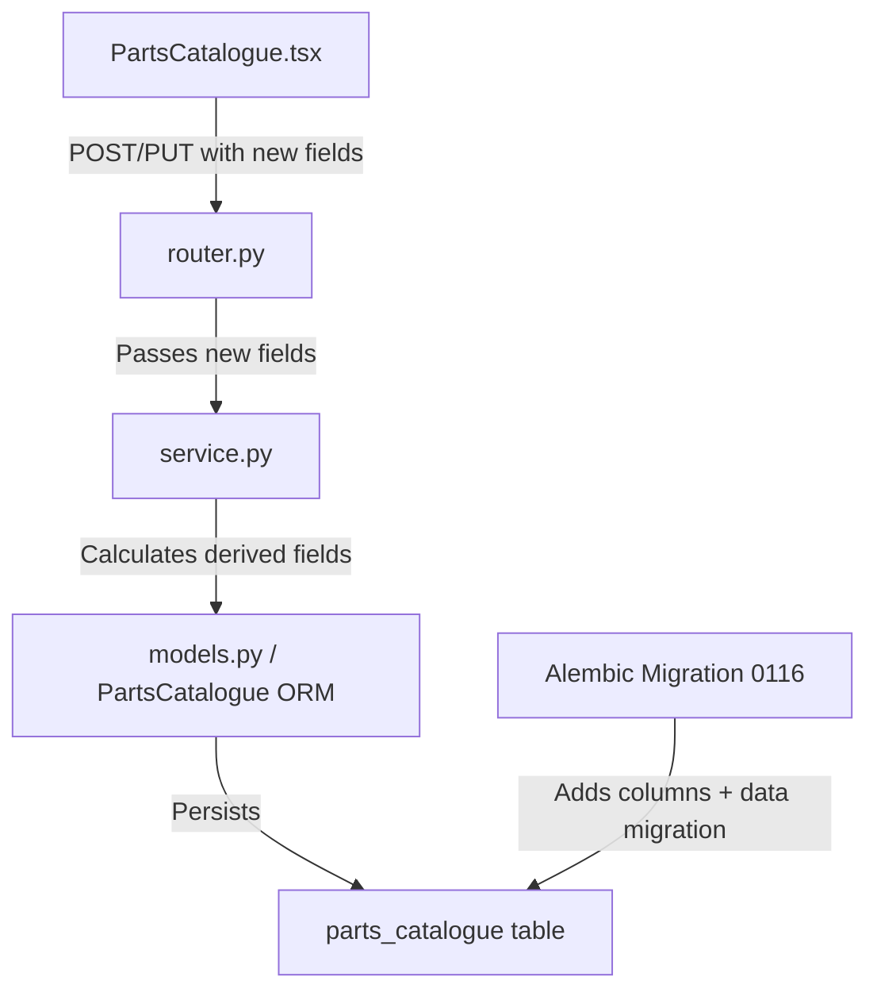

# Design Document: Parts Packaging & Pricing

## Overview

This feature extends the `parts_catalogue` table and associated API/UI to support packaging and pricing fields, bringing parts to parity with the existing Fluids/Oils catalogue. The core change is: parts are purchased in bulk packaging (boxes, cartons, etc.) at a total purchase price, and the system calculates cost-per-unit, margin, and margin percentage automatically.

The design mirrors the `FluidOilProduct` model's pricing pattern — `purchase_price`, `qty_per_pack`, `cost_per_unit`, `sell_price_per_unit`, `margin`, `margin_pct`, and `gst_mode` — adapted for discrete integer quantities instead of fluid volumes.

Key design decisions:
- All new columns are **nullable** for backward compatibility with existing rows.
- Legacy `is_gst_exempt` / `gst_inclusive` booleans are retained but superseded by a single `gst_mode` string column.
- Server-side calculation of derived fields (`cost_per_unit`, `margin`, `margin_pct`) ensures data consistency.
- Frontend calculations happen in real-time for UX responsiveness; server recalculates on save as the source of truth.

## Architecture

The change is a vertical slice through all layers:



No new modules or services are introduced. All changes are within the existing `app/modules/catalogue/` module and `frontend/src/pages/catalogue/PartsCatalogue.tsx`.

## Components and Interfaces

### Database Layer

**Migration 0116** adds 9 columns to `parts_catalogue`:

| Column | Type | Nullable | Notes |
|--------|------|----------|-------|
| `purchase_price` | Numeric(12,2) | Yes | Total price for all packs |
| `packaging_type` | String(20) | Yes | box, carton, pack, bag, pallet, single |
| `qty_per_pack` | Integer | Yes | Units per package |
| `total_packs` | Integer | Yes | Number of packages |
| `cost_per_unit` | Numeric(12,4) | Yes | Calculated: purchase_price / (qty_per_pack × total_packs) |
| `sell_price_per_unit` | Numeric(12,4) | Yes | Explicit sell price per unit |
| `margin` | Numeric(12,4) | Yes | sell_price_per_unit − cost_per_unit |
| `margin_pct` | Numeric(8,2) | Yes | (margin / sell_price_per_unit) × 100 |
| `gst_mode` | String(10) | Yes | inclusive, exclusive, exempt |

**Data migration** for existing rows:
- `gst_mode` ← mapped from `is_gst_exempt` / `gst_inclusive` booleans
- `sell_price_per_unit` ← copied from `default_price`
- `packaging_type` ← `'single'`, `qty_per_pack` ← `1`, `total_packs` ← `1`

**Downgrade** drops all 9 new columns.

### ORM Layer (models.py)

New `mapped_column` entries on `PartsCatalogue`:

```python
purchase_price: Mapped[Decimal | None] = mapped_column(Numeric(12, 2), nullable=True)
packaging_type: Mapped[str | None] = mapped_column(String(20), nullable=True)
qty_per_pack: Mapped[int | None] = mapped_column(Integer, nullable=True)
total_packs: Mapped[int | None] = mapped_column(Integer, nullable=True)
cost_per_unit: Mapped[Decimal | None] = mapped_column(Numeric(12, 4), nullable=True)
sell_price_per_unit: Mapped[Decimal | None] = mapped_column(Numeric(12, 4), nullable=True)
margin: Mapped[Decimal | None] = mapped_column(Numeric(12, 4), nullable=True)
margin_pct: Mapped[Decimal | None] = mapped_column(Numeric(8, 2), nullable=True)
gst_mode: Mapped[str | None] = mapped_column(String(10), nullable=True)
```

### Schema Layer (schemas.py)

**PartCreateRequest** — add optional fields:
```python
purchase_price: Optional[str] = Field(None, description="Total purchase price")
packaging_type: Optional[str] = Field(None, description="box|carton|pack|bag|pallet|single")
qty_per_pack: Optional[int] = Field(None, ge=1, description="Units per package")
total_packs: Optional[int] = Field(None, ge=1, description="Number of packages")
sell_price_per_unit: Optional[str] = Field(None, description="Sell price per unit")
gst_mode: Optional[str] = Field(None, description="inclusive|exclusive|exempt")
```

**PartResponse** — add fields:
```python
purchase_price: Optional[str] = Field(None)
packaging_type: Optional[str] = Field(None)
qty_per_pack: Optional[int] = Field(None)
total_packs: Optional[int] = Field(None)
cost_per_unit: Optional[str] = Field(None)
sell_price_per_unit: Optional[str] = Field(None)
margin: Optional[str] = Field(None)
margin_pct: Optional[str] = Field(None)
gst_mode: Optional[str] = Field(None)
```

Legacy fields (`is_gst_exempt`, `gst_inclusive`, `default_price`) remain on both schemas for backward compatibility.

### Service Layer (service.py)

**`create_part()`** — accept new keyword arguments. Before persisting, compute derived fields:

```python
def _compute_pricing(purchase_price, qty_per_pack, total_packs, sell_price_per_unit):
    cost_per_unit = None
    margin = None
    margin_pct = None
    if purchase_price and qty_per_pack and total_packs:
        total_units = qty_per_pack * total_packs
        if total_units > 0:
            cost_per_unit = purchase_price / total_units
    if sell_price_per_unit is not None and cost_per_unit is not None:
        margin = sell_price_per_unit - cost_per_unit
        if sell_price_per_unit > 0:
            margin_pct = (margin / sell_price_per_unit) * 100
        else:
            margin_pct = Decimal("0.00")
    return cost_per_unit, margin, margin_pct
```

**`_part_to_dict()`** — include new fields in the returned dict, converting Decimals to strings.

### Router Layer (router.py)

**`create_part_endpoint()`** — pass new fields from `PartCreateRequest` to `create_part()`. Add validation for `packaging_type` against allowed values and non-positive `qty_per_pack`/`total_packs` (return 422).

**`update_part_endpoint()`** — extend the `body` field handling to include new fields. Recalculate derived fields server-side before flush. Add same validation as create.

### Frontend (PartsCatalogue.tsx)

**PartForm interface** — add fields:
```typescript
purchase_price: string
packaging_type: string  // 'box'|'carton'|'pack'|'bag'|'pallet'|'single'
qty_per_pack: string
total_packs: string
sell_price_per_unit: string
```

**EMPTY_FORM** — defaults: `purchase_price: ''`, `packaging_type: 'single'`, `qty_per_pack: '1'`, `total_packs: '1'`, `sell_price_per_unit: ''`

**Pricing Section UI** — new section in the form modal:
- Packaging Type: `<select>` with options box, carton, pack, bag, pallet, single
- Qty Per Pack: `<Input type="number">` (disabled when packaging_type is "single")
- Total Packs: `<Input type="number">` (disabled when packaging_type is "single")
- Purchase Price: `<Input type="number" step="0.01">`
- Sell Price Per Unit: `<Input type="number" step="0.01">`
- GST Mode: SegmentedToggle with "GST Inc." / "GST Excl." / "Exempt"
- Cost/Unit: read-only calculated display
- Margin $: read-only calculated display
- Margin %: read-only calculated display

**Real-time calculations** (matching FluidOilForm pattern):
```typescript
const totalUnits = (parseInt(form.qty_per_pack) || 0) * (parseInt(form.total_packs) || 0)
const costPerUnit = totalUnits > 0 ? (parseFloat(form.purchase_price) || 0) / totalUnits : 0
const sellPerUnit = parseFloat(form.sell_price_per_unit) || 0
const margin = sellPerUnit - costPerUnit
const marginPct = sellPerUnit > 0 ? (margin / sellPerUnit) * 100 : 0
```

When `packaging_type` is set to `"single"`, auto-set `qty_per_pack` to `"1"` and `total_packs` to `"1"`.

Calculated fields display dashes (`—`) when insufficient data is provided, not `$0.00`.

## Data Models

### parts_catalogue Table (after migration)

```
parts_catalogue
├── id: UUID (PK)
├── org_id: UUID (FK → organisations.id)
├── name: String(255)
├── part_number: String(100), nullable
├── description: Text, nullable
├── part_type: String(20), default 'part'
├── category_id: UUID (FK → part_categories.id), nullable
├── brand: String(100), nullable
├── supplier_id: UUID (FK → suppliers.id), nullable
├── default_price: Numeric(10,2)              ← legacy, retained
├── is_gst_exempt: Boolean, default false      ← legacy, retained
├── gst_inclusive: Boolean, default false       ← legacy, retained
├── purchase_price: Numeric(12,2), nullable    ← NEW
├── packaging_type: String(20), nullable       ← NEW
├── qty_per_pack: Integer, nullable            ← NEW
├── total_packs: Integer, nullable             ← NEW
├── cost_per_unit: Numeric(12,4), nullable     ← NEW (calculated)
├── sell_price_per_unit: Numeric(12,4), nullable ← NEW
├── margin: Numeric(12,4), nullable            ← NEW (calculated)
├── margin_pct: Numeric(8,2), nullable         ← NEW (calculated)
├── gst_mode: String(10), nullable             ← NEW
├── current_stock: Integer, default 0
├── min_stock_threshold: Integer, default 0
├── reorder_quantity: Integer, default 0
├── is_active: Boolean, default true
├── tyre_width..tyre_speed_index: String(10), nullable
├── created_at: DateTime(tz)
└── updated_at: DateTime(tz)
```

### Alembic Migration 0116

```python
revision = "0116"
down_revision = "0115"
```

**Upgrade:**
1. `op.add_column()` for all 9 new columns (nullable)
2. Data migration via `op.execute()`:
   - Set `gst_mode = 'exempt'` WHERE `is_gst_exempt = true`
   - Set `gst_mode = 'inclusive'` WHERE `is_gst_exempt = false AND gst_inclusive = true`
   - Set `gst_mode = 'exclusive'` WHERE `is_gst_exempt = false AND gst_inclusive = false`
   - Set `sell_price_per_unit = default_price` for all rows
   - Set `packaging_type = 'single'`, `qty_per_pack = 1`, `total_packs = 1` for all rows

**Downgrade:**
- `op.drop_column()` for all 9 new columns


## Correctness Properties

*A property is a characteristic or behavior that should hold true across all valid executions of a system — essentially, a formal statement about what the system should do. Properties serve as the bridge between human-readable specifications and machine-verifiable correctness guarantees.*

### Property 1: Cost-per-unit calculation

*For any* positive `purchase_price` (Decimal), positive integer `qty_per_pack`, and positive integer `total_packs`, the computed `cost_per_unit` shall equal `purchase_price / (qty_per_pack × total_packs)`. Furthermore, *for any* input where any of the three values is zero, None, or negative, `cost_per_unit` shall be None.

**Validates: Requirements 2.1, 2.2, 2.3, 2.4**

### Property 2: Margin computation

*For any* non-negative `sell_price_per_unit` and non-negative `cost_per_unit`, `margin` shall equal `sell_price_per_unit - cost_per_unit`. When `sell_price_per_unit > 0`, `margin_pct` shall equal `(margin / sell_price_per_unit) × 100`. When `sell_price_per_unit` is zero, `margin_pct` shall be `0.00`. When `cost_per_unit` is None, both `margin` and `margin_pct` shall be None.

**Validates: Requirements 3.1, 3.2, 3.3, 3.4**

### Property 3: Currency formatting

*For any* numeric value, the NZD formatting function shall produce a string matching the pattern `$X.XX` (dollar sign, digits, decimal point, exactly two decimal digits).

**Validates: Requirements 3.6, 3.7, 6.4**

### Property 4: GST legacy boolean mapping

*For any* combination of `(is_gst_exempt: bool, gst_inclusive: bool)`, the mapping function shall produce: `"exempt"` when `is_gst_exempt` is true, `"inclusive"` when `is_gst_exempt` is false and `gst_inclusive` is true, and `"exclusive"` when both are false. This mapping is total over the boolean domain and must be consistent between the migration and the runtime mapping.

**Validates: Requirements 4.3, 4.4, 4.5, 4.6, 8.2**

### Property 5: Positive integer validation for packaging quantities

*For any* integer value ≤ 0 provided as `qty_per_pack` or `total_packs` in a create or update request, the API shall return a 422 validation error. *For any* positive integer value, the API shall accept it.

**Validates: Requirements 5.4, 5.5, 7.5**

### Property 6: API pricing fields round-trip

*For any* valid part creation payload that includes `purchase_price`, `packaging_type`, `qty_per_pack`, `total_packs`, `sell_price_per_unit`, and `gst_mode`, creating the part and then retrieving it shall return a response containing all submitted fields with their original values, plus the server-computed `cost_per_unit`, `margin`, and `margin_pct`.

**Validates: Requirements 7.1, 7.2, 7.3**

### Property 7: Server-side derived field consistency

*For any* part created or updated via the API with valid `purchase_price`, `qty_per_pack`, `total_packs`, and `sell_price_per_unit`, the persisted `cost_per_unit` shall equal `purchase_price / (qty_per_pack × total_packs)`, `margin` shall equal `sell_price_per_unit - cost_per_unit`, and `margin_pct` shall equal `(margin / sell_price_per_unit) × 100` (or `0.00` when `sell_price_per_unit` is zero).

**Validates: Requirements 7.4**

### Property 8: API rejects invalid packaging type

*For any* string not in the set `{box, carton, pack, bag, pallet, single}` provided as `packaging_type`, the API shall return a 422 validation error.

**Validates: Requirements 7.6**

### Property 9: Migration data transformation

*For any* existing row in `parts_catalogue` before migration, after migration: `sell_price_per_unit` shall equal the row's `default_price`, `packaging_type` shall be `'single'`, `qty_per_pack` shall be `1`, and `total_packs` shall be `1`. All pre-existing column values shall remain unchanged.

**Validates: Requirements 8.3, 8.4, 8.6**

## Error Handling

| Scenario | Layer | Behavior |
|----------|-------|----------|
| `purchase_price` is negative | Schema (Pydantic) | Reject with 422 |
| `qty_per_pack` ≤ 0 | Schema (Pydantic `ge=1`) + Router validation | Reject with 422 |
| `total_packs` ≤ 0 | Schema (Pydantic `ge=1`) + Router validation | Reject with 422 |
| `packaging_type` not in allowed set | Router validation | Reject with 422 |
| `gst_mode` not in allowed set | Router validation | Reject with 422 |
| Division by zero in cost calculation | Service `_compute_pricing()` | Return `None` for `cost_per_unit` |
| Invalid decimal string for prices | Service `create_part()` | Raise `ValueError` → 400 response |
| Missing pricing fields on create | All fields optional | Part created with `None` pricing fields |
| Migration failure | Alembic | Transaction rollback, no partial changes |

The existing error handling pattern (try/except ValueError → 400 in router) is preserved. New 422 responses are added for validation errors specific to packaging/pricing fields.

## Testing Strategy

### Property-Based Tests (Hypothesis)

The project uses **Hypothesis** for property-based testing (Python backend). Each property test runs a minimum of 100 iterations.

| Test | Property | Description |
|------|----------|-------------|
| `test_cost_per_unit_calculation` | Property 1 | Generate random (purchase_price, qty_per_pack, total_packs), verify formula |
| `test_margin_computation` | Property 2 | Generate random (sell_price, cost_per_unit), verify margin and margin_pct |
| `test_currency_formatting` | Property 3 | Generate random floats, verify NZD format pattern |
| `test_gst_legacy_mapping` | Property 4 | Generate all boolean combos, verify mapping |
| `test_positive_integer_validation` | Property 5 | Generate integers ≤ 0, verify 422 rejection |
| `test_api_pricing_round_trip` | Property 6 | Generate valid payloads, create + retrieve, verify fields |
| `test_server_derived_fields` | Property 7 | Generate valid inputs, verify computed fields match formula |
| `test_invalid_packaging_type` | Property 8 | Generate random strings not in allowed set, verify 422 |

Each test is tagged with: `# Feature: parts-packaging-pricing, Property {N}: {title}`

Each correctness property is implemented by a single property-based test.

### Unit Tests (pytest)

- Migration 0116 upgrade/downgrade (verify columns exist/removed)
- `_compute_pricing()` with specific known values
- `_compute_pricing()` edge cases: zero qty, zero total, None purchase_price
- GST mapping specific examples: (True, False) → "exempt", (False, True) → "inclusive", (False, False) → "exclusive"
- API create with all new fields → verify response shape
- API update with partial pricing fields → verify only updated fields change
- API create with invalid packaging_type → 422
- Frontend calculation logic (if unit-testable)

### Frontend Tests

- PartsCatalogue form renders pricing section fields
- Packaging type "single" disables qty/total inputs and sets them to 1
- Calculated fields show dashes when inputs are incomplete
- GST mode toggle cycles through three states
- Form submission includes new pricing fields in payload

## File Changes Summary

| File | Change |
|------|--------|
| `alembic/versions/2026_03_28_0900-0116_parts_packaging_pricing.py` | New migration: add 9 columns + data migration |
| `app/modules/catalogue/models.py` | Add 9 `mapped_column` entries to `PartsCatalogue` |
| `app/modules/catalogue/schemas.py` | Add new fields to `PartCreateRequest` and `PartResponse` |
| `app/modules/catalogue/service.py` | Add `_compute_pricing()`, update `create_part()` and `_part_to_dict()` |
| `app/modules/catalogue/router.py` | Update `create_part_endpoint()` and `update_part_endpoint()` with new fields + validation |
| `frontend/src/pages/catalogue/PartsCatalogue.tsx` | Add pricing section UI, real-time calculations, GST toggle |
| `tests/properties/test_parts_pricing_properties.py` | New: property-based tests for Properties 1–8 |
| `tests/test_parts_pricing.py` | New: unit tests for pricing logic, API endpoints, migration |
