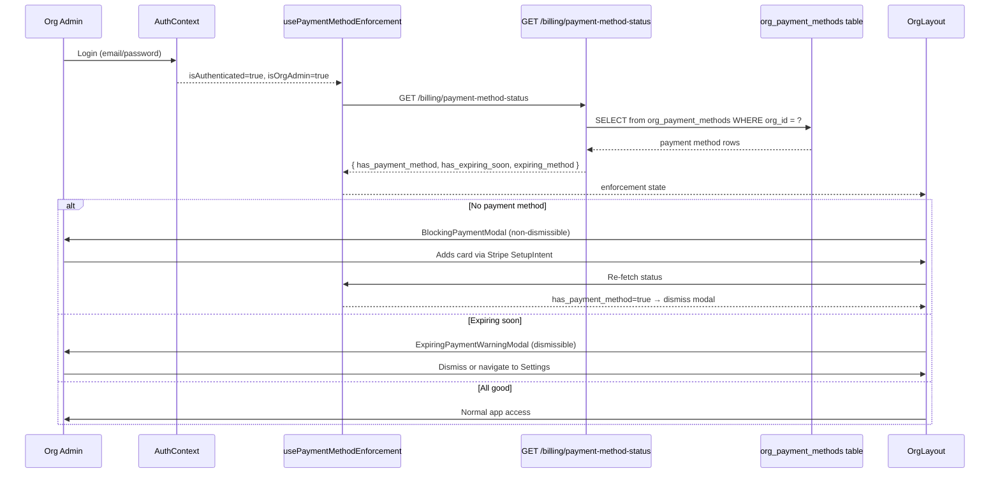

# Design Document: Payment Method Enforcement

## Overview

This feature adds a post-login enforcement layer that checks whether an org_admin's organisation has a valid payment method on file. It consists of:

1. A lightweight backend endpoint (`GET /api/v1/billing/payment-method-status`) that queries the local `org_payment_methods` table and returns a status summary (no Stripe API calls).
2. A React context/hook (`usePaymentMethodEnforcement`) that fires after login for org_admin users only, consuming the status endpoint.
3. Two modal components — a non-dismissible **BlockingPaymentModal** (no payment method) and a dismissible **ExpiringPaymentWarningModal** (card expiring within 30 days) — rendered at the `OrgLayout` level so they overlay the entire app shell.

Non-org_admin roles (global_admin, salesperson, branch_admin, kiosk, and any future roles) are completely excluded from enforcement via an explicit `user.role === 'org_admin'` check (fail-open design).

## Architecture



### Decision: Hook in OrgLayout vs. Dedicated Provider

The enforcement hook lives inside `OrgLayout` rather than a new context provider. Rationale:
- `OrgLayout` already wraps all org-scoped routes and has access to `useAuth()`
- Adding a provider would add another context re-render layer for a check that only runs once per login
- The hook's state is local to the layout — no other component needs to consume it

### Decision: Fail-Open on API Error

If the status endpoint fails (network error, 500, timeout), the user proceeds without enforcement. This prevents a billing check from locking users out of the entire app during backend issues.

## Components and Interfaces

### Backend

#### New Pydantic Schemas (`app/modules/billing/schemas.py`)

```python
class ExpiringMethodDetail(BaseModel):
    """Card details for the soonest-expiring payment method."""
    brand: str
    last4: str
    exp_month: int
    exp_year: int

class PaymentMethodStatusResponse(BaseModel):
    """Response for GET /billing/payment-method-status.
    
    Field names match exactly what the frontend expects
    (per frontend-backend-contract-alignment steering, Rule 1).
    """
    has_payment_method: bool
    has_expiring_soon: bool
    expiring_method: ExpiringMethodDetail | None = None
```

#### New Endpoint (`app/modules/billing/router.py`)

```python
@router.get(
    "/payment-method-status",
    response_model=PaymentMethodStatusResponse,
    dependencies=[Depends(require_role("org_admin", "global_admin",
                                        "branch_admin", "salesperson", "kiosk"))],
)
async def get_payment_method_status(
    request: Request,
    db: AsyncSession = Depends(get_db_session),
) -> PaymentMethodStatusResponse:
    """Lightweight status check — local DB only, no Stripe calls."""
```

- Extracts `org_id` from `request.state.user`
- If `org_id is None` → returns safe defaults (`has_payment_method=True`)
- Queries `org_payment_methods` for the org
- Computes `has_expiring_soon` using date logic (last day of exp_month/exp_year within 30 days of `utcnow()`)
- Returns only `brand`, `last4`, `exp_month`, `exp_year` — no `stripe_payment_method_id` or internal IDs

#### Expiry Date Logic (pure function)

```python
import calendar
from datetime import date, timedelta

def is_expiring_soon(exp_month: int, exp_year: int, reference_date: date | None = None) -> bool:
    """True when the card's last valid day is within 30 days of reference_date."""
    ref = reference_date or date.today()
    last_day = calendar.monthrange(exp_year, exp_month)[1]
    expiry_date = date(exp_year, exp_month, last_day)
    return expiry_date <= ref + timedelta(days=30)
```

This is extracted as a pure function for testability (property-based testing target).

### Frontend

#### `usePaymentMethodEnforcement` Hook

```typescript
// frontend/src/hooks/usePaymentMethodEnforcement.ts

interface ExpiringMethod {
  brand: string
  last4: string
  exp_month: number
  exp_year: number
}

interface PaymentMethodStatus {
  has_payment_method: boolean
  has_expiring_soon: boolean
  expiring_method: ExpiringMethod | null
}

interface EnforcementState {
  showBlockingModal: boolean
  showWarningModal: boolean
  expiringMethod: ExpiringMethod | null
  loading: boolean
  dismissWarning: () => void
  refetchStatus: () => void
}
```

- Only fetches when `isOrgAdmin` is true (from `useAuth()`)
- Uses `AbortController` cleanup in `useEffect` (per safe-api-consumption steering)
- Guards all response access: `res.data?.has_payment_method ?? true` (fail-open)
- On API error: sets `showBlockingModal=false`, `showWarningModal=false` (graceful degradation)
- `dismissWarning()` sets `showWarningModal=false` for the current session
- `refetchStatus()` re-calls the endpoint (used after adding a card in the blocking modal)

#### `BlockingPaymentModal` Component

```typescript
// frontend/src/components/billing/BlockingPaymentModal.tsx
```

- Uses the existing `<Modal>` component but **without** rendering the close button (passes a no-op `onClose` and hides the X button via a wrapper)
- Embeds the Stripe `<Elements>` + `<CardElement>` flow (same pattern as `Billing.tsx` `CardForm`)
- On successful SetupIntent confirmation → calls `refetchStatus()` → modal auto-dismisses when `has_payment_method` becomes `true`
- No Stripe secret keys or `stripe_payment_method_id` displayed in UI

#### `ExpiringPaymentWarningModal` Component

```typescript
// frontend/src/components/billing/ExpiringPaymentWarningModal.tsx
```

- Uses the existing `<Modal>` component with a dismiss button
- Displays: card brand, last 4 digits, expiry month/year
- "Update Payment Method" button → `navigate('/settings?tab=billing')`
- "Dismiss" button → calls `dismissWarning()`

#### Integration Point: `OrgLayout.tsx`

The hook is called inside `OrgLayout` and the modals are rendered at the top of the layout's JSX, above the `<Outlet />`:

```tsx
function OrgLayout() {
  const {
    showBlockingModal, showWarningModal, expiringMethod,
    dismissWarning, refetchStatus, loading,
  } = usePaymentMethodEnforcement()

  return (
    <>
      <BlockingPaymentModal open={showBlockingModal} onSuccess={refetchStatus} />
      <ExpiringPaymentWarningModal
        open={showWarningModal && !showBlockingModal}
        expiringMethod={expiringMethod}
        onDismiss={dismissWarning}
      />
      {/* ... existing layout JSX ... */}
    </>
  )
}
```

Blocking modal takes priority — if `showBlockingModal` is true, warning modal is suppressed (requirement 3.6).

## Data Models

### Existing Model (No Changes)

The `OrgPaymentMethod` model in `app/modules/billing/models.py` already has all required fields:

| Field | Type | Usage |
|-------|------|-------|
| `id` | UUID | Primary key (not exposed in status response) |
| `org_id` | UUID | FK to organisations — used for query filtering |
| `stripe_payment_method_id` | String | Not exposed in status response |
| `brand` | String | Exposed in `expiring_method` |
| `last4` | String | Exposed in `expiring_method` |
| `exp_month` | SmallInteger | Used for expiry computation + exposed |
| `exp_year` | SmallInteger | Used for expiry computation + exposed |
| `is_default` | Boolean | Not used by this feature |
| `is_verified` | Boolean | Not used by this feature |
| `created_at` | DateTime | Not used by this feature |

No new tables, columns, or migrations are required.

### New Pydantic Schemas

| Schema | Fields | Purpose |
|--------|--------|---------|
| `ExpiringMethodDetail` | `brand`, `last4`, `exp_month`, `exp_year` | Nested object in status response |
| `PaymentMethodStatusResponse` | `has_payment_method`, `has_expiring_soon`, `expiring_method` | Response model for the status endpoint |


## Correctness Properties

*A property is a characteristic or behavior that should hold true across all valid executions of a system — essentially, a formal statement about what the system should do. Properties serve as the bridge between human-readable specifications and machine-verifiable correctness guarantees.*

### Property 1: Payment method status computation correctness

*For any* set of `OrgPaymentMethod` records belonging to an organisation (including the empty set), the `get_payment_method_status` endpoint SHALL return:
- `has_payment_method` equal to `True` if and only if the set is non-empty
- `has_expiring_soon` equal to `True` if and only if at least one record in the set has a card expiry date (last day of `exp_month`/`exp_year`) within 30 days of the current UTC date
- `expiring_method` equal to the details of the record with the soonest expiry date among those expiring within 30 days, or `null` if none are expiring soon

**Validates: Requirements 1.3, 4.2**

### Property 2: Expiry date boundary correctness

*For any* valid `(exp_month, exp_year)` pair and any reference date, the `is_expiring_soon` function SHALL return `True` if and only if the last calendar day of `exp_month`/`exp_year` is less than or equal to `reference_date + 30 days`. This must hold correctly across month boundaries (28/29/30/31-day months), year boundaries, and leap years.

**Validates: Requirements 4.3**

## Error Handling

### Backend

| Scenario | Behaviour | HTTP Status |
|----------|-----------|-------------|
| Unauthenticated request | Return error, no data | 401 |
| Authenticated user with `org_id = None` (global_admin) | Return safe defaults: `{ has_payment_method: true, has_expiring_soon: false, expiring_method: null }` | 200 |
| Database query failure | Return 500 with generic message — no stack traces, SQL, or file paths (per security-hardening-checklist, Section 2) | 500 |
| Invalid/expired JWT | Rejected by auth middleware before reaching endpoint | 401 |

### Frontend

| Scenario | Behaviour |
|----------|-----------|
| Status API returns non-200 | Fail-open: `showBlockingModal=false`, `showWarningModal=false`, user proceeds normally. Error logged to console. |
| Status API times out / network error | Same fail-open behaviour. AbortController prevents stale state updates. |
| Malformed response (missing fields) | `res.data?.has_payment_method ?? true` defaults to no enforcement. |
| Stripe SetupIntent fails in blocking modal | Error message shown inside the modal. Modal remains open — user must retry or refresh. |
| React StrictMode double-firing useEffect | AbortController cleanup aborts the first request, preventing duplicate state updates. |

## Testing Strategy

### Property-Based Tests (Hypothesis)

The `is_expiring_soon` pure function and the status computation logic are suitable for property-based testing. These test OUR code's date arithmetic and set-reduction logic across a wide input space.

- Library: **Hypothesis** (already used in this codebase — `.hypothesis/` directory exists)
- Minimum 100 iterations per property
- Test file: `tests/test_payment_method_status_properties.py`

Each property test must be tagged:
```python
# Feature: payment-method-enforcement, Property 1: Payment method status computation correctness
# Feature: payment-method-enforcement, Property 2: Expiry date boundary correctness
```

### Unit Tests (pytest)

Example-based tests for specific scenarios:

- Status endpoint returns correct response for org with 0 payment methods
- Status endpoint returns correct response for org with 1 non-expiring method
- Status endpoint returns correct response for org with multiple methods, one expiring
- Status endpoint returns safe defaults for `org_id=None` (global_admin)
- Status endpoint returns only allowed fields (no `stripe_payment_method_id` leakage)
- Role-based scoping: non-org_admin roles skip enforcement (frontend hook test)
- Blocking modal priority: when both conditions are true, only blocking modal shows

### End-to-End Test Script

Per feature-testing-workflow steering, an e2e script at `scripts/test_payment_method_enforcement_e2e.py`:

1. **Auth flow**: Login as org_admin, verify status endpoint is called
2. **Status API correctness**: Create test payment methods via direct DB insert, verify status response
3. **Expiry computation**: Insert a card expiring within 30 days, verify `has_expiring_soon=true`
4. **Safe defaults**: Login as global_admin, verify safe default response
5. **OWASP checks**:
   - A1: Unauthenticated access → 401
   - A1: Cross-org access → returns only own org's data
   - A2: Response contains no secret keys or internal IDs
   - A5: Error responses contain no stack traces
6. **Cleanup**: Delete all test payment method records

### What Is NOT Property-Tested

- Modal rendering (UI) — covered by example-based component tests
- Role-based gating (finite set of 5 roles) — covered by exhaustive example tests
- Stripe SetupIntent flow — integration test, external service
- AbortController usage — code pattern, verified by code review
