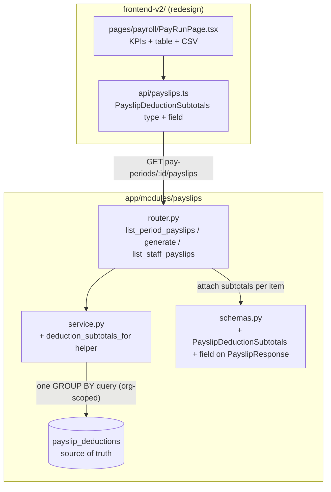
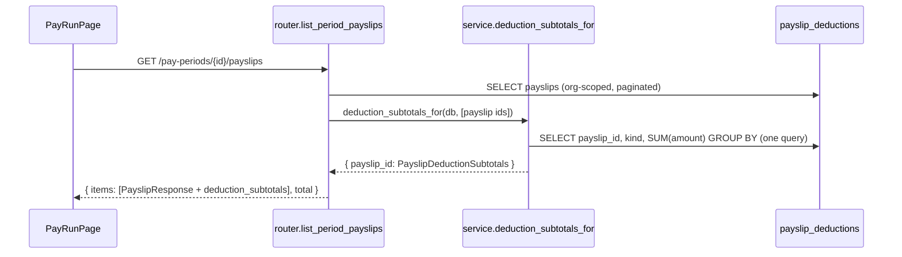

# Design Document — Payroll Deduction Subtotals

## Overview

The redesigned Pay Run console (`frontend-v2/src/pages/payroll/PayRunPage.tsx`, route `/payroll/run`) needs to show per-employee **PAYE**, **KiwiSaver**, and **ACC** figures and a **"KiwiSaver + ACC"** KPI, matching the design reference `OraInvoice_Handoff/app/Payroll.html`. The admin list endpoint `GET /api/v2/pay-periods/{period_id}/payslips` returns `PayslipResponse`, which today exposes only `gross_pay`, `gross_ytd`, and `net_pay`. The per-deduction amounts live as individual `payslip_deductions` rows (`kind`, `amount`) and are hydrated only by the single-payslip detail builder `_serialise_payslip_detail` (`app/modules/payslips/router.py`). The screen therefore collapses everything into a derived `gross − net` figure, which cannot separate PAYE / KiwiSaver / ACC and miscounts the **employer** KiwiSaver line (which `compute_payslip` does NOT subtract from `net_pay`, per `app/modules/payslips/calc.py`).

This feature adds a **per-payslip deduction subtotals** object to the admin payslip list responses, **derived on read** from the existing `payslip_deductions` rows (the source of truth) via a single grouped query, and consumes it on the Pay Run screen. No deduction calculation changes, no new stored copy, and **no database migration**.

This design resolves the requirements' Open Decisions D1–D5 with concrete choices (see "Resolved Open Decisions"), each backed by the actual codebase, and traces every section back to requirement IDs (R1–R7, NFR1–4) and the 8 correctness properties.

### Scope note (PROD safety)

The **backend** changes (`app/modules/payslips/`) deploy to Pi PROD which holds real payroll data, so the design is deliberately **read-only and additive**: a new optional Pydantic field with a zero default plus one aggregation query. There is **no Alembic migration**, no change to `payslip_deductions`, `payslips`, `calc.py`, or the deduction-attach logic in `service.py`. The **UI** lands only in the redesign `frontend-v2/`; the production `frontend/` is **not touched**. Do not touch docker/nginx.

### Mapping to requirements

| Design area | Requirements |
|---|---|
| New `PayslipDeductionSubtotals` schema + field on `PayslipResponse` | R1, R5, NFR1, NFR2.3 |
| Compute-on-read grouped aggregation helper (source of truth) | R2, NFR2.1, NFR2.2 |
| Populate admin list endpoints (period list, generate, staff history) | R1, R7, D3 |
| Org-scoped aggregation under RLS | R6 |
| Pay Run screen: PAYE/KiwiSaver/ACC columns + KPI + CSV | R3, NFR3 |
| Defensive consumption + field-name alignment | R4, NFR3 |
| Self-service excluded; admin detail line list unchanged (subtotals populated) | R5.3, R7.2, D4 |
| Decimal-as-string precision | NFR4 |

## Resolved Open Decisions

### D1 — Nested shape (R1, NFR2.3)

**Decision:** A **nested object** `PayslipDeductionSubtotals` with one `Decimal` field per `DeductionKind`, reusing the exact enum names, each defaulting to `Decimal("0")`, plus `total` exposed as a **Pydantic `@computed_field`** (sum of the seven) — mirroring the established pattern in `app/modules/leave/schemas.py` (`available_hours`). Making `total` computed means it can never disagree with the parts and no caller has to set it.

```text
paye, acc_levy, kiwisaver_employee, kiwisaver_employer,
student_loan, child_support, voluntary   (stored, default 0)
total                                     (@computed_field property → sum of the seven)
```

Rejected alternatives: a flat set of `deduction_*` fields on `PayslipResponse` (pollutes the top-level schema and is easy to miss); a `list[{kind, amount}]` (forces every consumer to reduce it and loses the "all kinds always present" guarantee of R1.3). The nested object is self-describing, lossless, and trivially defaulted to zeros.

### D2 — Aggregation mechanism (R2, NFR2.2)

**Decision:** **Compute-on-read** via a single grouped query over `payslip_deductions`:

```sql
SELECT payslip_id, kind, SUM(amount)
FROM payslip_deductions
WHERE payslip_id = ANY(:ids)
GROUP BY payslip_id, kind
```

One query per list call, regardless of row count (no N+1 — Property 7). Rejected: denormalising subtotal columns onto `payslips` — that needs a migration + backfill + keeping the columns in sync on every deduction mutation, and risks drift, violating R2.2. Deriving from the existing rows guarantees the subtotals can never diverge from the lines (R2.1, R2.4).

### D3 — Endpoint scope (R1, D3)

**Decision:** Populate **all admin endpoints returning `PayslipListResponse`**:

- `GET /api/v2/pay-periods/{period_id}/payslips` — `list_period_payslips` (the Pay Run screen).
- `POST /api/v2/pay-periods/{period_id}/payslips` — `generate_period_payslips` (freshly generated drafts, so the screen shows correct zeros/values immediately).
- `GET /api/v2/staff/{staff_id}/payslips` — `list_staff_payslips` (per-staff history tab consistency).

All three already build items as `PayslipResponse.model_validate(...)`; each gets the same subtotals attachment. Single shared helper, no duplicated logic.

### D4 — Self-service scope (R7, D4)

**Decision:** **Exclude** the self-service surface. `MyPayslipResponse` / `MyPayslipDetailResponse` and `GET /api/v2/staff/me/payslips` are left **unchanged** (R7.2). The self-service detail already returns the full `deductions` line list for the data subject, so employees retain access to their own breakdown via the detail view; the redacted list schema stays minimal. This keeps the sensitive employee-facing surface out of scope and lowers risk.

### D5 — "Other" grouping (R3.3, D5)

**Decision:** The API exposes **all seven kinds individually** (D1). The **table** on the Pay Run screen renders four deduction columns — **PAYE** (`paye`), **KiwiSaver** (`kiwisaver_employee`), **ACC** (`acc_levy`), and **Other** (`student_loan + child_support + voluntary`) — so the table stays readable while nothing is hidden (the underlying values are all present in the response and in the CSV). The per-row **KiwiSaver** column uses the **net-affecting** employee figure (R3.2); the **employer** figure is surfaced only in the KPI aggregate (R3.5).

## Architecture

### Component view



### Request flow (period list)



## Data Models

### New Pydantic schema (`app/modules/payslips/schemas.py`)

`PayslipDeductionSubtotals(BaseModel)` — one `Decimal` per `DeductionKind`, each `Field(default=Decimal("0"))`, plus a computed `total`:

```text
class PayslipDeductionSubtotals(BaseModel):
    paye: Decimal = Decimal("0")
    acc_levy: Decimal = Decimal("0")
    kiwisaver_employee: Decimal = Decimal("0")
    kiwisaver_employer: Decimal = Decimal("0")
    student_loan: Decimal = Decimal("0")
    child_support: Decimal = Decimal("0")
    voluntary: Decimal = Decimal("0")

    @computed_field  # type: ignore[prop-decorator]
    @property
    def total(self) -> Decimal:
        return (self.paye + self.acc_levy + self.kiwisaver_employee
                + self.kiwisaver_employer + self.student_loan
                + self.child_support + self.voluntary)
```

`computed_field` is already imported/used in `app/modules/leave/schemas.py`. Decimal serialises decimal-as-string by Pydantic v2 default — same as every other money field in this module (NFR4.2). Construction via keyword args ignores unexpected keys (Pydantic v2 default `extra='ignore'`), so a stray `kind` could never raise — though the `payslip_deductions` CHECK constraint already guarantees only the seven kinds.

Field added to `PayslipResponse`:

```text
deduction_subtotals: PayslipDeductionSubtotals = Field(default_factory=PayslipDeductionSubtotals)
```

Because the field has a default, `PayslipResponse.model_validate(orm_row)` (used by every existing list path, and by `PayslipDetailResponse` which subclasses it) keeps working and yields all-zero subtotals until explicitly populated (R5.1, NFR1.1, Property 8). `PayslipDetailResponse` inherits the field — so the detail endpoint already returns it; the design populates it there from the lines it already loads (see Detail population below) so detail subtotals are consistent rather than zero, while the nested `deductions` line list stays unchanged (R5.3).

### Kind → screen mapping (frontend)

| Screen element | Source field(s) |
|---|---|
| PAYE column / KPI | `paye` |
| KiwiSaver column | `kiwisaver_employee` (net-affecting) |
| ACC column | `acc_levy` |
| Other column | `student_loan + child_support + voluntary` |
| KiwiSaver + ACC KPI | `kiwisaver_employee + kiwisaver_employer + acc_levy` (summed across rows) |
| Net (unchanged) | `net_pay` |

### Aggregation helper (`app/modules/payslips/service.py`)

The service layer in this module **never constructs Pydantic response models** (that is always done in the router — e.g. `_serialise_payslip_detail`). To respect that layering, the helper returns **plain data** and the router builds the schema:

`async def deduction_subtotals_for(db, payslip_ids: list[UUID]) -> dict[UUID, dict[str, Decimal]]`:
- Returns `{}` for an empty id list (skip the query — NFR2.2).
- One `select(PayslipDeduction.payslip_id, PayslipDeduction.kind, func.sum(PayslipDeduction.amount)).where(PayslipDeduction.payslip_id.in_(payslip_ids)).group_by(PayslipDeduction.payslip_id, PayslipDeduction.kind)`.
- Returns `{ payslip_id: { kind: summed_amount, ... } }` containing only the kinds present for that payslip (absent kinds are filled in by the schema's per-field zero default at construction time).
- No `schemas` import in `service.py` — keeps the service decoupled from Pydantic, matching the existing module convention.
- RLS already scopes `payslip_deductions` to the org; the `ids` come only from org-scoped payslip rows, so no cross-org line is ever aggregated (R6.1, R6.2, Property 6).

### Router attachment (`app/modules/payslips/router.py`)

Add `PayslipDeductionSubtotals` to the existing `from app.modules.payslips.schemas import (...)` block. In each admin list endpoint, after building `rows` (or `created` for generate):

```text
subtotals = await payslips_service.deduction_subtotals_for(db, [r.id for r in rows])
items = [
    PayslipResponse.model_validate(r).model_copy(
        update={"deduction_subtotals": PayslipDeductionSubtotals(**subtotals.get(r.id, {}))}
    )
    for r in rows
]
```

`PayslipDeductionSubtotals(**{kind: amount})` fills absent kinds from their zero defaults and computes `total`; `model_copy(update=...)` avoids the duplicate-kwarg problem of `model_validate(...).model_dump()` + re-construct (the field is already present with its default).

### Detail population (`_serialise_payslip_detail` in `app/modules/payslips/router.py`)

`_serialise_payslip_detail` already loads the payslip's `deductions` rows. Build the subtotals from that in-memory list (no extra query) and pass it through on the `base` dict before constructing `PayslipDetailResponse`, so the inherited field is consistent with the lines (R5.3):

```text
sub = PayslipDeductionSubtotals()
for d in deductions:
    setattr(sub, d.kind, getattr(sub, d.kind) + d.amount)   # or accumulate into a dict then construct
base["deduction_subtotals"] = sub.model_dump()
```

The nested `deductions` line list itself is unchanged. `MyPayslipDetailResponse` (self-service) does NOT inherit this field and is left untouched (D4).

## Frontend changes (`frontend-v2/`)

### `src/api/payslips.ts`
- Add `interface PayslipDeductionSubtotals` with the seven kind fields + `total`, all `string` (decimal-as-string wire convention, NFR3.2).
- Add `deduction_subtotals: PayslipDeductionSubtotals` to the `Payslip` interface.

### `src/pages/payroll/PayRunPage.tsx`
- Replace the single derived "Tax & deductions" KPI/column with the breakdown (R3.6):
  - **KPI row** → `Gross` / `PAYE` / `KiwiSaver + ACC` / `Net` (matches the prototype). KiwiSaver+ACC = `kiwisaver_employee + kiwisaver_employer + acc_levy` summed across the period (R3.4, R3.5).
  - **Table columns** → Employee · Status · Ord hrs · O/T · Gross · **PAYE** · **KiwiSaver** · **ACC** · **Other** · Net (R3.1, R3.3).
- Update the `totals` memo and `handleExport` (CSV) to use the real subtotals (R3.7).
- Every read uses `Number(p?.deduction_subtotals?.paye ?? 0)` style access (R4.1, R4.2, NFR3.1).

## Error Handling

| Condition | Behaviour | Req |
|---|---|---|
| Payslip has no deduction lines | All seven subtotals = 0; `total` = 0 | R1.3 |
| `payslip_ids` empty (no rows in page) | Helper returns `{}`, no query issued | NFR2.2 |
| ORM row not preloaded with subtotals (other consumers) | Pydantic default → all zeros, serialises fine | R5.1, NFR1.1 |
| Frontend item missing `deduction_subtotals` | `?? 0` fallback per value, no throw | R4.1 |

## Security & Multi-Tenancy

- The aggregation query takes only `payslip_id`s drawn from already org-scoped payslip selects; `payslip_deductions` is RLS-scoped to the org (R6.1, R6.2).
- The Admin_List_Endpoints keep their existing role + `payroll` module gating; no auth surface changes (R6.3).
- Self-service endpoints are untouched (R7.2, D4), so no new employee-facing data is exposed.

## Testing Strategy

- **Backend integration** (`tests/integration/`): new test creating a period + payslip with mixed deduction lines (PAYE, employee+employer KiwiSaver, ACC, voluntary) and asserting the list endpoint returns correct per-kind subtotals and `total`; an empty-deductions payslip returns all zeros; a second org's payslip is never aggregated.
- **Property-based** (`tests/property/`, optional `*` tasks): Properties 1–8 from requirements (per-kind sum, all-kinds-present, net reconciliation, employer-KiwiSaver non-net-affecting, source-of-truth consistency, org isolation, aggregate-once, backward-compatible default).
- **Frontend**: `tsc -b && vite build`; a `PayRunPage` test asserting the KiwiSaver+ACC KPI math and that the table renders the four deduction columns from fixture subtotals.
- **Process**: restart the backend container after the schema change (Rule 8, `frontend-backend-contract-alignment.md`); verify the field in an actual API response.

## Files Touched

- `app/modules/payslips/schemas.py` — new `PayslipDeductionSubtotals` (with computed `total`); `deduction_subtotals` field on `PayslipResponse`; import `computed_field`.
- `app/modules/payslips/service.py` — `deduction_subtotals_for` helper returning plain `dict[UUID, dict[str, Decimal]]` (no `schemas` import).
- `app/modules/payslips/router.py` — import `PayslipDeductionSubtotals`; attach subtotals in `list_period_payslips`, `generate_period_payslips`, `list_staff_payslips`; populate it from already-loaded lines in `_serialise_payslip_detail` (admin detail only).
- `frontend-v2/src/api/payslips.ts` — `PayslipDeductionSubtotals` interface + `deduction_subtotals` field on `Payslip` (inherited by `PayslipDetail`).
- `frontend-v2/src/pages/payroll/PayRunPage.tsx` — KPIs, columns, CSV.
- `tests/integration/` (+ optional `tests/property/`) — coverage.

**Not touched:** `calc.py`, `models.py`, `payslip_deductions`/`payslips` DB schema, the self-service `MyPayslip*` schemas and `/staff/me/payslips` handlers, production `frontend/`, docker/nginx. No Alembic migration. (`_serialise_payslip_detail` is touched only to populate the inherited admin field; the nested `deductions` list is unchanged.)
