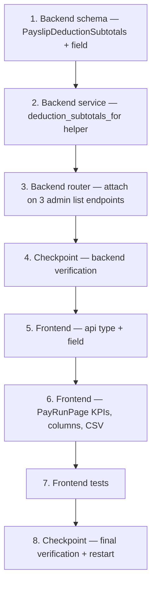

# Implementation Plan: Payroll Deduction Subtotals

## Overview

This plan converts the approved design into incremental coding steps for exposing **per-payslip deduction subtotals** on the admin payslip list responses and rendering the PAYE / KiwiSaver / ACC split on the Pay Run screen. Work flows backend-first (schema → service helper → router wiring → tests) so the frontend (redesign `frontend-v2/`) only ever consumes a field that already exists, then ends with the Pay Run screen KPIs/columns/CSV and full verification. The production `frontend/` is **not touched**.

Language is fixed by the design: **Python 3.11 + async SQLAlchemy** (backend) and **React 18 + TypeScript** (frontend-v2) — no pseudocode, so no language choice is needed.

### Hard constraints baked into every task

- **NO Alembic migration.** Subtotals are computed on read from the existing `payslip_deductions` rows (D2). Do not add columns to `payslips` and do not denormalise.
- **Source of truth is `payslip_deductions`.** Never store a separate copy that can drift (R2.1, R2.2).
- **Do not change deduction calculation/persistence.** `calc.py`, `models.py`, and the deduction-attach logic in `service.py` are untouched (NFR1.3).
- **Additive + backward compatible.** The new field has a zero default so every existing `PayslipResponse.model_validate(...)` path keeps serialising (R5.1, NFR1.1). Add the field to the **Pydantic schema**, not just a service dict (Rule 8, `frontend-backend-contract-alignment.md`).
- **One aggregate query per list call — no N+1** (NFR2.2). `flush()`-style read patterns; `get_db_session` owns the transaction.
- **Org-scoped.** Aggregate only `payslip_deductions` belonging to the org's payslips (R6).
- **`kiwisaver_employee` and `kiwisaver_employer` stay separate** (R1.5); employer KiwiSaver is informational and never reduces net (R3.5).
- **Self-service untouched.** `MyPayslip*` and `/staff/me/payslips` unchanged (R7.2, D4). `PayslipDetailResponse` nested `deductions` list unchanged (R5.3).
- **Decimal-as-string on the wire** (NFR4.2); frontend types are `string`.
- Frontend follows **`safe-api-consumption.md`** (typed generics, `?.` / `?? 0`, `AbortController`, no `as any`).

## Task Dependency Graph



```json
{
  "waves": [
    { "wave": 1, "tasks": ["1.1"] },
    { "wave": 2, "tasks": ["2.1"] },
    { "wave": 3, "tasks": ["3.1"] },
    { "wave": 4, "tasks": ["4"] },
    { "wave": 5, "tasks": ["5.1"] },
    { "wave": 6, "tasks": ["6.1", "6.2"] },
    { "wave": 7, "tasks": ["7.1"] },
    { "wave": 8, "tasks": ["8"] }
  ]
}
```

## Tasks

- [x] 1. Backend schema — `PayslipDeductionSubtotals` + field (`app/modules/payslips/schemas.py`)
  - [x] 1.1 Add the nested model and the field on `PayslipResponse`
    - Add `class PayslipDeductionSubtotals(BaseModel)` with one `Decimal` field per `DeductionKind` — `paye`, `acc_levy`, `kiwisaver_employee`, `kiwisaver_employer`, `student_loan`, `child_support`, `voluntary` — each `Field(default=Decimal("0"))`. Reuse the existing `DeductionKind` enum names exactly (D1).
    - Add `total` as a `@computed_field` `@property` returning the sum of the seven (mirror `available_hours` in `app/modules/leave/schemas.py`; add `computed_field` to the `from pydantic import ...` line). Do NOT make `total` a stored field — computing it guarantees it never disagrees with the parts (R2).
    - Add `deduction_subtotals: PayslipDeductionSubtotals = Field(default_factory=PayslipDeductionSubtotals)` to `PayslipResponse` so it is inherited by `PayslipDetailResponse` and defaults to all-zeros under `model_validate` (R5.1, NFR1.1).
    - Do NOT add the field to `MyPayslipResponse` / `MyPayslipDetailResponse` (they extend `BaseModel`/`MyPayslipResponse`, NOT `PayslipResponse`, so they do not inherit it — D4, R7.2). Leave them untouched.
    - _Design: Data Models — New Pydantic schema. Requirements: 1.2, 1.3, 1.5, 5.1, 5.3, 7.2, NFR1.1, NFR2.3, NFR4_

- [x] 2. Backend service — aggregation helper (`app/modules/payslips/service.py`)
  - [x] 2.1 Implement `deduction_subtotals_for(db, payslip_ids)`
    - Signature: `async def deduction_subtotals_for(db, payslip_ids: list[UUID]) -> dict[UUID, dict[str, Decimal]]`. Return **plain dicts**, NOT Pydantic — `service.py` in this module never builds response models (that is the router's job), and this avoids a `schemas` import in the service layer.
    - Return `{}` immediately for an empty `payslip_ids` (skip the query — NFR2.2).
    - One grouped query: `select(PayslipDeduction.payslip_id, PayslipDeduction.kind, func.sum(PayslipDeduction.amount)).where(PayslipDeduction.payslip_id.in_(payslip_ids)).group_by(PayslipDeduction.payslip_id, PayslipDeduction.kind)`.
    - Build `{ payslip_id: { kind: summed_amount, ... } }` containing only the kinds present; the router's `PayslipDeductionSubtotals(**...)` fills absent kinds from their zero defaults and computes `total`.
    - `func`, `select`, and `PayslipDeduction` are already imported in `service.py` — no new imports needed.
    - Aggregation is org-safe because ids come only from org-scoped payslip selects and `payslip_deductions` is RLS-scoped (R6.1, R6.2).
    - _Design: Aggregation helper; Security & Multi-Tenancy. Requirements: 1.1, 1.4, 2.1, 2.4, 6.1, 6.2, NFR2.1, NFR2.2, NFR4.1_
  - [ ]* 2.2 Property test — per-kind subtotal equals sum of lines
    - **Property 1: Per-kind subtotal equals sum of lines** — random Deduction_Lines on a payslip; assert each returned subtotal == exact sum of that kind's lines. ≥100 examples; tag `# Feature: payroll-deduction-subtotals, Property 1`.
    - **Validates: Requirements 1.4**
  - [ ]* 2.3 Property test — all kinds always present, absent → zero
    - **Property 2: All kinds always present** — any payslip; assert exactly the seven kinds present, absent kinds reported as 0. ≥100 examples; tag `# Feature: payroll-deduction-subtotals, Property 2`.
    - **Validates: Requirements 1.2, 1.3**
  - [ ]* 2.4 Property test — org isolation
    - **Property 6: Org isolation** — two orgs with identically-shaped payslips; assert each org's subtotals aggregate only its own lines. ≥100 examples; tag `# Feature: payroll-deduction-subtotals, Property 6`.
    - **Validates: Requirements 6.1, 6.2**

- [x] 3. Backend router — attach on admin list endpoints (`app/modules/payslips/router.py`)
  - [x] 3.1 Populate `deduction_subtotals` on all three `PayslipListResponse` endpoints
    - Add `PayslipDeductionSubtotals` to the existing `from app.modules.payslips.schemas import (...)` block in `router.py`.
    - In `list_period_payslips` and `list_staff_payslips` (both use a `rows` variable) and `generate_period_payslips` (uses `created`): after building the list, call `subtotals = await payslips_service.deduction_subtotals_for(db, [r.id for r in rows])` once, then build each item as `PayslipResponse.model_validate(r).model_copy(update={"deduction_subtotals": PayslipDeductionSubtotals(**subtotals.get(r.id, {}))})`.
    - Preserve existing role + `payroll` module gating (R6.3).
    - _Design: Router attachment; Resolved Open Decision D3. Requirements: 1.1, 5.4, 6.3, NFR2.4_
  - [x] 3.2 Populate `deduction_subtotals` on the admin detail builder
    - In `_serialise_payslip_detail` (admin branch only, `self_service=False`): accumulate per-kind sums from the already-loaded `deductions` list (no extra query), set `base["deduction_subtotals"]` before constructing `PayslipDetailResponse`. Do NOT alter the nested `deductions` list, and do NOT touch the `self_service=True` branch (`MyPayslipDetailResponse` has no such field) (R5.3, D4).
    - _Design: Detail population. Requirements: 5.3, 7.2_
  - [ ]* 3.3 Property test — aggregate-once (no N+1)
    - **Property 7: No N+1** — for a period of N payslips, assert the number of deduction-aggregation queries per list call is exactly one, independent of N (e.g. via a query counter / echo). ≥50 examples; tag `# Feature: payroll-deduction-subtotals, Property 7`.
    - **Validates: Requirements NFR2.2**
  - [ ]* 3.4 Property test — backward-compatible default
    - **Property 8: Backward-compatible default** — build `PayslipResponse.model_validate(orm_row)` with no preloaded subtotals; assert it serialises with every subtotal == 0. ≥100 examples; tag `# Feature: payroll-deduction-subtotals, Property 8`.
    - **Validates: Requirements 5.1, NFR1.1**

- [x] 4. Checkpoint — backend verification
  - [x] 4.1 Integration test + manual API check
    - Add an integration test (`tests/integration/`): create a pay period + a payslip with mixed Deduction_Lines (PAYE, employee KiwiSaver, employer KiwiSaver, ACC, voluntary); assert `GET /api/v2/pay-periods/{id}/payslips` returns the correct per-kind subtotals and `total`; assert an empty-deductions payslip returns all zeros (R1.3); assert a second org's payslip is never aggregated (R6).
    - Also assert `GET /api/v2/payslips/{id}` detail still returns the full `deductions` line list unchanged (R5.3) and `GET /api/v2/staff/me/payslips` shape is unchanged (R7.2, D4).
    - Run `pytest` for the payslips tests; restart the backend container (schema change requires a process restart — Rule 8) and curl one response to confirm the field is present.
    - _Design: Testing Strategy. Requirements: 1.1, 1.3, 5.3, 6, 7.2_

- [x] 5. Frontend — API type (`frontend-v2/src/api/payslips.ts`)
  - [x] 5.1 Add `PayslipDeductionSubtotals` type + field on `Payslip`
    - Add `interface PayslipDeductionSubtotals` with the seven kind fields + `total`, all typed `string` (decimal-as-string wire convention, NFR3.2).
    - Add `deduction_subtotals: PayslipDeductionSubtotals` to the `Payslip` interface. Field names MUST match the backend schema exactly (R4.3, NFR3.2).
    - _Design: Frontend changes — api/payslips.ts. Requirements: 4.3, NFR3.2_

- [x] 6. Frontend — Pay Run screen (`frontend-v2/src/pages/payroll/PayRunPage.tsx`)
  - [x] 6.1 KPI row + table columns
    - Replace the single "Tax & deductions" KPI/column (R3.6) with: KPI row `Gross` / `PAYE` / `KiwiSaver + ACC` / `Net`, where KiwiSaver+ACC = `kiwisaver_employee + kiwisaver_employer + acc_levy` summed across the period's payslips (R3.4, R3.5).
    - Table deduction columns: **PAYE** (`paye`), **KiwiSaver** (`kiwisaver_employee`, net-affecting — R3.2), **ACC** (`acc_levy`), **Other** (`student_loan + child_support + voluntary` — R3.3, D5).
    - Update the `totals` memo to aggregate from `deduction_subtotals`. Read every value defensively: `Number(p?.deduction_subtotals?.paye ?? 0)` etc. (R4.1, R4.2, NFR3.1).
    - _Design: Frontend changes — PayRunPage; Kind → screen mapping. Requirements: 3.1, 3.2, 3.3, 3.4, 3.5, 3.6, 4.1, 4.2, NFR3.1_
  - [x] 6.2 CSV export
    - Update `handleExport` so the exported CSV includes PAYE / KiwiSaver / ACC / Other columns matching the table (R3.7).
    - _Design: Frontend changes — PayRunPage. Requirements: 3.7_

- [ ] 7. Frontend tests
  - [ ]* 7.1 PayRunPage rendering + KPI math test
    - Test that, given fixture payslips with `deduction_subtotals`, the table renders the four deduction columns and the KiwiSaver+ACC KPI equals employee + employer + ACC summed across rows (R3.4, R3.5); and that a payslip missing `deduction_subtotals` renders zeros without throwing (R4.1).
    - _Design: Testing Strategy. Requirements: 3.4, 3.5, 4.1_

- [x] 8. Checkpoint — final verification
  - [x] 8.1 Build + end-to-end check
    - Run `tsc -b && vite build` for `frontend-v2`; confirm no type errors. Hard-refresh the Pay Run screen against a real period and verify the PAYE / KiwiSaver / ACC / Other columns and the KiwiSaver+ACC KPI match the underlying payslips, and the CSV export contains the breakdown.
    - Confirm no regression on the staff payslip history tab and the self-service payslips page (unchanged shapes).
    - _Design: Testing Strategy; Files Touched. Requirements: 3, 5, 7.2_

## Definition of Done

- Admin payslip list responses include a `deduction_subtotals` object with all seven kinds (absent → 0) and a `total`, derived from `payslip_deductions` in a single org-scoped query (R1, R2, R6, NFR2).
- The Pay Run screen renders PAYE / KiwiSaver / ACC / Other per row and a KiwiSaver+ACC KPI, with the CSV export matching (R3), consumed defensively (R4).
- No migration; `calc.py`, detail response, self-service, and production `frontend/` unchanged; existing consumers unaffected (R5, R7, NFR1).
- Backend restarted; field verified in a live response.
