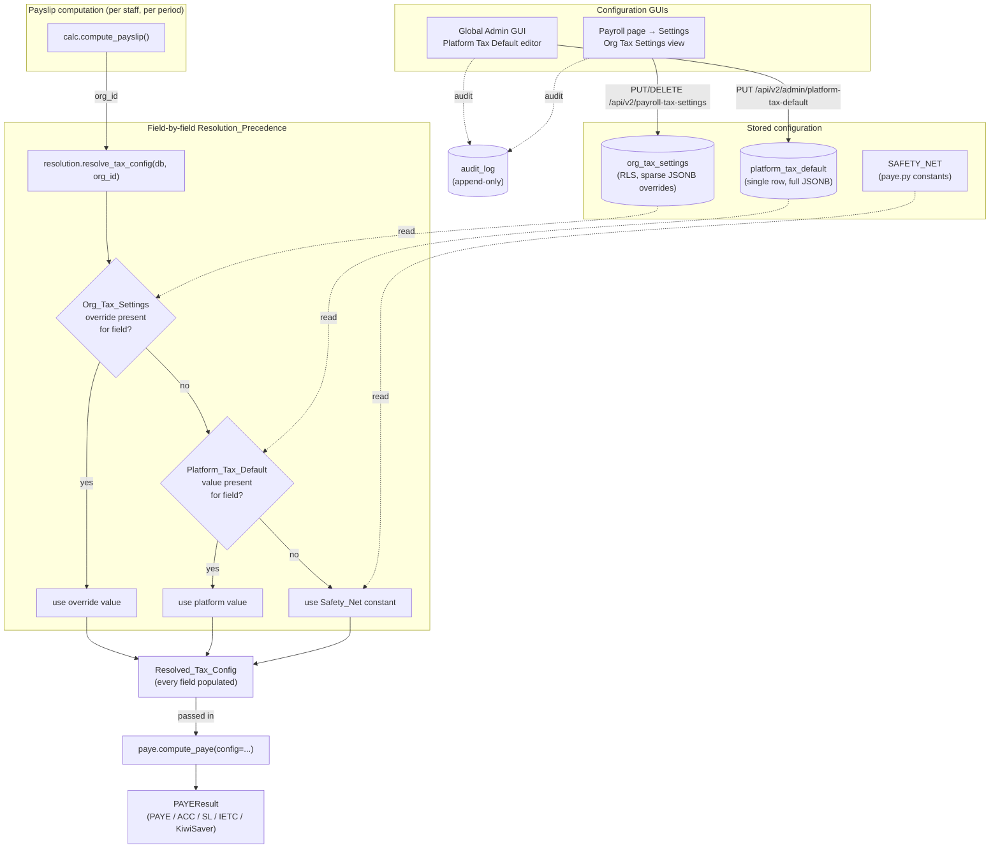

# Design Document

## Overview

`Payroll_Tax_Settings` makes the New Zealand payroll tax rates that drive payslip
calculations editable through the GUI instead of being hard-coded in
`app/modules/timesheets/paye.py`. Today, when IRD changes a rate a developer must
edit module constants (`_INCOME_TAX_BRACKETS`, `_SECONDARY_FLAT_RATES`,
`_ACC_LEVY_RATE`, `_ACC_MAX_LIABLE_EARNINGS`, `_STUDENT_LOAN_RATE`,
`_STUDENT_LOAN_ANNUAL_THRESHOLD`, the IETC constants, and the 3% KiwiSaver
defaults) and redeploy. This feature removes that dependency entirely.

The solution is a **two-tier, GUI-editable tax configuration** resolved per
payslip:

1. **Platform tier (`Platform_Tax_Default`)** — a single global baseline record,
   editable only by a `Global_Admin` from the Global Admin GUI (the same area
   that hosts integration credentials and Xero settings). It is seeded once from
   the current 2024/25 constants by an idempotent Alembic migration.

2. **Organisation tier (`Org_Tax_Settings`)** — a per-org, RLS-scoped record that
   holds a **sparse set of overrides**. A field that is not overridden is absent
   from the record and therefore *inherits* the platform default. Org admins reach
   it from a Settings control on the Payroll page, mirroring the existing
   Timesheets Settings pattern.

At payslip time a **resolution service** produces a fully-populated
`Resolved_Tax_Config` by applying the `Resolution_Precedence` field-by-field:
**Org override → Platform default → Safety_Net** (the hard-coded constants, kept
as a last-resort fallback). The PAYE engine (`compute_paye`) is refactored to read
every rate from the `Resolved_Tax_Config` it is handed rather than from module
constants. The Safety_Net guarantees payroll never computes against a blank, null,
or zero value, even if both the override and the platform default are missing.

Every platform or org change is recorded in the existing append-only `Audit_Log`,
including rejected unauthorised attempts. Validation blocks nonsensical values
(non-ascending brackets, out-of-bounds rates, a non-positive ACC cap, mis-ordered
IETC bounds, etc.) before they can be persisted. Reset-to-default removes overrides
so a field falls back to inheriting the platform default.

**Effective-dating is out of scope.** Only the current configuration is stored and
edited in place; the audit log is the change history. Resolution ignores pay-period
dates.

### Key research findings that inform the design

- **Calculation engine.** `compute_paye()` in `app/modules/timesheets/paye.py` is a
  pure function. All rate data lives in module constants. The IETC upper bound (48000)
  is an **inline literal** in `_ietc_annual` (`annual > Decimal("48000")`), not a named
  constant like the other four IETC values — the refactor must extract it into the
  `SAFETY_NET` `IETCParams.upper`. The open-ended top bracket is currently
  `Decimal("Infinity")`; switching it to `upper_limit=None` requires `_annual_income_tax`
  to treat `None` as infinity (a `None < x` comparison would raise `TypeError`).
- **Payslip KiwiSaver is computed in `calc.py`, NOT taken from the engine.**
  `app/modules/payslips/calc.py::compute_payslip` computes the payslip's KiwiSaver lines
  in its **own** block (`kiwisaver_employee = gross * (_q(staff.kiwisaver_employee_rate)/100)`),
  where `_q(None)` → `0.00` (0%). It calls `compute_paye()` only for PAYE/ACC/student-loan
  and **discards** `paye_result.kiwisaver_employee`/`kiwisaver_employer`. Consequently,
  satisfying Req 6.6/6.7 requires updating calc.py's **own** KiwiSaver block to fall back
  to the resolved `default_kiwisaver_*_rate` when the staff rate is unset — passing `None`
  into `compute_paye` alone changes only the engine's (unused) KiwiSaver output and has
  **no effect** on the payslip numbers.
- **Audit.** `app/core/audit.py::write_audit_log(session, *, action, entity_type,
  org_id=None, user_id=None, entity_id=None, before_value=None, after_value=None, ...)`
  INSERTs into the tamper-evident `audit_log` table. `org_id=None` is explicitly
  supported for global-admin actions. The table has `REVOKE UPDATE, DELETE ON audit_log
  FROM PUBLIC` (migration 0008), so it is append-only **for non-owner roles**. Caveat:
  PostgreSQL table owners/superusers bypass `PUBLIC` grants, so the append-only retention
  guarantee (Req 10.3) only holds when the app connects as a non-owner role — the
  retention test (task 7.7) must assert against the app's actual runtime DB role, not a
  superuser connection.
- **Authorisation.** `app/modules/auth/rbac.py` provides `require_role("global_admin")`
  and `require_role("org_admin")`. Path-based RBAC is enforced at request time by
  `RBACMiddleware` (`app/middleware/rbac.py`, registered in `main.py`), which calls
  `check_role_path_access` and returns `403` **before any route or its dependencies run**.
  It denies `global_admin` access to org-scoped data prefixes and denies
  `org_admin`/other org roles access to `"/api/v2/admin/"`.
  Therefore the **platform tier must mount under `/api/v2/admin/...`** (global only)
  and the **org tier under a non-admin `/api/v2/...` prefix** (org_admin reachable).
  **Critical consequence for the denial audit (Req 2.3):** because `RBACMiddleware`
  rejects every non-`global_admin` role on `/api/v2/admin/*` *before* the route is
  reached, a route-level dependency **cannot** observe (and therefore cannot audit) those
  rejected platform-tier attempts. The rejected-attempt audit must be written inside the
  middleware layer (see §6), not as a route dependency, or Req 2.3 will silently go
  unsatisfied. (The org tier at `/api/v2/payroll-tax-settings` is *not* under
  `/api/v2/admin/`, so org-level roles and `global_admin` do reach the route and a
  route-level guard can audit their denials there.)
- **Platform-singleton precedent.** `app/modules/platform_settings` is the existing
  global-admin settings store (`/api/v1/admin/platform-settings`, `require_role("global_admin")`).
  Tax config is structured/nested, so it warrants its own table rather than the
  encrypted KV store, but it lives in the same GUI area.
- **Org-scoped + RLS precedent.** `timesheet_settings` (migration 0218) is the template:
  `org_id uuid NOT NULL`, RLS enabled, `tenant_isolation` policy keyed on
  `current_setting('app.current_org_id', true)::uuid`, `CHECK` constraints, idempotent
  `CREATE TABLE IF NOT EXISTS` + `DROP POLICY IF EXISTS`/`CREATE POLICY`.
- **Session semantics.** `get_db_session` uses `session.begin()` (autocommit), so
  services call `await db.flush()` (never `commit()`) and **`await db.refresh(obj)`
  before returning** ORM objects for serialization.
- **Migration chain.** Alembic head is `0230`; the seed migration becomes `0231`.
- **Frontend.** `frontend-v2/` is active. `TimesheetsPage.tsx` renders a Settings
  button that navigates to `/timesheets/settings`; `TimesheetSettings.tsx` is the
  org settings screen (read-only for non-`org_admin`). The Payroll console is
  `frontend-v2/src/pages/payroll/PayRunPage.tsx`. The Global Admin area is
  `frontend-v2/src/pages/admin/` (e.g. `XeroCredentialsSettings.tsx`,
  `Integrations.tsx`), routed via `App.tsx` + `AdminLayout.tsx`.

## Architecture

The feature is delivered as a new backend module `app/modules/payroll_tax` following
the standard `router.py` / `service.py` / `models.py` / `schemas.py` pattern, plus a
small refactor of `paye.py` and the two payslip call sites, an Alembic seed migration,
and two frontend surfaces.



### Layering

- **`paye.py` (engine)** — refactored to accept a `Resolved_Tax_Config` (the existing
  module constants become the `SAFETY_NET` instance). Pure, no DB access.
- **`payroll_tax/resolution.py`** — reads the platform + org rows, applies precedence,
  returns a `Resolved_Tax_Config`. The only component that knows about all three tiers.
- **`payroll_tax/validation.py`** — pure validation of submitted config fragments
  (brackets, rates, caps, thresholds, IETC ordering, secondary-code completeness).
- **`payroll_tax/service.py`** — persistence, audit writes, reset logic; calls validation.
- **`payroll_tax/router.py`** — two routers: a platform (global-admin) router mounted
  under `/api/v2/admin/...`, and an org (org-admin) router under `/api/v2/...`.
- **`calc.py`** — calls `resolve_tax_config(db, org_id)` once per payslip and hands the
  result to `compute_paye(config=...)`.

## Components and Interfaces

### 1. `Resolved_Tax_Config` (dataclass, `paye.py`)

The fully-populated, calculation-ready value object. Every field is non-optional —
construction is only ever via resolution or the `SAFETY_NET` constant, so the engine
can assume completeness.

```python
@dataclass(frozen=True)
class PAYEBracket:
    upper_limit: Decimal | None   # None == open-ended top band
    rate: Decimal

@dataclass(frozen=True)
class IETCParams:
    amount: Decimal
    lower: Decimal
    abatement_start: Decimal
    abatement_rate: Decimal
    upper: Decimal

@dataclass(frozen=True)
class ResolvedTaxConfig:
    paye_brackets: tuple[PAYEBracket, ...]
    secondary_rates: dict[str, Decimal]            # keys: SB,S,SH,ST,SA
    acc_levy_rate: Decimal
    acc_max_liable_earnings: Decimal
    student_loan_rate: Decimal
    student_loan_threshold: Decimal
    ietc: IETCParams
    default_kiwisaver_employee_rate: Decimal
    default_kiwisaver_employer_rate: Decimal
    tax_year_label: str
```

`SAFETY_NET: ResolvedTaxConfig` is constructed once from the current 2024/25 constants
(the values listed in Req 1.2). The legacy module constants are retained only as the
source for this single instance.

### 2. PAYE engine refactor (`paye.py`)

```python
def compute_paye(
    *,
    gross_pay: Decimal,
    tax_code: str = "M",
    period_days: int = 14,
    student_loan: bool = False,
    kiwisaver_enrolled: bool = False,
    kiwisaver_employee_rate: Decimal | None = None,
    kiwisaver_employer_rate: Decimal | None = None,
    config: ResolvedTaxConfig = SAFETY_NET,   # NEW — defaults to safety net
) -> PAYEResult: ...
```

- `_annual_income_tax` takes `brackets` from `config.paye_brackets` (Req 6.1). It must
  treat a bracket whose `upper_limit is None` as the open-ended top band (infinity) —
  the current `Decimal("Infinity")` comparison is replaced, since `annual < None` raises
  `TypeError`.
- Secondary-code lookup uses `config.secondary_rates` (Req 6.2).
- ACC uses `config.acc_levy_rate` / `config.acc_max_liable_earnings` (Req 6.3).
- Student loan uses `config.student_loan_rate` / `config.student_loan_threshold` (Req 6.4).
- IETC uses `config.ietc` (Req 6.5). Note `IETCParams.upper` (48000) must be extracted
  from the inline literal in the current `_ietc_annual` into `SAFETY_NET`.
- `kiwisaver_employee_rate` / `kiwisaver_employer_rate` default to
  `config.default_kiwisaver_*_rate` when the caller passes `None` (Req 6.6, 6.7). **This
  governs only the engine's own KiwiSaver output. The payslip's KiwiSaver lines are
  produced by `calc.py` (see §9 below), which must apply the same resolved-default
  fallback in its own block — the engine change alone does not satisfy Req 6.6/6.7.**
- The `config` parameter defaults to `SAFETY_NET`, so every existing test and any
  caller that has not yet been updated keeps producing identical numbers.

### 3. Resolution service (`payroll_tax/resolution.py`)

```python
async def resolve_tax_config(db: AsyncSession, org_id: uuid.UUID) -> ResolvedTaxConfig:
    """Produce the Resolved_Tax_Config for an org via Resolution_Precedence.

    For each Tax_Field: org override if present, else platform default value if
    present, else Safety_Net. Pure given the two stored rows; ignores dates.
    """
```

Internally it loads the single `platform_tax_default` row and the org's
`org_tax_settings` row (may be absent), then builds the config field-by-field with a
helper `_resolve_field(field_key, org_overrides, platform_config, safety_net_value)`.
The resolution is deterministic and total: it always returns a `ResolvedTaxConfig`
with every field set (Req 5.4, 11.1, 11.4).

### 4. Validation (`payroll_tax/validation.py`)

Pure functions returning a list of `FieldError(field: str, message: str)`. Used by
both tiers (identical rules — Req 7, 8 apply to platform and org submissions alike).

```python
def validate_config_fragment(fragment: dict) -> list[FieldError]:
    """Validate any subset of tax fields present in `fragment`.
    Only validates fields that are present (sparse org overrides validate only
    what they set). Returns [] when valid."""
```

Rules:
- **Brackets** (Req 7): at least one band (7.4); every finite `upper_limit > 0` (7.5);
  finite `upper_limit`s strictly ascending (7.1); exactly one open-ended top band, last
  (7.2); every `rate` in `[0, 1]` (7.3).
- **Rates** (Req 8.1): `acc_levy_rate`, `student_loan_rate`, each `secondary_rate`,
  `ietc.abatement_rate`, `default_kiwisaver_employee_rate`,
  `default_kiwisaver_employer_rate` within permitted bounds (rates `[0, 1]`; KiwiSaver
  percent fields `[0, 100]`).
- **Cap** (Req 8.2): `acc_max_liable_earnings > 0`.
- **Threshold** (Req 8.3): `student_loan_threshold >= 0`.
- **IETC ordering** (Req 8.4): `lower <= abatement_start <= upper` (non-decreasing).
- **Secondary completeness** (Req 8.5): when `secondary_rates` is present it must
  contain all of `SB, S, SH, ST, SA`.
- Every `FieldError` carries a human-readable message naming the field (Req 8.6).
  Message generation is wrapped so that if it raises, a generic message is substituted
  but the submission is still rejected (Req 8.7).

The service treats a non-empty error list as a hard rejection and never persists
(Req 7.1–7.5, 8.1–8.5 "SHALL NOT persist").

### 5. Persistence service (`payroll_tax/service.py`)

```python
# Platform tier (global admin)
async def get_platform_default(db) -> PlatformTaxDefault
async def update_platform_default(db, *, fields: dict, user_id, request) -> PlatformTaxDefault

# Org tier (org admin)
async def get_org_resolved_view(db, *, org_id) -> OrgTaxSettingsView   # effective + inherited/override per field
async def set_org_overrides(db, *, org_id, fields: dict, user_id, request) -> OrgTaxSettingsView
async def reset_org_field(db, *, org_id, field: str, user_id, request) -> OrgTaxSettingsView
async def reset_org_all(db, *, org_id, user_id, request) -> OrgTaxSettingsView
```

Each mutating call: validates → on error raises `HTTPException(422)` with field
messages and writes **no** row; on success computes the per-field before/after diff,
writes the row (`flush` + `refresh`), and emits an `Audit_Log` entry. Reset removes the
key(s) from the org `overrides` JSONB so the field resolves to the platform default
(Req 9). The before/after diff is computed against the prior stored value so the audit
records prior and new values (Req 2.4, 9.3, 10.1, 10.2).

### 6. Routers (`payroll_tax/router.py`)

**Platform router** — mounted `app.include_router(platform_router, prefix="/api/v2/admin/platform-tax-default")`:

| Method | Path | Auth | Purpose |
|---|---|---|---|
| GET | `/api/v2/admin/platform-tax-default` | `require_role("global_admin")` | Editable view of all platform fields (Req 2.1) |
| PUT | `/api/v2/admin/platform-tax-default` | `require_role("global_admin")` | Validate + persist platform change, audit (Req 2.2, 2.4) |

**Org router** — mounted `app.include_router(org_router, prefix="/api/v2/payroll-tax-settings")`:

| Method | Path | Auth | Purpose |
|---|---|---|---|
| GET | `/api/v2/payroll-tax-settings` | `require_role("org_admin")` | Effective value + inherited/override flag per field (Req 4.3) |
| PUT | `/api/v2/payroll-tax-settings` | `require_role("org_admin")` | Validate + persist sparse overrides, audit (Req 3.2, 3.3, 10.1) |
| DELETE | `/api/v2/payroll-tax-settings/{field}` | `require_role("org_admin")` | Reset one field to inherit, audit (Req 9.1, 9.3) |
| DELETE | `/api/v2/payroll-tax-settings` | `require_role("org_admin")` | Reset all fields to inherit, audit (Req 9.2) |

Authorisation is enforced by `RBACMiddleware` (path-based, request-time) **and** an
explicit route gate. The two tiers need **different** denial-audit strategies because
the middleware fires before any route dependency:

- **Org tier (`/api/v2/payroll-tax-settings`).** This prefix is not under
  `/api/v2/admin/`, so `RBACMiddleware` does **not** pre-empt `org_admin`, `global_admin`,
  `salesperson`, `branch_admin`, or `location_manager` — they all reach the route. The
  route uses a **single** gate dependency `audit_denied_tax_access` (modelled on
  `page_editor`'s `require_global_admin_with_audit`): it checks `role == "org_admin"`,
  and on mismatch writes a `payroll_tax.org.access_denied` `Audit_Log` entry
  **out-of-band** (a fresh `async_session_factory()` session, because the request session
  may already be rolled back on a 403) then raises `403`. **Do NOT also add
  `require_role("org_admin")` to these routes** — if it runs before
  `audit_denied_tax_access` it raises `403` first and the audit is skipped.
  `audit_denied_tax_access` is the *sole* gate and performs the role check itself.
  (Note: `staff_member`/`kiosk`/`franchise_admin` are blocked by `RBACMiddleware` before
  the route, so their denials are not audited by this dependency — acceptable, as Req 3.5
  targets non-`org_admin` users of the org settings, principally other org-level roles,
  which do reach the route.)
- **Platform tier (`/api/v2/admin/platform-tax-default`).** `RBACMiddleware` rejects
  **every** non-`global_admin` role on this prefix with a `403` *before the route runs*,
  so a route-level `audit_denied_tax_access` dependency can never observe the rejected
  attempt and **cannot** satisfy Req 2.3. The denial audit for the platform tier must
  therefore be emitted from the middleware layer: extend `RBACMiddleware` (or add a thin
  dedicated middleware ahead of the route) to write a `payroll_tax.platform.access_denied`
  `Audit_Log` entry (out-of-band, guarded) whenever it denies a request whose path starts
  with `/api/v2/admin/platform-tax-default`. The route's own `global_admin` requirement
  remains as defence-in-depth. The audit write is wrapped so an audit failure never turns
  a correct `403` into a `500`.

The `Auth` column in the tables above states the *effective* role each route requires;
mechanically the org tier enforces it via `audit_denied_tax_access` and the platform tier
via `RBACMiddleware` + a defence-in-depth `global_admin` check.

### 7. Frontend — Global Admin editor

New page `frontend-v2/src/pages/admin/PayrollTaxDefault.tsx`, routed in `App.tsx` under
the admin layout and linked from the Global Admin settings/integrations navigation
(alongside `XeroCredentialsSettings.tsx`). It fetches `GET /api/v2/admin/platform-tax-default`,
renders editable controls for the bracket table (add/remove rows; the last row is the
open-ended top band), the five secondary rates, ACC rate + cap, student-loan rate +
threshold, the five IETC params, the two KiwiSaver defaults, and the tax-year label.
Save issues `PUT`; 422 responses render per-field error messages.

### 8. Frontend — Payroll page Settings entry point + Org view

- **Entry point.** Add a Settings control to `PayRunPage.tsx`'s `.page-head` actions
  (the payroll console route is `/payroll/run`, not `/payroll`), mirroring
  `TimesheetsPage.tsx`'s Settings button. It is rendered only when
  `user.role === 'org_admin'` (Req 4.1) and omitted otherwise (Req 4.2). It navigates to
  `/payroll/tax-settings` (a new sibling route — `/payroll` itself is not a route).
- **Org view.** New page `frontend-v2/src/pages/payroll/PayrollTaxSettings.tsx` (mirrors
  `TimesheetSettings.tsx`). It fetches `GET /api/v2/payroll-tax-settings` and, for each
  field, shows the effective value and a badge indicating **Inherited** (from platform
  default) or **Override** (Req 4.3). Editing a field issues `PUT`; a per-field
  "Reset to default" action issues the field `DELETE`; a "Reset all" action issues the
  collection `DELETE` (Req 9). After reset the field re-renders as Inherited showing the
  platform value (Req 9.4).

## Data Models

### `platform_tax_default` (new table — single row)

Holds the one global baseline. The nested tax structures are stored as a single JSONB
`config` document; scalar `tax_year_label` is duplicated as a column for cheap display.
A singleton is enforced with a fixed boolean primary-key sentinel (`is_singleton`
always `true`, `UNIQUE`/`PRIMARY KEY`), so a second insert conflicts.

| Column | Type | Notes |
|---|---|---|
| `id` | `uuid` PK | `gen_random_uuid()` |
| `is_singleton` | `boolean` | `NOT NULL DEFAULT true`, `UNIQUE` — guarantees exactly one row (Req 1.1) |
| `config` | `jsonb` | `NOT NULL` — full document: `paye_brackets`, `secondary_rates`, `acc_levy_rate`, `acc_max_liable_earnings`, `student_loan_rate`, `student_loan_threshold`, `ietc`, `default_kiwisaver_employee_rate`, `default_kiwisaver_employer_rate` |
| `tax_year_label` | `text` | `NOT NULL` display label (Req 1.2) |
| `created_at` | `timestamptz` | `NOT NULL DEFAULT now()` |
| `updated_at` | `timestamptz` | `NOT NULL DEFAULT now()` |
| `updated_by` | `uuid` | acting global admin (nullable for seed) |

Not org-scoped → **no RLS**; access is gated entirely by `global_admin` RBAC on the
`/api/v2/admin/...` prefix.

### `org_tax_settings` (new table — per org, sparse overrides, RLS)

One row per organisation that has ever set an override. **Sparse representation:** the
`overrides` JSONB contains only the Tax_Fields the org has explicitly overridden. A
field absent from `overrides` inherits the platform default — it is never treated as
zero (this is the core "defaults win over blanks" guarantee, Req 5.2, 11.3). Resetting
a field deletes its key from `overrides` (Req 9.1); resetting all sets `overrides` to
`{}` (Req 9.2).

| Column | Type | Notes |
|---|---|---|
| `id` | `uuid` PK | `gen_random_uuid()` |
| `org_id` | `uuid` | `NOT NULL`, `UNIQUE` — one row per org (Req 3.4) |
| `overrides` | `jsonb` | `NOT NULL DEFAULT '{}'::jsonb` — only overridden Tax_Fields present |
| `created_at` | `timestamptz` | `NOT NULL DEFAULT now()` |
| `updated_at` | `timestamptz` | `NOT NULL DEFAULT now()` |
| `updated_by` | `uuid` | acting org admin |

RLS enabled with the standard tenant-isolation policy, matching `timesheet_settings`:

```sql
ALTER TABLE org_tax_settings ENABLE ROW LEVEL SECURITY;
CREATE POLICY tenant_isolation ON org_tax_settings
    USING (org_id = current_setting('app.current_org_id', true)::uuid)
    WITH CHECK (org_id = current_setting('app.current_org_id', true)::uuid);
```

RLS plus the `UNIQUE(org_id)` constraint structurally guarantee one org's overrides
cannot read or affect another's (Req 3.4).

#### Tax_Field keys (JSONB schema, shared by both tables)

| Key | Shape |
|---|---|
| `paye_brackets` | array of `{upper_limit: number\|null, rate: number}` (null = open-ended) |
| `secondary_rates` | object `{SB,S,SH,ST,SA: number}` |
| `acc_levy_rate` | number |
| `acc_max_liable_earnings` | number |
| `student_loan_rate` | number |
| `student_loan_threshold` | number |
| `ietc` | `{amount, lower, abatement_start, abatement_rate, upper}` |
| `default_kiwisaver_employee_rate` | number |
| `default_kiwisaver_employer_rate` | number |
| `tax_year_label` | string (platform table only; display-only) |

Decimals are serialized as JSON numbers and rehydrated as `Decimal(str(...))` to avoid
binary-float drift, consistent with the cents-precise handling already in `paye.py`.

`tax_year_label` is **platform-only and not org-overridable**: the `org_tax_settings.overrides`
JSONB never carries it, and the org settings view (Req 4.3 / §8) always renders it as
**Inherited** with no override or reset control.

### Seed migration (`alembic/versions/..._0231_payroll_tax_settings.py`)

Revision `0231`, down-revision `0230`. Idempotent throughout:

1. `CREATE TABLE IF NOT EXISTS platform_tax_default (...)` and `org_tax_settings (...)`.
2. Enable RLS + `DROP POLICY IF EXISTS` / `CREATE POLICY tenant_isolation` on
   `org_tax_settings`.
3. Index `ix_org_tax_settings_org` on `org_tax_settings(org_id)`.
4. **Seed the single platform row** from the 2024/25 constants (Req 1.2) using
   `INSERT ... WHERE NOT EXISTS (SELECT 1 FROM platform_tax_default)` (or
   `ON CONFLICT (is_singleton) DO NOTHING`). If a row already exists it is left
   untouched (Req 1.3).

`downgrade()` drops the policy then the tables.

The seed JSON mirrors `SAFETY_NET` exactly, so immediately after migration every org
resolves to the same numbers the hard-coded engine produced — a zero-behaviour-change
cutover.

## Correctness Properties

*A property is a characteristic or behavior that should hold true across all valid
executions of a system — essentially, a formal statement about what the system should
do. Properties serve as the bridge between human-readable specifications and
machine-verifiable correctness guarantees.*

The resolution service, the validation functions, and the refactored PAYE engine are
all pure functions over structured data, which makes them ideal targets for
property-based testing (the codebase already uses Hypothesis). The properties below are
consolidated from the prework analysis so that each one validates a distinct guarantee.

### Property 1: Field-wise resolution precedence

*For any* platform configuration, *any* sparse set of org overrides, and *any* per-field
choice of which tiers are present, the `Resolved_Tax_Config` value for each Tax_Field
equals the org override when that field is overridden, otherwise the platform default
value when the platform has it, otherwise the Safety_Net value — and never zero or blank
when a higher tier is absent. In particular, when both an override and a platform value
are absent for every field, the resolved config equals the Safety_Net.

**Validates: Requirements 1.4, 2.5, 3.1, 3.3, 5.1, 5.2, 5.3, 11.2, 11.3**

### Property 2: Resolution is total (never blank)

*For any* stored platform and org state (including a missing org row and a platform row
missing arbitrary fields), `resolve_tax_config` returns a `ResolvedTaxConfig` in which
every Tax_Field is populated with a non-null, non-blank value before any calculation.

**Validates: Requirements 5.4, 11.1**

### Property 3: Resolution is deterministic and date-independent

*For any* fixed stored configuration, resolving it repeatedly — and for any pay-period
dates — yields identical `Resolved_Tax_Config` results, and that result is identical to
an independent reference application of the Resolution_Precedence to the same stored
configuration.

**Validates: Requirements 11.4, 12.2**

### Property 4: Persistence round-trip

*For any* valid configuration submitted to the platform tier, and *for any* valid sparse
override set submitted to an org tier, reading the configuration back (via the resolution
service or the settings view) returns values equal to what was submitted.

**Validates: Requirements 2.2, 3.2**

### Property 5: Organisation override isolation

*For any* two distinct organisations and *any* override sets applied to the first,
the second organisation's `Resolved_Tax_Config` is unaffected and continues to resolve
each field to its own override, else the platform default, else the Safety_Net.

**Validates: Requirements 3.4**

### Property 6: Unauthorised access is rejected and audited

*For any* user role that is not authorised for a tier (any role other than `global_admin`
for the platform tier, any role other than `org_admin` for that org's settings), a view
or modify request is rejected with an authorisation error, no configuration is persisted,
and an access-denied entry is recorded in the Audit_Log.

**Validates: Requirements 2.3, 3.5**

### Property 7: Every successful change is audited with prior and new values

*For any* successful platform save, org override save, or reset action, an Audit_Log
entry is recorded identifying the acting user, the organisation (for org actions), the
changed Tax_Field(s), the prior value(s), and the new value(s) (a reset records the prior
override value and that the field now inherits).

**Validates: Requirements 2.4, 9.3, 10.1, 10.2**

### Property 8: Reset round-trip restores inheritance

*For any* org with an override set on one or more Tax_Fields, resetting a field (or
resetting all) removes the override(s) so the affected field(s) resolve to the
Platform_Tax_Default value and are reported by the settings view as inherited.

**Validates: Requirements 9.1, 9.2, 9.4**

### Property 9: Org settings view reflects resolution and inheritance status

*For any* combination of platform configuration and sparse org overrides, the org
settings view shows, for each Tax_Field, an effective value equal to the resolved value,
and marks the field as an override exactly when that field is present in the org
overrides, otherwise as inherited.

**Validates: Requirements 4.3, 9.4**

### Property 10: Invalid PAYE bracket sets are rejected and not persisted

*For any* submitted PAYE_Bracket_Set that violates a structural rule — fewer than one
band, a finite `upper_limit` that is not greater than zero, finite `upper_limit`s that
are not strictly ascending, no single open-ended top band, or any `rate` outside `[0, 1]`
— the submission is rejected with a validation error and no configuration change is
persisted.

**Validates: Requirements 7.1, 7.2, 7.3, 7.4, 7.5**

### Property 11: Invalid rates, caps, thresholds, IETC ordering, and secondary sets are rejected and not persisted

*For any* submission containing an out-of-bounds rate (ACC levy, student loan, a
secondary rate, IETC abatement rate, or a KiwiSaver default), a non-positive
ACC_Max_Liable_Earnings, a negative Student_Loan_Threshold, IETC bounds that are not in
non-decreasing order, or a secondary-rate override missing any of `SB, S, SH, ST, SA`,
the submission is rejected with a validation error and no configuration change is
persisted.

**Validates: Requirements 8.1, 8.2, 8.3, 8.4, 8.5**

### Property 12: Validation errors identify the failing field

*For any* invalid submission, every returned validation error names a recognised
Tax_Field and carries a non-empty human-readable message.

**Validates: Requirements 8.6**

### Property 13: The PAYE engine honours the resolved configuration

*For any* valid `Resolved_Tax_Config` and *any* pay input (gross, tax code, period
length), the PAYE engine computes income tax from the config's brackets (primary codes)
or the config's secondary rate (secondary codes), the ACC levy from the config's rate and
cap, the student loan from the config's rate and threshold, the IETC from the config's
parameters, and — when the caller does not specify a KiwiSaver rate — the KiwiSaver
defaults from the config; changing any such field in the config changes the corresponding
output as the rate math predicts.

**Validates: Requirements 6.1, 6.2, 6.3, 6.4, 6.5, 6.6, 6.7**

## Error Handling

- **Validation failures (422).** Mutating endpoints run `validate_config_fragment`
  first. A non-empty error list short-circuits before any write: the handler raises
  `HTTPException(status_code=422, detail=[{"field": ..., "message": ...}])` and the
  service performs no `flush`. This guarantees the "SHALL NOT persist" clauses of Req 7
  and 8. Message generation is wrapped in a `try/except` that substitutes a generic
  "invalid value for {field}" message on failure so rejection still occurs (Req 8.7).
- **Authorisation failures (403).** Enforced by `RBACMiddleware` (request-time, path-based)
  plus a defence-in-depth role check on the route. **Org tier (Req 3.5):** the
  `audit_denied_tax_access` gate dependency writes the `payroll_tax.org.access_denied`
  entry out-of-band before raising `403`, and is the *sole* gate (never paired with a
  `require_role` that would 403 first). **Platform tier (Req 2.3):** `RBACMiddleware`
  rejects non-`global_admin` roles before the route, so the `payroll_tax.platform.access_denied`
  entry is written from the middleware layer (see §6), not a route dependency. All audit
  writes are guarded so an audit failure never converts a correct `403` into a `500`.
- **Missing platform row.** If `platform_tax_default` is somehow absent (e.g. a partially
  applied migration), resolution falls through every field to the Safety_Net rather than
  erroring (Req 11.2). The engine therefore always has a complete config.
- **Malformed stored JSONB.** The resolution layer coerces each field via typed parsing
  (`Decimal(str(...))`, bracket/IETC dataclass construction). A field that fails to parse
  is treated as absent for that field and falls through to the next tier, preserving the
  never-blank guarantee. A parse fallback is logged at `warning`.
- **Concurrent edits.** Last-write-wins on the single platform row and the per-org row;
  `updated_at`/`updated_by` capture who wrote last, and the Audit_Log preserves the full
  sequence of changes (Req 10.3). Effective-dating, which would need optimistic locking
  over versions, is explicitly out of scope.
- **Session discipline.** Services use `await db.flush()` then `await db.refresh(obj)`
  before returning ORM objects (never `commit()`), per the `get_db_session` autocommit
  contract, to avoid `MissingGreenlet` during serialization.
- **Frontend.** API responses are consumed with `?.` and `?? []` / `?? 0`. A 422 renders
  per-field inline errors; a 403 surfaces a "you do not have permission" banner; fetch
  failures show a retry banner. The Payroll Settings control is simply not rendered for
  non-`org_admin` users (Req 4.2).

## Testing Strategy

Property-based testing **is appropriate** for this feature: the resolution service,
validation functions, and the refactored PAYE engine are pure functions over structured
inputs with universal invariants (precedence, totality, determinism, round-trips,
validation rejection). The persistence/audit/authorisation behaviours are verified with a
mix of property tests over the pure decision logic and example/integration tests for the
DB and HTTP layers. UI conditional rendering is verified with example tests.

### Property-based tests (Hypothesis)

- **Library & config.** Use Hypothesis (already a project dependency; `.hypothesis/`
  cache present). Each property test runs **minimum 100 iterations** (Hypothesis default
  `max_examples >= 100`).
- **Tagging.** Each property test is tagged with a comment referencing its design
  property in the form:
  `# Feature: payroll-tax-settings, Property {number}: {property_text}`.
- **One test per property.** Properties 1–13 each map to a single property-based test.
  Generators produce: random platform configs, random sparse override maps (each Tax_Field
  independently present/absent), random valid and invalid bracket sets (including empty
  sets and zero/negative/non-ascending limits and out-of-range rates), random scalar
  fragments (including out-of-bounds rates, non-positive caps, negative thresholds,
  mis-ordered IETC bounds, and incomplete secondary maps — covering edge cases 7.4 and
  8.5), random roles for the authorisation property, and random pay inputs for the
  engine property.
- **Pure-logic isolation.** Properties 1–3, 8–13 test pure functions directly (no DB).
  Properties 4–7 exercise the service layer against a test database/session; the
  authorisation and audit assertions inspect the in-test `audit_log` rows. Property 13
  compares `compute_paye` outputs across configs that differ in a single field
  (metamorphic), keeping it a pure in-memory test.

### Unit and example tests

- Seed migration produces the exact 2024/25 values (Req 1.2); re-running with an existing
  row leaves it unchanged (Req 1.3); a second platform insert conflicts (Req 1.1).
- Platform GET returns every documented field (Req 2.1).
- Engine regression: with the default `config=SAFETY_NET`, `compute_paye` reproduces the
  current numbers for a battery of representative inputs (zero-behaviour-change cutover).
- Forced message-builder fault still rejects and does not persist (Req 8.7).
- React tests: the Payroll Settings control renders for `org_admin` (Req 4.1) and is
  omitted for other roles (Req 4.2); the org view renders inherited vs override badges.

### Integration / smoke tests

- `audit_log` rejects `UPDATE`/`DELETE` (append-only retention, Req 10.3).
- RLS smoke: with `app.current_org_id` set to org A, org B's `org_tax_settings` row is
  not visible (reinforces Req 3.4 at the DB layer).
- End-to-end: a platform rate change flows through resolution into a generated payslip's
  numbers for a non-overriding org (Req 2.5), and an org override changes only that org's
  payslip (Req 3.3).

### Iteration and feedback

This design covers all twelve requirements. If review surfaces gaps in the requirements
(for example, additional validation bounds, a need for optimistic locking, or a
different home for the platform editor in the Global Admin GUI), I can return to the
requirements clarification step before implementation.
