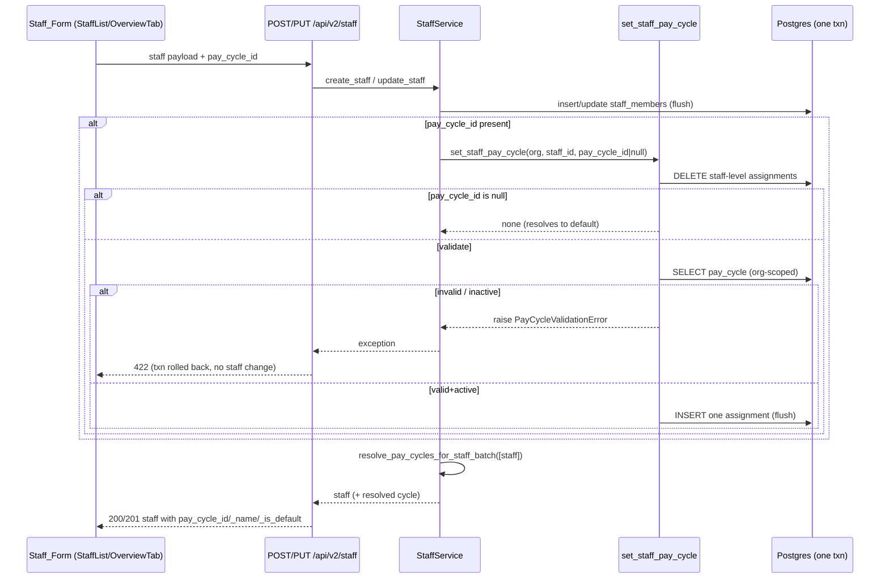
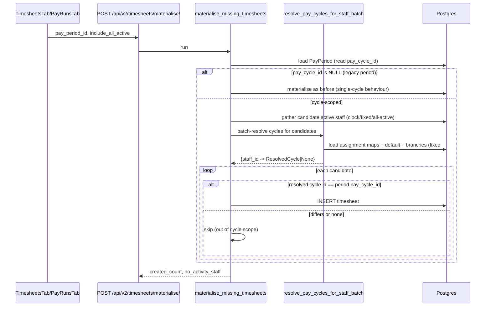

# Design Document — Per-Staff Pay Cycle

## Overview

This feature lets an Org_User assign a specific pay cycle to a staff member from
the staff Add/Edit form, and makes the timesheet + pay-run pipeline respect that
assignment so that mixed-cycle organisations produce correctly separated
timesheets and pay runs. Single-cycle organisations must see no behavioural
change.

The underlying data already exists:

- `pay_cycles` and `pay_cycle_assignments` tables and the `PayCycle` /
  `PayCycleAssignment` ORM models (`app/modules/timesheets/pay_cycles.py`).
- `PayPeriod.pay_cycle_id` (nullable FK to `pay_cycles`, added by migration
  `0219`).
- Service stubs `assign_pay_cycle()`, `resolve_pay_cycle_for_staff()` (partly
  unfinished), and `auto_generate_pay_periods()`.
- Endpoints under `/api/v2/pay-cycles` (list, create, generate-periods,
  assignments) and `/api/v2/pay-periods` (list/detail).
- The staff CRUD surface (`StaffService.create_staff` / `update_staff`, the
  `POST`/`PUT /api/v2/staff` routes, and `StaffMemberCreate/Update/Response`).
- `materialise_missing_timesheets()` and `run_pay_period()`.

The work is therefore integration and completion, not green-field: wire a
selector into the staff form, persist the choice as a staff-level
`pay_cycle_assignment` with correct replace semantics, finish the resolution
algorithm (the `employment_type` branch is currently a `pass` stub and the whole
function uses `scalar_one_or_none()` which *raises* if duplicate assignments
exist), scope materialisation and pay runs to the period's cycle, generate
periods for every active cycle, and label periods by cycle in the UI.

### Goals

1. Select and persist a pay cycle per staff member with clean replace semantics
   (exactly one staff-level assignment ever exists per staff member).
2. Complete and harden `resolve_pay_cycle_for_staff` (priority order, active-only,
   never raise on duplicates).
3. Scope materialisation and pay runs to the period's cycle.
4. Generate and label pay periods across multiple cycles.
5. Preserve single-cycle behaviour exactly (backward compatibility).

### Non-Goals

- Building a pay-cycle CRUD UI (already exists under Timesheets → Settings).
- Changing payslip math, leave accrual, or PAYE logic.
- Adding a branch picker or employment-type picker to the staff form (only the
  per-staff cycle selector is in scope; branch / employment_type / all
  assignments remain managed through the existing assignments endpoint).

## Architecture

### Where the pieces live

```
Frontend (frontend-v2)
  StaffList.tsx (Add modal)         ─┐
  tabs/OverviewTab.tsx (Edit)        ├─ pay-cycle <select>, prefilled from staff response
  api/staff.ts                       │   sends pay_cycle_id in the staff payload
                                     │
  staff-timesheets/TimesheetsTab.tsx ┐
  staff-timesheets/PayRunsTab.tsx    ├─ generate periods for ALL active cycles,
  api/payslips.ts                    ┘   label each period by its cycle name

Backend (app/modules)
  staff/schemas.py     pay_cycle_id on Create/Update; pay_cycle_id/_name/_is_default on Response
  staff/service.py     create_staff / update_staff call set_staff_pay_cycle() in-txn;
                        list_staff / get_staff batch-resolve the cycle for the response
  timesheets/pay_cycles.py
                        set_staff_pay_cycle()         (NEW — replace semantics)
                        resolve_pay_cycle_for_staff() (FIXED — employment_type, .limit(1), active)
                        resolve_pay_cycles_for_staff_batch() (NEW — O(1)-query batch resolver)
                        auto_generate_pay_periods()   (cycle-scoped existence check)
  timesheets/service.py materialise_missing_timesheets() — cycle-scoped membership
  timesheets/payrun.py  run_pay_period() — guard against null pay_cycle_id (REQ 8.5)
  timesheets/router.py  /pay-cycles/generate-periods loops active cycles
  payslips/schemas.py   PayPeriodResponse gains pay_cycle_name
  payslips/router.py    list_pay_periods joins PayCycle for the name
```

### Request flows (high level)

**Create / edit staff with a cycle.** The staff form submits the normal staff
payload plus an optional `pay_cycle_id`. The staff route calls the existing
`StaffService.create_staff` / `update_staff`, which — within the same DB
transaction (the `session.begin()` auto-commit boundary of `get_db_session`) —
calls `set_staff_pay_cycle()`. If the cycle is invalid (wrong org or inactive),
the service raises a validation error and the whole operation is rejected with
HTTP 422; no staff row and no assignment is written. On success the route returns
the staff record enriched with its resolved cycle.

**Materialisation / pay run.** When the Org_User picks a period and clicks
Generate Timesheets, `materialise_missing_timesheets` loads the period's
`pay_cycle_id`, batch-resolves every active staff member's cycle once, and
creates timesheet rows only for the staff whose resolved cycle equals the
period's cycle. The pay run then operates on the period's timesheets, which are
already cycle-scoped, and refuses to run if the period has no `pay_cycle_id`.

### Key architectural decisions

#### Decision 1 — Reuse `pay_cycle_assignments` (`target_type='staff'`); no `staff_members` migration

A staff-level cycle choice is stored as a `PayCycleAssignment` row with
`target_type='staff'`, `target_id=staff_id`, `org_id=org_id`,
`pay_cycle_id=<chosen>`. We do **not** add a `staff_members.pay_cycle_id` column.

Rationale:

- The resolution model is inherently multi-level (staff > employment_type >
  branch > all > default). A column on `staff_members` would only express the
  staff level and would split the source of truth across two mechanisms, forcing
  the resolver to read two places and reconcile precedence. One assignments table
  keeps a single, uniform lookup path.
- `pay_cycle_assignments` already has the right shape, the right tenant scoping
  (`org_id`), `ON DELETE CASCADE` from `pay_cycles`, and a
  `UNIQUE(pay_cycle_id, target_type, target_id)` guard.
- No migration on the large, hot `staff_members` table (132+ tables, real
  production data on Pi PROD). Lower blast radius.
- The existing `/pay-cycles/{id}/assignments/` endpoint and `assign_pay_cycle()`
  already write into this table; reusing it keeps one write path.

Trade-off: resolving a staff member's cycle needs a join rather than a column
read. We mitigate the N+1 risk with a batch resolver (Decision 4).

#### Decision 2 — `set_staff_pay_cycle()` with delete-then-insert replace semantics

A new service function owns the staff-level write and fixes the duplicate hazard:

```python
async def set_staff_pay_cycle(
    db, *, org_id: UUID, staff_id: UUID, pay_cycle_id: UUID | None,
) -> PayCycleAssignment | None:
    # 1. Always remove any existing staff-level assignment(s) for this staff.
    await db.execute(
        delete(PayCycleAssignment).where(
            PayCycleAssignment.org_id == org_id,
            PayCycleAssignment.target_type == "staff",
            PayCycleAssignment.target_id == staff_id,
        )
    )
    # 2. Clearing the cycle => leave zero assignments (resolves to default).
    if pay_cycle_id is None:
        await db.flush()
        return None
    # 3. Validate the cycle belongs to the org AND is active.
    cycle = (await db.execute(
        select(PayCycle).where(
            PayCycle.id == pay_cycle_id,
            PayCycle.org_id == org_id,
        )
    )).scalar_one_or_none()
    if cycle is None:
        raise PayCycleValidationError("pay_cycle_not_found")
    if not cycle.active:
        raise PayCycleValidationError("pay_cycle_inactive")
    # 4. Insert the single new assignment.
    assignment = PayCycleAssignment(
        org_id=org_id, pay_cycle_id=pay_cycle_id,
        target_type="staff", target_id=staff_id,
    )
    db.add(assignment)
    await db.flush()
    await db.refresh(assignment)
    return assignment
```

Why delete-then-insert rather than upsert-on-conflict: the `UNIQUE` key is
`(pay_cycle_id, target_type, target_id)`. *Switching* a staff member from cycle A
to cycle B changes `pay_cycle_id`, so an `ON CONFLICT` on the unique key would
not match the old row and would leave A behind — producing two staff-level rows
and the exact `scalar_one_or_none()` "multiple rows" crash this feature must fix.
Deleting all staff-level rows for the staff first guarantees the post-condition:
**at most one** staff-level assignment per staff member (REQ 3.1, 3.4).
Re-assigning the same cycle (delete the row, insert an equivalent one) is
idempotent and reports success (REQ 3.2). Passing `pay_cycle_id=None` clears the
assignment so the staff member falls back to the default cycle (REQ 3.3, 2.3).

`PayCycleValidationError` is a new lightweight service exception (mirrors the
existing `MinimumWageBelowThresholdError` / `DuplicateStaffError` pattern in
`staff/service.py`) carrying a machine code so the route can map it to HTTP 422.

#### Decision 3 — Finish `resolve_pay_cycle_for_staff`; encode `employment_type` as a deterministic UUID

Three fixes to the existing function:

1. **Never raise on duplicates.** Replace every `scalar_one_or_none()` with an
   ordered `.limit(1)` + `.scalars().first()`. Even though Decision 2 enforces a
   single staff-level row, legacy data on production may already contain
   duplicates; resolution must degrade gracefully, not 500. Order by
   `PayCycleAssignment.created_at` then `PayCycle.id` for a deterministic pick.

2. **Active-only at every level.** Every level keeps `PayCycle.active == True`
   (already present on most branches; make it uniform), so an inactive cycle is
   skipped and resolution falls through to the next level (REQ 4.5).

3. **Implement the `employment_type` level.** `PayCycleAssignment.target_id` is
   `UUID`-typed but `employment_type` is text (`permanent` / `casual` /
   `fixed_term`). We encode the employment type as a **deterministic UUIDv5**:

   ```python
   import uuid
   # Fixed namespace constant for employment-type assignment target ids.
   EMPLOYMENT_TYPE_NS = uuid.UUID("6f9619ff-8b86-d011-b42d-00c04fc964ff")

   def employment_type_target_id(employment_type: str) -> uuid.UUID:
       return uuid.uuid5(EMPLOYMENT_TYPE_NS, employment_type)
   ```

   Resolution computes `employment_type_target_id(staff.employment_type)` and
   matches `target_type='employment_type' AND target_id=<that uuid>`. The
   `/pay-cycles/{id}/assignments/` endpoint applies the identical encoding when
   `target_type='employment_type'` (it currently passes the raw `target_id`
   through; it will encode the supplied employment-type string instead).

   Why UUIDv5 over the alternatives:
   - **No migration.** Keeps `target_id` UUID-typed and the existing
     `UNIQUE(pay_cycle_id, target_type, target_id)` constraint meaningful
     (one cycle per employment type).
   - **Deterministic + stable.** The same employment-type string always maps to
     the same UUID, so write-side and resolve-side agree without storing a lookup
     table.
   - The alternative (adding a nullable `target_employment_type text` column)
     would require a migration and a second matching path; the deterministic
     mapping is cleaner and self-contained.

   The set of employment types is the small fixed `EmploymentType` literal
   (`permanent` / `casual` / `fixed_term`), so collisions are a non-issue.

The corrected priority order is: staff → employment_type → branch → all →
default cycle, returning the first matching **active** cycle, or `None` when
nothing matches and the org has no default (REQ 4.1–4.6).

> **Branch level note.** `StaffMember` has no `branch_id` column — branch
> membership is expressed via `StaffLocationAssignment` (`staff_id → location_id`).
> The single-staff resolver keeps its `branch_id` parameter (callers that already
> know the branch pass it). The batch resolver (Decision 4) derives a staff
> member's branch from their primary `StaffLocationAssignment`; a staff member
> with zero or ambiguous (multiple) location assignments skips the branch level
> and falls through to `all` / default. This keeps single-cycle and
> staff-level-only orgs fully correct and documents the branch behaviour rather
> than silently dropping it.

#### Decision 4 — Batch resolver to avoid N+1

Listing staff and materialising a period both need the resolved cycle for *many*
staff at once. Calling `resolve_pay_cycle_for_staff` per staff issues up to five
queries each. Instead, a batch resolver precomputes the org's assignment maps in
a fixed number of queries and resolves each staff in memory:

```python
async def resolve_pay_cycles_for_staff_batch(
    db, *, org_id, staff_members: list[StaffMember],
) -> dict[UUID, ResolvedCycle | None]:
    # One query each:
    #   active_cycles_by_id  : {cycle_id -> PayCycle}  (active only)
    #   staff_assignments    : {staff_id -> cycle_id}        target_type='staff'
    #   emptype_assignments  : {emp_type_uuid -> cycle_id}   target_type='employment_type'
    #   branch_assignments   : {branch_id -> cycle_id}       target_type='branch'
    #   all_assignment       : cycle_id | None               target_type='all'
    #   default_cycle        : PayCycle | None               is_default & active
    #   staff_branch         : {staff_id -> branch_id|None}  from StaffLocationAssignment
    # Then per staff, apply priority in memory and keep only active cycles.
```

`ResolvedCycle` is a small dataclass carrying `(cycle: PayCycle, is_default: bool)`
where `is_default` is true when the staff matched nothing more specific than the
org default — this drives REQ 5.2 ("indicate the Resolved_Cycle is the
Default_Cycle"). The single-staff `resolve_pay_cycle_for_staff` is kept (used by
the staff detail response and any caller with one staff) and is re-expressed as a
thin wrapper over the same priority logic so the two paths cannot diverge.

#### Decision 5 — Relax the `pay_periods` unique constraint for multi-cycle generation (scoped migration)

`pay_periods` has `UNIQUE(org_id, start_date)` (`uq_pay_periods_org_start`). With
multiple cycles, two cycles frequently share a `start_date` (e.g. a weekly and a
fortnightly cycle both anchored to Mondays), which REQ 8.3 explicitly
contemplates ("two Pay_Period records from different Active_Cycle records share
the same date range"). The current constraint makes that impossible: the second
cycle's period is either skipped by the existence check or rejected by the
constraint.

Resolution: a single migration changes the uniqueness key from
`(org_id, start_date)` to `(org_id, pay_cycle_id, start_date)`:

```sql
ALTER TABLE pay_periods DROP CONSTRAINT IF EXISTS uq_pay_periods_org_start;
CREATE UNIQUE INDEX IF NOT EXISTS uq_pay_periods_org_cycle_start
  ON pay_periods (org_id, pay_cycle_id, start_date);
```

This is the **only** schema migration the feature needs, and it is on
`pay_periods` (not `staff_members` — Decision 1 stands). Backward compatibility:
a single-cycle org has one consistent `pay_cycle_id` per start_date, so the new
key behaves identically to the old one (no duplicate periods can appear). The
two existence/idempotency checks that relied on `(org_id, start_date)` are
updated to be cycle-scoped:

- `auto_generate_pay_periods()` existence check becomes
  `WHERE org_id = :org AND pay_cycle_id = :cycle AND start_date = :start`.
- `roll_pay_periods` idempotency recovery (the `UNIQUE`-hit fallback in
  `period_rolling`/its caller) looks up the existing row by
  `(org_id, pay_cycle_id, start_date)`.

> The current alembic head is revision 0224 (`2026_06_13_0001-0224_employee_portal.py`); this migration chains from 0224, making it revision 0225. The index
> creation uses `IF NOT EXISTS` to stay idempotent per project rules.

#### Decision 6 — Pay-run scoping is inherited; add the null-cycle guard

`run_pay_period` already iterates the period's locked timesheets. Because
materialisation is now cycle-scoped (Decision in Components below), the period's
timesheets already belong only to staff on that cycle, so the pay run is
correctly scoped without per-staff filtering inside the pay run (REQ 7.1–7.3).
We add one guard at the top of `run_pay_period`: if the period's `pay_cycle_id`
is `NULL`, refuse to proceed (REQ 8.5).

## Components and Interfaces

### Backend — `app/modules/timesheets/pay_cycles.py`

```python
class PayCycleValidationError(Exception):
    """Raised when a staff-level cycle assignment fails validation.

    code ∈ {"pay_cycle_not_found", "pay_cycle_inactive"}.
    """
    def __init__(self, code: str) -> None: ...

@dataclass
class ResolvedCycle:
    cycle: PayCycle
    is_default: bool   # True when matched only the org default (REQ 5.2)

EMPLOYMENT_TYPE_NS: uuid.UUID                  # fixed namespace constant
def employment_type_target_id(employment_type: str) -> uuid.UUID: ...

async def set_staff_pay_cycle(
    db, *, org_id: UUID, staff_id: UUID, pay_cycle_id: UUID | None,
) -> PayCycleAssignment | None: ...           # NEW (Decision 2)

async def resolve_pay_cycle_for_staff(
    db, *, org_id, staff_id, branch_id=None, employment_type=None,
) -> PayCycle | None: ...                      # FIXED (Decision 3)

async def resolve_pay_cycles_for_staff_batch(
    db, *, org_id: UUID, staff_members: list[StaffMember],
) -> dict[UUID, ResolvedCycle | None]: ...     # NEW (Decision 4)

async def auto_generate_pay_periods(
    db, *, org_id, pay_cycle_id, ahead_count=4,
) -> list[dict]: ...                           # existence check now cycle-scoped
```

`assign_pay_cycle()` is updated so that when `target_type='employment_type'` it
stores `target_id = employment_type_target_id(<string>)`; the assignments route
passes the raw employment-type string and lets the service encode it.

### Backend — `app/modules/staff` (schemas, service, router)

`StaffMemberCreate` / `StaffMemberUpdate` gain one optional, request-only field:

```python
pay_cycle_id: UUID | None = None   # not a staff_members column
```

Tri-state semantics (mirrors the existing `exclude_unset` discipline in
`update_staff`):

| Form action                         | Payload                  | Effect                                  |
|-------------------------------------|--------------------------|-----------------------------------------|
| Create, cycle chosen                | `pay_cycle_id: <uuid>`   | create staff + one staff assignment     |
| Create, no cycle                    | field omitted / `null`   | create staff, no assignment (→ default) |
| Edit, change cycle                  | `pay_cycle_id: <uuid>`   | replace staff assignment                |
| Edit, clear cycle                   | `pay_cycle_id: null`     | delete staff assignment (→ default)     |
| Edit, untouched                     | field omitted            | leave assignment unchanged              |

To distinguish "omitted" from "explicit null" on update we use
`"pay_cycle_id" in payload.model_dump(exclude_unset=True)` (the same technique
the update route already uses for `employment_end_date`).

`StaffMemberResponse` gains three read-only fields:

```python
pay_cycle_id: UUID | None = None        # the resolved cycle's id
pay_cycle_name: str | None = None       # the resolved cycle's name
pay_cycle_is_default: bool = False      # True when resolved via the org default (REQ 5.2)
```

All three are `None` / `False` when the staff member has no resolved cycle (no
match and no default — REQ 5.3).

`StaffService` changes:

- `create_staff(...)`: after the staff row is flushed (so `staff.id` exists),
  if `payload.pay_cycle_id` is set, call `set_staff_pay_cycle(...)` in the same
  transaction. A `PayCycleValidationError` propagates out and aborts the create
  (nothing committed).
- `update_staff(...)`: pop `pay_cycle_id` out of the generic `setattr` dict (it
  is request-only). If the field was present in the payload, call
  `set_staff_pay_cycle(...)` with its value (uuid → set/replace, `None` → clear).
- `get_staff(...)` response path and `list_staff(...)` response path: use
  `resolve_pay_cycles_for_staff_batch` to populate the three response fields. For
  `get_staff`, the batch is a one-element list; for `list_staff`, the whole page
  is resolved in one batch (no N+1).

`POST /api/v2/staff` and `PUT /api/v2/staff/{id}` routes add one `except`:

```python
except PayCycleValidationError as exc:
    raise HTTPException(status_code=422, detail={"detail": exc.code})
```

Because the validation runs inside the service before the request returns and
`get_db_session` commits only on a clean return, a raised
`PayCycleValidationError` rolls back the staff insert/update too (REQ 2.4, 2.5 —
"reject the entire operation … SHALL NOT create or modify the staff member").

### Backend — `app/modules/timesheets/service.py` (materialisation)

`materialise_missing_timesheets` is made cycle-scoped:

1. Load the `PayPeriod`; read `period.pay_cycle_id`. If it is `NULL`, the
   period predates multi-cycle support — preserve legacy behaviour (materialise
   exactly as before) so old single-cycle periods are unaffected (REQ 9.2).
2. Gather the candidate active staff exactly as today (clock-source, fixed-source,
   and — when `include_all_active` — all active staff).
3. Batch-resolve the cycle for every candidate via
   `resolve_pay_cycles_for_staff_batch`.
4. **Membership filter:** create a timesheet only when the staff's resolved cycle
   id equals `period.pay_cycle_id`. Staff with no resolved cycle, or a different
   resolved cycle, are excluded (REQ 6.1–6.4). Excluded staff are not reported as
   `no_activity` — they are simply out of scope for this cycle.

The rostered-minute seeding for fixed staff is unchanged; only the *membership*
of the loop changes.

### Backend — `app/modules/timesheets/payrun.py`

`run_pay_period` gains a guard before any work:

```python
period = await db.get(PayPeriod, pay_period_id)
if period is None or period.pay_cycle_id is None:
    raise PayRunScopingError("pay_period_missing_cycle")   # REQ 8.5
```

The route maps `PayRunScopingError` to HTTP 422. No further filtering is needed —
the period's timesheets are already cycle-scoped by materialisation (REQ 7).

### Backend — period generation across cycles + cycle name on the payload

- `POST /api/v2/pay-cycles/{cycle_id}/generate-periods/` is unchanged per cycle,
  but the frontend now calls it once per active cycle (Decision 7 below). A new
  convenience is optional: an org-level "generate for all active cycles" loop can
  live in the route, iterating active cycles and calling
  `auto_generate_pay_periods` for each. We implement the loop on the frontend to
  keep the endpoint contract stable, and document the server loop as an optional
  follow-up.
- `PayPeriodResponse` gains `pay_cycle_name: str | None = None`.
  `list_pay_periods` left-joins `PayCycle` and populates the name so the period
  selector can label each period by cycle without an extra round-trip:

  ```python
  rows = await db.execute(
      select(PayPeriod, PayCycle.name)
      .outerjoin(PayCycle, PayCycle.id == PayPeriod.pay_cycle_id)
      .where(PayPeriod.org_id == org_id)
      .order_by(PayPeriod.start_date.desc())
      .offset(offset).limit(limit)
  )
  # build PayPeriodResponse(..., pay_cycle_name=name)
  ```

### Frontend — `frontend-v2`

`api/staff.ts`: extend the staff create/update payload type and the staff
response type with `pay_cycle_id`, `pay_cycle_name`, `pay_cycle_is_default`.

`StaffList.tsx` (Add modal) and `tabs/OverviewTab.tsx` (Edit):

- On mount, fetch `GET /api/v2/pay-cycles/` (active cycles, `{ items, total }`).
- Render a pay-cycle `<select>` only when `items.length > 0`. When there are no
  active cycles, hide the selector and show a hint: "No pay cycle configured —
  set one up under Timesheets → Settings." (REQ 1.5, 1.6).
- The select includes a "Use organisation default" empty option (REQ 1.4); the
  hint text names the default cycle when one is flagged `is_default`.
- Edit prefills the select from `staff.pay_cycle_id` when
  `pay_cycle_is_default` is false (an explicit assignment); when the staff
  resolves via default, the empty "Use organisation default" option is selected
  (REQ 1.3, 1.4).
- Submit includes `pay_cycle_id` in the staff payload (uuid or `null` when the
  user picked "Use organisation default" on edit to clear an existing
  assignment). Consume responses safely (`res.data?.items ?? []`).

`staff-timesheets/TimesheetsTab.tsx` and `PayRunsTab.tsx`:

- Replace the "use first cycle" period bootstrap with a loop over **all** active
  cycles, calling `POST /api/v2/pay-cycles/{id}/generate-periods/` for each
  (REQ 8.1).
- Fetch `/api/v2/pay-periods` and group/label options by `pay_cycle_name` in the
  period `<select>` (e.g. `optgroup` per cycle, or a `"<Cycle> · Wk 24 · 8–21
  Jun"` label). Periods sharing a date range across cycles are disambiguated by
  the cycle name (REQ 8.2, 8.3).
- The selected period id continues to drive materialise / pay-run calls; the
  backend derives scope from that period's `pay_cycle_id` (REQ 8.4).

## Data Models

No new tables. One unique-constraint change (Decision 5).

### `pay_cycle_assignments` (existing — usage clarified)

| Column        | Type   | Notes                                                            |
|---------------|--------|------------------------------------------------------------------|
| id            | uuid   | PK                                                               |
| pay_cycle_id  | uuid   | FK → pay_cycles, ON DELETE CASCADE                               |
| org_id        | uuid   | tenant scope                                                     |
| target_type   | text   | `all` \| `branch` \| `employment_type` \| `staff`               |
| target_id     | uuid?  | staff → `staff_id`; branch → `branch_id`; employment_type → `uuid5(EMPLOYMENT_TYPE_NS, type)`; all → NULL |
| created_at    | tstz   | used for deterministic ordering in resolution                   |

`UNIQUE(pay_cycle_id, target_type, target_id)` is unchanged. For staff-level
rows, `set_staff_pay_cycle` enforces the stronger invariant *at most one row per
`(org_id, target_type='staff', target_id=staff_id)`* by deleting before insert.

### `pay_periods` (existing — constraint relaxed)

`pay_cycle_id` (nullable FK) already exists. Migration replaces
`UNIQUE(org_id, start_date)` with `UNIQUE(org_id, pay_cycle_id, start_date)`.

### Resolution priority (reference)

```
staff           target_type='staff',           target_id = staff_id
employment_type target_type='employment_type', target_id = uuid5(NS, staff.employment_type)
branch          target_type='branch',          target_id = staff's primary branch (from location assignment)
all             target_type='all',             target_id = NULL
default         pay_cycles.is_default = true
```
Every level requires `pay_cycles.active = true`. First match wins; `None` when
nothing matches and no default exists.

### Sequence — create/edit staff with a cycle



### Sequence — cycle-scoped materialisation



## Resolution Algorithm (corrected, in-memory batch form)

```
inputs:
  active_cycles_by_id        # active cycles only
  staff_assignments[staff_id] -> cycle_id
  emptype_assignments[uuid5(type)] -> cycle_id
  branch_assignments[branch_id] -> cycle_id
  all_cycle_id               # may be None
  default_cycle              # active & is_default, may be None
  staff_branch[staff_id]     # branch from primary location assignment, may be None

resolve(staff):
  # 1. staff level
  c = staff_assignments.get(staff.id)
  if c and c in active_cycles_by_id: return ResolvedCycle(active_cycles_by_id[c], is_default=False)
  # 2. employment_type level
  c = emptype_assignments.get(uuid5(NS, staff.employment_type))
  if c and c in active_cycles_by_id: return ResolvedCycle(active_cycles_by_id[c], is_default=False)
  # 3. branch level
  b = staff_branch.get(staff.id)
  if b is not None:
      c = branch_assignments.get(b)
      if c and c in active_cycles_by_id: return ResolvedCycle(active_cycles_by_id[c], is_default=False)
  # 4. all level
  if all_cycle_id and all_cycle_id in active_cycles_by_id:
      return ResolvedCycle(active_cycles_by_id[all_cycle_id], is_default=False)
  # 5. default
  if default_cycle is not None: return ResolvedCycle(default_cycle, is_default=True)
  # 6. nothing
  return None
```

Notes:
- A cycle id referenced by an assignment but **not** present in
  `active_cycles_by_id` (because the cycle is inactive) is skipped, so resolution
  falls through (REQ 4.5). It does **not** short-circuit to "no cycle".
- `is_default=True` only on the default branch, satisfying REQ 5.2.
- The single-staff `resolve_pay_cycle_for_staff` returns just the `PayCycle`
  (or `None`) and is implemented by building one-element maps and running the
  same logic, so behaviour is identical to the batch path.

## Error Handling

| Condition                                                   | Where                       | Result |
|-------------------------------------------------------------|-----------------------------|--------|
| `pay_cycle_id` not in org                                   | `set_staff_pay_cycle`       | `PayCycleValidationError("pay_cycle_not_found")` → HTTP 422; staff create/update rolled back (REQ 2.4) |
| `pay_cycle_id` refers to inactive cycle                     | `set_staff_pay_cycle`       | `PayCycleValidationError("pay_cycle_inactive")` → HTTP 422; rolled back (REQ 2.5) |
| Switching cycles when a staff assignment already exists     | `set_staff_pay_cycle`       | old row deleted first; exactly one row remains (REQ 3.1, 3.4) |
| Re-assigning the same cycle                                 | `set_staff_pay_cycle`       | delete + re-insert equivalent row; success (REQ 3.2) |
| Clearing the cycle on edit (`pay_cycle_id=null`)            | `set_staff_pay_cycle`       | row deleted; resolves to default (REQ 3.3) |
| Duplicate legacy staff assignments in the DB                | `resolve_*`                 | `.limit(1)` ordered pick; never raises (hardening) |
| Inactive cycle encountered mid-resolution                   | `resolve_*`                 | skipped; falls through to next level (REQ 4.5) |
| No match and no default cycle                               | `resolve_*`                 | returns `None`; response fields null (REQ 4.6, 5.3) |
| Period has no `pay_cycle_id` at pay run                     | `run_pay_period`            | `PayRunScopingError` → HTTP 422; no pay run (REQ 8.5) |
| Period has no `pay_cycle_id` at materialisation (legacy)    | `materialise_missing_*`     | legacy behaviour preserved (REQ 9.2) |
| No active cycles when opening the staff form                | frontend                    | selector hidden; "configure under Timesheets → Settings" hint (REQ 1.5, 1.6) |

All raised service exceptions carry a machine `code` only (no raw DB/exception
text leaks to the client), consistent with the existing staff error envelopes.
Validation runs inside the request transaction so a rejection leaves the staff
row untouched.

## Correctness Properties

*A property is a characteristic or behavior that should hold true across all
valid executions of a system — essentially, a formal statement about what the
system should do. Properties serve as the bridge between human-readable
specifications and machine-verifiable correctness guarantees.*

### Property 1: Resolution honours the priority order

*For any* organisation and staff member, given an arbitrary set of active
assignments across the levels (staff, employment_type, branch, all) plus an
optional default cycle, `resolve_pay_cycle_for_staff` returns the cycle from the
**most specific** level that has a matching active assignment, following the
order staff → employment_type → branch → all → default.

**Validates: Requirements 4.1, 4.2, 4.4, 9.1**

### Property 2: Inactive cycles are excluded at every level

*For any* staff member whose highest-priority matching assignment points at an
**inactive** cycle, resolution skips that level and returns the next
lower-priority match (or the default, or `None`) — it never returns an inactive
cycle and never short-circuits to `None` solely because the most specific match
was inactive.

**Validates: Requirements 4.5**

### Property 3: Fallback to default when no specific match

*For any* staff member with no matching assignment at the staff, employment_type,
branch, or all levels, resolution returns the org's default cycle when one exists
(and reports it as the default), and returns `None` when no default exists.

**Validates: Requirements 4.3, 4.6, 5.2, 5.3, 9.1, 9.3**

### Property 4: Exactly-one-staff-assignment invariant under set/replace

*For any* sequence of `set_staff_pay_cycle` calls for a given staff member (any
mix of distinct cycles, repeated cycles, and clears), after each call the number
of `target_type='staff'` assignments for that staff member is at most one — and
is exactly one if and only if the last call supplied a non-null cycle id.

**Validates: Requirements 3.1, 3.2, 3.4**

### Property 5: Clearing the cycle resolves to default

*For any* staff member with an existing staff assignment, calling
`set_staff_pay_cycle(..., pay_cycle_id=None)` removes the assignment, after which
resolution returns the org default cycle (when one exists).

**Validates: Requirements 3.3, 2.3**

### Property 6: Invalid or inactive cycle is rejected atomically

*For any* staff create or update carrying a `pay_cycle_id` that is not in the
org or is inactive, the operation raises a validation error and leaves the
database unchanged — no staff row is created or modified and no staff assignment
is created.

**Validates: Requirements 2.4, 2.5**

### Property 7: Persisted assignment round-trips to the response

*For any* staff member created or updated with a valid active `pay_cycle_id`, the
returned staff record's `pay_cycle_id` equals the chosen cycle and
`pay_cycle_is_default` is false; and re-reading the staff member yields the same
resolved cycle.

**Validates: Requirements 2.1, 2.2, 5.1**

### Property 8: Cycle-scoped materialisation membership

*For any* pay period with a non-null `pay_cycle_id` and any population of active
staff with arbitrary resolved cycles, the set of staff for whom
`materialise_missing_timesheets` creates a timesheet is exactly the set of
candidate active staff whose resolved cycle equals the period's `pay_cycle_id`;
staff with a different resolved cycle or no resolved cycle get no timesheet.

**Validates: Requirements 6.1, 6.2, 6.3, 6.4, 7.1, 7.2**

### Property 9: Single-cycle regression equivalence

*For any* organisation with exactly one active cycle that is the default and no
staff/employment_type/branch assignments, the set of staff materialised for that
cycle's period equals the set of active staff that the pre-feature
materialisation (clock + fixed + `include_all_active`) would have produced.

**Validates: Requirements 9.1, 9.2, 9.3**

### Property 10: Independent per-cycle pay runs

*For any* organisation with two or more active cycles and periods materialised
per cycle, running the pay run for each period produces results drawn only from
that period's cycle staff, and no staff member is processed under a period whose
cycle differs from their resolved cycle.

**Validates: Requirements 7.3**

> **Property reflection.** Initial candidates included separate properties for
> "adding a staff assignment creates a row" and "switching cycles replaces the
> row"; these are subsumed by Property 4 (the exactly-one invariant across any
> call sequence) plus Property 7 (round-trip). A separate "resolution returns the
> staff cycle when present" property was merged into Property 1 (priority order
> with staff as the top level). "Materialisation excludes no-cycle staff" and
> "materialisation excludes other-cycle staff" were combined into Property 8 (a
> single membership-equality statement). REQ 10's testing criteria are not
> themselves runtime properties — they are satisfied by implementing Properties
> 1–9 as the test suite (see Testing Strategy).

## Testing Strategy

This feature is well suited to property-based testing for the resolution
algorithm and the materialisation membership logic — both are deterministic
functions of (assignments, staff attributes, cycle active flags, period cycle)
with a large input space and clear universal properties. The staff-form
persistence and the frontend selector are better covered by example/integration
tests.

### Property-based tests

- Library: **Hypothesis** (already in use — see `.hypothesis/` and
  `tests/` per project overview), against an async DB session fixture.
- Minimum **100 iterations** per property.
- Each property test references its design property with a tag comment:
  `# Feature: per-staff-pay-cycle, Property {n}: {property text}`.
- Generators produce: an org with 0..k cycles (random active flags, one optional
  default), random assignments across the four levels, and a population of staff
  with random `employment_type` and optional branch/location. The same generated
  fixtures drive resolution and materialisation properties.
- Map design Properties 1–10 to one property test each:
  - P1–P3, P5 → `resolve_pay_cycles_for_staff_batch` / `resolve_pay_cycle_for_staff`.
  - P4 → randomised sequences of `set_staff_pay_cycle` calls, asserting the
    count invariant after each (REQ 10.5).
  - P6 → create/update with invalid/inactive ids asserting rollback.
  - P7 → create/update then read-back round-trip.
  - P8 → `materialise_missing_timesheets` membership equals the resolved set
    (REQ 10.4, both single- and multi-cycle generators).
  - P9 → single-cycle generator: assert materialised set equals a reference
    "pre-feature" computation (clock + fixed + all-active), guarding the
    regression (REQ 10.6).
  - P10 → two-cycle generator: per-period pay-run staff sets are disjoint by
    cycle.

### Example / unit tests

- `set_staff_pay_cycle`: switch A→B leaves one row; re-assign A→A succeeds;
  clear removes the row; wrong-org id and inactive id raise the typed error.
- `employment_type_target_id`: stable mapping; resolver matches an
  employment_type assignment written through the assignments endpoint.
- `run_pay_period`: refuses a period with `pay_cycle_id=NULL` (REQ 8.5); runs a
  scoped period normally.
- `list_pay_periods`: response carries `pay_cycle_name`; periods from two cycles
  sharing a date range are present and distinguishable (after the constraint
  migration).
- Route tests: `POST`/`PUT /api/v2/staff` with `pay_cycle_id` returns 201/200
  with the resolved cycle; invalid id returns 422 and persists nothing.

### Frontend tests

- StaffList Add modal / OverviewTab Edit: selector hidden with no active cycles
  and the configure hint shown (REQ 1.5, 1.6); selector populated and prefilled
  from the staff response (REQ 1.3); submit includes `pay_cycle_id`; "Use
  organisation default" sends `null` to clear.
- TimesheetsTab / PayRunsTab: periods grouped/labelled by cycle name; selecting a
  period drives the materialise / pay-run calls with that period id.
- All API consumption uses `?.` and `?? []` / `?? 0` per the safe-API rule.

### Migration test

- Apply the `pay_periods` constraint migration and assert two cycles can each
  hold a period with the same `start_date`, while a single cycle still cannot
  duplicate a `start_date` (idempotency preserved).
```
