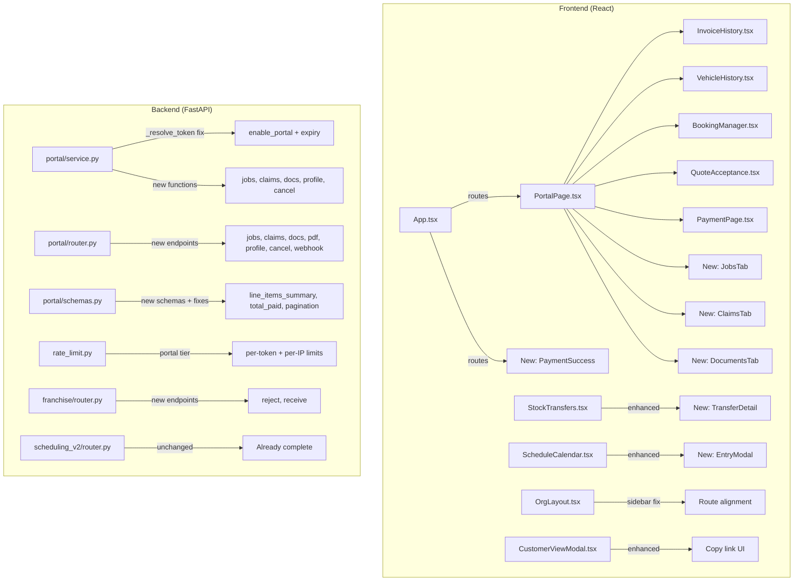

# Design Document — Platform Feature Gaps

## Overview

This design addresses 38 requirements across 7 sections: portal critical bug fixes, security hardening, token lifecycle, feature coverage, UX polish, branch transfer gaps, and staff schedule gaps. These are fixes and enhancements to existing code — not greenfield architecture.

The changes span the backend portal module (`app/modules/portal/`), the frontend portal pages (`frontend/src/pages/portal/`), the franchise/transfer module, the scheduling module, the rate limiter middleware, and the frontend routing/sidebar. The design is organised by the files that change, with each change traced back to its requirement.

## Architecture

The existing architecture remains unchanged. All changes are modifications to existing modules:



### Change Impact Summary

| Area | Files Modified | Files Created | Risk |
|------|---------------|---------------|------|
| Portal bug fixes (Req 1-6) | 5 backend, 4 frontend | 1 frontend (PaymentSuccess) | Medium — fixes runtime crashes |
| Portal security (Req 7-11) | 3 backend, 1 middleware | 0 | High — security-sensitive |
| Portal token lifecycle (Req 12-15) | 2 backend, 2 frontend | 0 | Low — additive |
| Portal feature coverage (Req 16-24) | 2 backend, 5 frontend | 3 frontend (new tabs) | Medium — new endpoints |
| Portal UX polish (Req 25-30) | 2 backend, 4 frontend, 2 mobile | 0 | Low — cosmetic |
| Branch transfers (Req 31-35) | 1 backend, 1 frontend | 1 frontend (detail view) | Low — additive |
| Staff schedule (Req 36-38) | 0 backend | 1 frontend (modal) | Low — frontend only |

## Components and Interfaces

### Section 1: Portal Critical Bug Fixes (Req 1-6)

#### Req 1 — PortalPage Response Shape Alignment

**Problem**: `PortalInfo` TypeScript interface expects flat fields (`customer_name`, `org_name`, `primary_color`, `total_invoices`, `total_paid`). Backend returns nested structure (`customer.first_name`, `branding.org_name`, `branding.primary_colour`, `invoice_count`). Every field is mismatched.

**Frontend fix** — `PortalPage.tsx`:
- Replace the `PortalInfo` interface with one matching `PortalAccessResponse`:

```typescript
interface PortalInfo {
  customer: {
    customer_id: string
    first_name: string
    last_name: string
    email: string | null
    phone: string | null
  }
  branding: {
    org_name: string
    logo_url: string | null
    primary_colour: string | null
    secondary_colour: string | null
    powered_by: {
      platform_name: string
      logo_url: string | null
      signup_url: string | null
      website_url: string | null
      show_powered_by: boolean
    } | null
    language: string | null
  }
  outstanding_balance: number
  invoice_count: number
  total_paid: number
}
```

- Update all render references:
  - `info.customer_name` → `info.customer.first_name + ' ' + info.customer.last_name`
  - `info.org_name` → `info.branding.org_name`
  - `info.primary_color` → `info.branding.primary_colour`
  - `info.total_invoices` → `info.invoice_count`
  - `info.powered_by` → `info.branding.powered_by`
  - `info.language` → `info.branding.language`
- Pass `info.branding.primary_colour ?? '#2563eb'` to child components as `primaryColor`

**Backend fix** — `service.py` `get_portal_access`:
- Add `total_paid` computation: `sa_func.coalesce(sa_func.sum(Invoice.amount_paid), 0)` to the existing aggregate query
- Add `total_paid` field to `PortalAccessResponse` schema in `schemas.py`

#### Req 2 — VehicleHistory Response Shape Fix

**Frontend fix** — `VehicleHistory.tsx`:
- Change API response unpacking: `res.data` → `res.data?.vehicles ?? []`
- Change `PortalVehicle` interface field `services` → `service_history` to match `PortalVehicleItem`
- Map `service_history` fields: `invoice_number` → `invoice_number`, `date` → `date`, `description` → `description`, `total` → `total`
- Guard WOF/Rego badge rendering: only render when `wof_expiry` / `rego_expiry` are present (already conditional but data was never arriving)

**Backend fix** — `schemas.py` `PortalVehicleItem`:
- Add `wof_expiry: date | None = None` and `rego_expiry: date | None = None` fields

**Backend fix** — `service.py` `get_portal_vehicles`:
- Source `wof_expiry` and `rego_expiry` from `GlobalVehicle` or `OrgVehicle` records (these fields exist on the vehicle models)

#### Req 3 — Portal Bookings SQL Fix

**Backend fix** — `service.py` `get_portal_bookings`:
- The bookings table has no `customer_id` column. It stores `customer_name` as text.
- Fix: join bookings to customers via `customer_name` matching `first_name || ' ' || last_name`, scoped by `org_id`. Alternatively (preferred), add a `customer_id` FK column to the bookings table via migration, then backfill from name matching.
- **Recommended approach**: Add `customer_id` column to bookings table (nullable UUID FK to customers). Update `create_portal_booking` to pass `customer_id` (it already receives it). Update the query to `WHERE customer_id = :cid`. This is cleaner than name-matching.
- Migration: `ALTER TABLE bookings ADD COLUMN customer_id UUID REFERENCES customers(id); CREATE INDEX ix_bookings_customer_id ON bookings(customer_id);`

#### Req 4 — PaymentPage Implementation

**Frontend fix** — `PaymentPage.tsx`:
- Replace the static "coming soon" placeholder with a functional payment flow:
  1. Show invoice summary (already present)
  2. Add amount input field pre-filled with `invoice.balance_due` (supports Req 20 partial payments)
  3. On "Pay Now" click: `POST /portal/{token}/pay/{invoice_id}` with `{ amount }`
  4. On success: redirect browser to `response.payment_url` (Stripe Checkout)
  5. On error: display error message from backend

```typescript
const handlePay = async () => {
  setSubmitting(true)
  setError('')
  try {
    const res = await apiClient.post(`/portal/${token}/pay/${invoice.id}`, { amount: payAmount })
    window.location.href = res.data?.payment_url
  } catch (err: any) {
    setError(err?.response?.data?.detail ?? 'Payment failed. Please try again.')
  } finally {
    setSubmitting(false)
  }
}
```

#### Req 5 — Payment Success Route

**Frontend** — new component `PaymentSuccess.tsx` in `frontend/src/pages/portal/`:
- Simple confirmation page: "Payment received — thank you"
- Link back to portal invoices tab
- Reads `token` from URL params

**Frontend** — `App.tsx`:
- Add route: `<Route path="/portal/:token/payment-success" element={<SafePage name="payment-success"><PaymentSuccess /></SafePage>} />`
- Place before the existing `/portal/:token` route so React Router matches it first

#### Req 6 — Invoice Line Items Summary

**Backend fix** — `schemas.py` `PortalInvoiceItem`:
- Add `line_items_summary: str = ""` field

**Backend fix** — `service.py` `get_portal_invoices`:
- After loading invoices with `selectinload(Invoice.line_items)`, compute:
```python
summary = ", ".join(li.description for li in (inv.line_items or []) if li.description)
line_items_summary = summary[:120] + "…" if len(summary) > 120 else summary
```
- Pass `line_items_summary` to `PortalInvoiceItem` constructor

### Section 2: Portal Security Hardening (Req 7-11)

#### Req 7 — Enforce enable_portal Flag

**Backend fix** — `service.py` `_resolve_token`:
- Add filter: `.where(Customer.enable_portal.is_(True))`
- Full query becomes:
```python
stmt = (
    select(Customer)
    .where(Customer.portal_token == token)
    .where(Customer.is_anonymised.is_(False))
    .where(Customer.enable_portal.is_(True))  # NEW
)
```

#### Req 8 — Remove acceptance_token from Quotes Response

**Backend fix** — `schemas.py` `PortalQuoteItem`:
- Remove `acceptance_token: str | None = None` field entirely

**Backend fix** — `service.py` `get_portal_quotes`:
- Stop selecting `acceptance_token` from the raw SQL query
- The `accept_portal_quote` function already looks up `acceptance_token` server-side using `quote_id` + customer ownership — no client-side token needed

#### Req 9 — Portal Rate Limiting

**Backend fix** — `rate_limit.py` `_apply_rate_limits`:
- Add a portal-specific rate limit block before the per-user check:

```python
# --- Portal per-token limit (60/min) ---
if path.startswith("/api/v1/portal/") or path.startswith("/api/v2/portal/"):
    # Extract token from path (second segment after /portal/)
    parts = path.split("/")
    token_segment = parts[4] if len(parts) > 4 else None
    if token_segment:
        key = f"rl:portal:token:{token_segment}"
        allowed, retry_after = await _check_rate_limit(redis, key, 60, now)
        if not allowed:
            # return 429
            ...

    # Per-IP limit on token resolution endpoint (20/min)
    if len(parts) == 5:  # exactly /api/v1/portal/{token}
        client_ip = get_client_ip(request) or "unknown"
        key = f"rl:portal:ip:{client_ip}"
        allowed, retry_after = await _check_rate_limit(redis, key, 20, now)
        if not allowed:
            # return 429
            ...
```

#### Req 10 — Service-Layer Token Expiry Validation

**Backend fix** — `service.py` `_resolve_token`:
- After fetching the customer, add expiry check:
```python
if customer.portal_token_expires_at and customer.portal_token_expires_at < datetime.now(timezone.utc):
    raise ValueError("Invalid or expired portal token")
```
- This is defence-in-depth alongside the middleware check

#### Req 11 — Stripe Connect Webhook

**Backend** — `portal/router.py`:
- Add new endpoint: `POST /portal/stripe-webhook`
- Validate event signature using the Connect webhook signing secret (separate from platform secret)
- Handle `checkout.session.completed` events:
  1. Extract `invoice_id` from session metadata
  2. Look up invoice, update `amount_paid`, `balance_due`, `status`
  3. If `balance_due == 0`: set status to `paid`
  4. If `balance_due > 0`: set status to `partially_paid`

**Backend** — `config.py` / settings:
- Add `stripe_connect_webhook_secret` setting

### Section 3: Portal Token Lifecycle (Req 12-15)

#### Req 12 — Auto-Generate Token on enable_portal

**Backend fix** — `customers/service.py` (or wherever customer update logic lives):
- In the customer update flow, when `enable_portal` transitions to `True` and `portal_token` is `NULL`:
  - Generate `portal_token = uuid.uuid4()`
  - Set `portal_token_expires_at = datetime.now(timezone.utc) + timedelta(days=org.portal_token_ttl_days or 90)`
- When `enable_portal` transitions to `False`:
  - Set `portal_token = None` to revoke access
- Ensure this is accessible to `org_admin` and `salesperson` roles (not just `global_admin`)

#### Req 13 — Send Portal Link Endpoint

**Backend** — `customers/router.py`:
- New endpoint: `POST /api/v2/customers/{id}/send-portal-link`
- Roles: `org_admin`, `salesperson`
- Logic:
  1. Fetch customer, verify `enable_portal == True` and `portal_token is not None`
  2. Verify customer has an email address
  3. Send email with portal URL: `{frontend_base_url}/portal/{portal_token}`
  4. Return 200 with success message

#### Req 14 — Copy Portal Link in CustomerViewModal

**Frontend fix** — `CustomerViewModal.tsx`:
- In the "Preferences & Settings" section, replace the static "Portal Access: Enabled/Disabled" field:
  - When `enable_portal == true` and `portal_token` exists: show the full URL with a "Copy Link" button and a "Send Link" button
  - When disabled: show "Portal Access: Disabled"
- The customer detail API response needs to include `portal_token` (it likely already does since it returns all customer fields)

#### Req 15 — Per-Org Configurable Token TTL

**Backend** — Organisation settings:
- Add `portal_token_ttl_days` to the org settings JSONB (default: 90)
- When generating/regenerating tokens, read `org.settings.get("portal_token_ttl_days", 90)`

**Frontend** — Org Settings page:
- Add a "Portal Token TTL (days)" number input in the portal/security section of settings

### Section 4: Portal Feature Coverage (Req 16-24)

#### Req 16 — Job Status Visibility

**Backend** — `portal/router.py` + `portal/service.py`:
- New endpoint: `GET /portal/{token}/jobs`
- Query: `SELECT * FROM job_cards WHERE customer_id = :cid AND org_id = :oid ORDER BY created_at DESC`
- Return: job status, assigned staff name, description, linked invoice reference, vehicle rego

**Backend** — `portal/schemas.py`:
- New schemas: `PortalJobItem`, `PortalJobsResponse`

**Frontend** — new component `JobsTab.tsx` in `frontend/src/pages/portal/`:
- Display job list with status badges (pending, in_progress, completed, invoiced)
- Add as new tab in `PortalPage.tsx`

#### Req 17 — Claims Visibility

**Backend** — `portal/router.py` + `portal/service.py`:
- New endpoint: `GET /portal/{token}/claims`
- Query claims table by `customer_id` and `org_id`
- Return: claim type, status, description, resolution details, action timeline

**Backend** — `portal/schemas.py`:
- New schemas: `PortalClaimItem`, `PortalClaimActionItem`, `PortalClaimsResponse`

**Frontend** — new component `ClaimsTab.tsx` in `frontend/src/pages/portal/`:
- Display claims list with status badges and action timeline
- Add as new tab in `PortalPage.tsx`

#### Req 18 — Invoice PDF Download

**Backend** — `portal/router.py`:
- New endpoint: `GET /portal/{token}/invoices/{invoice_id}/pdf`
- Validate invoice belongs to customer via token
- Reuse existing PDF generation logic from `invoices/service.py`
- Return PDF with `Content-Type: application/pdf`

**Frontend** — `InvoiceHistory.tsx`:
- Add "Download PDF" button on each invoice row
- Calls the new endpoint and triggers browser download

#### Req 19 — Compliance Documents

**Backend** — `portal/router.py` + `portal/service.py`:
- New endpoint: `GET /portal/{token}/documents`
- Query compliance_documents linked to customer's invoices
- Return: document type, description, linked invoice reference, download URL

**Frontend** — new component `DocumentsTab.tsx` in `frontend/src/pages/portal/`:
- Display documents list with download links
- Add as new tab in `PortalPage.tsx`

#### Req 20 — Partial Payment UI

Covered by Req 4 PaymentPage implementation. The amount input field allows editing between $0.01 and `balance_due`.

#### Req 21 — Contact Details Self-Service Update

**Backend** — `portal/router.py` + `portal/service.py`:
- New endpoint: `PATCH /portal/{token}/profile`
- Accept `phone` and `email` fields
- Validate email format, validate phone format
- Update customer record

**Frontend** — `PortalPage.tsx`:
- Add "My Details" section or tab showing current contact info with edit capability

#### Req 22 — Booking Cancellation

**Backend** — `portal/router.py` + `portal/service.py`:
- New endpoint: `PATCH /portal/{token}/bookings/{booking_id}/cancel`
- Validate booking belongs to customer, status is `pending` or `confirmed`
- Set status to `cancelled`

**Frontend** — `BookingManager.tsx`:
- Add "Cancel" button on bookings with cancellable status

#### Req 23 — Quote Acceptance Notification

**Backend** — `portal/service.py` `accept_portal_quote`:
- After successful acceptance, trigger email notification to org's primary contact
- Include: quote number, customer name, accepted date
- Use existing email sending infrastructure (Celery task or direct send)

#### Req 24 — Booking Confirmation

**Backend** — `portal/service.py` `create_portal_booking`:
- After `svc.create_booking()`, call `svc.send_confirmation(booking)` to transition status to `confirmed`
- Trigger notification to org about new portal booking

### Section 5: Portal UX Polish (Req 25-30)

#### Req 25 — Mobile Share Portal Link Fix

**Mobile** — `InvoiceDetailScreen.tsx` and `QuoteDetailScreen.tsx`:
- Change URL generation from `/portal/invoices/{id}` to `/portal/{customer_portal_token}`
- Backend invoice/quote detail responses need to include `customer_portal_token` field

#### Req 26 — Portal Endpoint Pagination

**Backend** — all portal list endpoints in `router.py`:
- Add `limit: int = Query(20)` and `offset: int = Query(0)` parameters
- Pass to service functions

**Backend** — all portal list functions in `service.py`:
- Apply `.limit(limit).offset(offset)` to queries
- Add `SELECT COUNT(*)` for total
- Return `total` in response schemas

**Backend** — `schemas.py`:
- Add `total: int = 0` to all list response schemas (`PortalInvoicesResponse`, `PortalQuotesResponse`, `PortalVehiclesResponse`, `PortalBookingsResponse`, etc.)

#### Req 27 — Portal i18n

**Frontend** — `PortalPage.tsx` and all portal sub-components:
- Read `branding.language` from API response
- Set `lang` attribute on portal root element
- Pass locale to all `Intl.DateTimeFormat` and `Intl.NumberFormat` calls instead of hardcoding `'en-NZ'`
- Use i18n translation keys (prefixed `portal.*`) for UI strings when non-English locale

#### Req 28 — Booking Form Completeness

**Frontend** — `BookingManager.tsx`:
- Add `service_type` dropdown/text input to booking form
- Add `notes` textarea to booking form
- Include both fields in `POST /portal/{token}/bookings` request body

#### Req 29 — Refund Status Display

**Frontend** — `InvoiceHistory.tsx`:
- Add to `STATUS_CONFIG`:
```typescript
refunded: { label: 'Refunded', variant: 'info' },
partially_refunded: { label: 'Partially Refunded', variant: 'info' },
```

#### Req 30 — Dead Code Cleanup

**Frontend** — `PortalLayout.tsx`:
- Either remove the file entirely, or integrate it as the portal's layout wrapper in `App.tsx`
- If retained: replace hardcoded "Powered by WorkshopPro NZ" with the configurable `PoweredByFooter` component

### Section 6: Branch Transfers (Req 31-35)

#### Req 31 — Reject Transfer Button

**Backend** — `franchise/router.py`:
- New endpoint: `PUT /api/v2/stock-transfers/{id}/reject`
- Calls `FranchiseService.reject_transfer()` (already exists in service)

**Frontend** — `StockTransfers.tsx`:
- Add "Reject" button alongside "Approve" on pending transfers
- Calls `PUT /api/v2/stock-transfers/{id}/reject`

#### Req 32 — Product Search Dropdown

**Frontend** — `StockTransfers.tsx`:
- Replace raw "Product ID" text input with a searchable dropdown
- Query `GET /api/v2/products?search={term}` (or equivalent inventory endpoint)
- Display product name + SKU in dropdown
- Set `product_id` to selected product's UUID

#### Req 33 — Receive Confirmation Step

**Backend** — `franchise/router.py`:
- New endpoint: `PUT /api/v2/stock-transfers/{id}/receive`
- Sets status to `received` (acknowledgement only — stock already moved at execute step)

**Frontend** — `StockTransfers.tsx`:
- Add "Receive" button on transfers with status `executed` when user is at destination location

#### Req 34 — Transfer Detail View

**Frontend** — new component `TransferDetail.tsx` in `frontend/src/pages/franchise/`:
- Navigate to detail view when transfer row is clicked
- Display all fields: source/destination location, product, quantity, status, notes, requested by, approved by, dates
- Show action buttons appropriate to current status

**Frontend** — `App.tsx`:
- Add route: `/stock-transfers/:id` → `TransferDetail`

#### Req 35 — Sidebar Route Fix

**Current state**: Sidebar has "Branch Transfers" linking to `/branch-transfers`. `App.tsx` has the `BranchStockTransfers` component at `/branch-transfers` (imported from `frontend/src/pages/inventory/StockTransfers`). The franchise `StockTransfers` is at `/stock-transfers`.

**Fix**: These are two different components for two different modules. The sidebar entry for "Branch Transfers" at `/branch-transfers` is correct — it maps to `BranchStockTransfers` which is the branch_management-gated version. Verify the route renders correctly. If the `BranchStockTransfers` component doesn't exist or is broken, create it or redirect to the franchise `StockTransfers`.

### Section 7: Staff Schedule (Req 36-38)

#### Req 36 — Create and Edit Schedule Entry UI

**Frontend** — new component `ScheduleEntryModal.tsx` in `frontend/src/pages/schedule/`:
- Modal/slide-over form with fields: staff member (dropdown), title, entry type (job/booking/break/other), start time, end time, notes
- Create mode: `POST /api/v2/schedule`
- Edit mode: `PUT /api/v2/schedule/{id}` (pre-populated with existing data)
- After submit, check for conflicts via `GET /api/v2/schedule/{id}/conflicts` and display warning if any

**Frontend** — `ScheduleCalendar.tsx`:
- Add "New Entry" button in header
- Make entry cards clickable → open edit modal
- Pass `onSave` callback to refresh entries after create/edit

#### Req 37 — Dual Sidebar Entry Clarification

**Frontend** — `OrgLayout.tsx`:
- Option A (recommended): Keep both entries but differentiate:
  - "Schedule" (`/schedule`, module: `scheduling`) — shows the full roster calendar (existing)
  - "Staff Schedule" (`/staff-schedule`, module: `branch_management`, adminOnly) — shows the branch-scoped admin view
- Option B: Remove "Staff Schedule" and keep only "Schedule"
- The current setup already has both entries with different module gates, which is correct if they serve different audiences

#### Req 38 — Drag-and-Drop Rescheduling

**Frontend** — `ScheduleCalendar.tsx`:
- Add drag-and-drop support to `EntryCard` components
- On drop: calculate new `start_time` and `end_time` from the target slot
- Call `PUT /api/v2/schedule/{id}/reschedule` with new times
- If conflict detected, show warning but complete the move
- Implementation: use HTML5 Drag and Drop API or a lightweight library (e.g., `@dnd-kit/core`) — check what's already in the project's dependencies first

## Data Models

### Schema Changes

#### `PortalAccessResponse` (schemas.py) — Req 1
```python
class PortalAccessResponse(BaseModel):
    customer: PortalCustomerInfo
    branding: PortalBranding
    outstanding_balance: Decimal
    invoice_count: int
    total_paid: Decimal = Decimal("0")  # NEW — sum of amount_paid across invoices
```

#### `PortalVehicleItem` (schemas.py) — Req 2
```python
class PortalVehicleItem(BaseModel):
    rego: str
    make: str | None = None
    model: str | None = None
    year: int | None = None
    colour: str | None = None
    wof_expiry: date | None = None    # NEW
    rego_expiry: date | None = None   # NEW
    service_history: list[PortalServiceRecord] = []
```

#### `PortalInvoiceItem` (schemas.py) — Req 6
```python
class PortalInvoiceItem(BaseModel):
    # ... existing fields ...
    line_items_summary: str = ""  # NEW — concatenated line item descriptions
```

#### `PortalQuoteItem` (schemas.py) — Req 8
```python
class PortalQuoteItem(BaseModel):
    # ... existing fields ...
    # REMOVED: acceptance_token: str | None = None
```

#### New Schemas — Req 16, 17, 19, 21

```python
# Jobs (Req 16)
class PortalJobItem(BaseModel):
    id: uuid.UUID
    status: str
    description: str | None = None
    assigned_staff_name: str | None = None
    vehicle_rego: str | None = None
    linked_invoice_number: str | None = None
    estimated_completion: datetime | None = None
    created_at: datetime

class PortalJobsResponse(BaseModel):
    branding: PortalBranding
    jobs: list[PortalJobItem]
    total: int = 0

# Claims (Req 17)
class PortalClaimItem(BaseModel):
    id: uuid.UUID
    reference: str | None = None
    claim_type: str
    status: str
    description: str
    resolution_type: str | None = None
    resolution_notes: str | None = None
    created_at: datetime

class PortalClaimsResponse(BaseModel):
    branding: PortalBranding
    claims: list[PortalClaimItem]
    total: int = 0

# Documents (Req 19)
class PortalDocumentItem(BaseModel):
    id: uuid.UUID
    document_type: str
    description: str | None = None
    linked_invoice_number: str | None = None
    download_url: str

class PortalDocumentsResponse(BaseModel):
    branding: PortalBranding
    documents: list[PortalDocumentItem]
    total: int = 0

# Profile update (Req 21)
class PortalProfileUpdateRequest(BaseModel):
    email: str | None = None
    phone: str | None = None
```

#### Database Migration — Req 3

```sql
-- Add customer_id FK to bookings table
ALTER TABLE bookings ADD COLUMN IF NOT EXISTS customer_id UUID REFERENCES customers(id);
CREATE INDEX IF NOT EXISTS ix_bookings_customer_id ON bookings(customer_id);
```

#### Pagination — Req 26

All portal list response schemas gain a `total: int = 0` field. All portal list endpoints gain `limit` and `offset` query parameters.


## Correctness Properties

*A property is a characteristic or behavior that should hold true across all valid executions of a system — essentially, a formal statement about what the system should do. Properties serve as the bridge between human-readable specifications and machine-verifiable correctness guarantees.*

### Property 1: Portal response field extraction preserves all data

*For any* valid `PortalAccessResponse` with random nested fields (`customer.first_name`, `customer.last_name`, `branding.org_name`, `branding.primary_colour`, `invoice_count`, `outstanding_balance`, `total_paid`), the frontend extraction logic SHALL produce display values where: customer name equals `first_name + " " + last_name`, org name equals `branding.org_name`, primary colour equals `branding.primary_colour`, invoice count equals `invoice_count`, and total paid equals `total_paid`.

**Validates: Requirements 1.1, 1.2, 1.3, 1.5, 1.7**

### Property 2: total_paid equals sum of amount_paid across non-draft non-voided invoices

*For any* set of invoices with random `amount_paid` values and random statuses, the `total_paid` field in `PortalAccessResponse` SHALL equal the sum of `amount_paid` for invoices whose status is not `draft` and not `voided`.

**Validates: Requirements 1.6**

### Property 3: Vehicle expiry dates are sourced when available

*For any* vehicle record (GlobalVehicle or OrgVehicle) with random `wof_expiry` and `rego_expiry` values (including null), the `PortalVehicleItem` response SHALL include those values when present and omit them (null) when the source record has null.

**Validates: Requirements 2.3, 2.4**

### Property 4: Line items summary is correctly computed

*For any* invoice with a random set of line items (0 to N items, each with a random description string), the `line_items_summary` field SHALL equal the comma-joined descriptions truncated to 120 characters with "…" appended if truncated, or an empty string if no line items exist.

**Validates: Requirements 6.1, 6.4**

### Property 5: enable_portal=false blocks token resolution

*For any* customer with a valid `portal_token`, if `enable_portal` is `false`, then `_resolve_token` SHALL raise a `ValueError`. If `enable_portal` is `true` and the token is valid and not expired, then `_resolve_token` SHALL succeed.

**Validates: Requirements 7.1, 7.2, 7.3**

### Property 6: acceptance_token is never present in portal quote responses

*For any* quote returned by `get_portal_quotes`, the serialised `PortalQuoteItem` SHALL NOT contain an `acceptance_token` field.

**Validates: Requirements 8.1, 8.2**

### Property 7: Portal per-token rate limit enforces threshold

*For any* portal token and request count exceeding 60 within a 60-second window, the rate limiter SHALL return HTTP 429 for requests beyond the threshold. For request counts at or below the threshold, all requests SHALL be allowed.

**Validates: Requirements 9.1, 9.3**

### Property 8: Portal per-IP rate limit on token resolution

*For any* IP address and request count exceeding 20 within a 60-second window to the token resolution endpoint (`GET /portal/{token}`), the rate limiter SHALL return HTTP 429 for requests beyond the threshold.

**Validates: Requirements 9.2**

### Property 9: Expired tokens are rejected at service layer

*For any* customer with `portal_token_expires_at` in the past, `_resolve_token` SHALL raise a `ValueError`. For customers with `portal_token_expires_at` in the future or null, the expiry check SHALL pass.

**Validates: Requirements 10.1, 10.2**

### Property 10: Webhook payment updates invoice correctly

*For any* valid `checkout.session.completed` event with a random payment amount and an invoice with a random existing `amount_paid` and `balance_due`, after processing: `amount_paid` SHALL equal the previous `amount_paid` plus the payment amount, `balance_due` SHALL equal the previous `balance_due` minus the payment amount, and `status` SHALL be `paid` if `balance_due` reaches 0 or `partially_paid` if `balance_due` remains positive.

**Validates: Requirements 11.2, 11.3, 11.4**

### Property 11: Token lifecycle on enable_portal toggle

*For any* customer, when `enable_portal` transitions from `false` to `true` and `portal_token` is null, a new UUID token SHALL be generated and `portal_token_expires_at` SHALL be set to `now() + org.portal_token_ttl_days`. When `enable_portal` transitions from `true` to `false`, `portal_token` SHALL be set to null.

**Validates: Requirements 12.1, 12.3**

### Property 12: Token TTL uses org-configured value

*For any* organisation with a random `portal_token_ttl_days` value (1-365), when a portal token is generated, `portal_token_expires_at` SHALL equal `now()` plus that many days (within a 1-second tolerance).

**Validates: Requirements 15.2**

### Property 13: Portal jobs endpoint returns correct fields for all statuses

*For any* customer with jobs in random statuses (pending, in_progress, completed, invoiced), the `GET /portal/{token}/jobs` response SHALL include each job's `status`, `description`, and `created_at`. For jobs with assigned staff, `assigned_staff_name` SHALL be non-null. For completed/invoiced jobs, `linked_invoice_number` and `vehicle_rego` SHALL be present when the source data has them.

**Validates: Requirements 16.2, 16.3**

### Property 14: Portal claims endpoint returns correct fields

*For any* customer with claims in random statuses and types, the `GET /portal/{token}/claims` response SHALL include each claim's `claim_type`, `status`, `description`, and `created_at`. For resolved claims, `resolution_type` and `resolution_notes` SHALL be present when the source data has them.

**Validates: Requirements 17.2**

### Property 15: Invoice PDF access validates ownership

*For any* invoice ID and portal token, the PDF endpoint SHALL return the PDF only if the invoice's `customer_id` matches the customer associated with the token. For non-matching pairs, it SHALL return an error.

**Validates: Requirements 18.2**

### Property 16: Compliance documents include required fields

*For any* compliance document linked to a customer's invoices, the portal response SHALL include `document_type`, `description`, `linked_invoice_number` (when available), and `download_url`.

**Validates: Requirements 19.2**

### Property 17: Partial payment amount validation

*For any* amount value, the payment page SHALL accept amounts where `0.01 <= amount <= balance_due` and reject amounts outside this range.

**Validates: Requirements 20.2, 20.3**

### Property 18: Profile update validates email and phone format

*For any* string submitted as `email`, the endpoint SHALL accept it only if it matches a valid email format. *For any* string submitted as `phone`, the endpoint SHALL accept it only if it matches a valid phone format. Invalid formats SHALL be rejected with a validation error.

**Validates: Requirements 21.2**

### Property 19: Booking cancellation validates ownership and status

*For any* booking ID and portal token, cancellation SHALL succeed only if the booking belongs to the customer AND the booking status is `pending` or `confirmed`. For non-matching ownership or non-cancellable statuses, it SHALL return an error.

**Validates: Requirements 22.2, 22.3**

### Property 20: Quote acceptance notification contains required fields

*For any* quote acceptance event, the notification payload SHALL include the quote number, customer name (first + last), and accepted date.

**Validates: Requirements 23.3**

### Property 21: Portal booking creation results in confirmed status

*For any* valid booking creation request via the portal, the resulting booking status SHALL be `confirmed` (not `pending`).

**Validates: Requirements 24.2**

### Property 22: Mobile portal URL format is correct

*For any* customer with a non-null `portal_token`, the generated share URL SHALL match the pattern `/portal/{portal_token}` (not `/portal/invoices/{id}` or `/portal/quotes/{id}`).

**Validates: Requirements 25.1, 25.2**

### Property 23: Pagination returns correct subset and total

*For any* dataset of N items and random `limit` (1-100) and `offset` (0-N) values, the portal list endpoint SHALL return at most `limit` items, the items SHALL start from position `offset` in the full ordered set, and `total` SHALL equal N regardless of `limit` and `offset`.

**Validates: Requirements 26.2, 26.3**

### Property 24: Locale is passed to formatters

*For any* non-null `branding.language` value, all `Intl.DateTimeFormat` and `Intl.NumberFormat` calls in portal components SHALL use that locale code instead of the hardcoded `'en-NZ'`.

**Validates: Requirements 27.3**

### Property 25: Booking form includes service_type and notes in request

*For any* booking submission where the user has entered a `service_type` and `notes`, the POST request body SHALL include both fields with the user-entered values.

**Validates: Requirements 28.3**

### Property 26: Transfer rejection sets status to rejected

*For any* stock transfer with status `pending`, calling the reject endpoint SHALL set the status to `rejected`.

**Validates: Requirements 31.4**

### Property 27: Transfer receive sets status to received

*For any* stock transfer with status `executed`, calling the receive endpoint SHALL set the status to `received`.

**Validates: Requirements 33.2**

### Property 28: Transfer detail view shows correct action buttons per status

*For any* stock transfer, the detail view SHALL show: "Approve" and "Reject" buttons when status is `pending`, "Execute" button when status is `approved`, "Receive" button when status is `executed`, and no action buttons when status is `received`, `rejected`, or `cancelled`.

**Validates: Requirements 34.3**

### Property 29: Schedule conflict detection flags overlapping entries

*For any* two schedule entries assigned to the same staff member where `entry1.start_time < entry2.end_time AND entry1.end_time > entry2.start_time`, the conflict detection SHALL flag them as conflicting.

**Validates: Requirements 36.6**

### Property 30: Drag-and-drop computes correct new times

*For any* schedule entry dragged from source slot (day, hour, staff) to target slot (day, hour, staff), the computed `start_time` SHALL correspond to the target slot's start, and `end_time` SHALL preserve the original entry's duration.

**Validates: Requirements 38.3**

## Error Handling

### Portal Endpoints

| Error Condition | HTTP Status | Response | Applies To |
|---|---|---|---|
| Invalid/expired/disabled portal token | 400 | `{"detail": "Invalid or expired portal token"}` | All portal endpoints |
| Rate limit exceeded | 429 | `{"detail": "Too many requests..."}` + `Retry-After` header | All portal endpoints |
| Invoice not found or not owned by customer | 400 | `{"detail": "Invoice not found"}` | Pay, PDF download |
| Invoice not payable (draft/voided/paid) | 400 | `{"detail": "Cannot pay an invoice with status '...'"}` | Pay |
| Payment amount exceeds balance | 400 | `{"detail": "Payment amount exceeds outstanding balance"}` | Pay |
| No Stripe Connect account | 400 | `{"detail": "Organisation has not connected a Stripe account"}` | Pay |
| Booking not cancellable | 400 | `{"detail": "Booking cannot be cancelled"}` | Cancel booking |
| Invalid email/phone format | 422 | Pydantic validation error | Profile update |
| Customer has no email (send link) | 400 | `{"detail": "Customer has no email address"}` | Send portal link |
| Portal not enabled (send link) | 400 | `{"detail": "Portal access is not enabled for this customer"}` | Send portal link |
| Stripe webhook signature invalid | 400 | `{"detail": "Invalid webhook signature"}` | Stripe webhook |

### Transfer Endpoints

| Error Condition | HTTP Status | Response |
|---|---|---|
| Transfer not found | 404 | `{"detail": "Transfer not found"}` |
| Transfer not in correct status for action | 400 | `{"detail": "Transfer must be in '...' status"}` |
| Source and destination same | 400 | `{"detail": "Source and destination must be different"}` |

### Schedule Endpoints

| Error Condition | HTTP Status | Response |
|---|---|---|
| end_time before start_time | 422 | `{"detail": "end_time must be after start_time"}` |
| Entry not found | 404 | `{"detail": "Schedule entry not found"}` |
| Conflict detected (warning, not blocking) | 201/200 | Entry created/updated + conflict info in response |

### Frontend Error Handling

- All API calls use try/catch with user-friendly error messages
- Network errors show "Failed to load [resource]. Please try again."
- Payment errors show the backend's `detail` message directly (it's already customer-friendly)
- Rate limit (429) errors show "Too many requests. Please wait a moment and try again."
- All error states include a retry mechanism (refresh button or pull-to-refresh)

## Testing Strategy

### Property-Based Tests (Hypothesis — Python backend)

Property-based testing is appropriate for this feature because many requirements involve pure data transformations, validation logic, and state transitions that vary meaningfully with input.

**Library**: Hypothesis (already in use — `.hypothesis/` directory exists)
**Minimum iterations**: 100 per property test
**Tag format**: `Feature: platform-feature-gaps, Property {N}: {title}`

Tests to implement for each property listed in the Correctness Properties section above. Key test files:

| Test File | Properties Covered |
|---|---|
| `tests/test_portal_service_properties.py` | P2, P4, P5, P6, P9, P10, P11, P12 |
| `tests/test_portal_rate_limit_properties.py` | P7, P8 |
| `tests/test_portal_endpoints_properties.py` | P13, P14, P15, P16, P19, P21, P23 |
| `tests/test_portal_payment_properties.py` | P17 |
| `tests/test_portal_profile_properties.py` | P18 |
| `tests/test_transfer_properties.py` | P26, P27, P28 |
| `tests/test_schedule_properties.py` | P29, P30 |

### Unit Tests (Example-Based)

| Area | Test Cases |
|---|---|
| PortalPage rendering | Verify nested response fields render correctly (P1) |
| VehicleHistory | Verify `res.data?.vehicles ?? []` unpacking, `service_history` field mapping |
| PaymentPage | Verify API call on Pay Now click, redirect to Stripe URL, error display |
| PaymentSuccess | Verify confirmation message and back link |
| InvoiceHistory | Verify `line_items_summary` renders, refund status badges (P29) |
| BookingManager | Verify cancel button on cancellable bookings, service_type/notes in form |
| QuoteAcceptance | Verify acceptance_token not used client-side |
| CustomerViewModal | Verify portal link display and copy button |
| StockTransfers | Verify reject button, product dropdown, receive button |
| ScheduleCalendar | Verify new entry button, entry click opens modal |
| ScheduleEntryModal | Verify form fields, create/edit API calls |

### Integration Tests

| Area | Test Cases |
|---|---|
| Portal bookings query | Verify query executes without `UndefinedColumnError` after migration |
| Stripe Connect webhook | Verify signature validation, invoice status update |
| Send portal link | Verify email delivery with mock SMTP |
| Quote acceptance notification | Verify notification triggered with correct content |
| Transfer reject/receive endpoints | Verify status transitions with real DB |
| Portal PDF download | Verify PDF generation and correct Content-Type header |

### Smoke Tests

| Area | Test Cases |
|---|---|
| Route registration | `/portal/:token/payment-success` renders without 404 |
| New endpoints exist | `GET /portal/{token}/jobs`, `/claims`, `/documents`, `PATCH /profile`, `PATCH /bookings/{id}/cancel` |
| Transfer endpoints | `PUT /stock-transfers/{id}/reject`, `PUT /stock-transfers/{id}/receive` |
| Sidebar routes | `/branch-transfers` renders StockTransfers page |
| Org settings | `portal_token_ttl_days` field exists |

---

## Addendum: Requirements 39-63 — Design Notes

### Section 8: Portal Advanced Security (Req 39-43)

#### Req 39 — Portal Audit Log

**Backend** — `portal/service.py`: After each state-changing portal action (`accept_portal_quote`, `create_portal_booking`, `create_portal_payment`, `update_portal_profile`, `cancel_portal_booking`), call `write_audit_log()` from `app/core/audit.py` with:
- `org_id` from the resolved customer
- `user_id = None` (portal actions have no authenticated user — use a sentinel or the customer ID)
- `action` = `portal.quote_accepted`, `portal.booking_created`, `portal.payment_initiated`, `portal.profile_updated`, `portal.booking_cancelled`
- `ip_address` extracted from the request (pass through from router)

**Router change**: All portal POST/PATCH endpoints need to accept `request: Request` and pass `_get_client_ip(request)` to the service functions.

#### Req 40 — Portal Session and Logout

**Backend** — new table `portal_sessions`:
```sql
CREATE TABLE portal_sessions (
    id UUID PRIMARY KEY DEFAULT gen_random_uuid(),
    customer_id UUID NOT NULL REFERENCES customers(id),
    session_token TEXT NOT NULL UNIQUE,
    expires_at TIMESTAMPTZ NOT NULL,
    last_seen TIMESTAMPTZ,
    created_at TIMESTAMPTZ NOT NULL DEFAULT now()
);
```

**Flow**:
1. Customer visits `/portal/{token}` → `_resolve_token` validates → creates a `portal_session` row → sets `portal_session` HttpOnly cookie
2. Subsequent requests validate the session cookie instead of re-resolving the token
3. "Sign Out" clears the cookie and deletes the session row
4. Session expires after 4 hours of inactivity (`last_seen` + 4h < now`)

**Frontend** — `PortalPage.tsx`: Add "Sign Out" button in header. On click: `POST /portal/logout` → clear state → redirect to "signed out" page.

#### Req 41 — CSRF Protection

**Backend** — `portal/router.py`: Use a double-submit cookie pattern:
1. On session creation, generate a CSRF token and set it as a non-HttpOnly cookie (`portal_csrf`)
2. Frontend reads the cookie and sends it as `X-CSRF-Token` header on all POST/PATCH/PUT/DELETE requests
3. Backend validates the header matches the cookie value

#### Req 42 — Stronger Token Format

**Backend** — wherever `portal_token` is generated (customer service, admin regenerate endpoint):
- Replace `uuid.uuid4()` with `secrets.token_urlsafe(32)`
- No schema change needed — `portal_token` column is already VARCHAR

#### Req 43 — Token URL Exposure Mitigation

**Frontend** — `PortalPage.tsx`:
- Add `<meta name="referrer" content="no-referrer" />` to portal pages
- After successful token validation, call `window.history.replaceState({}, '', '/portal/dashboard')` to remove token from address bar

**Backend** — `portal/router.py`: Add response headers `Cache-Control: no-store` and `Pragma: no-cache` to all portal responses.

### Section 9: Compliance (Req 44-45)

#### Req 44 — Cookie Consent

**Frontend** — new component `CookieConsent.tsx` in `frontend/src/pages/portal/`:
- Renders a bottom banner on first visit (check localStorage for consent)
- Accept/Decline buttons
- On accept: set `portal_cookie_consent=true` in localStorage
- On decline: only essential cookies used (session)

#### Req 45 — DSAR

**Backend** — `portal/router.py`: New endpoint `POST /portal/{token}/dsar` with `{ request_type: "export" | "deletion" }`.
**Backend** — `portal/service.py`: Create a DSAR record (new table or use existing notification system) and notify org admin.
**Frontend** — Add "My Privacy" section in portal with "Request Data Export" and "Request Account Deletion" buttons.

### Section 10: Operational (Req 46-48)

#### Req 46 — Global Portal Enable/Disable

**Backend** — `portal/service.py` `_resolve_token`: After resolving customer, check `org.settings.get("portal_enabled", True)`. If false, raise ValueError.
**Frontend** — Org Settings: Add "Customer Portal" toggle.

#### Req 47 — Portal Analytics

**Backend** — lightweight approach: increment Redis counters on each portal access (`portal:analytics:{org_id}:{date}:{event_type}`). Expose via `GET /api/v2/org/portal-analytics`.
**Frontend** — Org Admin dashboard or settings: display portal usage stats.

#### Req 48 — Portal Access Log

**Backend** — `portal/service.py` `get_portal_access`: Update `customer.last_portal_access_at = now()` on each access.
**Migration**: Add `last_portal_access_at TIMESTAMPTZ` column to customers table.
**Frontend** — Customer list/detail: display the field.

### Section 11: Additional Feature Coverage (Req 49-52)

#### Req 49-51 — Projects, Recurring, Progress Claims

Same pattern as Req 16-17: new endpoint + schema + frontend tab for each. Query by `customer_id` and `org_id`.

#### Req 52 — Self-Service Token Recovery

**Backend** — `portal/router.py`: New endpoint `POST /portal/recover` with `{ email }`.
- Look up all customers with that email where `enable_portal = true` and `portal_token IS NOT NULL`
- Send email with portal links for each org
- Always return 200 with generic message (prevent email enumeration)

**Frontend** — Portal landing page: Add "Forgot your link?" link that shows an email input form.

### Section 12: Branch Transfer Additions (Req 53-55)

#### Req 53 — Transfer Audit Trail

**Backend** — new table `transfer_actions` or JSONB `action_log` on `stock_transfers`:
```sql
CREATE TABLE transfer_actions (
    id UUID PRIMARY KEY DEFAULT gen_random_uuid(),
    transfer_id UUID NOT NULL REFERENCES stock_transfers(id),
    action TEXT NOT NULL,
    performed_by UUID REFERENCES users(id),
    notes TEXT,
    created_at TIMESTAMPTZ NOT NULL DEFAULT now()
);
```
Log each status transition in the service functions.

#### Req 54 — Partial Transfer

**Backend** — `franchise/service.py` `receive_transfer`: Accept optional `received_quantity`. If less than transfer quantity, set status to `partially_received`. Add `received_quantity` and `discrepancy_quantity` columns to `stock_transfers`.

#### Req 55 — Transfer Notifications

**Backend** — After create/approve/execute, send in-app notification to relevant location managers using existing notification system.

### Section 13: Staff Schedule Additions (Req 56-60)

#### Req 56 — Recurring Shifts

**Backend** — `scheduling_v2/service.py`: New `create_recurring_entry` that generates N individual entries based on frequency. Add `recurrence_group_id` UUID to `schedule_entries` to link recurring entries.

#### Req 57 — Shift Templates

**Backend** — new table `shift_templates` with `org_id`, `name`, `start_time`, `end_time`, `entry_type`. CRUD endpoints at `/api/v2/schedule/templates`.
**Frontend** — "Use Template" dropdown in the create entry modal.

#### Req 58 — Leave Tracking

**Backend** — Use existing `entry_type` enum, add `"leave"` value. Conflict detection treats leave as blocking.
**Frontend** — "Add Leave" button in schedule header. Distinct visual style for leave entries.

#### Req 59 — Print/Export

**Frontend** — "Print" button: `window.print()` with `@media print` CSS for the schedule grid. "Export CSV" button: generate CSV from current entries array and trigger download.

#### Req 60 — Mobile Schedule View

**Frontend** — `ScheduleCalendar.tsx`: Add responsive breakpoint. Below 768px: single-column layout showing one staff member at a time with day view. Staff switcher dropdown for managers.

### Sections 14-16: Loyalty UX, Branding, SMS (Req 61-63)

#### Req 61 — Loyalty Empty State

**Frontend** — `LoyaltyBalance.tsx`: Check if loyalty data indicates no programme configured vs zero balance. Show appropriate message for each case.

#### Req 62 — Branding Application

**Frontend** — `PortalPage.tsx`: Apply `primary_colour` to CSS custom properties (`--portal-accent`). Use throughout portal components for buttons, links, active tabs. Already partially designed in Req 1 — this extends it to all interactive elements.

#### Req 63 — SMS History

**Backend** — `portal/router.py`: New endpoint `GET /portal/{token}/messages`. Query `sms_messages` by customer phone number and org_id.
**Frontend** — new component `MessagesTab.tsx` with chat-style layout. Add as tab in `PortalPage.tsx`.
