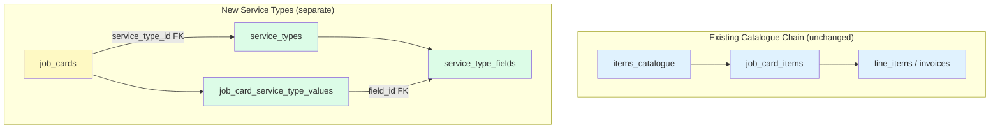
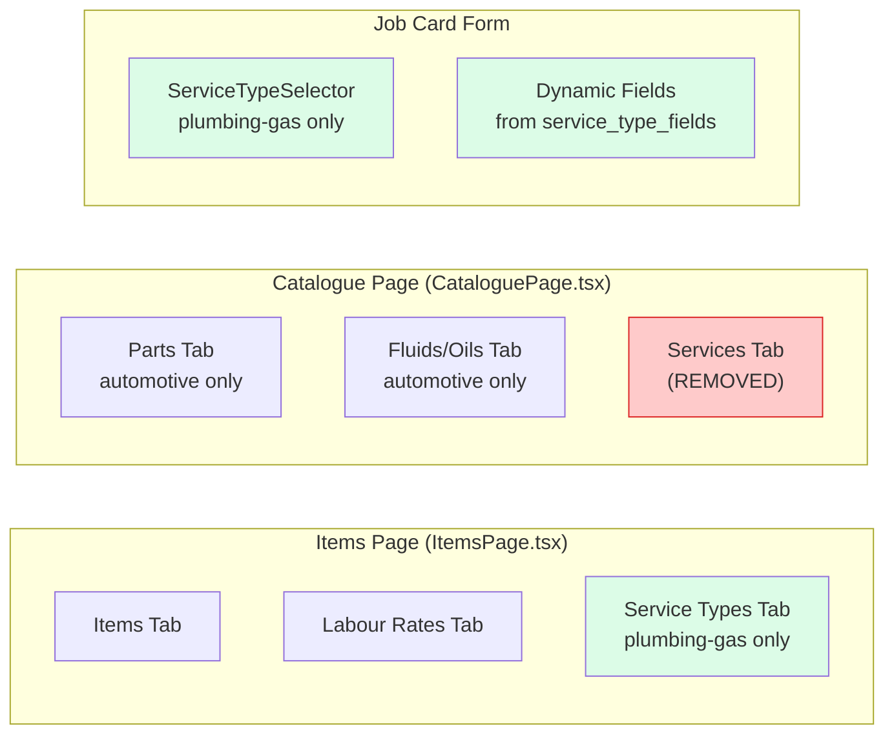

# Design Document: Plumbing Service Types

## Overview

This feature adds a **Service Type Catalogue** for plumbing/gas trade organisations. Service Types are non-priced categories of work (e.g., "Fixture Replacement", "Drain Clearing") with configurable additional info fields that workers fill in on job cards.

The design introduces three new database tables (`service_types`, `service_type_fields`, `job_card_service_type_values`), a new backend module (`app/modules/service_types/`), and frontend components for managing service types on the Items page and selecting them on job cards. The Catalogue page's duplicated "Services" tab is removed.

### Key Constraints (from Requirements)

- Service Types have **no pricing** — they classify work, not price it.
- Service Types do **NOT flow to invoices** — they are metadata on the job card only.
- This is **NOT a new module** — no `module_registry` entry, no setup question. Gated by `tradeFamily === 'plumbing-gas'`.
- The `items_catalogue` table and catalogue reference chain (`items_catalogue` → `job_card_items` → `line_items`) are **untouched**.

## Architecture



Service Types live in a completely separate table hierarchy from the catalogue. The only touchpoint with existing tables is a nullable FK on `job_cards.service_type_id`. Job card line items (`job_card_items`) continue to reference `items_catalogue` for priced items — the two systems are orthogonal.

### Frontend Architecture



## Components and Interfaces

### Backend Module: `app/modules/service_types/`

```
app/modules/service_types/
├── __init__.py
├── models.py      # ServiceType, ServiceTypeField, JobCardServiceTypeValue
├── schemas.py     # Pydantic request/response schemas
├── service.py     # Business logic (CRUD, field value storage)
└── router.py      # FastAPI endpoints mounted at /api/v1/service-types
```

**Router registration** in `app/main.py`:
```python
from app.modules.service_types.router import router as service_types_router
app.include_router(service_types_router, prefix="/api/v1/service-types", tags=["service-types"])
```

### API Endpoints

| Method | Path | Auth | Description |
|--------|------|------|-------------|
| `GET` | `/api/v1/service-types` | org_admin, salesperson | List service types (paginated, filterable) |
| `POST` | `/api/v1/service-types` | org_admin | Create service type with field definitions |
| `GET` | `/api/v1/service-types/{id}` | org_admin, salesperson | Get single service type with fields |
| `PUT` | `/api/v1/service-types/{id}` | org_admin | Update service type (full field replacement) |
| `DELETE` | `/api/v1/service-types/{id}` | org_admin | Delete (if unreferenced) or 409 |

### Request/Response Schemas

**`ServiceTypeFieldDefinition`** (nested in create/update):
```python
class ServiceTypeFieldDefinition(BaseModel):
    label: str = Field(..., min_length=1, max_length=255)
    field_type: Literal["text", "select", "multi_select", "number"]
    display_order: int = Field(0, ge=0)
    is_required: bool = Field(False)
    options: list[str] | None = Field(None)  # for select/multi_select
```

**`ServiceTypeCreateRequest`**:
```python
class ServiceTypeCreateRequest(BaseModel):
    name: str = Field(..., min_length=1, max_length=255)
    description: str | None = Field(None, max_length=2000)
    is_active: bool = Field(True)
    fields: list[ServiceTypeFieldDefinition] = Field(default_factory=list)
```

**`ServiceTypeUpdateRequest`**:
```python
class ServiceTypeUpdateRequest(BaseModel):
    name: str | None = Field(None, min_length=1, max_length=255)
    description: str | None = Field(None, max_length=2000)
    is_active: bool | None = Field(None)
    fields: list[ServiceTypeFieldDefinition] | None = Field(None)  # None = no change, [] = remove all
```

**`ServiceTypeFieldResponse`**:
```python
class ServiceTypeFieldResponse(BaseModel):
    id: str
    label: str
    field_type: str
    display_order: int
    is_required: bool
    options: list[str] | None
```

**`ServiceTypeResponse`**:
```python
class ServiceTypeResponse(BaseModel):
    id: str
    name: str
    description: str | None
    is_active: bool
    fields: list[ServiceTypeFieldResponse]
    created_at: str
    updated_at: str
```

**`ServiceTypeListResponse`**:
```python
class ServiceTypeListResponse(BaseModel):
    service_types: list[ServiceTypeResponse] = Field(default_factory=list)
    total: int = Field(0)
```

### Frontend Components

| Component | Location | Purpose |
|-----------|----------|---------|
| `ServiceTypesTab` | `frontend/src/pages/items/ServiceTypesTab.tsx` | Table listing + create/edit modal trigger |
| `ServiceTypeModal` | `frontend/src/pages/items/ServiceTypeModal.tsx` | Create/edit form with dynamic field builder |
| `ServiceTypeSelector` | `frontend/src/components/service-types/ServiceTypeSelector.tsx` | Dropdown + dynamic field renderer for job cards |

### Trade Family Gating

All new UI is gated by `tradeFamily === 'plumbing-gas'`:

```tsx
const { tradeFamily } = useTenant()
const isPlumbing = (tradeFamily ?? 'automotive-transport') === 'plumbing-gas'

// Items page — conditional tab
{isPlumbing && { id: 'service-types', label: useTerm('service_types', 'Service Types'), content: <ServiceTypesTab /> }}

// Job card form — conditional selector
{isPlumbing && <ServiceTypeSelector ... />}
```

The `?? 'automotive-transport'` fallback ensures existing orgs without a trade family set continue to see the automotive UI (backward compat per steering doc).

### Terminology Integration

The tab label and UI text use `useTerm('service_types', 'Service Types')` from `TerminologyContext`. The backend API paths and field names always use `service-types` / `service_type` — terminology overrides are frontend-only.

## Data Models

### Table: `service_types`

| Column | Type | Constraints | Description |
|--------|------|-------------|-------------|
| `id` | `UUID` | PK, default `gen_random_uuid()` | Unique identifier |
| `org_id` | `UUID` | FK → `organisations.id`, NOT NULL | Owning organisation |
| `name` | `VARCHAR(255)` | NOT NULL | Service type name |
| `description` | `TEXT` | nullable | Optional description |
| `is_active` | `BOOLEAN` | NOT NULL, default `true` | Active/inactive toggle |
| `created_at` | `TIMESTAMPTZ` | NOT NULL, default `now()` | Creation timestamp |
| `updated_at` | `TIMESTAMPTZ` | NOT NULL, default `now()`, onupdate `now()` | Last update timestamp |

**Indexes:**
- `ix_service_types_org_id` on `org_id`
- `uq_service_types_org_name` UNIQUE on `(org_id, name)` WHERE `is_active = true` (partial unique index — allows reuse of names for inactive types)

**RLS:** Enable RLS with policy matching `app.current_org_id` (same pattern as `items_catalogue`).

### Table: `service_type_fields`

| Column | Type | Constraints | Description |
|--------|------|-------------|-------------|
| `id` | `UUID` | PK, default `gen_random_uuid()` | Unique identifier |
| `service_type_id` | `UUID` | FK → `service_types.id` ON DELETE CASCADE, NOT NULL | Parent service type |
| `label` | `VARCHAR(255)` | NOT NULL | Field label |
| `field_type` | `VARCHAR(20)` | NOT NULL, CHECK IN ('text','select','multi_select','number') | Field type |
| `display_order` | `INTEGER` | NOT NULL, default `0` | Sort order |
| `is_required` | `BOOLEAN` | NOT NULL, default `false` | Whether field is required |
| `options` | `JSONB` | nullable | Predefined options for select/multi_select (e.g., `["Option A", "Option B"]`) |

**Indexes:**
- `ix_service_type_fields_service_type_id` on `service_type_id`

### Table: `job_card_service_type_values`

| Column | Type | Constraints | Description |
|--------|------|-------------|-------------|
| `id` | `UUID` | PK, default `gen_random_uuid()` | Unique identifier |
| `job_card_id` | `UUID` | FK → `job_cards.id` ON DELETE CASCADE, NOT NULL | Parent job card |
| `field_id` | `UUID` | FK → `service_type_fields.id`, NOT NULL | Field definition reference |
| `value_text` | `TEXT` | nullable | Text/number value |
| `value_array` | `JSONB` | nullable | Array value for multi_select (e.g., `["opt1", "opt2"]`) |

**Indexes:**
- `ix_jcstv_job_card_id` on `job_card_id`
- `uq_jcstv_job_card_field` UNIQUE on `(job_card_id, field_id)` — one value per field per job card

### Column Addition: `job_cards.service_type_id`

| Column | Type | Constraints | Description |
|--------|------|-------------|-------------|
| `service_type_id` | `UUID` | FK → `service_types.id`, nullable | Selected service type (optional) |

This is a nullable FK — job cards can exist without a service type (Requirement 6.5). The FK has no ON DELETE CASCADE — if a service type is deactivated, existing job cards retain the reference (Requirement 6.6).

### Alembic Migration Plan

**Single migration file:** `alembic/versions/YYYY_MM_DD_HHMM-0140_add_service_types.py`

Steps:
1. `CREATE TABLE service_types` with all columns and indexes
2. `CREATE TABLE service_type_fields` with all columns, FK, and indexes
3. `CREATE TABLE job_card_service_type_values` with all columns, FKs, and indexes
4. `ALTER TABLE job_cards ADD COLUMN service_type_id UUID REFERENCES service_types(id)` (nullable)
5. Create partial unique index: `CREATE UNIQUE INDEX uq_service_types_org_name ON service_types (org_id, name) WHERE is_active = true`
6. Enable RLS on `service_types`, `service_type_fields`, `job_card_service_type_values`
7. Create RLS policies for all three tables

Per the database migration checklist, after creating the migration file, run:
```bash
docker compose -f docker-compose.yml -f docker-compose.dev.yml exec app alembic upgrade head
```

### SQLAlchemy Models

```python
# app/modules/service_types/models.py

class ServiceType(Base):
    __tablename__ = "service_types"
    id: Mapped[uuid.UUID] = mapped_column(UUID(as_uuid=True), primary_key=True, default=uuid.uuid4, server_default=func.gen_random_uuid())
    org_id: Mapped[uuid.UUID] = mapped_column(UUID(as_uuid=True), ForeignKey("organisations.id"), nullable=False)
    name: Mapped[str] = mapped_column(String(255), nullable=False)
    description: Mapped[str | None] = mapped_column(Text, nullable=True)
    is_active: Mapped[bool] = mapped_column(Boolean, nullable=False, server_default="true")
    created_at: Mapped[datetime] = mapped_column(DateTime(timezone=True), nullable=False, server_default=func.now())
    updated_at: Mapped[datetime] = mapped_column(DateTime(timezone=True), nullable=False, server_default=func.now(), onupdate=func.now())
    # Relationships
    fields: Mapped[list[ServiceTypeField]] = relationship(back_populates="service_type", cascade="all, delete-orphan", order_by="ServiceTypeField.display_order")
    organisation = relationship("Organisation", backref="service_types")

class ServiceTypeField(Base):
    __tablename__ = "service_type_fields"
    id: Mapped[uuid.UUID] = mapped_column(UUID(as_uuid=True), primary_key=True, default=uuid.uuid4, server_default=func.gen_random_uuid())
    service_type_id: Mapped[uuid.UUID] = mapped_column(UUID(as_uuid=True), ForeignKey("service_types.id", ondelete="CASCADE"), nullable=False)
    label: Mapped[str] = mapped_column(String(255), nullable=False)
    field_type: Mapped[str] = mapped_column(String(20), nullable=False)
    display_order: Mapped[int] = mapped_column(Integer, nullable=False, server_default="0")
    is_required: Mapped[bool] = mapped_column(Boolean, nullable=False, server_default="false")
    options: Mapped[dict | None] = mapped_column(JSONB, nullable=True)
    # Relationships
    service_type: Mapped[ServiceType] = relationship(back_populates="fields")

class JobCardServiceTypeValue(Base):
    __tablename__ = "job_card_service_type_values"
    id: Mapped[uuid.UUID] = mapped_column(UUID(as_uuid=True), primary_key=True, default=uuid.uuid4, server_default=func.gen_random_uuid())
    job_card_id: Mapped[uuid.UUID] = mapped_column(UUID(as_uuid=True), ForeignKey("job_cards.id", ondelete="CASCADE"), nullable=False)
    field_id: Mapped[uuid.UUID] = mapped_column(UUID(as_uuid=True), ForeignKey("service_type_fields.id"), nullable=False)
    value_text: Mapped[str | None] = mapped_column(Text, nullable=True)
    value_array: Mapped[list | None] = mapped_column(JSONB, nullable=True)
```

### Service Layer Pattern

The service layer follows the existing codebase pattern:
- Service functions use `db.flush()` (not `db.commit()`) — the `session.begin()` context manager auto-commits.
- After `db.flush()`, use `await db.refresh(obj)` before returning ORM objects for Pydantic serialization.
- No `db.commit()` or `db.rollback()` inside service functions (per ISSUE-044 / performance-and-resilience steering).

**Field replacement strategy** (Requirement 2.5): When `fields` is provided in an update request, the service deletes all existing `service_type_fields` for that service type and inserts the new set. This is simpler and safer than diffing — the frontend always sends the complete field list.

```python
async def update_service_type(db, org_id, service_type_id, **kwargs):
    # ... fetch and update scalar fields ...
    if "fields" in kwargs and kwargs["fields"] is not None:
        # Delete existing fields
        await db.execute(
            delete(ServiceTypeField).where(ServiceTypeField.service_type_id == service_type_id)
        )
        # Insert new fields
        for f in kwargs["fields"]:
            db.add(ServiceTypeField(service_type_id=service_type_id, **f))
    await db.flush()
    await db.refresh(service_type, ["fields"])
    return _service_type_to_dict(service_type)
```

### Items Page Modification

`frontend/src/pages/items/ItemsPage.tsx` gains a conditional third tab:

```tsx
import { useTenant } from '@/contexts/TenantContext'
import { useTerm } from '@/contexts/TerminologyContext'
import ServiceTypesTab from './ServiceTypesTab'

export default function ItemsPage() {
  const { tradeFamily } = useTenant()
  const isPlumbing = (tradeFamily ?? 'automotive-transport') === 'plumbing-gas'
  const serviceTypesLabel = useTerm('service_types', 'Service Types')

  const tabs = [
    { id: 'items', label: 'Items', content: <ItemsCatalogue /> },
    { id: 'labour-rates', label: 'Labour Rates', content: <LabourRates /> },
    ...(isPlumbing ? [{ id: 'service-types', label: serviceTypesLabel, content: <ServiceTypesTab /> }] : []),
  ]
  // ...
}
```

### Catalogue Page Modification

`frontend/src/pages/catalogue/CataloguePage.tsx` removes the `ServiceCatalogue` component (the "Services" tab). For plumbing-gas orgs, the Catalogue page shows no tabs (since Parts and Fluids are automotive-only). For automotive orgs, it continues to show Parts and Fluids/Oils as before.

```tsx
export default function CataloguePage() {
  const { tradeFamily } = useTenant()
  const isAutomotive = (tradeFamily ?? 'automotive-transport') === 'automotive-transport'

  const tabs = [
    // Services tab REMOVED — items_catalogue records are managed on the Items page
    ...(isAutomotive ? [{ id: 'parts', label: 'Parts', content: <PartsCatalogue /> }] : []),
    ...(isAutomotive ? [{ id: 'fluids', label: 'Fluids / Oils', content: <FluidOilForm /> }] : []),
  ]

  if (tabs.length === 0) {
    return (
      <div className="px-4 py-6 sm:px-6 lg:px-8">
        <h1 className="text-2xl font-semibold text-gray-900 mb-4">Catalogue</h1>
        <p className="text-gray-500">No catalogue sections available for your trade type. Manage your items on the Items page.</p>
      </div>
    )
  }
  // ...
}
```

### Job Card Integration

**Backend:** Add `service_type_id` to `JobCard` model and update the job card create/update service to accept it. Add `service_type_values` (list of `{field_id, value_text?, value_array?}`) to the create/update request. The service stores values in `job_card_service_type_values`.

**Frontend:** The `ServiceTypeSelector` component:
1. Fetches active service types from `GET /api/v1/service-types?active_only=true`
2. Renders a dropdown to select a service type
3. When a service type is selected, fetches its field definitions and renders dynamic form fields
4. On job card save, includes `service_type_id` and `service_type_values` in the payload

The selector is conditionally rendered only for `plumbing-gas` trade family.

## Correctness Properties

*A property is a characteristic or behavior that should hold true across all valid executions of a system — essentially, a formal statement about what the system should do. Properties serve as the bridge between human-readable specifications and machine-verifiable correctness guarantees.*

### Property 1: Service Type CRUD round-trip preserves data

*For any* valid service type name, description, and set of field definitions, creating a service type via the service layer and then retrieving it by ID should return a record with matching name, description, active status, org_id, and an identical set of field definitions (same labels, types, display orders, required flags, and options).

**Validates: Requirements 1.4, 2.1, 2.3, 2.4**

### Property 2: Unique name enforcement within organisation

*For any* organisation and any service type name, creating two active service types with the same name in the same organisation should fail on the second creation. Creating service types with the same name in different organisations should succeed.

**Validates: Requirements 1.5**

### Property 3: Field definition full replacement

*For any* service type with an initial set of field definitions, updating the service type with a new set of field definitions should result in the service type having exactly the new set — no fields from the initial set should remain, and all fields from the new set should be present.

**Validates: Requirements 2.5**

### Property 4: Whitespace-only labels are rejected

*For any* string composed entirely of whitespace characters (spaces, tabs, newlines), attempting to create or update a service type field with that string as the label should be rejected by validation.

**Validates: Requirements 4.5**

### Property 5: Job card service type value round-trip

*For any* service type with field definitions and any set of valid field values (text values for text/number fields, array values for multi_select fields), storing those values on a job card and then retrieving the job card should return the same service type reference and identical field values.

**Validates: Requirements 6.3, 7.1, 7.2, 7.4**

### Property 6: Field values are immutable after service type field update

*For any* job card that has service type field values stored, updating the parent service type's field definitions (adding, removing, or modifying fields) should not change the field values already stored on that job card. The stored values reference the original field IDs and remain queryable.

**Validates: Requirements 7.3**

## Error Handling

| Scenario | HTTP Status | Response | Notes |
|----------|-------------|----------|-------|
| Create with duplicate active name in same org | `409 Conflict` | `{"detail": "A service type with this name already exists"}` | Partial unique index violation |
| Create/update with empty or whitespace-only field label | `422 Unprocessable Entity` | Pydantic validation error | `min_length=1` on label field + strip whitespace |
| Delete service type referenced by job cards | `409 Conflict` | `{"detail": "Cannot delete: this service type is referenced by existing job cards. Deactivate it instead."}` | FK violation caught |
| Delete service type not found | `404 Not Found` | `{"detail": "Service type not found"}` | |
| Update service type not found | `404 Not Found` | `{"detail": "Service type not found"}` | |
| Unauthenticated request | `401 Unauthorized` | Standard auth error | |
| Wrong role (e.g., salesperson trying to create) | `403 Forbidden` | Standard RBAC error | |
| Invalid field_type value | `422 Unprocessable Entity` | Pydantic validation error | Literal type constraint |
| Invalid UUID format for service_type_id | `400 Bad Request` | `{"detail": "Invalid service type ID format"}` | |

Frontend error handling follows the safe-api-consumption patterns:
- All `set*()` calls use `?? []` / `?? 0` fallbacks
- All `useEffect` API calls use `AbortController` cleanup
- Error states show user-friendly messages with retry options

## Testing Strategy

### Property-Based Tests (Hypothesis)

The feature involves pure data transformations (CRUD, field replacement, value storage) that are well-suited for property-based testing. Use **Hypothesis** (already in the project's test dependencies).

- Minimum **100 iterations** per property test
- Each test tagged with: `Feature: plumbing-service-types, Property {N}: {title}`
- Tests target the service layer functions directly (not HTTP endpoints) for speed
- Use `hypothesis.strategies` to generate random service type names, descriptions, field definitions, and field values

### Unit Tests (pytest)

- **API endpoint tests**: Verify HTTP status codes, auth/RBAC enforcement, response shapes
- **Edge cases**: Empty field list, maximum name length, deactivated service type on job card, delete with FK reference
- **Integration**: Job card create/update with service type, job card → invoice conversion does NOT include service type

### Frontend Tests

- **Component tests**: ServiceTypesTab renders table, ServiceTypeModal form validation, ServiceTypeSelector dynamic field rendering
- **Trade gating tests**: Items page shows/hides Service Types tab based on trade family
- **Catalogue page tests**: Services tab is removed, automotive tabs still work

### Test File Structure

```
tests/
├── test_service_types_properties.py    # Property-based tests (Hypothesis)
├── test_service_types_service.py       # Unit tests for service layer
├── test_service_types_router.py        # API endpoint tests
└── test_service_types_frontend.py      # Frontend component tests (if applicable)
```
