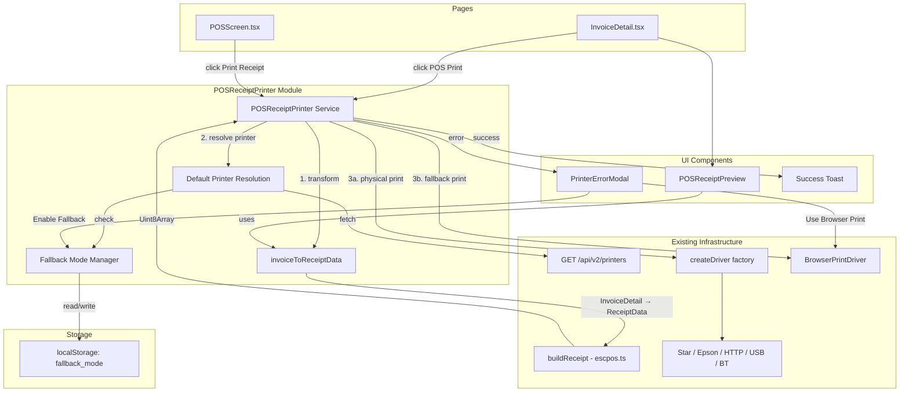

# Design Document — POS Invoice Receipt Printing

## Overview

This feature adds POS receipt printing capability to the invoice detail page and POS screen, bridging the gap between invoice data and the existing ESC/POS printer infrastructure. The application already has a complete ESC/POS builder (`escpos.ts`), protocol-aware printer drivers (Star WebPRNT, Epson ePOS, Generic HTTP, Browser Print, USB, Bluetooth), and a printer settings page with default printer configuration — but no way to print an invoice as a thermal receipt.

The solution introduces:
1. An `invoiceToReceiptData()` mapping function that transforms `InvoiceDetail` objects into the `ReceiptData` structure consumed by the existing `buildReceipt()` function
2. A `POSReceiptPrinter` service module that orchestrates default printer resolution, ESC/POS data generation, driver dispatch, fallback mode, and error handling
3. A `POSReceiptPreview` component that renders a narrow monospace preview of the receipt
4. A `PrinterErrorModal` component with browser print fallback and persistent fallback mode
5. Integration points in `InvoiceDetail.tsx` (POS Print button) and `POSScreen.tsx` (Print Receipt after payment)

All print data flows browser → printer. The backend is only used to fetch the default printer configuration via the existing `/api/v2/printers` endpoint. No new backend endpoints are needed.

## Architecture



The flow is:
1. User clicks "POS Print" → `POSReceiptPrinter.print(invoice)` is called
2. The service checks localStorage for fallback mode. If active, skips to browser print.
3. Otherwise, fetches printers from `/api/v2/printers`, finds the default active printer.
4. Calls `invoiceToReceiptData(invoice)` to transform the invoice into `ReceiptData`.
5. Calls `buildReceipt(receiptData, paperWidth)` to produce ESC/POS bytes.
6. Calls `createDriver(type, address).send(bytes)` to print.
7. On success → shows toast. On error → shows `PrinterErrorModal`.

## Components and Interfaces

### invoiceToReceiptData() — Pure Mapping Function

```typescript
// frontend/src/utils/invoiceReceiptMapper.ts

import type { ReceiptData, ReceiptLineItem } from './escpos';

interface InvoiceForReceipt {
  org_name?: string;
  org_address?: string;
  org_phone?: string;
  org_gst_number?: string;
  invoice_number: string | null;
  issue_date: string | null;
  created_at: string;
  customer?: {
    display_name?: string;
    first_name: string;
    last_name: string;
  } | null;
  line_items: Array<{
    description: string;
    quantity: number;
    unit_price: number;
    line_total: number;
  }>;
  subtotal: number;
  gst_amount: number;
  discount_amount: number;
  total: number;
  amount_paid: number;
  balance_due: number;
  payments?: Array<{
    method: string;
    amount: number;
  }>;
  notes_customer: string | null;
}

export function invoiceToReceiptData(invoice: InvoiceForReceipt): ReceiptData {
  const items: ReceiptLineItem[] = (invoice.line_items ?? []).map((li) => ({
    name: li.description?.split('\n')[0] ?? '',
    quantity: li.quantity,
    unitPrice: li.unit_price,
    total: li.line_total,
  }));

  const customerName = invoice.customer
    ? (invoice.customer.display_name ||
       `${invoice.customer.first_name} ${invoice.customer.last_name}`.trim())
    : undefined;

  const dateStr = formatReceiptDate(invoice.issue_date ?? invoice.created_at);

  // Summarise payment methods
  const payments = invoice.payments ?? [];
  const paymentMethod = payments.length > 0
    ? payments.map((p) => p.method).join(', ')
    : 'unpaid';

  return {
    orgName: invoice.org_name ?? '',
    orgAddress: invoice.org_address,
    orgPhone: invoice.org_phone,
    receiptNumber: invoice.invoice_number ?? 'DRAFT',
    date: dateStr,
    customerName,
    gstNumber: invoice.org_gst_number,
    items,
    subtotal: invoice.subtotal,
    taxLabel: 'GST (15%)',
    taxAmount: invoice.gst_amount,
    discountAmount: invoice.discount_amount > 0 ? invoice.discount_amount : undefined,
    total: invoice.total,
    amountPaid: invoice.amount_paid,
    balanceDue: invoice.balance_due,
    paymentMethod,
    paymentBreakdown: payments.length > 0
      ? payments.map((p) => ({ method: p.method, amount: p.amount }))
      : undefined,
    footer: invoice.notes_customer || 'Thank you for your business!',
  };
}

function formatReceiptDate(dateStr: string): string {
  try {
    const d = new Date(dateStr);
    const day = String(d.getDate()).padStart(2, '0');
    const month = String(d.getMonth() + 1).padStart(2, '0');
    const year = d.getFullYear();
    return `${day}/${month}/${year}`;
  } catch {
    return dateStr;
  }
}
```

This requires extending the `ReceiptData` interface in `escpos.ts` with optional fields:

```typescript
// Added to ReceiptData interface in escpos.ts
export interface ReceiptData {
  // ... existing fields ...
  customerName?: string;
  gstNumber?: string;
  amountPaid?: number;
  balanceDue?: number;
  paymentBreakdown?: Array<{ method: string; amount: number }>;
}
```

And extending `buildReceipt()` to render these new fields (customer line, GST number, payment breakdown, balance due in bold).

### POSReceiptPrinter — Service Module

```typescript
// frontend/src/utils/posReceiptPrinter.ts

import apiClient from '@/api/client';
import { createDriver } from './printerConnection';
import { resolveConnectionType } from './printerDrivers';
import { BrowserPrintDriver } from './browserPrintDriver';
import { buildReceipt } from './escpos';
import { invoiceToReceiptData } from './invoiceReceiptMapper';
import type { ReceiptData } from './escpos';

const FALLBACK_MODE_KEY = 'pos_printer_fallback_mode';
const DEFAULT_PAPER_WIDTH = 80;

export interface PrintResult {
  success: boolean;
  method: 'printer' | 'browser';
  error?: string;
}

export interface PrinterInfo {
  id: string;
  connection_type: string;
  address: string | null;
  paper_width: number;
  name: string;
}

export function isFallbackModeActive(): boolean {
  try {
    return localStorage.getItem(FALLBACK_MODE_KEY) === 'true';
  } catch {
    return false;
  }
}

export function setFallbackMode(active: boolean): void {
  try {
    if (active) {
      localStorage.setItem(FALLBACK_MODE_KEY, 'true');
    } else {
      localStorage.removeItem(FALLBACK_MODE_KEY);
    }
  } catch {
    // localStorage unavailable — ignore
  }
}

export function clearFallbackMode(): void {
  setFallbackMode(false);
}

export async function resolveDefaultPrinter(): Promise<PrinterInfo | null> {
  const res = await apiClient.get('/api/v2/printers');
  const printers = res.data?.items ?? res.data ?? [];
  const defaultPrinter = printers.find(
    (p: any) => p.is_default && p.is_active
  );
  return defaultPrinter ?? null;
}

export async function printReceipt(
  receiptData: ReceiptData,
  paperWidth?: number,
): Promise<PrintResult> {
  const width = paperWidth ?? DEFAULT_PAPER_WIDTH;
  const bytes = buildReceipt(receiptData, width);

  // If fallback mode is active, go straight to browser print
  if (isFallbackModeActive()) {
    const driver = new BrowserPrintDriver();
    await driver.send(bytes, { paperWidthMm: width });
    return { success: true, method: 'browser' };
  }

  // Resolve default printer
  const printer = await resolveDefaultPrinter();
  if (!printer) {
    throw new NoPrinterError('No default printer configured');
  }

  // Print via physical driver
  const resolved = resolveConnectionType(printer.connection_type);
  const driver = createDriver(resolved, printer.address ?? undefined);
  await driver.send(bytes, { paperWidthMm: width });
  return { success: true, method: 'printer' };
}

export async function printInvoiceReceipt(invoice: any): Promise<PrintResult> {
  const receiptData = invoiceToReceiptData(invoice);

  // Determine paper width
  let paperWidth = DEFAULT_PAPER_WIDTH;
  if (!isFallbackModeActive()) {
    try {
      const printer = await resolveDefaultPrinter();
      if (printer) {
        paperWidth = printer.paper_width ?? DEFAULT_PAPER_WIDTH;
      }
    } catch {
      // Will be caught in the main print flow
    }
  }

  return printReceipt(receiptData, paperWidth);
}

export async function browserPrintReceipt(
  receiptData: ReceiptData,
  paperWidth?: number,
): Promise<void> {
  const width = paperWidth ?? DEFAULT_PAPER_WIDTH;
  const bytes = buildReceipt(receiptData, width);
  const driver = new BrowserPrintDriver();
  await driver.send(bytes, { paperWidthMm: width });
}

export class NoPrinterError extends Error {
  constructor(message: string) {
    super(message);
    this.name = 'NoPrinterError';
  }
}
```

### POSReceiptPreview — React Component

```typescript
// frontend/src/components/pos/POSReceiptPreview.tsx

interface POSReceiptPreviewProps {
  receiptData: ReceiptData;
  paperWidth: number; // 58 or 80
}
```

Renders a narrow column (`max-width` matching paper width) with monospace font, displaying:
- Organisation header (name, address, phone)
- GST number
- Invoice number and date
- Customer name
- Line items (description, qty × price, total)
- Separator
- Subtotal, discount, GST, total
- Payment breakdown
- Balance due (bold if non-zero)
- Footer message

The component uses a `div` with `style={{ maxWidth: paperWidth === 58 ? '48mm' : '72mm' }}` and `font-family: 'Courier New', monospace`. A subtle dashed border simulates the paper edge.

### PrinterErrorModal — React Component

```typescript
// frontend/src/components/pos/PrinterErrorModal.tsx

interface PrinterErrorModalProps {
  open: boolean;
  onClose: () => void;
  errorMessage: string;
  onBrowserPrint: (enableFallback: boolean) => void;
}
```

Displays:
- Error message from the driver
- "Use Browser Print" button → calls `onBrowserPrint(enableFallback)`
- "Enable Browser Print for Future Prints" checkbox
- "Go to Printer Settings" link → navigates to `/settings/printers`

### Integration: InvoiceDetail.tsx

Add to the action button row (hidden when `status === 'draft'`):
- "POS Print" button with loading spinner state
- Receipt preview toggle (switches between A4 view and `POSReceiptPreview`)
- Success toast (3-second auto-dismiss)
- `PrinterErrorModal` for error handling

### Integration: POSScreen.tsx

After `handlePaymentComplete` resets the order:
- Show a "Print Receipt" button in the payment success state
- Uses the same `printInvoiceReceipt()` flow with the transaction data mapped to `ReceiptData`
- Same `PrinterErrorModal` for errors

### Integration: PrinterSettings.tsx

After a successful test print, call `clearFallbackMode()` to reset the fallback flag:

```typescript
// In handleTestPrint success path:
import { clearFallbackMode } from '@/utils/posReceiptPrinter';
// ...
setTestResult({ type: 'success', message: 'Test print sent successfully' });
clearFallbackMode();
```

## Data Models

### Extended ReceiptData Interface

The existing `ReceiptData` in `escpos.ts` needs these additional optional fields:

```typescript
export interface ReceiptData {
  orgName: string;
  orgAddress?: string;
  orgPhone?: string;
  receiptNumber?: string;
  date: string;
  items: ReceiptLineItem[];
  subtotal: number;
  taxLabel?: string;
  taxAmount: number;
  discountAmount?: number;
  total: number;
  paymentMethod: string;
  cashTendered?: number;
  changeGiven?: number;
  footer?: string;
  // New fields for invoice receipts:
  customerName?: string;
  gstNumber?: string;
  amountPaid?: number;
  balanceDue?: number;
  paymentBreakdown?: Array<{ method: string; amount: number }>;
}
```

### Extended buildReceipt() Output

The `buildReceipt()` function in `escpos.ts` will be extended to render the new fields when present:
- After the date line: `Customer: {customerName}` (if present)
- After the org header: `GST: {gstNumber}` (if present)
- After the payment method: each payment breakdown entry as `{method}: {amount}`
- After payment section: `Amount Paid: {amountPaid}` and bold `BALANCE DUE: {balanceDue}` (if > 0)

### localStorage Schema

```typescript
// Key: 'pos_printer_fallback_mode'
// Value: 'true' | absent (removed when cleared)
//
// Set when: user checks "Enable Browser Print for Future Prints" in PrinterErrorModal
// Cleared when: user successfully completes a test print in PrinterSettings
// Read by: POSReceiptPrinter.isFallbackModeActive()
```

### InvoiceDetail Type (existing — no changes)

The `InvoiceDetail` interface in `InvoiceDetail.tsx` already contains all fields needed for the mapping:
- `org_name`, `org_address`, `org_phone`, `org_gst_number`
- `invoice_number`, `issue_date`, `created_at`
- `customer` with `display_name`, `first_name`, `last_name`
- `line_items` with `description`, `quantity`, `unit_price`, `line_total`
- `subtotal`, `gst_amount`, `discount_amount`, `total`, `amount_paid`, `balance_due`
- `payments` array with `method`, `amount`
- `notes_customer`

No backend changes are required. The existing `/api/v2/printers` endpoint returns the printer list with `is_default` and `is_active` fields.


## Correctness Properties

*A property is a characteristic or behavior that should hold true across all valid executions of a system — essentially, a formal statement about what the system should do. Properties serve as the bridge between human-readable specifications and machine-verifiable correctness guarantees.*

### Property 1: Invoice-to-receipt field mapping preservation

*For any* valid InvoiceDetail object with arbitrary `org_name`, `org_address`, `org_phone`, `org_gst_number`, `subtotal`, `gst_amount`, `discount_amount`, `total`, `amount_paid`, `balance_due`, and `notes_customer` values, `invoiceToReceiptData()` SHALL produce a `ReceiptData` where: `orgName` equals `org_name` (or empty string if undefined), `orgAddress` equals `org_address`, `orgPhone` equals `org_phone`, `subtotal`/`taxAmount`/`total`/`amountPaid`/`balanceDue` equal their invoice counterparts, `gstNumber` equals `org_gst_number` when present, and `footer` equals `notes_customer` when non-null or "Thank you for your business!" when null.

**Validates: Requirements 4.1, 4.2, 4.7, 4.10, 6.1, 6.2**

### Property 2: Invoice number maps to receipt number with DRAFT fallback

*For any* `invoice_number` that is either a non-empty string or null, `invoiceToReceiptData()` SHALL produce a `ReceiptData` where `receiptNumber` equals the `invoice_number` string when non-null, or "DRAFT" when null.

**Validates: Requirements 4.3**

### Property 3: Date formatting with issue_date fallback

*For any* valid ISO date string as `issue_date` or `created_at`, `invoiceToReceiptData()` SHALL produce a `ReceiptData` where `date` is formatted as DD/MM/YYYY using `issue_date` when non-null, or `created_at` when `issue_date` is null.

**Validates: Requirements 4.4**

### Property 4: Customer name resolution

*For any* customer object with arbitrary `display_name`, `first_name`, and `last_name` strings, `invoiceToReceiptData()` SHALL produce a `ReceiptData` where `customerName` equals `display_name` when it is a non-empty string, or `first_name + " " + last_name` (trimmed) otherwise. When the customer is null, `customerName` SHALL be undefined.

**Validates: Requirements 4.5**

### Property 5: Line items and payments array mapping

*For any* array of line items and any array of payments, `invoiceToReceiptData()` SHALL produce a `ReceiptData` where: the `items` array has the same length as the input `line_items` and each item preserves `quantity`, `unitPrice` (from `unit_price`), and `total` (from `line_total`); and the `paymentBreakdown` array (when payments are non-empty) has the same length as the input `payments` and each entry preserves `method` and `amount`.

**Validates: Requirements 4.6, 4.8**

### Property 6: Invoice-to-receipt-to-ESC/POS round-trip integrity

*For any* valid InvoiceDetail object with at least one line item, converting via `invoiceToReceiptData()` and then `buildReceipt()` SHALL produce a non-empty `Uint8Array` (length > 0).

**Validates: Requirements 4.11**

### Property 7: Balance due bold rendering in ESC/POS output

*For any* `ReceiptData` with `balanceDue` greater than zero, `buildReceipt()` SHALL produce ESC/POS bytes that contain the bold-on command sequence (`0x1B 0x45 0x01`) followed by text containing "BALANCE DUE".

**Validates: Requirements 4.9**

### Property 8: Default printer resolution from printer list

*For any* array of printer configuration objects with varying `is_default` and `is_active` boolean flags, the default printer resolution logic SHALL return the first printer where both `is_default` and `is_active` are true, or null when no such printer exists.

**Validates: Requirements 2.1**

### Property 9: Fallback mode bypasses physical printer

*For any* valid `ReceiptData` and paper width, when fallback mode is active in localStorage, `printReceipt()` SHALL return a result with `method: 'browser'` without attempting to resolve or contact a physical printer.

**Validates: Requirements 3.4**

### Property 10: Fallback mode localStorage round-trip

*For any* boolean value, calling `setFallbackMode(value)` and then `isFallbackModeActive()` SHALL return that boolean value. Additionally, `clearFallbackMode()` followed by `isFallbackModeActive()` SHALL always return false.

**Validates: Requirements 3.5**

## Error Handling

| Scenario | Handling |
|---|---|
| No default printer configured, fallback mode off | `NoPrinterError` thrown → `PrinterErrorModal` opens with "No default printer configured" message and link to Printer Settings |
| No default printer configured, fallback mode on | Silently uses `BrowserPrintDriver` → neutral toast message |
| Printer driver connection refused / timeout | Driver throws `Error` → `PrinterErrorModal` opens with driver error message |
| Printer driver protocol error (Star/Epson/HTTP) | Driver throws with protocol-specific error → `PrinterErrorModal` displays it |
| Browser print fallback fails (iframe error) | `BrowserPrintDriver` finally block removes iframe; error propagates to UI |
| `/api/v2/printers` API call fails | Network error caught → `PrinterErrorModal` with "Failed to fetch printer configuration" |
| Invoice has no line items | `invoiceToReceiptData()` produces empty items array → `buildReceipt()` still produces valid ESC/POS (header + totals + footer) |
| Invoice has null customer | `customerName` is undefined → receipt omits customer line |
| localStorage unavailable (private browsing) | `isFallbackModeActive()` returns false (try/catch); `setFallbackMode()` silently fails |
| User clicks "Use Browser Print" in error modal | `browserPrintReceipt()` called with current receipt data; if checkbox checked, `setFallbackMode(true)` |

## Testing Strategy

### Property-Based Tests (fast-check)

Library: [fast-check](https://github.com/dubzzz/fast-check) — already used in the pos-printer-integration spec, pairs with Vitest.

Each property test runs a minimum of 100 iterations and is tagged with its design property reference.

| Property | Tag | Generator Strategy |
|---|---|---|
| P1: Field mapping preservation | `Feature: pos-invoice-receipt-print, Property 1` | Generate random InvoiceDetail objects with arbitrary strings for org fields, random numbers for totals, optional gstNumber and notes_customer |
| P2: Invoice number DRAFT fallback | `Feature: pos-invoice-receipt-print, Property 2` | `fc.option(fc.string({minLength: 1}))` for invoice_number (null or string) |
| P3: Date formatting | `Feature: pos-invoice-receipt-print, Property 3` | `fc.date({min: new Date(2000,0,1), max: new Date(2030,0,1)})` for issue_date and created_at, with issue_date optionally null |
| P4: Customer name resolution | `Feature: pos-invoice-receipt-print, Property 4` | `fc.option(fc.record({display_name: fc.option(fc.string()), first_name: fc.string(), last_name: fc.string()}))` |
| P5: Array mapping | `Feature: pos-invoice-receipt-print, Property 5` | `fc.array(fc.record({description: fc.string(), quantity: fc.nat(), unit_price: fc.float(), line_total: fc.float()}))` for items; `fc.array(fc.record({method: fc.string(), amount: fc.float()}))` for payments |
| P6: Round-trip integrity | `Feature: pos-invoice-receipt-print, Property 6` | Full random InvoiceDetail with at least 1 line item, pipe through invoiceToReceiptData → buildReceipt, assert length > 0 |
| P7: Balance due bold | `Feature: pos-invoice-receipt-print, Property 7` | Generate ReceiptData with `balanceDue > 0`, build receipt, scan bytes for bold command + "BALANCE DUE" |
| P8: Default printer resolution | `Feature: pos-invoice-receipt-print, Property 8` | `fc.array(fc.record({id: fc.uuid(), is_default: fc.boolean(), is_active: fc.boolean(), connection_type: fc.constantFrom(...), ...}))` |
| P9: Fallback mode bypass | `Feature: pos-invoice-receipt-print, Property 9` | Generate random ReceiptData, set localStorage fallback, verify method is 'browser' |
| P10: Fallback mode round-trip | `Feature: pos-invoice-receipt-print, Property 10` | `fc.boolean()` — set then read, verify equality |

### Unit Tests (Example-Based)

- InvoiceDetail "POS Print" button visibility (present for non-draft, hidden for draft)
- InvoiceDetail "POS Print" button disabled state during printing
- Success toast appears and auto-dismisses after 3 seconds
- PrinterErrorModal renders error message, "Use Browser Print" button, checkbox, and settings link
- PrinterErrorModal checkbox + browser print activates fallback mode
- POSReceiptPreview renders with correct narrow width and monospace font
- POSReceiptPreview displays all receipt sections (header, items, totals, footer)
- POSScreen "Print Receipt" button appears after payment completion
- PrinterSettings test print success clears fallback mode
- NoPrinterError thrown when no default printer and fallback off

### Integration Tests

- End-to-end: click POS Print → API fetch → driver send → success toast (mocked driver)
- End-to-end: click POS Print → API fetch → driver error → error modal → browser print fallback
- POSScreen payment → Print Receipt → same print flow as InvoiceDetail
