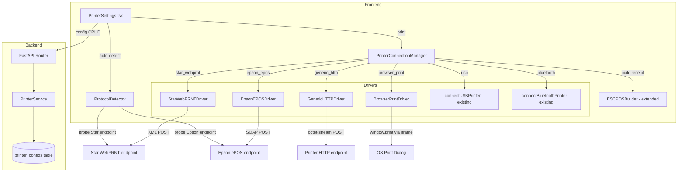

# Design Document — POS Printer Integration

## Overview

This feature replaces the broken network printer implementation in OraInvoice's POS module with protocol-aware printer drivers. The current `printerConnection.ts` sends raw ESC/POS bytes via `fetch()` POST to the printer's IP, which fails because LAN receipt printers (Star TSP100III, Epson TM series) expose vendor-specific web servers, not raw byte endpoints.

The solution introduces:
1. Three protocol-specific network drivers: Star WebPRNT (XML), Epson ePOS (SOAP/XML), Generic HTTP (raw bytes)
2. A browser print fallback using `window.print()` via hidden iframe for printers without web servers
3. A protocol auto-detector that probes printer endpoints to determine the correct driver
4. Paper width configuration with custom width support (30–120mm)
5. Expanded connection type enum and backward compatibility for the legacy `network` type

All print data flows browser → printer. The backend stores configuration only.

## Architecture



The architecture follows a driver pattern. `PrinterConnectionManager` is the factory/dispatcher that selects the correct driver based on `connection_type`. Each driver implements a common `PrinterDriver` interface. The existing USB and Bluetooth connections are preserved as-is.

## Components and Interfaces

### PrinterDriver Interface (new)

```typescript
// frontend/src/utils/printerDrivers.ts

export type ConnectionType = 
  | 'usb' | 'bluetooth' 
  | 'star_webprnt' | 'epson_epos' | 'generic_http' | 'browser_print';

export interface PrinterDriver {
  readonly type: ConnectionType;
  send(data: Uint8Array, options?: PrintOptions): Promise<void>;
}

export interface PrintOptions {
  paperWidthMm?: number;
}
```

### StarWebPRNTDriver

Sends ESC/POS data as Base64 within `<StarWebPrint>` XML to `http://<address>/StarWebPRNT/SendMessage`.

```typescript
class StarWebPRNTDriver implements PrinterDriver {
  readonly type = 'star_webprnt';
  constructor(private address: string) {}
  
  async send(data: Uint8Array): Promise<void> {
    const base64 = uint8ArrayToBase64(data);
    const xml = buildStarWebPRNTXml(base64);
    const url = `http://${this.address}/StarWebPRNT/SendMessage`;
    const controller = new AbortController();
    const timeoutId = setTimeout(() => controller.abort(), 10_000);
    try {
      const res = await fetch(url, {
        method: 'POST',
        headers: { 'Content-Type': 'text/xml; charset=utf-8' },
        body: xml,
        signal: controller.signal,
      });
      if (!res.ok) throw new Error(`Star WebPRNT error: ${res.status} ${await res.text()}`);
    } finally {
      clearTimeout(timeoutId);
    }
  }
}
```

### EpsonEPOSDriver

Sends ESC/POS data as Base64 within a SOAP envelope to `http://<address>/cgi-bin/epos/service.cgi`.

```typescript
class EpsonEPOSDriver implements PrinterDriver {
  readonly type = 'epson_epos';
  constructor(private address: string) {}
  
  async send(data: Uint8Array): Promise<void> {
    const base64 = uint8ArrayToBase64(data);
    const soap = buildEpsonSoapEnvelope(base64);
    const url = `http://${this.address}/cgi-bin/epos/service.cgi`;
    const controller = new AbortController();
    const timeoutId = setTimeout(() => controller.abort(), 10_000);
    try {
      const res = await fetch(url, {
        method: 'POST',
        headers: { 'Content-Type': 'text/xml; charset=utf-8' },
        body: soap,
        signal: controller.signal,
      });
      if (!res.ok) throw new Error(`Epson ePOS HTTP error: ${res.status}`);
      const text = await res.text();
      if (!text.includes('success="true"')) {
        const fault = extractSoapFault(text);
        throw new Error(`Epson ePOS error: ${fault}`);
      }
    } finally {
      clearTimeout(timeoutId);
    }
  }
}
```

### GenericHTTPDriver

Sends raw ESC/POS bytes as `application/octet-stream` POST.

```typescript
class GenericHTTPDriver implements PrinterDriver {
  readonly type = 'generic_http';
  constructor(private address: string) {}
  
  async send(data: Uint8Array): Promise<void> {
    const url = this.address.startsWith('http') ? this.address : `http://${this.address}`;
    const controller = new AbortController();
    const timeoutId = setTimeout(() => controller.abort(), 10_000);
    try {
      const res = await fetch(url, {
        method: 'POST',
        headers: { 'Content-Type': 'application/octet-stream' },
        body: data,
        signal: controller.signal,
      });
      if (!res.ok) throw new Error(`Printer error: ${res.status} ${res.statusText}`);
    } finally {
      clearTimeout(timeoutId);
    }
  }
}
```

### BrowserPrintDriver

Renders receipt HTML in a hidden iframe and calls `window.print()`.

```typescript
class BrowserPrintDriver implements PrinterDriver {
  readonly type = 'browser_print';
  
  async send(data: Uint8Array, options?: PrintOptions): Promise<void> {
    const html = buildReceiptHtml(data, options?.paperWidthMm ?? 80);
    const iframe = document.createElement('iframe');
    iframe.style.cssText = 'position:fixed;left:-9999px;top:-9999px;width:0;height:0;';
    document.body.appendChild(iframe);
    try {
      const doc = iframe.contentDocument!;
      doc.open();
      doc.write(html);
      doc.close();
      await new Promise(resolve => setTimeout(resolve, 100)); // let styles apply
      iframe.contentWindow!.print();
    } finally {
      document.body.removeChild(iframe);
    }
  }
}
```

### ProtocolDetector

Probes Star and Epson endpoints with a 5-second total timeout.

```typescript
// frontend/src/utils/protocolDetector.ts

export type DetectedProtocol = 'star_webprnt' | 'epson_epos' | 'generic_http';

export async function detectProtocol(address: string): Promise<DetectedProtocol> {
  const controller = new AbortController();
  const timeoutId = setTimeout(() => controller.abort(), 5_000);
  
  try {
    const [starOk, epsonOk] = await Promise.allSettled([
      probeEndpoint(`http://${address}/StarWebPRNT/SendMessage`, controller.signal),
      probeEndpoint(`http://${address}/cgi-bin/epos/service.cgi`, controller.signal),
    ]);
    
    if (starOk.status === 'fulfilled' && starOk.value) return 'star_webprnt';
    if (epsonOk.status === 'fulfilled' && epsonOk.value) return 'epson_epos';
    return 'generic_http';
  } finally {
    clearTimeout(timeoutId);
  }
}

async function probeEndpoint(url: string, signal: AbortSignal): Promise<boolean> {
  try {
    const res = await fetch(url, { method: 'GET', signal });
    return res.status >= 200 && res.status < 500; // 2xx or 405 both indicate the endpoint exists
  } catch {
    return false;
  }
}
```

### PrinterConnectionManager (refactored)

The existing `connectPrinter` factory in `printerConnection.ts` is refactored to support the new connection types and return `PrinterDriver` instances.

```typescript
export function createDriver(type: ConnectionType, address?: string): PrinterDriver {
  switch (type) {
    case 'star_webprnt':
      if (!address) throw new Error('Star WebPRNT requires an address');
      return new StarWebPRNTDriver(address);
    case 'epson_epos':
      if (!address) throw new Error('Epson ePOS requires an address');
      return new EpsonEPOSDriver(address);
    case 'generic_http':
      if (!address) throw new Error('Generic HTTP requires an address');
      return new GenericHTTPDriver(address);
    case 'browser_print':
      return new BrowserPrintDriver();
    case 'usb':
    case 'bluetooth':
      // Delegate to existing WebUSB/Web Bluetooth connection functions
      // wrapped in a PrinterDriver adapter
      return new LegacyConnectionAdapter(type, address);
    default:
      throw new Error(`Unsupported connection type: ${type}`);
  }
}

// Backward compat: treat legacy 'network' as 'generic_http'
export function resolveConnectionType(type: string): ConnectionType {
  if (type === 'network') return 'generic_http';
  return type as ConnectionType;
}
```

### ESCPOSBuilder Extension

The existing `ESCPOSBuilder` is extended to support custom paper widths beyond 58/80mm.

```typescript
// Change PaperWidth from a union to accept any integer
export type PaperWidth = number;

// Calculate chars per line for any width
function charsPerLine(widthMm: number): number {
  if (widthMm === 58) return 32;
  if (widthMm === 80) return 48;
  return Math.floor(widthMm / 1.667);
}
```


## Data Models

### Backend Schema Changes

The `connection_type` field in `printer_configs` is a `String(20)` — no enum constraint in the DB. The validation happens in Pydantic schemas. Changes needed:

**PrinterConfigCreate schema** — expand `connection_type` pattern:
```python
connection_type: str = Field(pattern="^(usb|bluetooth|star_webprnt|epson_epos|generic_http|browser_print)$")
paper_width: int = Field(default=80, ge=30, le=120)  # expanded range for custom widths
```

**PrinterConfigUpdate schema** — same pattern expansion:
```python
connection_type: str | None = Field(default=None, pattern="^(usb|bluetooth|star_webprnt|epson_epos|generic_http|browser_print)$")
paper_width: int | None = Field(default=None, ge=30, le=120)
```

**Backend model constant**:
```python
CONNECTION_TYPES = ("usb", "bluetooth", "star_webprnt", "epson_epos", "generic_http", "browser_print")
```

No database migration is needed — the `connection_type` column is `String(20)`, not a DB-level enum. Existing rows with `network` remain valid; the frontend's `resolveConnectionType()` maps `network` → `generic_http` at read time.

### Frontend Types

```typescript
// Updated ConnectionType union
export type ConnectionType = 
  | 'usb' | 'bluetooth' 
  | 'star_webprnt' | 'epson_epos' | 'generic_http' | 'browser_print';

// Paper width selector model
export interface PaperWidthOption {
  label: string;
  value: number | 'custom';
}

export const PAPER_WIDTH_OPTIONS: PaperWidthOption[] = [
  { label: '80mm', value: 80 },
  { label: '58mm', value: 58 },
  { label: 'Custom', value: 'custom' },
];
```

### Star WebPRNT XML Format

```xml
<StarWebPrint xmlns="http://www.star-m.jp/2011/StarWebPrint">
  <Request>
    <SetRequest>
      <Data Type="raw" Value="[base64-encoded ESC/POS data]"/>
    </SetRequest>
  </Request>
</StarWebPrint>
```

### Epson ePOS SOAP Envelope

```xml
<?xml version="1.0" encoding="utf-8"?>
<soap:Envelope xmlns:soap="http://schemas.xmlsoap.org/soap/envelope/">
  <soap:Body>
    <epos-print xmlns="http://www.epson-biz.com/pos/epos/service.cgi">
      <command>[base64-encoded ESC/POS data]</command>
    </epos-print>
  </soap:Body>
</soap:Envelope>
```


## Correctness Properties

*A property is a characteristic or behavior that should hold true across all valid executions of a system — essentially, a formal statement about what the system should do. Properties serve as the bridge between human-readable specifications and machine-verifiable correctness guarantees.*

### Property 1: Star WebPRNT XML Base64 round-trip

*For any* valid ESC/POS byte array, encoding it to Base64 and embedding it in the Star WebPRNT XML payload, then extracting the Base64 value from the XML and decoding it, SHALL produce a byte array identical to the original.

**Validates: Requirements 1.1**

### Property 2: Star WebPRNT error contains HTTP status and response body

*For any* HTTP error status code (4xx or 5xx) and any response body string, when the Star WebPRNT driver receives such a response, the thrown error message SHALL contain both the numeric status code and the response body text.

**Validates: Requirements 1.3**

### Property 3: Epson ePOS SOAP Base64 round-trip

*For any* valid ESC/POS byte array, encoding it to Base64 and embedding it in the Epson ePOS SOAP envelope, then extracting the Base64 value from the SOAP XML and decoding it, SHALL produce a byte array identical to the original.

**Validates: Requirements 2.1**

### Property 4: Epson ePOS SOAP fault extraction

*For any* SOAP fault code string and fault string, when the Epson ePOS driver parses a SOAP fault response containing those values, the thrown error message SHALL contain both the fault code and the fault string.

**Validates: Requirements 2.3**

### Property 5: Generic HTTP error contains status code and status text

*For any* non-2xx HTTP status code and any status text string, when the Generic HTTP driver receives such a response, the thrown error message SHALL contain both the numeric status code and the status text.

**Validates: Requirements 3.3**

### Property 6: Browser print receipt HTML contains correct paper width

*For any* paper width between 30mm and 120mm, the generated receipt HTML SHALL contain CSS `@media print` rules that set the page width to that exact millimeter value, and the HTML SHALL use a monospace font-family.

**Validates: Requirements 4.1, 4.3, 4.5**

### Property 7: ESCPOSBuilder characters-per-line calculation

*For any* integer paper width between 30 and 120, the ESCPOSBuilder SHALL calculate characters-per-line as 32 when width is 58, 48 when width is 80, and `floor(width / 1.667)` for all other widths.

**Validates: Requirements 5.5**

### Property 8: Protocol probe endpoint classification

*For any* HTTP status code, the protocol probe function SHALL classify the endpoint as detected (returns true) when the status is 2xx or 405, and as not detected (returns false) for all other status codes or network errors.

**Validates: Requirements 6.2, 6.3**

### Property 9: Driver factory returns correct driver for connection type

*For any* valid connection type string (including the legacy value `network`), the `createDriver` factory SHALL return a driver whose `type` property matches the expected resolved connection type — where `network` resolves to `generic_http` and all other types resolve to themselves.

**Validates: Requirements 8.1, 10.1**

### Property 10: Test receipt contains all required fields

*For any* printer name string and any date/time value, the generated test receipt data SHALL contain the printer name, the text "TEST PRINT", the text "Printer is working!", and a formatted representation of the date/time.

**Validates: Requirements 8.2**

## Error Handling

| Scenario | Handling |
|---|---|
| Star/Epson/Generic HTTP request timeout (10s) | AbortController aborts fetch; driver throws `Error` with timeout message |
| Star WebPRNT non-OK response | Driver throws with HTTP status + response body text |
| Epson ePOS SOAP fault | Driver throws with fault code + fault string extracted from XML |
| Generic HTTP non-2xx | Driver throws with status code + status text |
| Protocol detection timeout (5s) | AbortController aborts all pending probes; defaults to `generic_http` |
| Protocol detection network error | Individual probe returns false; if all fail, defaults to `generic_http` |
| Browser print iframe error | Finally block ensures iframe is removed from DOM |
| Invalid paper width (< 30 or > 120) | Backend Pydantic validation rejects with 422; frontend form enforces min/max |
| Legacy `network` connection type | `resolveConnectionType()` maps to `generic_http` transparently |
| USB/Bluetooth not supported in browser | Existing error handling preserved — throws descriptive error |
| Custom paper width non-integer | Frontend input `type="number"` with `step="1"` enforces integer; backend `int` field rejects non-integer |

## Testing Strategy

### Unit Tests (Example-Based)

- Each driver's happy path (mock fetch → 200 → resolves)
- Each driver's Content-Type header verification
- Each driver's 10-second AbortController timeout
- Epson SOAP success="true" parsing
- Browser print iframe lifecycle (create → write → print → remove)
- Paper width selector UI states (58mm, 80mm, Custom with numeric input)
- Connection type dropdown conditional field visibility
- Test print button disabled state during print
- Protocol detection fallback to generic_http
- Backward compatibility: USB and Bluetooth driver selection unchanged

### Property-Based Tests (fast-check)

Library: [fast-check](https://github.com/dubzzz/fast-check) (already available in JS/TS ecosystem, pairs with Vitest)

Each property test runs a minimum of 100 iterations and is tagged with its design property reference.

| Property | Tag | Generator Strategy |
|---|---|---|
| P1: Star XML Base64 round-trip | `Feature: pos-printer-integration, Property 1` | `fc.uint8Array({minLength: 0, maxLength: 4096})` |
| P2: Star error status + body | `Feature: pos-printer-integration, Property 2` | `fc.integer({min: 400, max: 599})` × `fc.string()` |
| P3: Epson SOAP Base64 round-trip | `Feature: pos-printer-integration, Property 3` | `fc.uint8Array({minLength: 0, maxLength: 4096})` |
| P4: Epson fault extraction | `Feature: pos-printer-integration, Property 4` | `fc.string()` × `fc.string()` for fault code/string |
| P5: Generic HTTP error status + text | `Feature: pos-printer-integration, Property 5` | `fc.integer({min: 100, max: 599}).filter(s => s < 200 || s >= 300)` × `fc.string()` |
| P6: Receipt HTML paper width | `Feature: pos-printer-integration, Property 6` | `fc.integer({min: 30, max: 120})` |
| P7: Chars-per-line calculation | `Feature: pos-printer-integration, Property 7` | `fc.integer({min: 30, max: 120})` |
| P8: Probe endpoint classification | `Feature: pos-printer-integration, Property 8` | `fc.integer({min: 100, max: 599})` |
| P9: Driver factory dispatch | `Feature: pos-printer-integration, Property 9` | `fc.constantFrom('usb','bluetooth','star_webprnt','epson_epos','generic_http','browser_print','network')` |
| P10: Test receipt fields | `Feature: pos-printer-integration, Property 10` | `fc.string({minLength: 1, maxLength: 100})` × `fc.date()` |

### Integration Tests

- End-to-end printer config CRUD via API (create, read, update, delete)
- Backend schema validation rejects invalid connection types
- Backend accepts all 6 valid connection types + legacy `network`
- Paper width validation (30–120 range enforced)
