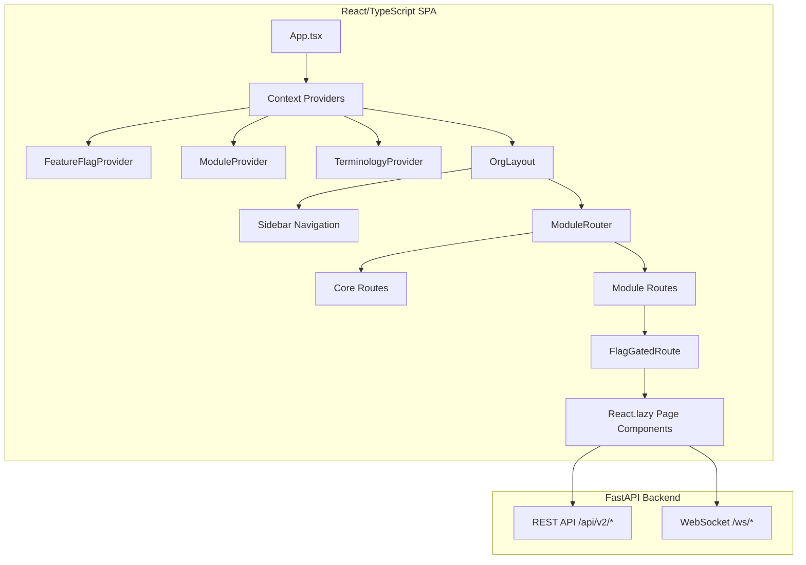
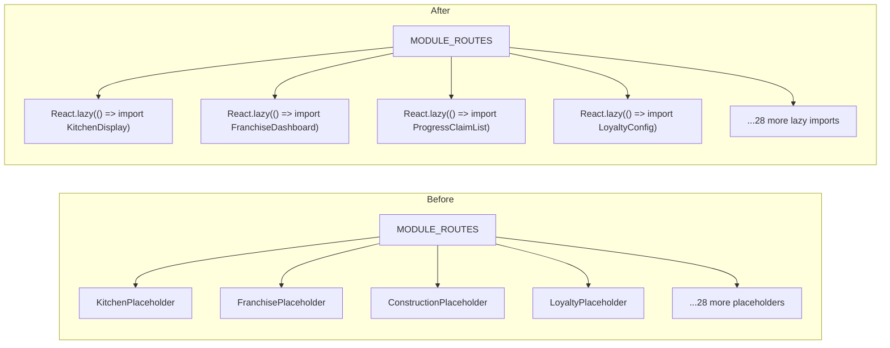
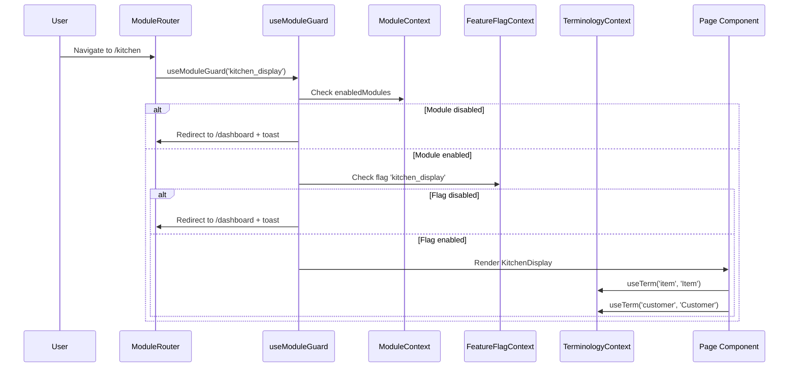

# Design Document: Production Readiness Gaps

## Overview

This design addresses the frontend implementation gap in the OraInvoice Universal Platform. The backend is 95% complete with 56+ API modules and 500+ endpoints, but the frontend has ~30 placeholder components in `ModuleRouter.tsx` that render non-functional `<div>` elements. Users cannot access the majority of backend functionality.

The work is primarily frontend: replacing every placeholder with a real React/TypeScript page component that consumes the corresponding backend API, integrating the three existing context providers (`FeatureFlagContext`, `ModuleContext`, `TerminologyContext`) into all components, adding integration tests, and ensuring mobile/tablet responsiveness.

### Key Design Decisions

1. **Lazy loading everywhere**: All module page components use `React.lazy()` + `Suspense` for code splitting. No module code is loaded until the user navigates to it.
2. **Context-first rendering**: Every page component calls `useModuleGuard()` before rendering. Feature flags gate sub-features via `<FeatureGate>`. Terminology substitution uses `useTerm()`.
3. **Existing patterns preserved**: The codebase already has well-established patterns (e.g., `KitchenDisplay.tsx`, `FranchiseDashboard.tsx`, `ProgressClaimList.tsx`). New and enhanced components follow these same patterns — `apiClient` for REST, WebSocket for real-time, `data-testid` attributes for testing.
4. **Backend APIs are stable**: No backend changes are needed. All endpoints referenced in requirements already exist and are tested.
5. **Single codebase for all viewports**: Responsive design via CSS media queries and flexbox/grid — no separate mobile components.

## Architecture

The architecture is a standard React SPA consuming a FastAPI backend:



### Module Router Transformation

The `ModuleRouter.tsx` currently maps module slugs to placeholder components. The transformation replaces each placeholder with a lazy-loaded import:



### Context Provider Flow




## Components and Interfaces

### 1. Shared Infrastructure Components

#### `useModuleGuard(moduleSlug: string)` Hook
A custom React hook that verifies module enablement and redirects to dashboard if disabled. Reduces boilerplate across all page components.

```typescript
function useModuleGuard(moduleSlug: string): { isAllowed: boolean; isLoading: boolean }
```

- Checks `ModuleContext.enabledModules` for the slug
- If not enabled, navigates to `/dashboard` with a toast "Module not available"
- Returns loading state while contexts initialise

#### `ModulePageWrapper` Component
A wrapper that combines module guard, feature flag gate, error boundary, and Suspense:

```typescript
interface ModulePageWrapperProps {
  moduleSlug: string
  flagKey?: string
  children: ReactNode
}
```

#### `ErrorBoundaryWithRetry` Component
An error boundary that catches chunk load failures and renders a retry button instead of a blank screen.

#### Responsive Layout Utilities
CSS utility classes and media query breakpoints:
- `@media (max-width: 767px)` — phone layout (single column, stacked)
- `@media (min-width: 768px) and (max-width: 1024px)` — tablet layout (2 columns)
- `@media (min-width: 1025px)` — desktop layout (3-4 columns)
- Minimum touch target: 44×44 CSS pixels on all interactive elements

### 2. Critical Priority Components (Requirements 1-6)

#### Kitchen Display Frontend (Req 1)
Enhances existing `KitchenDisplay.tsx`:
- Add exponential backoff WebSocket reconnection (1s, 2s, 4s, 8s, max 30s) with "Connection Lost" banner
- Add full-screen mode toggle with minimum 18px body / 24px heading text
- Add "Ready" column for prepared items (currently items are just removed)
- Integrate `TerminologyContext` and `FeatureFlagContext`
- Optimise for landscape tablet with large touch targets

API endpoints consumed:
- `GET /api/v2/kitchen/orders` — list pending orders
- `GET /api/v2/kitchen/stations/{station}/orders` — filtered by station
- `PUT /api/v2/kitchen/orders/{id}/prepared` — mark item prepared
- `WebSocket /ws/kitchen/{org_id}/{station}` — real-time updates

#### Franchise Management Frontend (Req 2)
Enhances existing `FranchiseDashboard.tsx`, `LocationList.tsx`, `StockTransfers.tsx`:
- Add location CRUD (add, edit, deactivate) to LocationList
- Add per-location performance comparison charts to FranchiseDashboard
- Add stock transfer creation form and history list to StockTransfers
- Add RBAC-scoped data filtering for Location_Manager role
- Integrate all three context providers

API endpoints consumed:
- `GET /api/v2/locations` — list locations
- `POST /api/v2/locations` — create location
- `GET /api/v2/franchise/dashboard` — aggregate metrics
- `GET /api/v2/franchise/head-office` — head office view
- `POST /api/v2/stock-transfers` — create transfer
- `GET /api/v2/stock-transfers` — transfer history

#### Construction Frontend — Progress Claims (Req 3)
Enhances existing `ProgressClaimList.tsx`:
- Add Progress Claim Form page with auto-calculated fields
- Add real-time validation (cumulative cannot exceed revised contract value)
- Add PDF generation button
- Add status change without full page reload
- Integrate `TerminologyContext` for construction labels

API endpoints consumed:
- `GET /api/v2/progress-claims` — list claims
- `POST /api/v2/progress-claims` — create claim
- `GET /api/v2/progress-claims/{id}/pdf` — generate PDF

#### Construction Frontend — Variations (Req 4)
Enhances existing `VariationList.tsx`, `VariationForm.tsx`:
- Add variation register per project with cumulative impact display
- Add PDF generation for variation orders
- Prevent editing/deletion of approved variations with user guidance
- Display updated revised contract value after approval

API endpoints consumed:
- `GET /api/v2/variations` — list variations
- `POST /api/v2/variations` — create variation
- `PUT /api/v2/variations/{id}/approve` — approve variation
- `GET /api/v2/variations/{id}/pdf` — generate PDF

#### Construction Frontend — Retentions (Req 5)
Enhances existing `RetentionSummary.tsx`:
- Add per-project retention data display
- Add retention release workflow (partial/full release)
- Add validation (release cannot exceed outstanding balance)
- Display retention alongside progress claim info on project dashboard

API endpoints consumed:
- `GET /api/v2/retentions` — retention summary
- `POST /api/v2/retentions/{id}/release` — release retention

#### Webhook Management Frontend (Req 6)
Enhances existing `WebhookManagement.tsx`:
- Add webhook creation/editing form with HTTPS validation
- Add "Test Webhook" button with response display modal
- Add delivery log view per webhook
- Add visual status indicators (green/amber/red)
- Add auto-disable warning with re-enable button

API endpoints consumed:
- `GET /api/v2/outbound-webhooks` — list webhooks
- `POST /api/v2/outbound-webhooks` — create webhook
- `PUT /api/v2/outbound-webhooks/{id}` — update webhook
- `POST /api/v2/outbound-webhooks/{id}/test` — test webhook
- `GET /api/v2/outbound-webhooks/{id}/deliveries` — delivery log

### 3. High Priority Components (Requirements 7-10)

#### Time Tracking V2 Frontend (Req 7)
Enhances existing `TimeSheet.tsx` and `HeaderTimer.tsx`:
- Add project/task selection before starting timer
- Add task switching without stopping timer
- Add project-based time reporting view
- Add weekly timesheet grid (project × day)
- Add "Convert to Invoice" action on billable entries
- Add overlap validation in real-time
- Add time entry panel on Job Detail page

#### Jobs V2 Frontend (Req 8)
Enhances existing `JobBoard.tsx`, `JobList.tsx`, `JobDetail.tsx`:
- Add project hierarchy view with expandable nodes
- Add drag-and-drop Kanban with status transition validation
- Add resource allocation timeline view
- Add job profitability panel on Job Detail
- Add "Convert to Invoice" button on completed jobs
- Add job template selection on creation

#### Enhanced Inventory Frontend (Req 9)
Enhances existing inventory pages:
- Add Pricing Rules management page
- Add pricing rule creation form with overlap validation
- Add advanced stock adjustment workflow with reasons
- Add low-stock dashboard with one-click PO creation
- Add supplier catalogue integration view
- Integrate barcode scanning via `barcodeScanner.ts`

#### Loyalty Program Frontend (Req 10)
Enhances existing `LoyaltyConfig.tsx`:
- Add points earning/redemption rate configuration
- Add membership tier management with ordering validation
- Add customer loyalty view on customer detail page
- Add Loyalty Analytics dashboard
- Add manual points adjustment interface

### 4. Medium Priority Components (Requirements 11-15)

#### Feature Flag Management Frontend (Req 11)
- Org-level feature flags page in settings
- Flags grouped by category with descriptions
- Display inheritance source (trade category, plan tier, rollout)
- Org-level toggle where permitted
- Global admin rollout monitoring view

#### Module Management Frontend (Req 12)
- Module configuration page with enable/disable toggles
- Dependency information display
- Cascade disable confirmation dialog
- Auto-enable dependencies notification
- Visual dependency graph
- Real-time ModuleContext update on toggle

#### Multi-Currency Frontend (Req 13)
- Currency settings page with base currency display
- Currency enablement from ISO 4217 list
- Exchange rate management with manual entry
- Historical rate charts
- Rate provider configuration
- Currency-specific formatting

#### Table Management Frontend (Req 14)
Enhances existing `FloorPlan.tsx`, `ReservationList.tsx`:
- Add drag-and-drop floor plan editor
- Add real-time table status colour coding
- Add POS integration on table tap
- Add reservation timeline view and creation form
- Add table merge/split functionality
- Add calendar view for reservations

#### Tipping Management Frontend (Req 15)
Enhances existing `TipPrompt.tsx`:
- Add tip distribution rules configuration
- Add staff tip allocation management
- Add tip analytics dashboard
- Display tip info on POS transaction summary

### 5. Cross-Cutting Components (Requirements 16-20)

#### Router Placeholder Replacement (Req 16)
- Replace all ~30 placeholder components with `React.lazy` imports
- Add `Suspense` with loading fallback on all lazy routes
- Add `ErrorBoundaryWithRetry` for chunk load failures
- Preserve existing `FlagGatedRoute` behaviour

#### Context Provider Integration (Req 17)
- Add `useModuleGuard()` hook to every page component
- Add `<FeatureGate>` wrappers on flag-gated sub-features
- Add `useTerm()` calls for trade-specific labels
- Ensure providers initialise before route rendering
- Fallback to default labels when no terminology override exists

#### Integration Tests (Req 18)
- Backend: POS flow, job-to-invoice flow, construction flow, multi-currency flow, onboarding flow, franchise flow
- Frontend: ModuleRouter rendering, context gating, terminology substitution
- Use existing test patterns (pytest + AsyncMock for backend, React Testing Library for frontend)

#### Mobile Optimisation (Req 19)
- Responsive layouts on all new/enhanced components
- 44×44px minimum touch targets
- Kitchen display optimised for landscape tablet
- POS optimised for tablet with large buttons
- Floor plan with touch gestures (pinch-to-zoom, tap, long-press)
- Appropriate mobile input types on all forms

#### Dead-Link Elimination (Req 20)
- Audit all sidebar/header navigation links
- Hide menu items for disabled modules via ModuleContext
- Hide menu items for disabled flags via FeatureFlagContext
- User-friendly "Feature not available" page for direct URL access
- Correct browser back-button behaviour after redirects
- Development-mode console logging for remaining placeholders


## Data Models

No new backend data models are required. All database models already exist. The frontend components consume existing API response shapes.

### Key Frontend TypeScript Interfaces

These interfaces mirror existing backend API response schemas:

```typescript
// Kitchen Display (existing in KitchenDisplay.tsx)
interface KitchenOrderItem {
  id: string; org_id: string; pos_transaction_id: string | null;
  table_id: string | null; item_name: string; quantity: number;
  modifications: string | null; station: string; status: string;
  created_at: string; prepared_at: string | null;
}

// Franchise / Locations
interface Location {
  id: string; org_id: string; name: string; address: string;
  staff_count: number; status: 'active' | 'inactive';
}

interface StockTransfer {
  id: string; source_location_id: string; destination_location_id: string;
  status: 'pending' | 'in_transit' | 'received' | 'cancelled';
  items: StockTransferItem[]; notes: string; created_at: string;
}

// Construction
interface ProgressClaim {
  id: string; claim_number: number; project_id: string; project_name: string;
  contract_value: string; revised_contract_value: string;
  cumulative_claimed: string; amount_due_this_claim: string;
  status: 'draft' | 'submitted' | 'approved' | 'paid' | 'disputed';
  submission_date: string;
}

interface VariationOrder {
  id: string; variation_number: number; project_id: string;
  description: string; cost_impact: string;
  status: 'draft' | 'submitted' | 'approved' | 'rejected';
  approved_at: string | null;
}

interface RetentionSummary {
  project_id: string; total_retained: string; total_released: string;
  outstanding: string; retention_percentage: string;
}

// Webhooks
interface OutboundWebhook {
  id: string; url: string; event_types: string[];
  is_active: boolean; secret: string;
  last_delivery_status: string | null; failure_count: number;
}

interface WebhookDelivery {
  id: string; webhook_id: string; event_type: string;
  delivered_at: string; status_code: number;
  response_time_ms: number; retry_count: number;
}

// Loyalty
interface LoyaltyConfig {
  points_per_dollar: number; redemption_rate: number;
  is_active: boolean; tiers: LoyaltyTier[];
}

interface LoyaltyTier {
  id: string; name: string; threshold: number;
  discount_percentage: number; benefits: string;
  sort_order: number;
}

// Module Management
interface ModuleDefinition {
  slug: string; name: string; description: string;
  category: string; is_enabled: boolean;
  dependencies: string[]; dependents: string[];
  status: 'available' | 'coming_soon';
}

// Feature Flags (org-level view)
interface OrgFeatureFlag {
  key: string; name: string; description: string;
  category: string; is_enabled: boolean;
  source: 'explicit' | 'trade_category' | 'plan_tier' | 'rollout';
  can_override: boolean;
}

// Multi-Currency
interface CurrencyConfig {
  code: string; name: string; symbol: string;
  decimal_places: number; exchange_rate: string;
  rate_source: 'manual' | 'automatic';
  last_updated: string;
}
```

### Context Provider Interfaces (Existing)

```typescript
// FeatureFlagContext — flags: Record<string, boolean>
// ModuleContext — enabledModules: string[]
// TerminologyContext — terms: Record<string, string>
```

These are already implemented and tested. No changes to their interfaces are needed.


## Correctness Properties

*A property is a characteristic or behavior that should hold true across all valid executions of a system — essentially, a formal statement about what the system should do. Properties serve as the bridge between human-readable specifications and machine-verifiable correctness guarantees.*

### Property 1: Kitchen order urgency level is deterministic

*For any* kitchen order with a `created_at` timestamp and a configurable threshold T (default 15 minutes), the urgency level should be: "normal" if elapsed < T, "warning" if T ≤ elapsed < 2T, and "critical" if elapsed ≥ 2T. This must hold for all valid timestamps.

**Validates: Requirements 1.4**

### Property 2: Station filtering returns only matching orders

*For any* set of kitchen orders across multiple stations and any selected station S, filtering by S should return exactly the orders where `order.station === S`. When S is "all", all orders should be returned.

**Validates: Requirements 1.6**

### Property 3: WebSocket reconnection follows exponential backoff

*For any* reconnection attempt number N (starting from 0), the delay before the next attempt should equal `min(2^N * 1000, 30000)` milliseconds. The sequence must be 1000, 2000, 4000, 8000, 16000, 30000, 30000, ...

**Validates: Requirements 1.7**

### Property 4: Location data is RBAC-scoped for Location_Manager

*For any* user with Location_Manager role assigned to locations L₁...Lₙ, and any API response containing location data, the displayed data should contain only items where `item.location_id ∈ {L₁...Lₙ}`. For Org_Admin users, all locations should be visible.

**Validates: Requirements 2.6, 2.7**

### Property 5: Progress claim calculations are correct

*For any* set of construction values (original_contract_value, approved_variations_total, work_completed_to_date, work_completed_previous, materials_on_site, retention_withheld), the auto-calculated fields must satisfy:
- `revised_contract_value = original_contract_value + approved_variations_total`
- `work_completed_this_period = work_completed_to_date - work_completed_previous`
- `amount_due = work_completed_this_period + materials_on_site - retention_withheld`
- `completion_percentage = (work_completed_to_date / revised_contract_value) * 100`

**Validates: Requirements 3.4**

### Property 6: Cumulative claimed cannot exceed revised contract value

*For any* progress claim where `cumulative_claimed + amount_this_claim > revised_contract_value`, the form submission should be blocked and a validation error displayed showing the maximum claimable amount.

**Validates: Requirements 3.5**

### Property 7: Approved variation updates revised contract value

*For any* project with original contract value C and a set of approved variations with cost impacts V₁...Vₙ (each positive or negative), the displayed revised contract value should equal `C + Σ(V₁...Vₙ)`.

**Validates: Requirements 4.4**

### Property 8: Approved variations are immutable

*For any* variation order with status "approved", the edit and delete actions should be disabled. Only creating an offsetting variation should be permitted.

**Validates: Requirements 4.6**

### Property 9: Retention release cannot exceed outstanding balance

*For any* project with total retention withheld W and total previously released R, a retention release of amount A should be rejected if `A > (W - R)`.

**Validates: Requirements 5.5**

### Property 10: Webhook URL must be HTTPS

*For any* URL string provided in the webhook creation/editing form, validation should pass if and only if the URL starts with `https://`. All other schemes (http://, ftp://, etc.) and malformed URLs should be rejected.

**Validates: Requirements 6.3**

### Property 11: Webhook health status indicator is deterministic

*For any* webhook with a given `last_delivery_status` and `failure_count`, the status indicator should be: green if last delivery succeeded and failure_count < 50, amber if there are recent failures with failure_count < 50, and red if failure_count ≥ 50.

**Validates: Requirements 6.6, 6.7**

### Property 12: Time entry overlap detection

*For any* two time entries for the same user, if their time ranges [start₁, end₁] and [start₂, end₂] overlap (i.e., start₁ < end₂ AND start₂ < end₁), the system should flag a validation error.

**Validates: Requirements 7.6, 8.4**

### Property 13: Time entry aggregation is correct

*For any* set of time entries across projects, the project-based report should show: total_hours = Σ(entry.duration) per project, billable_hours = Σ(entry.duration) where entry.is_billable per project, and cost = Σ(entry.duration × entry.rate) per project. Weekly grid row totals should equal the sum of daily values per project, and column totals should equal the sum of project values per day.

**Validates: Requirements 7.3, 7.4**

### Property 14: Invoiced time entries cannot be double-billed

*For any* time entry with status "invoiced", it should not appear in the list of entries available for invoice conversion. Only entries with status "billable" (not yet invoiced) should be convertible.

**Validates: Requirements 7.5**

### Property 15: Job status transitions are validated

*For any* job with current status S, a drag-and-drop to target status T should succeed only if T is in the valid transitions map for S. The valid transitions are: Enquiry→{Scheduled,Cancelled}, Scheduled→{In Progress,Cancelled}, In Progress→{On Hold,Completed,Cancelled}, On Hold→{In Progress,Cancelled}, Completed→{Invoiced}, Invoiced→∅, Cancelled→∅.

**Validates: Requirements 8.3**

### Property 16: Job profitability calculation is correct

*For any* job with linked invoices totalling revenue R, time entries costing T, expenses totalling E, and materials totalling M, the profitability panel should show: total_revenue = R, total_costs = T + E + M, profit_margin = ((R - (T + E + M)) / R) × 100.

**Validates: Requirements 8.5**

### Property 17: Pricing rule overlap detection

*For any* two pricing rules with the same product (or product category) and the same condition type, if their conditions overlap (e.g., overlapping date ranges, overlapping quantity thresholds), a validation warning should be displayed.

**Validates: Requirements 9.4**

### Property 18: Low stock threshold filtering

*For any* set of products with configured low_stock_threshold values, the low-stock dashboard should display exactly those products where `current_stock ≤ low_stock_threshold`.

**Validates: Requirements 9.6**

### Property 19: Loyalty tier thresholds are strictly ascending

*For any* list of loyalty tiers, the thresholds must be in strictly ascending order (tier[i].threshold < tier[i+1].threshold for all i). Any reordering or creation that violates this should be rejected with a validation error.

**Validates: Requirements 10.3**

### Property 20: Loyalty points to next tier calculation

*For any* customer with current points P and a set of tiers with ascending thresholds T₁ < T₂ < ... < Tₙ, the "points to next tier" should equal `Tₖ₊₁ - P` where Tₖ is the highest threshold ≤ P. If P ≥ Tₙ (already at highest tier), points to next tier should be 0 or "Max tier reached".

**Validates: Requirements 10.4**

### Property 21: Loyalty points adjustment requires reason

*For any* manual points adjustment (addition or deduction), the form should prevent submission if the reason field is empty or whitespace-only.

**Validates: Requirements 10.6**

### Property 22: Feature flag override respects can_override

*For any* feature flag displayed to an Org_Admin, the toggle should be interactive if and only if `flag.can_override === true`. Flags where `can_override === false` should display the toggle in a disabled/read-only state.

**Validates: Requirements 11.4**

### Property 23: Feature flags grouped by category with required fields

*For any* set of feature flags, the display should group them by their `category` field into expandable sections, and each flag should show: name, description, current state, inheritance source, and whether override is permitted.

**Validates: Requirements 11.2, 11.3**

### Property 24: Module disable cascades to dependents

*For any* module M that has dependent modules D₁...Dₙ currently enabled, attempting to disable M should trigger a confirmation dialog listing exactly {D₁...Dₙ}. Confirming should disable M and all Dᵢ.

**Validates: Requirements 12.3**

### Property 25: Module enable auto-enables dependencies

*For any* module M with dependencies P₁...Pₙ where some Pᵢ are currently disabled, enabling M should display a notification listing the disabled Pᵢ that will be auto-enabled.

**Validates: Requirements 12.4**

### Property 26: Coming soon modules are non-selectable

*For any* module with status "coming_soon", the enable/disable toggle should be disabled and a visual badge should be displayed.

**Validates: Requirements 12.5**

### Property 27: Currency amount formatting follows ISO standard

*For any* numeric amount and any ISO 4217 currency code, the formatted string should use the correct number of decimal places (e.g., 2 for USD/EUR, 0 for JPY, 3 for KWD), the correct thousands separator, and the correct symbol position for that currency.

**Validates: Requirements 13.7**

### Property 28: Missing exchange rate blocks invoice creation

*For any* enabled currency pair where no exchange rate is available (rate is null or zero), the system should display a warning indicator and prevent invoice creation in that currency.

**Validates: Requirements 13.6**

### Property 29: Table status colour coding is deterministic

*For any* table with a given status, the colour should be: Available → green, Occupied → amber, Reserved → blue, Needs Cleaning → red. This mapping must be consistent across all views.

**Validates: Requirements 14.2**

### Property 30: Tip distribution allocation is correct

*For any* set of tips with total amount T and a distribution rule:
- Equal split with N eligible staff: each staff member receives T/N
- Percentage-based with staff percentages p₁...pₙ (summing to 100%): staff i receives T × pᵢ/100
The sum of all allocations must equal T (no money lost or created).

**Validates: Requirements 15.3**

### Property 31: All routes resolve to functional components

*For any* route path defined in MODULE_ROUTES or CORE_ROUTES in ModuleRouter.tsx, the associated component should render meaningful UI content (not just a plain text `<div>` placeholder). This applies to all ~30 module routes and all 7 core routes.

**Validates: Requirements 16.1, 16.5, 16.6**

### Property 32: Disabled module routes redirect to dashboard

*For any* module route where the module is not in `enabledModules` or the feature flag is disabled, navigating to that route should redirect to `/dashboard` with a "This feature is currently disabled" toast notification.

**Validates: Requirements 16.3, 20.4**

### Property 33: Module guard prevents rendering of disabled modules

*For any* page component and any module slug, calling `useModuleGuard(moduleSlug)` should return `isAllowed: true` if and only if the slug is in `ModuleContext.enabledModules`. If not allowed, the hook should redirect to dashboard.

**Validates: Requirements 17.1, 17.6**

### Property 34: Terminology substitution with fallback

*For any* page component and any term key K with fallback F, `useTerm(K, F)` should return `terms[K]` if the key exists in the TerminologyContext map, or F if it does not. The page should never display an error for a missing term.

**Validates: Requirements 17.3, 17.4**

### Property 35: Sidebar visibility matches module and flag state

*For any* module that is disabled in ModuleContext, its corresponding sidebar menu item should not be rendered. For any feature flag that is disabled in FeatureFlagContext, its associated menu item should not be rendered.

**Validates: Requirements 20.3**

### Property 36: Form inputs use correct mobile input types

*For any* form field collecting a phone number, the input should have `type="tel"`. For email fields, `type="email"`. For currency/numeric fields, `inputmode="numeric"`. This ensures the correct mobile keyboard is triggered.

**Validates: Requirements 19.7**


## Error Handling

### Frontend Error Categories

1. **API Errors**: All `apiClient` calls use try/catch. Errors set component-level `error` state displayed as dismissible banners (pattern established in `FranchiseDashboard.tsx`, `KitchenDisplay.tsx`).

2. **WebSocket Disconnection** (Kitchen Display): Display "Connection Lost" banner. Reconnect with exponential backoff (1s, 2s, 4s, 8s, 16s, 30s cap). On reconnect, re-fetch full order list to sync state.

3. **Chunk Load Failures**: `ErrorBoundaryWithRetry` catches `ChunkLoadError` from `React.lazy()`. Renders a "Something went wrong" message with a "Retry" button that calls `window.location.reload()`.

4. **Validation Errors**:
   - Progress claim cumulative exceeds contract → inline error with max claimable amount
   - Retention release exceeds outstanding → inline error with remaining balance
   - Webhook URL not HTTPS → inline field validation error
   - Loyalty tier thresholds not ascending → inline error on the offending tier
   - Pricing rule overlap → warning banner listing conflicting rules
   - Time entry overlap → inline error on the time fields
   - Job status invalid transition → toast notification with allowed transitions

5. **Context Provider Failures**: If `FeatureFlagProvider`, `ModuleProvider`, or `TerminologyProvider` fail to load, the app shows a loading spinner for up to 10 seconds, then renders with safe defaults (empty flags = all features hidden, empty modules = core only, empty terms = default labels).

6. **RBAC Access Denied**: If a backend endpoint returns 403, the component displays "You don't have permission to access this resource" and offers navigation back to the dashboard.

### Error Display Patterns

- **Banners**: Full-width dismissible alerts at the top of the page for API errors and connection issues
- **Inline**: Field-level validation errors displayed below the input
- **Toasts**: Transient notifications for status changes, redirects, and non-critical warnings
- **Modals**: Confirmation dialogs for destructive actions (module disable cascade, variation deletion attempt)

## Testing Strategy

### Property-Based Testing

Property-based testing library: **fast-check** (TypeScript) for frontend properties, **Hypothesis** (Python) for backend properties.

Each property test runs a minimum of 100 iterations. Each test is tagged with a comment referencing the design property:

```typescript
// Feature: production-readiness-gaps, Property 1: Kitchen order urgency level is deterministic
```

```python
# Feature: production-readiness-gaps, Property 5: Progress claim calculations are correct
```

Each correctness property from the design document is implemented by a single property-based test.

### Frontend Property Tests (fast-check + Vitest)

| Property | Test Description |
|----------|-----------------|
| 1 | Generate random timestamps, verify `getUrgencyLevel()` returns correct level |
| 2 | Generate random order lists and station names, verify filter correctness |
| 3 | Generate random attempt numbers 0-20, verify backoff delay formula |
| 5 | Generate random construction values, verify all calculated fields |
| 6 | Generate random cumulative + amount pairs, verify validation blocks when exceeding |
| 7 | Generate random contract values and variation lists, verify revised total |
| 8 | Generate random variation statuses, verify edit/delete disabled for "approved" |
| 9 | Generate random withheld/released/release amounts, verify validation |
| 10 | Generate random URL strings, verify HTTPS-only validation |
| 11 | Generate random failure counts and delivery statuses, verify indicator colour |
| 12 | Generate random time intervals for same user, verify overlap detection |
| 13 | Generate random time entries across projects, verify aggregation totals |
| 14 | Generate random time entries with invoiced/billable status, verify filtering |
| 15 | Generate random job statuses and target statuses, verify transition validation |
| 16 | Generate random revenue/cost/expense/material values, verify margin calculation |
| 17 | Generate random pricing rules, verify overlap detection |
| 18 | Generate random products with stock levels and thresholds, verify filtering |
| 19 | Generate random tier threshold lists, verify ascending order validation |
| 20 | Generate random points and tier thresholds, verify points-to-next-tier |
| 21 | Generate random strings including whitespace-only, verify reason validation |
| 22 | Generate random flags with can_override values, verify toggle state |
| 27 | Generate random amounts and currency codes, verify formatting |
| 29 | Generate random table statuses, verify colour mapping |
| 30 | Generate random tip amounts and distribution rules, verify allocations sum to total |
| 34 | Generate random term maps and keys, verify substitution with fallback |
| 36 | Generate random form field types, verify correct input type attributes |

### Backend Property Tests (Hypothesis + pytest)

| Property | Test Description |
|----------|-----------------|
| 4 | Generate random users with roles and location assignments, verify data scoping |
| 23 | Generate random flag sets with categories, verify grouping |
| 24 | Generate random module dependency graphs, verify cascade disable lists |
| 25 | Generate random module dependency graphs, verify auto-enable lists |
| 26 | Generate random module statuses, verify coming_soon non-selectability |
| 28 | Generate random currency pairs with/without rates, verify blocking |
| 31 | Verify all MODULE_ROUTES and CORE_ROUTES map to non-placeholder components |
| 32 | Generate random module enabled/disabled states, verify redirect behaviour |
| 33 | Generate random module slugs and enabled lists, verify guard result |
| 35 | Generate random module/flag states, verify sidebar item visibility |

### Unit Tests

Unit tests complement property tests by covering specific examples and edge cases:

- **Kitchen Display**: WebSocket message parsing for each event type (order_created, order_prepared, order_updated), empty order list rendering, station selector rendering
- **Construction**: PDF generation button triggers correct API call, status badge rendering for each status value, form field auto-calculation with zero values
- **Webhooks**: Test webhook modal displays response correctly, delivery log pagination, auto-disable warning rendering
- **Franchise**: Location CRUD form validation, stock transfer status badge rendering, empty location list
- **Time Tracking**: Timer start/stop/switch UI interactions, weekly grid empty state, invoice conversion navigation
- **Jobs**: Kanban board rendering, template dropdown population, profitability panel with zero revenue
- **Inventory**: Barcode scanner integration, CSV import progress, batch stock adjustment
- **Loyalty**: Tier reorder drag-and-drop, points adjustment with negative values, analytics chart rendering
- **Module Management**: Dependency graph rendering, toggle animation, coming soon badge
- **Multi-Currency**: Currency search filtering, rate chart date range selection, manual rate entry
- **Table Management**: Floor plan canvas rendering, reservation form validation, table merge/split visual feedback
- **Tipping**: Distribution rule form, allocation preview, analytics date range filter
- **Router**: Error boundary retry button, Suspense fallback rendering, redirect loop prevention
- **Context Integration**: Provider loading states, error states, refetch behaviour

### Integration Tests

Integration tests verify end-to-end workflows spanning multiple modules:

1. **POS Transaction Flow**: Product selection → order creation → payment → inventory decrement → receipt
2. **Job-to-Invoice Flow**: Job creation → time entry → expense → completion → invoice conversion
3. **Construction Flow**: Project → variation approval → progress claim → retention release
4. **Multi-Currency Flow**: Currency enable → rate config → foreign invoice → payment with exchange difference
5. **Onboarding Flow**: Signup → setup wizard → first invoice with terminology
6. **Franchise Flow**: Location creation → stock transfer → per-location reporting → aggregate dashboard

Backend integration tests use pytest with AsyncMock (existing pattern in `tests/integration/`).
Frontend integration tests use React Testing Library with mocked API responses.

### Test Configuration

- Frontend: Vitest with `@testing-library/react`, `fast-check` for property tests
- Backend: pytest with `hypothesis` for property tests
- All property tests: minimum 100 iterations (`fc.assert` with `numRuns: 100` / `@given` with `@settings(max_examples=100)`)
- CI/CD: All tests run on every PR via existing pipeline

