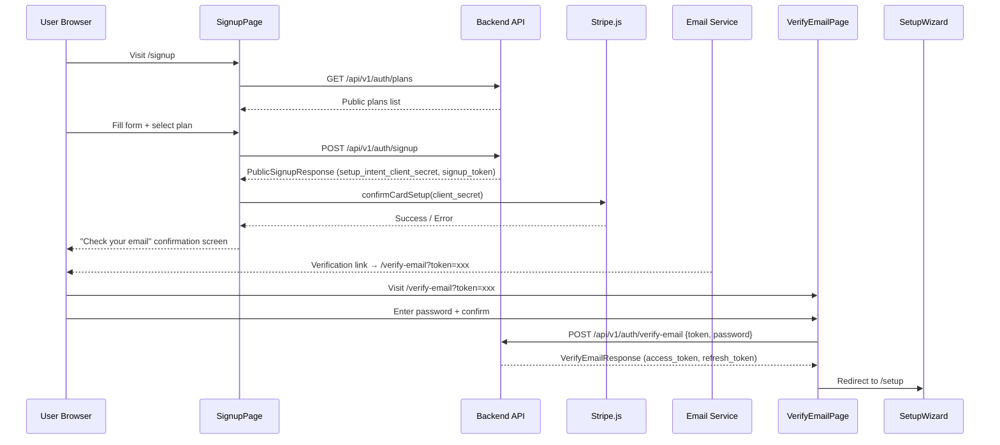

# Design Document: Public Signup Flow

## Overview

This feature adds a complete frontend public signup flow consisting of two new pages (`/signup` and `/verify-email`) that connect to the existing backend endpoints `POST /api/v1/auth/signup` and `POST /api/v1/auth/verify-email`. The flow guides a prospective customer through: form submission → Stripe card collection → email verification with password setup → redirect into the existing Setup Wizard.

A new public backend endpoint `GET /api/v1/auth/plans` is also required to serve the list of public, non-archived subscription plans without authentication.

The frontend follows the existing patterns established by the Login, PasswordResetRequest, and PasswordResetComplete pages: React functional components using `useState` for local form state, `apiClient` (axios) for API calls, and the shared `Button`, `Input`, `AlertBanner`, and `Spinner` UI components.

## Architecture



The signup and verify-email routes are wrapped in the existing `GuestOnly` guard, which redirects authenticated users to the dashboard. The Setup Wizard at `/setup` is already behind `RequireAuth`, so unauthenticated users attempting to access it are redirected to `/login`.

### Key Design Decisions

1. **Multi-step single page vs. multi-page**: The signup form and Stripe card collection are handled as steps within a single `SignupPage` component using local state to track the current step. This avoids URL-based step routing and keeps the signup_token and setup_intent_client_secret in memory without persisting them.

2. **Public plans endpoint**: A new `GET /api/v1/auth/plans` endpoint is needed because the existing `GET /api/v1/admin/plans` requires `global_admin` authentication. This new endpoint filters to `is_public=True` and `is_archived=False` plans only.

3. **Stripe.js loading**: `@stripe/stripe-js` and `@stripe/react-stripe-js` are loaded only when the user reaches the card collection step, using `loadStripe()` with the publishable key from an environment variable.

4. **Token storage after verification**: The `VerifyEmailPage` stores the returned JWT tokens via the existing `setAccessToken` / `setRefreshToken` helpers from `@/api/client`, then triggers an auth context refresh before redirecting to `/setup`.

## Components and Interfaces

### New Frontend Components

#### `SignupPage` (`frontend/src/pages/auth/Signup.tsx`)

A multi-step component with three internal states:

| Step | State | Description |
|------|-------|-------------|
| `form` | Initial | Renders the signup form with org name, admin details, plan selector |
| `stripe` | After successful signup API call | Renders Stripe CardElement for card collection |
| `done` | After successful card setup | Renders confirmation message to check email |

Props: None (route-level component)

Key internal state:
- `step: 'form' | 'stripe' | 'done'`
- `plans: Plan[]` — fetched on mount
- `formData: SignupFormData` — controlled form fields
- `errors: Record<string, string>` — field-level validation errors
- `apiError: string | null` — server error message
- `submitting: boolean`
- `stripeClientSecret: string | null`
- `signupToken: string | null`

#### `VerifyEmailPage` (`frontend/src/pages/auth/VerifyEmail.tsx`)

A single-step form component that:
1. Extracts `token` from `useSearchParams()`
2. Shows an error if token is missing
3. Collects password + confirm password
4. Submits to `POST /api/v1/auth/verify-email`
5. Stores tokens and redirects to `/setup`

Key internal state:
- `password: string`
- `confirmPassword: string`
- `errors: Record<string, string>`
- `apiError: string | null`
- `submitting: boolean`
- `success: boolean`

### Modified Components

#### `Login.tsx`
Add a "Don't have an account? Sign up" link below the existing sign-in form, using `<Link to="/signup">`.

#### `App.tsx`
Add two routes inside the existing `<Route element={<GuestOnly />}>` block:
```tsx
<Route path="/signup" element={<Signup />} />
<Route path="/verify-email" element={<VerifyEmail />} />
```

#### `frontend/src/pages/auth/index.ts`
Export the two new components.

### New Backend Endpoint

#### `GET /api/v1/auth/plans`
- No authentication required
- Returns `{ plans: [{ id, name, monthly_price_nzd }] }` filtered to `is_public=True, is_archived=False`
- Added to `app/modules/auth/router.py`

### Validation Functions

Client-side validation (in `SignupPage`):
- `org_name`: 1–255 characters
- `admin_email`: valid email format (regex or HTML5 type="email" + pattern)
- `admin_first_name`: 1–100 characters
- `admin_last_name`: 1–100 characters
- `plan_id`: must be selected (non-empty)

Client-side validation (in `VerifyEmailPage`):
- `password`: minimum 10 characters
- `confirmPassword`: must match `password`

These validations mirror the backend Pydantic constraints and are implemented as pure functions (`validateSignupForm`, `validateVerifyEmailForm`) for testability.

## Data Models

### TypeScript Interfaces

```typescript
// Signup form data matching PublicSignupRequest
interface SignupFormData {
  org_name: string
  admin_email: string
  admin_first_name: string
  admin_last_name: string
  plan_id: string
}

// Response from POST /api/v1/auth/signup matching PublicSignupResponse
interface SignupResponse {
  message: string
  organisation_id: string
  organisation_name: string
  plan_id: string
  admin_user_id: string
  admin_email: string
  trial_ends_at: string
  stripe_setup_intent_client_secret: string
  signup_token: string
}

// Public plan for the plan selector
interface PublicPlan {
  id: string
  name: string
  monthly_price_nzd: number
}

// Response from GET /api/v1/auth/plans
interface PublicPlanListResponse {
  plans: PublicPlan[]
}

// Request body for POST /api/v1/auth/verify-email
interface VerifyEmailRequest {
  token: string
  password: string
}

// Response from POST /api/v1/auth/verify-email matching VerifyEmailResponse
interface VerifyEmailResponse {
  message: string
  access_token: string
  refresh_token: string
  token_type: string
}
```

### Backend Schema Addition

```python
# In app/modules/auth/schemas.py
class PublicPlanResponse(BaseModel):
    id: str
    name: str
    monthly_price_nzd: Decimal

class PublicPlanListResponse(BaseModel):
    plans: list[PublicPlanResponse]
```


## Correctness Properties

*A property is a characteristic or behavior that should hold true across all valid executions of a system — essentially, a formal statement about what the system should do. Properties serve as the bridge between human-readable specifications and machine-verifiable correctness guarantees.*

### Property 1: Field length validation rejects out-of-bounds strings

*For any* string and any length-constrained field (org_name with bounds [1, 255], admin_first_name with bounds [1, 100], admin_last_name with bounds [1, 100]), if the string length is outside the field's bounds then `validateSignupForm` should return an error for that field, and if the string length is within bounds then no error should be returned for that field.

**Validates: Requirements 1.6, 1.8**

### Property 2: Email format validation rejects invalid emails

*For any* string that does not contain exactly one `@` separating a non-empty local part and a non-empty domain part with at least one dot, `validateSignupForm` should return an email validation error. Conversely, for any well-formed email string, no email error should be returned.

**Validates: Requirements 1.7**

### Property 3: Signup page error message passthrough

*For any* non-empty error message string returned by either the Signup API (as `detail`) or by Stripe (as `error.message`), the SignupPage should display that exact string to the user.

**Validates: Requirements 1.4, 2.4**

### Property 4: Verify page error message passthrough

*For any* non-empty error message string returned by the Verify Email API (as `detail`), the VerifyEmailPage should display that exact string to the user.

**Validates: Requirements 3.6**

### Property 5: Password minimum length validation

*For any* string shorter than 10 characters, `validateVerifyEmailForm` should return a password length error. *For any* string of 10 or more characters, no password length error should be returned.

**Validates: Requirements 3.7**

### Property 6: Password confirmation match validation

*For any* two strings, `validateVerifyEmailForm` should return a mismatch error if and only if the two strings are not equal.

**Validates: Requirements 3.8**

### Property 7: Plan display completeness

*For any* non-empty list of plans (each with id, name, and monthly_price_nzd), when rendered by the SignupPage plan selector, every plan's name and formatted price should appear in the rendered output.

**Validates: Requirements 6.2**

## Error Handling

| Scenario | Handling |
|----------|----------|
| Plans fetch fails (network error) | Display "Unable to load plans. Please try again later." with a retry button. Signup form is disabled. |
| Plans fetch returns empty list | Display "Signup is temporarily unavailable." message. Form is hidden. (Req 6.4) |
| Signup API returns 400 | Display `response.data.detail` in an AlertBanner above the form. Form remains editable. (Req 1.4) |
| Signup API returns 5xx / network error | Display "Something went wrong. Please try again." with the form still editable. |
| `stripe.confirmCardSetup` fails | Display `error.message` from Stripe in an AlertBanner. User can retry card entry. (Req 2.4) |
| Verify page loaded without `token` param | Display "This verification link is invalid." No form is shown. (Req 3.3) |
| Verify Email API returns 400 | Display `response.data.detail` in an AlertBanner. Form remains editable. (Req 3.6) |
| Verify Email API returns 5xx / network error | Display "Something went wrong. Please try again." with the form still editable. |

All error messages use the existing `AlertBanner` component with `variant="error"`.

## Testing Strategy

### Unit Tests (Vitest + React Testing Library)

Unit tests cover specific examples, edge cases, and integration points:

- **SignupPage rendering**: Form fields present, plan selector rendered (Req 1.1)
- **SignupPage form submission**: API called with correct payload (Req 1.2)
- **SignupPage success flow**: Transitions to Stripe step on API success (Req 1.3)
- **SignupPage loading state**: Submit button disabled during submission (Req 1.5)
- **Stripe card setup**: `confirmCardSetup` called with correct secret (Req 2.1, 2.2)
- **Stripe success**: Confirmation screen shown (Req 2.3)
- **VerifyEmailPage rendering**: Password fields present (Req 3.1)
- **VerifyEmailPage token extraction**: Token read from URL params (Req 3.2)
- **VerifyEmailPage missing token**: Error displayed (Req 3.3, edge case)
- **VerifyEmailPage submission**: API called with token + password (Req 3.4)
- **VerifyEmailPage success**: Tokens stored, redirect to /setup (Req 3.5)
- **Route registration**: /signup and /verify-email routes exist (Req 4.1, 4.2)
- **GuestOnly guard**: Authenticated users redirected from /signup and /verify-email (Req 4.3, 4.4)
- **Login page link**: "Sign up" link present and navigates to /signup (Req 5.1, 5.2)
- **Plans fetch on load**: API called on mount (Req 6.1)
- **No plan selected**: Form submission blocked (Req 6.3, edge case)
- **Empty plans list**: "Temporarily unavailable" message shown (Req 6.4, edge case)
- **Unauthenticated /setup access**: Redirect to /login (Req 7.3)

### Property-Based Tests (Hypothesis — Python backend, fast-check — TypeScript frontend)

Property-based tests verify universal properties across generated inputs. Each test runs a minimum of 100 iterations.

The validation functions (`validateSignupForm`, `validateVerifyEmailForm`) are extracted as pure functions to enable direct property-based testing without rendering React components.

For frontend property tests, use `fast-check` library. Each test must be tagged with a comment referencing the design property:

```typescript
// Feature: public-signup-flow, Property 1: Field length validation rejects out-of-bounds strings
```

| Property | Test Description | Library |
|----------|-----------------|---------|
| Property 1 | Generate random strings, verify length validation accepts/rejects correctly per field bounds | fast-check |
| Property 2 | Generate random strings, verify email validation accepts well-formed emails and rejects malformed ones | fast-check |
| Property 3 | Generate random error message strings, mock API/Stripe errors, verify the message appears in rendered output | fast-check |
| Property 4 | Generate random error message strings, mock API errors, verify the message appears in rendered output | fast-check |
| Property 5 | Generate random strings, verify password length validation boundary at 10 characters | fast-check |
| Property 6 | Generate random string pairs, verify mismatch detection is correct | fast-check |
| Property 7 | Generate random plan lists, render plan selector, verify all names and prices appear | fast-check |

The backend `GET /api/v1/auth/plans` endpoint can be tested with Hypothesis using the existing `PBT_SETTINGS` from `tests/properties/conftest.py` to verify it only returns public, non-archived plans.
