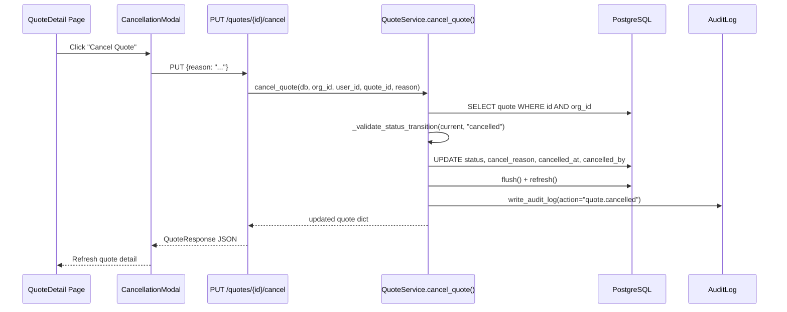

# Design Document: Quote Cancellation Workflow

## Overview

This feature adds a formal "Cancel" action to the quote lifecycle, allowing users to withdraw quotes that have been shared with customers (status "issued" or "sent"). The design mirrors the existing `void_invoice()` pattern: a dedicated service function records the cancellation reason, timestamp, and actor, writes an audit log entry, and returns the updated quote. The frontend adds a confirmation modal with a required reason field and displays cancellation metadata on cancelled quotes.

### Key Design Decisions

1. **Dedicated endpoint** (`PUT /quotes/{id}/cancel`) rather than overloading the general update endpoint — keeps the cancellation workflow explicit and allows specific request validation (required reason field).
2. **Mirrors invoice void pattern** — same service structure (validate transition → mutate → audit log → refresh → return), same column naming convention (`cancel_reason`, `cancelled_at`, `cancelled_by`).
3. **State machine extension** — "cancelled" is added as a terminal state reachable only from "issued" and "sent". No transitions out of "cancelled" are allowed.
4. **Cancelled quotes become deletable** — extends the existing delete guard to include "cancelled" alongside "draft", "declined", and "expired".

## Architecture



## Components and Interfaces

### Backend

| Component | File | Change |
|-----------|------|--------|
| Quote model | `app/modules/quotes/models.py` | Add `cancel_reason`, `cancelled_at`, `cancelled_by` columns; update CHECK constraint |
| QuoteStatus enum | `app/modules/quotes/schemas.py` | Add `cancelled` member |
| QuoteResponse schema | `app/modules/quotes/schemas.py` | Add `cancel_reason`, `cancelled_at`, `cancelled_by` optional fields |
| QuoteCancelRequest schema | `app/modules/quotes/schemas.py` | New schema with `reason: str` (min_length=1) |
| VALID_TRANSITIONS | `app/modules/quotes/service.py` | Add "cancelled" to "issued" and "sent" target sets |
| `cancel_quote()` | `app/modules/quotes/service.py` | New async function |
| `delete_quote()` | `app/modules/quotes/service.py` | Update non-deletable set to exclude "cancelled" |
| `_quote_to_dict()` | `app/modules/quotes/service.py` | Include cancellation fields in output |
| Cancel endpoint | `app/modules/quotes/router.py` | New `PUT /{quote_id}/cancel` route |
| Alembic migration | `alembic/versions/0201_*.py` | Add columns + update CHECK constraint |

### Frontend

| Component | File | Change |
|-----------|------|--------|
| CancelQuoteModal | `frontend/src/components/quotes/CancelQuoteModal.tsx` | New modal component |
| QuoteDetail | `frontend/src/pages/quotes/QuoteDetail.tsx` | Add Cancel button, modal integration, cancelled state display |
| QuoteList | `frontend/src/pages/quotes/QuoteList.tsx` | Add "cancelled" to STATUS_COLOR and STATUS_OPTIONS |

### Service Function Signature

```python
async def cancel_quote(
    db: AsyncSession,
    *,
    org_id: uuid.UUID,
    user_id: uuid.UUID,
    quote_id: uuid.UUID,
    reason: str,
    ip_address: str | None = None,
) -> dict:
```

### API Endpoint

```
PUT /api/v1/quotes/{quote_id}/cancel
Content-Type: application/json

Request Body:
{
  "reason": "Customer requested different scope"  // required, non-empty
}

Response: QuoteResponse (200)
Errors: 400 (invalid transition / empty reason), 404 (not found)
```

### CancelQuoteModal Props

```typescript
interface CancelQuoteModalProps {
  isOpen: boolean
  onClose: () => void
  onConfirm: (reason: string) => Promise<void>
  loading: boolean
}
```

## Data Models

### Quote Table Changes

| Column | Type | Nullable | Default | Description |
|--------|------|----------|---------|-------------|
| `cancel_reason` | TEXT | Yes | NULL | User-provided reason for cancellation |
| `cancelled_at` | TIMESTAMP WITH TIME ZONE | Yes | NULL | UTC timestamp of cancellation |
| `cancelled_by` | UUID (FK → users.id) | Yes | NULL | User who performed the cancellation |

### CHECK Constraint Update

```sql
-- Drop old constraint
ALTER TABLE quotes DROP CONSTRAINT IF EXISTS ck_quotes_status;

-- Add updated constraint
ALTER TABLE quotes ADD CONSTRAINT ck_quotes_status
  CHECK (status IN ('draft', 'issued', 'sent', 'accepted', 'declined', 'expired', 'converted', 'cancelled'));
```

### State Machine Update

```python
VALID_TRANSITIONS: dict[str, set[str]] = {
    "draft": {"issued", "sent", "accepted", "declined"},
    "issued": {"draft", "sent", "accepted", "declined", "expired", "cancelled"},
    "sent": {"draft", "accepted", "declined", "expired", "cancelled"},
    "accepted": set(),
    "declined": set(),
    "expired": set(),
    "cancelled": set(),  # terminal state
}
```

## Correctness Properties

*A property is a characteristic or behavior that should hold true across all valid executions of a system — essentially, a formal statement about what the system should do. Properties serve as the bridge between human-readable specifications and machine-verifiable correctness guarantees.*

### Property 1: Valid cancellation transitions succeed

*For any* quote with status in {"issued", "sent"} and any non-empty reason string, calling `cancel_quote` SHALL transition the quote status to "cancelled" without raising an error.

**Validates: Requirements 1.1, 1.2**

### Property 2: Invalid cancellation transitions are rejected

*For any* quote with status in {"draft", "accepted", "declined", "expired", "cancelled"} and any reason string, calling `cancel_quote` SHALL raise a ValueError indicating the transition is not allowed.

**Validates: Requirements 1.3**

### Property 3: Cancellation preserves quote number and records metadata

*For any* cancellable quote (status "issued" or "sent"), after calling `cancel_quote` with a given reason string and user_id, the resulting quote SHALL have: (a) the same quote_number as before, (b) cancel_reason equal to the provided reason, and (c) cancelled_by equal to the provided user_id.

**Validates: Requirements 1.4, 1.5, 1.6**

### Property 4: Cancelled quotes are deletable

*For any* quote with status "cancelled", calling `delete_quote` SHALL succeed without raising a ValueError about non-deletable status.

**Validates: Requirements 4.1**

## Error Handling

| Scenario | Layer | Response |
|----------|-------|----------|
| Quote not found | Service → Router | 404 `{"detail": "Quote not found in this organisation"}` |
| Invalid status for cancellation | Service → Router | 400 `{"detail": "Cannot transition quote from '{status}' to 'cancelled'"}` |
| Empty/missing reason | Router (Pydantic) | 400 `{"detail": "reason field is required and must be non-empty"}` |
| Org context missing | Router | 403 `{"detail": "Organisation context required"}` |
| Database error | Router | 500 (unhandled, rollback triggered) |

The router follows the existing pattern: `try/except ValueError` with rollback, mapping "not found" messages to 404 and other ValueErrors to 400.

## Testing Strategy

### Property-Based Tests (Hypothesis)

The feature involves pure business logic (state machine transitions, metadata recording) that is well-suited to property-based testing. The `cancel_quote` function is a deterministic transformation given inputs.

- **Library**: Hypothesis (already used in the project — `.hypothesis/` directory exists)
- **Minimum iterations**: 100 per property
- **Tag format**: `Feature: quote-cancellation-workflow, Property {N}: {title}`

Each correctness property above maps to a single Hypothesis test:
1. Generate random quotes with valid cancellable statuses + random reason strings → verify transition succeeds and metadata is correct
2. Generate random quotes with non-cancellable statuses → verify rejection
3. Verify quote_number invariance and metadata fields after cancellation
4. Generate cancelled quotes → verify deletion succeeds

### Unit Tests (pytest)

- Cancel endpoint returns 200 with updated quote for valid request
- Cancel endpoint returns 400 for empty reason
- Cancel endpoint returns 404 for non-existent quote
- Cancel endpoint returns 400 for draft quote
- Audit log entry written with correct before/after values
- `_quote_to_dict` includes cancellation fields

### Frontend Tests (Vitest + React Testing Library)

- CancelQuoteModal renders with correct message text
- Confirm button disabled when reason is empty/whitespace
- Confirm button enabled when reason has non-whitespace content
- Modal calls onConfirm with reason text
- Cancel Quote button visible for issued/sent status
- Cancel Quote button hidden for other statuses
- Cancelled quote displays red badge, reason, date, and user name
- QuoteList shows "Cancelled" with correct colour class

### Integration Tests

- Full cancel flow: create quote → issue → cancel → verify response
- Cancel then delete flow: cancel → delete → verify 200
- Alembic migration up/down without errors
