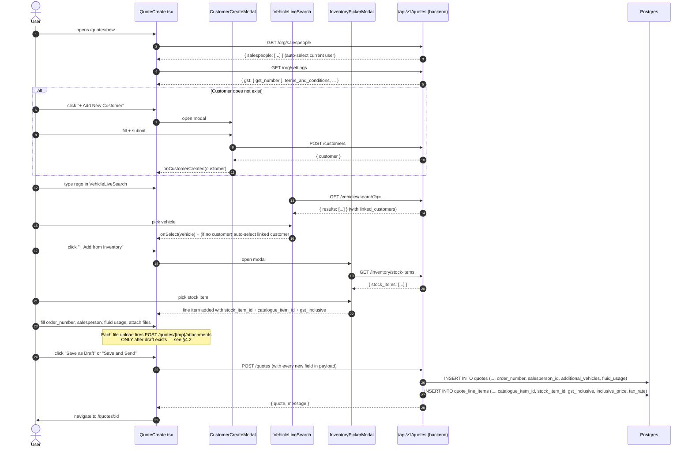
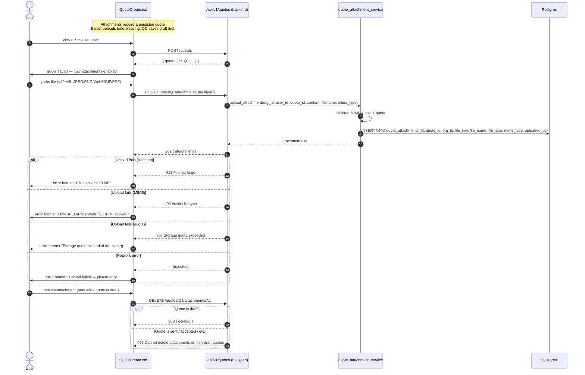
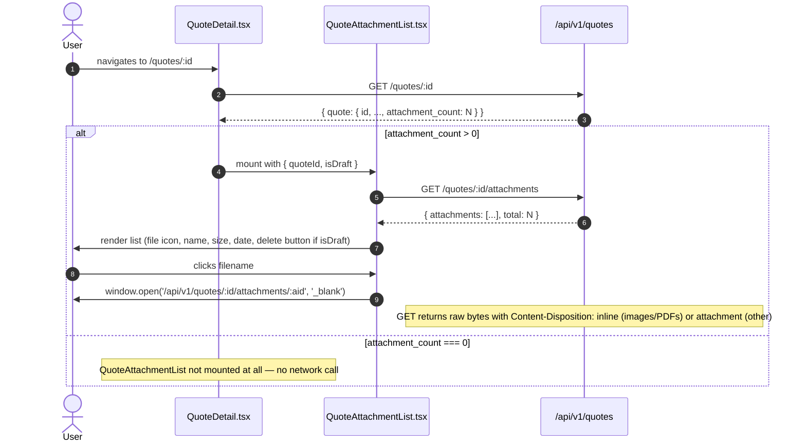
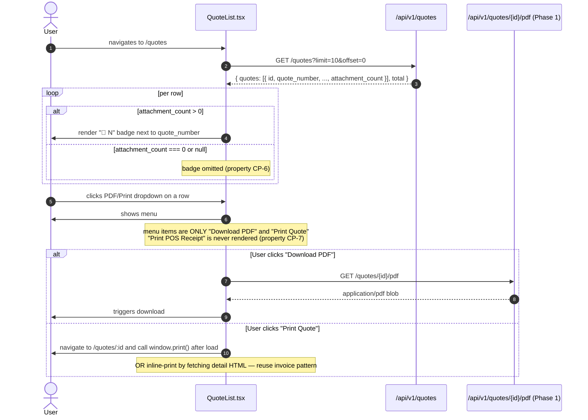

# Design Document: Quote ↔ Invoice Parity (Phases 5 + 7)

**Status:** Draft — design only (no requirements.md or tasks.md yet)
**Source of truth:** `docs/QUOTE_PREVIEW_PRINT_PLAN.md` (Phases 5 and 7, plus the consolidated "Explicitly out of scope" and "Open questions" sections). This spec is a direct implementation of that plan; if the plan and this doc disagree, the plan wins until this doc is updated.
**Scope:** This single spec covers **Phase 5** (field and schema parity between `QuoteCreate.tsx` and `InvoiceCreate.tsx` at UI, Pydantic, and ORM layers) and **Phase 7** (the read-side consumption of those new fields on `QuoteDetail.tsx` and `QuoteList.tsx`). Phase 7 depends on Phase 5's backend changes and ships in the same PR.
**Explicitly excluded from this spec:** Phase 4 (preview modal), Phase 6 (mobile parity), POS receipt, recurring toggle, bulk delete — see §12.

---

## 0. Open Questions Blocking Implementation

**Read this section before starting the migration.** Two of the plan's Open Questions are still unanswered. Their answers determine which rows in the migration (§5.3) can be deleted before merging. Do NOT treat them as answered.

### OQ-1 — Are multi-vehicle quotes a real customer-facing requirement, or only a mechanic-facing nice-to-have?

- **What it gates:** the `quotes.additional_vehicles JSONB NULL` column, the Multi-Vehicle UI section on `QuoteCreate.tsx`, and the `additional_vehicles` field on `QuoteResponse`.
- **If the answer is "no":** drop the `additional_vehicles` migration row, drop the UI section, drop the schema field. The rest of the spec stays intact.
- **If the answer is "yes":** ship as designed.
- **Decision owner:** product.
- **Decision deadline:** before the Alembic migration is merged. Nullable column means a later migration can still remove it, but that is a schema thrash that should be avoided.

### OQ-2 — Does the business want quote attachments at all?

- **What it gates:** the entire `quote_attachments` table, the `POST/GET/DELETE /quotes/{id}/attachments` endpoints, the `attachment_count` column on `QuoteSearchResult`, the attachments section on `QuoteCreate.tsx`, the `<QuoteAttachmentList />` mount on `QuoteDetail.tsx`, and the 📎 badge on `QuoteList.tsx`.
- **If the answer is "no":** this spec loses more than half its surface area. Phase 7's "Desktop: attachment + PDF surfaces" shrinks to a trivial change (no attachment surfaces to add). The migration degenerates to a small columns-only change on `quotes` and `quote_line_items`.
- **If the answer is "yes":** ship as designed.
- **Decision owner:** product.
- **Decision deadline:** before the Alembic migration is merged.

**Neither OQ-3 (preview watermark — belongs to Phase 4, not this spec) nor OQ-4 (Phase 4 survivability — not in scope) block this work.**

---

## 1. Overview

### 1.1 What this is

`QuoteCreate.tsx` and `InvoiceCreate.tsx` were assumed to be parity siblings. A field-by-field audit (see the plan's Phase 5 parity matrix) shows they are not. QuoteCreate is missing most of InvoiceCreate's header, line-item, and post-header fields, and the backend quote schemas do not persist those fields today. Phase 5 closes that gap across three layers: UI, Pydantic, ORM (with one Alembic migration). Phase 7 then adds the corresponding read-side consumption on `QuoteDetail.tsx` (attachment section) and `QuoteList.tsx` (📎 badge, PDF/Print dropdown).

### 1.2 Why one spec for two phases

Phase 7's UI directly reads fields added by Phase 5 (`attachment_count` on `QuoteSearchResult`, the `quote_attachments` table for the attachment list component). Shipping Phase 7 without Phase 5 would mean wiring UI against columns that don't exist. Shipping Phase 5 without Phase 7 would mean users can attach files to quotes but never see them on the list or detail page. The two phases must land together or not at all.

### 1.3 Phase split inside this spec

| Phase | Layer(s) | What changes | Depends on |
|-------|----------|--------------|------------|
| 5 | ORM + migration + Pydantic + backend service + backend router + `QuoteCreate.tsx` | Parity with `InvoiceCreate.tsx` | Nothing inside this spec |
| 7 | Frontend only — `QuoteDetail.tsx`, `QuoteList.tsx`, new `QuoteAttachmentList.tsx` | Read-side UI surfaces that consume Phase 5's fields | Phase 5 |

### 1.4 What is explicitly excluded

See §12. The short list: recurring toggle, mark-paid-and-email, payment gateway selector, Stripe Connect status, payment reminders, bulk delete, POS receipt. Each has a one-line rationale in §12.

### 1.5 Guiding steering rules

- `.kiro/steering/spec-completeness-checklist.md` — every section from the checklist appears below (navigation, component tree, workflow trace, toolbar spec, error states, loading/empty states, integration points).
- `.kiro/steering/safe-api-consumption.md` — every new `apiClient` call uses typed generics, `?.`, and `?? []` or `?? 0`.
- `.kiro/steering/no-shortcut-implementations.md` — this is exactly the case the rule was written for; the change must go through a full spec and preserve existing functionality.
- `.kiro/steering/feature-testing-workflow.md` — an e2e script in `scripts/test_quote_parity_e2e.py` is required. See §11 for the test plan.
- `.kiro/steering/frontend-backend-contract-alignment.md` — field names in `QuoteCreate.tsx buildPayload()` must match the Pydantic schema exactly.
- `.kiro/steering/versioning-and-changelog.md` — see §14 for the version decision.

---

## 2. Navigation & Access

No new routes are created — all additions attach to existing `/quotes/*` routes.

| Route | Component | Guard | What changes in this spec |
|-------|-----------|-------|---------------------------|
| `/quotes` | `QuoteList.tsx` | `RequireAuth` + `require_role("org_admin", "salesperson")` on API | Add 📎 badge column and per-row PDF/Print dropdown (§4.4) |
| `/quotes/new` | `QuoteCreate.tsx` | same as above | Add every missing field from the parity matrix (§4.1) |
| `/quotes/:id/edit` | `QuoteCreate.tsx` (edit mode via `useParams`) | same | Rehydrate every new field from `GET /quotes/{id}` |
| `/quotes/:id` | `QuoteDetail.tsx` | same | Mount `<QuoteAttachmentList quoteId={id} isDraft={quote.status === 'draft'} />` when `attachment_count > 0` (§4.3); also show new fields in read-only view |

**New API routes** (see §5.6 for full signatures):

| Route | Method | Role | Notes |
|-------|--------|------|-------|
| `/api/v1/quotes/{quote_id}/attachments` | POST | `org_admin`, `salesperson` | Mirrors `POST /invoices/{id}/attachments` |
| `/api/v1/quotes/{quote_id}/attachments` | GET | `org_admin`, `salesperson` | Returns `{ attachments: [...], total: N }` |
| `/api/v1/quotes/{quote_id}/attachments/{attachment_id}` | GET | `org_admin`, `salesperson` | Returns raw file with `Content-Disposition: inline` for images/PDFs, `attachment` otherwise — **identical header formula to `GET /invoices/{id}/attachments/{aid}`** (property CP-1 in §11) |
| `/api/v1/quotes/{quote_id}/attachments/{attachment_id}` | DELETE | `org_admin`, `salesperson` | Only allowed when the quote is in `draft`; otherwise 403 |

**No sidebar changes.** No module-gating changes. No trade-family-gating changes beyond what already applies to `QuoteCreate.tsx`. The Fluid Usage section stays gated on `vehicles` module + `automotive-transport` trade family, matching invoice behaviour.

---

## 3. Component Tree

### 3.1 Modified components (existing files)

```
QuoteCreate.tsx (major additions)
├── CustomerSearch (EXISTING — extend to show linked vehicles badge + trigger CustomerCreateModal)
│   └── CustomerCreateModal (REUSED from frontend/src/components/customers/CustomerCreateModal.tsx)
├── VehicleLiveSearch (REUSED from frontend/src/components/vehicles/VehicleLiveSearch.tsx)
│   └── (auto-lookup replaces manual rego + Lookup button)
├── MultiVehicleSection (NEW inline section — OQ-1 gated)
├── HeaderFields
│   ├── OrderNumber (NEW input)
│   ├── SalespersonDropdown (NEW — loads from /org/salespeople, auto-selects current user)
│   ├── GstNumberDisplay (NEW — read-only, from useTenant().settings.gst.gst_number)
│   └── ExistingFields (Quote Date, Expiry Date, Valid For, Subject)
├── LineItemsTable (EXTENDED)
│   ├── ItemTableRow (EXISTING — extend to support 3-way GST mode)
│   ├── InlineAddNewItemForm (EXISTING — add inclusive/exclusive/exempt toggle)
│   ├── PartsCatalogueModal (EXISTING — unchanged)
│   ├── LabourRateModal (EXISTING — unchanged)
│   └── InventoryPickerModal (NEW — "+ Add from Inventory" button)
├── FluidUsageSection (NEW — trade-family + vehicles-module gated)
├── TotalsBlock (EXISTING — unchanged)
├── NotesAndTerms (EXTENDED)
│   └── SaveTermsAsDefaultCheckbox (NEW — "Save as default for all future quotes")
└── AttachmentsSection (NEW — OQ-2 gated)
    └── QuoteAttachmentList (NEW — see 3.2)
```

```
QuoteDetail.tsx (minor additions)
├── ActionBar (EXISTING — unchanged by this spec; Phase 2 owns PDF/Print/Copy Link buttons)
├── HeaderMetadataGrid (EXTENDED — display new fields: order_number, salesperson name, additional vehicles summary)
├── LineItemsTable (EXTENDED — render inclusive/exclusive GST labels per line using new gst_inclusive + inclusive_price fields)
├── FluidUsageSection (NEW — read-only; appears when quote.fluid_usage is non-empty)
└── QuoteAttachmentList (NEW mount — conditional on quote.attachment_count > 0)
```

```
QuoteList.tsx (minor additions)
├── FilterBar (EXISTING — unchanged)
├── Table
│   ├── Existing columns (Date, Quote Number, Customer, Branch, Status, Expires In, Amount, Actions)
│   ├── AttachmentBadge (NEW — 📎 N badge next to Quote Number, reading attachment_count)
│   └── ActionsCell (EXTENDED)
│       ├── Existing actions (Edit / Requote / Delete)
│       └── PdfPrintDropdown (NEW — Download PDF, Print; NO Print POS Receipt)
└── DeleteConfirm (EXISTING — unchanged)
```

### 3.2 New components (new files)

```
frontend/src/components/quotes/QuoteAttachmentList.tsx   (new)
  Purpose: quote-side mirror of AttachmentList.tsx.
  Props:   { quoteId: string; isDraft: boolean }
  API:     GET /quotes/{id}/attachments, DELETE /quotes/{id}/attachments/{aid}
  Render:  Identical visual structure to AttachmentList.tsx — file-type icon,
           clickable filename (opens /api/v1/quotes/{id}/attachments/{aid}
           in new tab), size + date metadata, delete button on draft only.

frontend/src/components/quotes/InventoryPickerModal.tsx  (new — or shared)
  Purpose: "+ Add from Inventory" picker for the quote line-item table.
  Props:   { open: boolean; onClose: () => void; onSelect: (stockItem) => void }
  API:     GET /inventory/stock-items
  Render:  Searchable list of stock items with SKU, name, available qty, price.
  Note:    If the invoice side already has an equivalent modal, refactor both
           into a single shared component. Do not duplicate.

frontend/src/components/quotes/QuoteMultiVehicleSection.tsx  (new — OQ-1 gated)
  Purpose: list of additional vehicles on a quote beyond the primary one.
  Props:   { vehicles: Vehicle[]; onChange: (vehicles: Vehicle[]) => void }
  Render:  Same pattern as InvoiceCreate's multi-vehicle UI.
```

**Shared-abstraction decision:** `AttachmentList.tsx` and the new `QuoteAttachmentList.tsx` are near-identical (only endpoint paths and prop name differ). The plan flags this: "consider extracting a shared `<AttachmentList entity="invoice" | "quote" entityId={id} />` if the duplication is uncomfortable." **Decision for this spec:** ship two files initially. Extract a shared component in a follow-up refactor spec only if a third use case appears. Rationale: the "isDraft" gate on delete has quote-specific status semantics (`draft` only), and forcing both into one component adds conditional logic for no current payoff.

### 3.3 Integration points with existing code

- `useTenant()` — read `settings.gst.gst_number` for the GST number display, and the existing `terms_and_conditions` default for the T&C textarea. Also write via `refetchTenant()` after the "Save as default" checkbox fires (calls `PUT /org/settings` with the new terms).
- `useBranch()` — the existing branch-scoped behaviour on QuoteCreate is preserved; new fields do not interact with branch context.
- `useModules()` — the Fluid Usage and multi-vehicle sections stay gated on `isEnabled('vehicles')`.
- `useNavigationGuard()` — if the app has a navigation-guard hook, the new fields must be included in its dirty check. If the hook is invoice-specific, wire `setNavigationGuard`/`clearNavigationGuard` in QuoteCreate to match the invoice pattern exactly.
- `CustomerCreateModal` — reuse as-is from `frontend/src/components/customers/CustomerCreateModal.tsx`. Its `onCustomerCreated(customer)` callback already fits the existing `CustomerSearch.onSelect` signature.
- `VehicleLiveSearch` — reuse as-is from `frontend/src/components/vehicles/VehicleLiveSearch.tsx`. Accept `onCustomerAutoSelect` callback for the linked-customer auto-fill behaviour (pattern already used in `InvoiceCreate.tsx`).

---

## 4. High-Level Design

### 4.1 Flow: Quote create with all new fields (happy path)



### 4.2 Flow: Attachment upload



### 4.3 Flow: QuoteDetail attachment section



### 4.4 Flow: QuoteList badge + PDF dropdown



---

## 5. Low-Level Design

### 5.1 SQLAlchemy ORM deltas

**File:** `app/modules/quotes/models.py`

```python
# Additions to existing Quote class
class Quote(Base):
    # ... existing columns unchanged ...

    # NEW — Phase 5
    order_number: Mapped[str | None] = mapped_column(String(100), nullable=True)
    salesperson_id: Mapped[uuid.UUID | None] = mapped_column(
        UUID(as_uuid=True), ForeignKey("users.id"), nullable=True
    )
    additional_vehicles: Mapped[list[dict] | None] = mapped_column(
        JSONB, nullable=True
    )  # OQ-1 gated
    fluid_usage: Mapped[list[dict] | None] = mapped_column(
        JSONB, nullable=True
    )

# Additions to existing QuoteLineItem class
class QuoteLineItem(Base):
    # ... existing columns unchanged ...

    # NEW — Phase 5
    catalogue_item_id: Mapped[uuid.UUID | None] = mapped_column(
        UUID(as_uuid=True), nullable=True
    )  # no FK — catalogue_items may be in a different module
    stock_item_id: Mapped[uuid.UUID | None] = mapped_column(
        UUID(as_uuid=True), nullable=True
    )
    gst_inclusive: Mapped[bool] = mapped_column(
        Boolean, nullable=False, server_default="false"
    )
    inclusive_price: Mapped[Decimal | None] = mapped_column(
        Numeric(12, 2), nullable=True
    )
    tax_rate: Mapped[Decimal] = mapped_column(
        Numeric(5, 2), nullable=False, server_default="15"
    )
```

**New file:** `app/modules/quotes/attachment_models.py` — OQ-2 gated — near-identical to `app/modules/invoices/attachment_models.py`, with the invoice FK replaced by a quote FK:

```python
class QuoteAttachment(Base):
    __tablename__ = "quote_attachments"

    id: Mapped[uuid.UUID] = mapped_column(
        UUID(as_uuid=True), primary_key=True,
        default=uuid.uuid4, server_default=func.gen_random_uuid(),
    )
    quote_id: Mapped[uuid.UUID] = mapped_column(
        UUID(as_uuid=True),
        ForeignKey("quotes.id", ondelete="CASCADE"),
        nullable=False,
    )
    org_id: Mapped[uuid.UUID] = mapped_column(
        UUID(as_uuid=True), ForeignKey("organisations.id"), nullable=False
    )
    file_key: Mapped[str] = mapped_column(String(500), nullable=False)
    file_name: Mapped[str] = mapped_column(String(255), nullable=False)
    file_size: Mapped[int] = mapped_column(Integer, nullable=False)
    mime_type: Mapped[str] = mapped_column(String(100), nullable=False)
    uploaded_by: Mapped[uuid.UUID | None] = mapped_column(
        UUID(as_uuid=True), ForeignKey("users.id"), nullable=True
    )
    sort_order: Mapped[int] = mapped_column(Integer, nullable=False, server_default="0")
    created_at: Mapped[datetime] = mapped_column(
        DateTime(timezone=True), nullable=False, server_default=func.now()
    )
```

### 5.2 Pydantic schema deltas

**File:** `app/modules/quotes/schemas.py`

```python
# Extend QuoteLineItemCreate
class QuoteLineItemCreate(BaseModel):
    # ... existing fields unchanged ...
    catalogue_item_id: uuid.UUID | None = None   # NEW
    stock_item_id: uuid.UUID | None = None       # NEW
    gst_inclusive: bool = False                  # NEW
    inclusive_price: Decimal | None = Field(default=None, ge=0)  # NEW
    tax_rate: Decimal | None = Field(default=None, ge=0, le=100) # NEW — defaults to 15 server-side

# Extend QuoteLineItemResponse with the same five fields (NEW)

# Extend QuoteCreate
class VehicleItem(BaseModel):           # NEW — copied from invoices/schemas.py
    model_config = {"extra": "ignore"}
    id: uuid.UUID | None = None
    rego: str | None = None
    make: str | None = None
    model: str | None = None
    year: int | None = None
    odometer: int | None = None

class FluidUsageItem(BaseModel):        # NEW — copied from invoices/schemas.py
    model_config = {"extra": "ignore"}
    stock_item_id: uuid.UUID
    catalogue_item_id: uuid.UUID
    litres: Decimal = Field(..., gt=0)
    item_name: str = ""

class QuoteCreate(BaseModel):
    # ... existing fields unchanged ...
    order_number: str | None = Field(default=None, max_length=100)   # NEW
    salesperson_id: uuid.UUID | None = None                          # NEW
    vehicles: list[VehicleItem] | None = None                        # NEW — OQ-1 gated
    fluid_usage: list[FluidUsageItem] = Field(default_factory=list)  # NEW
    save_terms_as_default: bool = False                              # NEW — triggers settings write
    # line_items now carries the 5 new fields via QuoteLineItemCreate

# Extend QuoteUpdate with the same additions

# Extend QuoteResponse
class QuoteResponse(BaseModel):
    # ... existing fields unchanged ...
    order_number: str | None = None            # NEW
    salesperson_id: uuid.UUID | None = None    # NEW
    salesperson_name: str | None = None        # NEW — enriched in service layer
    additional_vehicles: list[dict] = Field(default_factory=list)  # NEW
    fluid_usage: list[dict] = Field(default_factory=list)          # NEW
    attachment_count: int = 0                  # NEW — Phase 7 depends on this

# Extend QuoteSearchResult (list endpoint)
class QuoteSearchResult(BaseModel):
    # ... existing fields unchanged ...
    attachment_count: int = 0                  # NEW — for 📎 badge in QuoteList (property CP-6)
```

**New file:** `app/modules/quotes/attachment_schemas.py` — mirror of the invoice side. Response shape:

```python
class QuoteAttachmentResponse(BaseModel):
    id: uuid.UUID
    file_name: str
    mime_type: str
    file_size: int
    created_at: datetime
    uploaded_by_name: str | None = None

class QuoteAttachmentListResponse(BaseModel):
    attachments: list[QuoteAttachmentResponse]
    total: int
```

### 5.3 Alembic migration skeleton

**File:** `alembic/versions/2026_05_XX_0900-0184_quote_invoice_parity.py`

**Down-revision:** `0183` (current head — `0183_create_page_editor_tables`). Bump to `0184`.

**Idempotency:** every column addition uses `ADD COLUMN IF NOT EXISTS`. The `quote_attachments` table creation uses the existing pattern from `0170_create_invoice_attachments.py` — early-return if the table already exists.

**Migration is reversible:** the downgrade fully reverses every change (property CP-4). No data-transform migrations; new columns are all NULLable or have server defaults, so existing quotes keep working after upgrade *and* after downgrade.

```python
"""Phase 5 — Quote ↔ Invoice Parity: new columns on quotes/quote_line_items,
new quote_attachments table, RLS policy, HA publication membership.

Revision ID: 0184
Revises: 0183
Requirements: OQ-1 and OQ-2 must be answered before merging.
"""
from __future__ import annotations
from alembic import op
import sqlalchemy as sa
from sqlalchemy.dialects.postgresql import UUID, JSONB

revision: str = "0184"
down_revision: str = "0183"
branch_labels = None
depends_on = None

_ATT_TABLE = "quote_attachments"

_HA_ADD_TPL = """
DO $ha_block$
BEGIN
    IF EXISTS (SELECT 1 FROM pg_publication WHERE pubname = 'ora_publication') THEN
        ALTER PUBLICATION ora_publication ADD TABLE {table};
    END IF;
END
$ha_block$
"""

_HA_DROP_TPL = """
DO $ha_block$
BEGIN
    IF EXISTS (SELECT 1 FROM pg_publication WHERE pubname = 'ora_publication') THEN
        ALTER PUBLICATION ora_publication DROP TABLE IF EXISTS {table};
    END IF;
END
$ha_block$
"""


def upgrade() -> None:
    # ── 1. Columns on quotes (all nullable — safe for existing rows) ──────
    op.execute(
        "ALTER TABLE quotes "
        "ADD COLUMN IF NOT EXISTS order_number VARCHAR(100) NULL"
    )
    op.execute(
        "ALTER TABLE quotes "
        "ADD COLUMN IF NOT EXISTS salesperson_id UUID NULL "
        "REFERENCES users(id)"
    )
    # OQ-1 gated — drop this block if multi-vehicle is out
    op.execute(
        "ALTER TABLE quotes "
        "ADD COLUMN IF NOT EXISTS additional_vehicles JSONB NULL"
    )
    op.execute(
        "ALTER TABLE quotes "
        "ADD COLUMN IF NOT EXISTS fluid_usage JSONB NULL"
    )

    # ── 2. Columns on quote_line_items ────────────────────────────────────
    op.execute(
        "ALTER TABLE quote_line_items "
        "ADD COLUMN IF NOT EXISTS catalogue_item_id UUID NULL"
    )
    op.execute(
        "ALTER TABLE quote_line_items "
        "ADD COLUMN IF NOT EXISTS stock_item_id UUID NULL"
    )
    op.execute(
        "ALTER TABLE quote_line_items "
        "ADD COLUMN IF NOT EXISTS gst_inclusive BOOLEAN NOT NULL DEFAULT false"
    )
    op.execute(
        "ALTER TABLE quote_line_items "
        "ADD COLUMN IF NOT EXISTS inclusive_price NUMERIC(12,2) NULL"
    )
    op.execute(
        "ALTER TABLE quote_line_items "
        "ADD COLUMN IF NOT EXISTS tax_rate NUMERIC(5,2) NOT NULL DEFAULT 15"
    )

    # ── 3. quote_attachments table — OQ-2 gated ───────────────────────────
    conn = op.get_bind()
    exists = conn.execute(sa.text(
        "SELECT 1 FROM information_schema.tables "
        "WHERE table_schema='public' AND table_name='quote_attachments'"
    )).scalar()
    if not exists:
        op.create_table(
            _ATT_TABLE,
            sa.Column("id", UUID(as_uuid=True), primary_key=True,
                      server_default=sa.text("gen_random_uuid()")),
            sa.Column("quote_id", UUID(as_uuid=True), nullable=False),
            sa.Column("org_id", UUID(as_uuid=True), nullable=False),
            sa.Column("file_key", sa.String(500), nullable=False),
            sa.Column("file_name", sa.String(255), nullable=False),
            sa.Column("file_size", sa.Integer(), nullable=False),
            sa.Column("mime_type", sa.String(100), nullable=False),
            sa.Column("uploaded_by", UUID(as_uuid=True), nullable=True),
            sa.Column("sort_order", sa.Integer(), nullable=False, server_default="0"),
            sa.Column("created_at", sa.DateTime(timezone=True),
                     nullable=False, server_default=sa.func.now()),
            sa.ForeignKeyConstraint(["quote_id"], ["quotes.id"],
                name="fk_quote_attachments_quote_id", ondelete="CASCADE"),
            sa.ForeignKeyConstraint(["org_id"], ["organisations.id"],
                name="fk_quote_attachments_org_id"),
            sa.ForeignKeyConstraint(["uploaded_by"], ["users.id"],
                name="fk_quote_attachments_uploaded_by"),
        )
        op.create_index(
            "ix_quote_attachments_quote_org", _ATT_TABLE, ["quote_id", "org_id"]
        )
        op.execute(f"ALTER TABLE {_ATT_TABLE} ENABLE ROW LEVEL SECURITY")
        op.execute(
            f"CREATE POLICY {_ATT_TABLE}_org_isolation ON {_ATT_TABLE} "
            "USING (org_id = current_setting('app.current_org_id')::uuid)"
        )
        op.execute(sa.text(_HA_ADD_TPL.format(table=_ATT_TABLE)))


def downgrade() -> None:
    # Drop quote_attachments table + RLS + HA publication membership
    op.execute(sa.text(_HA_DROP_TPL.format(table=_ATT_TABLE)))
    op.execute(f"DROP POLICY IF EXISTS {_ATT_TABLE}_org_isolation ON {_ATT_TABLE}")
    op.execute(f"DROP INDEX IF EXISTS ix_quote_attachments_quote_org")
    op.execute(f"DROP TABLE IF EXISTS {_ATT_TABLE}")

    # Drop quote_line_items columns
    op.execute("ALTER TABLE quote_line_items DROP COLUMN IF EXISTS tax_rate")
    op.execute("ALTER TABLE quote_line_items DROP COLUMN IF EXISTS inclusive_price")
    op.execute("ALTER TABLE quote_line_items DROP COLUMN IF EXISTS gst_inclusive")
    op.execute("ALTER TABLE quote_line_items DROP COLUMN IF EXISTS stock_item_id")
    op.execute("ALTER TABLE quote_line_items DROP COLUMN IF EXISTS catalogue_item_id")

    # Drop quotes columns
    op.execute("ALTER TABLE quotes DROP COLUMN IF EXISTS fluid_usage")
    op.execute("ALTER TABLE quotes DROP COLUMN IF EXISTS additional_vehicles")
    op.execute("ALTER TABLE quotes DROP COLUMN IF EXISTS salesperson_id")
    op.execute("ALTER TABLE quotes DROP COLUMN IF EXISTS order_number")
```

### 5.4 Quote attachment service (new)

**New file:** `app/modules/quotes/attachment_service.py` — direct port of `app/modules/invoices/attachment_service.py` with these substitutions:

- `invoice_id` → `quote_id`
- `Invoice` → `Quote`
- `InvoiceAttachment` → `QuoteAttachment`
- File-key namespace: `"invoice-attachments"` → `"quote-attachments"` (so storage paths do not collide)
- `ALLOWED_MIME_TYPES` and `MAX_FILE_SIZE = 20 * 1024 * 1024` are re-exported unchanged — identical cap and MIME list (§9 Error states)

Functions to implement:

```python
async def upload_attachment(db, *, org_id, user_id, quote_id,
                            content, filename, mime_type) -> dict
async def list_attachments(db, *, org_id, quote_id) -> list[dict]
async def get_attachment(db, *, org_id, quote_id, attachment_id) -> dict
def download_attachment(org_id, file_key) -> bytes   # sync, disk I/O
async def delete_attachment(db, *, org_id, user_id, quote_id, attachment_id) -> dict
async def get_attachment_count(db, *, org_id, quote_id) -> int
```

All functions use the same RLS-via-org-id pattern. All raise `ValueError` with messages including "not found" for 404 cases, matching the invoice side's router error translation.

### 5.5 Quote service layer changes

**File:** `app/modules/quotes/service.py`

- `create_quote()` — add keyword args for every new field:
  - `order_number: str | None = None`
  - `salesperson_id: uuid.UUID | None = None`
  - `additional_vehicles_data: list[dict] | None = None`
  - `fluid_usage_data: list[dict] | None = None`
  - Line-item dict keys now include `catalogue_item_id`, `stock_item_id`, `gst_inclusive`, `inclusive_price`, `tax_rate`
- **GST calculation change for inclusive lines** — when a line item has `gst_inclusive=True` and `inclusive_price=P`:
  - The *stored* `unit_price` is the ex-GST price: `P / (1 + gst_rate/100)` → with `gst_rate=15`, that is `P / 1.15`
  - `inclusive_price` is persisted verbatim so the UI can round-trip without precision drift
  - `line_total` (ex-GST) = `quantity * unit_price`, rounded to 2 d.p.
  - GST on that line = `line_total * gst_rate / 100`, rounded
  - Quote totals use ex-GST subtotal + summed GST — **same as invoice side** — so no change to `_calculate_quote_totals()` beyond sourcing `unit_price` from the back-calculated value for inclusive lines
  - This is exactly property CP-3 in §11.
- `get_quote()` — enrich response with:
  - `salesperson_name`: join `users` on `salesperson_id` and return `first_name last_name` (or email if names blank)
  - `attachment_count`: call `get_attachment_count(db, org_id, quote_id)` from `quote_attachment_service`
  - `additional_vehicles`: pass-through of the `additional_vehicles` JSONB column (OQ-1 gated)
  - `fluid_usage`: pass-through of the `fluid_usage` JSONB column
- `list_quotes()` — add a correlated subquery for attachment count (mirror of `app/modules/invoices/service.py:2622`):

  ```python
  from app.modules.quotes.attachment_models import QuoteAttachment
  attachment_count_subq = (
      select(sa_func.count(QuoteAttachment.id))
      .where(
          QuoteAttachment.quote_id == Quote.id,
          QuoteAttachment.org_id == org_id,
      )
      .correlate(Quote)
      .scalar_subquery()
  ).label("attachment_count")
  ```

  Include this column in the SELECT and the returned dict per row.
- `update_quote()` — rehydrate every new field; validate status-gated edits (non-draft quotes still only allow notes updates). On inclusive line-item updates, re-derive the totals the same way `create_quote()` does.
- `generate_quote_pdf()` and `send_quote()` — no behavioural change required, but the PDF template should display `order_number` and `salesperson_name` if non-null. Template changes live in `app/templates/pdf/quote.html` and `quote_share.html`.

### 5.6 Quote router — new attachment endpoints

**New file:** `app/modules/quotes/attachment_router.py` — direct port of `app/modules/invoices/attachment_router.py` with the same substitutions as §5.4. Endpoints:

| Method | Path | Auth | Response | Notes |
|--------|------|------|----------|-------|
| POST | `/api/v1/quotes/{quote_id}/attachments` | `org_admin`, `salesperson` | 201 `{ attachment }` | Multipart `file`, validates MIME + size + quota |
| GET | `/api/v1/quotes/{quote_id}/attachments` | `org_admin`, `salesperson` | 200 `{ attachments: [...], total: N }` | |
| GET | `/api/v1/quotes/{quote_id}/attachments/{attachment_id}` | `org_admin`, `salesperson` | 200 raw bytes | `Content-Disposition: inline; filename="..."` for image/* and application/pdf, `attachment; filename="..."` otherwise — **exactly the same formula as the invoice side** (property CP-1) |
| DELETE | `/api/v1/quotes/{quote_id}/attachments/{attachment_id}` | `org_admin`, `salesperson` | 200 `{ deleted }` | 403 if quote status is not `draft` (invoice side blocks on `issued/paid/partially_paid/overdue`; quote side blocks on anything other than `draft`) |

Mount the router in `app/main.py` next to the existing quotes router:

```python
from app.modules.quotes.attachment_router import router as quote_attachment_router
app.include_router(quote_attachment_router, prefix="/api/v1/quotes", tags=["quotes"])
```

**Org isolation** — the service uses the existing `Quote.id == quote_id AND Quote.org_id == org_id` pattern in every query. Cross-org requests return 404 from the service, which the router forwards as 404 (property CP-2).

### 5.7 TypeScript interface deltas

**File:** `frontend/src/pages/quotes/QuoteDetail.tsx`

```ts
interface LineItem {
  // ... existing fields unchanged ...
  catalogue_item_id: string | null       // NEW
  stock_item_id: string | null           // NEW
  gst_inclusive: boolean                 // NEW
  inclusive_price: string | number | null // NEW
  tax_rate: string | number              // NEW
}

interface QuoteData {
  // ... existing fields unchanged ...
  order_number: string | null            // NEW
  salesperson_id: string | null          // NEW
  salesperson_name: string | null        // NEW
  additional_vehicles: Vehicle[]         // NEW
  fluid_usage: FluidUsage[]              // NEW
  attachment_count: number               // NEW — property CP-6 reads this
}

interface FluidUsage {                   // NEW
  stock_item_id: string
  catalogue_item_id: string
  litres: number
  item_name: string
}
```

**File:** `frontend/src/pages/quotes/QuoteList.tsx`

```ts
interface Quote {
  // ... existing fields unchanged ...
  attachment_count?: number              // NEW — ?? 0 at every read site
}
```

**File:** `frontend/src/pages/quotes/QuoteCreate.tsx` — the `buildPayload()` function must send every new field. Exact diff:

```ts
const buildPayload = () => ({
  customer_id: customer?.id,
  branch_id: selectedBranchId || undefined,
  order_number: orderNumber || undefined,           // NEW
  salesperson_id: salesperson || undefined,         // NEW
  vehicles: vehicles.length > 0 ? vehicles : undefined,  // NEW (OQ-1)
  ...(isAutomotive ? {
    vehicle_rego: vehicle?.rego ?? (vehicleRego.trim() || undefined),
    vehicle_make: vehicle?.make ?? undefined,
    vehicle_model: vehicle?.model ?? undefined,
    vehicle_year: vehicle?.year ?? undefined,
  } : {}),
  project_id: selectedProjectId || undefined,
  validity_days: Number(validityDays),
  notes: notes || undefined,
  terms: terms || undefined,
  subject: subject || undefined,
  save_terms_as_default: saveTermsAsDefault,        // NEW
  discount_type: discountType === 'fixed' ? 'fixed' : 'percentage',
  discount_value: discountValue,
  shipping_charges: shippingCharges,
  adjustment: adjustment,
  fluid_usage: fluidUsage.length > 0 ? fluidUsage : undefined,  // NEW
  line_items: lineItems.filter(item => item.description.trim()).map((item, i) => ({
    item_type: item.item_type ?? 'service',
    description: (item.line_description
      ? `${item.description}\n${item.line_description}`
      : item.description).slice(0, 2000),
    quantity: item.quantity,
    unit_price: item.rate,
    catalogue_item_id: item.item_id || undefined,   // NEW
    stock_item_id: item.stock_item_id || undefined, // NEW
    gst_inclusive: !!item.gst_inclusive,            // NEW
    inclusive_price: item.gst_inclusive ? item.rate : undefined,  // NEW
    tax_rate: item.tax_rate ?? 15,                  // NEW
    is_gst_exempt: item.tax_rate === 0,
    sort_order: i,
  })),
})
```

**Safe-API-consumption compliance** (per `.kiro/steering/safe-api-consumption.md`):

- Every new `apiClient.get<T>()` uses a typed generic (no `as any`)
- Every `set*()` uses `res.data?.field ?? fallback`
- Every `.map()` / `.filter()` / `.length` uses `?? []`
- Every `.toFixed()` / `.toLocaleString()` uses `?? 0`
- Every `useEffect` with a fetch uses `AbortController` cleanup
- Response shape for `GET /quotes/:id/attachments` is `{ attachments: [...], total: N }` — confirmed via the router return dict in §5.6

---

## 6. Migration Plan

### 6.1 Upgrade

1. Developer runs `alembic upgrade head` (or on Pi, the container entrypoint does it on next deploy).
2. Migration `0184` runs idempotently. Every `ADD COLUMN` uses `IF NOT EXISTS`. The `quote_attachments` creation early-returns if the table already exists (HA replica scenario).
3. New columns are NULLable or have server defaults. Existing quote rows keep working immediately — no backfill required.
4. RLS policy and HA publication membership for `quote_attachments` are added inside a `DO $ha_block$` that no-ops if the publication is absent. Safe on dev, HA standby, and Pi prod.

### 6.2 Downgrade

1. `alembic downgrade -1` reverses the migration.
2. `quote_attachments` table is dropped (cascade on `quote_id` FK means any attachments are gone — document this as intentional; downgrade is destructive by definition).
3. All column additions are dropped in reverse order.
4. Existing quote rows survive — only the new columns disappear.
5. Property CP-4 asserts this roundtrip leaves the schema bit-for-bit identical.

### 6.3 Safe defaults

| Column | Default | Why |
|--------|---------|-----|
| `quotes.order_number` | `NULL` | Old quotes never had this; absence is valid |
| `quotes.salesperson_id` | `NULL` | Old quotes never had attribution; absence is valid |
| `quotes.additional_vehicles` | `NULL` | JSONB; empty-list equivalent |
| `quotes.fluid_usage` | `NULL` | JSONB; empty-list equivalent |
| `quote_line_items.catalogue_item_id` | `NULL` | Line items from before this migration did not carry the link |
| `quote_line_items.stock_item_id` | `NULL` | Same |
| `quote_line_items.gst_inclusive` | `false` | Existing lines were all ex-GST; this matches today's behaviour |
| `quote_line_items.inclusive_price` | `NULL` | Only meaningful when `gst_inclusive=true` |
| `quote_line_items.tax_rate` | `15` | Matches NZ GST default |

### 6.4 Idempotent creates

- `CREATE TABLE IF NOT EXISTS` via the `information_schema` early-return pattern used in `0170_create_invoice_attachments.py`
- `CREATE POLICY` and `CREATE INDEX` wrapped in `IF NOT EXISTS` where supported

---

## 7. Toolbar / Button Spec

Every new button added by this spec, with variant, visibility, and disabled state.

### 7.1 `QuoteCreate.tsx` toolbar additions

| Button | Variant | Visibility | Disabled state |
|--------|---------|------------|----------------|
| `+ Add New Customer` (inside `CustomerSearch`) | `ghost` link style | Always visible when customer unselected | Never (opens modal unconditionally) |
| `+ Add from Inventory` | `secondary` size `sm` | Visible on non-hospitality trade families; gated on `isEnabled('inventory')` | Disabled while inventory fetch in flight |
| `+ Add Fluid Usage` (inside FluidUsageSection) | `secondary` size `sm` | Gated on `isAutomotive && isEnabled('vehicles')` — matches invoice | Disabled while stock fetch in flight |
| `+ Add Vehicle` (inside MultiVehicleSection) | `secondary` size `sm` | OQ-1 gated; also gated on `isAutomotive && isEnabled('vehicles')` | Never |
| Attachments: `Upload File` | `secondary` size `sm` | OQ-2 gated; always visible when quote is saved | Disabled while a prior upload is in flight OR while count ≥ 5 |
| Attachments: per-row "Delete" (×) | `icon-button` red | OQ-2 gated; always visible on draft | Disabled while deletion in flight OR quote status ≠ `draft` |
| Save-terms-as-default checkbox | standard checkbox | Always visible under the Terms & Conditions textarea | Never |

**Existing toolbar buttons unchanged:** Cancel, Save as Draft, Save and Send.

### 7.2 `QuoteDetail.tsx` — no new buttons in this spec

Phase 2 (`quote-pdf-print` spec) owns Download PDF, Print, Copy Link. Phase 7 in *this* spec only mounts the `<QuoteAttachmentList />`; the action bar stays untouched.

### 7.3 `QuoteList.tsx` per-row additions

| Button | Variant | Visibility | Disabled state |
|--------|---------|------------|----------------|
| 📎 N badge | small text span, gray-400 | Visible when `q.attachment_count > 0`; omitted when `0` or `null` (property CP-6) | N/A — non-interactive |
| "PDF/Print" dropdown trigger | `secondary` size `xs`, with chevron | Always visible on every row | Disabled while a PDF fetch for that row is in flight |
| "Download PDF" menu item | standard menu item | Always inside the dropdown | Disabled while fetch in flight |
| "Print Quote" menu item | standard menu item | Always inside the dropdown | Never |
| "Print POS Receipt" menu item | **never rendered** | Property CP-7 forbids it | N/A |

### 7.4 `QuoteAttachmentList.tsx` (new)

| Button | Variant | Visibility | Disabled state |
|--------|---------|------------|----------------|
| Filename (clickable) | button styled as link | Always | Never |
| Delete (×) | icon-button red | Only when `isDraft` prop is true | Disabled while delete in flight |

---

## 8. User-Workflow Traces

### 8.1 Create-new-quote-with-all-fields (happy path)

```
User → /quotes/new
  → QuoteCreate mounts
  → fetches /org/salespeople (auto-selects current user), /org/settings (GST number, T&C default),
    /catalogue/items, /catalogue/parts, /catalogue/labour-rates, /inventory/stock-items
  → user searches for customer in CustomerSearch
    → finds none → clicks "+ Add New Customer"
    → CustomerCreateModal opens → user submits → POST /customers → modal closes → customer selected
  → user types rego in VehicleLiveSearch
    → GET /vehicles/search?q=ABC → picks vehicle → primary vehicle set
    → VehicleLiveSearch reports linked customers → if customer unset, auto-select first
  → user clicks "+ Add Vehicle" → MultiVehicleSection shows row → adds second vehicle
  → user fills Order Number, confirms Salesperson dropdown value, confirms GST Number (read-only)
  → user clicks "+ Add from Inventory" → modal opens → picks stock item
    → line item row is added with catalogue_item_id + stock_item_id + gst_inclusive + inclusive_price
  → user toggles 3-way GST mode on one line → inclusive selected → inclusive_price computed from rate
  → user clicks "+ Add Fluid Usage" → picks oil + enters litres
  → user types notes + terms → ticks "Save as default for all future quotes"
  → user picks 3 files → each triggers POST /quotes/TMP/attachments after first save

  (First Save as Draft)
  → user clicks "Save as Draft"
  → QC fires POST /quotes with buildPayload() (see §5.7)
  → 201 → response has quote.id
  → QC then fires POST /quotes/{id}/attachments for each queued file (sequentially)
  → QC navigates to /quotes/:id on success
```

### 8.2 Edit-existing-quote (rehydration)

```
User → /quotes/:id/edit
  → QuoteCreate mounts in edit mode (useParams gives editId)
  → GET /quotes/:id → populates every new field on the form:
    - order_number, salesperson, additional_vehicles, fluid_usage
    - each line item's catalogue_item_id, stock_item_id, gst_inclusive, inclusive_price, tax_rate
  → GET /quotes/:id/attachments → populates existing attachments list
  → user edits + clicks Save → PUT /quotes/:id with the full updated payload
  → 200 → navigate back to /quotes/:id
```

### 8.3 Duplicate-quote (carries new fields)

This spec does not add a backend `POST /quotes/{id}/duplicate` endpoint (that is out of scope — see §12). If and when a future spec adds it, the duplicate must carry every Phase 5 field across:
- `order_number` → copied
- `salesperson_id` → copied (new draft attributed to same salesperson by default)
- `additional_vehicles`, `fluid_usage` → copied
- line-item `catalogue_item_id`, `stock_item_id`, `gst_inclusive`, `inclusive_price`, `tax_rate` → copied
- `quote_attachments` → **not** copied (matches invoice duplicate behaviour)

### 8.4 Attach-and-delete-files

```
User → on /quotes/:id/edit (or on /quotes/new after first save)
  → picks JPEG file (5 MB)
  → POST /quotes/:id/attachments (multipart)
  → 201 { attachment } → list updates

User → picks PDF file (25 MB)
  → POST fails with 413
  → QuoteCreate surfaces inline banner: "File exceeds 20 MB"
  → queued file is NOT committed; user can retry with a smaller file

User → on draft → clicks × on an attachment
  → DELETE /quotes/:id/attachments/:aid → 200
  → list updates in-place (optimistic: remove then refetch on error)

User → on sent quote → clicks × on an attachment
  → DELETE fails with 403
  → banner: "Attachments can only be removed while the quote is a draft"
```

### 8.5 View-attachments-on-detail

```
User → /quotes/:id (sent quote with 2 attachments)
  → QuoteDetail fetches GET /quotes/:id → attachment_count: 2
  → QuoteAttachmentList mounts → GET /quotes/:id/attachments
  → renders 2 rows, each with filename (click → new-tab open) + size + date
  → no × (delete) shown because isDraft = false
```

### 8.6 Browse-attachments-on-list

```
User → /quotes
  → GET /quotes → rows include attachment_count per row
  → row 1: attachment_count = 0 → no 📎 badge
  → row 2: attachment_count = 3 → "📎 3" badge rendered next to quote number (property CP-6)
  → user clicks PDF/Print dropdown on row 2
  → menu shows "Download PDF" and "Print Quote" — NO "Print POS Receipt" (property CP-7)
```

---

## 9. Error States Matrix

| Async surface | Error condition | HTTP status | UI treatment |
|---------------|-----------------|-------------|--------------|
| Customer create | Validation fail (e.g. duplicate email) | 422 | Inline banner inside `CustomerCreateModal`; keep modal open |
| Customer create | Network / 500 | — / 500 | Inline banner; submit button re-enabled |
| Vehicle live search | Network | — | Dropdown shows "Search failed — retry" with retry affordance |
| Vehicle live search | Empty result | 200 `{ results: [] }` | Dropdown shows "No vehicles found. Create a new one in Vehicles." |
| CarJam fallback on new rego | Service error | 503 | Dropdown surfaces "CarJam unavailable — enter details manually" |
| Inventory picker fetch | Network / 500 | — / 500 | Modal shows "Failed to load inventory" with retry button |
| Inventory picker fetch | Empty | 200 `{ stock_items: [] }` | Modal shows "No stock items configured. Go to Inventory to add some." |
| Salespeople fetch | Network | — | Dropdown shows only "— current user —" fallback; does not block save |
| Save quote | Validation fail (missing customer, empty line items) | 400/422 | Inline field errors + top-of-form banner |
| Save quote | Server error | 500 | Top-of-form banner with detail; user keeps draft state |
| Attachment upload | File size > 20 MB (preflight client check first) | 413 | Inline error on the attachments row: "Files must be ≤ 20 MB. This file is X MB." |
| Attachment upload | MIME not in allowed list | 400 | Inline error: "Only JPEG, PNG, WebP, GIF, and PDF files are allowed" |
| Attachment upload | Org storage quota exceeded | 507 | Banner: "Your organisation's storage quota is full. Remove files or upgrade the plan." |
| Attachment upload | Network / generic 500 | — / 500 | Inline error: "Upload failed. Please try again." with retry button |
| Attachment download | Attachment deleted mid-flight | 404 | Open a new tab showing a short error page via browser — nothing QC can do client-side |
| Attachment delete | Quote not in draft | 403 | Banner: "Attachments can only be removed while the quote is a draft" |
| Attachment delete | Referenced elsewhere (future concern; not a current condition) | 409 if ever added | Banner: "This attachment is referenced elsewhere and cannot be removed" — reserve the error code |
| QuoteList fetch | Network | — | Table empty state with retry button |
| QuoteAttachmentList fetch | Network | — | Silently omit section (same as invoice side — on load failure, `attachments = []` and `if (attachments.length === 0) return null`) |
| Cross-org access | Any attachment endpoint accessed with wrong org | 404 | Generic "Quote not found" — no information leak (property CP-2) |

---

## 10. Loading and Empty States

Every new async surface.

| Surface | Loading state | Empty state |
|---------|--------------|-------------|
| Salespeople dropdown | Shows "Loading…" option while fetch in flight | Shows "No salespeople configured — please add users in Settings" |
| CustomerSearch | Shows "Searching…" placeholder | "No customers found" with "+ Add New Customer" affordance |
| VehicleLiveSearch | Shows "Searching…" | "No vehicles found — press Enter to sync with CarJam" |
| InventoryPickerModal | Shows spinner | "No inventory items available. Go to Inventory to add stock." |
| FluidUsageSection fluids list | "Loading oils…" | "No fluids in stock. Add oils to Inventory to use this feature." |
| QuoteAttachmentList | Returns `null` during initial load (matches invoice pattern) | Returns `null` when `attachments.length === 0` — the section is not rendered at all |
| QuoteList attachment badge | N/A (rendered after parent row data already loaded) | Badge omitted when count is 0 (property CP-6) |
| QuoteList PDF fetch on Download click | Per-row button shows "Downloading…" | N/A (success triggers browser download) |

---

## 11. Correctness Properties

Each property is stated so it can be exercised as either a unit test, a property-based test, or an e2e test script. The test sketch for each is aimed at `scripts/test_quote_parity_e2e.py` unless noted otherwise.

### CP-1 — Content-Disposition parity with invoice attachments

**Statement:** For every `(quote_id, attachment_id)` pair and every `(invoice_id, attachment_id)` pair where the underlying file has the same MIME type and filename, the `Content-Disposition` header returned by `GET /quotes/{quote_id}/attachments/{attachment_id}` equals the header returned by `GET /invoices/{invoice_id}/attachments/{attachment_id}`, modulo the filename substring.

**Formula:** `inline; filename="<name>"` when `mime.startswith('image/')` or `mime == 'application/pdf'`, otherwise `attachment; filename="<name>"`.

**Test sketch** (e2e):

```python
# Upload the same PDF to an invoice and a quote
inv_aid = upload_to_invoice(client, token, invoice_id, pdf_bytes, 'test.pdf')
q_aid   = upload_to_quote  (client, token, quote_id,   pdf_bytes, 'test.pdf')

inv_resp = await client.get(f"/invoices/{invoice_id}/attachments/{inv_aid}", headers=h)
q_resp   = await client.get(f"/quotes/{quote_id}/attachments/{q_aid}",       headers=h)

assert inv_resp.headers["content-disposition"] == q_resp.headers["content-disposition"]
assert inv_resp.headers["content-disposition"].startswith('inline; filename="test.pdf"')
```

### CP-2 — Org isolation for quote attachments

**Statement:** For any two organisations `(org_A, org_B)` with `org_A ≠ org_B`, any attachment `A` belonging to a quote in `org_B`, and any authenticated user `U_A` whose org is `org_A`:
  - `GET  /quotes/{quote_id_in_B}/attachments/{A.id}` with `U_A`'s token returns 404
  - `GET  /quotes/{quote_id_in_B}/attachments`        with `U_A`'s token returns 404 or `{ attachments: [] }` (implementation choice; 404 is preferred to match invoice parity)
  - `POST /quotes/{quote_id_in_B}/attachments`        with `U_A`'s token returns 404
  - `DELETE /quotes/{quote_id_in_B}/attachments/{A.id}` with `U_A`'s token returns 404

**Test sketch** (e2e):

```python
# Set up two orgs with an attachment in each
# Log in as user of org_A, call org_B's quote attachment endpoints
for method, path in [
    ("GET",    f"/quotes/{qid_B}/attachments/{aid_B}"),
    ("GET",    f"/quotes/{qid_B}/attachments"),
    ("DELETE", f"/quotes/{qid_B}/attachments/{aid_B}"),
]:
    resp = await client.request(method, path, headers=token_A_headers)
    assert resp.status_code == 404, f"{method} {path} leaked org_B to org_A (got {resp.status_code})"
```

### CP-3 — GST-inclusive round-trip

**Statement:** For every line item created with `gst_inclusive=true` and `inclusive_price=P` (where `P ≥ 0` and `quantity=q ≥ 0`), the server's returned `line_total` equals `q * (P / 1.15)` rounded to the nearest cent, and the invoice total's GST share equals `line_total * 0.15` rounded to the nearest cent. After creation, `GET /quotes/{id}` returns `gst_inclusive=true` and `inclusive_price=P` unchanged (exact decimal equality after Decimal→str→Decimal round-trip).

Tolerance: ±1 cent on `line_total` and on GST due to rounding; exact equality on `gst_inclusive` and `inclusive_price`.

**Test sketch** (property-based via Hypothesis):

```python
from decimal import Decimal, ROUND_HALF_UP
from hypothesis import given, strategies as st

@given(
    q=st.decimals(min_value=Decimal("0.001"), max_value=Decimal("1000"), places=3),
    p=st.decimals(min_value=Decimal("0.01"),  max_value=Decimal("99999.99"), places=2),
)
async def test_gst_inclusive_round_trip(q, p):
    resp = await create_quote_with_line(quantity=q, inclusive_price=p, gst_inclusive=True)
    line = resp["line_items"][0]
    expected_unit_ex = (p / Decimal("1.15")).quantize(Decimal("0.01"), ROUND_HALF_UP)
    expected_line    = (q * expected_unit_ex).quantize(Decimal("0.01"), ROUND_HALF_UP)
    assert abs(Decimal(line["line_total"]) - expected_line) <= Decimal("0.01")

    reloaded = await get_quote(resp["id"])["line_items"][0]
    assert reloaded["gst_inclusive"] is True
    assert Decimal(reloaded["inclusive_price"]) == p
```

### CP-4 — Migration is reversible

**Statement:** Starting from alembic head = `0183`, applying migration `0184` (upgrade), then `0184` → `0183` (downgrade), leaves the `public` schema bit-for-bit identical to the pre-upgrade state, and preserves every existing row in `quotes` and `quote_line_items`.

**Test sketch** (integration, run in dedicated DB):

```python
# Capture schema snapshot (column list + constraints + policies)
pre = dump_schema(conn)
pre_quote_ids = sorted_rows(conn, "quotes")
pre_line_ids  = sorted_rows(conn, "quote_line_items")

# alembic upgrade head → then downgrade -1
run_upgrade()
run_downgrade()

post = dump_schema(conn)
post_quote_ids = sorted_rows(conn, "quotes")
post_line_ids  = sorted_rows(conn, "quote_line_items")

assert pre == post, "Schema diverged after upgrade → downgrade roundtrip"
assert pre_quote_ids == post_quote_ids, "Existing quote rows lost"
assert pre_line_ids  == post_line_ids,  "Existing quote_line_items rows lost"
```

### CP-5 — QuoteCreate payload fidelity

**Statement:** For every field added by Phase 5 that the UI sends on `POST /quotes`, the value is persisted and returned unchanged on a subsequent `GET /quotes/{id}`. Covered fields: `order_number`, `salesperson_id`, `additional_vehicles`, `fluid_usage`, plus per-line `catalogue_item_id`, `stock_item_id`, `gst_inclusive`, `inclusive_price`, `tax_rate`.

**Test sketch** (e2e):

```python
payload = build_full_payload()   # uses every new field
create_resp = await client.post("/quotes", json=payload, headers=h)
qid = create_resp.json()["quote"]["id"]

get_resp = await client.get(f"/quotes/{qid}", headers=h)
q = get_resp.json()

# Header-level fields
assert q["order_number"]   == payload["order_number"]
assert q["salesperson_id"] == payload["salesperson_id"]
assert q["additional_vehicles"] == payload["vehicles"]
assert q["fluid_usage"]    == payload["fluid_usage"]

# Line-item-level fields
for li_in, li_out in zip(payload["line_items"], q["line_items"]):
    for key in ("catalogue_item_id", "stock_item_id", "gst_inclusive",
                "inclusive_price", "tax_rate"):
        assert str(li_out[key]) == str(li_in[key]), f"mismatch on {key}"
```

### CP-6 — QuoteList attachment badge correctness

**Statement:** For every quote row returned by `GET /quotes`, the list view renders `📎 N` next to `quote_number` if and only if `attachment_count > 0`, and omits the badge entirely if `attachment_count === 0` or `attachment_count == null`. The count shown equals the value returned by the API.

**Test sketch** (vitest + React Testing Library):

```ts
it('renders 📎 badge only when attachment_count > 0', () => {
  const rows = [
    { id: 'a', quote_number: 'QT-0001', attachment_count: 0, ... },
    { id: 'b', quote_number: 'QT-0002', attachment_count: 3, ... },
    { id: 'c', quote_number: 'QT-0003', attachment_count: null, ... },
  ]
  render(<QuoteListRows quotes={rows} />)
  expect(screen.queryByText('📎 0')).toBeNull()
  expect(screen.getByText('📎 3')).toBeInTheDocument()
  expect(screen.queryByText(/📎/, { selector: '[data-row="c"] span' })).toBeNull()
})
```

### CP-7 — PDF dropdown does not include POS receipt

**Statement:** The per-row PDF/Print dropdown rendered by `QuoteList.tsx` never contains a menu item with the text "Print POS Receipt" (case-insensitive). This holds regardless of row status, trade family, or active modules.

**Test sketch** (vitest):

```ts
it.each(TRADE_FAMILIES)('never shows Print POS Receipt in QuoteList dropdown (trade=%s)', (trade) => {
  renderWithTenant({ tradeFamily: trade }, <QuoteList />)
  const dropdownTrigger = screen.getAllByRole('button', { name: /pdf\/print/i })[0]
  fireEvent.click(dropdownTrigger)
  expect(screen.queryByRole('menuitem', { name: /print pos receipt/i })).toBeNull()
  expect(screen.getByRole('menuitem', { name: /download pdf/i })).toBeInTheDocument()
  expect(screen.getByRole('menuitem', { name: /print quote/i })).toBeInTheDocument()
})
```

---

## 12. Out of Scope (explicit)

These items come from the plan's "Explicitly out of scope across this plan" consolidation. Each is excluded from this spec by design — not forgotten — with a one-line rationale. If any item is requested later, it requires its own spec; it may not be quietly folded into this one.

| Feature | Rationale |
|---------|-----------|
| **Make Recurring toggle on quotes** | Recurring is a billing cadence concept; quotes have no billing cadence (they are a one-time document that either accepts or expires) |
| **Mark Paid & Email on quotes** | Quotes have not been paid by definition — the action is conceptually incoherent on this object |
| **Payment gateway selector (Cash / EFTPOS / Bank Transfer / Stripe) on quotes** | Quotes do not take payment; payment preference carries over at convert-to-invoice time, not at quote creation |
| **Stripe Connect status indicator on quotes** | Same rationale — no direct payment on quotes, so the status is irrelevant to the quote surface |
| **Payment reminder SMS/email for quotes** | Quotes have `auto_expire_quotes()` instead — different lifecycle; reminders are an invoice-specific concept |
| **Bulk delete endpoint for quotes (`POST /quotes/bulk-delete`)** | Not currently requested; invoice side has one but quote lifecycle is simpler and a single-quote delete already exists |
| **POS receipt (`/quotes/:id/pos-receipt`, `POSReceiptPreview` mount, "Print POS Receipt" action)** | Customer has not paid — "receipt" implies a completed transaction; property CP-7 enforces this |

---

## 13. Open Questions From the Plan

See §0 for the two blocking questions (OQ-1 multi-vehicle, OQ-2 attachments) that must be answered before the Alembic migration lands. For completeness, the plan also lists:

- **OQ-3** (preview watermark in `quote_share.html`) — out of scope for this spec; belongs to the Phase 4 preview-modal spec
- **OQ-4** (Phase 4 survival) — unrelated to Phase 5/7; decided after Phases 1–3 ship

No new open questions are introduced by this spec.

---

## 14. Version Bump and Changelog

### 14.1 Current state

Verified 2026-05-12 (per plan) and at spec-writing time:
- `pyproject.toml` — likely `1.5.0` after Phase 1/2/3 ship (plan says 1.5.0 is where those land)
- `frontend/package.json` — `1.4.0` today; `1.5.0` after Phase 1/2/3
- `mobile/package.json` — `1.3.0` today; `1.5.0` after Phase 1/2/3 (closing the pre-existing drift)

### 14.2 Decision point — 1.6.0 or 1.7.0?

The plan's execution order summary says Phase 5 lands at "1.6.0 or 1.7.0 depending on release window":

- **1.6.0** — if Phases 5 + 7 ship *without* Phase 4 in the same release window, the next minor bump is 1.6.0
- **1.7.0** — if Phase 4 (preview modal) ships at 1.6.0 first, this spec takes 1.7.0

**Recommendation in this spec:** target **1.6.0**. Rationale:

- Phase 4 is explicitly "only if still needed after Phases 1–3" per the plan — it may never ship.
- This spec's scope is larger than Phase 4 and more directly requested by the parity audit.
- Deferring the decision to release time creates the same minor-drift problem as the mobile-app lag (plan §Phase 2).

**If Phase 4 lands first, bump this spec's target to 1.7.0 at merge time — do not try to share a minor with Phase 4.**

### 14.3 CHANGELOG entry (draft)

To be added to `CHANGELOG.md` at ship time:

```markdown
## [1.6.0 or 1.7.0] - 2026-05-XX

### Added
- Quotes: field and schema parity with invoices — order number, salesperson attribution,
  multi-vehicle support, fluid/oil usage tracking, GST-inclusive line items, inventory
  picker, file attachments
- Quotes: `POST/GET/DELETE /api/v1/quotes/{id}/attachments` endpoints mirroring the
  invoice attachment surface
- Quotes: `QuoteAttachmentList` component on `QuoteDetail.tsx` (visible when
  `attachment_count > 0`)
- Quotes: 📎 attachment-count badge and PDF/Print dropdown on `QuoteList.tsx`

### Changed
- `quotes` and `quote_line_items` gain new columns (see migration 0184). All additions
  are nullable or defaulted — existing quotes unaffected
- `QuoteResponse` and `QuoteSearchResult` schemas now include `attachment_count`
- Frontend `QuoteCreate.tsx` payload extended to carry every new field
```

---

## 15. Reference files

Files read while writing this spec (for traceability):

- `docs/QUOTE_PREVIEW_PRINT_PLAN.md` (authoritative — Phase 5, Phase 7, and Out-of-scope)
- `frontend/src/pages/quotes/QuoteCreate.tsx`
- `frontend/src/pages/quotes/QuoteDetail.tsx`
- `frontend/src/pages/quotes/QuoteList.tsx`
- `frontend/src/pages/invoices/InvoiceCreate.tsx` (reference pattern)
- `frontend/src/pages/invoices/InvoiceList.tsx` (badge at line 983, PDF dropdown at line 1160)
- `frontend/src/components/invoices/AttachmentList.tsx` (reference for the new component)
- `frontend/src/components/customers/CustomerCreateModal.tsx`
- `frontend/src/components/vehicles/VehicleLiveSearch.tsx`
- `app/modules/quotes/models.py`, `schemas.py`, `router.py`, `service.py`
- `app/modules/invoices/models.py`, `schemas.py`, `attachment_models.py`, `attachment_router.py`, `attachment_service.py`
- `alembic/versions/2026_04_29_2200-0170_create_invoice_attachments.py` (migration template)
- `.kiro/steering/spec-completeness-checklist.md`
- `.kiro/steering/safe-api-consumption.md`
- `.kiro/steering/no-shortcut-implementations.md`
- `.kiro/steering/feature-testing-workflow.md`
- `.kiro/steering/frontend-backend-contract-alignment.md`
- `.kiro/steering/versioning-and-changelog.md`
