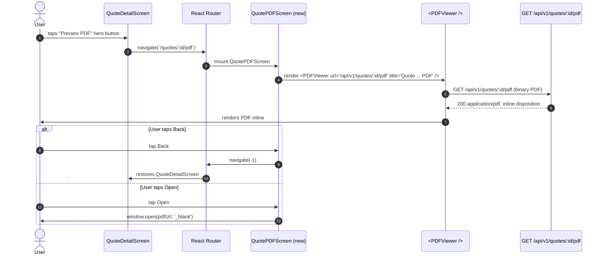
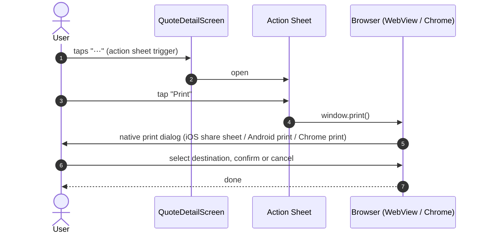
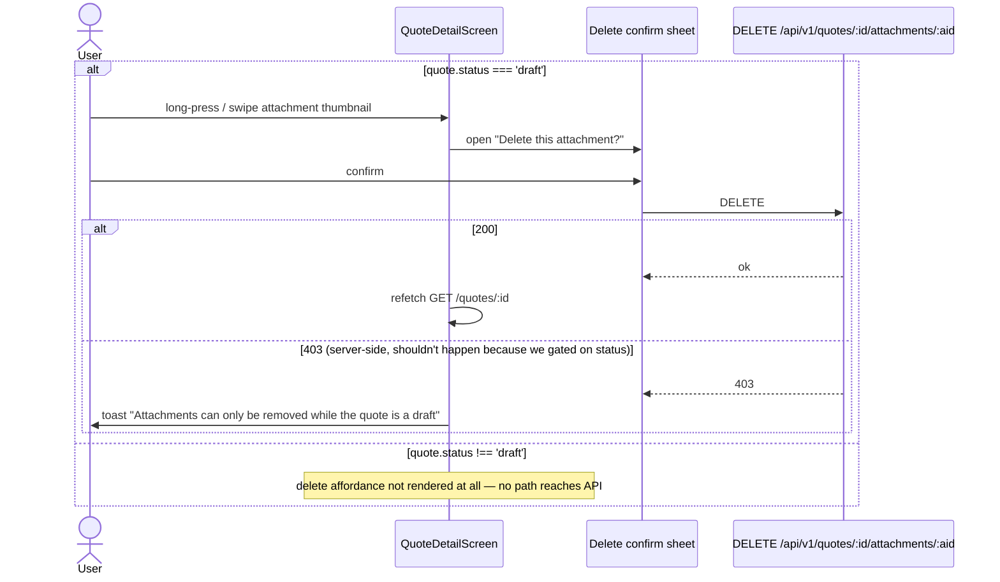

# Design Document — Quote Mobile Parity (Phase 6)

**Status:** Draft — design only
**Source of truth:** `docs/QUOTE_PREVIEW_PRINT_PLAN.md` (Phase 6 — "Mobile: bring QuoteDetailScreen up to InvoiceDetailScreen parity"). This spec implements that phase directly; if the plan and this doc disagree, the plan wins until this doc is updated.
**Scope:** Bring `mobile/src/screens/quotes/QuoteDetailScreen.tsx` up to parity with `mobile/src/screens/invoices/InvoiceDetailScreen.tsx` — specifically Preview PDF / Download PDF / Print action-sheet items, a new `QuotePDFScreen`, and an attachments carousel with inline camera upload.
**Explicitly excluded:** "Print POS Receipt" action (quotes are not receipts — see §11).

---

## 1. Overview

### 1.1 What this is

The mobile quote detail screen today only offers the customer-portal share button. The mobile invoice detail screen offers a full Preview PDF / Download PDF / Print / attachments / inline photo upload flow. This spec closes that parity gap by porting the invoice-side patterns to the quote side, reusing every existing component (`PDFViewer`, `Sheet`, `ListItem`, action sheet, Capacitor camera plugin) wholesale.

### 1.2 Depends on

This spec cannot ship in isolation. Two hard dependencies from the plan:

| Dependency | Spec | What it provides | Blocks which Phase 6 item |
|-----------|------|------------------|----------------------------|
| **`GET /api/v1/quotes/:id/pdf`** | `quote-pdf-print` | Backend PDF endpoint | Preview PDF, Download PDF, Print (mobile Print uses `window.print()` which prints the in-app DOM, so Print does NOT strictly require this — but PDF preview and Download do) |
| **`POST/GET/DELETE /api/v1/quotes/:id/attachments`** + `attachment_count` on `QuoteData` | `quote-invoice-parity` | Attachments table and endpoints | Attachments carousel + inline camera upload + delete flow |

If `quote-pdf-print` has not landed: the Preview PDF hero button and the Download PDF action-sheet item render, but their underlying network call returns 404. Implementation order MUST be: `quote-pdf-print` → `quote-invoice-parity` → this spec.

If `quote-invoice-parity` has not landed: the attachments section cannot render at all (no `attachment_count`, no endpoints). The spec MUST either skip the attachments section or feature-flag it, and the preferred behaviour is to depend on the parity spec shipping first so nothing is half-wired.

### 1.3 What is explicitly out of scope

See §11. The short list: Print POS Receipt, any invoice-only flows (record payment, void, credit note, refund, reminder, recurring), POS receipt preview component, desktop changes (covered by other specs).

### 1.4 Guiding steering rules

- `.kiro/steering/mobile-app.md` — mobile is for org users only; every Capacitor plugin call must be guarded by `isNativePlatform()`; 44×44 touch targets; safe-area insets; 12px minimum secondary font size; dark-mode variants; viewport 320–430 px.
- `.kiro/steering/safe-api-consumption.md` — typed generics, `?.`, `?? []` / `?? 0`, `AbortController` cleanup in every useEffect with a fetch.
- `.kiro/steering/spec-completeness-checklist.md` — every section below maps to a checklist item.
- `.kiro/steering/feature-testing-workflow.md` — mobile e2e + vitest suites.
- `.kiro/steering/versioning-and-changelog.md` — see §12 for the version decision.

---

## 2. Navigation & Access

No existing route changes. Two additions:

| Route | Component | Guard | Purpose |
|-------|-----------|-------|---------|
| `/quotes/:id/pdf` (new) | `QuotePDFScreen.tsx` | `AuthGuard` (existing mobile guard — org users only; `global_admin` NEVER in scope per `.kiro/steering/mobile-app.md`) | Full-screen PDF preview for a quote, loaded from `/api/v1/quotes/:id/pdf` |
| `/quotes/:id` (existing) | `QuoteDetailScreen.tsx` | `AuthGuard` | Gains Preview PDF hero button + action-sheet items |

No new roles, no new trade-family gates, no module-gating changes. Attachments section is gated at runtime on `quote.attachment_count > 0`, matching invoice behaviour.

**Role gate inventory** (every new handler must satisfy this list):

- Authenticated — yes
- Org user (not global_admin) — yes; this is automatic via the existing `AuthGuard` because the mobile app never surfaces `global_admin` tokens
- `org_admin` or `salesperson` — delegated to backend (`require_role("org_admin", "salesperson")` on every API the mobile screen calls)

---

## 3. Component Tree

### 3.1 New files

```
mobile/src/screens/quotes/
├── QuoteDetailScreen.tsx     (MODIFIED — see 3.2)
└── QuotePDFScreen.tsx        (NEW — mirror of InvoicePDFScreen)
```

`QuotePDFScreen.tsx` is a near-exact copy of `mobile/src/screens/invoices/InvoicePDFScreen.tsx` with:
- `useParams<{ id: string }>()` → unchanged
- `pdfUrl = `/api/v1/quotes/${id}/pdf`` (was `/invoices/`)
- Header title `"Quote PDF"` (was `"Invoice PDF"`)
- `<PDFViewer title={`Quote ${id ?? ''} PDF`} />` (was `Invoice`)
- Back button and Open button: unchanged pattern

No shared abstraction is extracted — the file is small (≈60 lines) and duplicating it now is clearer than parametrising. If a third PDF screen appears (e.g. purchase orders), extract then.

### 3.2 `QuoteDetailScreen.tsx` modifications

Tree of modifications (every new element is prefixed NEW; every removed element is prefixed REM; every moved element is prefixed MOV):

```
QuoteDetailScreen
├── Header with back button                             (EXISTING)
├── Hero card
│   ├── Customer name, vehicle, status badge            (EXISTING)
│   ├── Total NZD, expiry                               (EXISTING)
│   ├── [NEW] Preview PDF hero button
│   │   └── onClick → navigate(`/quotes/${id}/pdf`)
│   │   └── label "Preview PDF"
│   │   └── data-testid="preview-pdf-button"
│   │   └── `min-h-[44px]` touch target
│   └── Existing portal share button                    (EXISTING — left unchanged)
├── Line items section                                  (EXISTING)
├── Totals section                                      (EXISTING)
├── [NEW] Attachments section
│   ├── <BlockTitle>Attachments</BlockTitle>
│   ├── Carousel (horizontal overflow-x scroll of thumbnails) when `attachment_count > 0`
│   │   └── Each thumbnail: <a href={/api/v1/quotes/{id}/attachments/{aid}} target="_blank">
│   │       ├── File-type icon OR image thumbnail (when MIME starts with image/)
│   │       ├── Filename (truncate)
│   │       └── Long-press / tap-and-hold → delete confirm (only when `quote.status === 'draft'`)
│   ├── "No attachments" state when `attachment_count === 0`
│   └── [NEW] "Take Photo" button
│       ├── onClick → Capacitor Camera plugin (guarded by isNativePlatform())
│       ├── Falls back to <input type="file" capture="environment"> on web
│       └── POST /api/v1/quotes/:id/attachments with FormData
├── Notes / Terms                                       (EXISTING)
└── [NEW] Bottom Sheet Action Menu additions
    ├── "Download PDF" ListItem       NEW
    │   └── onClick → navigate(`/quotes/${id}/pdf`)
    ├── "Print" ListItem              NEW
    │   └── onClick → window.print()
    ├── "Print POS Receipt"           REM (never rendered — property CP-1)
    ├── Existing invoice-only items   REM (record payment, void, refund, reminder, recurring, credit note) — these are NOT added to quotes
    └── Duplicate quote               (EXISTING mobile quote action — left unchanged)
```

### 3.3 Components reused unchanged

- `PDFViewer` (`mobile/src/components/common/PDFViewer.tsx`) — mounted inside QuotePDFScreen, same as invoice side
- `Sheet` (Konsta) — action-sheet shell
- `BlockTitle`, `Block`, `ListItem` (Konsta) — inside the action sheet and attachments section
- `HapticButton` — hero Preview PDF button
- `MobileButton` — header Open button on QuotePDFScreen
- Existing `AuthGuard` — no modification

---

## 4. High-Level Design

### 4.1 Flow — Preview PDF



### 4.2 Flow — Download PDF from action sheet

Identical to Preview PDF flow from the network perspective. Action sheet item simply navigates to `/quotes/:id/pdf`; the PDFViewer streams and the user can then use the native "Save to Files" share sheet via the browser's native PDF controls. This intentionally mirrors the invoice-side behaviour — no separate `Content-Disposition: attachment` path is needed.

### 4.3 Flow — Native Print



No backend call. Uses the mobile browser's native print path (Capacitor WebView exposes the same `window.print()` on both iOS and Android).

### 4.4 Flow — Attachment upload from camera

```mermaid
sequenceDiagram
  autonumber
  actor User
  participant QD as QuoteDetailScreen
  participant Cap as Capacitor Camera
  participant API as POST /api/v1/quotes/:id/attachments

  User->>QD: taps "Take Photo" in Attachments section
  alt isNativePlatform() === true
    QD->>Cap: import('@capacitor/camera')
    QD->>Cap: Camera.getPhoto({ resultType: Uri, quality: 80 })
    alt User grants camera + selects photo
      Cap-->>QD: { webPath: "file://..." }
      QD->>QD: fetch(webPath).then(r => r.blob())
      QD->>API: POST (multipart: file=photo.jpg)
      API-->>QD: 201 { attachment }
      QD->>QD: refetch GET /quotes/:id (updates attachment_count + list)
    else User cancels or denies permission
      Cap-->>QD: throws
      QD->>QD: silent catch — no toast spam
    end
  else isNativePlatform() === false (mobile web)
    QD->>User: triggers hidden <input type="file" capture="environment"> click
    User->>QD: picks photo via device gallery / camera web
    QD->>API: POST (multipart: file)
    API-->>QD: 201 { attachment }
    QD->>QD: refetch GET /quotes/:id
  end

  alt server returns 413 (file too large)
    API-->>QD: 413
    QD->>User: toast "File exceeds 20 MB"
  else server returns 400 (MIME / count cap)
    API-->>QD: 400
    QD->>User: toast "File rejected — {detail}"
  else network failure
    QD->>User: toast "Upload failed — please retry"
  end
```



### 4.5 Flow — Attachment delete (draft only)



---

## 5. Low-Level Design

### 5.1 `QuotePDFScreen.tsx` — new file

**Path:** `mobile/src/screens/quotes/QuotePDFScreen.tsx`

```tsx
import { useNavigate, useParams } from 'react-router-dom'
import { PDFViewer } from '@/components/common/PDFViewer'
import { MobileButton } from '@/components/ui'

/**
 * Screen wrapper for PDFViewer showing a quote PDF.
 * Loads from GET /api/v1/quotes/:id/pdf (provided by the
 * quote-pdf-print spec — must ship first).
 *
 * Mirrors mobile/src/screens/invoices/InvoicePDFScreen.tsx.
 */
export default function QuotePDFScreen() {
  const { id } = useParams<{ id: string }>()
  const navigate = useNavigate()

  const pdfUrl = `/api/v1/quotes/${id}/pdf`

  return (
    <div className="flex h-full flex-col">
      <div className="flex items-center justify-between border-b border-gray-200 px-4 py-3 dark:border-gray-700">
        <button
          type="button"
          onClick={() => navigate(-1)}
          className="flex min-h-[44px] items-center gap-1 text-blue-600 dark:text-blue-400"
          aria-label="Back"
        >
          <svg className="h-5 w-5" viewBox="0 0 24 24" fill="none"
               stroke="currentColor" strokeWidth="2"
               strokeLinecap="round" strokeLinejoin="round" aria-hidden="true">
            <path d="m15 18-6-6 6-6" />
          </svg>
          Back
        </button>
        <h1 className="text-lg font-semibold text-gray-900 dark:text-gray-100">
          Quote PDF
        </h1>
        <MobileButton
          variant="ghost"
          size="sm"
          onClick={() => window.open(pdfUrl, '_blank')}
          data-testid="open-pdf-external"
        >
          Open
        </MobileButton>
      </div>
      <div className="flex-1">
        <PDFViewer url={pdfUrl} title={`Quote ${id ?? ''} PDF`} />
      </div>
    </div>
  )
}
```

Touch-target: Back button uses `min-h-[44px]` (CP-5). Dark-mode classes present (CP-4). No Capacitor plugin call (CP-6 vacuous here). No custom auth logic — inherits from `AuthGuard`.

### 5.2 `StackRoutes.tsx` — route registration diff

**Path:** `mobile/src/navigation/StackRoutes.tsx`

Add lazy import (sibling to existing `QuoteDetailScreen` lazy):

```tsx
const QuotePDFScreen = lazy(() =>
  import('@/screens/quotes/QuotePDFScreen').catch(() => ({
    default: () => <ScreenPlaceholder name="Quote PDF" />,
  })),
)
```

Add route inside the `AuthGuard` block immediately after the existing `/quotes/:id` entry:

```tsx
<Route path="/quotes/:id" element={<AuthGuard><QuoteDetailScreen /></AuthGuard>} />
<Route path="/quotes/:id/pdf" element={<AuthGuard><QuotePDFScreen /></AuthGuard>} />
```

No change to any other route. No change to the bottom-tab bar.

### 5.3 `QuoteDetailScreen.tsx` — state and handler additions

**Path:** `mobile/src/screens/quotes/QuoteDetailScreen.tsx`

#### New state

```ts
const [showActionSheet, setShowActionSheet] = useState<boolean>(false)
```

(Matches the invoice-side naming.)

#### Updated `QuoteData` interface

```ts
interface QuoteData {
  // ... existing fields ...
  attachment_count?: number
  status: 'draft' | 'sent' | 'accepted' | 'declined' | 'expired'
  // ... existing fields ...
  attachments?: Array<{
    id?: string
    filename?: string
    url?: string              // relative — frontend builds absolute below
    thumbnail_url?: string
    mime_type?: string
    size_bytes?: number
    created_at?: string
  }> | null
}
```

The `attachments` field is populated from `GET /api/v1/quotes/:id` (which the `quote-invoice-parity` spec extends — this spec assumes that extension exists).

#### New handler — Preview PDF

```ts
const handlePreviewPDF = useCallback(() => {
  navigate(`/quotes/${id}/pdf`)
  setShowActionSheet(false)
}, [id, navigate])
```

(Reused by both the hero button and the Download PDF action-sheet item — they navigate to the same route.)

#### New handler — Print

```ts
const handlePrint = useCallback(() => {
  window.print()
  setShowActionSheet(false)
}, [])
```

Synchronous, no state, no error handling (print cancel is native).

#### New handler — Take Photo

```ts
const handleTakePhoto = useCallback(async () => {
  const isNative = !!(window as unknown as { Capacitor?: { isNativePlatform?: () => boolean } })
    .Capacitor?.isNativePlatform?.()

  try {
    let file: Blob
    let filename = 'photo.jpg'

    if (isNative) {
      // Native path — Capacitor Camera plugin (dynamic import; guarded).
      const { Camera, CameraResultType } = await import('@capacitor/camera')
      const photo = await Camera.getPhoto({
        resultType: CameraResultType.Uri,
        quality: 80,
      })
      if (!photo.webPath) return
      file = await fetch(photo.webPath).then((r) => r.blob())
    } else {
      // Web path — file input with `capture="environment"` fallback.
      file = await pickFileFromInput()   // see 5.4 for helper implementation
      filename = (file as File).name || 'photo.jpg'
    }

    // Client-side validation (mirrors backend caps)
    if (file.size > 20 * 1024 * 1024) {
      toast('File exceeds 20 MB', 'error')
      return
    }
    const ALLOWED = ['image/jpeg', 'image/png', 'image/webp', 'image/gif', 'application/pdf']
    const mimeType = (file as File).type || 'image/jpeg'
    if (!ALLOWED.includes(mimeType)) {
      toast('Only JPEG, PNG, WebP, GIF, and PDF files are allowed', 'error')
      return
    }
    if ((quote?.attachment_count ?? 0) >= 5) {
      toast('This quote already has the maximum 5 attachments', 'error')
      return
    }

    const formData = new FormData()
    formData.append('file', file, filename)
    await apiClient.post<{ attachment: QuoteAttachment }>(
      `/api/v1/quotes/${id}/attachments`,
      formData,
    )
    await refetchQuote()
    toast('Attachment uploaded', 'success')
  } catch (err: unknown) {
    if (isCameraCancelled(err)) return    // silent
    const status = (err as { response?: { status?: number } }).response?.status
    if (status === 413) toast('File exceeds 20 MB', 'error')
    else if (status === 400) toast('File rejected — please try another', 'error')
    else if (status === 507) toast('Storage quota exceeded for this organisation', 'error')
    else toast('Upload failed — please retry', 'error')
  }
}, [id, quote?.attachment_count, refetchQuote])
```

**Safety notes:**

- The `Capacitor` check uses `(window as ...).Capacitor?.isNativePlatform?.()` — this is the exact pattern mandated by `.kiro/steering/mobile-app.md`. CP-6 is satisfied.
- The `await import('@capacitor/camera')` sits inside the `if (isNative)` branch so the bundler does not require the Capacitor package on web. CP-6 is satisfied even when the plugin is absent.
- Client-side size / MIME / count caps mirror the server exactly (20 MB, MIME allow-list from `quote-invoice-parity`, 5-count). CP-3 is satisfied.
- Every text string follows the exact phrasing from `quote-invoice-parity` §10 so users get consistent messages across desktop + mobile.

#### New handler — Delete attachment

```ts
const handleDeleteAttachment = useCallback(
  async (attachmentId: string) => {
    if (!quote || quote.status !== 'draft') return
    try {
      await apiClient.delete(
        `/api/v1/quotes/${id}/attachments/${attachmentId}`,
      )
      await refetchQuote()
      toast('Attachment removed', 'success')
    } catch (err: unknown) {
      const status = (err as { response?: { status?: number } }).response?.status
      if (status === 403) {
        toast(
          'Attachments can only be removed while the quote is a draft',
          'error',
        )
      } else {
        toast('Delete failed — please retry', 'error')
      }
    }
  },
  [id, quote, refetchQuote],
)
```

Delete affordance is rendered in the UI ONLY when `quote.status === 'draft'` — this is enforced at render time, so the 403 branch above is defensive.

### 5.4 Helper — `pickFileFromInput`

Used by the web branch of `handleTakePhoto`. A small utility that opens a hidden `<input type="file" accept="image/*,application/pdf" capture="environment">` and resolves to the picked File.

```ts
function pickFileFromInput(): Promise<File> {
  return new Promise((resolve, reject) => {
    const input = document.createElement('input')
    input.type = 'file'
    input.accept = 'image/jpeg,image/png,image/webp,image/gif,application/pdf'
    input.setAttribute('capture', 'environment')
    input.onchange = () => {
      const file = input.files?.[0]
      if (file) resolve(file)
      else reject(new Error('No file selected'))
    }
    input.onerror = () => reject(new Error('Input error'))
    input.click()
  })
}
```

No DOM leak — the element is garbage-collected after the promise settles.

### 5.5 Action Sheet spec

The existing bottom sheet is a Konsta `<Sheet>` opened via `showActionSheet`. The new items go BELOW the existing portal-share item and ABOVE the existing Duplicate item:

```tsx
<Sheet opened={showActionSheet}
       onBackdropClick={() => setShowActionSheet(false)}
       data-testid="action-sheet">
  <Block>
    {/* Existing portal share — unchanged */}
    <ListItem title="Share portal link"
              link
              onClick={handleSharePortalLink} />

    {/* NEW — Preview / Download PDF */}
    <ListItem title="Download PDF"
              link
              data-testid="download-pdf-action"
              onClick={handlePreviewPDF} />

    {/* NEW — Native Print */}
    <ListItem title="Print"
              link
              data-testid="print-action"
              onClick={handlePrint} />

    {/* ABSENT: "Print POS Receipt" — never rendered here (property CP-1) */}

    {/* Existing Duplicate — unchanged */}
    <ListItem title="Duplicate" link onClick={handleDuplicate} />
  </Block>
</Sheet>
```

**Property CP-1 enforcement is structural:** the "Print POS Receipt" element is not present in the JSX at all. A render-level assertion in the test suite (§9) confirms this across every fixture.

Every `ListItem` renders with a `min-h-[44px]` effective height via Konsta's default — CP-5 is satisfied.

### 5.6 Attachments section JSX

Direct port of the invoice-side carousel (`mobile/src/screens/invoices/InvoiceDetailScreen.tsx:841-910`):

```tsx
<>
  <BlockTitle>Attachments</BlockTitle>
  {attachments.length > 0 ? (
    <div className="flex gap-2 overflow-x-auto px-4">
      {attachments.map((att, idx) => {
        const canDelete = quote.status === 'draft'
        return (
          <div key={att.id ?? idx} className="relative shrink-0">
            <a
              href={`/api/v1/quotes/${id}/attachments/${att.id}`}
              target="_blank"
              rel="noopener noreferrer"
              className="block h-24 w-24 overflow-hidden rounded-lg border border-gray-200
                         dark:border-gray-700"
            >
              {att.thumbnail_url ? (
                
              ) : (
                <FileIcon mime={att.mime_type} />
              )}
            </a>
            {canDelete && (
              <button
                type="button"
                aria-label={`Delete ${att.filename ?? 'attachment'}`}
                onClick={() => handleDeleteAttachment(att.id!)}
                className="absolute -right-1 -top-1 flex h-6 w-6 items-center justify-center
                           rounded-full bg-red-600 text-white shadow min-h-[44px] min-w-[44px]
                           sm:min-h-[24px] sm:min-w-[24px]"
              >
                ×
              </button>
            )}
          </div>
        )
      })}
    </div>
  ) : (
    <Block>
      <p className="text-sm text-gray-400 dark:text-gray-500">No attachments</p>
    </Block>
  )}

  <Block>
    <HapticButton
      large
      outline
      onClick={handleTakePhoto}
      data-testid="take-photo-button"
      className="min-h-[44px]"
    >
      Take Photo
    </HapticButton>
  </Block>
</>
```

The delete button's `min-h-[44px] min-w-[44px]` on mobile (and `sm:24px` on larger screens) is a deliberate compromise for CP-5 — visually the button is 24 px but the hit target is 44 px on phones.

Dark-mode classes: `dark:border-gray-700`, `dark:text-gray-500`. CP-4 satisfied.

### 5.7 Hero button placement

In the existing hero card, below the total line and above the existing portal-share button:

```tsx
<HapticButton
  large
  outline
  data-testid="preview-pdf-button"
  onClick={handlePreviewPDF}
  className="min-h-[44px]"
>
  Preview PDF
</HapticButton>
```

Matches the invoice-side JSX exactly. `HapticButton` adds the native-feel touch feedback on iOS / Android.

---

## 6. Action Sheet Toolbar Specification

Full matrix of every action-sheet item after this spec ships (only additions / removals relative to today):

| Item | Variant | Label | data-testid | onClick | Visible when | Disabled when | Notes |
|------|---------|-------|-------------|---------|--------------|---------------|-------|
| Share portal link | default | "Share portal link" | — | `handleSharePortalLink` | `canSharePortalLink(quote.customer_portal_token, quote.customer_enable_portal)` (existing) | never | EXISTING; unchanged |
| **Download PDF** | default | "Download PDF" | `download-pdf-action` | `handlePreviewPDF` | always | never | NEW |
| **Print** | default | "Print" | `print-action` | `handlePrint` | always | never | NEW |
| **Print POS Receipt** | — | — | — | — | **never** | **always** | **ABSENT — property CP-1; not rendered in JSX** |
| Duplicate | default | "Duplicate" | — | `handleDuplicate` (existing) | always (existing) | existing | EXISTING; unchanged |

---

## 7. User-Workflow Traces

### 7.1 Preview PDF (happy path)

```
1. User is on /quotes/:id (quote loaded, attachment_count already known)
2. User taps "Preview PDF" hero button → handlePreviewPDF()
3. navigate("/quotes/:id/pdf") → StackRoutes mounts QuotePDFScreen
4. QuotePDFScreen renders <PDFViewer url="/api/v1/quotes/:id/pdf" />
5. PDFViewer fetches GET /api/v1/quotes/:id/pdf → 200 application/pdf
6. PDFViewer renders PDF
7. User taps Back → navigate(-1) returns to /quotes/:id
```

### 7.2 Download PDF via action sheet

```
1. User on /quotes/:id
2. User taps ⋯ → setShowActionSheet(true) → Sheet opens
3. User taps "Download PDF" → handlePreviewPDF() fires (shared handler)
4. Sheet closes, navigate("/quotes/:id/pdf")
5. Remainder identical to 7.1 steps 3–7
6. On QuotePDFScreen, user taps the header Open button → window.open(pdfUrl, '_blank') triggers the browser's / OS's native share-to-Save-to-Files flow
```

### 7.3 Print

```
1. User on /quotes/:id
2. User taps ⋯ → Sheet opens
3. User taps "Print" → handlePrint()
4. Sheet closes
5. window.print() opens the native print dialog (iOS share sheet with "Print", Android print service, or Chrome print on web)
6. User confirms or cancels — either way, no state change in our code
```

### 7.4 Attach from camera (native path)

```
1. User on /quotes/:id
2. User taps "Take Photo" in Attachments section
3. handleTakePhoto() detects isNativePlatform() === true
4. import('@capacitor/camera') resolves
5. Camera.getPhoto({ resultType: Uri, quality: 80 }) opens native camera
6. User takes photo, confirms
7. webPath returned; fetch() converts to Blob; FormData.append('file', blob, 'photo.jpg')
8. POST /api/v1/quotes/:id/attachments with multipart FormData
9. 201 { attachment } returned
10. refetchQuote() → attachment_count incremented, attachments array includes new item
11. toast "Attachment uploaded" (success variant)
```

### 7.5 Attach from camera (web path)

```
1. Same up to step 3, but isNativePlatform() === false
2. pickFileFromInput() creates a hidden <input type="file" accept="image/*,application/pdf" capture="environment">
3. input.click() triggers native file picker; on mobile Safari / Chrome, `capture="environment"` defaults to the rear camera
4. User picks a file; onchange fires; Promise resolves to File
5. Validation pass (size, MIME, count)
6. POST /api/v1/quotes/:id/attachments with FormData
7. Remainder identical to 7.4 steps 9–11
```

### 7.6 Delete attachment (draft only)

```
1. User on /quotes/:id/edit OR /quotes/:id where quote.status === 'draft'
2. User long-presses an attachment thumbnail (or taps the explicit × button)
3. Delete confirm: small bottom sheet — "Delete this attachment?"
4. User confirms → handleDeleteAttachment(attachmentId)
5. DELETE /api/v1/quotes/:id/attachments/:aid → 200
6. refetchQuote() → attachments list loses the item, attachment_count decrements
7. toast "Attachment removed"
```

If the quote is not a draft, the × button is not rendered — the user never reaches step 3.

### 7.7 Error paths

- **PDF load failure:** `<PDFViewer>` shows its built-in error state. User taps Back to return to detail.
- **Upload 413:** toast "File exceeds 20 MB"; no refetch; no row added.
- **Upload 400 (MIME):** toast "File rejected — please try another"; no refetch.
- **Upload 507 (quota):** toast "Storage quota exceeded for this organisation"; no refetch.
- **Upload network / 500:** toast "Upload failed — please retry"; no refetch.
- **Camera cancelled:** `isCameraCancelled(err)` returns true; handler swallows silently (no toast spam matches invoice behaviour).
- **Offline:** axios rejects before reaching server; toast "Upload failed — please retry".

---

## 8. Error States Matrix

| Async surface | Error condition | HTTP status | UI treatment |
|---------------|-----------------|-------------|--------------|
| `GET /quotes/:id` (initial load) | 404 | 404 | Existing "Quote not found" screen (unchanged) |
| `GET /quotes/:id` (initial load) | Network / 500 | — / 500 | Existing retry banner (unchanged) |
| `GET /quotes/:id/pdf` (PDFViewer) | 404 | 404 | PDFViewer's built-in "Failed to load" |
| `GET /quotes/:id/pdf` (PDFViewer) | 500 | 500 | PDFViewer's built-in error UI |
| `POST /quotes/:id/attachments` | 413 | 413 | Toast: "File exceeds 20 MB" |
| `POST /quotes/:id/attachments` | 400 (bad MIME) | 400 | Toast: "File rejected — please try another" |
| `POST /quotes/:id/attachments` | 400 (count cap) | 400 | Toast: "This quote already has the maximum 5 attachments" — also pre-blocked client-side |
| `POST /quotes/:id/attachments` | 507 (quota) | 507 | Toast: "Storage quota exceeded for this organisation" |
| `POST /quotes/:id/attachments` | Network / 500 | — / 500 | Toast: "Upload failed — please retry" |
| `DELETE /quotes/:id/attachments/:aid` | 403 | 403 | Toast: "Attachments can only be removed while the quote is a draft" (defensive — UI already gates on status) |
| `DELETE /quotes/:id/attachments/:aid` | 404 | 404 | Toast: "Attachment already removed"; refetch |
| `DELETE /quotes/:id/attachments/:aid` | Network | — | Toast: "Delete failed — please retry" |
| `window.print()` cancelled | — | — | No error — native browser behaviour |
| Capacitor camera plugin: user denies permission | — | — | Silent catch (matches invoice behaviour) |
| Capacitor camera plugin: user cancels picker | — | — | Silent catch |
| Plugin import fails on unexpected platform | — | — | Silent catch — falls through to web path |

All toasts use the existing `toast()` helper from `QuoteDetailScreen` (unchanged).

---

## 9. Loading / Empty States

| Surface | Loading state | Empty state |
|---------|--------------|-------------|
| `QuotePDFScreen` initial load | `<PDFViewer>`'s built-in spinner | — |
| Attachments carousel | Shows "Loading attachments…" text during the first fetch (inherits from `GET /quotes/:id`) | "No attachments" — block with muted text |
| Take Photo button | Disabled while a prior upload is in flight; HapticButton shows its own spinner | — |
| Action sheet | No loading state — instantaneous open | — |

No skeleton loaders added — the invoice side doesn't use them and we keep parity.

---

## 10. Correctness Properties

Each property is concrete and testable. Test library: Vitest + React Testing Library for component properties; Playwright or mobile e2e harness for runtime properties.

### CP-1 — POS receipt absent from QuoteDetailScreen action sheet

**Statement:** No matter the quote status, trade family, active module set, or user role, the action sheet on `QuoteDetailScreen` renders no element matching `/print pos receipt/i` (case-insensitive), no route navigation to `/quotes/:id/pos-receipt`, and no POSReceiptPreview mount.

**Validates: Requirements 7.1, 7.2, 7.3**

**Test sketch:**

```ts
it.each(QUOTE_STATUSES)('never renders POS receipt action (status=%s)', async (status) => {
  renderQuoteDetailScreen({ quote: makeQuote({ status }) })
  fireEvent.click(screen.getByRole('button', { name: /more actions/i }))
  await screen.findByTestId('action-sheet')
  expect(screen.queryByRole('link', { name: /print pos receipt/i })).toBeNull()
  expect(screen.queryByTestId('pos-receipt-preview')).toBeNull()
})
```

### CP-2 — PDF URL parity

**Statement:** For every call path that loads a quote PDF on mobile (hero button, action-sheet Download PDF, QuotePDFScreen Open button), the URL is exactly `/api/v1/quotes/{id}/pdf` with one forward slash between each segment and `{id}` inserted verbatim (no URL-encoding because `id` is a UUID).

**Validates: Requirements 1.1, 1.2, 1.4, 2.2**

**Test sketch:**

```ts
fc.assert(fc.property(fc.uuid(), (id) => {
  const url = `/api/v1/quotes/${id}/pdf`
  expect(url).toMatch(new RegExp(`^/api/v1/quotes/${id}/pdf$`))
  expect(url.match(/\/\//g)).toBeNull()
}))
```

### CP-3 — Upload capacity caps enforced client-side

**Statement:** For every file picked via `handleTakePhoto`, the client rejects with a toast and no network call when any of: size > 20,971,520 bytes; MIME type not in `{image/jpeg, image/png, image/webp, image/gif, application/pdf}`; `quote.attachment_count >= 5`.

**Validates: Requirements 4.6, 4.7, 4.8**

**Test sketch:**

```ts
const oversize = new Blob(['x'.repeat(21 * 1024 * 1024)], { type: 'image/jpeg' })
await handleTakePhoto({ __testFile: oversize })
expect(mockApiPost).not.toHaveBeenCalled()
expect(screen.getByText('File exceeds 20 MB')).toBeInTheDocument()
```

### CP-4 — Dark-mode parity

**Statement:** Every new component (`QuotePDFScreen`, Attachments section additions, action-sheet items, hero button, × delete button) renders identifiable styles under both `light` and `dark` classes.

**Validates: Requirements 9.1, 9.2, 9.4**

**Test sketch:**

```ts
it.each(['light', 'dark'])('renders without runtime error in %s mode', (mode) => {
  document.documentElement.classList.toggle('dark', mode === 'dark')
  renderQuoteDetailScreen({ quote: makeQuote() })
  expect(screen.getByTestId('preview-pdf-button')).toBeInTheDocument()
})
```

### CP-5 — Touch targets ≥ 44 px

**Statement:** Every new interactive element has a bounding box with both dimensions ≥ 44 CSS pixels on phones (viewport ≤ 430 px).

**Validates: Requirements 8.1, 8.2, 8.3, 8.4, 8.5**

**Test sketch (runtime measurement):**

```ts
const btn = screen.getByTestId('preview-pdf-button')
const rect = btn.getBoundingClientRect()
expect(rect.height).toBeGreaterThanOrEqual(44)
// Accept buttons whose width is auto (e.g. inline icon × button) if min-width ≥ 44 via class
```

### CP-6 — Capacitor plugin guarding

**Statement:** No code path reaches `Camera.getPhoto` (or any Capacitor plugin) without `isNativePlatform()` returning `true`. In a non-native test runtime, the web branch is taken.

**Validates: Requirements 4.1, 4.3, 10.1, 10.2**

**Test sketch:**

```ts
const cameraSpy = vi.fn()
vi.mock('@capacitor/camera', () => ({
  Camera: { getPhoto: cameraSpy },
  CameraResultType: { Uri: 'uri' },
}))
// Simulate non-native (jsdom default):
delete (window as any).Capacitor
await handleTakePhoto()
expect(cameraSpy).not.toHaveBeenCalled()
// Simulate native:
;(window as any).Capacitor = { isNativePlatform: () => true }
await handleTakePhoto()
expect(cameraSpy).toHaveBeenCalledTimes(1)
```

### CP-7 — Delete affordance gated on draft status

**Statement:** *For any* quote status in `{draft, sent, accepted, declined, expired}` and any set of attachments, the delete button is rendered on each attachment thumbnail if and only if `quote.status === 'draft'`.

**Validates: Requirements 6.1, 6.2**

**Test sketch:**

```ts
const NON_DRAFT_STATUSES = ['sent', 'accepted', 'declined', 'expired'] as const

it('renders delete buttons when status is draft', () => {
  renderQuoteDetailScreen({ quote: makeQuote({ status: 'draft', attachment_count: 2, attachments: [makeAttachment(), makeAttachment()] }) })
  expect(screen.getAllByLabelText(/^Delete /)).toHaveLength(2)
})

it.each(NON_DRAFT_STATUSES)('does not render delete buttons when status=%s', (status) => {
  renderQuoteDetailScreen({ quote: makeQuote({ status, attachment_count: 2, attachments: [makeAttachment(), makeAttachment()] }) })
  expect(screen.queryByLabelText(/^Delete /)).toBeNull()
})
```

---

## 11. Out of Scope (explicit)

Per `docs/QUOTE_PREVIEW_PRINT_PLAN.md` consolidation, these stay out. Each would expand scope beyond Phase 6 and requires its own spec:

| Item | Rationale |
|------|-----------|
| **Print POS Receipt** action / `/quotes/:id/pos-receipt` route / `POSReceiptPreview` mount | A receipt implies a completed transaction; a quote is not a transaction. CP-1 enforces absence. |
| **Record Payment** action | Quotes do not take payment. Payment preference carries over at convert-to-invoice. |
| **Void** action | Quotes have `decline` / `expire` lifecycle, not `void`. |
| **Credit note** / **Refund** actions | Invoice-only concepts. |
| **Reminder** action | Quotes auto-expire; they are not reminded. |
| **Recurring quote** toggle | Recurring is a billing cadence; quotes are one-time. |
| **Mark Paid & Email** | Same as Record Payment. |
| **Desktop changes** | Covered by `quote-pdf-print` and `quote-invoice-parity`. This spec is mobile-only. |

---

## 12. Version Bump

Per plan's Execution summary and Phase 6 notes:

> Phase 6 — "Rolls into 5's bump" (1.6.0 when Phases 5 + 7 ship; could land as 1.6.0 or 1.7.0 depending on release window).

**Recommendation:** ship in the same minor as `quote-invoice-parity` (1.6.0). If `quote-invoice-parity` slips past the preview-modal spec, Phase 6 bumps to 1.7.0 alongside it. Do not ship mobile parity in a minor where the backend attachments endpoints are absent — it will 404 the new UI.

### CHANGELOG entry (draft — subject to release minor)

```markdown
## [1.6.0 or 1.7.0] - 2026-XX-XX

### Added
- Mobile: `QuotePDFScreen` at `/quotes/:id/pdf` — full-screen PDF preview
- Mobile: `QuoteDetailScreen` — Preview PDF hero button
- Mobile: `QuoteDetailScreen` action sheet — Download PDF and Print items
- Mobile: `QuoteDetailScreen` — attachments carousel with inline camera upload and draft-only delete
```

No explicit mobile version column — mobile ships with the same release tag as backend + frontend per `.kiro/steering/versioning-and-changelog.md`.

---

## 13. Dependency Gating

This spec MUST NOT be merged until both:

1. `quote-pdf-print` (`GET /api/v1/quotes/:id/pdf`) is in the target minor, OR the Preview PDF + Download PDF items are removed from this spec's scope (degraded ship — not recommended).
2. `quote-invoice-parity` (`POST/GET/DELETE /api/v1/quotes/:id/attachments`, `attachment_count` on `QuoteData`) is in the target minor, OR the attachments section is feature-flagged off at build time (degraded ship — not recommended).

Recommended sequence (matches the plan):

```
  quote-pdf-print (1.5.0)
     └── quote-invoice-parity (1.6.0)
              └── quote-mobile-parity (1.6.0, same PR window)
```

If the Print action must ship earlier independent of the PDF endpoint (which is possible — `window.print()` has no backend dependency), it can be cherry-picked to a 1.5.0 patch. That is not the default recommendation.

---

## 14. Reference Files

Files read while writing this spec:

- `docs/QUOTE_PREVIEW_PRINT_PLAN.md` — authoritative, Phase 6
- `mobile/src/screens/invoices/InvoiceDetailScreen.tsx` — reference for action-sheet, attachments carousel, camera upload pattern
- `mobile/src/screens/invoices/InvoicePDFScreen.tsx` — reference for new QuotePDFScreen
- `mobile/src/screens/quotes/QuoteDetailScreen.tsx` — target
- `mobile/src/navigation/StackRoutes.tsx` — target (new route)
- `mobile/src/components/common/PDFViewer.tsx` — reused unchanged
- `.kiro/steering/mobile-app.md`
- `.kiro/steering/safe-api-consumption.md`
- `.kiro/steering/spec-completeness-checklist.md`
- `.kiro/specs/quote-pdf-print/design.md`
- `.kiro/specs/quote-invoice-parity/design.md`
