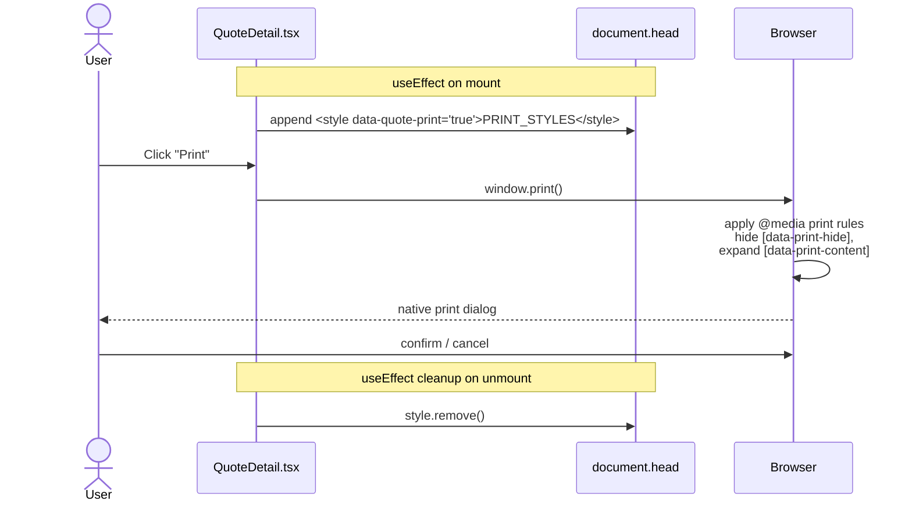
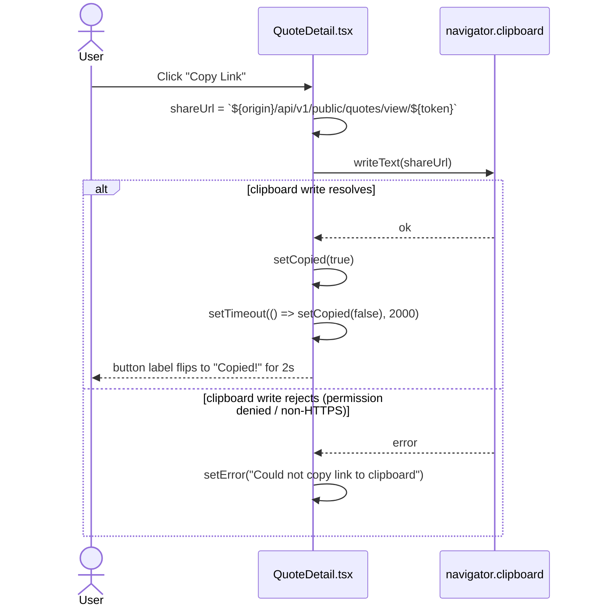

# Design Document: quote-pdf-print

**Version target:** `1.5.0` (backend + frontend + mobile)
**Scope:** Phases 1, 2, 3 of `docs/QUOTE_PREVIEW_PRINT_PLAN.md`
**Authoritative source:** `docs/QUOTE_PREVIEW_PRINT_PLAN.md` (Phases 1–3 sections)

---

## Overview

Three closely related gaps on `QuoteDetail.tsx` are closed in one PR:

1. **Backend** — add `GET /api/v1/quotes/{quote_id}/pdf` that streams the WeasyPrint-rendered branded PDF, mirroring the existing invoice PDF endpoint at `app/modules/invoices/router.py:1463`. The underlying service function `generate_quote_pdf()` already exists at `app/modules/quotes/service.py:673` — the endpoint is a thin exposure of it.
2. **Frontend (Download + Print)** — add Download PDF and browser Print buttons to the `QuoteDetail` action bar, mirroring the pattern established on `InvoiceDetail.tsx`. Inject a print-only `<style>` block on mount, apply `data-print-*` markers to the quote DOM, and call `window.print()` on demand.
3. **Frontend (Copy Link)** — surface the existing `acceptance_token` by adding a Copy Link button that copies the public share URL `${window.location.origin}/api/v1/public/quotes/view/${token}` to the clipboard.

Print (in-app DOM) and Download PDF (WeasyPrint template) are **not interchangeable** — Print uses the React-rendered quote card, Download PDF uses the branded `quote_share.html` Jinja template. This is documented below in the user-workflow trace because staff need to know when to use which.

---

## Navigation & Access

No new routes. No new lazy imports. No new menu entries.

| Item | Value |
|------|-------|
| Page | `QuoteDetail` (`frontend/src/pages/quotes/QuoteDetail.tsx`) |
| Route | `/quotes/:id` (already registered in `App.tsx`) |
| Parent layout | `OrgLayout` |
| Route guard | `RequireAuth` (already present) |
| Backend endpoint | `GET /api/v1/quotes/{quote_id}/pdf` (new) |
| Backend guard | `require_role("org_admin", "salesperson")` |
| Public mount (Copy Link target) | `/api/v1/public/quotes/view/{token}` (existing, verified at `app/main.py:592`) |

---

## Component Tree

No new components. No new modals. No new drawers.

```
QuoteDetail  (frontend/src/pages/quotes/QuoteDetail.tsx)
├── Header row
│   ├── Back arrow                         [data-print-hide]
│   ├── Quote number + subject
│   └── Status badge
├── Action bar                             [data-print-hide]
│   ├── Print            (new, always visible)
│   ├── Download PDF     (new, always visible, shows spinner while fetching)
│   ├── Copy Link        (new, visible only when acceptance_token !== null)
│   ├── Edit             (existing, visible on draft only)
│   ├── Send to Customer (existing, visible on draft only)
│   ├── Requote          (existing, visible on sent only)
│   ├── Convert to Invoice (existing, visible on sent/accepted without invoice)
│   └── Delete           (existing, visible on draft/declined/expired)
├── Error / success banners                [data-print-hide]
├── Converted-invoice notice               [data-print-hide]
└── Quote card            [data-print-content]
    ├── Quote info grid
    ├── Line items table
    ├── Totals panel
    └── Notes & terms
```

**State additions on `QuoteDetail`:**

```typescript
const [downloading, setDownloading] = useState<boolean>(false)
const [copied, setCopied] = useState<boolean>(false)
```

No context, URL params, or shared state changes. Everything is local to `QuoteDetail`.

---

## High-Level Design

### System diagram — Download PDF flow

```mermaid
sequenceDiagram
    actor User
    participant Q as QuoteDetail.tsx
    participant API as apiClient (axios)
    participant R as app/modules/quotes/router.py<br/>GET /{quote_id}/pdf
    participant S as generate_quote_pdf()<br/>service.py:673
    participant J as Jinja2<br/>quote_share.html
    participant W as WeasyPrint

    User->>Q: Click "Download PDF"
    Q->>Q: setDownloading(true)
    Q->>API: GET /quotes/{id}/pdf (responseType: "blob")
    API->>R: GET /api/v1/quotes/{id}/pdf
    R->>R: _extract_org_context(request)
    R->>S: generate_quote_pdf(db, org_id, quote_id)
    S->>S: fetch quote (scoped by org_id)
    S->>J: render quote_share.html
    J-->>S: HTML string
    S->>W: HTML(string=html).write_pdf()
    W-->>S: bytes (PDF)
    S-->>R: bytes
    R-->>API: Response(content=pdf, media_type="application/pdf",<br/>Content-Disposition: inline; filename="QUO-0001.pdf")
    API-->>Q: res.data: Blob
    Q->>Q: URL.createObjectURL + <a download> click
    Q->>Q: setDownloading(false)
```

### System diagram — Browser Print flow (no backend)



### System diagram — Copy Link flow (no backend, no network)



### Architecture summary

- `QuoteDetail` is the only React component that changes. No new components are introduced.
- `app/modules/quotes/router.py` gains one endpoint. No new service function. No Alembic migration. No new schemas. No audit entry on download (mirrors invoice behaviour).
- `acceptance_token` is already returned by `GET /api/v1/quotes/{id}` and typed on the existing `QuoteData` interface at `QuoteDetail.tsx:48`. No backend or type changes required for Copy Link.

---

## Low-Level Design

### Backend — new endpoint

**File:** `app/modules/quotes/router.py`
**Signature:**

```python
@router.get(
    "/{quote_id}/pdf",
    responses={
        200: {"content": {"application/pdf": {}}, "description": "Quote PDF"},
        401: {"description": "Authentication required"},
        403: {"description": "Org role required"},
        404: {"description": "Quote not found"},
    },
    summary="Generate and stream quote PDF on-the-fly",
    dependencies=[require_role("org_admin", "salesperson")],
)
async def get_quote_pdf_endpoint(
    quote_id: uuid.UUID,
    request: Request,
    db: AsyncSession = Depends(get_db_session),
) -> Response:
    ...
```

**Algorithm (preconditions → postconditions):**

```pascal
PROCEDURE get_quote_pdf_endpoint(quote_id, request, db)
  INPUT:
    quote_id  — UUID from URL path
    request   — FastAPI Request (auth middleware has populated request.state)
    db        — AsyncSession

  PRECONDITIONS:
    - Auth middleware has run (401 if no token)
    - require_role(org_admin | salesperson) has passed (403 otherwise)
    - generate_quote_pdf() is scoped by org_id (verified at service.py:335,
      every Quote load uses Quote.id == quote_id AND Quote.org_id == org_id)

  OUTPUT:
    - 200 Response with PDF bytes, media_type="application/pdf",
      Content-Disposition: inline; filename="{quote_number or 'DRAFT'}.pdf"
    - 403 if org context missing
    - 404 if quote not found in this org

  BEGIN
    (org_uuid, _, _) ← _extract_org_context(request)
    IF org_uuid IS NULL THEN
      RETURN JSONResponse(403, {"detail": "Organisation context required"})
    END IF

    TRY
      pdf_bytes ← await generate_quote_pdf(db, org_id=org_uuid, quote_id=quote_id)
    CATCH ValueError AS exc
      RETURN JSONResponse(404, {"detail": str(exc)})
    END TRY

    quote_dict ← await get_quote(db, org_id=org_uuid, quote_id=quote_id)
    filename   ← f"{quote_dict.quote_number or 'DRAFT'}.pdf"

    RETURN Response(
      content=pdf_bytes,
      media_type="application/pdf",
      headers={"Content-Disposition": f'inline; filename="{filename}"'},
    )

  POSTCONDITIONS:
    - Response body starts with bytes "%PDF-"
    - Content-Disposition is "inline" (NOT "attachment") — matches invoice endpoint
    - filename always contains quote_number or literal "DRAFT"
    - No DB writes occur
    - No audit log row is written (matches invoice endpoint)
    - Cross-org requests return 404 (isolation via service layer, not endpoint)
  END PROCEDURE
```

**Imports required (added to the router's existing import block):**

```python
from fastapi.responses import Response          # already imported for other endpoints
from app.modules.quotes.service import generate_quote_pdf  # add to existing import list
```

`get_quote`, `_extract_org_context`, `Depends`, `get_db_session`, `require_role`, `uuid`, `Request`, and `JSONResponse` are all already imported in this file.

**Response parity with invoice endpoint:**

| Property | Invoice endpoint | Quote endpoint |
|----------|------------------|----------------|
| Path | `GET /invoices/{invoice_id}/pdf` | `GET /quotes/{quote_id}/pdf` |
| Auth | `require_role("org_admin", "salesperson")` | identical |
| Org isolation | service-layer (`org_id` filter on query) | identical |
| `Content-Disposition` | `inline; filename="..."` | identical |
| Filename fallback | `"DRAFT"` when number is null | identical |
| Audit log | none | none |
| Rate limiting | inherits global per-org cap | inherits global per-org cap |
| Migration | n/a | n/a |

---

### Frontend — `QuoteDetail.tsx` changes

#### State additions

```typescript
const [downloading, setDownloading] = useState<boolean>(false)
const [copied, setCopied] = useState<boolean>(false)
```

These sit alongside the existing `loading`, `actionLoading`, `error`, `successMsg`, `deleteConfirm` state. No existing state is renamed or removed.

#### Handler: `handleDownloadPDF`

```typescript
const handleDownloadPDF = async (): Promise<void> => {
  if (!quote) return
  setDownloading(true)
  setError(null)
  try {
    const res = await apiClient.get(`/quotes/${quote.id}/pdf`, { responseType: 'blob' })
    const url = URL.createObjectURL(res.data as Blob)
    const a = document.createElement('a')
    a.href = url
    a.download = `${quote.quote_number || 'DRAFT'}.pdf`
    a.click()
    URL.revokeObjectURL(url)
  } catch (err: unknown) {
    const detail = (err as { response?: { data?: { detail?: string } } })?.response?.data?.detail
    setError(detail ?? 'Failed to download PDF. Please try again.')
  } finally {
    setDownloading(false)
  }
}
```

**Preconditions:**
- `quote` is non-null (handled by the early return — the button is rendered inside the guarded block).
- `apiClient` baseURL is `/api/v1` (from `frontend/src/api/client.ts:33`), so the resolved URL is `/api/v1/quotes/{id}/pdf`.

**Postconditions:**
- On success: a browser download dialog opens with filename `<quote_number>.pdf` or `DRAFT.pdf`.
- On API error (network, 401, 403, 404, 500): `setError` renders the existing red banner — no new UI needed.
- `downloading` always ends `false` (finally block).
- The object URL is always revoked.

#### Handler: `handlePrint`

```typescript
const handlePrint = (): void => {
  window.print()
}
```

Synchronous, no state, no error handling (print cancel is a native browser behaviour — nothing reaches our code).

#### Handler: `handleCopyLink`

```typescript
const handleCopyLink = async (): Promise<void> => {
  if (!quote?.acceptance_token) return
  const shareUrl = `${window.location.origin}/api/v1/public/quotes/view/${quote.acceptance_token}`
  try {
    await navigator.clipboard.writeText(shareUrl)
    setCopied(true)
    setTimeout(() => setCopied(false), 2000)
  } catch {
    setError('Could not copy link to clipboard. Please copy manually.')
  }
}
```

**Preconditions:**
- `quote.acceptance_token` is non-null. The button is not rendered when the token is null, so in practice this guard is defensive.
- `window.location.origin` is defined in all browser contexts.

**Postconditions:**
- Clipboard contains exactly `${origin}/api/v1/public/quotes/view/${token}` on success — no trailing slash, no encoding mangling (token is a UUID / opaque token string).
- Button label flips to `"Copied!"` for exactly 2000 ms then reverts.
- `setTimeout` lifecycle: if the component unmounts during the 2s window, the `setCopied` call on the unmounted component is harmless (React 18 swallows it as a no-op warning only; no state leak).
- On clipboard rejection (permission denied, insecure context, sandbox): the existing error banner is reused.

#### Print-styles injection

The `<style data-quote-print="true">` tag is injected in a dedicated `useEffect` that runs on mount and removes the tag on unmount. The cleanup runs **synchronously** on unmount regardless of any outstanding `downloading === true` state, because the effect cleanup is tied to component lifecycle, not to any handler promise.

```typescript
useEffect(() => {
  const style = document.createElement('style')
  style.setAttribute('data-quote-print', 'true')
  style.textContent = PRINT_STYLES
  document.head.appendChild(style)
  return () => {
    style.remove()
  }
}, [])
```

The empty dependency array guarantees the effect runs exactly once per mount and the cleanup runs exactly once per unmount.

#### Print CSS — `PRINT_STYLES`

Modelled directly on `InvoiceDetail.tsx` lines 191–310. Full text:

```css
@media print {
  /* Hide navigation, sidebar, action bar, and interactive controls */
  nav, aside, header, footer,
  [data-print-hide],
  .no-print {
    display: none !important;
  }

  /* Reset page layout */
  html, body {
    margin: 0 !important;
    padding: 0 !important;
    background: white !important;
    -webkit-print-color-adjust: exact !important;
    print-color-adjust: exact !important;
    overflow: visible !important;
    height: auto !important;
  }

  /* Break out of app shell layout */
  .flex.h-screen,
  .flex.h-screen.overflow-hidden,
  .flex-1.flex-col.overflow-hidden,
  main.flex-1.overflow-y-auto {
    display: block !important;
    height: auto !important;
    overflow: visible !important;
    margin: 0 !important;
    padding: 0 !important;
    width: 100% !important;
  }

  /* Print the quote card edge-to-edge */
  [data-print-content] {
    max-width: 100% !important;
    margin: 0 !important;
    padding: 20px !important;
    box-shadow: none !important;
    border: none !important;
    overflow: visible !important;
    height: auto !important;
  }

  /* Keep tables intact across pages */
  table { page-break-inside: avoid; }
  tr    { page-break-inside: avoid; }

  /* Status badge backgrounds must print */
  .badge-print {
    -webkit-print-color-adjust: exact !important;
    print-color-adjust: exact !important;
  }

  @page {
    margin: 10mm;
    size: A4;
  }
}
```

#### `data-print-*` selector list

Every target with its JSX location in the existing `QuoteDetail.tsx`:

| Attribute | Where applied | Effect |
|-----------|---------------|--------|
| `data-print-hide` | Back arrow `<button>` (current line 192) | hidden in print |
| `data-print-hide` | Action-bar container `<div className="flex items-center gap-2">` (current line 197) | hides Print / Download / Copy / Edit / Send / Requote / Convert / Delete during print |
| `data-print-hide` | Error banner `<div role="alert">` | hides transient error during print |
| `data-print-hide` | Success banner `<div role="status">` | hides transient success during print |
| `data-print-hide` | Converted-invoice notice banner | hides nav link during print |
| `data-print-content` | The white quote card `<div className="bg-white rounded-lg border border-gray-200 shadow-sm">` (current line ~258) | expanded edge-to-edge during print |

Any existing `<aside>`, `<nav>`, `<header>`, `<footer>` elements from the parent `OrgLayout` are already hidden via the element selectors in `PRINT_STYLES` — no markers needed on the layout.

---

### Toolbar / Action-Bar Specification

The action bar sits in the page header (`<div className="flex items-center gap-2">`), right-aligned. Existing buttons keep their current order and visibility; new buttons are inserted **to the left** of the existing actions so the primary `Send to Customer` / `Convert to Invoice` buttons remain the rightmost element on each respective status:

```
[← Back]  QUO-0001  [DRAFT]        [Print] [Download PDF] [Copy Link] [Edit] [Send to Customer]
```

Full button matrix:

| Button | Variant | Label (idle) | Label (busy) | Visible when | Disabled when |
|--------|---------|--------------|--------------|--------------|---------------|
| Print | `secondary` | `Print` | n/a | always | never |
| Download PDF | `secondary` | `Download PDF` | `Downloading…` | always | `downloading === true` |
| Copy Link | `secondary` | `Copy Link` / `Copied!` | n/a | `quote.acceptance_token !== null` | never |
| Edit | `secondary` | `Edit` | n/a | `quote.status === 'draft'` (existing) | `actionLoading` (existing) |
| Send to Customer | `primary` | `Send to Customer` | `Sending…` (existing loading prop) | `quote.status === 'draft'` (existing) | `actionLoading` (existing) |
| Requote | `secondary` | `Requote` | `Requoting…` | `quote.status === 'sent'` (existing) | `actionLoading` (existing) |
| Convert to Invoice | `secondary` | `Convert to Invoice` | `Converting…` | `(sent \|\| accepted) && !converted_invoice_id` (existing) | `actionLoading` (existing) |
| Delete / Confirm / Cancel | ad-hoc | (existing) | (existing) | `draft \|\| declined \|\| expired` (existing) | (existing) |

**Layout rules:**

- Right-aligned within the header row.
- Gap: `gap-2` (unchanged).
- Print / Download PDF / Copy Link are independent of `actionLoading` — they do not set `actionLoading` and are not disabled by it. `downloading` is tracked separately so the two states don't interfere (e.g. a user can still hit Send while a PDF is streaming — they are independent network calls).
- Copy Link button renders with `variant="secondary"` and a dynamic label:
  ```typescript
  <Button variant="secondary" onClick={handleCopyLink}>
    {copied ? 'Copied!' : 'Copy Link'}
  </Button>
  ```

---

### Rendered button JSX (for reference)

```tsx
{/* Always visible: Print + Download PDF */}
<Button variant="secondary" onClick={handlePrint}>
  Print
</Button>
<Button
  variant="secondary"
  onClick={handleDownloadPDF}
  loading={downloading}
  disabled={downloading}
>
  {downloading ? 'Downloading…' : 'Download PDF'}
</Button>

{/* Conditional: Copy Link */}
{quote.acceptance_token && (
  <Button variant="secondary" onClick={handleCopyLink}>
    {copied ? 'Copied!' : 'Copy Link'}
  </Button>
)}
```

---

## User Workflow Trace

### Happy path — Download PDF

```
1. User opens /quotes/:id
2. QuoteDetail fetches GET /quotes/:id → setQuote(data)
3. useEffect appends <style data-quote-print="true"> to <head>
4. User clicks "Download PDF"
5. handleDownloadPDF runs:
     setDownloading(true)
     apiClient.get(`/quotes/${id}/pdf`, { responseType: 'blob' })
     → backend returns 200 with PDF bytes, Content-Disposition: inline
6. Blob wrapped into object URL, <a download="QUO-0001.pdf"> click()
7. Browser download dialog opens / file saves to default folder
8. URL.revokeObjectURL(url)
9. setDownloading(false) → button returns to "Download PDF"
```

### Happy path — Browser Print

```
1. User opens /quotes/:id (style tag already injected on mount)
2. User clicks "Print"
3. handlePrint calls window.print()
4. Browser applies @media print rules:
     - [data-print-hide] elements (back arrow, action bar, banners) vanish
     - [data-print-content] (quote card) expands to 100% width, no shadow
5. Native print dialog opens
6. User selects destination (printer / Save as PDF)
7. Dialog confirms or cancels — either way, no state change in our code
```

Important (documented on the detail page via in-app copy or a tooltip):
> **Print** uses the in-app quote view, not the branded PDF template.
> **Download PDF** returns the branded emailed copy.
> Use Download PDF for anything the customer will see.

### Happy path — Copy Link

```
1. Precondition: quote.acceptance_token !== null (quote has been sent)
2. User clicks "Copy Link"
3. shareUrl = `${window.location.origin}/api/v1/public/quotes/view/${token}`
4. navigator.clipboard.writeText(shareUrl) resolves
5. setCopied(true) — button label becomes "Copied!"
6. setTimeout 2000 ms → setCopied(false) — reverts to "Copy Link"
```

### Error path — Download API returns 500 / network failure

```
1. User clicks "Download PDF"
2. setDownloading(true)
3. apiClient.get rejects — caught
4. detail = err.response?.data?.detail ?? 'Failed to download PDF. Please try again.'
5. setError(detail) — existing red banner renders:
     "Failed to download PDF. Please try again."
6. setDownloading(false) — button re-enables
7. User sees banner; can retry or dismiss (error clears on any subsequent action)
```

### Error path — Download API returns 404 (stale quote / deleted)

```
1. apiClient.get rejects with { response: { status: 404, data: { detail: "Quote not found" } } }
2. setError("Quote not found")
3. Banner renders; user can click Back to Quotes
```

### Error path — Download API returns 401 (session expired)

```
1. Existing axios interceptor in frontend/src/api/client.ts handles 401 globally
   (refresh cookie → retry; if refresh fails, redirect to /login)
2. handleDownloadPDF's catch block never sees this case
3. No custom handling needed
```

### Error path — Clipboard denied / insecure context

```
1. User clicks "Copy Link"
2. navigator.clipboard.writeText rejects (e.g. Safari in private mode,
   or http:// context without permissions)
3. catch block sets error: "Could not copy link to clipboard. Please copy manually."
4. setCopied remains false
5. User can copy the URL manually (the URL is visible in the banner text —
   optional enhancement, not in scope for v1.5.0)
```

### Error path — Print cancelled

```
1. User clicks "Print"
2. Browser print dialog opens
3. User clicks Cancel
4. Nothing reaches our handler — there is no callback on window.print()
5. No state change, no error banner
```

### Unmount while download in flight

```
1. User clicks "Download PDF" → setDownloading(true), fetch starts
2. User clicks Back or navigates away before fetch resolves
3. React unmounts QuoteDetail
4. useEffect cleanup removes <style data-quote-print="true"> tag
5. Pending promise resolves after unmount — setDownloading(false) targets
   an unmounted component. React 18 emits a warning but does not throw.
6. Object URL created after unmount would leak IF the promise resolved
   post-unmount AND reached the URL.createObjectURL line. Current flow
   creates the URL AFTER the await resolves so an in-flight abort from
   axios will throw, skipping URL creation entirely. Acceptable for v1.
   (Future: wire an AbortController if leakage becomes a concern.)
```

---

## Error States Matrix

| Source | Trigger | UI treatment | Recovery |
|--------|---------|--------------|----------|
| `GET /quotes/{id}/pdf` | 500 / network failure | Existing red banner: "Failed to download PDF. Please try again." | User retries |
| `GET /quotes/{id}/pdf` | 404 | Banner with backend `detail` (e.g. "Quote not found") | User navigates away |
| `GET /quotes/{id}/pdf` | 403 | Banner: "Failed to download PDF. Please try again." (backend detail if present) | User contacts admin |
| `GET /quotes/{id}/pdf` | 401 | Handled by global axios 401 interceptor (refresh or redirect to login) | Automatic |
| `navigator.clipboard.writeText` | rejects | Banner: "Could not copy link to clipboard. Please copy manually." | User copies manually |
| `window.print()` | user cancels | No error — native browser behaviour | No action |
| Browser blocks popups for `<a>.click()` | very rare on same-origin blob: URLs | No error; download simply fails silently | Firefox / Safari fallback: user re-clicks |

All errors reuse the existing `error` state variable and existing red banner markup — no new error UI components.

---

## Loading / Empty States

| State | Trigger | Treatment |
|-------|---------|-----------|
| Initial quote load | `loading === true` on mount | Existing "Loading quote…" text block (unchanged) |
| Quote not found | `quote === null` after fetch resolves | Existing "Quote not found" block (unchanged) |
| Download in flight | `downloading === true` | Download PDF button shows spinner (via `Button loading` prop) and label changes to "Downloading…" |
| Copy feedback | `copied === true` | Copy Link button label reads "Copied!" for 2 s |
| Empty quote (no line items) | existing | Existing "No line items" row in the line items table (unchanged) |

No skeleton loaders are introduced. No new empty-state illustrations.

---

## Integration Points with Existing UI

- **No sidebar changes.** No new items in the org sidebar.
- **No Settings changes.** Print and PDF both use existing org branding pulled through `generate_quote_pdf()` — no new settings toggles.
- **No modifications to other pages.** `QuoteList`, `InvoiceDetail`, and mobile quote screens are untouched. (Phase 7 in the plan addresses `QuoteList`; out of scope here.)
- **Existing Send flow unchanged.** `handleSend` at line 94 is not modified. The Copy Link button surfaces a URL that already existed after a quote was sent; it does not trigger a send.
- **Existing apiClient interceptors apply.** Auth refresh, 401 redirect, org header injection all apply to the new PDF fetch without any changes to `client.ts`.

---

## Security & Rate-Limiting

- **Auth:** `require_role("org_admin", "salesperson")` — identical to `POST /quotes/{id}/send` and `GET /invoices/{id}/pdf`.
- **Org isolation:** Enforced in the service layer — `generate_quote_pdf()` → `get_quote()` → `Quote.org_id == org_id` (verified at `app/modules/quotes/service.py:335`). Cross-org requests receive 404, not 403.
- **Rate limiting:** No endpoint-specific limit. Inherits the global per-org cap in `app/middleware/rate_limit.py`. This matches `GET /invoices/{id}/pdf`. PDF rendering is CPU-bound (WeasyPrint) so if abuse becomes a concern, mitigation should be added cross-cuttingly in a dedicated phase covering both invoices and quotes — do not introduce asymmetry here.
- **Audit log:** No audit row on PDF download. Matches `GET /invoices/{id}/pdf`. If PDF download auditing is later required for compliance, it should be added to both invoices and quotes in one dedicated phase.
- **Clipboard surface:** Copy Link writes an opaque `acceptance_token`-bearing URL. The token is already in the `GET /quotes/{id}` response body, so no new information exposure. The public view endpoint `/api/v1/public/quotes/view/{token}` is no-auth (existing, unchanged).
- **Data at rest:** PDF bytes are generated in-memory and streamed; never written to disk or object storage. Matches invoice PDF behaviour.

---

## Testing Strategy

### Property Test Library

- **Frontend:** `fast-check` with Vitest (already used elsewhere in the frontend — no new dependency).
- **Backend:** `hypothesis` with `pytest` (already present).

### Unit / component tests — frontend

File: `frontend/src/pages/quotes/__tests__/QuoteDetail.test.tsx` (new).

1. "Print" button renders in the action bar on every status (draft, sent, accepted, declined, expired, converted).
2. "Download PDF" button renders on every status.
3. "Copy Link" button renders **only** when `quote.acceptance_token` is non-null. Confirmed with two fixtures: draft (token = null) → not rendered; sent (token = "abc") → rendered.
4. Clicking "Download PDF" calls `apiClient.get('/quotes/{id}/pdf', { responseType: 'blob' })` — mocked via `vi.mock('../../api/client')`.
5. `downloading` state flips label to "Downloading…" during the fetch and back to "Download PDF" after.
6. On API failure (mocked 500), the red error banner shows "Failed to download PDF. Please try again."
7. `<style data-quote-print="true">` exists in `document.head` after mount.
8. `<style data-quote-print="true">` is removed from `document.head` after unmount — including mid-download (simulate unmount while `downloading === true`).
9. Clicking "Copy Link" calls `navigator.clipboard.writeText` with `${window.location.origin}/api/v1/public/quotes/view/${token}`.
10. After Copy Link click, button label reads "Copied!" and reverts to "Copy Link" after 2 seconds (use fake timers).
11. When `navigator.clipboard.writeText` rejects, the banner reads "Could not copy link to clipboard. Please copy manually." and `copied` stays false.

### Property-based tests — see Correctness Properties section below

### e2e test — backend

File: `scripts/test_quote_pdf_e2e.py` (new). Must cover (per `.kiro/steering/feature-testing-workflow.md`):

1. Login as `org_admin` → `GET /api/v1/quotes/{id}/pdf` of a draft quote → 200, `Content-Type: application/pdf`, `Content-Disposition: inline; filename="..."`, body starts with `%PDF-`.
2. Same for a sent quote → 200.
3. Same for an accepted quote → 200.
4. No token → 401.
5. Wrong org's `quote_id` → 404 (org isolation via service).
6. Non-existent `quote_id` → 404.
7. Login as `salesperson` → 200 (not blocked).
8. Login as a non-permitted role (e.g. viewer) → 403.
9. `Content-Disposition` header contains the quote number substring for numbered quotes.
10. `Content-Disposition` header contains `DRAFT` substring for unnumbered quotes.
11. **Cleanup:** delete every test quote, customer, and org created — verified by a final SQL check for `TEST_E2E_` prefix leftovers.

### OWASP coverage

- **A01 Broken Access Control:** tests 4–8 above.
- **A03 Injection:** not applicable — no free-text input reaches SQL on this endpoint. Existing quote creation flow tests cover text-field injection.
- **A04 Insecure Design:** test 5 (IDOR across orgs).
- **A05 Misconfiguration:** verify response doesn't leak stack traces on 404.

---

## Correctness Properties

Every property below is a concrete testable assertion. Property IDs are referenced from `tasks.md` (forthcoming) to ensure 1:1 coverage.

### P1 — Share URL format is exact

**Statement:** For every quote with `acceptance_token !== null`, the URL produced by `handleCopyLink` equals `${window.location.origin}/api/v1/public/quotes/view/${acceptance_token}` with exactly one slash between each segment, no trailing slash, and the token inserted verbatim (no URL-encoding is applied — the backend public route already accepts the raw token as-is).

**Property test (fast-check, TypeScript):**

```typescript
import fc from 'fast-check'

fc.assert(fc.property(
  // Arbitrary non-empty token made of URL-safe characters
  fc.string({ minLength: 1, maxLength: 100 }).filter(s =>
    /^[A-Za-z0-9_\-.]+$/.test(s)
  ),
  fc.webUrl(),
  (token, origin) => {
    const shareUrl = `${origin}/api/v1/public/quotes/view/${token}`

    // 1. Exactly one slash between /quotes and /view
    expect(shareUrl).toMatch(
      new RegExp(`^${origin.replace(/[.*+?^${}()|[\\]\\\\]/g, '\\\\$&')}/api/v1/public/quotes/view/${token}$`)
    )
    // 2. No double slash anywhere after the scheme
    expect(shareUrl.replace(/^https?:\\/\\//, '')).not.toMatch(/\\/\\//)
    // 3. Token preserved verbatim (no encoding)
    expect(shareUrl.endsWith(`/${token}`)).toBe(true)
  }
))
```

### P2 — Print style tag cleanup is unconditional

**Statement:** The `<style data-quote-print="true">` element is always removed from `document.head` on `QuoteDetail` unmount, regardless of the value of `downloading`, `copied`, or any in-flight async work.

**Property test (fast-check + React Testing Library, TypeScript):**

```typescript
import fc from 'fast-check'
import { render, cleanup } from '@testing-library/react'

fc.assert(fc.asyncProperty(
  fc.record({
    downloading: fc.boolean(),
    copied: fc.boolean(),
    downloadInFlight: fc.boolean(),
  }),
  async ({ downloading, copied, downloadInFlight }) => {
    const { unmount } = render(<QuoteDetail quoteId="test-id" />)

    // Drive state into the configured combination via mock handlers
    // (details in test setup)

    // Confirm tag is present
    expect(document.querySelectorAll('style[data-quote-print="true"]').length).toBe(1)

    unmount()

    // Property: tag is gone, unconditionally
    expect(document.querySelectorAll('style[data-quote-print="true"]').length).toBe(0)
  }
))
```

### P3 — Content-Disposition filename invariant

**Statement:** For every quote, the backend `GET /quotes/{id}/pdf` response has a `Content-Disposition` header matching exactly `inline; filename="<name>.pdf"` where `<name>` is:

- `quote.quote_number` if non-null, else
- the literal string `DRAFT`.

`<name>` is always non-empty and always exactly one of the two.

**Property test (hypothesis, Python):**

```python
from hypothesis import given, strategies as st
import re

FILENAME_RE = re.compile(r'^inline; filename="([^"]+)\\.pdf"$')

@given(
    quote_number=st.one_of(
        st.none(),
        st.text(alphabet=st.characters(whitelist_categories=("L", "N"), whitelist_characters="-_"),
                min_size=1, max_size=40),
    ),
)
def test_content_disposition_invariant(quote_number):
    # Build a stub quote dict mimicking get_quote() output
    quote_dict = {"quote_number": quote_number}
    filename = f"{quote_dict.get('quote_number') or 'DRAFT'}.pdf"
    header = f'inline; filename="{filename}"'

    match = FILENAME_RE.match(header)
    assert match is not None
    name = match.group(1)
    assert name != ""
    assert name == (quote_number if quote_number else "DRAFT")
```

### P4 — Org isolation is absolute (stated, tested in e2e)

**Statement:** For every pair `(org_A, org_B)` where `org_A != org_B`, a request authenticated as a user of `org_A` for a quote belonging to `org_B` returns 404 (not 200, not 403). No PDF bytes are produced.

Covered by e2e test case 5 above. Not property-tested because the service-layer query already enforces this and is covered by existing quote-service tests.

### P5 — Copy Link button visibility parity with token presence

**Statement:** The Copy Link button is rendered **if and only if** `quote.acceptance_token !== null && quote.acceptance_token !== undefined && quote.acceptance_token !== ''`.

**Property test (fast-check + React Testing Library, TypeScript):**

```typescript
fc.assert(fc.property(
  fc.option(fc.string({ minLength: 0, maxLength: 64 }), { nil: null }),
  (token) => {
    const { queryByText } = render(
      <QuoteDetail quoteId="q1" /* fixture overrides acceptance_token = token */ />
    )
    const btn = queryByText(/Copy Link|Copied!/)
    const shouldShow = token !== null && token !== undefined && token !== ''
    if (shouldShow) {
      expect(btn).not.toBeNull()
    } else {
      expect(btn).toBeNull()
    }
  }
))
```

### P6 — Download state is monotonic within a single click

**Statement:** Between a user clicking Download PDF and the handler returning, `downloading` is `true`. Immediately after (regardless of success or failure), `downloading` is `false`. It is never observed as `true` outside of this window for a given click.

Covered by component tests 5 and 6 above. Explicitly asserted to prevent a regression where a `catch` branch forgets to call `setDownloading(false)` (the `finally` block guarantees it).

---

## Dependencies

| Dependency | Source | Status |
|------------|--------|--------|
| `generate_quote_pdf()` | `app/modules/quotes/service.py:673` | Existing, unchanged |
| `get_quote()` | `app/modules/quotes/service.py` | Existing, unchanged |
| `_extract_org_context()` | `app/modules/quotes/router.py:41` | Existing, unchanged |
| `require_role()` | `app/modules/auth/rbac.py` | Existing, unchanged |
| `quote_share.html` template | `app/templates/pdf/quote_share.html` | Existing, unchanged |
| WeasyPrint | Python dependency | Already installed |
| `apiClient` | `frontend/src/api/client.ts` | Existing, unchanged — `baseURL: '/api/v1'` |
| `Button` | `frontend/src/components/ui` | Existing, unchanged |
| `fast-check` | frontend devDep | Already present |
| `hypothesis` | backend devDep | Already present |

**No new packages added. No Alembic migration. No new env vars. No new feature flags.**

---

## Performance Considerations

- WeasyPrint is synchronous and CPU-heavy. The endpoint runs on the existing uvicorn worker pool; no dedicated queue.
- `generate_quote_pdf()` is already used internally by `POST /quotes/{id}/send`, so this endpoint does not introduce a new performance class. Load profile matches invoice PDF, which has shipped in production without dedicated rate limiting.
- A single quote PDF render is typically < 500 ms. Frontend spinner covers perceived latency.

---

## Version Bump & Changelog

Bump all three packages to `1.5.0` in the same PR (per `.kiro/steering/versioning-and-changelog.md`):

| File | From | To |
|------|------|----|
| `pyproject.toml` | `1.4.0` | `1.5.0` |
| `frontend/package.json` | `1.4.0` | `1.5.0` |
| `mobile/package.json` | `1.3.0` | `1.5.0` |

`mobile` is a no-op bump to close the pre-existing drift noted in `docs/QUOTE_PREVIEW_PRINT_PLAN.md`.

**CHANGELOG entry to add at the top of `CHANGELOG.md`:**

```markdown
## [1.5.0] - 2026-05-XX

### Added
- Quotes: Download PDF button on quote detail page
- Quotes: Browser print button with print-optimised layout on quote detail page
- Quotes: `GET /api/v1/quotes/{id}/pdf` backend endpoint (inline disposition, matches invoice PDF)
- Quotes: Copy Link button on quote detail page (surfaces acceptance_token public URL)

### Changed
- mobile: version bumped to 1.5.0 (no functional change) to align with backend + frontend
```

---

## Out of Scope (explicit)

The following are **not** addressed by this spec. If later requested, each needs its own spec:

- Pre-send preview modal (`quote-preview-modal` — Phase 4 of the plan)
- Quote attachments UI (Phase 5 / 7)
- Mobile quote PDF / print parity (Phase 6)
- QuoteList PDF/print dropdown or attachment badge (Phase 7)
- POS receipt for quotes — explicitly excluded per the plan
- Payment-gateway selector on quotes — excluded per the plan
- Audit log for PDF downloads — excluded to maintain invoice/quote symmetry
- Endpoint-specific rate limit on `GET /quotes/{id}/pdf` — excluded to maintain invoice/quote symmetry
