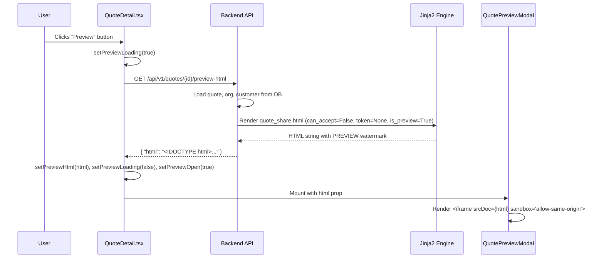
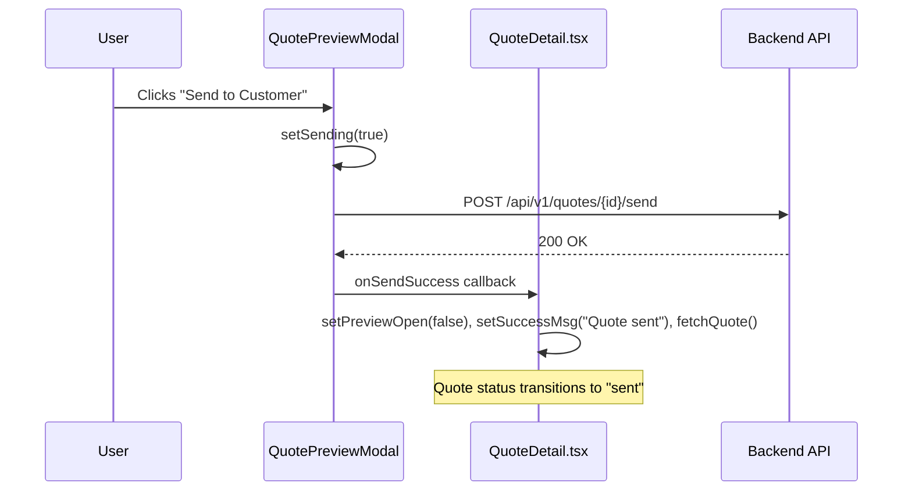
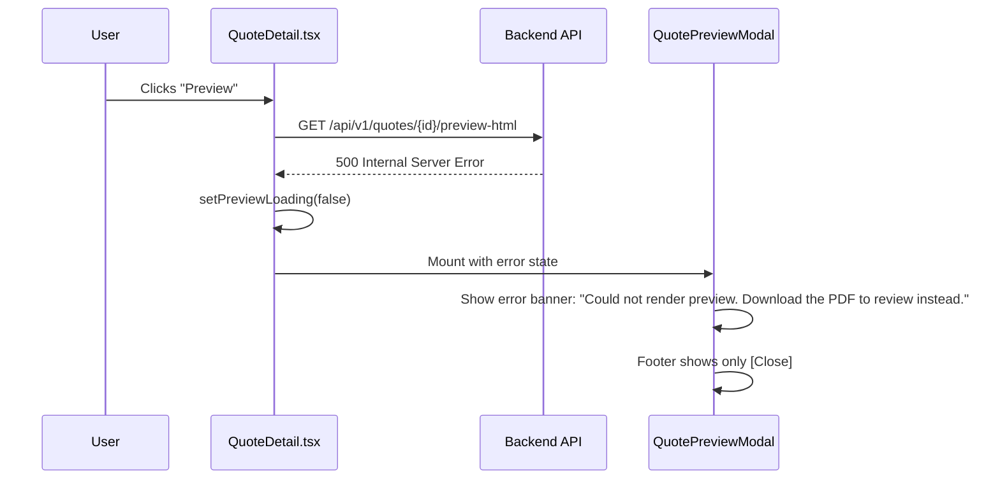

# Design Document: Quote Preview Modal

## ⚠️ Conditional Implementation Notice

> **This feature is CONDITIONAL.** Phase 4 of the Quote Preview, Print & Invoice-Parity plan (`docs/QUOTE_PREVIEW_PRINT_PLAN.md`) specifies that this modal should ONLY be built if Phases 1–3 ship and staff still report the workflow is insufficient.
>
> Phase 1's `inline` Content-Disposition means "Download PDF" opens the branded PDF in a new browser tab — already a review step. Phase 3's "Copy Link" lets staff preview exactly what the customer sees. If both land and staff confirm the workflow is adequate, **this spec should be shelved indefinitely**.
>
> This spec exists so the work is ready to execute immediately if the decision is YES. It must NOT be implemented speculatively.

---

## 1. Overview

Phase 4 adds a rich in-app HTML preview of a quote inside a modal before sending, without generating a PDF. A new backend endpoint renders the same Jinja2 template (`quote_share.html`) used for the public customer view, but with safety flags (`can_accept=False`, `token=None`, `is_preview=True`) that suppress the Accept button and inject a "PREVIEW" watermark. The frontend mounts a new `QuotePreviewModal` component inside `QuoteDetail.tsx` with a sandboxed `<iframe srcDoc>` to display the HTML read-only. Users can review the quote and either send directly from the modal or close and edit.

The feature targets version **1.6.0** across `pyproject.toml`, `frontend/package.json`, and `mobile/package.json`.

---

## 2. Navigation & Access

- **No new routes.** The modal is mounted inside the existing `QuoteDetail` component at `/quotes/:id`.
- **Entry point:** A "Preview" button in the `QuoteDetail` action bar, visible only when `quote.status === 'draft'` (i.e., `canSend` is true).
- **Auth:** The backend endpoint requires `require_role("org_admin", "salesperson")` — the same roles that can send a quote.

---

## 3. Component Tree

```
QuoteDetail.tsx (existing)
├── [Preview] button (new — conditional on canSend)
├── QuotePreviewModal.tsx (new file, mounted conditionally)
│   ├── Modal shell (Headless UI Dialog)
│   │   ├── Title: "Quote Preview — {quote_number}"
│   │   ├── Loading spinner (while previewLoading)
│   │   ├── Error banner (on fetch/send failure)
│   │   ├── <iframe srcDoc={html} sandbox="allow-same-origin"> (read-only preview)
│   │   └── Footer action bar
│   │       ├── [Close] button — dismisses modal
│   │       └── [Send to Customer] button — fires POST /quotes/{id}/send
```

---

## 4. High-Level Design

### 4.1 Preview Fetch + Modal Open Flow



### 4.2 Send from Modal Flow



### 4.3 Error Flow (Fetch Fails)



---

## 5. Low-Level Design

### 5.1 Backend Endpoint — Python

**File:** `app/modules/quotes/router.py`

```python
@router.get(
    "/{quote_id}/preview-html",
    response_model=dict,
    summary="Render quote HTML preview (staff-only, no Accept button)",
    dependencies=[require_role("org_admin", "salesperson")],
    responses={
        200: {"description": "Preview HTML rendered successfully"},
        401: {"description": "Authentication required"},
        403: {"description": "Org role required"},
        404: {"description": "Quote not found"},
    },
)
async def get_quote_preview_html(
    quote_id: uuid.UUID,
    request: Request,
    db: AsyncSession = Depends(get_db_session),
):
    """
    Render the quote using the same Jinja2 template as the public view,
    but with can_accept=False, token=None, is_preview=True.
    Returns { "html": "<full HTML string>" }.
    No PDF generation — Jinja2 only, fast.
    """
    import pathlib
    from jinja2 import Environment, FileSystemLoader

    org_uuid, _user_uuid, _ip = _extract_org_context(request)
    if not org_uuid:
        return JSONResponse(status_code=403, content={"detail": "Organisation context required"})

    # Load quote (scoped by org_id for isolation)
    result = await db.execute(
        select(Quote).where(Quote.id == quote_id, Quote.org_id == org_uuid)
    )
    quote = result.scalar_one_or_none()
    if quote is None:
        return JSONResponse(status_code=404, content={"detail": "Quote not found"})

    # Load line items
    li_result = await db.execute(
        select(QuoteLineItem)
        .where(QuoteLineItem.quote_id == quote.id)
        .order_by(QuoteLineItem.sort_order)
    )
    line_items = list(li_result.scalars().all())

    # Load org
    org_result = await db.execute(
        select(Organisation).where(Organisation.id == org_uuid)
    )
    org = org_result.scalar_one_or_none()
    settings = org.settings or {} if org else {}

    org_context = {
        "name": org.name if org else "Company",
        "logo_url": settings.get("logo_url"),
        "primary_colour": settings.get("primary_colour", "#1a1a1a"),
        "address": settings.get("address"),
        "phone": settings.get("phone"),
        "email": settings.get("email"),
        "gst_number": settings.get("gst_number"),
    }

    # Load customer
    cust_result = await db.execute(
        select(Customer).where(Customer.id == quote.customer_id)
    )
    customer = cust_result.scalar_one_or_none()
    customer_context = {
        "first_name": customer.first_name if customer else "Unknown",
        "last_name": customer.last_name if customer else "",
        "email": customer.email if customer else None,
        "phone": customer.phone if customer else None,
    }

    gst_percentage = settings.get("gst_percentage", 15)

    # Build quote dict (mirrors public_router.py view_shared_quote)
    quote_dict = {
        "id": str(quote.id),
        "quote_number": quote.quote_number,
        "status": quote.status,
        "valid_until": str(quote.valid_until) if quote.valid_until else None,
        "subtotal": float(quote.subtotal),
        "gst_amount": float(quote.gst_amount or 0),
        "total": float(quote.total),
        "notes": quote.notes,
        "vehicle_rego": quote.vehicle_rego,
        "vehicle_make": quote.vehicle_make,
        "vehicle_model": quote.vehicle_model,
        "vehicle_year": quote.vehicle_year,
        "created_at": quote.created_at,
        "line_items": [
            {
                "description": li.description,
                "item_type": li.item_type,
                "quantity": float(li.quantity),
                "unit_price": float(li.unit_price),
                "hours": float(li.hours) if li.hours else None,
                "hourly_rate": float(li.hourly_rate) if li.hourly_rate else None,
                "is_gst_exempt": li.is_gst_exempt,
                "warranty_note": li.warranty_note,
                "line_total": float(li.line_total),
            }
            for li in line_items
        ],
    }

    # Render template with safety flags
    template_dir = pathlib.Path(__file__).resolve().parent.parent.parent / "templates" / "pdf"
    env = Environment(loader=FileSystemLoader(str(template_dir)), autoescape=True)
    template = env.get_template("quote_share.html")

    html_content = template.render(
        quote=quote_dict,
        org=org_context,
        customer=customer_context,
        gst_percentage=gst_percentage,
        token=None,              # Accept POST URL cannot resolve
        can_accept=False,        # Accept button hidden
        already_accepted=False,
        is_preview=True,         # Triggers PREVIEW watermark
    )

    return {"html": html_content}
```

**Preconditions:**
- Caller is authenticated with `org_admin` or `salesperson` role
- `quote_id` exists and belongs to the caller's org

**Postconditions:**
- Returns `{ "html": "<string>" }` where the HTML:
  - Contains NO `<form>` with action pointing to `/accept/`
  - Contains NO visible Accept button
  - Contains the text "PREVIEW" in the watermark banner
- No database writes performed (read-only)
- No PDF generation (Jinja2 only)

---

### 5.2 Template Change — `quote_share.html`

**File:** `app/templates/pdf/quote_share.html`

Add immediately after `<body>`, before `<div class="container">`:

```html

<div style="position:fixed;top:0;left:0;right:0;background:rgba(255,165,0,0.9);color:#000;text-align:center;padding:8px;font-weight:bold;z-index:9999;">
  PREVIEW — NOT THE CUSTOMER COPY
</div>

```

This banner is:
- Fixed to the top of the viewport (visible even when scrolling)
- High-contrast orange background with black text
- z-index 9999 to overlay all content
- Only rendered when `is_preview=True` (never in the public customer view)

---

### 5.3 Frontend Component — `QuotePreviewModal.tsx`

**File:** `frontend/src/pages/quotes/QuotePreviewModal.tsx`

```typescript
import { Fragment, useState } from 'react'
import { Dialog, Transition } from '@headlessui/react'
import { Button } from '../../components/ui'

interface QuotePreviewModalProps {
  open: boolean
  onClose: () => void
  onSendSuccess: () => void
  quoteId: string
  quoteNumber: string
  html: string | null
  loading: boolean
  fetchError: string | null
}

export default function QuotePreviewModal({
  open,
  onClose,
  onSendSuccess,
  quoteId,
  quoteNumber,
  html,
  loading,
  fetchError,
}: QuotePreviewModalProps) {
  const [sending, setSending] = useState(false)
  const [sendError, setSendError] = useState<string | null>(null)

  const handleSend = async () => {
    setSending(true)
    setSendError(null)
    try {
      const { default: apiClient } = await import('../../api/client')
      await apiClient.post(`/quotes/${quoteId}/send`)
      onSendSuccess()
    } catch (err: unknown) {
      const detail = (err as any)?.response?.data?.detail
      setSendError(detail || 'Failed to send quote. Please try again.')
    } finally {
      setSending(false)
    }
  }

  return (
    <Transition appear show={open} as={Fragment}>
      <Dialog as="div" className="relative z-50" onClose={onClose}>
        <Transition.Child
          as={Fragment}
          enter="ease-out duration-200"
          enterFrom="opacity-0"
          enterTo="opacity-100"
          leave="ease-in duration-150"
          leaveFrom="opacity-100"
          leaveTo="opacity-0"
        >
          <div className="fixed inset-0 bg-black/40" />
        </Transition.Child>

        <div className="fixed inset-0 overflow-y-auto">
          <div className="flex min-h-full items-center justify-center p-4">
            <Transition.Child
              as={Fragment}
              enter="ease-out duration-200"
              enterFrom="opacity-0 scale-95"
              enterTo="opacity-100 scale-100"
              leave="ease-in duration-150"
              leaveFrom="opacity-100 scale-100"
              leaveTo="opacity-0 scale-95"
            >
              <Dialog.Panel className="w-full max-w-4xl rounded-lg bg-white shadow-xl flex flex-col max-h-[90vh]">
                {/* Header */}
                <div className="flex items-center justify-between border-b border-gray-200 px-6 py-4">
                  <Dialog.Title className="text-lg font-semibold text-gray-900">
                    Quote Preview — {quoteNumber}
                  </Dialog.Title>
                  <button
                    onClick={onClose}
                    className="text-gray-400 hover:text-gray-600"
                    aria-label="Close preview"
                  >
                    ✕
                  </button>
                </div>

                {/* Body */}
                <div className="flex-1 overflow-hidden p-4">
                  {loading && (
                    <div className="flex items-center justify-center h-96">
                      <div className="animate-spin rounded-full h-8 w-8 border-b-2 border-blue-600" />
                      <span className="ml-3 text-sm text-gray-500">Loading preview…</span>
                    </div>
                  )}

                  {fetchError && !loading && (
                    <div className="rounded-md border border-red-200 bg-red-50 px-4 py-3 text-sm text-red-700" role="alert">
                      {fetchError}
                    </div>
                  )}

                  {html && !loading && !fetchError && (
                    <iframe
                      srcDoc={html}
                      sandbox="allow-same-origin"
                      title={`Preview of quote ${quoteNumber}`}
                      className="w-full h-[70vh] border border-gray-200 rounded"
                    />
                  )}
                </div>

                {/* Footer */}
                <div className="flex items-center justify-between border-t border-gray-200 px-6 py-4">
                  <div>
                    {sendError && (
                      <span className="text-sm text-red-600">{sendError}</span>
                    )}
                  </div>
                  <div className="flex items-center gap-3">
                    <Button variant="secondary" onClick={onClose}>
                      Close
                    </Button>
                    {html && !fetchError && (
                      <Button
                        variant="primary"
                        onClick={handleSend}
                        loading={sending}
                        disabled={sending}
                      >
                        Send to Customer
                      </Button>
                    )}
                  </div>
                </div>
              </Dialog.Panel>
            </Transition.Child>
          </div>
        </div>
      </Dialog>
    </Transition>
  )
}
```

**Iframe sandbox spec:**
- `sandbox="allow-same-origin"` — required so the iframe can render inline styles and fonts from the same origin
- **NO `allow-scripts`** — prevents any JavaScript execution inside the preview
- **NO `allow-forms`** — prevents form submission even if the Accept button were somehow rendered (defence in depth)

---

### 5.4 State Additions to `QuoteDetail.tsx`

**File:** `frontend/src/pages/quotes/QuoteDetail.tsx`

```typescript
// New state variables
const [previewOpen, setPreviewOpen] = useState(false)
const [previewHtml, setPreviewHtml] = useState<string | null>(null)
const [previewLoading, setPreviewLoading] = useState(false)
const [previewError, setPreviewError] = useState<string | null>(null)

// Preview fetch handler
const handlePreview = async () => {
  setPreviewLoading(true)
  setPreviewError(null)
  setPreviewOpen(true)
  try {
    const res = await apiClient.get<{ html: string }>(`/quotes/${quoteId}/preview-html`)
    setPreviewHtml(res.data?.html ?? null)
  } catch {
    setPreviewError('Could not render preview. Download the PDF to review instead.')
  } finally {
    setPreviewLoading(false)
  }
}

// Send success callback (called from modal)
const handlePreviewSendSuccess = () => {
  setPreviewOpen(false)
  setPreviewHtml(null)
  setSuccessMsg('Quote sent to customer')
  fetchQuote()
}
```

**Modal mount (at end of component return, inside the outer `<div>`):**

```typescript
{previewOpen && (
  <QuotePreviewModal
    open={previewOpen}
    onClose={() => { setPreviewOpen(false); setPreviewHtml(null); setPreviewError(null) }}
    onSendSuccess={handlePreviewSendSuccess}
    quoteId={quoteId}
    quoteNumber={quote.quote_number}
    html={previewHtml}
    loading={previewLoading}
    fetchError={previewError}
  />
)}
```

---

## 6. Toolbar / Button Spec

| Button | Label | Variant | Visible When | Disabled When | Position |
|--------|-------|---------|--------------|---------------|----------|
| Preview | "Preview" | `secondary` | `quote.status === 'draft'` (same as `canSend`) | `actionLoading` or `previewLoading` | Between Edit and Send to Customer |
| Edit | "Edit" | `secondary` | `canSend` | `actionLoading` | Existing |
| Send to Customer | "Send to Customer" | `primary` | `canSend` | `actionLoading` | Existing |

**Action bar layout (draft status):**

```
[← Back]  QUO-0001  [DRAFT]     [Edit]  [Preview]  [Send to Customer]
```

**Inside the modal footer:**

```
{sendError}                              [Close]  [Send to Customer]
```

---

## 7. User-Workflow Traces

### 7.1 Happy Path — Preview then Send

1. User navigates to `/quotes/{id}` (quote is in `draft` status)
2. User clicks "Preview" button
3. Frontend calls `GET /api/v1/quotes/{id}/preview-html`
4. Modal opens with loading spinner
5. HTML loads into iframe — user sees the branded quote with PREVIEW watermark
6. User reviews content, clicks "Send to Customer" in modal footer
7. Frontend calls `POST /api/v1/quotes/{id}/send`
8. Modal closes, success message "Quote sent to customer" appears
9. Quote status updates to `sent`, Preview button disappears

### 7.2 Happy Path — Preview then Close

1. User clicks "Preview" button
2. Modal opens, HTML loads
3. User spots an error in the quote content
4. User clicks "Close" (or presses Escape, or clicks backdrop)
5. Modal closes, quote remains in `draft` status
6. User clicks "Edit" to fix the issue

### 7.3 Error Path — Fetch Fails

1. User clicks "Preview" button
2. Modal opens with loading spinner
3. `GET /api/v1/quotes/{id}/preview-html` returns 500
4. Modal shows error banner: "Could not render preview. Download the PDF to review instead."
5. Footer shows only [Close] — no Send button (cannot send without reviewing)
6. User clicks Close, uses Download PDF as fallback

### 7.4 Error Path — Send Fails from Modal

1. User clicks "Preview", modal opens, HTML loads successfully
2. User clicks "Send to Customer" in modal footer
3. `POST /api/v1/quotes/{id}/send` returns 500 (e.g., email service down)
4. Modal stays open, error text appears in footer: "Failed to send quote. Please try again."
5. User can retry Send or Close the modal

### 7.5 Error Path — Stale Status

1. User has QuoteDetail open (draft status)
2. Another user sends the quote from a different session
3. User clicks "Preview" — fetch succeeds (endpoint works on any status)
4. User clicks "Send to Customer" in modal
5. Backend returns 400: "Quote is not in draft status"
6. Modal shows error, user clicks Close
7. `fetchQuote()` fires on close, detail page refreshes to show `sent` status
8. Preview button disappears (no longer `canSend`)

---

## 8. Error States Matrix

| Scenario | HTTP Status | UI Treatment | Recovery |
|----------|-------------|--------------|----------|
| Preview fetch — network error | N/A | Modal error banner: "Could not render preview. Download the PDF to review instead." | Close modal, use PDF download |
| Preview fetch — 401 | 401 | Redirect to login (handled by apiClient interceptor) | Re-authenticate |
| Preview fetch — 403 | 403 | Modal error banner: "You don't have permission to preview this quote." | Close modal |
| Preview fetch — 404 | 404 | Modal error banner: "Quote not found." | Close modal, navigate back |
| Preview fetch — 500 | 500 | Modal error banner (generic) | Close modal, retry or use PDF |
| Send from modal — 400 (not draft) | 400 | Footer error: detail from response | Close modal, page refreshes |
| Send from modal — 500 | 500 | Footer error: "Failed to send quote. Please try again." | Retry button (same Send button) |
| Send from modal — network error | N/A | Footer error: "Network error. Check your connection." | Retry |

---

## 9. Loading / Empty States

| State | UI |
|-------|-----|
| Preview loading | Modal open, centered spinner + "Loading preview…" text, no iframe visible |
| Preview loaded | Iframe fills modal body, footer shows Close + Send buttons |
| Preview error | Modal open, red error banner in body area, footer shows only Close |
| Send in progress | "Send to Customer" button shows loading spinner, disabled state |
| Send success | Modal closes immediately, parent shows success toast |

---

## 10. Correctness Properties

*A property is a characteristic or behavior that should hold true across all valid executions of a system — essentially, a formal statement about what the system should do. Properties serve as the bridge between human-readable specifications and machine-verifiable correctness guarantees.*

### CP-1: Accept button absent in preview

*For any* quote (regardless of status), the HTML returned by `GET /quotes/{id}/preview-html` SHALL NOT contain a `<button>` or `<input>` with text "Accept", and SHALL NOT contain a `<form>` with `action` containing `/accept/`.

**Validates: Requirements 5.1, 5.2, 5.3, 5.4**

**Enforcement:**
- Backend passes `can_accept=False` unconditionally (not derived from status)
- Backend passes `token=None` so the form action URL is malformed even if rendered
- Template `` block gates the entire accept section

### CP-2: Iframe sandbox blocks scripts and forms

*For any* rendered state of QuotePreviewModal where the iframe is visible, the `<iframe>` element SHALL have `sandbox="allow-same-origin"` and SHALL NOT include `allow-scripts` or `allow-forms` in its sandbox attribute.

**Validates: Requirements 6.1, 6.2, 6.3**

**Enforcement:**
- The `sandbox` attribute is hardcoded in the component JSX
- No dynamic sandbox value — it is a string literal
- Property-based test: for any rendered modal state, the iframe's sandbox attribute equals exactly `"allow-same-origin"`

### CP-3: Preview watermark present

*For any* HTML response from the Preview_HTML_Endpoint, the rendered HTML SHALL contain the text "PREVIEW" within a visible banner element.

**Validates: Requirements 7.1, 7.3, 7.4**

**Enforcement:**
- Template has `` block with hardcoded "PREVIEW — NOT THE CUSTOMER COPY" text
- Backend endpoint always passes `is_preview=True`
- Test: response HTML contains the substring "PREVIEW"

### CP-4: Preview button visibility

*For any* quote, the "Preview" button renders if and only if `quote.status === 'draft'`.

**Validates: Requirement 1.1** (implicitly — button only visible on drafts)

**Enforcement:**
- Button is gated by the same `canSend` boolean already used for "Send to Customer"
- `canSend = quote.status === 'draft'` (existing logic)
- Test: render QuoteDetail with each status, assert Preview button presence/absence

### CP-5: Send from modal updates quote status

*For any* successful `POST /quotes/{id}/send` triggered from the modal, the modal SHALL close (`previewOpen` becomes `false`), the quote status SHALL transition to `sent`, and the Preview button SHALL no longer be visible.

**Validates: Requirements 2.2, 2.3**

**Enforcement:**
- `handlePreviewSendSuccess` sets `previewOpen=false` and calls `fetchQuote()`
- `fetchQuote()` reloads the quote, which now has `status: "sent"`
- `canSend` becomes `false`, hiding the Preview button

---

## 11. Out of Scope

| Item | Reason |
|------|--------|
| PDF generation in the preview endpoint | Preview is Jinja2-only for speed; PDF download is a separate existing endpoint |
| Mobile preview modal | Mobile parity is Phase 6; this spec covers desktop only |
| Print from inside the modal | Print uses `window.print()` on the QuoteDetail DOM, not the iframe content |
| Editing the quote from inside the modal | User must close the modal and click Edit separately |
| Preview of non-draft quotes | The button is only visible on drafts; the endpoint works on any status but the UI does not expose it |
| Template redesign | The preview uses the existing `quote_share.html` template as-is (plus watermark) |
| Caching the preview HTML | Each click fetches fresh HTML; no localStorage or state persistence across navigations |
| `allow-scripts` in iframe | Explicitly excluded for security — the preview is read-only |
| `allow-forms` in iframe | Explicitly excluded — defence in depth against accidental Accept |

---

## 12. Version Bump

When Phase 4 ships, bump all three packages to **1.6.0**:

| File | From | To |
|------|------|----|
| `pyproject.toml` | `1.5.0` | `1.6.0` |
| `frontend/package.json` | `1.5.0` | `1.6.0` |
| `mobile/package.json` | `1.5.0` | `1.6.0` |

Mobile receives a no-op version bump to maintain three-way alignment per the versioning steering rule.
