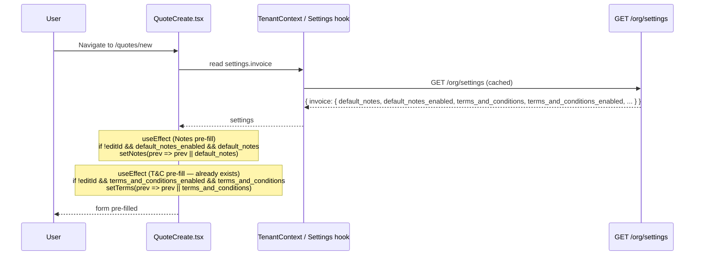
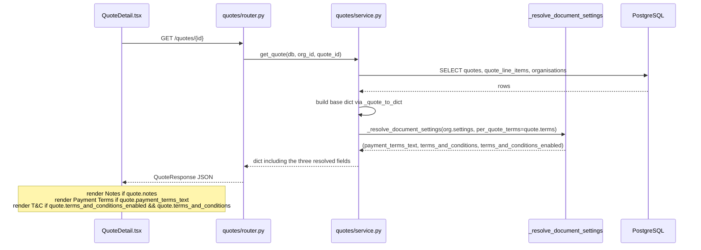
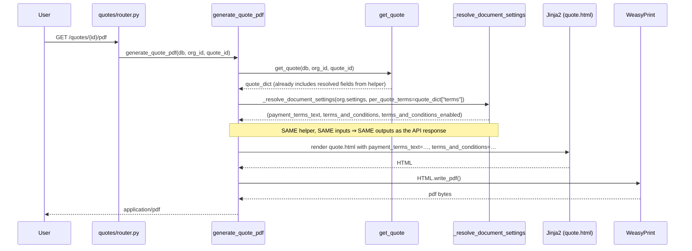

# Design Document

## Constraints (reaffirmed up front)

This feature is a parity / wiring change. The following constraints are non-negotiable and inform every section below:

- **No new database tables.** No new columns. No Alembic migration.
- **No new settings keys.** All three settings groups already exist under `organisations.settings.invoice`.
- **No new HTTP endpoints.** Settings reads happen through the existing org context loader; settings writes happen through the existing `PUT /org/settings` route only.
- **`quotes.terms` column is preserved as-is.** It continues to store any per-quote Terms & Conditions override. No rename.
- **Single resolution helper.** Both the `GET /quotes/{id}` API response builder and `generate_quote_pdf` MUST call the same private helper inside `app/modules/quotes/service.py` so the on-screen quote and the PDF cannot drift.
- **`OrgSettings.tsx` is not modified.** The Invoice Settings tab and Terms & Conditions tab already manage every key this feature reads.

## Overview

The Invoice document already honours three organisation-wide settings — Notes, Payment Terms, and Terms & Conditions — end-to-end (create-form pre-fill, server-side resolution, detail-page rendering, PDF rendering). The Quote document only partially honours them. This feature closes the gap by mirroring the invoice behaviour exactly, reusing the existing settings keys and the resolution patterns already in `app/modules/invoices/service.py`.

The work is small and surgical:

1. Add a Notes pre-fill `useEffect` to `QuoteCreate.tsx` (mirror of the existing T&C pre-fill).
2. Introduce one private helper, `_resolve_document_settings`, in `app/modules/quotes/service.py` that produces `(payment_terms_text, terms_and_conditions, terms_and_conditions_enabled)` for any quote.
3. Wire that helper into both the response builder (used by `get_quote` and `list_quotes`) and `generate_quote_pdf`.
4. Add the three new fields (`payment_terms_text`, `terms_and_conditions`, `terms_and_conditions_enabled`) to `QuoteResponse` (Pydantic) and `QuoteData` (TypeScript).
5. Switch the `QuoteDetail.tsx` rendering gates and remove the `(quote as any).payment_terms_text` cast.
6. Confirm `generate_quote_pdf` supplies the `terms_and_conditions` and `payment_terms_text` Jinja variables (it already does for both — but we wire them through the helper rather than reading settings directly).

## Architecture

### Sequence: Quote creation pre-fill (Notes + T&C from org settings)



### Sequence: Quote read flow — `GET /quotes/{id}` injecting resolved fields



### Sequence: Quote PDF generation feeding the same Jinja context



## Components and Interfaces

### Backend

| File | Change | Validates |
|------|--------|-----------|
| `app/modules/quotes/service.py` | Add private helper `_resolve_document_settings(org_settings, *, per_quote_terms)` returning the resolved triple. | Req 4.6, 5.1, 5.2, 5.3, 5.4, 5.5, 8.4 |
| `app/modules/quotes/service.py` | Call the helper inside `get_quote` (and any list-quote response builder) when shaping the response dict; replace the existing inline `payment_terms_text` block. | Req 3.4, 4.6, 5.6 |
| `app/modules/quotes/service.py` | Call the helper inside `generate_quote_pdf` to compute the Jinja context values (replaces the current direct `settings.get("terms_and_conditions", "")` and `settings.get("payment_terms_text", "")` reads). | Req 4.3, 8.1, 8.4 |
| `app/modules/quotes/schemas.py` | Add three fields to `QuoteResponse`: `payment_terms_text: str \| None = None`, `terms_and_conditions: str \| None = None`, `terms_and_conditions_enabled: bool = False`. | Req 3.1, 6.1, 6.2, 6.4 |

### Frontend

| File | Change | Validates |
|------|--------|-----------|
| `frontend/src/pages/quotes/QuoteCreate.tsx` | Add a Notes pre-fill `useEffect` mirroring the existing T&C pre-fill at lines 647–650; the new effect mirrors `InvoiceCreate.tsx:901–904` exactly. | Req 1.1, 1.2, 1.3, 1.4, 1.5 |
| `frontend/src/pages/quotes/QuoteDetail.tsx` | Extend the `QuoteData` interface with `payment_terms_text?: string \| null`, `terms_and_conditions?: string \| null`, `terms_and_conditions_enabled?: boolean`. | Req 3.2, 6.3 |
| `frontend/src/pages/quotes/QuoteDetail.tsx` | Replace `(quote as any).payment_terms_text` with `quote.payment_terms_text` (typed access). | Req 3.3 |
| `frontend/src/pages/quotes/QuoteDetail.tsx` | Add a separate Terms & Conditions section gated on `quote.terms_and_conditions_enabled && quote.terms_and_conditions` (mirror of `InvoiceDetail.tsx:1242–1250`). The existing `quote.terms` block is kept only as the per-quote override input source — see "Frontend rendering rules" below. | Req 7.1, 7.2, 7.3, 7.4 |

### Templates

| File | Change | Validates |
|------|--------|-----------|
| `app/templates/pdf/quote.html` | No structural change. The combined `` block stays. The `` block stays. The Jinja variable name remains **`payment_terms_text`** (see "Jinja variable naming" below). | Req 2.3, 2.4, 4.4, 4.5, 8.2, 8.3 |

## Data Models

### Database

**No changes.** No migration. No new columns. `quotes.terms` is preserved.

### Pydantic — `app/modules/quotes/schemas.py` (additions to `QuoteResponse`)

The three new fields are appended to the existing class:

```python
class QuoteResponse(BaseModel):
    # ... existing fields unchanged ...
    payment_terms_text: str | None = None
    terms_and_conditions: str | None = None
    terms_and_conditions_enabled: bool = False
```

These mirror the field declarations on `InvoiceResponse` at `app/modules/invoices/schemas.py:299–301`.

### TypeScript — `QuoteData` interface in `QuoteDetail.tsx` (additions)

```ts
interface QuoteData {
  // ... existing fields unchanged ...
  payment_terms_text?: string | null
  terms_and_conditions?: string | null
  terms_and_conditions_enabled?: boolean
}
```

`notes` and `terms` continue to exist on the interface — `terms` remains the per-quote override source-of-truth and is still surfaced in the meta panel under "Terms : <first line>".

## Resolution helper

Single private helper inside `app/modules/quotes/service.py`. Both the response builder and the PDF generator MUST call it; neither MUST read `payment_terms_text` / `terms_and_conditions` / `terms_and_conditions_enabled` directly from `settings` after this change.

```python
def _resolve_document_settings(
    org_settings: Mapping[str, Any] | None,
    *,
    per_quote_terms: str | None,
) -> dict[str, object]:
    """
    Resolve render-time Payment Terms and Terms & Conditions for a quote,
    mirroring the invoice service's behaviour:

      - app/modules/invoices/service.py:1764-1775  (detail response)
      - app/modules/invoices/service.py:4150        (PDF payment terms)
      - app/modules/invoices/service.py:4153-4161   (PDF T&C)

    Returns
    -------
    dict with three keys:
      - "payment_terms_text":          str | None
      - "terms_and_conditions":        str | None
      - "terms_and_conditions_enabled": bool

    Resolution rules
    ----------------
    payment_terms_text:
        non-empty settings["payment_terms_text"]
            when settings.get("payment_terms_enabled", True) is true,
        else None.

    terms_and_conditions_enabled:
        bool(settings.get("terms_and_conditions_enabled", True))

    terms_and_conditions:
        per_quote_terms                                     # if non-empty
        else settings["terms_and_conditions"]               # if enabled and non-empty
        else None
    """
```

Implementation lives inside the service module (not exported). The `Mapping[str, Any] | None` signature accepts `None` to handle organisations with no settings row.

Both call sites become trivial:

```python
# inside get_quote / response builder
resolved = _resolve_document_settings(org.settings, per_quote_terms=quote.terms)
result.update(resolved)

# inside generate_quote_pdf
resolved = _resolve_document_settings(settings, per_quote_terms=quote_dict.get("terms"))
payment_terms_text = resolved["payment_terms_text"] or ""   # template expects "" for skip
terms_and_conditions = resolved["terms_and_conditions"] or ""
```

## Frontend changes

### `QuoteCreate.tsx` — add Notes pre-fill

Insert a new `useEffect` immediately above the existing T&C pre-fill (which currently sits around lines 647–650). The new effect mirrors `frontend/src/pages/invoices/InvoiceCreate.tsx:901–904`:

```tsx
// Pre-fill notes from org settings (only on create, not edit) — mirrors invoice behaviour
useEffect(() => {
  if (!isEditMode && settings?.invoice?.default_notes_enabled && settings?.invoice?.default_notes) {
    setNotes(prev => prev || settings.invoice.default_notes || '')
  }
}, [isEditMode, settings?.invoice?.default_notes_enabled, settings?.invoice?.default_notes])
```

The `prev || ...` form preserves any user edit and naturally satisfies "applied at most once per mount" (Req 1.5).

### `QuoteDetail.tsx` — interface + rendering changes

#### Interface additions

Already shown above.

#### Rendering rules

Three sections, three independent gates (mirror of `InvoiceDetail.tsx:1214–1250`):

1. **Notes** — visible iff `quote.notes` is non-empty. **No toggle.** Existing block stays content-only.
2. **Payment Terms** — visible iff `quote.payment_terms_text` is non-empty. The current `(quote as any).payment_terms_text` cast is replaced with typed `quote.payment_terms_text`.
3. **Terms & Conditions** — visible iff `quote.terms_and_conditions_enabled && quote.terms_and_conditions` (mirror of `InvoiceDetail.tsx:1242–1250`).

The existing combined block at `QuoteDetail.tsx:816–829` (which currently renders Notes and `quote.terms` side-by-side) is restructured so the right-hand "Terms & Conditions" block reads from the resolved field:

```tsx
{/* Notes & Terms footer */}
{(quote.notes || (quote.terms_and_conditions_enabled && quote.terms_and_conditions)) && (
  <div className="border-t border-gray-100 pt-4 mb-4 grid grid-cols-1 md:grid-cols-2 gap-6">
    {quote.notes && (
      <div>
        <p className="text-xs text-gray-400 uppercase tracking-wider mb-1">Notes</p>
        <p className="text-sm text-gray-600 whitespace-pre-wrap">{quote.notes}</p>
      </div>
    )}
    {quote.terms_and_conditions_enabled && quote.terms_and_conditions && (
      <div>
        <p className="text-xs text-gray-400 uppercase tracking-wider mb-1">Terms & Conditions</p>
        <p className="text-sm text-gray-600 whitespace-pre-wrap">{quote.terms_and_conditions}</p>
      </div>
    )}
  </div>
)}

{/* Payment Terms (typed access) */}
{quote.payment_terms_text && (
  <div className="border-t border-gray-100 pt-4 mb-4">
    <p className="text-xs text-gray-400 uppercase tracking-wider mb-1">Payment Terms</p>
    <p className="text-sm text-gray-600 whitespace-pre-wrap">{quote.payment_terms_text}</p>
  </div>
)}
```

The `quote.terms` field continues to be read in the meta panel (`Terms : <first line>` summary). It is no longer used to render the long-form Terms & Conditions section; that role moves to the resolved `terms_and_conditions` field.

## PDF generator changes

`generate_quote_pdf` already supplies both `payment_terms_text` and `terms_and_conditions` to the Jinja context (verified at `app/modules/quotes/service.py` ~lines 970–1018). The change is purely **how those values are computed**: read them from `_resolve_document_settings(...)` instead of from `settings` directly.

### Jinja variable naming — explicit decision

The invoice template uses `payment_terms`. The current quote template (`app/templates/pdf/quote.html` lines ~272–276) uses `payment_terms_text`. **The quote template keeps `payment_terms_text`.** Rationale:

- The current `generate_quote_pdf` already passes `payment_terms_text=...` to Jinja.
- Renaming the Jinja variable would force a template edit that adds noise to the diff and risks regressing `quote_share.html` consumers.
- The variable name is internal to the Jinja context; it does not affect the API or any client code.

The `terms_and_conditions` Jinja variable name matches the invoice template and stays as-is.

After the change, the PDF generator section that currently reads:

```python
gst_percentage = settings.get("gst_percentage", 15)
terms_and_conditions = settings.get("terms_and_conditions", "")
payment_terms_enabled = settings.get("payment_terms_enabled", True)
payment_terms_text = settings.get("payment_terms_text", "") if payment_terms_enabled else ""
```

becomes:

```python
gst_percentage = settings.get("gst_percentage", 15)
resolved = _resolve_document_settings(settings, per_quote_terms=quote_dict.get("terms"))
payment_terms_text = resolved["payment_terms_text"] or ""
terms_and_conditions = resolved["terms_and_conditions"] or ""
# terms_and_conditions_enabled is not needed by the template;
# the PDF gates on the resolved string itself, which is None when disabled+no override.
```

The `or ""` collapse is required because the existing Jinja `` and `` already treat empty string and `None` identically.

## Correctness Properties

*A property is a characteristic or behavior that should hold true across all valid executions of a system — essentially, a formal statement about what the system should do. Properties serve as the bridge between human-readable specifications and machine-verifiable correctness guarantees.*

### Property 1: Resolution precedence

*For any* organisation settings dict and any per-quote terms string, `_resolve_document_settings(org_settings, per_quote_terms=…)` returns a triple `(payment_terms_text, terms_and_conditions, terms_and_conditions_enabled)` such that:

- `payment_terms_text` equals `org_settings["payment_terms_text"]` when `org_settings["payment_terms_enabled"]` is true and the text is non-empty, otherwise `None`.
- `terms_and_conditions_enabled` equals `bool(org_settings.get("terms_and_conditions_enabled", True))`.
- `terms_and_conditions` equals `per_quote_terms` when `per_quote_terms` is non-empty (regardless of the toggle); otherwise equals `org_settings["terms_and_conditions"]` when the toggle is true and the value is non-empty; otherwise `None`.

**Validates: Requirements 4.6, 5.1, 5.4, 5.5**

### Property 2: Helper purity and API/PDF non-divergence

*For any* `(org_settings, per_quote_terms)` pair, two consecutive calls to `_resolve_document_settings` return equal triples (purity); AND, for any quote with the same `(org_settings, per_quote_terms)` inputs, the values exposed on the `GET /quotes/{id}` response (`payment_terms_text`, `terms_and_conditions`, `terms_and_conditions_enabled`) are equal to the values placed into the Jinja context for `generate_quote_pdf` (`payment_terms_text`, `terms_and_conditions`, plus the boolean implicit in the gate).

**Validates: Requirements 5.2, 5.3, 5.6, 8.1, 8.4**

### Property 3: Notes pre-fill semantics on QuoteCreate

*For any* `(settings, prior_user_value)` on `QuoteCreate` mount in create mode, the resulting Notes input value equals:

- `prior_user_value` when `prior_user_value` is a non-empty string,
- otherwise `settings.invoice.default_notes` when `settings.invoice.default_notes_enabled` is true AND `settings.invoice.default_notes` is non-empty,
- otherwise the empty string.

The effect runs at most once per mount: re-rendering with stable `settings` does not overwrite a user-edited value.

**Validates: Requirements 1.1, 1.2, 1.3, 1.5**

### Property 4: Detail-page rendering gates

*For any* quote shape rendered by `QuoteDetail.tsx`, exactly the following section visibility holds:

- The Notes section is visible iff `quote.notes` is a non-empty string.
- The Payment Terms section is visible iff `quote.payment_terms_text` is a non-empty string.
- The Terms & Conditions section is visible iff `quote.terms_and_conditions_enabled` is `true` AND `quote.terms_and_conditions` is a non-empty string.

**Validates: Requirements 2.1, 2.2, 4.1, 4.2, 7.1, 7.2, 7.3**

## Error Handling

This feature introduces no new failure modes:

- No new endpoints, so no new HTTP error paths.
- `_resolve_document_settings` is total over its declared input domain (it accepts `None` for `org_settings` and any `str | None` for `per_quote_terms`); it cannot raise.
- The frontend changes are pure rendering / interface additions; they do not introduce new fetch paths.
- The PDF generator's existing error handling (Organisation not found, customer not found) is unchanged.

`get_quote` and `generate_quote_pdf` continue to raise `ValueError` for missing entities exactly as they do today. No new exception types are added.

## Testing Strategy

Property-based testing applies for the resolution logic and rendering gates: the helper is a pure function with a clean input/output contract and a meaningful input space (booleans, optional strings, whitespace). The detail-page render rules and the Notes pre-fill effect also reduce to universal "for all (gate, content)" invariants.

PBT does **not** apply to:

- Pydantic schema declarations (smoke tests only).
- TypeScript interface declarations (compile-time check only).
- The Jinja template `` gates (covered by 1–2 example-based template render tests).
- The `OrgSettings.tsx` no-change constraint (review-time only).

### Unit tests (pytest + Hypothesis)

In `tests/quotes/test_resolve_document_settings.py`:

1. **Property 1 — resolution precedence.** Hypothesis generator yields `(payment_terms_enabled, payment_terms_text, terms_and_conditions_enabled, terms_and_conditions, per_quote_terms)` tuples covering empty, whitespace, and non-empty strings. Assert each component of the returned triple matches the documented rules.
2. **Property 2a — purity.** For any input, two calls return equal dicts.
3. **Property 2b — API/PDF non-divergence.** Build a quote dict via `_quote_to_dict`+resolved fields, and a PDF Jinja context via `generate_quote_pdf`'s code path with monkeypatched `HTML.write_pdf`; assert the three values match.
4. **Property 4 (backend half) — response shape.** Hypothesis generator yields random org settings; assert `GET /quotes/{id}` response always contains the three new keys with correct types.

Configuration: each Hypothesis-driven test runs **minimum 100 examples** (default Hypothesis budget). Each test carries a comment of the form:

```python
# Feature: quote-settings-parity, Property 1: Resolution precedence
```

### Unit tests (vitest + fast-check)

In `frontend/src/pages/quotes/__tests__/`:

1. **Property 3 — Notes pre-fill semantics.** fast-check generator over `(default_notes_enabled, default_notes, prior_user_value)`; mount `QuoteCreate` with a stub `TenantContext`; assert resulting input value matches the rule. 100 iterations.
2. **Property 4 (frontend half) — rendering gates.** fast-check over `(notes, payment_terms_text, terms_and_conditions_enabled, terms_and_conditions)`; render `QuoteDetail` with a mocked API client; assert section visibility matches the gates. 100 iterations.

### Integration tests (pytest)

In `tests/quotes/test_quote_pdf_render.py`:

1. **PDF Notes section** — render `quote.html` (Jinja only, skip WeasyPrint) with `quote.notes = "hello"`; assert `"Notes"` label present.
2. **PDF Notes section absent** — same with empty notes; assert label absent.
3. **PDF Payment Terms section** — render with `payment_terms_text = "Net 7"`; assert label present and value rendered.
4. **PDF Payment Terms section absent** — same with `""`; assert label absent.
5. **PDF Terms & Conditions section** — render with `terms_and_conditions = "T&C body"`; assert label present.
6. **PDF Terms & Conditions section absent** — same with `""`; assert label absent.

In `tests/quotes/test_quote_response_shape.py`:

1. **Single-quote endpoint** — POST a quote, GET it, assert the response contains `payment_terms_text`, `terms_and_conditions`, `terms_and_conditions_enabled` with the values produced by the helper for the test org's settings.
2. **List endpoint parity** — GET `/quotes`; if the list response includes per-quote document settings, assert they match the single-quote response (Req 5.6). If the list endpoint deliberately omits these (because list views show only summaries), document that omission in the test as expected.

### Smoke / review-time checks

- `assert "payment_terms_text" in QuoteResponse.model_fields`
- `assert "terms_and_conditions" in QuoteResponse.model_fields`
- `assert "terms_and_conditions_enabled" in QuoteResponse.model_fields`
- `grep -n "as any" frontend/src/pages/quotes/QuoteDetail.tsx` shows zero hits in the Payment Terms or T&C blocks.
- `git diff frontend/src/pages/settings/OrgSettings.tsx` is empty.
- `git diff alembic/versions/` is empty.
- `git diff app/modules/organisations/` is empty.
