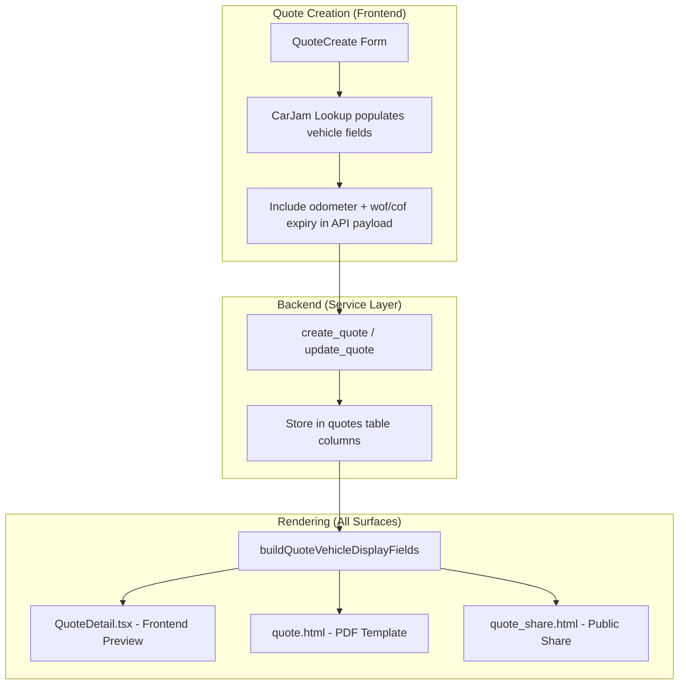

# Design Document: Quote Vehicle Info Display

## Overview

This feature extends the quote system to store and display WOF/COF expiry date across all rendering surfaces (frontend preview, PDF via WeasyPrint, and public share link), and adds odometer + WOF/COF to the public share template. The quote model already has `vehicle_odometer` (added in migration 0005) and the PDF template already renders it conditionally. What's missing is WOF/COF expiry storage and display.

The design adds two new nullable columns to the `quotes` table (`vehicle_wof_expiry`, `vehicle_cof_expiry`). The `vehicle_odometer` column already exists and is already rendered in the PDF template.

**Validated existing state (from code investigation):**
- `vehicle_odometer` column ALREADY EXISTS on quotes table
- PDF template (`quote.html`) ALREADY renders odometer conditionally
- `VehicleItem` schema ALREADY has `odometer` field
- `VehicleLiveSearch` ALREADY returns `wof_expiry`, `cof_expiry`, `inspection_type`
- `getInspectionLabel()` and `getInspectionExpiry()` helpers ALREADY exist in `@/utils/vehicleHelpers`
- Latest Alembic revision is `0198`
- `QuoteDetail.tsx` ALREADY has `vehicle_odometer` in its QuoteData interface

Key design decisions:
- **Direct columns over JSONB**: Matches the existing pattern (`vehicle_rego`, `vehicle_make`, `vehicle_odometer` are all direct columns).
- **Reuse existing helpers**: Use `getInspectionLabel()` and `getInspectionExpiry()` from `@/utils/vehicleHelpers` where applicable.
- **Capture at creation time**: WOF/COF expiry is captured when the quote is created/updated (from the CarJam data already fetched via VehicleLiveSearch), so rendering never requires additional API calls.

## Architecture



The architecture has three layers:
- **Capture layer** (frontend form): Passes odometer and WOF/COF expiry from the CarJam lookup result to the API alongside existing vehicle fields.
- **Storage layer** (backend): Persists the values as dedicated columns on the `quotes` table via Alembic migration.
- **Rendering layer** (shared utility): A pure function that takes quote vehicle data and produces an ordered array of display fields, used identically by all rendering surfaces.

## Components and Interfaces

### 1. Database Schema Extension

Two new nullable columns on the `quotes` table (`vehicle_odometer` already exists):

```sql
-- vehicle_odometer already exists (migration 0005) — do NOT add
ALTER TABLE quotes ADD COLUMN vehicle_wof_expiry DATE DEFAULT NULL;
ALTER TABLE quotes ADD COLUMN vehicle_cof_expiry DATE DEFAULT NULL;
```

### 2. SQLAlchemy Model Update (`app/modules/quotes/models.py`)

```python
# vehicle_odometer already exists on the model — only add:
vehicle_wof_expiry: Mapped[date | None] = mapped_column(Date, nullable=True)
vehicle_cof_expiry: Mapped[date | None] = mapped_column(Date, nullable=True)
```

### 3. Pydantic Schema Updates (`app/modules/quotes/schemas.py`)

```python
# QuoteCreate — add fields (vehicle_odometer already exists)
vehicle_wof_expiry: date | None = None
vehicle_cof_expiry: date | None = None

# QuoteUpdate — add fields
vehicle_wof_expiry: date | None = None
vehicle_cof_expiry: date | None = None

# QuoteResponse — add fields
vehicle_wof_expiry: date | None = None
vehicle_cof_expiry: date | None = None
```

### 4. Service Layer Updates (`app/modules/quotes/service.py`)

The `create_quote` and `update_quote` functions accept the new fields and store them on the Quote record. The `_quote_to_dict` helper includes them in the response.

```python
# create_quote signature additions
vehicle_odometer: int | None = None,
vehicle_wof_expiry: date | None = None,
vehicle_cof_expiry: date | None = None,

# _quote_to_dict additions
"vehicle_odometer": quote.vehicle_odometer,
"vehicle_wof_expiry": quote.vehicle_wof_expiry,
"vehicle_cof_expiry": quote.vehicle_cof_expiry,
```

### 5. Vehicle Display Utility (TypeScript — Frontend)

A pure function that produces an ordered list of vehicle display fields:

```typescript
interface VehicleDisplayField {
  label: string
  value: string
}

interface QuoteVehicleData {
  vehicle_rego: string | null
  vehicle_make: string | null
  vehicle_model: string | null
  vehicle_year: number | null
  vehicle_odometer: number | null
  vehicle_wof_expiry: string | null  // ISO date or null
  vehicle_cof_expiry: string | null  // ISO date or null
}

function buildQuoteVehicleDisplayFields(data: QuoteVehicleData): VehicleDisplayField[]
```

Display order (always):
1. **Registration** — label "REGO", value is the rego string
2. **Vehicle** — label "VEHICLE", value is `{year} {make} {model}` combined
3. **Odometer** — label "ODOMETER", value is comma-formatted number + " km" (only if > 0)
4. **WOF/COF Expiry** — label "WOF EXPIRY" or "COF EXPIRY", value is DD Mon YYYY formatted date (only if date exists)

Rules:
- Any field with null/empty/zero value is omitted entirely (no entry in the array)
- If `vehicle_cof_expiry` is set, use label "COF EXPIRY"; otherwise if `vehicle_wof_expiry` is set, use "WOF EXPIRY"
- Date formatting uses NZ locale: `DD Mon YYYY` (e.g., "15 Aug 2026")

### 6. Vehicle Display Utility (Python — PDF/Share Templates)

Mirror of the TypeScript function for use in Jinja2 templates:

```python
def build_quote_vehicle_display_fields(
    vehicle_rego: str | None,
    vehicle_make: str | None,
    vehicle_model: str | None,
    vehicle_year: int | None,
    vehicle_odometer: int | None,
    vehicle_wof_expiry: date | None,
    vehicle_cof_expiry: date | None,
) -> list[dict]:
    """Return ordered list of {'label': str, 'value': str} dicts."""
```

Same logic as the TypeScript version. Used by the PDF and share HTML templates.

### 7. Frontend Form Changes (`QuoteCreate.tsx`)

The form already captures vehicle data from CarJam lookup via `VehicleLiveSearch`. Changes needed:
- Include `vehicle_odometer`, `vehicle_wof_expiry`, `vehicle_cof_expiry` in the API payload when building the request
- Source these from the CarJam lookup result (already available on the vehicle object returned by the search component)
- The `VehicleItem` schema for additional vehicles already has `odometer`, `wof_expiry`, `cof_expiry` fields

### 8. Frontend Preview Changes (`QuoteDetail.tsx`)

The preview already conditionally renders odometer from `quote.vehicle_odometer`. Changes needed:
- Add WOF/COF expiry display after the odometer field
- Apply the same rendering to additional vehicles (which already show `wof_expiry`)
- Use the shared `buildQuoteVehicleDisplayFields` utility for consistent ordering

### 9. PDF Template Changes (`quote.html`)

The vehicle bar already has a conditional block for odometer. Changes needed:
- Add WOF/COF expiry field after odometer
- Use the Python `build_quote_vehicle_display_fields` utility to generate the fields
- Apply same changes to additional vehicles section

### 10. Public Share Template Changes (`quote_share.html`)

The share template currently shows rego and make/model/year. Changes needed:
- Add odometer and WOF/COF expiry to the vehicle details section
- Use the same Python utility for consistent rendering

## Data Models

### Quote Table (Updated)

| Column | Type | Nullable | Default | Notes |
|--------|------|----------|---------|-------|
| vehicle_rego | VARCHAR(20) | Yes | NULL | Existing |
| vehicle_make | VARCHAR(100) | Yes | NULL | Existing |
| vehicle_model | VARCHAR(100) | Yes | NULL | Existing |
| vehicle_year | INTEGER | Yes | NULL | Existing |
| **vehicle_odometer** | **INTEGER** | **Yes** | **NULL** | **New — km reading at quote time** |
| **vehicle_wof_expiry** | **DATE** | **Yes** | **NULL** | **New — WOF expiry from CarJam** |
| **vehicle_cof_expiry** | **DATE** | **Yes** | **NULL** | **New — COF expiry from CarJam** |

### Additional Vehicles (JSONB — existing structure extended)

The `additional_vehicles` JSONB column already stores objects with `rego`, `make`, `model`, `year`, `odometer`. The `VehicleItem` schema already includes `odometer`. We add `wof_expiry` and `cof_expiry` to the schema:

```python
class VehicleItem(BaseModel):
    id: uuid.UUID | None = None
    rego: str | None = None
    make: str | None = None
    model: str | None = None
    year: int | None = None
    odometer: int | None = None
    wof_expiry: str | None = None   # NEW
    cof_expiry: str | None = None   # NEW
```

### API Response Shape

```json
{
  "quote": {
    "vehicle_rego": "ABC123",
    "vehicle_make": "Toyota",
    "vehicle_model": "Hilux",
    "vehicle_year": 2019,
    "vehicle_odometer": 85000,
    "vehicle_wof_expiry": "2026-08-15",
    "vehicle_cof_expiry": null,
    "additional_vehicles": [
      {
        "rego": "XYZ789",
        "make": "Ford",
        "model": "Ranger",
        "year": 2021,
        "odometer": 42000,
        "wof_expiry": "2026-11-20",
        "cof_expiry": null
      }
    ]
  }
}
```

## Correctness Properties

*A property is a characteristic or behavior that should hold true across all valid executions of a system — essentially, a formal statement about what the system should do. Properties serve as the bridge between human-readable specifications and machine-verifiable correctness guarantees.*

### Property 1: Vehicle data storage round-trip

*For any* valid quote vehicle data (odometer as a non-negative integer or null, wof_expiry as a valid date or null, cof_expiry as a valid date or null), storing the data on a quote record and then retrieving it SHALL return the exact same values.

**Validates: Requirements 1.1, 1.2, 2.1, 2.2, 2.3, 2.4**

### Property 2: Display order with null omission

*For any* quote vehicle data (with any combination of fields being null or populated), the `buildQuoteVehicleDisplayFields` function SHALL return fields in the strict order [Registration, Vehicle, Odometer, WOF/COF Expiry], and any field with a null, empty, or zero value SHALL be omitted from the result array entirely.

**Validates: Requirements 5.1, 5.3, 6.1, 6.2, 6.3**

### Property 3: Inspection expiry label correctness

*For any* quote with a stored expiry date, the display function SHALL use the label "COF EXPIRY" when `vehicle_cof_expiry` is set, and "WOF EXPIRY" when `vehicle_wof_expiry` is set (and `vehicle_cof_expiry` is null). The formatted value SHALL match the NZ date format pattern `DD Mon YYYY`.

**Validates: Requirements 4.1, 4.2, 4.4**

### Property 4: Odometer conditional display and formatting

*For any* quote vehicle data, the odometer field SHALL appear in the display output if and only if the odometer value is a positive integer (> 0). When displayed, the value SHALL be formatted as a comma-separated number followed by " km".

**Validates: Requirements 3.1, 3.2**

## Error Handling

| Scenario | Handling |
|----------|----------|
| CarJam returns null odometer | Store null on quote; renderer omits the field |
| CarJam returns null WOF/COF expiry | Store null on quote; renderer omits the field |
| Existing quotes without new columns (pre-migration) | Columns default to NULL; renderer omits those fields (matches current behaviour) |
| Invalid date string in additional_vehicles JSON | Treat as null — omit from display |
| Odometer value is 0 | Treat as "no value" — omit from display |
| Vehicles module disabled | Frontend does not send vehicle fields; backend does not store them; renderer checks module gate before displaying |
| Quote converted to invoice | Invoice creation copies vehicle_odometer (already supported on invoice model) |

## Testing Strategy

### Property-Based Tests (Hypothesis + fast-check)

The `buildQuoteVehicleDisplayFields` function is a pure function with clear input/output behaviour — ideal for property-based testing.

- **Library**: Hypothesis (Python) for the backend utility, fast-check (TypeScript) for the frontend utility
- **Minimum iterations**: 100 per property
- **Tag format**: `Feature: quote-vehicle-info-display, Property {N}: {title}`

Each of the 4 correctness properties maps to a property-based test:
1. Storage round-trip — test via the Python service layer with generated vehicle data
2. Display order with null omission — test the pure display function with random field combinations
3. Inspection expiry label correctness — test with random dates and inspection types
4. Odometer conditional display — test with random integer values including 0 and null

### Unit Tests (Example-Based)

- Backward compatibility: quote without odometer/expiry renders without errors
- Edge case: odometer is exactly 0 → omitted from display
- Edge case: both WOF and COF expiry are set → COF takes precedence (COF vehicles don't have WOF)
- Edge case: additional vehicle with all null fields → no vehicle bar rendered
- Date formatting: verify "15 Aug 2026" format for known dates
- Module gating: vehicles module disabled → vehicle fields not included in API payload

### Integration Tests

- Create quote via API with odometer and expiry → verify response includes the values
- Update quote with new vehicle → verify odometer and expiry update
- Generate PDF → verify vehicle bar contains odometer and expiry text
- Public share page → verify vehicle section shows odometer and expiry
- Quote conversion to invoice → verify odometer carries over
