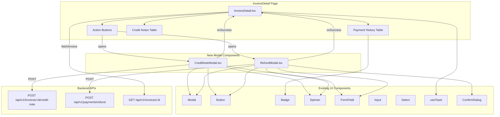

# Design Document: Refund & Credit Note UI

## Overview

This feature adds frontend UI for creating credit notes and processing refunds on the InvoiceDetail page. The backend APIs are fully implemented — this is purely a frontend effort across three files:

1. **CreditNoteModal.tsx** — New modal component for creating credit notes with optional itemised breakdown
2. **RefundModal.tsx** — New modal component for processing cash refunds with a confirmation step
3. **InvoiceDetail.tsx** — Modified to add action buttons, enhanced payment/credit note display, and modal integration

The implementation follows the existing void modal pattern (useState for open/close, reason field, loading state, inline error handling) and uses only existing UI components from `frontend/src/components/ui/`.

## Architecture



### Data Flow

1. User clicks "Create Credit Note" or "Process Refund" button → modal opens
2. User fills form → client-side validation runs on blur and submit
3. User submits → API call via `apiClient` → loading state shown
4. On success → modal closes, `fetchInvoice()` callback refreshes parent data, success toast shown
5. On error → error message displayed inline in modal, modal stays open

## Components and Interfaces

### CreditNoteModal

**File:** `frontend/src/components/invoices/CreditNoteModal.tsx`

```typescript
interface CreditNoteItem {
  description: string
  amount: number
}

interface CreditNoteModalProps {
  open: boolean
  onClose: () => void
  onSuccess: () => void
  invoiceId: string
  creditableAmount: number  // invoice.total - sum(existing credit note amounts)
}
```

**Internal State (useState):**
- `amount: number` — credit note amount
- `reason: string` — reason text
- `items: CreditNoteItem[]` — optional line items
- `errors: Record<string, string>` — field-level validation errors
- `apiError: string` — server error message
- `submitting: boolean` — loading state

**Behavior:**
- Validates on blur and on submit: amount > 0, amount ≤ creditableAmount, reason non-empty
- Sends `POST /api/v1/invoices/{invoice_id}/credit-note` with `{ amount, reason, items, process_stripe_refund: false }`
- Items section: "Add Item" button appends rows; each row has description + amount fields with a remove button
- Shows running total of items when items exist; shows mismatch warning if item total ≠ amount
- Resets all state when closed and reopened
- All monetary values formatted with `formatNZD()`

### RefundModal

**File:** `frontend/src/components/invoices/RefundModal.tsx`

```typescript
interface RefundModalProps {
  open: boolean
  onClose: () => void
  onSuccess: () => void
  invoiceId: string
  refundableAmount: number  // total_paid - total_refunded
}
```

**Internal State (useState):**
- `amount: number` — refund amount
- `method: string` — refund method (default: 'cash')
- `notes: string` — optional notes
- `errors: Record<string, string>` — field-level validation errors
- `apiError: string` — server error message
- `submitting: boolean` — loading state
- `showConfirm: boolean` — confirmation step toggle

**Behavior:**
- Validates on blur and on submit: amount > 0, amount ≤ refundableAmount
- Two-step flow: form → confirmation summary → API call
- Method select: "Cash" pre-selected; "Stripe" option disabled with "(Disabled — ISSUE-072)" label
- Sends `POST /api/v1/payments/refund` with `{ invoice_id, amount, method: 'cash', notes }`
- Confirmation step shows amount, method, and notes before final submission
- Cancel on confirmation returns to form editing state
- Resets all state when closed and reopened
- All monetary values formatted with `formatNZD()`

### InvoiceDetail.tsx Modifications

**Extended Payment Interface:**
```typescript
interface Payment {
  id: string
  date: string
  amount: number
  method: 'cash' | 'stripe' | 'eftpos' | 'bank_transfer' | 'card' | 'cheque'
  recorded_by: string
  note?: string
  is_refund?: boolean       // NEW
  refund_note?: string      // NEW
}
```

**New State:**
- `creditNoteModalOpen: boolean`
- `refundModalOpen: boolean`

**New Computed Values:**
- `creditableAmount` = `invoice.total - sum(invoice.credit_notes.map(cn => cn.amount))`
- `refundableAmount` = `totalPaid - totalRefunded` (computed from payments array using `is_refund`)
- `totalPaid` = sum of payments where `is_refund !== true`
- `totalRefunded` = sum of payments where `is_refund === true`
- `netPaid` = `totalPaid - totalRefunded`

**Action Button Visibility:**
- "Create Credit Note" shown when status ∈ `['issued', 'partially_paid', 'paid']`
- "Process Refund" shown when `amount_paid > 0`

**Payment History Enhancements:**
- Badge column: green "Payment" or red "Refund" based on `is_refund`
- Refund rows: red-tinted amount text
- Refund note displayed below refund rows when present
- Summary row: Total Paid | Total Refunded | Net Paid

**Credit Notes Enhancements:**
- "Create Credit Note" link in section header
- Running total row at bottom of credit notes table

## Data Models

### API Request: Create Credit Note
```typescript
// POST /api/v1/invoices/{invoice_id}/credit-note
interface CreateCreditNoteRequest {
  amount: number
  reason: string
  items: Array<{ description: string; amount: number }>
  process_stripe_refund: false  // always false per ISSUE-072
}
```

### API Request: Process Refund
```typescript
// POST /api/v1/payments/refund
interface ProcessRefundRequest {
  invoice_id: string
  amount: number
  method: 'cash'  // only cash supported currently
  notes: string
}
```

### API Response: Payment History (from backend)
The backend `PaymentHistoryResponse` already includes `total_paid`, `total_refunded`, `net_paid` at the response level, and each `PaymentHistoryItem` includes `is_refund` and `refund_note`. The frontend Payment interface needs to be extended to match.

### Validation Rules

| Field | Rule | Error Message |
|-------|------|---------------|
| Credit note amount | > 0 | "Amount must be greater than zero" |
| Credit note amount | ≤ creditableAmount | "Amount cannot exceed {formatNZD(creditableAmount)}" |
| Credit note reason | non-empty (trimmed) | "Reason is required" |
| Refund amount | > 0 | "Amount must be greater than zero" |
| Refund amount | ≤ refundableAmount | "Amount cannot exceed {formatNZD(refundableAmount)}" |


## Correctness Properties

*A property is a characteristic or behavior that should hold true across all valid executions of a system — essentially, a formal statement about what the system should do. Properties serve as the bridge between human-readable specifications and machine-verifiable correctness guarantees.*

### Property 1: Creditable amount computation

*For any* invoice total (non-negative number) and *for any* list of credit note amounts (non-negative numbers), the creditable amount should equal the invoice total minus the sum of all credit note amounts, and should never be negative (clamped to zero).

**Validates: Requirements 1.2, 7.2**

### Property 2: Payment summary computation

*For any* list of payment records each with an `amount` and `is_refund` flag, `totalPaid` should equal the sum of amounts where `is_refund` is false, `totalRefunded` should equal the sum of amounts where `is_refund` is true, and `netPaid` should equal `totalPaid - totalRefunded`.

**Validates: Requirements 3.2, 6.4, 10.3**

### Property 3: Amount validation bounds

*For any* amount value and *for any* positive maximum, the amount validation function should accept the amount if and only if `0 < amount ≤ maximum`. Amounts ≤ 0 or amounts exceeding the maximum should be rejected with the appropriate error message.

**Validates: Requirements 1.7, 1.8, 3.7, 3.8**

### Property 4: Empty reason rejection

*For any* string composed entirely of whitespace characters (including the empty string), the credit note reason validation should reject it and return the error "Reason is required".

**Validates: Requirements 1.6**

### Property 5: NZD currency formatting

*For any* finite number, `formatNZD` should produce a string that starts with "$", contains a decimal point followed by exactly two digits, and uses comma separators for thousands.

**Validates: Requirements 1.10, 3.10**

### Property 6: Credit note item running total

*For any* list of credit note items with numeric amounts, the displayed running total should equal the sum of all item amounts.

**Validates: Requirements 2.3**

### Property 7: Item amount mismatch detection

*For any* credit note amount and *for any* list of item amounts, a mismatch warning should be displayed if and only if the sum of item amounts does not equal the credit note amount. When items are empty, no warning should be shown.

**Validates: Requirements 2.4**

### Property 8: Credit note button visibility by invoice status

*For any* invoice, the "Create Credit Note" button should be visible if and only if the invoice status is one of "issued", "partially_paid", or "paid". For statuses "draft" or "voided", the button should be hidden.

**Validates: Requirements 5.1, 5.2**

### Property 9: Refund button visibility by amount paid

*For any* invoice, the "Process Refund" button should be visible if and only if `amount_paid` is greater than zero.

**Validates: Requirements 5.3, 5.4**

### Property 10: Payment vs refund badge assignment

*For any* payment record, if `is_refund` is true then the row should display a red "Refund" badge and red-tinted amount text; if `is_refund` is false then the row should display a green "Payment" badge and normal amount text.

**Validates: Requirements 6.1, 6.2, 10.2**

### Property 11: Refund note conditional display

*For any* payment record where `is_refund` is true, if `refund_note` is a non-empty string then the note text should be rendered below the row; if `refund_note` is null or empty then no note element should be rendered.

**Validates: Requirements 6.3**

### Property 12: Modal form reset on reopen

*For any* sequence of form field values entered into a modal, closing the modal and reopening it should result in all fields returning to their initial default values and all validation errors being cleared.

**Validates: Requirements 8.5, 8.6**

## Error Handling

| Scenario | Handling |
|----------|----------|
| API returns 4xx/5xx on credit note creation | Display `error.response.data.detail` or fallback message inline in modal. Modal stays open. |
| API returns 4xx/5xx on refund processing | Display `error.response.data.detail` or fallback message inline in modal. Modal stays open. |
| Network error (no response) | Display "Network error. Please try again." inline in modal. |
| Amount validation fails | Field-level error message shown below the input. Submit button action prevented. |
| Reason validation fails | Field-level error message shown below the textarea. Submit button action prevented. |
| Invoice fetch fails after modal success | Existing error handling in `fetchInvoice()` applies — shows error banner. |

Error messages from the API are extracted using the pattern:
```typescript
const message = err?.response?.data?.detail || 'Something went wrong. Please try again.'
```

This matches the existing error handling pattern in InvoiceDetail.tsx.

## Testing Strategy

### Property-Based Tests

Use `fast-check` as the property-based testing library (already available in the frontend ecosystem with Vitest).

Each property test must:
- Run a minimum of 100 iterations
- Reference its design property with a comment tag
- Use `fc.assert(fc.property(...))` pattern

Properties to implement as PBT:

| Property | Test Description |
|----------|-----------------|
| Property 1 | Generate random invoice totals and credit note amount arrays, verify creditable amount computation |
| Property 2 | Generate random payment arrays with is_refund flags, verify totalPaid/totalRefunded/netPaid |
| Property 3 | Generate random amounts and maximums, verify validation accepts iff 0 < amount ≤ max |
| Property 4 | Generate random whitespace strings, verify reason validation rejects all of them |
| Property 5 | Generate random finite numbers, verify formatNZD output matches NZD currency pattern |
| Property 6 | Generate random item amount arrays, verify running total equals sum |
| Property 7 | Generate random credit note amounts and item arrays, verify mismatch warning iff sum ≠ amount |
| Property 8 | Generate random invoice statuses, verify button visibility matches allowed set |
| Property 9 | Generate random amount_paid values, verify button visibility iff > 0 |
| Property 10 | Generate random payment records with is_refund, verify correct badge type |
| Property 11 | Generate random refund records with/without refund_note, verify note rendering |
| Property 12 | Generate random form field values, verify reset produces initial state |

Tag format: `// Feature: refund-credit-note-ui, Property {N}: {title}`

### Unit Tests (Examples & Edge Cases)

Unit tests cover specific scenarios, integration points, and edge cases:

- CreditNoteModal renders with correct fields when opened
- CreditNoteModal submits correct payload to API
- CreditNoteModal shows success toast and calls onSuccess on API success
- CreditNoteModal shows inline error on API failure
- CreditNoteModal disables submit button during loading
- CreditNoteModal add/remove item rows
- RefundModal renders with Cash pre-selected and Stripe disabled
- RefundModal shows confirmation step before API call
- RefundModal cancel confirmation returns to form
- RefundModal submits correct payload to API
- Action buttons appear/disappear based on invoice state
- Payment history renders badges and refund styling correctly
- Credit notes section shows running total and create link

### Test Configuration

- Framework: Vitest + React Testing Library
- PBT library: `fast-check`
- Minimum PBT iterations: 100 per property
- Each property-based test is a SINGLE test implementing one design property
- Test files:
  - `frontend/src/components/invoices/__tests__/CreditNoteModal.test.tsx`
  - `frontend/src/components/invoices/__tests__/RefundModal.test.tsx`
  - `frontend/src/pages/invoices/__tests__/InvoiceDetail.refund.test.tsx`
  - `frontend/src/pages/invoices/__tests__/refund-credit-note.properties.test.ts` (all PBT tests)
