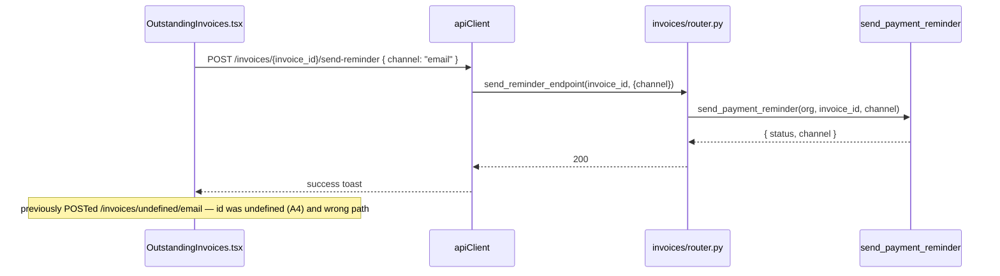

# Design Document: Reports Remediation

## Overview

The redesigned Reports hub (`frontend-v2/src/pages/reports/*`) renders, but most tabs silently show wrong or empty data because the frontend reads field names the backend never returns, several filters are dead, PDF/CSV export is fully non-functional, the redesign's "report library" landing is missing, and 12 routed report pages are unreachable. This feature fixes every issue documented in `docs/REPORTS_AUDIT.md` (sections A–E), grouped and traced by audit ID (A1, A2, C1, …).

The work spans three layers, all backward-compatible with the **old** `frontend/` which consumes the same `/reports/*` endpoints:

- **Backend** (`app/modules/reports/*`, `app/modules/organisations/router.py`): add missing response fields (additively — prefer adding over renaming, keep aliases), implement a real server-side CSV + WeasyPrint PDF export layer, add a fleet `vehicles[]` breakdown, populate the storage breakdown, and surface SMS package tiers + daily breakdown.
- **Frontend** (`frontend-v2/src/pages/reports/*`): fix every field-mapping mismatch, fix the broken export/reminder actions, rebuild the `ReportsPage` landing to match `OraInvoice_Handoff/app/Reports.html` (KPI row + overview charts + grouped Report Library), wire the 12 orphan report pages, and bring every tab up to the `safe-api-consumption.md` standard (AbortController, `?.`/`?? []`/`?? 0`, typed generics, correct dependency arrays).
- **Design tokens**: all new/rebuilt UI uses the v2 token classes per `frontend-redesign.md`.

This is a design-first spec; this document defines the architecture (HLD) and concrete signatures/pseudocode (LLD) that the requirements and tasks will be derived from.

---

## Goals & Non-Goals

**Goals**
- Every Reports tab shows correct, non-empty data sourced from fields the backend actually returns (A1–A6).
- Export (CSV + PDF) actually downloads correct, well-formed files for every report (C1).
- "Send Reminder", SMS package purchase, and the SMS daily chart all work (C2–C4).
- Dead filters are either implemented or removed; date-range presets and branch sourcing are consistent (B1–B3).
- All tabs satisfy `safe-api-consumption.md` (D1–D3).
- The Reports landing matches the redesign prototype and links every report, with correct module gating (E1–E3).

**Non-Goals**
- No changes to the old `frontend/` directory, `docker-compose*.yml` (other than nothing here), or live nginx configs.
- No new accounting/tax computation logic — the financial report pages (P&L, Balance Sheet, Aged Receivables, etc.) already exist and are only being *linked* (E2).
- No change to the meaning of existing fields; renames only ever happen alongside a retained alias.

---

## Backward-Compatibility Contract (CRITICAL)

The old `frontend/` consumes the same `/reports/*` endpoints. Therefore:

1. **Additive only.** New response fields (e.g. `monthly_breakdown`, `total_invoices`, `vehicles`, `daily_breakdown`, storage `breakdown`) are *added*; nothing existing is removed.
2. **Rename = add alias.** Where the audit prefers a rename (e.g. `invoice_count` → `total_invoices`), the backend returns **both** keys. The Pydantic model carries the canonical field plus a computed/aliased duplicate so neither frontend breaks.
3. **Export is opt-in.** Export only changes behaviour when `?export=csv|pdf` is present. With no `export` param the endpoints return the exact same JSON `response_model` they do today.
4. **Frontend fixes are isolated to `frontend-v2/`.** The old frontend's report pages are untouched.

---

## Architecture

### System context

```mermaid
graph TD
    subgraph Browser["frontend-v2 (React 18 + TS)"]
        RP["ReportsPage (rebuilt landing)"]
        TABS["Report tab components<br/>Revenue / InvoiceStatus / Outstanding /<br/>TopServices / GST / CustomerStatement /<br/>Carjam / SMS / Storage / Fleet"]
        LIB["ReportLibrary (grouped cards)"]
        EXP["ExportButtons (CSV/PDF)"]
        DRF["DateRangeFilter (controlled)"]
        API["apiClient (axios, /api/v1)"]
    end

    subgraph Backend["app/modules/reports + organisations (FastAPI async)"]
        RR["reports/router.py"]
        RS["reports/service.py"]
        REXP["reports/export.py (NEW)"]
        SCH["reports/schemas.py"]
        ORG["organisations/router.py (/org/sms-*)"]
    end

    subgraph Data["PostgreSQL 16 (RLS) + WeasyPrint"]
        DB[("invoices, line_items, credit_notes,\npayments, customers, fleet_accounts,\norganisations, sms_messages, audit_log")]
        WP["WeasyPrint (HTML→PDF)"]
    end

    RP --> TABS
    RP --> LIB
    TABS --> EXP
    TABS --> DRF
    TABS --> API
    EXP --> API
    API -->|GET /reports/*| RR
    API -->|GET /reports/*?export=csv\|pdf| RR
    API -->|GET /org/plan-sms-pricing| ORG
    API -->|POST /invoices/:id/send-reminder| Backend
    RR --> RS
    RR --> REXP
    RR --> SCH
    RS --> DB
    REXP --> RS
    REXP --> WP
    ORG --> DB
```

### Component map — Reports hub (frontend-v2)

| Component | File | Responsibility | Audit IDs |
|---|---|---|---|
| `ReportsPage` | `reports/ReportsPage.tsx` | **Rebuilt** landing: range seg (7D/30D/QTR/YR), KPI row, Revenue-by-month + Revenue-by-category panels, grouped Report Library | E1, E3 |
| `ReportLibrary` | `reports/ReportLibrary.tsx` (NEW) | Grouped cards (Financial / Sales & ops / Tax / Payroll / Usage / Automation) linking to all report routes, module-gated | E2, E3 |
| `ReportsLanding` data hook | `reports/useReportsOverview.ts` (NEW) | Fetch KPI + monthly + category series for the landing | E1 |
| `RevenueSummary` | `reports/RevenueSummary.tsx` | Read `invoice_count`/`total_invoices` + `monthly_breakdown` | A1, D1 |
| `InvoiceStatus` | `reports/InvoiceStatus.tsx` | Read `breakdown[]`/`total`, compute `total_invoices` | A2, D1, D3 |
| `OutstandingInvoices` | `reports/OutstandingInvoices.tsx` | Read `invoice_id`/`vehicle_rego`, derive status from `days_overdue`; fix reminder + branch dep | A4, B1, C2, D1, D2 |
| `TopServices` | `reports/TopServices.tsx` | Read `description`/`total_revenue` | A3, D1 |
| `FleetReport` | `reports/FleetReport.tsx` | Render `vehicles[]`; fleet account **picker** instead of raw UUID | A5, D1 |
| `StorageUsage` | `reports/StorageUsage.tsx` | Render real `breakdown[]` | A6, D1 |
| `SmsUsage` | `reports/SmsUsage.tsx` | Tiers from plan-pricing endpoint; render `daily_breakdown` | C3, C4, D1 |
| `GstReturnSummary` | `reports/GstReturnSummary.tsx` | Add AbortController + branch dep | D1, D2 |
| `CarjamUsage` | `reports/CarjamUsage.tsx` | Add AbortController | D1 |
| `CustomerStatement` | `reports/CustomerStatement.tsx` | Use `useBranch()` not localStorage; AbortController | B3, D1 |
| `DateRangeFilter` | `reports/DateRangeFilter.tsx` | Controlled — derive `preset` from `value`; fire on mount semantics consistent | B2 |
| `ExportButtons` | `reports/ExportButtons.tsx` | Send `export` param, stream blob with correct MIME + filename, surface errors | C1 |

### Component map — backend

| Endpoint | Router fn | Service fn | Change | Audit IDs |
|---|---|---|---|---|
| `GET /reports/revenue` | `revenue_report` | `get_revenue_summary` | add `monthly_breakdown[]` + `total_invoices` alias | A1 |
| `GET /reports/invoices/status` | `invoice_status_report` | `get_invoice_status_report` | (no backend change needed — FE maps `breakdown`) | A2 |
| `GET /reports/top-services` | `top_services_report` | `get_top_services` | (no backend change — FE maps `description`/`total_revenue`) | A3 |
| `GET /reports/outstanding` | `outstanding_invoices_report` | `get_outstanding_invoices` | optional `start_date`/`end_date` filter (B1 decision) | A4, B1 |
| `GET /reports/fleet/{id}` | `fleet_report` | `get_fleet_report` | add `vehicles[]` breakdown | A5 |
| `GET /reports/storage` | `storage_usage_report` | `get_storage_usage` | populate real `breakdown[]` via `calculate_org_storage` | A6 |
| `GET /reports/sms-usage` | `sms_usage_report` | `get_sms_usage` | add `daily_breakdown[]` | C4 |
| `GET /reports/*?export=csv\|pdf` | all report fns | NEW `reports/export.py` | server-side CSV + WeasyPrint PDF | C1 |
| `GET /org/plan-sms-pricing` (NEW) | NEW org fn | reads plan `sms_package_pricing` | expose tiers to org | C3 |
| `POST /invoices/{id}/send-reminder` | `send_reminder_endpoint` (exists) | `send_payment_reminder` (exists) | FE calls correct endpoint/body | C2 |

---

## Sequence Diagrams

### Revenue tab load (A1) with AbortController (D1)

```mermaid
sequenceDiagram
    participant U as User
    participant RV as RevenueSummary.tsx
    participant AC as AbortController
    participant API as apiClient
    participant RR as reports/router.py
    participant RS as get_revenue_summary

    U->>RV: select range / branch
    RV->>AC: new AbortController()
    RV->>API: GET /reports/revenue?start_date&end_date&branch_id (signal)
    API->>RR: request
    RR->>RS: get_revenue_summary(...)
    RS-->>RR: { invoice_count, total_invoices, monthly_breakdown[], ... }
    RR-->>API: 200 JSON
    API-->>RV: res.data
    RV->>RV: setData(res.data) — reads total_invoices ?? invoice_count, monthly_breakdown ?? []
    Note over RV,AC: unmount/re-fetch → AC.abort(); catch guards on signal.aborted
```

### Export flow (C1) — CSV + PDF

```mermaid
sequenceDiagram
    participant EB as ExportButtons.tsx
    participant API as apiClient
    participant RR as reports/router.py
    participant EXP as reports/export.py
    participant RS as report service fn
    participant WP as WeasyPrint

    EB->>API: GET /reports/revenue?...&export=csv (responseType: blob)
    API->>RR: request (export=csv)
    RR->>RS: fetch report dict
    RR->>EXP: render_report_csv(report_key, data)
    EXP-->>RR: text/csv bytes
    RR-->>API: 200 StreamingResponse + Content-Disposition: attachment; filename=revenue_2026-06-04.csv
    API-->>EB: blob + headers
    EB->>EB: filename from Content-Disposition; a.download; click()

    Note over EB,WP: PDF path
    EB->>API: GET /reports/revenue?...&export=pdf (responseType: blob)
    API->>RR: request (export=pdf)
    RR->>RS: fetch report dict
    RR->>EXP: render_report_pdf(report_key, data, org)
    EXP->>WP: await asyncio.to_thread(HTML(html).write_pdf)
    WP-->>EXP: application/pdf bytes
    EXP-->>RR: pdf bytes
    RR-->>API: 200 StreamingResponse + filename=revenue_2026-06-04.pdf
    API-->>EB: blob → download
```

### Send Reminder (C2) — correct endpoint



---

## Data Models & Schema Changes

All schema changes are **additive** to `app/modules/reports/schemas.py` (and one new org schema). Existing fields are retained.

| # | Schema | Field added | Type | Notes | Audit |
|---|---|---|---|---|---|
| 1 | `RevenueSummaryResponse` | `monthly_breakdown` | `list[RevenueMonthPoint]` | `[{month: "YYYY-MM", revenue: Decimal}]`, sorted asc | A1 |
| 2 | `RevenueSummaryResponse` | `total_invoices` | `int` | alias/duplicate of `invoice_count` (both returned) | A1 |
| 3 | `FleetReportResponse` | `vehicles` | `list[FleetVehicleRow]` | `[{rego, make, model, total_spend, last_service_date}]` | A5 |
| 4 | `StorageUsageResponse` | `breakdown` | `list[StorageBreakdownItem]` | populated (already in schema, currently `[]`) | A6 |
| 5 | `SmsUsageResponse` | `daily_breakdown` | `list[SmsDailyPoint]` | `[{date, sms_count}]` | C4 |
| 6 | `OutstandingInvoicesResponse` (optional) | period echo | `period_start/period_end` (only if B1 = implement) | only if date filter added | B1 |
| 7 | NEW `PlanSmsPricingResponse` | `sms_package_pricing` | `list[SmsPackageTierPricing]` | org-visible plan tiers (`GET /org/plan-sms-pricing`) | C3 |

New nested models:

```python
class RevenueMonthPoint(BaseModel):
    month: str            # "YYYY-MM"
    revenue: Decimal      # NZD, GST-inclusive total for the month

class FleetVehicleRow(BaseModel):
    rego: str
    make: str | None
    model: str | None
    total_spend: Decimal
    last_service_date: date | None

class SmsDailyPoint(BaseModel):
    date: date
    sms_count: int

class PlanSmsPricingResponse(BaseModel):
    sms_package_pricing: list[SmsPackageTierPricing]  # reuse admin schema shape
```

**No database migration is required** — every new value is computed from existing tables (`invoices`, `line_items`, `credit_notes`, `payments`, `sms_messages`, `notification_log`, `subscription_plans`, `organisations`) at query time.

---

## Request / Response Contracts (corrected)

The table below is the source-of-truth contract each frontend tab MUST consume after this change. "FE reads (now)" is the corrected mapping.

| Tab | Endpoint | FE reads (now) | Backend field | Audit |
|---|---|---|---|---|
| Revenue | `GET /reports/revenue` | `total_invoices ?? invoice_count`, `monthly_breakdown ?? []` | `invoice_count`, `total_invoices`, `monthly_breakdown[]` | A1 |
| Invoice Status | `GET /reports/invoices/status` | `breakdown ?? []`, `s.count`, `s.total`, `total_invoices = Σ count` | `breakdown[{status,count,total}]` | A2 |
| Top Services | `GET /reports/top-services` | `s.description`, `s.total_revenue` | `services[{description,count,total_revenue}]` | A3 |
| Outstanding | `GET /reports/outstanding` | `inv.invoice_id`, `inv.vehicle_rego`, status from `days_overdue` | `invoices[{invoice_id,vehicle_rego,days_overdue,...}]` | A4 |
| Fleet | `GET /reports/fleet/{id}` | `data.vehicles ?? []` | `vehicles[{rego,make,model,total_spend,last_service_date}]` | A5 |
| Storage | `GET /reports/storage` | `data.breakdown ?? []` | `breakdown[{category,bytes}]` | A6 |
| SMS | `GET /reports/sms-usage` | `data.daily_breakdown ?? []` | `daily_breakdown[{date,sms_count}]` | C4 |
| SMS tiers | `GET /org/plan-sms-pricing` | `sms_package_pricing ?? []` | `sms_package_pricing[{tier_name,sms_quantity,price_nzd}]` | C3 |
| Reminder | `POST /invoices/{invoice_id}/send-reminder` | body `{channel:'email'\|'sms'}` | existing endpoint | C2 |
| Export | `GET /reports/*?export=csv\|pdf` | blob + `Content-Disposition` filename | `StreamingResponse` | C1 |

---

## Low-Level Design (LLD)

All backend code follows project patterns: async SQLAlchemy, `flush()` not `commit()` in services, `await db.refresh()` after flush when returning ORM objects, branch scoping via `branch_id`, RLS-aware, all list responses wrapped as objects. WeasyPrint runs via `await asyncio.to_thread(...)` (matching `generate_invoice_pdf`, PERFORMANCE_AUDIT §B-H1). All frontend code follows `safe-api-consumption.md`.

### A1 — Revenue: `monthly_breakdown` query + `total_invoices` alias

**Backend** `app/modules/reports/service.py :: get_revenue_summary` — add a monthly series sub-query and the alias. The existing totals query is unchanged.

```python
# Monthly breakdown: GST-inclusive revenue grouped by calendar month (NZD).
# Reuses the same filters as the totals query (non-voided, non-draft, issue_date in range, branch).
month_query = (
    select(
        func.to_char(Invoice.issue_date, "YYYY-MM").label("month"),
        func.coalesce(
            func.sum(Invoice.total * Invoice.exchange_rate_to_nzd), 0
        ).label("revenue"),
    )
    .where(
        Invoice.org_id == org_id,
        Invoice.status != "voided",
        Invoice.status != "draft",
        Invoice.issue_date >= period_start,
        Invoice.issue_date <= period_end,
    )
)
if branch_id is not None:
    month_query = month_query.where(Invoice.branch_id == branch_id)
month_query = month_query.group_by("month").order_by("month")
month_rows = (await db.execute(month_query)).all()
monthly_breakdown = [
    {"month": r.month, "revenue": Decimal(str(r.revenue or 0)).quantize(Decimal("0.01"))}
    for r in month_rows
]

return {
    ...,                              # existing keys unchanged
    "invoice_count": count,           # retained
    "total_invoices": count,          # NEW alias (backward-compat for both frontends)
    "monthly_breakdown": monthly_breakdown,  # NEW
}
```

**Schema** — add fields to `RevenueSummaryResponse` (additive):

```python
class RevenueSummaryResponse(BaseModel):
    ...                                       # existing fields unchanged
    total_invoices: int = Field(0, description="Alias of invoice_count for frontend compatibility")
    monthly_breakdown: list[RevenueMonthPoint] = Field(default_factory=list)
```

**Frontend** `RevenueSummary.tsx` — read the alias defensively (works whether or not backend redeploys):

```typescript
interface RevenueData {
  total_revenue: number
  total_gst: number
  invoice_count?: number
  total_invoices?: number
  monthly_breakdown?: { month: string; revenue: number }[]
  total_refunds?: number; refund_gst?: number; net_revenue?: number; net_gst?: number
}
// render:
const invoiceCount = data.total_invoices ?? data.invoice_count ?? 0
const months = data.monthly_breakdown ?? []
```

**Correctness property (PBT-able):** for any revenue dataset, `Σ monthly_breakdown[i].revenue == total_inclusive` (within rounding), and `total_invoices == invoice_count`.

### A2 — Invoice Status: FE maps `breakdown`/`total` (no backend change)

```typescript
interface StatusRow { status: string; count: number; total: number }
interface InvoiceStatusData { breakdown?: StatusRow[]; period_start?: string; period_end?: string }

const rows = data.breakdown ?? []
const totalInvoices = rows.reduce((sum, r) => sum + (r.count ?? 0), 0)
// table reads r.total (not r.total_amount); chart maps r.count
```

**Correctness property:** `Σ breakdown[i].count == totalInvoices`.

### A3 — Top Services: FE maps `description`/`total_revenue`

```typescript
interface ServiceRow { description: string; count: number; total_revenue: number }
const services = data.services ?? []
// row.description (was service_name); row.total_revenue (was revenue)
```

### A4 + C2 — Outstanding: field fix, derived status, correct reminder

```typescript
interface OutstandingInvoice {
  invoice_id: string
  invoice_number: string | null
  customer_name: string
  vehicle_rego: string | null
  total: number
  balance_due: number
  due_date: string | null
  days_overdue: number
}
function deriveStatus(daysOverdue: number): { label: string; variant: 'danger' | 'warn' } {
  return daysOverdue > 0
    ? { label: 'Overdue', variant: 'danger' }
    : { label: 'Outstanding', variant: 'warn' }
}
// key={inv.invoice_id ?? i}; rego = inv.vehicle_rego ?? '—'

async function sendReminder(invoiceId: string, signal: AbortSignal) {
  setSending(invoiceId)
  try {
    await apiClient.post(`/invoices/${invoiceId}/send-reminder`, { channel: 'email' }, { signal })
    toast.success('Reminder sent')
  } catch (err) {
    if (!signal.aborted) toast.error(getErrorDetail(err) ?? 'Failed to send reminder')
  } finally {
    setSending(null)
  }
}
```

**Correctness property:** for every row, `sendReminder` posts to `/invoices/${invoice_id}/send-reminder` where `invoice_id` is a non-empty string (never `undefined`).

### A5 — Fleet: backend `vehicles[]` query + frontend account picker

**Backend** `get_fleet_report` — add a per-vehicle aggregate over the fleet's customers within the period:

```python
veh_rows = (await db.execute(
    select(
        Invoice.vehicle_rego.label("rego"),
        Invoice.vehicle_make.label("make"),
        Invoice.vehicle_model.label("model"),
        func.coalesce(func.sum(Invoice.total), 0).label("total_spend"),
        func.max(Invoice.issue_date).label("last_service_date"),
    )
    .where(
        Invoice.org_id == org_id,
        Invoice.customer_id.in_(customer_ids),
        Invoice.status.notin_(["voided", "draft"]),
        Invoice.vehicle_rego.isnot(None),
        Invoice.issue_date >= period_start,
        Invoice.issue_date <= period_end,
    )
    .group_by(Invoice.vehicle_rego, Invoice.vehicle_make, Invoice.vehicle_model)
    .order_by(func.sum(Invoice.total).desc())
)).all()
vehicles = [
    {"rego": r.rego, "make": r.make, "model": r.model,
     "total_spend": Decimal(str(r.total_spend or 0)), "last_service_date": r.last_service_date}
    for r in veh_rows
]
# add "vehicles": vehicles to the returned dict (and the empty-fleet branch returns "vehicles": [])
```

**Frontend** `FleetReport.tsx` — replace the raw-UUID `Input` with a fleet account picker backed by `GET /customers/fleet-accounts`, and read `data.vehicles ?? []`.

```typescript
// fetch fleet accounts for the picker
const res = await apiClient.get<{ fleet_accounts: FleetAccount[] }>('/customers/fleet-accounts',
  { params: { limit: 100 }, signal })
const accounts = res.data?.fleet_accounts ?? []
// <Select> of accounts → selectedFleetId drives GET /reports/fleet/{selectedFleetId}
const vehicles = data?.vehicles ?? []
```

**Correctness property:** `Σ vehicles[i].total_spend <= total_spend` (sum of per-vehicle spend never exceeds the fleet total; equal when every invoice has a rego).

### A6 — Storage breakdown (populate via existing `calculate_org_storage`)

**Backend** `get_storage_usage` — reuse `app/modules/storage/service.calculate_org_storage` which already returns a per-category breakdown (Invoices / Customers / Vehicles):

```python
from app.modules.storage.service import calculate_org_storage
storage = await calculate_org_storage(db, org_id)
return {
    "used_bytes": used_bytes,
    "used_gb": used_gb,
    "quota_gb": quota_gb,
    "usage_percent": round(percentage, 2),
    "breakdown": storage["breakdown"],   # was hard-coded []
}
```

**Frontend** `StorageUsage.tsx` — already guards `data.breakdown ?? []`; only needs AbortController (D1). The breakdown table now renders real rows.

**Correctness property:** `Σ breakdown[i].bytes` is consistent with the storage calc total (the bar and table agree in order of magnitude; the bar uses `used_bytes`).

### C1 — Export layer (server-side CSV + WeasyPrint PDF)

**NEW** `app/modules/reports/export.py` — a registry mapping each report key to (a) a CSV row builder and (b) a PDF context builder, plus generic renderers.

```python
# app/modules/reports/export.py
import csv, io, asyncio
from typing import Callable
from weasyprint import HTML
from jinja2 import Environment, FileSystemLoader

# Each report registers: header row + a function turning the report dict into rows.
CsvBuilder = Callable[[dict], tuple[list[str], list[list]]]  # (header, rows)

def _revenue_csv(data: dict) -> tuple[list[str], list[list]]:
    header = ["Month", "Revenue (NZD)"]
    rows = [[m["month"], f'{m["revenue"]:.2f}'] for m in data.get("monthly_breakdown", [])]
    rows.append(["TOTAL", f'{data.get("total_inclusive", 0):.2f}'])
    return header, rows

def _invoice_status_csv(data: dict) -> tuple[list[str], list[list]]:
    header = ["Status", "Count", "Total (NZD)"]
    return header, [[b["status"], b["count"], f'{b["total"]:.2f}'] for b in data.get("breakdown", [])]

# ... one builder per report key (top_services, outstanding, gst_return, fleet, storage, sms, carjam, customer_statement)

CSV_BUILDERS: dict[str, CsvBuilder] = {
    "revenue": _revenue_csv,
    "invoice_status": _invoice_status_csv,
    # ...
}

def render_report_csv(report_key: str, data: dict) -> bytes:
    """Render a report dict to UTF-8 CSV bytes. Pure function (PBT-able)."""
    header, rows = CSV_BUILDERS[report_key](data)
    buf = io.StringIO()
    w = csv.writer(buf)
    w.writerow(header)
    w.writerows(rows)
    return buf.getvalue().encode("utf-8")

async def render_report_pdf(report_key: str, data: dict, org) -> bytes:
    """Render a report to PDF via WeasyPrint, off the event loop."""
    env = Environment(loader=FileSystemLoader("app/modules/reports/templates"))
    template = env.get_template(f"{report_key}.html")  # falls back to generic.html
    html = template.render(data=data, org=org, generated_at=...)
    return await asyncio.to_thread(lambda: HTML(string=html).write_pdf())
```

**Router** — a single helper applied in each endpoint after the report dict is built:

```python
# app/modules/reports/router.py
from fastapi.responses import StreamingResponse
from app.modules.reports.export import render_report_csv, render_report_pdf

async def _maybe_export(report_key: str, export, data: dict, db, org_id):
    """Return a StreamingResponse when export is requested, else None."""
    if export is None:
        return None
    today = date.today().isoformat()
    filename = f"{report_key}_{today}.{export.value}"
    if export == ExportFormat.csv:
        body = render_report_csv(report_key, data)
        media = "text/csv"
    else:  # pdf
        org = (await db.execute(select(Organisation).where(Organisation.id == org_id))).scalar_one()
        body = await render_report_pdf(report_key, data, org)
        media = "application/pdf"
    return StreamingResponse(
        iter([body]),
        media_type=media,
        headers={"Content-Disposition": f'attachment; filename="{filename}"'},
    )

# in revenue_report (and every other report endpoint):
data = await get_revenue_summary(...)
maybe = await _maybe_export("revenue", export, data, db, org_id)
if maybe is not None:
    return maybe
return RevenueSummaryResponse(**data)
```

**Frontend** `ExportButtons.tsx` — send `export` (not `format`), derive filename from `Content-Disposition`, surface errors:

```typescript
const handleExport = async (fmt: 'pdf' | 'csv') => {
  setExporting(fmt)
  const controller = new AbortController()
  try {
    const res = await apiClient.get(endpoint, {
      params: { ...params, export: fmt },   // was `format`
      responseType: 'blob',
      signal: controller.signal,
    })
    const cd = res.headers['content-disposition'] ?? ''
    const match = /filename="?([^"]+)"?/.exec(cd)
    const filename = match?.[1] ?? `report.${fmt}`
    const mime = fmt === 'pdf' ? 'application/pdf' : 'text/csv'
    const url = URL.createObjectURL(new Blob([res.data], { type: mime }))
    const a = document.createElement('a'); a.href = url; a.download = filename; a.click()
    URL.revokeObjectURL(url)
  } catch (err) {
    if (!controller.signal.aborted) toast.error('Export failed. Please try again.')
  } finally {
    setExporting(null)
  }
}
```

**Correctness property (PBT-able):** for any report dict, the CSV produced by `render_report_csv` round-trips the JSON figures — parsing the CSV back yields the same numeric values (per row) that were in the report dict (within 2dp formatting).

### C3 — SMS package tiers from the plan

**Backend** NEW `GET /org/plan-sms-pricing` in `app/modules/organisations/router.py` (org_admin), returning the org plan's `sms_package_pricing`:

```python
@router.get("/plan-sms-pricing", dependencies=[require_role("org_admin")])
async def get_org_plan_sms_pricing(request: Request, db: AsyncSession = Depends(get_db_session)):
    org_id = uuid.UUID(getattr(request.state, "org_id"))
    row = (await db.execute(
        select(SubscriptionPlan.sms_package_pricing)
        .select_from(Organisation)
        .join(SubscriptionPlan, Organisation.plan_id == SubscriptionPlan.id)
        .where(Organisation.id == org_id)
    )).scalar_one_or_none()
    return PlanSmsPricingResponse(sms_package_pricing=row or [])
```

**Frontend** `SmsUsage.tsx :: fetchTiers` — read tiers from the new endpoint:

```typescript
const res = await apiClient.get<{ sms_package_pricing?: SmsPackageTier[] }>('/org/plan-sms-pricing', { signal })
setTiers(res.data?.sms_package_pricing ?? [])
```

The purchase dialog and `POST /org/sms-packages/purchase` are already wired — only the tiers source was dead.

### C4 — SMS daily breakdown

**Backend** `get_sms_usage` — add a daily series from the same two sources used for the total (`sms_messages` outbound + `notification_log` sms, non-failed):

```python
daily_rows = (await db.execute(_text(
    "SELECT d::date AS day, "
    " (SELECT COUNT(*) FROM sms_messages WHERE org_id = :oid AND direction='outbound' "
    "    AND created_at::date = d::date) "
    " + (SELECT COUNT(*) FROM notification_log WHERE org_id = :oid AND channel='sms' "
    "    AND status != 'failed' AND created_at::date = d::date) AS cnt "
    "FROM generate_series(:start::date, :end::date, '1 day') d"
), {"oid": str(org_id), "start": date_from, "end": date_to})).all()
daily_breakdown = [{"date": r.day, "sms_count": int(r.cnt or 0)} for r in daily_rows if r.cnt]
# add "daily_breakdown": daily_breakdown to the returned dict
```

**Frontend** `SmsUsage.tsx` — already guards `data.daily_breakdown` for the chart; now it renders.

### B1 — Outstanding date filter

Decision: **remove** the `DateRangeFilter` from the Outstanding tab (outstanding is point-in-time and the backend ignores dates), and remove `start_date`/`end_date` from its fetch + export params. (Alternative — implement backend `issue_date` filtering — is documented but not chosen, to avoid changing the semantic of "all open invoices".)

### B2 — `DateRangeFilter` controlled

Derive `preset` from the `value` prop so the label always reflects the queried range:

```typescript
function presetFromValue(value: DateRange): Preset {
  // compare value against presetRange(p) for each preset; return the match or 'custom'
}
export default function DateRangeFilter({ value, onChange }: Props) {
  const preset = presetFromValue(value)  // derived, not local state
  // custom inputs shown when preset === 'custom'
}
```

Each tab seeds its initial range from `presetRange('month')` so the dropdown label and the data agree on mount.

### B3 — Branch sourcing

`CustomerStatement.tsx` — replace `localStorage.getItem('selected_branch_id')` with `const { selectedBranchId } = useBranch()` and include it in params + the `useCallback` dependency array.

### D1 — AbortController on every tab (canonical pattern)

```typescript
useEffect(() => {
  const controller = new AbortController()
  const run = async () => {
    setLoading(true); setError('')
    try {
      const res = await apiClient.get<T>(endpoint, { params, signal: controller.signal })
      setData(res.data)               // render path guards every nested access with ?. / ?? [] / ?? 0
    } catch (err) {
      if (!controller.signal.aborted) setError('Failed to load …')
    } finally {
      if (!controller.signal.aborted) setLoading(false)
    }
  }
  run()
  return () => controller.abort()
}, [/* range, selectedBranchId, ... */])
```

Applies to: Revenue, InvoiceStatus, Outstanding, TopServices, GstReturnSummary, CarjamUsage, SmsUsage, StorageUsage, CustomerStatement, FleetReport.

### D2 — Dependency arrays

`OutstandingInvoices.tsx` and `GstReturnSummary.tsx` `fetchData` `useCallback` deps must include `selectedBranchId` (they read it in the body). Revenue already does.

### D3 — Safe reads

Every `setData(res.data)` tab reads scalars with `?? 0` and arrays with `?? []` in the render path (Pattern 4/6). Typed generics on all `apiClient.get<T>` calls; no `as any`.

### E1 — Rebuilt `ReportsPage` landing (matches `OraInvoice_Handoff/app/Reports.html`)

```
ReportsPage
├── page-head: eyebrow "Overview" + h1 "Reports" + sub "Financial & operational insights"
│   └── head-actions: range seg [7D] [30D*] [QTR] [YR]   (drives useReportsOverview)
├── KPI row (4 cards): Revenue · Gross profit · Avg invoice · Jobs completed
│       (Revenue+Avg invoice from /reports/revenue; Gross profit + Jobs gated/derived,
│        fall back to "—" when source unavailable; all values via ?? 0)
├── two-col grid:
│   ├── "Revenue by month" card  → SimpleBarChart(monthly_breakdown)  [Export link → CSV]
│   └── "Revenue by category" card → progress bars (Labour/Parts/Tyres/Other) from top-services grouped
└── ReportLibrary  (grouped cards — E2)
```

Component structure (TSX skeleton):

```tsx
export default function ReportsPage() {
  const [seg, setSeg] = useState<'7D'|'30D'|'QTR'|'YR'>('30D')
  const { kpis, monthly, categories, loading, error } = useReportsOverview(seg)  // AbortController inside
  return (
    <div className="px-4 py-6 sm:px-6 lg:px-8">
      <header className="flex items-end justify-between mb-6 no-print">
        <div>
          <p className="text-xs uppercase tracking-wide text-muted-2">Overview</p>
          <h1 className="text-2xl font-semibold text-text">Reports</h1>
          <p className="text-sm text-muted">Financial &amp; operational insights</p>
        </div>
        <RangeSeg value={seg} onChange={setSeg} />            {/* 7D/30D/QTR/YR */}
      </header>
      <KpiRow kpis={kpis} loading={loading} />                {/* 4 cards, ?? 0 guards */}
      <div className="grid grid-cols-1 lg:grid-cols-[1.5fr_1fr] gap-[22px] mb-[22px]">
        <RevenueByMonthCard data={monthly ?? []} />
        <RevenueByCategoryCard data={categories ?? []} />
      </div>
      <ReportLibrary />                                       {/* E2 */}
    </div>
  )
}
```

Tokens: cards `bg-card border border-border rounded-card shadow-card`, `--pad`/`--gap` rhythm, `font-mono` for numbers, range seg styled as `.seg`. Charts use the existing `SimpleBarChart` and CSS progress bars (no new chart lib).

**Note on the existing tab strip:** the per-report tab views remain reachable as destinations. The landing's Report Library links to the routed pages (E2); the financially-important reports (P&L / Balance Sheet / Aged Receivables / Tax) are surfaced in the library (E3) with their existing module gating.

### E2 — `ReportLibrary` (grouped, module-gated, links the 12 orphan pages)

```tsx
interface ReportCard {
  title: string; desc: string; to: string;
  module?: string;            // ModuleGate slug; undefined = always visible
  tradeFamily?: string;       // optional trade gate
}
const GROUPS: { label: string; cards: ReportCard[] }[] = [
  { label: 'Financial', cards: [
    { title: 'Profit & Loss',        desc: 'Income vs expenses',     to: '/reports/profit-loss',     module: 'accounting' },
    { title: 'Balance sheet',        desc: 'Assets & liabilities',   to: '/reports/balance-sheet',   module: 'accounting' },
    { title: 'Revenue summary',      desc: 'By month & category',    to: '/reports?tab=revenue' },
    { title: 'Aged receivables',     desc: 'Who owes you what',      to: '/reports/aged-receivables', module: 'accounting' },
    { title: 'Outstanding invoices', desc: 'Unpaid & overdue',       to: '/reports?tab=outstanding' },
    { title: 'Customer statement',   desc: 'Per-account activity',   to: '/reports?tab=customer-statement' },
  ]},
  { label: 'Sales & operations', cards: [
    { title: 'Invoice status',  desc: 'Pipeline by status',          to: '/reports?tab=invoice-status' },
    { title: 'Top services',    desc: 'Best-sellers by revenue',     to: '/reports?tab=top-services' },
    { title: 'Job report',      desc: 'Completed jobs & recovery',   to: '/reports/jobs',         module: 'jobs' },
    { title: 'Fleet report',    desc: 'Fleet account servicing',     to: '/reports?tab=fleet',    module: 'vehicles' },
    { title: 'POS report',      desc: 'Register sales & tenders',    to: '/reports/pos',          module: 'pos' },
    { title: 'Hospitality',     desc: 'Covers & daypart sales',      to: '/reports/hospitality',  module: 'kitchen_display' },
    { title: 'Project report',  desc: 'Budget vs actual',            to: '/reports/projects',     module: 'projects' },
    { title: 'Inventory valuation', desc: 'Stock on hand value',     to: '/reports/inventory',    module: 'inventory' },
  ]},
  { label: 'Tax & compliance', cards: [
    { title: 'GST return',        desc: 'Period summary for IRD',    to: '/reports?tab=gst-return' },
    { title: 'Income tax summary',desc: 'Provisional tax',           to: '/reports/tax-return',   module: 'accounting' },
  ]},
  { label: 'Payroll & people', cards: [
    { title: 'Wage variance', desc: 'Rostered vs actual',            to: '/reports/wage-variance', module: 'payroll' },
  ]},
  { label: 'Usage & system', cards: [
    { title: 'CARJAM usage',  desc: 'Vehicle data lookups',          to: '/reports?tab=carjam-usage', module: 'vehicles' },
    { title: 'SMS usage',     desc: 'Messages & spend',              to: '/reports?tab=sms-usage' },
    { title: 'Storage usage', desc: 'Files by type',                 to: '/reports?tab=storage' },
  ]},
  { label: 'Automation', cards: [
    { title: 'Scheduled reports', desc: 'Automated delivery',        to: '/reports/scheduled' },
    { title: 'Report builder',    desc: 'Custom report from any data', to: '/reports/builder' },
  ]},
]
```

Each card is gated with the existing `ModuleGate`/`useModules` (and trade family where relevant) so a card only shows when its module is enabled — matching the gating already enforced on the routes in `App.tsx` (`accounting`, `payroll`, `vehicles`, etc.). In-hub tabs (revenue/outstanding/etc.) deep-link via the existing `urlPersist` Tabs query param.

### E3 — Surface financial reports

The Report Library's Financial + Tax groups already include P&L, Balance Sheet, Aged Receivables, and Income Tax (each `accounting`/`payroll` gated). No separate work beyond E2.

---

## Error Handling

| Scenario | Behaviour |
|---|---|
| Report fetch fails (network/5xx) | tab shows inline error banner (`role="alert"`), retain last good data is not required; `catch` guarded by `signal.aborted` |
| Export fails | toast error "Export failed. Please try again." (no more silent `catch {}`) |
| Reminder send fails | toast error with backend `detail` if present |
| Empty dataset | each tab/section shows its existing empty-state row/message; landing KPIs show "—" via `?? 0`/fallback |
| Module disabled | Report Library card hidden; route guard already redirects |
| Malformed `{}` response | safe reads (`?. / ?? [] / ?? 0`) prevent crashes (D3) |
| WeasyPrint render error (PDF) | endpoint returns 500 with detail; FE surfaces export-failed toast |

---

## Correctness Properties

*A property is a characteristic or behavior that should hold true across all valid executions of a system-essentially, a formal statement about what the system should do. Properties serve as the bridge between human-readable specifications and machine-verifiable correctness guarantees.*

### Property 1: Revenue monthly breakdown sums to the period total and the alias mirrors the count

*For any* invoice dataset over a period, the sum of `monthly_breakdown[i].revenue` SHALL equal `total_inclusive` within a 0.01 rounding tolerance, and `total_invoices` SHALL equal `invoice_count`.

**Validates: Requirements 1.1, 1.2, 1.3**

### Property 2: Invoice-status counts sum to the total invoice count

*For any* invoice-status breakdown, the sum of `count` across all `breakdown` rows SHALL equal the displayed total-invoices figure.

**Validates: Requirements 2.3**

### Property 3: CSV export round-trips the report figures

*For any* report dictionary, parsing the CSV produced by `render_report_csv` SHALL recover the same numeric figures (per row) that were present in the report dictionary, to two decimal places.

**Validates: Requirements 10.5**

### Property 4: Date-range presets are ordered and round-trip

*For any* non-custom preset `p`, `presetRange(p)` SHALL yield a range whose start date is less than or equal to its end date, and `presetFromValue(presetRange(p))` SHALL equal `p`.

**Validates: Requirements 12.4, 12.5**

### Property 5: Report tabs never crash on empty, null, or partial responses

*For any* response payload that is `{}`, `null`, or a partial object, every report tab render SHALL complete without throwing.

**Validates: Requirements 14.4**

### Property 6: SMS daily breakdown sums to the total sent

*For any* outbound-message dataset within a selected period, the sum of `daily_breakdown[i].sms_count` SHALL equal `total_sent`.

**Validates: Requirements 9.2**

---

## Testing Strategy

### Unit / integration (backend, pytest)
- `get_revenue_summary`: asserts `monthly_breakdown` present, sorted, sums to `total_inclusive`; `total_invoices == invoice_count`.
- `get_fleet_report`: asserts `vehicles[]` present and per-vehicle spend sums consistently.
- `get_storage_usage`: asserts `breakdown` is non-empty when org has data.
- `get_sms_usage`: asserts `daily_breakdown` present and per-day counts sum to `total_sent`.
- `render_report_csv`: golden-file per report key; export endpoints return `text/csv` / `application/pdf` with `Content-Disposition`.
- `GET /org/plan-sms-pricing`: returns the plan's tiers; `[]` when plan has none.
- Backward-compat: with no `export` param, every endpoint returns the unchanged JSON shape (old-frontend contract preserved).

### Property-based tests (Hypothesis backend / fast-check frontend)
**Library:** Hypothesis (Python), fast-check (TS).
- **P1 (A1):** for arbitrary invoice sets, `Σ monthly_breakdown.revenue == total_inclusive` (within 0.01).
- **P2 (A2):** for arbitrary status breakdowns, `Σ breakdown.count == total_invoices`.
- **P3 (C1):** CSV round-trip — parsing `render_report_csv(key, data)` recovers the same numeric figures as `data` (per row, 2dp).
- **P4 (B2):** date-range presets always yield `start <= end`, and `presetFromValue(presetRange(p)) == p` for every non-custom preset.
- **P5 (D3):** safe-consumption — every tab render is crash-free for `{}`, `null`, and partial responses (fast-check feeding arbitrary partial objects).
- **P6 (C4):** `Σ daily_breakdown.sms_count == total_sent` for arbitrary message datasets in range.

### Frontend unit (Vitest + RTL)
- Each fixed tab renders correct values against a mocked corrected response.
- `ExportButtons` sends `export` param and triggers a download with the `Content-Disposition` filename.
- `OutstandingInvoices` posts to `/invoices/{invoice_id}/send-reminder` (never `undefined`).
- `DateRangeFilter` label matches the queried range (controlled).
- `ReportLibrary` hides cards whose module is disabled.

---

## Performance Considerations
- New monthly/daily/breakdown queries are simple grouped aggregates over already-indexed columns (`org_id`, `issue_date`, `created_at`); negligible cost.
- PDF export runs via `asyncio.to_thread` so WeasyPrint never blocks the event loop (consistent with `generate_invoice_pdf`, PERFORMANCE_AUDIT §B-H1).
- The rebuilt landing issues one overview fetch per range change (debounced via the seg control), not per-tab.

## Security Considerations
- All endpoints keep their existing `require_role` guards (`org_admin`/`salesperson`; GST + storage/sms = `org_admin`).
- All queries remain RLS-aware and branch-scoped via `branch_id`.
- Export streams in-memory bytes; nothing is persisted to disk (consistent with invoice PDF policy).
- `GET /org/plan-sms-pricing` exposes only plan pricing tiers (no secrets), org_admin-gated.

## Dependencies
- Existing: WeasyPrint, Jinja2 (already used for invoice PDFs), `app/modules/storage/service.calculate_org_storage`, `send_payment_reminder`, `GET /customers/fleet-accounts`.
- Frontend: existing `SimpleBarChart`, `useBranch`, `useModules`, `ModuleGate`, toast utility, `apiClient`.
- No new third-party packages. No DB migration.

## Backward-Compatibility Summary (re-affirmed)
- `frontend/` (old) untouched; consumes the same endpoints which keep all existing fields.
- New backend fields are additive; `invoice_count` retained alongside the new `total_invoices` alias.
- `?export=` is the only behavioural switch; default JSON responses are byte-identical to today.
- No changes to `docker-compose*.yml`, nginx, or the old frontend.
