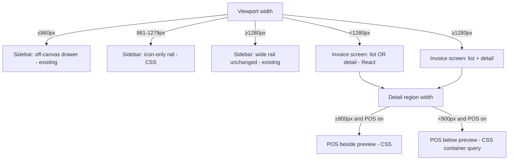

# Design Document

## Overview

This feature makes the invoice screen (`frontend-v2/src/pages/invoices/InvoiceList.tsx`)
and the global app shell (`frontend-v2/src/layouts/OrgLayout.tsx` +
`frontend-v2/src/components/shell/Sidebar.tsx`) degrade gracefully as the viewport
narrows, instead of letting four horizontally-competing regions (264px sidebar rail,
`w-80 min-w-[320px]` invoice list, `flex-1` invoice preview, `w-[280px]` POS panel)
crush or clip the preview at intermediate widths.

The change is **frontend-only** — responsive CSS plus a minimal amount of React layout
state. No backend, database, or API changes. Nothing about how invoices are fetched
changes: `selectedId`-keyed detail fetching, `posPreviewEnabled`, `selectedPreview`,
and the in-file print `<style>` block all stay exactly as they are.

The design introduces three responsive tiers and a no-clip safety net, and it is
deliberately built so that **CSS handles everything that is purely about width**, and
**React state handles only what genuinely depends on application intent** (which pane a
narrow-screen user is looking at, and where focus should land after a transition).

### Breakpoint vocabulary (from the requirements Glossary)

| Name | Value | Basis |
|------|-------|-------|
| `Drawer_Breakpoint` | `max-width: 860px` | existing `max-mobile` variant — viewport |
| `POS_Stack_Threshold` | `900px` | the **Invoice_Detail_Region's own width** (not viewport) |
| `Compact_Band` | `861px–1279px` inclusive | viewport |
| `Wide_Threshold` | `1280px` | viewport |

## Architecture

### Responsive tiers and the mechanism that drives each

The feature spans two concerns — the **app shell sidebar** and the **invoice screen
master/detail + POS** — that respond to width independently. The table below is the
core of the design: each behavior is assigned to the lightest mechanism that can express
it correctly.

| Concern | Trigger | Mechanism | Why |
|---------|---------|-----------|-----|
| Sidebar: drawer | viewport `≤860px` | **existing** CSS (`shell.css` + `max-mobile:`), unchanged | already shipped; must not regress |
| Sidebar: icon-only rail | viewport `861–1279px` (Compact_Band) | **CSS media query** scoped to `.shell-sidebar` | pure width → CSS; no state, no persistence |
| Sidebar: wide rail (current appearance) | viewport `≥1280px` | left as-is (current rail, Compact_Band CSS does not match) | wide tier renders exactly as today |
| Master/detail: both vs single pane | viewport `≥1280px` vs `<1280px` | **React** `matchMedia` (`isWide`) + conditional render | depends on route/`isCreating` + back intent, not width alone |
| Back-to-list control visibility | `<1280px` AND detail shown | **React** (derived from `isWide` + pane state) | tied to the same state machine |
| POS panel: beside vs stacked below | **detail-region width** `<900px` | **CSS container query** on the detail region | threshold is region width, not viewport — container query is the natural fit |
| POS panel: shown at all | `posPreviewEnabled` | **existing** React conditional, unchanged | org setting, not responsive |
| No-clip safety net | all widths | **CSS** (`min-w-0` + `overflow-x-auto`) | purely presentational containment |
| Focus management on transition | tier crossing / back activation | **React** (`matchMedia` change + refs) | focus is imperative, not declarative |

The guiding rule: the only places React is involved are (a) the master/detail single-pane
decision (which needs `selectedId` and a "back to list" intent that CSS cannot represent)
and (b) focus management across transitions (which is inherently imperative). Everything
else — the icon-only rail, the POS stacking, the safety net — is CSS.

### Why a container query for POS stacking

`POS_Stack_Threshold` is defined against the **Invoice_Detail_Region width**, not the
viewport. The detail region's width is itself a function of the sidebar tier and the
master/detail tier (e.g. at 1280px viewport with a labeled rail and the list column shown,
the detail region is far narrower than the viewport). A viewport media query cannot
express "when *this region* is below 900px". A CSS container query on the detail region
reacts to the region's own inline size, so the POS panel stacks correctly regardless of
what the sidebar or list column are doing — and with no resize listener.



## Components and Interfaces

### 1. Invoice screen master/detail (`InvoiceList.tsx`)

Today the page renders both regions unconditionally:

```tsx
<div className="flex h-full overflow-hidden bg-canvas" data-testid="invoice-list">
  <div className="w-80 min-w-[320px] ..." data-print-hide> {/* list */} </div>
  <div className="flex-1 flex flex-col overflow-hidden" data-print-content> {/* detail */} </div>
</div>
```

The redesign keeps this structure at the Wide tier and conditionally renders **one** region
below it. A tiny pure helper decides what is visible; the component renders from its result.

New state added to the component:

- `isWide: boolean` — from a `useMediaQuery('(min-width: 1280px)')` hook backed by
  `window.matchMedia` (a `change` listener, **not** a `resize` listener). This is the only
  viewport observation in the feature.
- `narrowPane: 'list' | 'detail'` — which pane a sub-1280px user is viewing. This is an
  explicit **intent**, not a function of `hasSelection`: because the list auto-selects a
  first invoice on load (`fetchInvoices` calls `setSelectedId(invoices[0].id)` when nothing
  is selected), driving the narrow pane off `hasSelection` would wrongly show the detail on
  a bare load. Instead `narrowPane` is **initialized from the route at mount** and only
  changed by explicit user actions:
  - `routeId` present (deep link to `/invoices/:id`) → `'detail'`;
  - `isCreating` (`/invoices/new`) → `'detail'` (the Create_View occupies the detail pane);
  - otherwise → `'list'` (Req 1.7–1.9).
  Initial value: `(routeId || isCreating) ? 'detail' : 'list'`. Set to `'detail'` when a row
  is selected on a narrow screen, set to `'list'` by the Back_To_List_Control. Ignored at
  the Wide tier.

`selectedId`, `selectedIdRef`, `invoice`, and the `selectedId`-keyed `fetchDetail` effect
are **unchanged** — crossing the breakpoint never mutates `selectedId`, so the selected
invoice is preserved and never refetched (Req 1.5). Critically, the auto-select effect
(`setSelectedId(invoices[0].id)` in `fetchInvoices`) **does not** touch `narrowPane`, so a
fresh narrow load without a `routeId` stays on the list even though an invoice becomes
selected (Req 1.8, 1.9).

#### Pure pane-resolution helper

To keep the JSX declarative and the logic unit-testable, extract a pure function (e.g. in
`frontend-v2/src/pages/invoices/responsiveLayout.ts`). It takes an explicit `isCreating`
input so the Create_View forces the detail pane below the Wide tier independently of
selection:

```ts
export type NarrowPane = 'list' | 'detail'

export interface PaneVisibility {
  showList: boolean
  showDetail: boolean
  showBackControl: boolean
}

export function resolvePaneVisibility(
  isWide: boolean,
  hasSelection: boolean,
  narrowPane: NarrowPane,
  isCreating: boolean,
): PaneVisibility {
  if (isWide) {
    // Side-by-side unchanged, including the Create_View (Req 8.3).
    return { showList: true, showDetail: true, showBackControl: false }
  }
  // Below Wide: the Create_View is the sole pane with a Back control (Req 8.1, 8.2).
  const showDetail = isCreating || (hasSelection && narrowPane === 'detail')
  return { showList: !showDetail, showDetail, showBackControl: showDetail }
}
```

Narrow truth table (`isWide = false`):

| `isCreating` | `hasSelection` | `narrowPane` | showList | showDetail | showBackControl |
|---|---|---|---|---|---|
| true | * | * | false | true | true |
| false | false | * | true | false | false |
| false | true | `list` | true | false | false |
| false | true | `detail` | false | true | true |

At `isWide = true`, every input combination yields `showList && showDetail && !showBackControl`.

This single function encodes Req 1.1–1.4, 1.6, 2.1, 2.2, 8.1–8.3. The component renders the
list region when `showList`, the detail region (selected invoice **or** the Create_View)
when `showDetail`, and the Back control when `showBackControl`.

The Edit_Route (`/invoices/:id/edit`) is a separate full-page route that `InvoiceList.tsx`
navigates away to; it never reaches this helper and is out of scope for the single-pane
logic (Req 8.4).

#### Back_To_List_Control

A native `<button>` placed at the top of the detail region, rendered only when
`showBackControl` is true. Native `<button>` gives Tab/Shift+Tab reachability, Enter **and**
Space activation, and a visible focus ring for free (Req 2.6). On click it:

1. sets `narrowPane = 'list'`,
2. **navigates the route to `/invoices`** (Invoices_List_Path) via `navigate('/invoices')`,
   so a subsequent reload or deep-link resolves to the list (Req 2.7), and
3. moves focus into the list region (Req 2.3, 7.3).

Styled with the design tokens (`btn-ghost` pattern: icon + "Back to invoices").

Back **must not clear `selectedId`** — it only changes the route and the pane. The list row
therefore keeps its existing selected-state styling (the row already renders a selected
ring/active background keyed on `selectedId`), satisfying the persistent selected-state
indicator in Req 2.5.

Selecting a row while narrow sets `narrowPane = 'detail'` AND (as today) navigates to
`/invoices/:id` (Req 2.4, 2.8). Reselecting the retained row after a Back therefore returns
to the detail pane and restores the `/invoices/:id` route.

#### Create_View (single pane below Wide)

The detail region already has an `isCreating` branch
(`isCreating = location.pathname === '/invoices/new'`) that renders `<InvoiceCreate />`. No
change to that branch is needed; the responsive layer simply governs whether the list column
renders beside it:

- At the Wide tier, the existing side-by-side arrangement (list column + Create_View) is
  unchanged (Req 8.3).
- Below the Wide tier, `resolvePaneVisibility(..., isCreating: true)` forces `showDetail`
  (so the Create_View is the **sole** visible pane, no list column) and `showBackControl`
  (so the Back_To_List_Control returns to the list via `navigate('/invoices')`) — Req 8.1,
  8.2. Because the initial `narrowPane` is `'detail'` when `isCreating`, a narrow mount on
  `/invoices/new` shows the Create_View immediately.

The Edit_Route (`/invoices/:id/edit`) is out of scope — it is a separate full-page route
that `InvoiceList.tsx` navigates away to, never reaching this single-pane logic (Req 8.4).

### 2. POS panel stacking (`InvoiceList.tsx`)

The preview row is currently:

```tsx
<div className="flex-1 overflow-y-auto px-6 py-4">            {/* detail scroll region */}
  <div className="flex gap-4 max-w-6xl mx-auto items-start">  {/* preview row */}
    <div className="flex-1 min-w-0" data-preview="invoice"> ... </div>
    {posPreviewEnabled && (
      <div data-preview="receipt" className="w-[280px] shrink-0 ..."> ... </div>
    )}
  </div>
</div>
```

Make the detail scroll region a **container** and drive the preview row's direction from a
container query at the 900px region-width threshold:

- Add `container-type: inline-size` (Tailwind v4 `@container`) to the detail scroll region
  (the `flex-1 overflow-y-auto` wrapper), naming it (e.g. `@container/detail`) so the query
  is unambiguous.
- On the preview row, switch from `flex-row` to `flex-col` when the container is below 900px:
  beside at `≥900px`, stacked below at `<900px` (matches the Glossary: at/above the
  threshold beside, below the threshold stacked). Expressed as a container-query variant
  (`@max-[900px]/detail:flex-col`) or an equivalent small CSS rule
  `@container detail (max-width: 899.98px) { ... flex-direction: column }`.
- When stacked, the invoice column (`flex-1 min-w-0`) naturally spans the full row width and
  the POS panel drops underneath (Req 3.2, 3.4). The POS panel's `w-[280px] shrink-0` is
  relaxed to full width / `max-w` when stacked so it reads as a stacked block rather than a
  narrow off-center column.

`posPreviewEnabled` still gates the panel entirely (Req 3.3) — unchanged. `selectedPreview`
and its click-to-highlight ring are independent of flex direction, so the existing preview
selection behavior is preserved when stacked (Req 3.5).

### 3. Responsive icon-only sidebar (`Sidebar.tsx` + a scoped CSS rule)

The sidebar is a flex child `w-rail` (264px), `flex-shrink-0`, inside the `app-shell` flex
row. Three tiers:

- **`≥1280px` (Wide):** **unchanged from the rail's current appearance.** The rail renders
  exactly as it does today. The Compact_Band CSS does not apply at this tier, so the wide
  rail is left as-is (Req 4.1, 4.5).
- **`861–1279px` (Compact_Band):** a CSS media query scoped to `.shell-sidebar` renders the
  rail icon-only — narrow the rail width (264px → ~72px), hide the text labels, the group
  heading labels, the **header logo wordmark**, and collapse the **footer org switcher
  (OrgSwitcher)** to an icon-only/collapsed treatment, and center the icons. Hiding the nav
  labels alone is not enough: the wordmark and the OrgSwitcher would otherwise overflow the
  ~72px rail, so the Compact_Band rule must explicitly collapse them too (Req 4.9). Because
  the sidebar is a `flex-shrink-0` flex child, narrowing it automatically hands the reclaimed
  ~190px to the `.shell-main` content region (Req 4.2, 4.4) with no extra layout code.
- **`≤860px` (Drawer):** unchanged. The existing `shell.css` `@media (max-width: 860px)`
  rules (`data-nav-open` transform + scrim + scroll-lock) and the `max-mobile:` per-element
  collapse continue to own this tier (Req 4.3, 6.4).

This new rule lives alongside the existing drawer mechanics — natural home is `shell.css`,
in a `@media (min-width: 861px) and (max-width: 1279px)` block scoped under
`.app-shell .shell-sidebar`.

#### Rail-width override: settled approach (reuse the proven drawer mechanism)

The Compact_Band rail width is overridden using the **exact same selector and layering
strategy** that `shell.css` already uses (and ships) for the ≤860px drawer. This is a
settled, concrete solution, not an open risk — it follows directly from how `shell.css` is
authored and loaded:

- **`shell.css` is intentionally unlayered**, and it is `@import`ed *after* Tailwind via
  `tokens.css`. Its header comment states the rules "are intentionally unlayered so they
  take precedence over Tailwind's layered utilities … without needing `!important`" (the
  same rationale is repeated for the `.page`/`.kpi` rules). In Tailwind v4 an **unlayered
  rule beats any rule inside a cascade layer** regardless of specificity, because layered
  declarations have lower cascade priority than unlayered ones.
- The Tailwind width utility on the sidebar is `w-rail` → `.w-rail`, specificity `(0,1,0)`,
  emitted inside Tailwind's `@layer utilities`.
- The existing drawer rule already scopes the sidebar as
  `.app-shell .shell-sidebar { position: fixed; … }` inside `@media (max-width: 860px)`.
  That selector has specificity `(0,2,0)`.

Therefore the Compact_Band rule

```css
@media (min-width: 861px) and (max-width: 1279px) {
  .app-shell .shell-sidebar {
    width: var(--rail-icon, 72px);
  }
  /* label / group-heading / wordmark / OrgSwitcher visual collapse rules,
     all scoped under `.app-shell .shell-sidebar …` so they too override
     Tailwind utilities */
}
```

beats `.w-rail` on **both** counts simultaneously: it is **unlayered** (and unlayered beats
layered), *and* its selector specificity `(0,2,0)` is higher than `.w-rail`'s `(0,1,0)`. No
`!important`, no double-class (`.shell-sidebar.shell-sidebar`) hack, and no `aside`
qualifier are needed. This is the **same mechanism already proven in production** for the
drawer tier, where `.app-shell .shell-sidebar` reliably overrides Tailwind's layered
`position`/`transform`/`box-shadow` utilities from this very file.

One nuance worth recording: the existing ≤860px drawer rule overrides `position` and
`transform` but **not** `width` — the drawer keeps the rail's 264px (`w-rail`) and simply
slides it off-canvas via `translateX(-100%)`. So the Compact_Band rule is the **first**
rule to override the rail's *width* through this selector. That changes nothing about the
mechanism's reliability: width is an ordinary property subject to the identical
unlayered-beats-layered + higher-specificity cascade that already governs the drawer's
`position`/`transform` overrides. The label/wordmark/OrgSwitcher collapse rules in the same
media block are likewise scoped under `.app-shell .shell-sidebar …` (unlayered) so they
reliably override their Tailwind counterparts by the same reasoning.

**Sanity check (not an unresolved risk):** after implementing, confirm the computed rail
width is ≈72px within the Compact_Band (e.g. DevTools computed-style readout at a 1024px
viewport). This is a routine verification that the rule is wired to the right element, not
a question of whether the cascade strategy works — that is settled by the points above.

#### Composing with the manual `Sidebar_Display_Mode` without fighting it

`Sidebar_Display_Mode` (`icon_and_name` | `icon_only` | `name_only`) comes from
`TenantContext` (`settings.branding.sidebar_display_mode`) and is the user's manual
preference. The v2 `Sidebar` does **not** currently consume this preference visually — it
always renders icon+label today; the value is read in `TenantContext` and edited in
`OrgSettings` but does not change the rail's appearance. The Compact_Band tier is therefore
purely additive and the wide tier is left exactly as the rail renders today; this design
does not claim the wide rail applies a manual mode it does not consume.

The responsive icon-only tier must **not** persist or overwrite the preference:

- The Compact_Band rule is pure CSS gated by a media query that only matches `861–1279px`.
  At `≥1280px` the query does not match, so the rail renders in its current appearance.
  Nothing writes to `TenantContext` or `/org/settings` (Req 4.6 — no persistence; Req 4.7 —
  restoring to the current appearance when widening, with no persistence).
- The label text remains in the DOM in the Compact_Band; it is hidden visually
  (e.g. clip/`sr-only`-style hiding or `aria-hidden`-free visual hiding) so the accessible
  name of each nav item is still exposed to assistive technology (Req 4.8). The `NavLink`
  already wraps an icon + `<span>{label}</span>`; the CSS hides the span visually without
  removing it from the accessibility tree, and `aria-label` can be added as a belt-and-braces
  measure.
- The mechanics are orthogonal: the Compact_Band selectors only ever apply inside the
  Compact_Band media query and the drawer selectors only inside the `≤860px` query, so the
  three tiers never apply simultaneously.

> Implementation note: because the wide tier is unchanged and the Compact_Band tier is purely
> additive CSS scoped to its own media query, if/when the manual `sidebar_display_mode` is
> wired into the rail's wide appearance, the Compact_Band CSS still composes cleanly.

### 4. No-clip safety net (`InvoiceList.tsx`)

To guarantee the preview never overlaps adjacent content at any width (Req 5):

- The invoice preview column already has `min-w-0` (allowing the flex child to shrink below
  its content's intrinsic width instead of forcing overflow). Keep it, and ensure the detail
  region and preview row also carry `min-w-0` where needed.
- Add `overflow-x-auto` to the preview card's scroll container so that if the invoice card's
  intrinsic content (e.g. a wide line-item table) exceeds the available width, it scrolls
  horizontally within its own bounds rather than spilling over neighbors (Req 5.2 —
  scroll-or-scale fallback; scrolling is the chosen fallback).
- The list column's `w-80 min-w-[320px]` is retained; at the Wide tier 264 + 320 + remaining
  fits within 1280px without horizontal scroll, and below the Wide tier the list is the sole
  pane so its floor is harmless (Req 5.3).

## Data Models

This feature introduces no persisted data and no API types. The only new in-memory state:

```ts
// Local component state in InvoiceList.tsx
isWide: boolean                  // from matchMedia('(min-width: 1280px)')
narrowPane: 'list' | 'detail'    // active pane below the Wide_Threshold;
                                 // initialized (routeId || isCreating) ? 'detail' : 'list'

// Pure helper output (responsiveLayout.ts)
interface PaneVisibility {
  showList: boolean
  showDetail: boolean
  showBackControl: boolean
}
```

Existing state/inputs consumed but unchanged: `selectedId` / `selectedIdRef` (selected
invoice), `routeId` (`useParams`), `isCreating` (`location.pathname === '/invoices/new'`),
`selectedPreview` (`'invoice' | 'receipt'`), and `posPreviewEnabled`
(`settings?.invoice?.pos_preview_enabled ?? true`).

## Correctness Properties

*A property is a characteristic or behavior that should hold true across all valid
executions of a system — essentially, a formal statement about what the system should do.
Properties serve as the bridge between human-readable specifications and machine-verifiable
correctness guarantees.*

Most of this feature is visual responsive CSS (media queries, a container query, print
rules) that has **no layout engine under jsdom/RTL** and therefore cannot be property-tested
— those criteria are covered by manual/Playwright verification in the Testing Strategy. The
genuinely property-testable surface is the **pure layout-decision logic**: the
`resolvePaneVisibility` helper and the small invariants around selection preservation and
POS gating. Each property below maps to that pure logic.

### Property 1: Pane-resolution truth table

*For any* combination of `isWide` (boolean), `hasSelection` (boolean), `narrowPane`
(`'list' | 'detail'`), and `isCreating` (boolean), `resolvePaneVisibility` SHALL satisfy all
of:
- when `isWide` is true: `showList && showDetail && !showBackControl` (side-by-side, including
  the Create_View, regardless of the other inputs);
- when `isWide` is false: exactly one of `showList`/`showDetail` is true (`showList !== showDetail`);
- when `isWide` is false and `isCreating` is true: `showDetail` is true, `showBackControl` is
  true, and `showList` is false (the Create_View is the sole pane with Back);
- when `isWide` is false and `isCreating` is false and `hasSelection` is false: `showList` is true;
- when `isWide` is false and `isCreating` is false and `hasSelection` is true and `narrowPane === 'detail'`: `showDetail` is true;
- `showBackControl` is true iff (`!isWide && showDetail`).

**Validates: Requirements 1.1, 1.2, 1.3, 1.4, 1.6, 2.1, 2.2, 6.3, 8.1, 8.2, 8.3**

### Property 2: Selection identity is preserved across tier, back, and route transitions

*For any* `selectedId` and *any* sequence of viewport-tier changes (toggling `isWide`) and
Back_To_List activations, the `selectedId` value SHALL remain unchanged by those operations:
tier crossings never clear or mutate the selected invoice identity, and the
Back_To_List_Control navigates the route to `/invoices` (Invoices_List_Path) but does **not**
mutate `selectedId` (the list row retains its selected-state highlight). Consequently the
selected invoice is never reloaded as a result of a responsive transition or a Back action.

**Validates: Requirements 1.5, 2.5, 2.7**

### Property 3: POS preview enablement gates panel and print action together

*For any* value of `posPreviewEnabled`, the POS_Receipt_Panel is rendered if and only if the
flag is true, AND the "Print POS Receipt" action is available if and only if the flag is
true (the two are always consistent and equal to the flag).

**Validates: Requirements 3.3, 6.5**

## Error Handling

This feature has no new I/O, no network calls, and no new failure modes. The relevant
robustness concerns are environmental and are handled defensively:

- **`matchMedia` availability:** the `useMediaQuery` hook guards `window.matchMedia` (and
  uses the modern `addEventListener('change', ...)` with a fallback) so non-supporting
  environments default to the Wide tier (both panes shown) rather than throwing. The hook
  cleans up its listener on unmount.
- **Focus targets missing:** focus-management calls are guarded (`ref.current?.focus()`); if
  the intended focus target is not mounted, focus is left on `document.body` rather than
  throwing, and the transition still completes.
- **Settings absent:** `posPreviewEnabled` continues to use the existing
  `settings?.invoice?.pos_preview_enabled ?? true` default, so a missing/loading
  `TenantContext` does not break the layout.
- **No persistence side effects:** the responsive sidebar tier writes nothing; there is no
  error path to handle because no settings mutation occurs on resize (Req 4.6).

## Testing Strategy

This feature mixes a small amount of pure logic (unit + property testable) with a large
amount of layout/visual behavior that **cannot** be asserted in jsdom (it has no layout
engine: it cannot measure widths, evaluate `@media`/`@container` queries, or emulate print).
The strategy splits accordingly.

### Property-based tests (pure logic)

Use **fast-check** (the project's PBT library — see `tests/` and mobile fast-check usage)
with **Vitest**, minimum **100 iterations** per property, each tagged with its design
property.

- **Property 1** → one property test over generated `(isWide, hasSelection, narrowPane,
  isCreating)` asserting the full truth table for `resolvePaneVisibility`.
- **Property 2** → one property test generating a `selectedId` and a random sequence of
  `toggleTier` / `back` operations, asserting `selectedId` is invariant under them (Back
  navigates to `/invoices` without mutating `selectedId`).
- **Property 3** → one property test over `posPreviewEnabled ∈ {true,false}` asserting panel
  presence and Print-POS-Receipt action presence both equal the flag.

Tag format on each test:
`// Feature: responsive-invoice-layout, Property {n}: {property text}`

### Unit / example tests (Vitest + React Testing Library)

These assert DOM/state outcomes that do **not** require layout measurement, mocking
`window.matchMedia` to simulate each tier:

- Back control is a native `<button>`, reachable, and activates on Enter **and** Space (Req 2.6).
- Selecting a row on a narrow screen renders the detail region; Back renders the list region
  with the selected row still carrying its selected-state styling/`aria` (Req 2.3, 2.4, 2.5).
- **Deep-link mount:** mounting below the Wide_Threshold with a `routeId` present initializes
  `narrowPane = 'detail'` and renders the Invoice_Detail_Region for that invoice (Req 1.7).
- **Bare mount:** mounting below the Wide_Threshold with no `routeId` renders the
  Invoice_List_Column and stays on the list even after the auto-select effect sets a
  `selectedId` (auto-selection alone does not show detail) (Req 1.8, 1.9).
- **Back navigates and keeps highlight:** activating Back below the Wide_Threshold calls
  `navigate('/invoices')` (route → Invoices_List_Path) while `selectedId` is unchanged, so the
  retained row keeps its selected-state indicator; reselecting that row navigates to
  `/invoices/:id` and shows detail (Req 2.7, 2.8).
- **Create route on narrow:** with `isCreating` true (route `/invoices/new`) below the Wide
  threshold, the Create_View (`InvoiceCreate`) is the sole visible pane and the
  Back_To_List_Control is shown; at/above the Wide threshold the side-by-side arrangement is
  unchanged (Req 8.1, 8.2, 8.3).
- `posPreviewEnabled = false` removes both the POS panel and the Print POS Receipt menu item;
  `selectedPreview` toggling still works irrespective of layout (Req 3.3, 3.5).
- Nav items expose accessible names (label text / `aria-label`) in the DOM under the
  icon-only treatment (Req 4.8).
- Simulating a `matchMedia` `change` event triggers no settings-mutation API call
  (Req 4.6 no-persistence) and moves focus into the newly shown region (Req 7.1, 7.3).
- The `PRINT_STYLES` block still contains the `[data-preview="receipt"] { display: none }`
  rule (a cheap guard that the print regression rule is present; the real print output is
  verified below).

### Manual / Playwright (visual + layout — not unit-testable)

jsdom cannot evaluate these; verify with Playwright (viewport + `emulateMedia({ media:
'print' })`) and a manual pass at each tier:

- **Wide tier (≥1280px):** list + detail side-by-side, POS beside the preview, no clipping,
  no horizontal scroll, sidebar as today (Req 1.1, 6.3).
- **Compact_Band (861–1279px):** sidebar collapses to icon-only, content reclaims the width,
  master/detail shows a single pane with the Back control (Req 4.2, 4.4, 1.2).
- **Detail-region width crossing 900px:** POS panel moves from beside to below the preview,
  preview spans full width when stacked — verify by changing region width independently of
  viewport (e.g. wide viewport but list shown to narrow the detail region) (Req 3.1, 3.2, 3.4).
- **Drawer tier (≤860px):** hamburger opens, scrim and Escape dismiss, unchanged (Req 6.4).
- **No-clip safety net:** at awkward widths (~970px) the preview scrolls within its bounds
  and never overlaps neighbors; list column stays within bounds (Req 5.1, 5.2, 5.3).
- **Print/PDF:** at any width the POS panel is hidden and the preview prints full page width
  (Req 6.1, 6.2).
- **Keyboard a11y:** Tab through all visible controls at each tier with no focus trap, and
  confirm visible focus on the Back control (Req 2.6, 7.2).

### Regression focus

The print `[data-preview="receipt"]` rule, the full-width print preview, the wide-tier
side-by-side layout, the ≤860px drawer (hamburger/scrim/Escape), and `posPreviewEnabled`
governing both the POS panel and the Print POS Receipt action are all explicit
regression checks above and in Requirement 6.
