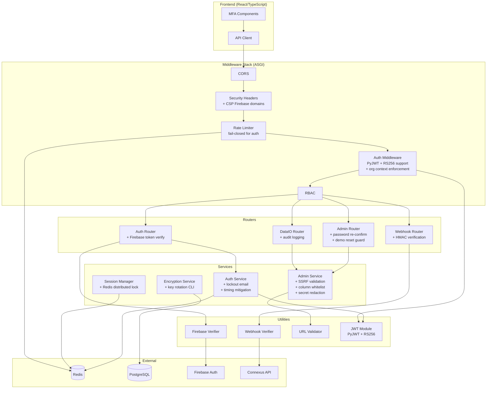
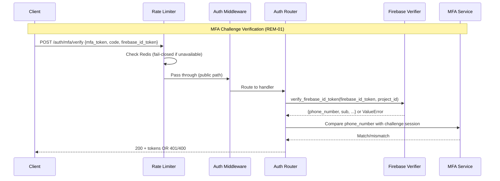
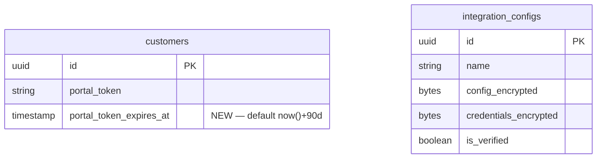

# Design Document — Security Remediation

## Overview

This design covers the implementation of 20 security remediations (REM-01 through REM-22, excluding REM-05 and REM-09) for the WorkshopPro NZ (OraInvoice) platform. The remediations address findings from the OWASP Top 10 Audit and Grey-Box Penetration Test, organised into four sprints by severity.

The platform is a FastAPI (Python) backend with a React (TypeScript) frontend, using PostgreSQL in local Docker containers (no SSL DB connections needed). Several security utilities already exist and need to be wired into the application flow:

- `app/core/firebase_token.py` — `verify_firebase_id_token()` for Firebase ID token verification
- `app/core/webhook_security.py` — `verify_webhook_signature()` for HMAC-SHA256 webhook validation
- `app/core/encryption.py` — envelope encryption with `rotate_master_key()` for key rotation

The design follows a defence-in-depth approach: each remediation is self-contained, testable in isolation, and layered so that multiple controls protect the same asset.

### Sprint Organisation

| Sprint | Severity | Remediations |
|--------|----------|-------------|
| S0 | Critical | REM-01 (Firebase MFA), REM-02/08 (Rate limiter fail-closed), REM-03/14 (Webhook HMAC), REM-19 (CSP Firebase) |
| S1 | High | REM-04 (Backup hardening), REM-06 (Export audit), REM-07 (Lockout email), REM-12 (PyJWT migration), REM-13 (SSRF protection) |
| S2 | Medium | REM-10 (Org context), REM-11 (Key rotation), REM-15 (Portal token TTL), REM-16 (Session race fix), REM-17 (Demo reset guard), REM-18 (Timing side-channel) |
| S3 | Low/Backlog | REM-20 (Swagger disable), REM-21 (SQL column whitelist), REM-22 (RS256 migration), E2E test suites |

## Architecture

### High-Level Security Architecture



### Request Flow for Key Scenarios



## Components and Interfaces

### S0 — Critical Remediations

#### 1. Firebase MFA Server-Side Verification (REM-01)

**Files modified:** `app/modules/auth/router.py`, `frontend/src/pages/auth/MfaVerify.tsx`, `frontend/src/components/mfa/SmsEnrolWizard.tsx`

**Router changes — `mfa_verify` endpoint:**

```python
# In mfa_verify handler, after extracting mfa_token and code:
firebase_id_token = payload.firebase_id_token  # new optional field
if firebase_id_token:
    from app.core.firebase_token import verify_firebase_id_token
    claims = await verify_firebase_id_token(firebase_id_token, settings.firebase_project_id)
    session_phone = challenge_session.get("phone_number")
    if session_phone and claims.get("phone_number") != session_phone:
        return JSONResponse(status_code=400, content={"detail": "Phone number mismatch"})
```

**Router changes — `mfa_enrol_verify` endpoint:** Same Firebase token verification, comparing against the pending `UserMfaMethod.phone_number`.

**Frontend changes:** Both `MfaVerify.tsx` and `SmsEnrolWizard.tsx` already call Firebase's `confirm(code)` which returns a `user` object. After confirmation, call `user.getIdToken()` and include the resulting token in the API request body as `firebase_id_token`.

**Config addition:** Add `firebase_project_id: str = ""` to `app/config.py` Settings class.

#### 2. Rate Limiter Fail-Closed for Auth Endpoints (REM-02, REM-08)

**File modified:** `app/middleware/rate_limit.py`

The current implementation fails open for all endpoints when Redis is unavailable. The change introduces a bifurcated strategy:

```python
# In RateLimitMiddleware.__call__:
if not redis:
    if is_auth_endpoint(path):
        response = JSONResponse(
            status_code=503,
            content={"detail": "Service temporarily unavailable. Please try again shortly."},
        )
        await response(scope, receive, send)
        return
    # Non-auth endpoints: fail open (current behaviour)
    await self.app(scope, receive, send)
    return
```

The same bifurcation applies to the `except Exception` handler in `__call__` — auth endpoints get 503, non-auth endpoints pass through.

**Auth endpoint classification:** Reuse the existing `is_auth_endpoint()` from `app/middleware/auth.py` which checks `/auth/`, `/login`, `/mfa/`, and `/password-reset/` prefixes.

#### 3. CSP Firebase Domain Allowlisting (REM-19)

**File modified:** `app/core/security.py`

Update the `connect-src` directive in `REQUIRED_SECURITY_HEADERS`:

```python
"connect-src 'self' https://api.stripe.com "
"https://identitytoolkit.googleapis.com "
"https://www.googleapis.com "
"https://firebaseinstallations.googleapis.com; "
```

#### 4. Connexus Webhook HMAC Signature Verification (REM-03, REM-14)

**Files modified:** `app/modules/sms_chat/router_webhooks.py`, `app/middleware/security_headers.py`, `app/config.py`

**Webhook router — add signature check before processing:**

```python
from app.core.webhook_security import verify_webhook_signature
from app.config import settings

async def _verify_connexus_signature(request: Request, body: bytes) -> bool:
    """Verify HMAC signature if webhook secret is configured."""
    secret = settings.connexus_webhook_secret
    if not secret:
        return True  # No secret configured — skip verification (dev mode)
    signature = request.headers.get("x-connexus-signature", "")
    if not verify_webhook_signature(body, signature, secret):
        logger.warning("Connexus webhook HMAC verification failed")
        return False
    return True
```

Both `incoming_sms` and `delivery_status` handlers read the raw body first, verify the signature, then parse JSON.

**CSRF exemption:** Add `/api/webhooks/connexus/incoming` and `/api/webhooks/connexus/status` to `_CSRF_EXEMPT_PATHS` in `security_headers.py`.

**Config:** Add `connexus_webhook_secret: str = ""` to Settings.

### S1 — High Severity Remediations

#### 5. Integration Backup Export Hardening (REM-04)

**Files modified:** `app/modules/admin/router.py`, `app/modules/admin/service.py`

**Router — add password re-confirmation:**

```python
@router.get("/integrations/backup", dependencies=[require_role("global_admin")])
async def export_integration_backup(request: Request, db=Depends(get_db_session)):
    confirm_password = request.headers.get("x-confirm-password")
    if not confirm_password:
        return JSONResponse(status_code=401, content={"detail": "Password confirmation required"})
    user = await _get_user_by_id(db, request.state.user_id)
    if not verify_password(confirm_password, user.password_hash):
        return JSONResponse(status_code=400, content={"detail": "Invalid password"})
    # ... export with redacted secrets
```

**Service — redact secrets in export:**

```python
_REDACTED_FIELDS = {"api_key", "auth_token", "password", "secret", "token", "credentials"}

def _redact_config(config_dict: dict) -> dict:
    return {k: "***REDACTED***" if k in _REDACTED_FIELDS else v for k, v in config_dict.items()}
```

**Audit logging:** Call `write_audit_log()` with action `admin.integration_backup_exported`.

#### 6. Data Export Audit Logging (REM-06)

**File modified:** `app/modules/data_io/router.py`

Add `write_audit_log()` calls to `export_customers`, `export_vehicles`, and `export_invoices` endpoints:

```python
await write_audit_log(
    session=db, org_id=org_id, user_id=uuid.UUID(request.state.user_id),
    action="data_io.customers_exported",
    entity_type="export", entity_id=None,
    after_value={"format": "csv", "ip_address": request.client.host},
    ip_address=request.client.host,
)
```

Actions: `data_io.customers_exported`, `data_io.vehicles_exported`, `data_io.invoices_exported`.

#### 7. Account Lockout Email Notification (REM-07)

**File modified:** `app/modules/auth/service.py`

The `_send_permanent_lockout_email()` function already exists as a stub. Implement it to dispatch via the notification infrastructure:

```python
async def _send_permanent_lockout_email(email: str) -> None:
    try:
        from app.integrations.email_dispatch import send_transactional_email
        await send_transactional_email(
            to_email=email,
            subject="Your WorkshopPro NZ account has been locked",
            template="account_lockout",
            context={
                "platform_name": "WorkshopPro NZ",
                "reason": "Too many failed login attempts (10 consecutive failures).",
                "support_url": f"{settings.frontend_base_url}/support",
            },
        )
    except Exception:
        logger.exception("Failed to send lockout email to %s", email)
```

The function already has a try/except pattern — failure does not block the lockout process.

#### 8. Replace python-jose with PyJWT (REM-12)

**Files modified:** `app/modules/auth/jwt.py`, `app/middleware/auth.py`, `app/core/firebase_token.py`, `requirements.txt`/`pyproject.toml`

**JWT module migration:**

```python
# Before (python-jose):
from jose import JWTError, jwt
jwt.encode(payload, secret, algorithm="HS256")
jwt.decode(token, secret, algorithms=["HS256"])

# After (PyJWT):
import jwt as pyjwt
from jwt.exceptions import InvalidTokenError
pyjwt.encode(payload, secret, algorithm="HS256")
pyjwt.decode(token, secret, algorithms=["HS256"])
```

Key differences:
- `JWTError` → `InvalidTokenError` (or `PyJWTError` base class)
- PyJWT's `encode()` returns `str` directly (python-jose returns `str` too in recent versions)
- `jwt.get_unverified_header()` exists in both libraries with same API

**Firebase verifier:** Update imports from `jose` to `jwt` (PyJWT). The `jwt.decode()` and `jwt.get_unverified_header()` APIs are compatible.

**Auth middleware:** Update `from jose import JWTError, jwt` to `import jwt` and `from jwt.exceptions import InvalidTokenError`.

#### 9. SSRF Protection on Integration Endpoint URLs (REM-13)

**New file:** `app/core/url_validation.py`

```python
import ipaddress
import socket
from urllib.parse import urlparse

_BLOCKED_NETWORKS = [
    ipaddress.ip_network("10.0.0.0/8"),
    ipaddress.ip_network("172.16.0.0/12"),
    ipaddress.ip_network("192.168.0.0/16"),
    ipaddress.ip_network("169.254.0.0/16"),
    ipaddress.ip_network("127.0.0.0/8"),
    ipaddress.ip_network("::1/128"),
    ipaddress.ip_network("fc00::/7"),
    ipaddress.ip_network("fe80::/10"),
]

def validate_url_for_ssrf(url: str) -> tuple[bool, str]:
    """Validate a URL is safe from SSRF. Returns (is_valid, error_message)."""
    parsed = urlparse(url)
    if parsed.scheme not in ("http", "https"):
        return False, f"URL scheme must be http or https, got '{parsed.scheme}'"
    hostname = parsed.hostname
    if not hostname:
        return False, "URL has no hostname"
    try:
        resolved = socket.getaddrinfo(hostname, None)
    except socket.gaierror:
        return False, f"Cannot resolve hostname '{hostname}'"
    for family, _, _, _, sockaddr in resolved:
        ip = ipaddress.ip_address(sockaddr[0])
        for network in _BLOCKED_NETWORKS:
            if ip in network:
                return False, f"URL resolves to blocked IP range ({network})"
    return True, ""
```

**Integration in admin service:** Call `validate_url_for_ssrf()` in `save_smtp_config`, `save_twilio_config`, `save_stripe_config`, and `save_carjam_config` before persisting endpoint URLs.

### S2 — Medium Severity Remediations

#### 10. Session-Scoped Org Context for Global Admins (REM-10)

**Files modified:** `app/modules/admin/router.py`, `app/middleware/auth.py`

**New endpoint:**

```python
@router.post("/org-context/{org_id}", dependencies=[require_role("global_admin")])
async def set_org_context(org_id: str, request: Request, db=Depends(get_db_session)):
    """Set the active org context for a global admin session."""
    # Validate org exists, store org_id in Redis keyed by session/user_id
    # Audit log: admin.org_context_switched
```

**Auth middleware enhancement:** For global_admin users accessing tenant-scoped endpoints, check Redis for an active org context. If none set, return 403.

#### 11. Encryption Key Rotation Mechanism (REM-11)

**New file:** `app/cli/rotate_keys.py`

```python
"""CLI command: python -m app.cli.rotate_keys --old-key <old> --new-key <new>"""
import asyncio
from app.core.encryption import rotate_master_key
from app.core.database import async_session_factory

async def rotate_all_keys(old_key: str, new_key: str):
    async with async_session_factory() as db:
        async with db.begin():
            # Query all IntegrationConfig rows with config_encrypted
            # For each row: row.config_encrypted = rotate_master_key(old_key, new_key, row.config_encrypted)
            # Same for credentials_encrypted columns
            # Report count on success
```

The `rotate_master_key()` function already exists in `app/core/encryption.py` — it re-encrypts only the DEK wrapper, not the payload, making rotation efficient.

#### 12. Portal Token TTL and Rotation (REM-15)

**Files modified:** `app/modules/customers/models.py` (add `portal_token_expires_at`), `app/middleware/auth.py`, `app/modules/admin/router.py`

**Schema migration:** Add `portal_token_expires_at: DateTime` column to customers table with default of `now() + interval '90 days'`.

**Auth middleware:** When authenticating portal tokens, check `portal_token_expires_at`. If expired, return 401.

**Admin endpoint:** `POST /admin/customers/{id}/regenerate-portal-token` — generates new token, resets expiry.

#### 13. Session Limit Race Condition Fix (REM-16)

**File modified:** `app/modules/auth/service.py`

Replace the current `enforce_session_limit()` with a Redis-locked version:

```python
async def enforce_session_limit(db: AsyncSession, user_id: uuid.UUID) -> None:
    from app.core.redis import redis_pool
    lock_key = f"session_lock:{user_id}"
    lock = redis_pool.lock(lock_key, timeout=5, blocking_timeout=5)
    if not await lock.acquire():
        raise ValueError("Could not acquire session lock. Please try again.")
    try:
        # Count active sessions and evict oldest if at limit
        ...
    finally:
        await lock.release()
```

#### 14. Demo Reset Endpoint Environment Guard (REM-17)

**File modified:** `app/modules/admin/router.py`

```python
_DEMO_RESET_ALLOWED_ENVIRONMENTS = {"development"}

@router.post("/demo/reset", dependencies=[require_role("global_admin")])
async def reset_demo_data(request: Request, db=Depends(get_db_session)):
    if settings.environment not in _DEMO_RESET_ALLOWED_ENVIRONMENTS:
        return JSONResponse(status_code=403, content={"detail": "Demo reset is only available in development"})
    # ... existing reset logic
```

#### 15. Password Reset Timing Side-Channel Mitigation (REM-18)

**File modified:** `app/modules/auth/service.py`

```python
import asyncio, random

async def request_password_reset(db, email: str, ip_address: str | None = None):
    user = await _find_user_by_email(db, email)
    if user is None:
        # Random delay to match real processing time
        await asyncio.sleep(random.uniform(0.5, 1.5))
        return {"detail": "If an account exists, a reset link has been sent."}
    # ... existing reset logic (send email, etc.)
    return {"detail": "If an account exists, a reset link has been sent."}
```

Same response body and status code regardless of email existence.

### S3 — Low/Backlog Remediations

#### 16. Disable Swagger UI in Production (REM-20)

**File modified:** `app/main.py`

The current code uses `settings.debug` to gate docs. Change to use `settings.environment`:

```python
is_dev = settings.environment == "development"
app = FastAPI(
    title=settings.app_name,
    version="0.1.0",
    docs_url="/docs" if is_dev else None,
    redoc_url="/redoc" if is_dev else None,
    openapi_url="/openapi.json" if is_dev else None,  # Also disable OpenAPI schema
)
```

#### 17. Dynamic SQL Column Name Whitelist (REM-21)

**File modified:** `app/modules/admin/service.py`

```python
_ALLOWED_SORT_COLUMNS = {
    "organisations": {"created_at", "updated_at", "name", "status"},
    "users": {"created_at", "email", "role", "last_login_at"},
    "invoices": {"created_at", "total", "status", "due_date"},
}

def validate_column_name(table: str, column: str) -> str:
    allowed = _ALLOWED_SORT_COLUMNS.get(table, set())
    if column not in allowed:
        logger.warning("Rejected dynamic column name: table=%s, column=%s", table, column)
        raise ValueError(f"Invalid column name: {column}")
    return column
```

#### 18. JWT HS256 to RS256 Migration (REM-22)

**Files modified:** `app/modules/auth/jwt.py`, `app/config.py`

**Config additions:**

```python
jwt_rs256_private_key_path: str = ""  # Path to RSA private key PEM
jwt_rs256_public_key_path: str = ""   # Path to RSA public key PEM
```

**JWT module — dual-algorithm support:**

```python
def _get_signing_key_and_algorithm():
    if settings.jwt_rs256_private_key_path:
        with open(settings.jwt_rs256_private_key_path) as f:
            return f.read(), "RS256"
    return settings.jwt_secret, "HS256"

def _get_verification_keys():
    """Return list of (key, algorithms) tuples for verification."""
    keys = [(settings.jwt_secret, ["HS256"])]  # Always accept HS256 during migration
    if settings.jwt_rs256_public_key_path:
        with open(settings.jwt_rs256_public_key_path) as f:
            keys.append((f.read(), ["RS256"]))
    return keys
```

During the migration period, `decode_access_token` tries RS256 first, falls back to HS256.

### E2E Testing Architecture

#### 19. Backend E2E Suite

**New directory:** `tests/e2e/`

Test files organised by domain:
- `test_e2e_auth.py` — login, MFA, password reset, session management
- `test_e2e_data_export.py` — export endpoints + audit log verification
- `test_e2e_admin.py` — integration backup, demo reset, URL validation
- `test_e2e_webhooks.py` — Connexus HMAC verification
- `test_e2e_rate_limiter.py` — Redis available/unavailable scenarios
- `test_e2e_swagger.py` — docs accessibility by environment

Uses `httpx.AsyncClient` with the FastAPI test client for full middleware stack coverage.

#### 20. Frontend E2E Suite

**New directory:** `tests/e2e/frontend/`

Playwright test files:
- `auth.spec.ts` — login, MFA challenge, MFA enrolment
- `data-export.spec.ts` — export button clicks, download verification
- `admin.spec.ts` — integration management, backup with password confirm
- `portal.spec.ts` — valid/expired portal token access
- `csp.spec.ts` — verify no CSP violations during Firebase MFA

## Data Models

### New/Modified Database Columns



### New Configuration Fields

| Setting | Type | Default | Description |
|---------|------|---------|-------------|
| `firebase_project_id` | str | `""` | Firebase project ID for token verification |
| `connexus_webhook_secret` | str | `""` | HMAC shared secret for Connexus webhooks |
| `jwt_rs256_private_key_path` | str | `""` | Path to RSA private key PEM for RS256 signing |
| `jwt_rs256_public_key_path` | str | `""` | Path to RSA public key PEM for RS256 verification |
| `portal_token_ttl_days` | int | `90` | Default TTL for portal tokens |

### Redis Keys

| Key Pattern | Purpose | TTL |
|-------------|---------|-----|
| `session_lock:{user_id}` | Distributed lock for session creation | 5s |
| `admin_org_ctx:{user_id}` | Global admin's active org context | Session duration |


## Correctness Properties

*A property is a characteristic or behavior that should hold true across all valid executions of a system — essentially, a formal statement about what the system should do. Properties serve as the bridge between human-readable specifications and machine-verifiable correctness guarantees.*

### Property 1: Firebase token verification gates MFA completion

*For any* MFA challenge or enrolment verification request containing a `firebase_id_token`, the Auth_Router must invoke the Firebase_Verifier, and the MFA flow must only succeed when the token is valid AND the `phone_number` claim matches the enrolled/challenge phone number. Invalid tokens must produce HTTP 401; mismatched phone numbers must produce HTTP 400.

**Validates: Requirements 1.1, 1.2, 1.3, 1.4, 1.5, 1.6**

### Property 2: Rate limiter fail-closed bifurcation

*For any* HTTP request path and Redis availability state, the rate limiter must return HTTP 503 when Redis is unavailable AND the path is an authentication endpoint, and must allow the request through when Redis is unavailable AND the path is NOT an authentication endpoint.

**Validates: Requirements 2.1, 2.2**

### Property 3: Auth endpoint classification

*For any* URL path string, the `is_auth_endpoint()` function must return `True` if and only if the path starts with one of the authentication prefixes (`/api/v1/auth/`, `/api/v2/auth/`).

**Validates: Requirements 2.5**

### Property 4: Webhook HMAC round-trip

*For any* byte payload and any non-empty secret string, signing the payload with `sign_webhook_payload()` and then verifying with `verify_webhook_signature()` using the same secret must return `True`. Using a different secret or a modified payload must return `False`.

**Validates: Requirements 4.1**

### Property 5: Integration backup secret redaction

*For any* dictionary containing keys from the sensitive fields set (`api_key`, `auth_token`, `password`, `secret`, `token`, `credentials`), the redaction function must replace all sensitive values with a redaction marker while preserving all non-sensitive key-value pairs unchanged.

**Validates: Requirements 5.3**

### Property 6: Data export audit logging

*For any* data export operation (customers, vehicles, or invoices), the system must create an audit log entry with the correct action name (`data_io.{type}_exported`), the requesting user's ID, the organisation ID, and the source IP address.

**Validates: Requirements 6.1, 6.2, 6.3**

### Property 7: Lockout email content

*For any* user email address, when a permanent lockout email is generated, the email content must include the platform name ("WorkshopPro NZ"), a lockout reason description, and a support contact URL. Email send failure must not prevent the lockout from completing.

**Validates: Requirements 7.1, 7.2**

### Property 8: JWT encode/decode round-trip (PyJWT)

*For any* valid JWT payload containing `user_id`, `org_id`, `role`, and `email` fields, encoding with `create_access_token()` and decoding with `decode_access_token()` must return a payload with identical values for those fields.

**Validates: Requirements 8.5**

### Property 9: Invalid JWT rejection

*For any* malformed token string or expired token, `decode_access_token()` must raise an `InvalidTokenError` (or subclass).

**Validates: Requirements 8.6**

### Property 10: SSRF URL validation

*For any* URL string, the `validate_url_for_ssrf()` function must reject URLs that: (a) use a scheme other than `http` or `https`, (b) have no hostname, (c) resolve to a private IP range (10.0.0.0/8, 172.16.0.0/12, 192.168.0.0/16, 169.254.0.0/16, 127.0.0.0/8), or (d) have an unresolvable hostname. All other URLs must be accepted.

**Validates: Requirements 9.2, 9.3, 9.4**

### Property 11: Global admin org context enforcement

*For any* global admin user accessing a tenant-scoped endpoint, the Auth_Middleware must return HTTP 403 when no org context is set in the session, and must allow the request through when a valid org context is set.

**Validates: Requirements 10.1**

### Property 12: Org context round-trip

*For any* valid organisation ID, when a global admin sets the org context via the set-context endpoint, the stored org context must be retrievable and must equal the originally set org ID.

**Validates: Requirements 10.3**

### Property 13: Encryption key rotation round-trip

*For any* plaintext string, encrypting with `envelope_encrypt()` using key A, then rotating with `rotate_master_key(A, B, blob)`, then decrypting with key B must yield the original plaintext.

**Validates: Requirements 11.2**

### Property 14: Expired portal token rejection

*For any* portal token with a `portal_token_expires_at` timestamp in the past, the Auth_Middleware must reject the request with HTTP 401.

**Validates: Requirements 12.3**

### Property 15: Session lock lifecycle

*For any* user ID, when a session creation is attempted, a Redis distributed lock must be acquired before the session count check and released after the operation completes (whether successful or failed). Concurrent attempts for the same user must be serialised.

**Validates: Requirements 13.1, 13.3**

### Property 16: Demo reset environment restriction

*For any* environment string that is not `"development"`, calling the demo reset endpoint must return HTTP 403. Only when the environment is exactly `"development"` must the endpoint be accessible.

**Validates: Requirements 14.1**

### Property 17: Password reset response indistinguishability

*For any* email address (whether it exists in the system or not), the password reset endpoint must return the same HTTP status code and the same response body structure. For non-existent emails, the response time must include a random delay between 0.5 and 1.5 seconds.

**Validates: Requirements 15.1, 15.2**

### Property 18: Dynamic column name whitelist

*For any* string, the column name validation function must return the string unchanged if it is in the allowlist for the given table, and must raise a `ValueError` if it is not in the allowlist.

**Validates: Requirements 16.1**

### Property 19: RS256 JWT round-trip

*For any* valid JWT payload, when RS256 keys are configured, signing with the private key and verifying with the public key must succeed and return the original payload claims.

**Validates: Requirements 17.1**

### Property 20: JWT algorithm selection by configuration

*For any* JWT creation, when RS256 keys are configured the token header must specify `RS256`, and when no RS256 keys are configured the token header must specify `HS256`.

**Validates: Requirements 17.3, 17.4**

### Property 21: Dual-algorithm JWT acceptance during migration

*For any* valid JWT signed with either HS256 or RS256, the `decode_access_token()` function must successfully decode the token during the migration period when both algorithms are configured.

**Validates: Requirements 17.5**

## Error Handling

### Error Response Strategy

All security remediations follow a consistent error response pattern:

| Scenario | HTTP Status | Response Body |
|----------|-------------|---------------|
| Invalid/missing Firebase token | 401 | `{"detail": "Invalid or missing Firebase ID token"}` |
| Phone number mismatch | 400 | `{"detail": "Phone number mismatch"}` |
| Redis unavailable (auth endpoint) | 503 | `{"detail": "Service temporarily unavailable. Please try again shortly."}` |
| Invalid webhook HMAC | 401 | `{"detail": "Invalid webhook signature"}` |
| Missing password confirmation | 401 | `{"detail": "Password confirmation required"}` |
| Wrong password confirmation | 400 | `{"detail": "Invalid password"}` |
| SSRF URL rejected | 400 | `{"detail": "URL resolves to blocked IP range (...)"}` |
| No org context (global admin) | 403 | `{"detail": "Organisation context required"}` |
| Expired portal token | 401 | `{"detail": "Portal token has expired"}` |
| Session lock timeout | 503 | `{"detail": "Could not acquire session lock. Please try again."}` |
| Demo reset in production | 403 | `{"detail": "Demo reset is only available in development"}` |
| Invalid column name | 400 | `{"detail": "Invalid column name: {column}"}` |

### Logging Strategy

- **Security events** (failed auth, HMAC failures, SSRF attempts): `WARNING` level with structured context
- **Operational errors** (Redis down, email send failure): `ERROR` level
- **Audit trail events**: Written to `audit_log` table via `write_audit_log()`
- **Key rotation**: `INFO` level with record counts, no plaintext logged

### Graceful Degradation

- Email send failures (lockout notification) do not block the lockout process
- Redis unavailability blocks auth endpoints (fail-closed) but allows other endpoints (fail-open)
- Firebase key fetch failures return 401 to the client with a descriptive message
- DNS resolution failures in SSRF validation reject the URL with a clear error

## Testing Strategy

### Dual Testing Approach

The security remediation requires both unit tests and property-based tests:

- **Unit tests** (pytest): Verify specific examples, edge cases, integration points, and error conditions for each remediation
- **Property-based tests** (Hypothesis): Verify universal properties across randomly generated inputs for all 21 correctness properties

### Property-Based Testing Configuration

- **Library:** [Hypothesis](https://hypothesis.readthedocs.io/) for Python backend
- **Minimum iterations:** 100 per property test (via `@settings(max_examples=100)`)
- **Tag format:** Each test is annotated with a comment referencing the design property:
  ```python
  # Feature: security-remediation, Property 1: Firebase token verification gates MFA completion
  ```

### Test Organisation

```
tests/
├── properties/
│   ├── test_firebase_verify_properties.py    # Properties 1
│   ├── test_rate_limiter_properties.py       # Properties 2, 3
│   ├── test_webhook_hmac_properties.py       # Property 4
│   ├── test_backup_redaction_properties.py   # Property 5
│   ├── test_jwt_migration_properties.py      # Properties 8, 9, 19, 20, 21
│   ├── test_ssrf_validation_properties.py    # Property 10
│   ├── test_encryption_rotation_properties.py # Property 13
│   ├── test_column_whitelist_properties.py   # Property 18
│   └── test_timing_mitigation_properties.py  # Property 17
├── e2e/
│   ├── test_e2e_auth.py                      # Auth flow E2E
│   ├── test_e2e_data_export.py               # Export + audit E2E (Property 6)
│   ├── test_e2e_admin.py                     # Admin ops E2E (Properties 11, 12, 16)
│   ├── test_e2e_webhooks.py                  # Webhook E2E
│   ├── test_e2e_rate_limiter.py              # Rate limiter E2E
│   ├── test_e2e_portal_token.py              # Portal token E2E (Property 14)
│   ├── test_e2e_session_lock.py              # Session lock E2E (Property 15)
│   └── test_e2e_swagger.py                   # Swagger disable E2E
└── e2e/
    └── frontend/
        ├── auth.spec.ts                      # Login, MFA, enrolment
        ├── data-export.spec.ts               # Export flows
        ├── admin.spec.ts                     # Admin operations
        ├── portal.spec.ts                    # Portal token access
        └── csp.spec.ts                       # CSP header verification
```

### Unit Test Focus Areas

- **Specific examples:** Firebase token with known-good claims, specific SSRF URLs (e.g., `http://169.254.169.254/`), specific column names
- **Edge cases:** Empty webhook payloads, zero-length secrets, boundary portal token expiry (exactly now), concurrent session creation
- **Error conditions:** Malformed JWTs, DNS resolution failures, Redis connection drops mid-request
- **Integration points:** Middleware stack ordering, audit log creation timing, email dispatch error handling

### Property Test Focus Areas

Each of the 21 correctness properties maps to one property-based test. Key generators:

- **JWT payloads:** Random UUIDs for user_id/org_id, random role strings from allowed set, random email strings
- **URL strings:** Random schemes, hostnames from private/public IP ranges, random paths
- **Webhook payloads:** Random byte strings of varying length, random secret strings
- **Column names:** Random strings including SQL injection attempts, valid column names from allowlist
- **Phone numbers:** Random E.164 format numbers for Firebase token matching
- **Environment strings:** Random strings including "development", "production", "staging"
