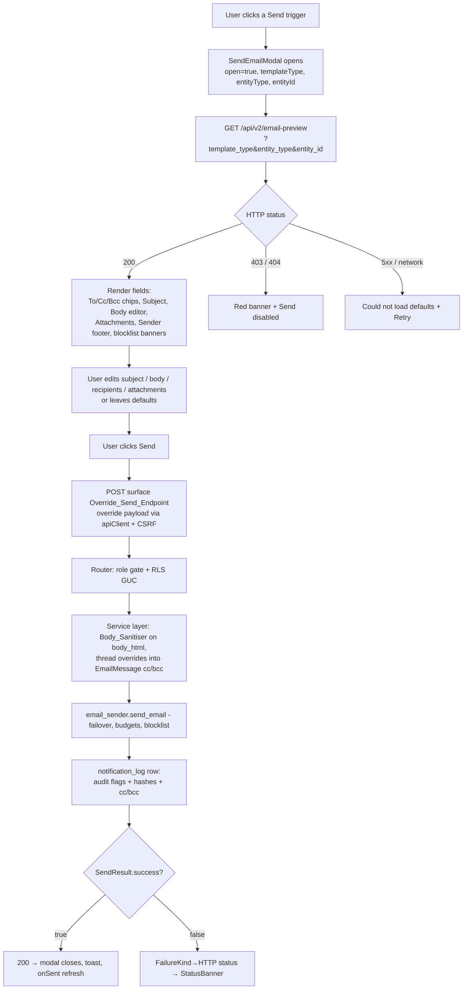
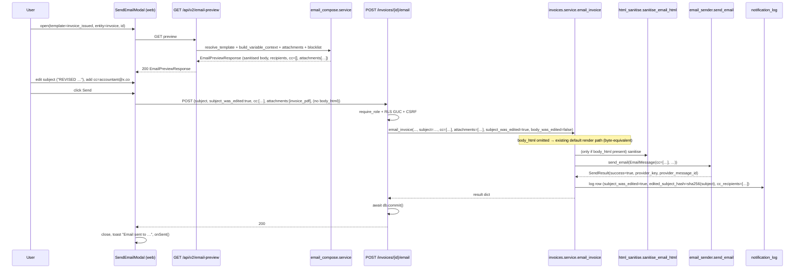

# Design Document — Send Email Modal

## Overview

This feature introduces a **single, shared "Send Email" composer modal** that opens
whenever a user triggers any of seven email surfaces in the app (send invoice, send
invoice payment link, send receipt, send quote, send customer statement, send portal
link, resend a vehicle-expiry reminder). The modal pre-loads the exact default
content the auto-send would have produced — subject, sanitised HTML body, recipients,
cc/bcc, and a per-surface attachment list — lets the user review and edit it in place,
then dispatches through the **existing unified email sender**
(`app/integrations/email_sender.py::send_email`). The sender identity
(from-address, from-name, reply-to) stays system-controlled and is never editable.

The design is **contract-driven**: one modal component built against a single TypeScript
contract (`frontend-v2/src/components/email/types.ts`), with all surface-specific
behaviour expressed as data — a row in a surface registry and the values returned by a
new read endpoint. Adding a future surface means adding a registry row plus backend
support for one new `template_type`; it never means touching the modal. The mobile
companion app ships a small-screen sheet variant against the **same** contract.

### Two pillars

1. **`GET /api/v2/email-preview`** — a new read endpoint in a new
   `app/modules/email_compose/` module. Given `(template_type, entity_type, entity_id)`
   plus the JWT-derived `org_id`, it resolves the default subject + body via the
   existing `resolve_template()`, computes recipients/cc/bcc, builds the per-surface
   attachment list (each with an HMAC-signed token), checks the bounce blocklist, and
   returns everything the modal needs to render.

2. **Per-surface Override_Send_Endpoints** — the existing send endpoints
   (`POST /invoices/{id}/email`, `PUT /quotes/{id}/send`,
   `POST /payments/invoice/{id}/send-payment-link`, etc.) extended to accept an optional
   override payload (`subject`, `body_html`, `recipients`, `cc`, `bcc`, `attachments`,
   `subject_was_edited`, `body_was_edited`, `override_blocklist`). When the override
   fields are omitted, the endpoint behaves byte-for-byte identically to today's
   auto-send. When present, the body is sanitised server-side and threaded into the
   existing service function and the `EmailMessage` passed to `send_email`.

### Explicit dependency on `notification-template-integration`

This spec **depends on** the `notification-template-integration` spec, which adds
`resolve_template(db, *, org_id, template_type, channel, variables) -> RenderedTemplate | None`
to `app/modules/notifications/service.py`, together with `_render_blocks_to_text()`,
`_substitute_variables()`, and `get_template_for_locale()`. Those functions already
exist in the codebase (verified). The preview endpoint **reuses `resolve_template()`
and the same per-template-type variable-context maps** so that the preview body is
identical to the auto-send body. The Correctness Properties (P1) enforce this
byte-equivalence as an executable guarantee.

### Scope guardrails

- Web app: `frontend-v2/` only (the archived `frontend/` is untouched — R16.6).
- Mobile: `mobile/` companion sheet, org-users only, no `global_admin` (R12.7, R15.3).
- No new email-sending code path — every send still flows through `send_email` (R16.5).
- Deployment: local dev only; no Pi-prod, no git tag (R29).

---

## Architecture

### Surface registry → endpoint mapping

The seven surfaces are pure data. The frontend registry
(`surfaceRegistry.ts`) maps each `template_type` to its Override_Send_Endpoint and HTTP
method; the backend `email_compose` service maps each `template_type` to its
variable-context builder and attachment list. The modal reads the registry row to know
where to POST.

| Surface trigger | `template_type` | `entity_type` | Override_Send_Endpoint | Method |
|---|---|---|---|---|
| Send Invoice | `invoice_issued` | `invoice` | `/invoices/{id}/email` | POST |
| Send Payment Link | `invoice_payment_link` | `invoice` | `/payments/invoice/{id}/send-payment-link` | POST |
| Send Receipt | `payment_received` | `invoice` | `/invoices/{id}/email-receipt` *(new)* | POST |
| Email Quote | `quote_sent` | `quote` | `/quotes/{id}/send` | POST |
| Send Statement | `customer_statement` | `customer` | `/api/v2/reports/customer-statement/{id}/email` *(new)* | POST |
| Send Portal Link | `portal_link` | `customer` | `/api/v2/customers/{id}/send-portal-link` | POST |
| Resend reminder | `wof_expiry_reminder` / `cof_expiry_reminder` / `registration_expiry_reminder` / `service_due_reminder` | `customer_vehicle` | `/api/v2/notifications/log/{log_id}/resend` *(new)* | POST |

### High-level flow (preview → edit → override send)



### Edited-send sequence (subject edited + cc added)



### Where the email is actually dispatched (transaction safety)

The modal needs the **send result synchronously** so it can show the right
`FailureKind` banner. The existing `email_invoice_endpoint` already does exactly this:
it calls `email_invoice(db, …)` inside the request session, then `await db.commit()`.
The override endpoints **preserve this synchronous in-request pattern** — they do NOT
use the fresh-session fire-and-forget pattern (that pattern is reserved for background
auto-emails such as the create-invoice `_send_email_bg` and mark-paid flows where the
HTTP response does not depend on the email outcome). Services continue to use
`flush()` (never `commit()`); the router owns the commit (per project-overview and
ISSUE-024/040/044).

---

## Navigation & Access

The modal is a **child component** of existing pages — it has **no route** and is never
reachable by URL (R15.1). Each trigger lives on a page that already enforces the
`org_admin` / `salesperson` role gate, so the modal inherits that gate. There are **no
new routes** in `App.tsx` and **no new sidebar items**.

| # | Trigger | Exact location (web) | Visibility gate |
|---|---|---|---|
| 1 | **Send Invoice** | `frontend-v2/src/pages/invoices/InvoiceList.tsx` — Send dropdown (`handleSendInvoice`, line ~644) + draft-banner button (line ~1450) | role gate (page) |
| 2 | **Send Payment Link** | `InvoiceList.tsx` — Send dropdown 2nd item (`handleSendPaymentLink`, ~659), already conditional on `canShowSendPaymentLink` | role + existing payment-link condition |
| 3 | **Send Receipt** | `InvoiceList.tsx` — More menu, shown when invoice is `paid`/`partially_paid` | role + paid status |
| 4 | **Email Quote** | `frontend-v2/src/pages/quotes/QuoteDetail.tsx` — toolbar **Email** button (`handleSend`, ~314) | role gate (page) |
| 5 | **Send Statement** | `frontend-v2/src/pages/customers/CustomerProfile.tsx` — **new** action button in the profile actions row | role + customer has ≥1 open invoice (R17.4) |
| 6 | **Send Portal Link** | `CustomerProfile.tsx` — portal-access card **Send portal link** button (`handleSendLink`, ~220) | role + `enable_portal` true |
| 7 | **Resend reminder** | Notification-log row **Resend** action (notification-log surface) | role + `useModuleEnabled('vehicles')` AND `(tradeFamily ?? 'automotive-transport') === 'automotive-transport'` (R22.2) |

Each trigger replaces its current direct API call with opening the modal, passing
`{ templateType, entityType, entityId, surfaceLabel }` and an `onSent` callback that
re-fetches the surface's data (R17.1–17.7). The button labels and positions do not
change.

**Mobile**: the same triggers open `SendEmailSheet` instead of `SendEmailModal`.
Surfaces fail closed (hidden) when their module is disabled, and the sheet is never
shown to `global_admin` (mobile is org-users only).

---

## Components and Interfaces

### Frontend contract — `frontend-v2/src/components/email/types.ts`

This is the **single source of truth** for the contract (R1.10). The mobile sheet
imports these types via the `@shared`-style relative path; mobile does not redefine
them. Every field name matches the Pydantic schema in
`app/modules/email_compose/schemas.py` **exactly** (R1.9, R3.9, R11.10).

```typescript
// ---- Preview response (mirrors EmailPreviewResponse Pydantic schema) ----

export interface SenderPreview {
  from_email: string
  from_name: string
  reply_to: string | null
}

export interface AttachmentSpec {
  key: string            // stable id ('invoice_pdf') OR HMAC token
  label: string
  size_bytes: number
  default_attached: boolean
  required: boolean
}

export type BlocklistKind = 'soft' | 'hard'

export interface BlocklistEntry {
  email: string
  kind: BlocklistKind
  reason: string | null
  bounced_at: string | null   // ISO 8601
}

export interface EmailPreviewResponse {
  subject: string
  body_html: string
  recipients: string[]
  cc: string[]
  bcc: string[]
  variable_context: Record<string, string>
  attachments: AttachmentSpec[]
  default_was_template: boolean
  sender_preview: SenderPreview
  blocklisted: BlocklistEntry[]
  locale: string                 // resolved locale (R3.10)
  email_size_limit_bytes: number // R3.9 / R7.3
  total_budget_seconds: number   // R28.3
}

// ---- Override send payload (sent to the surface's endpoint) ----

export interface OverrideSendPayload {
  recipients?: string[]
  cc?: string[]
  bcc?: string[]
  subject?: string
  body_html?: string
  attachments?: string[]         // AttachmentSpec.key values
  subject_was_edited?: boolean
  body_was_edited?: boolean
  override_blocklist?: boolean
}

// ---- Surface registry row ----

export type EntityType = 'invoice' | 'quote' | 'customer' | 'customer_vehicle'

export interface SurfaceConfig {
  templateType: string
  entityType: EntityType
  /** Build the override-send URL from the entity id (and log id for resend). */
  buildSendUrl: (entityId: string, opts?: { logId?: string }) => string
  method: 'POST' | 'PUT'
  /** v2 endpoints set this so apiClient uses the absolute path. */
  apiV2: boolean
  surfaceLabel: string
}

// ---- Modal props (R1.1 — exactly these, no surface-specific props) ----

export interface SendEmailModalProps {
  open: boolean
  onClose: () => void
  templateType: string
  entityType: EntityType
  entityId: string
  onSent: () => void
  surfaceLabel: string
  /** Resend surface only: notification-log row id, forwarded to buildSendUrl. */
  logId?: string
}
```

### `surfaceRegistry.ts`

A frozen record keyed by `template_type`. Example rows:

```typescript
export const SURFACE_REGISTRY: Record<string, SurfaceConfig> = {
  invoice_issued: {
    templateType: 'invoice_issued', entityType: 'invoice',
    buildSendUrl: (id) => `/invoices/${id}/email`, method: 'POST', apiV2: false,
    surfaceLabel: 'Send Invoice',
  },
  invoice_payment_link: {
    templateType: 'invoice_payment_link', entityType: 'invoice',
    buildSendUrl: (id) => `/payments/invoice/${id}/send-payment-link`,
    method: 'POST', apiV2: false, surfaceLabel: 'Send Payment Link',
  },
  payment_received: {
    templateType: 'payment_received', entityType: 'invoice',
    buildSendUrl: (id) => `/invoices/${id}/email-receipt`, method: 'POST',
    apiV2: false, surfaceLabel: 'Send Receipt',
  },
  quote_sent: {
    templateType: 'quote_sent', entityType: 'quote',
    buildSendUrl: (id) => `/quotes/${id}/send`, method: 'POST', apiV2: false,
    surfaceLabel: 'Email Quote',
  },
  customer_statement: {
    templateType: 'customer_statement', entityType: 'customer',
    buildSendUrl: (id) => `/api/v2/reports/customer-statement/${id}/email`,
    method: 'POST', apiV2: true, surfaceLabel: 'Send Statement',
  },
  portal_link: {
    templateType: 'portal_link', entityType: 'customer',
    buildSendUrl: (id) => `/api/v2/customers/${id}/send-portal-link`,
    method: 'POST', apiV2: true, surfaceLabel: 'Send Portal Link',
  },
  // wof/cof/registration/service reminders share the resend endpoint:
  wof_expiry_reminder: {
    templateType: 'wof_expiry_reminder', entityType: 'customer_vehicle',
    buildSendUrl: (_id, opts) => `/api/v2/notifications/log/${opts?.logId}/resend`,
    method: 'POST', apiV2: true, surfaceLabel: 'Resend Reminder',
  },
  // … cof_expiry_reminder, registration_expiry_reminder, service_due_reminder
}
```

### `SendEmailModal.tsx` (web top-level)

**Responsibilities**: orchestrate the preview fetch, hold edit state, validate, build the
override payload, POST on Send, and surface results. Contains **no per-surface
branching** (R1.4) — it reads `SURFACE_REGISTRY[templateType]`.

Key behaviours:
- On open, fetch preview in a `useEffect` with an `AbortController`; abort on unmount
  **and** on close (R1.6). Show a loading skeleton only if the response takes >300 ms
  (R28.2) — a timer sets `showSkeleton=true` at 300 ms, cleared on response.
- Every response field read uses `?.` / `?? []` / `?? 0` (R1.7). API calls use typed
  generics — `apiClient.get<EmailPreviewResponse>(…)`, never `as any` (R1.8).
- Tracks dirty flags: `subjectWasEdited`, `bodyWasEdited` (set on first divergence from
  the loaded defaults).
- Builds `OverrideSendPayload` omitting any field unchanged from the default
  (R3.6 / R8.1) — critically, `body_html` is omitted when `bodyWasEdited === false` so
  the server falls back to its byte-equivalent default render.
- Session-scoped draft preservation per entity (R4.8, R19.6): keep edits in a module-
  level `Map<string /*entityKey*/, DraftState>` keyed by `${entityType}:${entityId}`;
  restore on reopen for the same entity, reset when opening a different entity.
- Renders via the existing `Modal` primitive from `components/ui` (R24.1). Focus trap,
  Escape-to-close, and focus restore come from `Modal` (verified — it already
  implements `trapFocus` and focus restore). The status banner uses `role="alert"`
  (R27.3); the Send button sets `aria-busy` while in flight (R27.6).

```typescript
export function SendEmailModal(props: SendEmailModalProps): JSX.Element
```

Internal state shape:

```typescript
interface ModalState {
  loading: boolean
  showSkeleton: boolean
  preview: EmailPreviewResponse | null
  loadError: { kind: 'forbidden' | 'notfound' | 'server'; detail: string } | null
  recipients: string[]; cc: string[]; bcc: string[]
  subject: string; bodyHtml: string
  attachments: Record<string /*key*/, boolean /*checked*/>
  subjectWasEdited: boolean; bodyWasEdited: boolean
  overrideBlocklist: boolean
  sending: boolean
  sendError: SendErrorState | null   // drives StatusBanner
}
```

### `RecipientChips.tsx`

**Props**:
```typescript
interface RecipientChipsProps {
  label: 'To' | 'Cc' | 'Bcc'
  values: string[]
  onChange: (next: string[]) => void
  required?: boolean
  blocklist: BlocklistEntry[]      // for chip styling (soft amber / hard red)
  canOverrideHard: boolean         // org_admin only → renders "Override once"
  onOverrideHard?: () => void
}
```
**Responsibilities**: chip input that validates each entry against
`/^[^\s@]+@[^\s@]+\.[^\s@]+$/` on Enter/comma/semicolon/Tab (R4.3); inline "Invalid email
address" error on failure; soft-bounce chips get an amber border **and** a warning-triangle
icon, hard-bounce chips a red border **and** an error-octagon icon (colour is never the
sole signal — R27.5); hard-bounce chips disable Send unless `canOverrideHard` and the
user clicks "Override once" (R4.6, R13.5). Each field has a linked `<label htmlFor>`
(R27.4). 40–44px touch targets (R24.5).

### `SubjectInput.tsx`

```typescript
interface SubjectInputProps {
  value: string
  onChange: (v: string) => void
  maxLength?: number   // 255 (R5.2)
}
```
Wraps the `Input` primitive. Shows a character count when value length > 200 (R5.2),
inline "Subject is required." error when empty (R5.3), sets `subject_was_edited` via the
parent's `onChange` diffing.

### `BodyEditor.tsx` (TipTap wrapper)

```typescript
interface BodyEditorProps {
  valueHtml: string
  defaultHtml: string
  onChange: (html: string) => void
  onResetToDefault: () => void
  senderPreview: SenderPreview
  locale: string
}
```
**Responsibilities**: TipTap editor configured with **only** `@tiptap/starter-kit`,
`@tiptap/extension-link`, and `@tiptap/extension-underline` (R6.1, R28.4 — no
collaboration/yjs). Toolbar: bold, italic, underline, bullet list, ordered list, link
(insert/edit/remove), and **Reset to default** (R6.2). Keyboard shortcuts Ctrl/Cmd+B/I/U
(R27.2); every toolbar button Tab-reachable, styled as small ghost buttons matching the
redesign (R24.7). Paste handler strips styles/scripts/iframes/event-handlers client-side
(R6.4) — server re-sanitises as defence in depth. Emits **HTML** (R6.5). Read-only footer
"Sender: {from_name} <{from_email}>" from `senderPreview` (R6.7, R9.2) plus an
informational "Default content rendered in {locale}" line (R3.10). `font-mono` with
`tnum` for the locale/id text (R24.2).

### `AttachmentList.tsx`

```typescript
interface AttachmentListProps {
  attachments: AttachmentSpec[]
  selected: Record<string, boolean>
  onToggle: (key: string, checked: boolean) => void
  emailSizeLimitBytes: number
  estimatedBodyBytes?: number   // default 10 * 1024
}
```
Renders one row per attachment: checkbox (default from `default_attached`), label,
human-readable size (`{kb} KB` < 1 MB else `{mb} MB`, R7.2 — `font-mono` tnum), and a
disabled locked checkbox + "Required" tooltip when `required` (R7.2). Computes selected
total + body estimate; when it exceeds `emailSizeLimitBytes` it signals the parent to
disable Send and show the over-size banner (R7.3).

### `StatusBanner.tsx`

```typescript
type BannerTone = 'red' | 'amber'
interface StatusBannerProps {
  tone: BannerTone
  message: string
  onDismiss: () => void
  onRetry?: () => void          // only for SOFT_PROVIDER / BUDGET_EXCEEDED
  onCopyDetails?: () => void     // only for SOFT_AUTH
}
```
`role="alert"` (R27.3); Dismiss (×) hides without closing the modal (R14.6); never
auto-dismisses (R14.7); **Retry** shown only for soft/budget failures (R14.8); **Copy
details** (provider_key, attempt count, timestamp) for `SOFT_AUTH` (R14.4). Also used for
the preview load-error and over-size banners.

### Mobile — `mobile/src/components/email/SendEmailSheet.tsx`

Implements the **same contract** (imports `types.ts` and `surfaceRegistry.ts` from the
web module — R1.10, R12.1). On viewports ≤ 640 px it renders full-screen with the body
editor occupying ≥ 50 % of viewport height and a top app-bar (Cancel left, Send right)
(R12.2). All interactive elements ≥ 44 × 44 px (R12.3). Uses `pb-safe` /
`env(safe-area-inset-*)` so Send is never obscured (R12.4). Every API call wrapped in an
`AbortController`, aborted on unmount (R12.5). Uses v2 endpoints and `offset`/`limit`
(not `skip`) for any paginated list (R12.6). Hidden from `global_admin` (R12.7).

### Backend Pydantic schemas — `app/modules/email_compose/schemas.py`

Field names match `types.ts` exactly. `EmailPreviewResponse` declares **every** field
(R3.9). Each per-surface override payload uses `model_config = ConfigDict(extra="forbid")`
so unknown fields raise 422 (R11.10).

```python
from pydantic import BaseModel, ConfigDict, Field

class SenderPreview(BaseModel):
    from_email: str
    from_name: str
    reply_to: str | None = None

class AttachmentSpec(BaseModel):
    key: str
    label: str
    size_bytes: int
    default_attached: bool
    required: bool

class BlocklistEntry(BaseModel):
    email: str
    kind: str                 # 'soft' | 'hard'
    reason: str | None = None
    bounced_at: str | None = None

class EmailPreviewResponse(BaseModel):
    subject: str
    body_html: str
    recipients: list[str]
    cc: list[str]
    bcc: list[str]
    variable_context: dict[str, str]
    attachments: list[AttachmentSpec]
    default_was_template: bool
    sender_preview: SenderPreview
    blocklisted: list[BlocklistEntry]
    locale: str
    email_size_limit_bytes: int
    total_budget_seconds: int

class OverrideSendBase(BaseModel):
    model_config = ConfigDict(extra="forbid")   # R11.10 — reject unknown fields
    recipients: list[str] | None = None
    cc: list[str] | None = None
    bcc: list[str] | None = None
    subject: str | None = Field(default=None, max_length=255)
    body_html: str | None = None
    attachments: list[str] | None = None
    subject_was_edited: bool = False
    body_was_edited: bool = False
    override_blocklist: bool = False

# Per-surface subclasses (one each) keep room for surface-specific
# fields and a precise OpenAPI contract while sharing the base shape:
class InvoiceEmailOverrideRequest(OverrideSendBase): ...
class PaymentLinkOverrideRequest(OverrideSendBase): ...
class ReceiptEmailOverrideRequest(OverrideSendBase): ...
class QuoteSendOverrideRequest(OverrideSendBase): ...
class StatementEmailOverrideRequest(OverrideSendBase): ...
class PortalLinkOverrideRequest(OverrideSendBase): ...
class ReminderResendOverrideRequest(OverrideSendBase): ...
```

---

## Backend Components

### New module: `app/modules/email_compose/`

#### `router.py` — `GET /api/v2/email-preview`

Registered in `app/main.py` alongside the other v2 routers. The router declares its
route as `/email-preview` and is mounted at prefix `/api/v2` so the full path is
exactly **`GET /api/v2/email-preview`** as the requirements specify
(`app.include_router(email_compose_router, prefix="/api/v2", tags=["v2-email-compose"])`).
The modal and `surfaceRegistry`/preview call use this exact path.

```python
@router.get("/email-preview", response_model=EmailPreviewResponse,
            dependencies=[require_role("org_admin", "salesperson")])
async def email_preview_endpoint(
    request: Request,
    template_type: str,
    entity_type: str,
    entity_id: uuid.UUID,
    db: AsyncSession = Depends(get_db_session),
):
    org_uuid, _user, _ip = _extract_org_context(request)
    if not org_uuid:
        return JSONResponse(status_code=403, content={"detail": "Organisation context required"})
    try:
        result = await build_email_preview(
            db, org_id=org_uuid, template_type=template_type,
            entity_type=entity_type, entity_id=entity_id,
            base_url=request.headers.get("origin") or None,
        )
    except EntityNotFound as exc:
        return JSONResponse(status_code=404, content={"detail": str(exc)})
    except PermissionError as exc:
        return JSONResponse(status_code=403, content={"detail": str(exc)})
    return EmailPreviewResponse(**result)
```

Middleware posture (R25): authenticated (not in `PUBLIC_PATHS`/`PUBLIC_PREFIXES`),
RLS GUC `app.current_org_id` set by the existing dependency chain, `require_role`,
standard per-user rate limit (no exemption). Being a GET it carries no CSRF requirement
but still requires a valid JWT (R8.11).

#### `service.py`

```python
async def build_email_preview(db, *, org_id, template_type, entity_type,
                              entity_id, base_url) -> dict: ...
def build_variable_context(template_type, *, entity, org, ...) -> dict[str, str]: ...
async def get_attachments_for_surface(db, *, template_type, entity_id, org_id) -> list[dict]: ...
async def resolve_locale(db, *, org_id, customer) -> str: ...
def build_attachment_token(*, org_id, entity_id, attachment_kind, expires_at) -> str: ...
def validate_attachment_token(token, *, org_id, entity_id) -> str | None: ...  # returns kind or None
```

- **`build_email_preview`**: loads the entity scoped to `org_id` (RLS-filtered; raises
  `EntityNotFound` → 404), resolves the customer + locale, builds the variable context,
  calls `resolve_template()` (→ `default_was_template=True`) or computes the surface's
  hardcoded fallback (→ `False`), **passes the body through `Body_Sanitiser`** (R3.5,
  R10.6), builds the attachment list and blocklist, and assembles the response including
  `email_size_limit_bytes = EMAIL_SIZE_LIMIT`, `total_budget_seconds =
  EMAIL_TOTAL_BUDGET_SECONDS`, and `sender_preview` (resolved exactly as `send_email`
  resolves identity, never editable).
- **`build_variable_context`**: per-`template_type` map (see Data Models) — reuses the
  same keys the existing send functions build for `resolve_template()` so the rendered
  default is identical (R20.4, and the basis for Property P1).
- **`get_attachments_for_surface`**: the documented per-surface defaults (R7.7). Each
  returned `key` is an HMAC token (see Attachment_Token below) except trivially-stable
  ids; tokens encode `(org_id, entity_id, attachment_kind, expires_at)`.
- **`resolve_locale`**: Locale_Resolution_Chain — customer `language` → org
  `default_locale` → `en` (R3.10); returned as `locale`.
- **Blocklist**: query `bounced_addresses` (the same table `_check_bounce_blocklist`
  uses) for every default recipient/cc/bcc, returning `{email, kind, reason, bounced_at}`
  (R13.1).

#### Body_Sanitiser — `app/integrations/html_sanitise.py`

Implemented with **`bleach`** (added as a dependency). Allowlists are module-level
constants and unit-tested against XSS payloads (R10.7).

```python
import bleach

ALLOWED_TAGS = [
    "p","br","hr","strong","em","u","s","b","i","ul","ol","li","blockquote",
    "pre","code","h1","h2","h3","h4","h5","h6","a","img","table","thead",
    "tbody","tr","th","td","span","div",
]
ALLOWED_ATTRIBUTES = {
    "a": ["href","title","target","rel"],
    "img": ["src","alt","title","width","height","style"],
    "td": ["colspan","rowspan","width","align","style"],
    "th": ["colspan","rowspan","width","align","style"],
    "table": ["colspan","rowspan","width","align","style"],
    "*": ["style","class"],
}
ALLOWED_PROTOCOLS = ["http","https","mailto"]
ALLOWED_STYLES = [   # CSS property allowlist (filtered via css_sanitizer)
    "color","background-color","font-weight","font-style","text-decoration",
    "text-align","padding","margin","border","font-size",
]

def sanitise_email_html(raw: str) -> str:
    """Allowlist-sanitise untrusted HTML. Strips on* handlers, javascript:/data:/file:
    URLs, and disallowed tags/attrs/styles. Idempotent (Property P2)."""
    cleaner = bleach.Cleaner(
        tags=ALLOWED_TAGS, attributes=ALLOWED_ATTRIBUTES,
        protocols=ALLOWED_PROTOCOLS, strip=True,
        css_sanitizer=_css_sanitizer(ALLOWED_STYLES),
    )
    return cleaner.clean(raw or "")
```

`on*` attributes are removed because they are not in any allowlist; `javascript:`,
`data:`, `file:` are removed by the protocol allowlist (R10.4, R10.5). `bleach`'s
`css_sanitizer` (via `tinycss2`) filters the `style` attribute to `ALLOWED_STYLES`
(R10.3). The exact version pin is chosen in Dependencies below.

#### Changes to existing send services/routers (accept overrides)

Each existing send service function gains optional override params and threads them into
the `EmailMessage`. The router endpoint adds the override-payload body and maps
`SendResult.failure_kind` → HTTP status.

| Service function | New optional params |
|---|---|
| `invoices.service.email_invoice` | `subject`, `body_html`, `recipients`, `cc`, `bcc`, `attachments`, `subject_was_edited`, `body_was_edited`, `override_blocklist` |
| `invoices.service` **new** `email_invoice_receipt` (wraps `_send_receipt_email` with `payment_received`) | same override set |
| `payments.service.send_invoice_payment_link_email` | same override set (threaded into `_send_receipt_email`) |
| `quotes.service.send_quote` | same override set |
| `reports.service` **new** `email_customer_statement` | same override set |
| `customers.service.send_portal_link` | same override set (see queued-vs-sync note) |
| `notifications.service` **new** `resend_notification_log_entry` | same override set + `vehicles` module check |

Threading rules in each service:
- If `body_html` is provided and `body_was_edited` is true → `sanitise_email_html()` →
  use as the `EmailMessage.html_body`; compute `edited_body_hash = sha256(sanitised)`.
- If `body_html` is omitted → the existing default-render path runs unchanged (preserves
  byte-equivalence, Property P1).
- If `subject` provided and `subject_was_edited` true → use it; `edited_subject_hash =
  sha256(subject)`.
- `recipients` (when provided and non-empty) overrides the default `to_email`
  (first recipient becomes `to_email`; remainder, if the surface needs multiple primary
  recipients, are added as additional To addresses — see cc/bcc threading in Data
  Models). `cc`/`bcc` thread into the new `EmailMessage.cc` / `EmailMessage.bcc`.
- `attachments`: each key is validated via `validate_attachment_token()` against the
  preview-time set for the same `(entity_type, entity_id, org_id)`; unknown/expired/
  cross-entity → **400 "Invalid attachment selection."** (R7.6). Files are re-resolved
  server-side from the validated kind — never from a client path.
- The `notification_log` row is written with the audit columns populated (see Data
  Models). `override_blocklist=true` is honoured only for `org_admin` (else 403,
  regardless of flag — R13.5).

The portal-link surface currently dispatches via the **queued** `send_email_task`
(fire-and-forget). To return a synchronous result to the modal, the override path for
`send_portal_link` switches to the **direct** `send_email(db, EmailMessage(...))` call
(same module, same provider chain) so the endpoint can map the `FailureKind`. The
non-modal auto-send path (triggered on `enable_portal` transition) is left unchanged.

---

## Data Models

### 1. `EmailMessage` cc/bcc additions — `app/integrations/email_sender.py`

`EmailMessage` today has no cc/bcc (verified). Add two fields and thread them through
both REST transports and the SMTP transport.

```python
@dataclass
class EmailMessage:
    to_email: str
    to_name: str = ""
    subject: str = ""
    html_body: str = ""
    text_body: str = ""
    from_name: str | None = None
    reply_to: str | None = None
    attachments: list[EmailAttachment] = field(default_factory=list)
    org_id: uuid.UUID | None = None
    cc: list[str] = field(default_factory=list)   # NEW
    bcc: list[str] = field(default_factory=list)  # NEW
```

Transport threading:

- **Brevo REST** (`_dispatch_brevo_rest`): add `payload["cc"] = [{"email": e} for e in message.cc]`
  and `payload["bcc"] = [{"email": e} for e in message.bcc]` when non-empty (Brevo
  `cc`/`bcc` arrays).
- **SendGrid REST** (`_dispatch_sendgrid_rest`): add `personalization["cc"]` and
  `personalization["bcc"]` arrays when non-empty.
- **Resend REST** (`_dispatch_resend_rest`): add `payload["cc"]` / `payload["bcc"]` lists.
- **SMTP** (`_build_mime_message` + `_dispatch_smtp`): set the `Cc` header from
  `message.cc`; **do NOT** set a `Bcc` header. Pass **all** envelope recipients to
  `sendmail`: `server.sendmail(from_email, [to_email, *message.cc, *message.bcc], raw)`.
  This keeps BCC privacy — BCC addresses appear only as envelope RCPT TO, never in any
  header other recipients can see (R4.9). The size pre-check in `send_email` is
  unaffected (it sizes body + attachments).

This is the **only** integration point for cc/bcc — no new send path (R8.3, R16.5).

### 2. `notification_log` migration `0214` (next after current head `0213`)

> **Note on the requirements text**: the requirements pinned the migration as "next
> after 0194". The actual alembic head in the repo is **`0213`**
> (`2026_06_05_0001-0213_jobcard_awaiting_parts.py`, `down_revision="0212"`), so the new
> revision is **`0214`** with `down_revision = "0213"`. This design pins `0214`.

File: `alembic/versions/2026_06_06_0001-0214_send_email_modal_audit.py`

Adds six columns to `notification_log` (R11.1) and extends the
`notification_templates.template_type` allowed values with the three new types
(R11.9, R20.2). Column adds use plain `op.add_column` (no index here, so no
`CONCURRENTLY` needed — per database-migration-checklist; any index would have to use
`CREATE INDEX CONCURRENTLY` in an `autocommit_block`).

```python
revision = "0214"
down_revision = "0213"

def upgrade() -> None:
    op.add_column("notification_log", sa.Column(
        "subject_was_edited", sa.Boolean(), nullable=False, server_default=sa.false()))
    op.add_column("notification_log", sa.Column(
        "body_was_edited", sa.Boolean(), nullable=False, server_default=sa.false()))
    op.add_column("notification_log", sa.Column(
        "edited_subject_hash", sa.CHAR(length=64), nullable=True))
    op.add_column("notification_log", sa.Column(
        "edited_body_hash", sa.CHAR(length=64), nullable=True))
    op.add_column("notification_log", sa.Column(
        "cc_recipients", postgresql.JSONB(), nullable=False, server_default=sa.text("'[]'::jsonb")))
    op.add_column("notification_log", sa.Column(
        "bcc_recipients", postgresql.JSONB(), nullable=False, server_default=sa.text("'[]'::jsonb")))
    # No DB-level CHECK constraint on template_type exists today (the allowed
    # list is enforced in the Pydantic/service layer via EMAIL_TEMPLATE_TYPES).
    # The 3 new types are added to EMAIL_TEMPLATE_TYPES in schemas.py (R20.2);
    # no constraint DDL is required. If a CHECK is added later, this migration
    # is where it would be extended.

def downgrade() -> None:
    for col in ("bcc_recipients","cc_recipients","edited_body_hash",
                "edited_subject_hash","body_was_edited","subject_was_edited"):
        op.drop_column("notification_log", col)
```

> **Investigation note**: I verified there is **no** DB CHECK constraint on
> `notification_templates.template_type` (the model only constrains `channel`); the
> allowed-type list is enforced in `app/modules/notifications/schemas.py`
> (`EMAIL_TEMPLATE_TYPES`). R11.9/R20.2 are therefore satisfied by editing that list
> rather than DDL. Note `wof_expiry_reminder`, `cof_expiry_reminder`,
> `registration_expiry_reminder`, `service_due_reminder`, and `quote_sent` are already
> present; only `invoice_payment_link`, `customer_statement`, `portal_link` are new.

Model changes (`app/modules/notifications/models.py`) — add to `NotificationLog`:

```python
subject_was_edited: Mapped[bool] = mapped_column(Boolean, nullable=False, server_default="false")
body_was_edited: Mapped[bool] = mapped_column(Boolean, nullable=False, server_default="false")
edited_subject_hash: Mapped[str | None] = mapped_column(String(64), nullable=True)
edited_body_hash: Mapped[str | None] = mapped_column(String(64), nullable=True)
cc_recipients: Mapped[list] = mapped_column(JSONB, nullable=False, server_default="'[]'")
bcc_recipients: Mapped[list] = mapped_column(JSONB, nullable=False, server_default="'[]'")
```

Serializer + schema (R11.7, R11.8): `_log_entry_to_dict()` emits all six fields;
`NotificationLogEntry` (Pydantic) gains them so they aren't silently dropped
(frontend-backend-contract-alignment Rule 8). `log_email_sent()` gains optional
`subject_was_edited`, `body_was_edited`, `edited_subject_hash`, `edited_body_hash`,
`cc_recipients`, `bcc_recipients` params (defaulting to the no-edit values), and the
modal send paths pass them. Empty cc/bcc persist as `[]`, never `null` (R11.5).

### 3. `notification_templates` — three new template types

`EMAIL_TEMPLATE_TYPES` in `app/modules/notifications/schemas.py` gains
`invoice_payment_link`, `customer_statement`, `portal_link` (R20.2). The existing
template editor UI (`frontend-v2/src/pages/settings/Notifications*.tsx`) renders editable
rows for them automatically since it iterates the type list (R20.3). Default
subjects/body-blocks are added to `DEFAULT_SUBJECTS` / `_DEFAULT_BODY_BLOCKS`.

### 4. Attachment_Token (HMAC) shape and signing key

A token authorises server-side resolution of one attachment for one entity (R7.6,
IDOR defence). Payload:

```
payload = f"{org_id}:{entity_id}:{attachment_kind}:{expires_at_epoch}"
sig      = HMAC_SHA256(signing_key, payload)        # hex
token    = base64url( payload + "." + sig )
```

- **`attachment_kind`** ∈ `invoice_pdf`, `invoice_pdf_paid`, `customer_statement_pdf`,
  `quote_pdf` (the kinds the surfaces offer).
- **`expires_at`**: now + 30 minutes (longer than the preview→send window, short enough
  to bound replay).
- **Signing key**: a key **derived** from `settings.jwt_secret` via HKDF/SHA-256 with a
  fixed info string `b"email-attachment-token-v1"` — i.e. `signing_key =
  HKDF(settings.jwt_secret.encode(), info=b"email-attachment-token-v1")`. Deriving
  (rather than using `jwt_secret` directly) isolates this token's key material from
  JWT/session signing. `jwt_secret` is an infrastructure secret already defined in
  `app/config.py` (verified) and supplied via `.env` (allowed per
  integration-credentials-architecture — it is not a third-party API key). NOTE: the
  config has **no** setting literally named `SECRET_KEY`; the app-level secrets are
  `settings.jwt_secret` (auth/JWT signing) and `settings.encryption_master_key`
  (envelope encryption of stored data). `jwt_secret` is the correct source for an HMAC
  token signing key; `encryption_master_key` is reserved for at-rest data encryption.
- **`validate_attachment_token(token, org_id, entity_id)`**: constant-time-compares the
  HMAC, checks `expires_at > now`, and asserts the embedded `org_id`/`entity_id` match
  the request's — returns the `attachment_kind` or `None`. A token minted for another
  entity or org fails (Property P3).

### 5. Variable-context map per `template_type`

Reuses the existing maps the send functions build for `resolve_template()` (verified in
`email_invoice`, `send_quote`, `_send_receipt_email`). Documented here for
`build_variable_context()` (R20.4):

| `template_type` | Variables |
|---|---|
| `invoice_issued` | `customer_first_name, customer_last_name, customer_email, invoice_number, total_due, due_date, payment_link, org_name, org_email, org_phone` |
| `invoice_payment_link` *(new)* | `customer_first_name, customer_last_name, invoice_number, total_due, due_date, payment_link, org_name, org_email, org_phone` |
| `payment_received` | `customer_first_name, customer_last_name, customer_email, invoice_number, total_due, due_date, payment_link, org_name, org_email, org_phone` |
| `quote_sent` | `customer_first_name, customer_last_name, quote_number, quote_total, quote_valid_until, org_name, org_email, org_phone` |
| `customer_statement` *(new)* | `customer_first_name, customer_last_name, statement_period_start, statement_period_end, total_outstanding, statement_link, org_name, org_email, org_phone` |
| `portal_link` *(new)* | `customer_first_name, customer_last_name, portal_link, org_name, org_email, org_phone` |
| `wof_expiry_reminder` / `cof_expiry_reminder` / `registration_expiry_reminder` | `customer_first_name, customer_last_name, vehicle_rego, vehicle_make, vehicle_model, expiry_date, org_name, org_phone, org_email` |
| `service_due_reminder` | `customer_first_name, customer_last_name, vehicle_rego, vehicle_make, vehicle_model, service_due_date, org_name, org_phone, org_email` |

---

## Correctness Properties

*A property is a characteristic or behaviour that should hold true across all valid
executions of a system — essentially, a formal statement about what the system should do.
Properties serve as the bridge between human-readable specifications and
machine-verifiable correctness guarantees.*

This feature is mostly UI, navigation, and integration wiring (covered by unit, e2e, and
example tests below). A small core of **pure, input-varying logic** is genuinely
property-based-testing-amenable: server-side HTML sanitisation, preview/auto-send
byte-equivalence, attachment-token validation, and audit-hash computation. These four
become the correctness properties. Each is implemented with a **single** property-based
test (Hypothesis backend / fast-check frontend), min 100 iterations, tagged with its
design property.

### Property 1: Send-default byte-equivalence

*For any* supported `template_type` and any valid entity for that surface, the
`body_html` (and subject) bytes produced by `build_email_preview()` (with the body run
through `Body_Sanitiser`) SHALL exactly equal the bytes the underlying send function
produces on its no-override default-render path. Editing nothing and clicking Send is
therefore byte-identical to the pre-modal auto-send.

**Validates: Requirements 3.6, 20.5**

### Property 2: Sanitiser strips unsafe markup and is idempotent

*For any* HTML input string (including arbitrary `<script>`, `on*` event-handler
attributes, and `javascript:` / `data:` / `file:` URLs), the output of
`sanitise_email_html(x)` SHALL contain no `<script>` tag, no `on*` attribute, and no
`javascript:`/`data:`/`file:` URL; AND sanitisation SHALL be idempotent —
`sanitise_email_html(sanitise_email_html(x)) == sanitise_email_html(x)`.

**Validates: Requirements 10.2, 10.3, 10.4, 10.5, 10.6, 10.7**

### Property 3: Attachment-token validation is entity- and org-scoped

*For any* `(org_id, entity_id, attachment_kind, expires_at)` tuple, a token built by
`build_attachment_token()` SHALL validate (returning the original `attachment_kind`)
*only* when re-presented with the **same** `org_id` and `entity_id` and a future
`expires_at`; AND SHALL be rejected (returning `None`) for any different `org_id`, any
different `entity_id`, a tampered signature, or a past `expires_at`.

**Validates: Requirements 7.6**

### Property 4: Audit hash is computed over the post-sanitisation body

*For any* edited raw `body_html`, the `edited_body_hash` stored on `notification_log`
SHALL equal `sha256(sanitise_email_html(raw)).hexdigest()`; AND whenever sanitisation
changes the string, that hash SHALL NOT equal `sha256(raw)`. Equivalently for the
subject, `edited_subject_hash == sha256(final_subject)`.

**Validates: Requirements 11.2, 11.3**

---

## Error Handling

### Preview endpoint (`GET /api/v2/email-preview`)

| Condition | Response | Modal behaviour |
|---|---|---|
| Entity not found / wrong org (RLS-filtered) | 404 `{detail}` | Red inline banner, Send disabled (R3.7) |
| Caller lacks permission for entity | 403 `{detail}` | Red inline banner, Send disabled (R3.7) |
| Server error / network failure | 5xx / network | "Could not load defaults" + **Retry**; Send disabled until retry succeeds (R3.8) |
| Locale missing | falls back to org `default_locale` → `en` (never errors) | `locale` shown as info text (R3.10) |
| Sanitiser failure on default body | caught; falls back to escaped plain text, logged | preview still renders |

### Override send endpoints — `FailureKind` → HTTP → banner (R8, R14)

| `SendResult.failure_kind` | HTTP | Banner tone | Banner text | Retry? |
|---|---|---|---|---|
| `HARD_RECIPIENT` | 400 | red | "Recipient address rejected. Fix the To list and try again." | no |
| `HARD_PAYLOAD` | 413 | red | "Email too large. Uncheck some attachments and try again." | no |
| `SOFT_AUTH` | 502 | red | "Email provider authentication failed. Contact your platform admin." + Copy details | no |
| `SOFT_PROVIDER` | 503 | amber | "Delivery temporarily failed across all providers. Please try again in a few minutes." | **yes** |
| `BUDGET_EXCEEDED` | 503 | amber | (same amber text) | **yes** |
| success | 200 | — | green toast "Email sent to {primary_recipient}", modal closes, `onSent()` | — |

On any 4xx/5xx the modal keeps user-edited fields intact for retry (R8.9). The banner is
`role="alert"`, dismissible, never auto-dismisses (R14.1/14.6/14.7).

### Other error paths

- **Attachment token invalid/expired/cross-entity** → 400 "Invalid attachment selection."
  (R7.6).
- **Sanitiser on submit**: always runs before send; if it raises, the endpoint returns
  500 with a generic detail and logs server-side (no payload leaked).
- **Blocklist**: a default recipient with a hard bounce disables Send client-side and is
  also enforced by `send_email`'s `_check_bounce_blocklist` (short-circuits
  `HARD_RECIPIENT` → 400) unless `override_blocklist=true` **and** caller is `org_admin`;
  any other role with the flag set → 403 (R13.5). Soft bounces warn but proceed.
- **Transaction safety**: the override send happens **synchronously inside the request
  session** (so the modal gets the real `SendResult`), then the router commits — mirroring
  today's `email_invoice_endpoint` (read → `email_invoice(db,…)` → `await db.commit()`).
  Services use `flush()`, never `commit()` (ISSUE-024/040/044). The fresh-session
  fire-and-forget pattern is **not** used here (it is only for background auto-emails
  whose result the HTTP response does not depend on).

---

## Security Considerations

- **IDOR via attachments (R7.6)**: clients never send file paths. Each attachment `key`
  is an HMAC-signed token binding `(org_id, entity_id, attachment_kind, expires_at)`.
  The override endpoint validates every key against the preview-time set for the same
  `(entity_type, entity_id, org_id)`; cross-entity/expired/tampered → 400. Signing key
  is HKDF-derived from `settings.jwt_secret` (isolated from JWT signing; the config has
  no `SECRET_KEY` setting).
- **RLS (R25.2)**: the preview endpoint and every override endpoint run with
  `app.current_org_id` set by the existing dependency chain; all entity/customer/template/
  blocklist queries are org-filtered. Cross-org preview → 403/404 (e2e A1 test, R21.2h).
- **CSRF (R8.10, R25.5)**: override endpoints (POST/PUT) keep the existing CSRF
  requirement; the web modal sends the token via the existing `apiClient` interceptor (no
  per-modal wiring). The GET preview needs no CSRF but still requires a JWT (R8.11).
- **Sender identity locked (R9)**: the modal renders no from_*/reply-to input; the server
  ignores any client-supplied `from_email`/`from_name`/`reply_to` and constructs the
  `EmailMessage` from the org's configured identity exactly as today.
- **`override_blocklist` is org_admin-only**, enforced server-side regardless of the flag
  value sent (R13.5); the "Override once" UI action is hidden for `salesperson` (R15.4).
- **Body sanitisation defence-in-depth (R6.4, R10)**: client strips on paste; server
  re-sanitises on receipt; the audit hash is taken over the **post-sanitisation** string.
- **No secrets in logs**: the `SOFT_AUTH` "Copy details" string contains only
  provider_key, attempt count, timestamp — never credentials. Error responses carry
  generic details (performance-and-resilience §6).
- **BCC privacy (R4.9)**: BCC addresses are passed only as envelope RCPT TO (SMTP) or the
  provider BCC field (REST); never written to a `To:`/`Cc:` header. The `notification_log`
  stores `bcc_recipients` (org-internal audit) but the outbound message never exposes them
  to other recipients.

---

## Testing Strategy

**Dual approach.** Unit/example/e2e tests cover the UI, wiring, and finite mappings;
property-based tests cover the four universal properties above. Per R21.8, only NEW and
directly-relevant tests must pass before merge (21.1, 21.4, 21.5, 21.6, 21.7); the
full pre-existing suite is not a gate.

### Property-based tests (min 100 iterations each)

| Property | Library | Test file | Tag |
|---|---|---|---|
| P1 byte-equivalence | Hypothesis | `tests/test_email_compose_default_equivalence.py` (R21.7) | `Feature: send-email-modal, Property 1: Send-default byte-equivalence` |
| P2 sanitiser | Hypothesis | `tests/test_html_sanitise.py` (R21.6) | `Feature: send-email-modal, Property 2: Sanitiser strips unsafe markup and is idempotent` |
| P3 attachment token | Hypothesis | `tests/test_email_compose_attachment_token.py` | `Feature: send-email-modal, Property 3: Attachment-token validation is entity- and org-scoped` |
| P4 audit hash | Hypothesis | `tests/test_email_compose_audit_hash.py` | `Feature: send-email-modal, Property 4: Audit hash over post-sanitisation body` |

A frontend fast-check property MAY additionally fuzz the recipient-email regex in
`RecipientChips`, but the backend properties are the required four.

### Unit tests (Vitest — web; R21.4)

One spec per file in R18.1: `SendEmailModal`, `RecipientChips`, `SubjectInput`,
`BodyEditor`, `AttachmentList`, `StatusBanner`, `surfaceRegistry`/`types`. Each covers
loading-state, default-render, edited-render, send-success, and send-failure. Plus:
chip validation/blocklist styling, over-size disable boundary, FailureKind→banner mapping,
focus-trap/`role="alert"`/`aria-busy` (R27).

### Unit tests (Vitest — mobile; R21.5)

`SendEmailSheet.tsx`: the same five paths plus the safe-area-inset render.

### Backend example/integration tests (R21.6)

- `tests/test_html_sanitise.py`: example assertions for the specific OWASP payloads
  (`<script>alert(1)</script>`, `<a href="javascript:alert(1)">`, `onerror=…`, `data:`),
  in addition to the P2 property.
- `tests/test_email_compose_preview.py`: preview endpoint returns a complete
  `EmailPreviewResponse` for **all 10** `template_type`s (R20.1); cross-org IDOR → 403/404;
  unauthenticated → 401.
- BCC-privacy unit test on `_build_mime_message` + REST payload builders (R4.9).

### End-to-end script (R21.1–21.3)

`scripts/test_send_email_modal_e2e.py`, run via
`docker compose exec app python scripts/test_send_email_modal_e2e.py`, using
`httpx.AsyncClient(base_url="http://localhost:8000")`. Logs in as `demo@orainvoice.com /
demo123` (org_admin) plus a `salesperson` and a `global_admin` where role-gating is
checked. It exercises every in-scope surface (preview + override-send) and asserts:
(a) default-send, (b) edited send (subject+body+cc), (c) attachment toggle,
(d) hard-bounce block, (e) soft-bounce warning, (f) HARD_PAYLOAD via forced over-size
attachments → 413, (g) `notification_log` row has the audit columns populated,
**(h) OWASP A1**: org A requesting org B's invoice preview → 403/404 (never 200),
**(i) OWASP A3**: POST `body_html` with `<script>` + `javascript:` link, assert the
tokens are stripped and `edited_body_hash` is computed over the post-sanitisation string.
All created entities are tracked in a `created_ids` dict prefixed
`TEST_E2E_send_email_modal_` and cleaned up in a `try/finally`; the script re-queries and
asserts zero remaining test rows, exiting non-zero if cleanup is incomplete (R21.3). The
script also records the preview p95 latency for R28.1.

---

## Performance Considerations

- **Preview p95 < 500 ms warm-cache (local dev), < 1.5 s prod-like (R28.1)**: the
  endpoint does a handful of indexed RLS-scoped reads (entity, customer, template,
  blocklist) plus an in-process render + sanitise. It does **not** generate PDFs (sizes
  come from cheap metadata; bytes are resolved only at send time). The e2e script reports
  measured p95 (R28.1).
- **300 ms skeleton threshold (R28.2)**: the modal sets `showSkeleton=true` only via a
  300 ms timer, cleared on response — fast responses render directly with no skeleton
  flash.
- **TipTap bundle ≤ 80 KB gzipped (R28.4)**: only `@tiptap/react`,
  `@tiptap/starter-kit`, `@tiptap/extension-link`, `@tiptap/extension-underline` — no
  collaboration/yjs/history extensions. Verified against the Vite bundle-analyser report
  during implementation; the editor module is lazy-loaded so it doesn't inflate the main
  chunk.
- **Send total budget (R28.3)**: bounded by the existing `EMAIL_TOTAL_BUDGET_SECONDS`
  (45 s) inside `send_email`; the value is surfaced as `total_budget_seconds` so the modal
  doesn't hardcode it and shows the budget-exceeded banner after it elapses.

---

## Dependencies

### New frontend (web) — TipTap (R6.1, R28.4)

Added to `frontend-v2/package.json` (React 19-compatible):

```json
"@tiptap/react": "^2.x",
"@tiptap/starter-kit": "^2.x",
"@tiptap/extension-link": "^2.x",
"@tiptap/extension-underline": "^2.x"
```

The same four packages are added to `mobile/package.json` (React 19 + Capacitor 7).
No `@tiptap/extension-collaboration` / yjs.

### New backend — `bleach` (R10.7)

`bleach` is **not** currently in `pyproject.toml` (verified). Add a pinned version with
its CSS sanitiser extra:

```toml
"bleach[css]==6.4.0"
```

(`bleach[css]` pulls `tinycss2` for the `style`-attribute allowlist.) **Version note:**
`bleach[css]` must be `6.4.0` (not earlier). Versions 6.1.0–6.3.0 cap `tinycss2<1.5`,
which conflicts with the installed `weasyprint` 68.1 (requires `tinycss2>=1.5.0`) and
breaks WeasyPrint's import. `bleach[css]==6.4.0` relaxes the pin to `tinycss2>=1.1.0`,
which is compatible with WeasyPrint; the sanitiser API (`bleach.Cleaner`,
`bleach.css_sanitizer.CSSSanitizer`) is identical across 6.1.0→6.4.0. No other backend
dependency is required — HMAC uses stdlib `hmac`/`hashlib`; HKDF can use
`cryptography` (already a transitive dependency via the encryption module) or a small
stdlib HKDF over `hashlib`.

### Versioning bump (R26)

Bump the **MINOR** version 1.19.0 → **1.20.0** in all three files in sync:
`pyproject.toml`, `frontend-v2/package.json`, `mobile/package.json`. Add a `CHANGELOG.md`
**Added** entry: "Send Email composer modal (web + mobile) — review and edit subject,
body, recipients, and attachments before sending invoices, quotes, statements, and
reminders." No git tag, no prod deploy (R26.3, R26.4, R29).

---

## Code Change Map

### What Already Exists (reused as-is)

| Item | Location | Notes |
|---|---|---|
| `send_email`, `EmailMessage`, `EmailAttachment`, `SendResult`, `FailureKind` | `app/integrations/email_sender.py` | Unified sender; `SendResult.provider_key`/`provider_message_id` consumed by log rows |
| `EMAIL_SIZE_LIMIT` / `EMAIL_TOTAL_BUDGET_SECONDS` / `EMAIL_PER_ATTEMPT_TIMEOUT_SECONDS` | `app/integrations/email_sender.py` | Surfaced via preview (`email_size_limit_bytes`, `total_budget_seconds`) |
| `_check_bounce_blocklist` + `bounced_addresses` table/model | `email_sender.py`, `notifications/models.py` | Reused for the preview `blocklisted` array and send-time enforcement |
| `resolve_template`, `get_template_for_locale`, `_render_blocks_to_text`, `_substitute_variables`, `RenderedTemplate` | `app/modules/notifications/service.py` | Dependency from notification-template-integration; reused for default content |
| `email_invoice` | `app/modules/invoices/service.py` | Extended with override params |
| `email_invoice_endpoint` (read→service→`db.commit()`) | `app/modules/invoices/router.py` | Synchronous in-request send pattern preserved |
| `send_quote` + `send_quote_endpoint` | `app/modules/quotes/service.py` / `router.py` | Extended with override params |
| `send_invoice_payment_link_email` + `send_payment_link_email_endpoint` | `app/modules/payments/service.py` / `router.py` | Extended with override params |
| `_send_receipt_email` | `app/modules/payments/service.py` | Reused by the new receipt + payment-link override paths |
| `send_portal_link` + `send_portal_link_endpoint` | `app/modules/customers/service.py` / `router.py` (v1+v2) | Override path switches to direct `send_email` for synchronous result |
| `get_customer_statement` + `customer_statement_report` | `app/modules/reports/service.py` / `router.py` | Reused to build statement defaults |
| `log_email_sent`, `_log_entry_to_dict`, `list_notification_log` | `app/modules/notifications/service.py` | Extended with audit columns |
| `Modal`, `Button`, `Input`, `Badge`, `Spinner`, `Toast` | `frontend-v2/src/components/ui/` | Modal already has focus-trap + Escape-suppress + focus-restore |
| `apiClient` (baseURL `/api/v1`, v2 path handling, CSRF interceptor) | `frontend-v2/src/api/client.ts` | Used for preview (v2) + override sends |
| `useTenant().tradeFamily`, `useModules().isEnabled` | `frontend-v2/src/contexts/` | Resend trade-family + vehicles gating |
| `@shared` alias | `mobile/vite.config.ts`, `mobile/tsconfig.json` | Mobile imports the web contract module |

### What Gets Created

| Item | Location |
|---|---|
| Preview endpoint | `app/modules/email_compose/router.py` (`GET /email-preview`) |
| Preview/variable/attachment/locale/token service | `app/modules/email_compose/service.py` |
| Preview + override Pydantic schemas (`extra="forbid"`) | `app/modules/email_compose/schemas.py` |
| Body_Sanitiser | `app/integrations/html_sanitise.py` |
| Alembic migration `0214` (6 audit columns) | `alembic/versions/2026_06_06_0001-0214_send_email_modal_audit.py` |
| Receipt override service+endpoint | `invoices.service.email_invoice_receipt`, `POST /invoices/{id}/email-receipt` |
| Statement override service+endpoint | `reports.service.email_customer_statement`, `POST /api/v2/reports/customer-statement/{id}/email` |
| Reminder resend service+endpoint | `notifications.service.resend_notification_log_entry`, `POST /api/v2/notifications/log/{log_id}/resend` |
| Web modal + supporting components | `frontend-v2/src/components/email/{SendEmailModal,RecipientChips,SubjectInput,BodyEditor,AttachmentList,StatusBanner,types,surfaceRegistry}.tsx/ts` |
| Mobile sheet | `mobile/src/components/email/SendEmailSheet.tsx` (+ re-export of `types.ts`/`surfaceRegistry.ts`) |
| Property tests | `tests/test_email_compose_default_equivalence.py`, `tests/test_html_sanitise.py`, `tests/test_email_compose_attachment_token.py`, `tests/test_email_compose_audit_hash.py` |
| Example/integration tests | `tests/test_email_compose_preview.py` |
| e2e script | `scripts/test_send_email_modal_e2e.py` |

### What Gets Modified

| Item | Location | Change |
|---|---|---|
| `EmailMessage` + 3 REST dispatchers + MIME builder/SMTP | `app/integrations/email_sender.py` | Add `cc`/`bcc` fields; thread into Brevo/SendGrid/Resend payloads and SMTP `Cc` header + envelope RCPT TO |
| `email_invoice` | `app/modules/invoices/service.py` | Accept override params; sanitise body; thread cc/bcc/attachments; write audit columns |
| `send_quote` | `app/modules/quotes/service.py` | Same override set |
| `send_invoice_payment_link_email` | `app/modules/payments/service.py` | Same override set |
| `_send_receipt_email` | `app/modules/payments/service.py` | Accept cc/bcc + override body/subject |
| `send_portal_link` | `app/modules/customers/service.py` | Override path uses direct `send_email`; accept override set |
| invoice/quote/payments/customers/reports/notifications routers | respective `router.py` | Add override-payload bodies; map `FailureKind`→HTTP; `await db.commit()` |
| `NotificationLog` model | `app/modules/notifications/models.py` | Add 6 audit columns |
| `log_email_sent`, `_log_entry_to_dict`, `NotificationLogEntry` | `notifications/service.py`, `schemas.py` | Emit/declare 6 audit columns |
| `EMAIL_TEMPLATE_TYPES` + defaults | `app/modules/notifications/schemas.py` | Add `invoice_payment_link`, `customer_statement`, `portal_link` |
| Router registration | `app/main.py` | `include_router(email_compose_router, prefix="/api/v2")` → `GET /api/v2/email-preview` |
| Trigger pages | `frontend-v2/src/pages/invoices/InvoiceList.tsx`, `quotes/QuoteDetail.tsx`, `customers/CustomerProfile.tsx`, notification-log surface | Open the modal instead of direct send; add Send Statement button; wire `onSent` |
| Template editor | `frontend-v2/src/pages/settings/Notifications*.tsx` | Renders the 3 new types (data-driven, minimal change) |
| Mobile triggers | `mobile/src/screens/...` + `StackRoutes.tsx`/menu | Open `SendEmailSheet` |
| Version files | `pyproject.toml`, `frontend-v2/package.json`, `mobile/package.json`, `CHANGELOG.md` | Bump 1.19.0 → 1.20.0; changelog entry |
| `pyproject.toml` / package.json deps | three files | Add `bleach[css]` + TipTap packages |

### What Gets Removed

| Item | Reason |
|---|---|
| (none) | This feature is purely additive. Existing direct-send handlers are **re-pointed** to open the modal, not deleted; the auto-send service paths remain intact for background callers (R16.1–16.5). |

---

## Requirements Coverage

| Req | Covered in design section |
|---|---|
| 1 Shared modal contract | Components & Interfaces (types.ts, SendEmailModal, surfaceRegistry) |
| 2 Surface inventory | Architecture (registry table), Navigation & Access |
| 3 Default content loading | Architecture, Backend Components (build_email_preview), Error Handling, Property 1 |
| 4 Recipient/Cc/Bcc editing | Components (RecipientChips), Data Models (EmailMessage cc/bcc), Security (BCC) |
| 5 Subject editing | Components (SubjectInput) |
| 6 Body editing (TipTap) | Components (BodyEditor), Dependencies, Performance |
| 7 Attachment toggles | Components (AttachmentList), Backend (get_attachments_for_surface), Data Models (token), Property 3 |
| 8 Send action | Architecture (sequence), Error Handling (FailureKind table), Security (CSRF) |
| 9 Sender identity system-default | Components (BodyEditor footer), Security, Backend (sender_preview) |
| 10 Server-side sanitisation | Backend (html_sanitise), Property 2 |
| 11 notification_log audit | Data Models (migration 0214, model, serializer, schema), Property 4 |
| 12 Mobile parity | Components (SendEmailSheet), Navigation & Access |
| 13 Bounce blocklist UX | Components (RecipientChips), Backend (blocklist), Error Handling, Security |
| 14 Failure surfacing | Components (StatusBanner), Error Handling table |
| 15 Permissions | Navigation & Access, Security |
| 16 Reuse vs duplicate | Overview (scope), Code Change Map (What Gets Removed) |
| 17 Integration with existing UI | Navigation & Access (trigger table), Code Change Map |
| 18 Component tree | Components & Interfaces, Code Change Map (What Gets Created) |
| 19 Workflow traces | Architecture (flow + sequence), Error Handling |
| 20 Template coverage + new types | Data Models (template types, variable maps), Property 1 |
| 21 Testing workflow | Testing Strategy |
| 22 Trade-family awareness | Navigation & Access (gate), Backend (resend vehicles check) |
| 23 Issue tracking | (process — followed during implementation per steering) |
| 24 Design-system compliance | Components (Modal/Button/Input/Badge, tokens, dark mode, Lucide, tnum) |
| 25 Middleware posture | Backend Components (router posture), Security |
| 26 Versioning | Dependencies (version bump) |
| 27 Accessibility | Components (focus trap, role=alert, aria-busy, labels, icon+colour), Testing |
| 28 Performance | Performance Considerations |
| 29 Deployment scope | Overview (scope guardrails), Dependencies |
