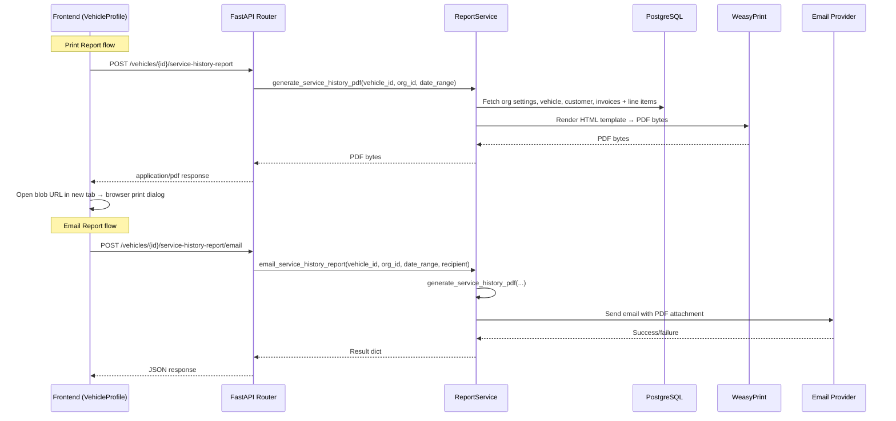

# Design Document: Service History Report

## Overview

This feature adds professional PDF report generation for vehicle service history. The report is generated server-side using WeasyPrint (already installed for invoice PDFs) and Jinja2 HTML templates. It includes a branded cover page, table of contents, and individual invoice detail pages. Users can print the report via the browser print dialog or email it as a PDF attachment to the linked customer.

The backend exposes two new endpoints under the existing vehicles router: one returns the PDF binary for printing, the other generates and emails it. The frontend replaces the current basic HTML print window with a call to the PDF endpoint and updates the existing email modal to use the new email endpoint.

### Key Design Decisions

1. **WeasyPrint for PDF generation** — Already used for invoice PDFs (`generate_invoice_pdf`). Reusing the same library avoids adding a new dependency and keeps the PDF pipeline consistent.
2. **Server-side generation** — The PDF is rendered on the backend where all data (invoices, org settings, customer info) is readily available. The frontend receives the finished PDF bytes.
3. **Single Jinja2 template with sections** — One `service_history_report.html` template handles cover page, TOC, and invoice pages using CSS `page-break-before` rules. This keeps the template manageable and consistent with the existing `invoice.html` pattern.
4. **Reuse existing email infrastructure** — The email sending follows the same SMTP failover pattern used in `email_invoice()`, using the configured `EmailProvider` chain.
5. **No persistent storage** — PDFs are generated on-the-fly and never written to disk, matching the existing invoice PDF approach (Requirement 32.2 pattern).

## Architecture



### Module Placement

- **Backend service**: `app/modules/vehicles/report_service.py` — New module for report generation and emailing, keeping the existing `service.py` focused on vehicle CRUD.
- **Backend router**: New endpoints added to `app/modules/vehicles/router.py`.
- **PDF template**: `app/templates/pdf/service_history_report.html` — New Jinja2 template.
- **Email template**: `app/templates/pdf/service_history_email.html` — HTML email body template.
- **Frontend**: Updates to `frontend/src/pages/vehicles/VehicleProfile.tsx` to call the new API endpoints.

## Components and Interfaces

### Backend API Endpoints

#### `POST /api/v1/vehicles/{id}/service-history-report`

Generates and returns the PDF.

**Request Body:**
```json
{
  "range_years": 1  // 1, 2, 3, or 0 for all time
}
```

**Response:** `application/pdf` binary stream with headers:
```
Content-Type: application/pdf
Content-Disposition: inline; filename="{rego}_service_history_{date}.pdf"
```

**Error Responses:**
- `404` — Vehicle not found or not in user's org
- `401` — Unauthenticated

#### `POST /api/v1/vehicles/{id}/service-history-report/email`

Generates the PDF and emails it.

**Request Body:**
```json
{
  "range_years": 1,
  "recipient_email": "customer@example.com"
}
```

**Response:**
```json
{
  "vehicle_id": "uuid",
  "recipient_email": "customer@example.com",
  "pdf_size_bytes": 45230,
  "status": "sent"
}
```

**Error Responses:**
- `404` — Vehicle not found or not in user's org
- `422` — Invalid email format
- `500` — All email providers failed

### Backend Service: `report_service.py`

```python
async def generate_service_history_pdf(
    db: AsyncSession,
    *,
    org_id: uuid.UUID,
    vehicle_id: uuid.UUID,
    range_years: int,  # 0 = all time
) -> bytes:
    """Generate a multi-page PDF service history report."""

async def email_service_history_report(
    db: AsyncSession,
    *,
    org_id: uuid.UUID,
    vehicle_id: uuid.UUID,
    range_years: int,
    recipient_email: str,
) -> dict:
    """Generate PDF and send via email."""
```

### PDF Template Structure: `service_history_report.html`

The template uses CSS `@page` rules and `page-break-before` to create distinct sections:

1. **Cover Page** — Org branding (logo, name, address, phone, email, GST), vehicle details (rego, make, model, year, VIN, odometer), customer details (name, email, phone), report date range, generation date.
2. **Table of Contents** — List of invoices with invoice number, issue date, status, total. Ordered by issue date descending. Overflow continues to next page.
3. **Invoice Pages** — One page per invoice showing: invoice number, issue date, status, odometer, line items (description, qty, unit price, line total), subtotal, tax, grand total, customer name. Long invoices overflow to continuation pages with header context repeated.
4. **Empty State** — When no invoices match the date range, the cover page includes a "No service records found for the selected period" message and no TOC or invoice pages are rendered.

### Frontend Changes: `VehicleProfile.tsx`

**Print Report button:**
- Replace the current `printServiceReport()` function that builds inline HTML
- New flow: POST to `/vehicles/{id}/service-history-report`, receive PDF blob, open in new tab via `URL.createObjectURL()`, trigger `window.print()`
- Add loading state to the Print Report button during generation

**Email modal:**
- Update `handleEmailServiceHistory()` to POST to `/vehicles/{id}/service-history-report/email`
- Add a manual email input field when no customer email exists (Requirement 6.4)
- Keep existing date range selector and loading/success/error states

## Data Models

No new database tables or migrations are required. The feature reads from existing tables:

### Data Sources

| Data | Source | Access Pattern |
|------|--------|----------------|
| Organisation branding | `organisations.settings` JSONB | `select Organisation where id = org_id` |
| Vehicle details | `global_vehicles` or `org_vehicles` | Existing `get_vehicle_profile()` pattern |
| Linked customer | `customer_vehicles` → `customers` | Existing join in `get_vehicle_profile()` |
| Invoices | `invoices` where `vehicle_rego = rego AND org_id = org_id` | Filtered by `issue_date` for date range |
| Line items | `line_items` where `invoice_id = inv.id` | Loaded per invoice via `get_invoice()` |

### Date Range Filter Logic

```python
def compute_date_cutoff(range_years: int) -> date | None:
    """Return the cutoff date for filtering invoices.
    
    range_years=0 means all time (returns None).
    range_years=N means from (today - N years) to today.
    """
    if range_years == 0:
        return None
    return date.today() - relativedelta(years=range_years)
```

### Report Context Object

The template receives a single context dict:

```python
{
    "org": {
        "name": str,
        "logo_url": str | None,
        "address": str,
        "phone": str | None,
        "email": str | None,
        "gst_number": str | None,
    },
    "vehicle": {
        "rego": str,
        "make": str,
        "model": str,
        "year": int | None,
        "vin": str | None,
        "odometer": int | None,
    },
    "customer": {
        "full_name": str,
        "email": str | None,
        "phone": str | None,
    },
    "invoices": [
        {
            "invoice_number": str,
            "issue_date": str,
            "status": str,
            "odometer": int | None,
            "customer_name": str,
            "line_items": [...],
            "subtotal": Decimal,
            "gst_amount": Decimal,
            "total": Decimal,
        }
    ],
    "date_range_label": str,  # e.g. "Last 1 Year" or "All Time"
    "generated_date": str,
    "has_invoices": bool,
}
```


## Correctness Properties

*A property is a characteristic or behavior that should hold true across all valid executions of a system — essentially, a formal statement about what the system should do. Properties serve as the bridge between human-readable specifications and machine-verifiable correctness guarantees.*

### Property 1: Report structure matches invoice count

*For any* vehicle with N invoices in the selected date range (where N > 0), the rendered report HTML SHALL contain exactly 1 cover page section, 1 table of contents section, and N invoice page sections.

**Validates: Requirements 1.1**

### Property 2: Cover page contains all required fields

*For any* organisation settings (name, address, phone, email, GST number, logo_url), vehicle details (rego, make, model, year, VIN, odometer), and customer details (full name, email, phone), the rendered cover page HTML SHALL contain all non-null field values from each of these three data sources.

**Validates: Requirements 1.2, 1.3, 1.4**

### Property 3: Table of contents lists all invoices with required fields

*For any* set of invoices included in the report, the rendered table of contents SHALL contain every invoice's invoice number, issue date, status, and total amount.

**Validates: Requirements 2.1**

### Property 4: Table of contents ordering

*For any* set of invoices with distinct issue dates, the table of contents SHALL list them in descending order by issue date (most recent first).

**Validates: Requirements 2.2**

### Property 5: Invoice page contains all required fields

*For any* invoice with line items, the rendered invoice page SHALL contain the invoice number, issue date, status, odometer, customer name, and for each line item: description, quantity, unit price, and line total, plus the invoice subtotal, tax amount, and grand total.

**Validates: Requirements 3.1, 3.2, 3.3, 3.4**

### Property 6: Date range filtering correctness

*For any* set of invoices with random issue dates and any selected range (1, 2, or 3 years), every invoice in the filtered result SHALL have an issue_date on or after the cutoff date, and every invoice excluded SHALL have an issue_date before the cutoff date. When range_years is 0 (all time), all invoices SHALL be included.

**Validates: Requirements 4.2, 4.4**

### Property 7: Email content completeness

*For any* organisation settings, vehicle (rego, make, model, year), and date range, the email subject SHALL contain the vehicle's registration number and "Service History Report", and the email body SHALL contain the vehicle registration, make, model, year, and date range label.

**Validates: Requirements 7.1, 7.2, 7.3**

### Property 8: PDF attachment filename format

*For any* vehicle registration string and generation date, the PDF attachment filename SHALL match the pattern `{rego}_service_history_{YYYY-MM-DD}.pdf` where rego is the vehicle registration and the date is the generation date.

**Validates: Requirements 7.4**

### Property 9: 404 for non-existent or wrong-org vehicle

*For any* randomly generated vehicle UUID that does not exist in the database, or any vehicle that belongs to a different organisation, the report generation endpoint SHALL return a 404 error.

**Validates: Requirements 8.3**

### Property 10: 422 for invalid email format

*For any* string that is not a valid email address (missing @, missing domain, etc.), the email endpoint SHALL return a 422 validation error.

**Validates: Requirements 8.4**

## Error Handling

| Scenario | Handler | Response |
|----------|---------|----------|
| Vehicle not found / wrong org | Router | 404 `{"detail": "Vehicle not found"}` |
| Invalid email format | Pydantic schema validation | 422 with validation error details |
| No email providers configured | `email_service_history_report()` | 500 `{"detail": "No active email provider configured"}` |
| All email providers fail | SMTP failover loop | 500 `{"detail": "Failed to send email: {last_error}"}` |
| WeasyPrint rendering failure | `generate_service_history_pdf()` | 500 `{"detail": "Failed to generate report"}` |
| Org logo_url unreachable | WeasyPrint (graceful) | PDF renders without logo (WeasyPrint skips broken images) |
| No invoices in date range | Template logic | PDF with cover page + "No service records found" message |
| Unauthenticated request | Existing auth middleware | 401 `{"detail": "Not authenticated"}` |

### Logging

- Report generation: audit log entry `vehicle.report_generated` with vehicle_id, date_range, pdf_size_bytes
- Email sent: audit log entry `vehicle.report_emailed` with vehicle_id, recipient, pdf_size_bytes, provider_key
- Email failure: error logged with provider details and exception

## Testing Strategy

### Property-Based Testing

Use **Hypothesis** (Python) for backend property tests and **fast-check** (TypeScript) for frontend property tests. Each property test runs a minimum of 100 iterations.

**Backend property tests** (`tests/properties/test_service_history_report_properties.py`):

- **Feature: service-history-report, Property 1: Report structure matches invoice count** — Generate random lists of invoice dicts (0–20), render the template, assert section counts match.
- **Feature: service-history-report, Property 2: Cover page contains all required fields** — Generate random org/vehicle/customer data, render cover page, assert all non-null values appear in HTML.
- **Feature: service-history-report, Property 3: TOC lists all invoices** — Generate random invoice sets, render TOC, assert all invoice numbers/dates/statuses/totals appear.
- **Feature: service-history-report, Property 4: TOC ordering** — Generate random invoices with random dates, render TOC, extract invoice numbers in order, verify descending date sort.
- **Feature: service-history-report, Property 5: Invoice page completeness** — Generate random invoices with random line items, render invoice pages, assert all fields present.
- **Feature: service-history-report, Property 6: Date range filtering** — Generate random invoices with random dates and random range_years, apply filter, verify all results are within range and all excluded are outside.
- **Feature: service-history-report, Property 7: Email content completeness** — Generate random org/vehicle/date_range, build email subject and body, assert required strings present.
- **Feature: service-history-report, Property 8: Attachment filename format** — Generate random rego strings and dates, build filename, assert regex match `^.+_service_history_\d{4}-\d{2}-\d{2}\.pdf$`.
- **Feature: service-history-report, Property 9: 404 for invalid vehicle** — Generate random UUIDs, call endpoint, assert 404.
- **Feature: service-history-report, Property 10: 422 for invalid email** — Generate random non-email strings, call endpoint, assert 422.

Each property test MUST be implemented as a SINGLE property-based test using Hypothesis `@given` decorator. Each test MUST include a comment tag: `# Feature: service-history-report, Property N: {title}`.

### Unit Tests

Unit tests (`tests/test_service_history_report.py`) cover specific examples and edge cases:

- Empty invoice list produces cover-page-only PDF with "no records" message (Req 1.5)
- Date range filter defaults to 1 year (Req 4.3)
- Date range options include 1, 2, 3 years and all time (Req 4.1)
- Email defaults to linked customer's email (Req 6.3)
- Manual email entry when no customer email exists (Req 6.4)
- API endpoint returns `application/pdf` content type (Req 8.1)
- Email endpoint returns success JSON (Req 8.2)
- Auth required on both endpoints (Req 8.5)

### Frontend Tests

Frontend unit tests in `frontend/src/pages/vehicles/__tests__/VehicleProfile.report.test.tsx`:

- Print button shows loading state during PDF generation (Req 5.3)
- Email modal opens on button click (Req 6.1)
- Success notification after email sent (Req 6.6)
- Error message on email failure (Req 6.7)
- Send button disabled during sending (Req 6.5)
- Manual email input shown when no customer email (Req 6.4)
