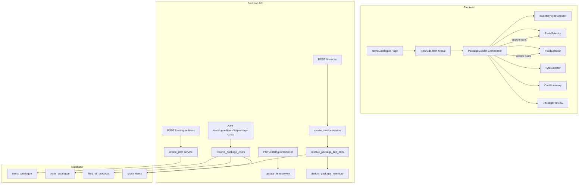

# Design Document: Service Package Builder

## Overview

The Service Package Builder extends the existing Items Catalogue to support bundled service items that combine labour (the sell price on `items_catalogue`) with inventory components (parts, fluids, tyres). A package item remains an `items_catalogue` row but carries a JSONB `package_components` column describing its linked inventory products and quantities.

**Key Design Decisions:**

1. **JSONB column on `items_catalogue`** (not a separate junction table) — chosen because:
   - Package components are always read/written as a unit (never queried individually across packages)
   - Avoids N+1 queries when listing items — a single column fetch gives full component data
   - Simplifies duplication (deep-copy the JSON)
   - The snapshot cost stored at creation time is reference-only; live cost is always recalculated from `stock_items`/catalogue at usage time
   - No foreign-key cascade concerns when parts/fluids are deactivated (handled via availability checks)

2. **`is_package` boolean flag** on `items_catalogue` — enables fast filtering and badge display without parsing JSONB.

3. **Cost recalculation at invoice time** — the `cost_price` on a line item is computed from live inventory prices when the package is added to an invoice, not from the snapshot stored at package creation. This ensures profit reporting reflects actual costs.

4. **Inventory deduction is per-component** — when a package item is used on an issued invoice, each component's stock is decremented individually (parts/tyres by quantity, fluids by volume). Fluid usage entries are written to `invoice_data_json.fluid_usage` consistent with existing behaviour.

## Architecture



## Components and Interfaces

### Backend API Endpoints

#### 1. Modified: `POST /catalogue/items` and `PUT /catalogue/items/:id`

Extended to accept package component data.

**Request body additions:**
```json
{
  "is_package": true,
  "package_components": [
    {
      "catalogue_item_id": "uuid",
      "catalogue_type": "part",
      "quantity": 2,
      "cost_per_unit_snapshot": 12.50
    },
    {
      "catalogue_item_id": "uuid",
      "catalogue_type": "fluid",
      "volume": 4.5,
      "cost_per_unit_snapshot": 8.75
    },
    {
      "catalogue_item_id": "uuid",
      "catalogue_type": "tyre",
      "quantity": 4,
      "cost_per_unit_snapshot": 85.00
    }
  ]
}
```

**Validation rules:**
- `is_package` must be `true` if `package_components` is non-empty
- Each component must have a valid `catalogue_item_id` that exists in `parts_catalogue` or `fluid_oil_products`
- `catalogue_type` must be one of: `part`, `tyre`, `fluid`
- Parts/tyres require `quantity` (integer ≥ 1)
- Fluids require `volume` (decimal > 0, in litres)
- `cost_per_unit_snapshot` is captured at save time for reference

#### 2. New: `GET /catalogue/items/:id/package-costs`

Resolves live costs for all components of a package item.

**Cost resolution logic per component:**
1. Query `stock_items` where `catalogue_item_id = component.catalogue_item_id` AND `org_id = current_org`
2. If only one stock item exists → use it automatically (no user prompt)
3. If multiple stock items exist → return all options with their branch, cost, and available quantity so the frontend can prompt the user to select
4. If no stock item exists → fall back to `parts_catalogue.cost_per_unit` or `fluid_oil_products.cost_per_unit`
5. `stock_available` is per-stock-item (not aggregated) so the user can see availability per branch/location

**Multi-stock-item selection at invoice time:**
When a package item is added to an invoice and a component has multiple stock items, the invoice creation flow SHALL present a selection modal asking the user to choose which stock item to use for each ambiguous component. The modal shows: branch name, location, available quantity, and cost per unit for each option. The user's selection determines which stock item is decremented and which cost is used for the `cost_price` calculation.

**Response:**
```json
{
  "components": [
    {
      "catalogue_item_id": "uuid",
      "catalogue_type": "part",
      "name": "Oil Filter",
      "quantity": 1,
      "cost_per_unit": 12.50,
      "line_total": 12.50,
      "stock_available": 15,
      "is_available": true
    },
    {
      "catalogue_item_id": "uuid",
      "catalogue_type": "fluid",
      "name": "Penrite HPR 5W-30",
      "volume": 4.5,
      "cost_per_unit": 8.75,
      "line_total": 39.38,
      "stock_available": 22.5,
      "is_available": true
    }
  ],
  "total_cost": 51.88,
  "sell_price": 120.00,
  "profit": 68.12
}
```

**Access control:** `cost_per_unit`, `line_total`, `total_cost`, and `profit` fields are omitted for non-admin roles (`branch_admin`, `salesperson`). They still receive `components` with names, quantities, and availability.

#### 3. New: `GET /catalogue/parts/search?q=...&part_type=part|tyre`

Searchable endpoint for the parts/tyre selector dropdowns.

**Query params:** `q` (search string), `part_type` (filter), `limit` (default 20)

**Response:**
```json
{
  "items": [
    {
      "id": "uuid",
      "name": "Oil Filter - Toyota",
      "part_number": "OF-123",
      "part_type": "part",
      "brand": "Ryco",
      "cost_per_unit": 12.50,
      "stock_available": 15
    }
  ]
}
```

#### 4. New: `GET /catalogue/fluids/search?q=...&fluid_type=oil|non-oil&oil_type=engine`

Searchable endpoint for the fluid selector.

**Query params:** `q` (search), `fluid_type`, `oil_type`, `limit` (default 20)

**Response:**
```json
{
  "items": [
    {
      "id": "uuid",
      "product_name": "Penrite HPR 5",
      "brand_name": "Penrite",
      "fluid_type": "oil",
      "oil_type": "engine",
      "grade": "5W-30",
      "cost_per_unit": 8.75,
      "stock_available": 22.5
    }
  ]
}
```

#### 5. Modified: `GET /catalogue/items` (list endpoint)

**Response additions per item:**
```json
{
  "is_package": true,
  "package_cost": 51.88,
  "package_profit": 68.12,
  "has_unavailable_components": false
}
```

- `package_cost` and `package_profit` only included for admin roles
- `has_unavailable_components` included for all roles (drives warning icon)

#### 6. New: `POST /catalogue/items/:id/duplicate`

Creates a copy of a package item with all its components.

**Response:** The newly created item (same shape as create response).

#### 7. Modified: Invoice creation (`POST /invoices`)

When a line item references a package `catalogue_item_id`:
1. Resolve all components from `package_components` JSONB
2. Calculate `cost_price` as sum of live component costs
3. On issue: deduct inventory for each component
4. Write fluid components to `invoice_data_json.fluid_usage`

### Frontend Component Tree

#### Navigation & Access

- **Location:** Existing Items Catalogue page (`/items`) — no new navigation item needed
- **Access point:** The "New Item" button and item edit modal on the Items Page
- **Route:** No new route — the Package Builder lives inside the existing New/Edit Item modal
- **Guard:** Standard org role guard (existing). Module gate for package features: `isEnabled('vehicles') && isEnabled('inventory')`
- **Roles:** All org roles can create packages. Cost visibility restricted to `org_admin`/`global_admin`.

#### Component Breakdown

```
ItemsCatalogue (existing page)
├── ItemsTable (modified — adds Package badge, cost/profit columns)
├── NewItemModal / EditItemModal (modified — adds PackageBuilder)
│   ├── StandardItemForm (existing fields: name, price, GST, category)
│   └── PackageBuilder (new, conditionally rendered)
│       ├── IncludeInventoryToggle (checkbox)
│       ├── InventoryTypeSelector (Parts/Fluid/Tyre checkboxes)
│       ├── PartsSelector (searchable dropdown + quantity)
│       │   └── ComponentRow (name, qty input, cost display, remove button)
│       ├── TyreSelector (searchable dropdown + quantity)
│       │   └── ComponentRow (same as above)
│       ├── FluidSelector (multi-entry)
│       │   └── FluidEntry (fluid_type toggle, oil_type dropdown, product dropdown, litres input, cost display)
│       ├── CostSummary (total cost, profit — admin only)
│       └── PackagePreview (read-only summary with stock availability)
└── DuplicateItemModal (new — confirmation dialog for package duplication)
```

#### File Locations

| Component | Path |
|-----------|------|
| PackageBuilder | `frontend/src/pages/items/components/PackageBuilder.tsx` |
| IncludeInventoryToggle | inline in PackageBuilder |
| InventoryTypeSelector | `frontend/src/pages/items/components/InventoryTypeSelector.tsx` |
| PartsSelector | `frontend/src/pages/items/components/PartsSelector.tsx` |
| TyreSelector | `frontend/src/pages/items/components/TyreSelector.tsx` |
| FluidSelector | `frontend/src/pages/items/components/FluidSelector.tsx` |
| FluidEntry | `frontend/src/pages/items/components/FluidEntry.tsx` |
| CostSummary | `frontend/src/pages/items/components/CostSummary.tsx` |
| PackagePreview | `frontend/src/pages/items/components/PackagePreview.tsx` |
| ComponentRow | `frontend/src/pages/items/components/ComponentRow.tsx` |

#### State Management

- **PackageBuilder** uses local `useState` for component selections (no global context needed)
- Component list state: `PackageComponent[]` array
- Cost calculation: derived state computed on every component change (no API call — costs are fetched when components are selected)
- The modal form state holds both standard item fields and package component data, submitted together on save

### User Workflow Traces

#### Create Package Flow

```
User clicks "+ New Item" on Items Page
→ NewItemModal opens with standard form fields
→ IF vehicles + inventory modules enabled:
    → "Include Inventory Usage" checkbox renders below form fields
    → User checks the checkbox
    → InventoryTypeSelector appears (Parts / Fluid / Tyre checkboxes)
    → User checks "Parts"
    → PartsSelector appears with searchable dropdown
    → User types "oil filter" → API: GET /catalogue/parts/search?q=oil+filter&part_type=part
    → User selects "Oil Filter - Toyota" from results
    → ComponentRow appears: "Oil Filter - Toyota | Qty: 1 | $12.50 | ×"
    → User checks "Fluid"
    → FluidSelector appears
    → User clicks "+ Add Fluid"
    → FluidEntry appears: [Oil / Non-Oil toggle]
    → User selects "Oil" → oil_type dropdown appears
    → User selects "Engine" → API: GET /catalogue/fluids/search?fluid_type=oil&oil_type=engine
    → User selects "Penrite HPR 5W-30" → litres input appears
    → User enters "4.5" litres
    → FluidEntry shows: "Penrite HPR 5W-30 | 4.5L | $8.75/L | $39.38"
→ CostSummary updates: "Total Cost: $51.88 | Profit: $68.12" (admin only)
→ User clicks "Preview Package"
→ PackagePreview shows read-only summary with stock availability
→ User fills in name: "Full Service - 5W30", price: "$120.00"
→ User clicks "Create Item"
→ API: POST /catalogue/items (with is_package=true, package_components=[...])
→ Toast: "Item created successfully"
→ Modal closes, table refreshes, new item shows "Package" badge
```

#### Edit Package Flow

```
User clicks package item row in table
→ EditItemModal opens
→ Standard fields pre-populated
→ "Include Inventory Usage" checkbox is checked (pre-populated)
→ PackageBuilder loads saved components from API response
→ User modifies quantities, adds/removes components
→ CostSummary recalculates live
→ User clicks "Save Changes"
→ API: PUT /catalogue/items/:id (with updated package_components)
→ Toast: "Item updated successfully"
```

#### Use Package on Invoice Flow

```
User creates invoice → adds line item → searches catalogue
→ Selects "Full Service - 5W30" (package item)
→ Backend resolves package components, checks stock_items for each
→ IF any component has multiple stock items (e.g., same part in 2 branches):
    → "Select Stock Source" modal appears for that component
    → Shows: Branch A (Rack 1/C, 13 available, $55.90/unit) | Branch B (8 available, $55.90/unit)
    → User selects one
→ IF component has only one stock item → auto-selected (no prompt)
→ cost_price calculated from selected stock items' live prices
→ Line item added with cost_price = sum of component costs
→ User issues invoice
→ Backend deducts from the specific stock items the user selected
→ Backend writes fluid_usage entry to invoice_data_json
→ Invoice line item shows sell price to customer; cost_price stored internally
```

#### Duplicate Package Flow

```
User clicks "⋮" menu on package item row → selects "Duplicate"
→ DuplicateItemModal: "Create a copy of 'Full Service - 5W30'?"
→ User confirms
→ API: POST /catalogue/items/:id/duplicate
→ New item created: "Full Service - 5W30 (Copy)" with same components
→ Toast: "Package duplicated"
→ Table refreshes
```

#### Unavailable Component Warning Flow

```
User opens edit modal for a package item
→ API returns package_components with availability status
→ One component (e.g., "Ryco Oil Filter") has been deactivated
→ Warning banner: "1 component is no longer available in inventory"
→ ComponentRow shows: "~~Ryco Oil Filter~~ [Unavailable]" with strikethrough
→ User can remove it and select a replacement, or leave it
→ On invoice usage: unavailable component's snapshot cost is used, no stock deduction
```

### Panel/Modal/Drawer Inventory

| Element | Trigger | Contents | Close |
|---------|---------|----------|-------|
| NewItemModal | "+ New Item" button | Standard form + PackageBuilder | X, backdrop, Escape, Save |
| EditItemModal | Click item row | Pre-populated form + PackageBuilder | X, backdrop, Escape, Save |
| PackagePreview | "Preview Package" button inside modal | Read-only component summary | "Close Preview" button (inline collapse, not separate modal) |
| DuplicateItemModal | Row action menu → "Duplicate" | Confirmation text + buttons | Cancel, backdrop, Escape |
| DeleteConfirmModal | Row action → "Delete" (existing) | Warning text | Cancel, backdrop |
| StockSourceModal | Adding package item to invoice when component has multiple stock items | List of stock items per component with branch, location, qty, cost. User selects one per ambiguous component. | Confirm selection, Cancel |

### Toolbar/Action Bar

The Items Page table gets an additional row action for package items:

| Button | Visibility | Action |
|--------|-----------|--------|
| Edit | Always | Opens EditItemModal |
| Duplicate | Package items only | Opens DuplicateItemModal |
| Delete | Always | Opens DeleteConfirmModal |

### List/Table Modifications

The Items Catalogue table adds:

| Column | Visibility | Content |
|--------|-----------|---------|
| Badge | Always | "Package" badge next to name for `is_package=true` items |
| Cost | `org_admin`, `global_admin` only | Package cost (sum of component costs) |
| Profit | `org_admin`, `global_admin` only | Sell price minus package cost |
| Warning icon | Always | ⚠️ icon if `has_unavailable_components=true` |

Existing columns (Name, Category, Price, GST, Status, Actions) remain unchanged.

## Data Models

### Schema Change: `items_catalogue` table

```sql
ALTER TABLE items_catalogue
  ADD COLUMN IF NOT EXISTS is_package BOOLEAN NOT NULL DEFAULT false;

ALTER TABLE items_catalogue
  ADD COLUMN IF NOT EXISTS package_components JSONB NULL;
```

### `package_components` JSONB Structure

```json
[
  {
    "catalogue_item_id": "550e8400-e29b-41d4-a716-446655440000",
    "catalogue_type": "part",
    "quantity": 2,
    "cost_per_unit_snapshot": 12.50
  },
  {
    "catalogue_item_id": "6ba7b810-9dad-11d1-80b4-00c04fd430c8",
    "catalogue_type": "fluid",
    "volume": 4.5,
    "cost_per_unit_snapshot": 8.75,
    "fluid_type": "oil",
    "oil_type": "engine",
    "grade": "5W-30"
  },
  {
    "catalogue_item_id": "7c9e6679-7425-40de-944b-e07fc1f90ae7",
    "catalogue_type": "tyre",
    "quantity": 4,
    "cost_per_unit_snapshot": 85.00
  }
]
```

**Field descriptions:**
- `catalogue_item_id`: UUID referencing `parts_catalogue.id` (for part/tyre) or `fluid_oil_products.id` (for fluid)
- `catalogue_type`: `"part"` | `"tyre"` | `"fluid"`
- `quantity`: integer, for parts and tyres
- `volume`: decimal (litres), for fluids
- `cost_per_unit_snapshot`: cost at time of package creation/last edit (reference only)
- `fluid_type`, `oil_type`, `grade`: denormalized fluid metadata for display without extra lookups

### SQLAlchemy Model Update

```python
# In app/modules/catalogue/models.py — ItemsCatalogue class

is_package: Mapped[bool] = mapped_column(
    Boolean, nullable=False, server_default="false"
)
package_components: Mapped[list[dict] | None] = mapped_column(
    JSONB, nullable=True
)
```

### Pydantic Schema Additions

```python
class PackageComponent(BaseModel):
    catalogue_item_id: uuid.UUID
    catalogue_type: Literal["part", "tyre", "fluid"]
    quantity: int | None = None  # for part/tyre
    volume: float | None = None  # for fluid (litres)
    cost_per_unit_snapshot: float | None = None
    fluid_type: str | None = None
    oil_type: str | None = None
    grade: str | None = None

class ItemCreateRequest(BaseModel):
    # ... existing fields ...
    is_package: bool = False
    package_components: list[PackageComponent] | None = None

class ItemResponse(BaseModel):
    # ... existing fields ...
    is_package: bool = False
    package_components: list[dict] | None = None
    package_cost: float | None = None  # admin only
    package_profit: float | None = None  # admin only
    has_unavailable_components: bool = False
```

## Error Handling

### Frontend Error States

| Scenario | UI Response |
|----------|-------------|
| API error loading parts/fluids search | Toast: "Failed to load inventory items. Please try again." Dropdown shows empty state. |
| API error saving package | Toast with backend error message. Modal stays open, form preserved. |
| Validation: no components selected but is_package=true | Inline error: "Add at least one inventory component or uncheck Include Inventory Usage." |
| Validation: fluid entry missing litres | Inline error on field: "Volume in litres is required." |
| Validation: quantity ≤ 0 | Inline error on field: "Quantity must be at least 1." |
| Network timeout on cost lookup | CostSummary shows "Unable to calculate cost" with retry link. |
| Component deactivated since last edit | Warning banner + strikethrough on affected components. |
| Insufficient stock at invoice time | Warning toast: "Low stock for: Oil Filter (2 needed, 1 available). Invoice will proceed." |

### Backend Error Handling

| Scenario | HTTP Status | Response |
|----------|-------------|----------|
| Invalid `catalogue_item_id` (not found) | 400 | `{"detail": "Component not found: {id}"}` |
| Invalid `catalogue_type` | 422 | Pydantic validation error |
| Quantity/volume ≤ 0 | 422 | Pydantic validation error |
| Package with no components | 400 | `{"detail": "Package must have at least one component"}` |
| Duplicate endpoint — item not found | 404 | `{"detail": "Item not found"}` |
| Duplicate endpoint — item is not a package | 400 | `{"detail": "Only package items can be duplicated"}` |
| Non-admin requesting cost data | 200 | Response with cost fields omitted (not an error) |
| Component stock insufficient at invoice time | 200 | Invoice proceeds; warning in response `{"warnings": ["Low stock: ..."]}` |

### Integration Points with Existing UI

1. **Items Catalogue table** — adds Package badge column, cost/profit columns (admin), warning icon, duplicate action
2. **New/Edit Item Modal** — extended with PackageBuilder below existing form fields
3. **Invoice line item creation** — backend automatically handles package cost calculation and inventory deduction when a package `catalogue_item_id` is referenced
4. **Invoice fluid_usage** — package fluid components are written to `invoice_data_json.fluid_usage` using the same structure as manual fluid usage entries
5. **ModuleContext** — used to gate the "Include Inventory Usage" checkbox visibility

</text>
</invoke>


## Correctness Properties

*A property is a characteristic or behavior that should hold true across all valid executions of a system — essentially, a formal statement about what the system should do. Properties serve as the bridge between human-readable specifications and machine-verifiable correctness guarantees.*

### Property 1: Module gating controls package builder visibility

*For any* combination of module enabled/disabled states, the "Include Inventory Usage" checkbox and Package Builder UI SHALL be visible if and only if both `vehicles` AND `inventory` modules are enabled for the organisation.

**Validates: Requirements 1.1, 1.5**

### Property 2: Unchecking the inventory toggle clears all component selections

*For any* set of previously selected package components (parts, fluids, tyres of any quantity), unchecking the "Include Inventory Usage" checkbox SHALL result in an empty component list and hidden inventory type panel.

**Validates: Requirements 1.4**

### Property 3: Part type search filtering returns only matching types

*For any* search query against the parts/tyre catalogue, the results SHALL contain only items where `part_type` matches the requested filter (`part` for parts selector, `tyre` for tyre selector). No result shall have a mismatched `part_type`.

**Validates: Requirements 4.1, 4.5**

### Property 4: Package cost equals sum of component costs

*For any* set of package components, the Package_Cost SHALL equal the sum of `(cost_per_unit × quantity)` for all part and tyre components plus `(cost_per_unit × volume)` for all fluid components. This must hold regardless of the number or mix of component types.

**Validates: Requirements 5.1**

### Property 5: Package profit equals sell price minus package cost

*For any* package item with a `default_price` (sell price) and a computed Package_Cost, the Package_Profit SHALL equal `default_price − Package_Cost`.

**Validates: Requirements 5.4**

### Property 6: Negative profit triggers warning indicator

*For any* package where Package_Cost exceeds `default_price` (resulting in negative profit), the profit display SHALL use red styling and show a warning indicator.

**Validates: Requirements 5.5**

### Property 7: Cost data visibility is restricted to admin roles

*For any* user role, cost-related fields (cost_per_unit, Package_Cost, Package_Profit) SHALL be visible/included in API responses if and only if the user's role is `org_admin` or `global_admin`. All other roles (`branch_admin`, `salesperson`) SHALL NOT see cost data.

**Validates: Requirements 5.7, 10.1, 10.2, 10.3**

### Property 8: Stock warning badges appear when stock is insufficient

*For any* package component where the available stock quantity is less than the required quantity (or available volume is less than required volume for fluids), the Package_Preview SHALL display a "Low Stock" or "Out of Stock" warning badge for that component.

**Validates: Requirements 6.9**

### Property 9: Package persistence round-trip preserves all component data

*For any* valid package item with components, saving via the API and then reading back SHALL produce identical component data: same `catalogue_item_id`, `catalogue_type`, `quantity`/`volume`, and `cost_per_unit_snapshot` for each component.

**Validates: Requirements 7.1, 7.2, 7.3**

### Property 10: Package update replaces (not merges) component metadata

*For any* existing package item, updating with a new set of components SHALL result in only the new components being stored. No components from the previous version shall remain unless explicitly included in the update payload.

**Validates: Requirements 7.5**

### Property 11: Removing package flag clears all package metadata

*For any* package item, setting `is_package=false` (or unchecking "Include Inventory Usage") via update SHALL result in `is_package=false` and `package_components=null` in the persisted record.

**Validates: Requirements 7.6**

### Property 12: Invoice cost_price equals sum of live component costs

*For any* package item added to an invoice, the `cost_price` on the resulting line item SHALL equal the sum of current (live) `cost_per_unit × quantity` for parts/tyres and `cost_per_unit × volume` for fluids, using prices from `stock_items` (with catalogue fallback) at invoice creation time.

**Validates: Requirements 8.1**

### Property 13: Invoice issuance deducts correct inventory quantities

*For any* package item on an issued invoice, each component's stock SHALL be decremented by exactly the component's specified quantity (parts/tyres) or volume (fluids). The stock change for each component SHALL equal the negative of its required amount.

**Validates: Requirements 8.2**

### Property 14: Package fluid components are recorded in invoice fluid_usage

*For any* package item with fluid components used on an issued invoice, each fluid component SHALL produce a corresponding entry in `invoice_data_json.fluid_usage` with correct `stock_item_id`, `litres`, `cost_per_litre`, and `total_cost`.

**Validates: Requirements 8.4**

### Property 15: Quotes with package items do not deduct inventory

*For any* package item added to a quote, the stock quantities for all components SHALL remain unchanged. No inventory deduction or reservation SHALL occur for quote line items.

**Validates: Requirements 8.5**

### Property 16: Package duplication preserves all components

*For any* package item, duplicating it SHALL produce a new item with a different `id` but identical `package_components` data (same catalogue_item_ids, types, quantities, volumes, and cost snapshots).

**Validates: Requirements 9.4**

### Property 17: Unavailable components trigger warning on package edit

*For any* package item where one or more referenced catalogue products have `is_active=false`, opening the package for editing SHALL display a warning identifying all unavailable components.

**Validates: Requirements 11.1**

### Property 18: Unavailable components skip deduction but retain cost on invoice

*For any* package component that is unavailable (deactivated/deleted) at invoice time, the system SHALL NOT attempt stock deduction for that component, but SHALL include its `cost_per_unit_snapshot` in the line item's `cost_price` calculation.

**Validates: Requirements 11.3**

## Testing Strategy

### Property-Based Testing

**Library:** Hypothesis (Python backend) + fast-check (TypeScript frontend)

**Configuration:** Minimum 100 iterations per property test.

**Tag format:** `Feature: service-package-builder, Property {N}: {title}`

The following properties are best suited for property-based testing:

| Property | Layer | Approach |
|----------|-------|----------|
| 1 (Module gating) | Frontend | Generate random module state combos, verify visibility |
| 3 (Part type filtering) | Backend | Generate random catalogue data, verify filter correctness |
| 4 (Cost calculation) | Backend + Frontend | Generate random component lists, verify sum formula |
| 5 (Profit calculation) | Frontend | Generate random prices, verify subtraction |
| 7 (Role-based visibility) | Backend | Generate random roles, verify field inclusion/exclusion |
| 9 (Persistence round-trip) | Backend | Generate random valid packages, save + read back |
| 10 (Update replaces) | Backend | Generate two component sets, update, verify replacement |
| 11 (Remove flag clears) | Backend | Generate random packages, remove flag, verify null |
| 12 (Invoice cost_price) | Backend | Generate packages with known stock prices, verify sum |
| 13 (Inventory deduction) | Backend | Generate packages, issue invoice, verify stock changes |
| 14 (Fluid usage recording) | Backend | Generate packages with fluids, verify fluid_usage entries |
| 15 (Quotes no deduction) | Backend | Generate packages on quotes, verify stock unchanged |
| 16 (Duplication) | Backend | Generate packages, duplicate, verify equality |
| 18 (Unavailable skip deduction) | Backend | Generate packages with inactive components, verify behavior |

### Unit Tests (Example-Based)

- Module gating: specific scenarios (both enabled, one disabled, neither enabled)
- UI interactions: checkbox toggles, dropdown selections, modal open/close
- Validation: empty volume, zero quantity, missing required fields
- Edge cases: empty search results, all components unavailable, zero-cost components
- Access control: kiosk role blocked from Items Page

### Integration Tests

- Full create → edit → duplicate → delete lifecycle
- Package item on invoice: cost calculation + inventory deduction end-to-end
- Package item on quote: verify no deduction
- Concurrent edit: two users editing same package
- Large packages: 20+ components performance check

### Frontend Component Tests

- PackageBuilder renders correctly with/without modules
- CostSummary shows/hides based on role
- PackagePreview displays all component details
- FluidSelector cascading dropdowns work correctly
- Search debouncing and result display
