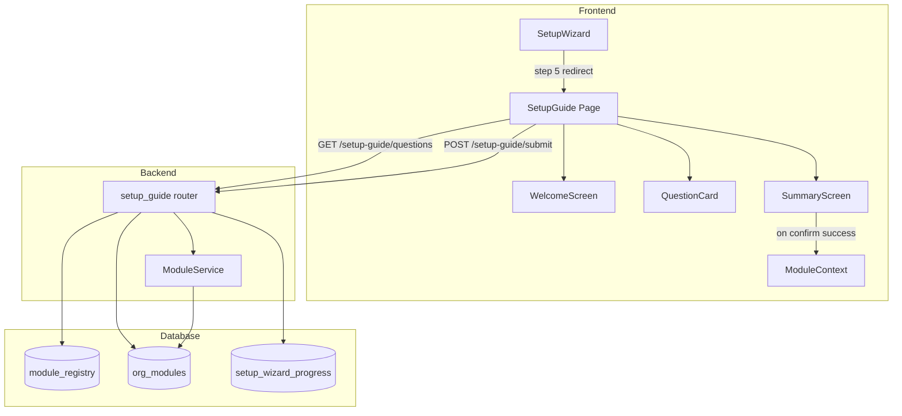
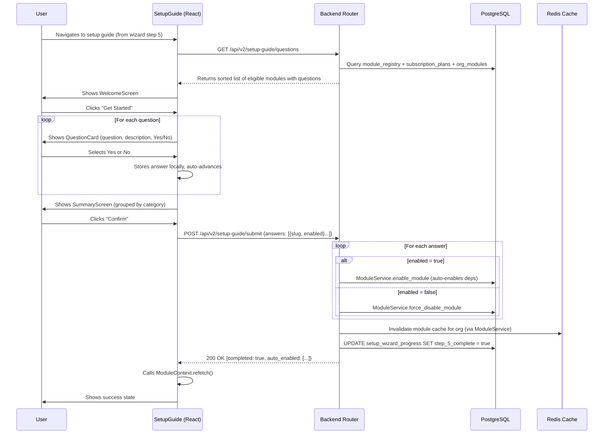
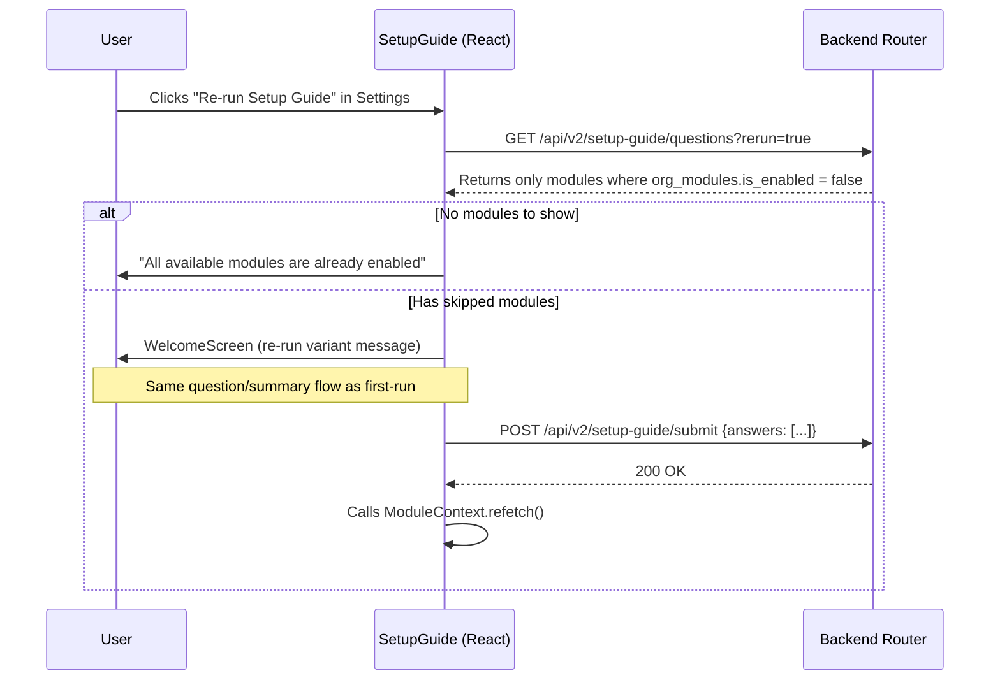

# Design Document: Setup Guide

## Overview

The Setup Guide replaces the technical module toggle step (Step 5) in the existing setup wizard with a friendly, question-driven onboarding flow. Instead of presenting raw module names and checkboxes, users answer plain-language questions like "Would you be sending quotes to your customers?" to enable or skip optional modules.

This is primarily a **frontend feature** with minimal backend plumbing:

1. **Database** — Two new columns on `module_registry` (`setup_question`, `setup_question_description`) + seed data. No new tables.
2. **Backend** — Two thin endpoints in a lightweight router that queries `module_registry` and delegates to the existing `ModuleService`. No new service class.
3. **Frontend** — The main work: a `SetupGuide` page with state machine (loading → welcome → questions → summary → submitting → success), `WelcomeScreen`, `QuestionCard`, and `SummaryScreen` components.

### Design Decisions

- **No new tables**: Completion is tracked via the existing `setup_wizard_progress.step_5_complete` flag. Re-run eligibility is determined by checking `org_modules.is_enabled`. A dedicated `setup_guide_completions` table would be over-engineering for a boolean "done/not done" check.
- **No new service class**: The router directly uses `ModuleService.enable_module()` and `ModuleService.force_disable_module()`. The filtering logic is simple enough to live in the router function itself.
- **No `/status` endpoint**: The wizard already checks its own `setup_wizard_progress` record. The setup guide page doesn't need a separate status check — it just fetches questions and renders.
- **Dependency ordering via topological sort**: The backend sorts questions using the existing `DEPENDENCY_GRAPH` from `app/core/modules.py` so prerequisites always appear before dependents. Computed at query time, not stored.
- **`trade_family_gated` not stored in DB**: Instead of adding a column, the router checks against a hardcoded set (currently just `vehicles`). This matches how `CORE_MODULES` is handled in `app/core/modules.py` — it's a small, rarely-changing set.

## Architecture



### Data Flow: First-Run Setup Guide



### Data Flow: Re-Run from Settings



## Components and Interfaces

### Backend Components

#### 1. Database Migration

Adds two columns to `module_registry` and seeds setup questions for all non-core modules.

**Changes to `module_registry`:**
- `setup_question TEXT NULL` — The user-friendly question string
- `setup_question_description TEXT NULL` — Optional explanatory text below the question

**Seed data:** Updates existing `module_registry` rows with `setup_question` and `setup_question_description` values for all non-core, non-trade-gated modules.

#### 2. Updated Model (`app/modules/module_management/models.py`)

Add two new columns to the `ModuleRegistry` class:

```python
setup_question: Mapped[str | None] = mapped_column(Text, nullable=True)
setup_question_description: Mapped[str | None] = mapped_column(Text, nullable=True)
```

#### 3. Schemas (`app/modules/setup_guide/schemas.py`)

```python
class SetupGuideQuestion(BaseModel):
    slug: str
    display_name: str
    setup_question: str
    setup_question_description: str | None
    category: str
    dependencies: list[str]

class SetupGuideQuestionsResponse(BaseModel):
    questions: list[SetupGuideQuestion]
    total: int

class SetupGuideAnswer(BaseModel):
    slug: str
    enabled: bool

class SetupGuideSubmitRequest(BaseModel):
    answers: list[SetupGuideAnswer]

class SetupGuideSubmitResponse(BaseModel):
    completed: bool
    auto_enabled: list[str]   # dependency modules auto-enabled by ModuleService
    message: str
```

#### 4. Router (`app/modules/setup_guide/router.py`)

A lightweight router with two endpoints. No service class — the logic is simple enough to live directly in the route handlers.

| Method | Path | Description |
|--------|------|-------------|
| GET | `/api/v2/setup-guide/questions` | Returns eligible modules with questions. Query param: `rerun=true\|false` |
| POST | `/api/v2/setup-guide/submit` | Submits answers, enables/disables modules via ModuleService |

**GET `/questions` logic:**
1. Query `module_registry` for all modules with `setup_question IS NOT NULL` and `is_core = false`
2. Filter out trade-family-gated modules (hardcoded set: `{"vehicles"}`)
3. Filter to modules in the org's subscription plan (`enabled_modules` list or plan has `"all"`)
4. If `rerun=true`: additionally filter to modules where `org_modules.is_enabled = false`
5. Sort by topological order using `DEPENDENCY_GRAPH` from `app/core/modules.py`
6. Return as `SetupGuideQuestionsResponse`

**POST `/submit` logic:**
1. Validate all slugs exist in `module_registry` — return 400 for any invalid slug
2. For each answer with `enabled = true`: call `ModuleService.enable_module()`, collect auto-enabled deps
3. For each answer with `enabled = false`: call `ModuleService.force_disable_module()`
4. Set `step_5_complete = true` on `setup_wizard_progress` for the org (upsert)
5. `db.flush()` (auto-committed by `session.begin()` context manager)
6. Return `SetupGuideSubmitResponse` with list of auto-enabled dependencies

All endpoints require authentication and org context (same pattern as setup wizard router).

#### 5. Router Registration (`app/main.py`)

```python
from app.modules.setup_guide.router import router as setup_guide_router
app.include_router(setup_guide_router, prefix="/api/v2/setup-guide", tags=["v2-setup-guide"])
```

#### 6. Trade-Family-Gated Modules Constant

Rather than adding a `trade_family_gated` column to the database, define a constant in the router (or in `app/core/modules.py` alongside `CORE_MODULES`):

```python
# Modules auto-enabled by trade family — excluded from setup guide questions
TRADE_GATED_MODULES: set[str] = {"vehicles"}
```

### Frontend Components

#### 1. `SetupGuide` Page (`frontend/src/pages/setup-guide/SetupGuide.tsx`)

Top-level page component that manages the guide state machine:

```
States: loading → welcome → questions → summary → submitting → success
```

- Fetches questions from `GET /api/v2/setup-guide/questions` (with `rerun` param from URL query string)
- Manages `answers: Record<string, boolean>` state
- Tracks `currentIndex` for question navigation
- Handles submission via `POST /api/v2/setup-guide/submit`
- Calls `useModules().refetch()` after successful submission
- Renders `WelcomeScreen`, `QuestionCard`, or `SummaryScreen` based on current state
- Uses `AbortController` for API call cleanup

#### 2. `WelcomeScreen` (`frontend/src/pages/setup-guide/WelcomeScreen.tsx`)

Props: `{ isRerun: boolean, onStart: () => void }`

- First-run: "Welcome to OraInvoice" heading, explanation text, "Get Started" button
- Re-run: "Enable More Modules" heading, explains only previously skipped modules are shown

#### 3. `QuestionCard` (`frontend/src/pages/setup-guide/QuestionCard.tsx`)

Props:
```typescript
{
  question: SetupGuideQuestion
  currentIndex: number
  totalQuestions: number
  selectedAnswer: boolean | null
  onAnswer: (enabled: boolean) => void
  onBack: () => void
  dependencyWarning: string | null  // shown when a prerequisite was answered "no"
}
```

- Rounded card (`rounded-xl`) with the question as heading
- Optional description text below
- Yes/No buttons with highlight on selection (green for Yes, gray for No)
- Auto-advances after 400ms delay on selection
- Progress bar: "Question X of Y" with visual progress indicator
- Back button (disabled on first question)
- Dependency info message when applicable

#### 4. `SummaryScreen` (`frontend/src/pages/setup-guide/SummaryScreen.tsx`)

Props:
```typescript
{
  questions: SetupGuideQuestion[]
  answers: Record<string, boolean>
  autoEnabled: string[]  // deps that will be auto-enabled
  onConfirm: () => void
  onGoBack: () => void
  isSubmitting: boolean
  error: string | null
}
```

- Groups modules by `category`
- Shows enabled modules with green check icon, skipped with gray dash
- Shows auto-enabled dependencies with info badge
- "Confirm" button (primary, shows spinner when submitting)
- "Go Back" button (secondary)
- Error message with retry on submission failure

#### 5. Settings Integration (`frontend/src/pages/settings/Settings.tsx`)

Add a "Re-run Setup Guide" button in the Modules settings tab that navigates to `/setup-guide?rerun=true`.

#### 6. Setup Wizard Integration (`frontend/src/pages/setup/SetupWizard.tsx`)

When the wizard reaches Step 5 (Modules), redirect to `/setup-guide`. The existing `step_5_complete` flag on `setup_wizard_progress` handles skip logic — the wizard already checks this.

#### 7. Route Registration (`frontend/src/App.tsx`)

```tsx
const SetupGuide = lazy(() => import('@/pages/setup-guide/SetupGuide'))
// Inside OrgLayout routes:
<Route path="/setup-guide" element={<SetupGuide />} />
```

### Steering Document

#### `.kiro/steering/setup-guide-for-new-modules.md`

An `inclusion: auto` steering document that instructs developers adding new modules to include `setup_question` and `setup_question_description` values in their module registry migration.

### Files Changed / Created

| File | Action | Description |
|------|--------|-------------|
| `alembic/versions/XXXX_setup_guide_columns.py` | Create | Migration: add columns to module_registry, seed questions |
| `app/modules/module_management/models.py` | Modify | Add `setup_question`, `setup_question_description` to ModuleRegistry |
| `app/modules/setup_guide/__init__.py` | Create | Empty init |
| `app/modules/setup_guide/schemas.py` | Create | Pydantic request/response schemas |
| `app/modules/setup_guide/router.py` | Create | FastAPI router with 2 endpoints (GET questions, POST submit) |
| `app/main.py` | Modify | Register setup_guide router |
| `frontend/src/pages/setup-guide/SetupGuide.tsx` | Create | Main page component with state machine |
| `frontend/src/pages/setup-guide/WelcomeScreen.tsx` | Create | Welcome screen component |
| `frontend/src/pages/setup-guide/QuestionCard.tsx` | Create | Question card component |
| `frontend/src/pages/setup-guide/SummaryScreen.tsx` | Create | Summary/confirmation component |
| `frontend/src/pages/setup/SetupWizard.tsx` | Modify | Redirect Step 5 to setup guide |
| `frontend/src/pages/settings/Settings.tsx` | Modify | Add "Re-run Setup Guide" button |
| `frontend/src/App.tsx` | Modify | Add `/setup-guide` route |
| `.kiro/steering/setup-guide-for-new-modules.md` | Create | Steering doc for future module developers |

## Data Models

### Module Registry (modified — 2 new columns only)

```
module_registry
├── id: UUID (PK)
├── slug: VARCHAR(100) UNIQUE
├── display_name: VARCHAR(255)
├── description: TEXT
├── category: VARCHAR(100)
├── is_core: BOOLEAN
├── dependencies: JSONB
├── incompatibilities: JSONB
├── status: VARCHAR(20)
├── setup_question: TEXT (NEW, nullable)
├── setup_question_description: TEXT (NEW, nullable)
└── created_at: TIMESTAMPTZ
```

### Existing Tables Used (no changes)

- **`setup_wizard_progress`** — `step_5_complete` flag used to track first-run completion
- **`org_modules`** — `is_enabled` used to filter re-run questions
- **`subscription_plans`** — `enabled_modules` JSONB used to filter by plan

### Seed Data: Setup Questions

| Module Slug | setup_question | setup_question_description |
|---|---|---|
| quotes | "Will you be sending quotes or estimates to your customers?" | "Create professional quotes, send them for approval, and convert accepted quotes into invoices." |
| jobs | "Do you manage jobs or work orders for your customers?" | "Track jobs from enquiry through to completion and invoicing." |
| projects | "Do you work on projects that span multiple jobs or invoices?" | "Group related jobs, invoices, and expenses into projects with profitability tracking." |
| time_tracking | "Do you need to track time spent on jobs or projects?" | "Log hours manually or with a timer, and link time entries to invoices." |
| expenses | "Do you track business expenses against jobs or projects?" | "Log expenses and optionally pass them through to customer invoices." |
| inventory | "Do you sell or track physical products and stock?" | "Manage product catalogues, stock levels, pricing rules, and barcode scanning." |
| purchase_orders | "Do you raise purchase orders with suppliers?" | "Create purchase orders, receive goods, and link them to inventory." |
| pos | "Do you need a point-of-sale terminal for walk-in sales?" | "POS mode with receipt printing and offline transaction queuing." |
| tipping | "Would you like to accept tips on invoices or POS transactions?" | "Collect tips and allocate them to staff members." |
| tables | "Do you manage tables or seating in a venue?" | "Visual floor plans, table status tracking, and reservations." |
| kitchen_display | "Do you need a kitchen display for food preparation orders?" | "Order display and tick-off interface for kitchen staff." |
| scheduling | "Do you need a visual calendar for scheduling work?" | "Drag-and-drop scheduling and resource allocation." |
| staff | "Do you manage staff members or contractors?" | "Staff profiles, job assignment, and labour cost tracking." |
| bookings | "Do your customers book appointments with you?" | "Customer-facing booking pages and appointment management." |
| progress_claims | "Do you submit progress claims on construction contracts?" | "Progress claims against contract values with variation tracking." |
| retentions | "Do you track retentions on construction projects?" | "Retention tracking per project with release scheduling." |
| variations | "Do you handle scope change orders on projects?" | "Variation orders, approval workflows, and contract value updates." |
| compliance_docs | "Do you need to manage compliance certificates or documents?" | "Certification and compliance document management linked to invoices." |
| multi_currency | "Do you invoice in multiple currencies?" | "Multi-currency invoicing with exchange rate management." |
| recurring | "Do you send recurring invoices on a schedule?" | "Automated recurring invoice generation." |
| loyalty | "Would you like to offer a loyalty program to your customers?" | "Points, membership tiers, and auto-applied discounts." |
| franchise | "Do you operate multiple locations or a franchise?" | "Multi-location support with centralised reporting." |
| ecommerce | "Do you sell products online through an ecommerce store?" | "WooCommerce integration and API-based order ingestion." |

Note: `vehicles` is excluded — it's trade-family-gated (auto-enabled for automotive orgs) and has no setup question.

## Correctness Properties

*A property is a characteristic or behavior that should hold true across all valid executions of a system — essentially, a formal statement about what the system should do. Properties serve as the bridge between human-readable specifications and machine-verifiable correctness guarantees.*

### Property 1: Module filtering returns only eligible modules

*For any* set of modules in the registry and *any* subscription plan, the setup guide questions endpoint SHALL return only modules where: (a) the module slug is in the plan's `enabled_modules` list (or plan has "all"), (b) `is_core` is false, (c) the module is not in the `TRADE_GATED_MODULES` set, and (d) `setup_question` is not null. Furthermore, every module satisfying all four conditions SHALL appear in the result.

**Validates: Requirements 1.3, 1.4, 1.5, 2.1, 2.5**

### Property 2: Rerun filtering returns only previously-skipped modules

*For any* organisation with existing `org_modules` records, when the `rerun` parameter is true, the setup guide questions endpoint SHALL return only modules that satisfy the base eligibility criteria (Property 1) AND have `is_enabled = false` in `org_modules`.

**Validates: Requirements 2.2, 8.2**

### Property 3: Topological ordering of questions

*For any* set of modules returned by the setup guide questions endpoint, if module A depends on module B (B is in A's dependency list), then B SHALL appear at an earlier index than A in the returned list.

**Validates: Requirements 2.4, 9.3**

### Property 4: Answer dispatch correctness

*For any* list of valid setup guide answers, the submission handler SHALL call `enable_module` exactly once for each answer with `enabled = true`, and SHALL call `force_disable_module` exactly once for each answer with `enabled = false`.

**Validates: Requirements 3.2, 3.3, 8.4**

### Property 5: First-run marks wizard Step 5 complete

*For any* organisation completing the setup guide submission, the `setup_wizard_progress` record SHALL have `step_5_complete = true` after the submission completes.

**Validates: Requirements 3.5, 4.2**

### Property 6: Invalid slug rejection

*For any* submission containing a module slug that does not exist in the `module_registry`, the submission endpoint SHALL return a 400 status code with a message identifying the invalid slug.

**Validates: Requirements 3.6**

## Error Handling

### Backend Errors

| Scenario | HTTP Status | Response | Recovery |
|----------|-------------|----------|----------|
| Unauthenticated request | 401 | `{"detail": "Not authenticated"}` | Redirect to login |
| Invalid module slug in submission | 400 | `{"detail": "Invalid module slug: <slug>"}` | Frontend shows error, user can retry |
| Empty answers list | 400 | `{"detail": "At least one answer is required"}` | Frontend validates before submission |
| Database error during submission | 503 | `{"detail": "A database error occurred"}` | Frontend shows retry button |
| Redis cache invalidation failure | N/A (logged, non-blocking) | Submission still succeeds | Cache expires naturally (60s TTL) |

### Frontend Error Handling

- **Questions fetch failure**: Show error message with "Retry" button. Do not show empty state.
- **Submission failure**: Show error message on SummaryScreen with "Retry" button. Preserve all answers in component state.
- **ModuleContext refetch failure**: Non-blocking — the submission already succeeded. Modules will appear after next page refresh.

## Testing Strategy

### Property-Based Tests (Hypothesis)

The core backend logic (filtering, ordering, dispatch) is well-suited for property-based testing. The filtering and topological sort functions are pure logic operating on in-memory data structures, making them cheap to run 100+ iterations.

**Library**: Hypothesis (already used in the project — `.hypothesis/` directory exists)

**Configuration**: Minimum 100 iterations per property test.

**Tag format**: `# Feature: setup-guide, Property {N}: {title}`

Properties 1–6 (backend logic) will be tested with Hypothesis:
- Properties 1–3 test the question filtering and ordering logic
- Properties 4–6 test the submission handler logic (with mocked ModuleService)

### Unit Tests (Example-Based)

| Test | What it covers |
|------|---------------|
| `test_get_questions_excludes_core_modules` | Core modules never appear (example for Property 1) |
| `test_get_questions_excludes_trade_gated` | Trade-gated modules never appear (example for Property 1) |
| `test_get_questions_excludes_null_question` | Modules without setup_question excluded (example for Property 1) |
| `test_get_questions_excludes_out_of_plan` | Modules not in plan excluded (example for Property 1) |
| `test_rerun_returns_only_disabled` | Rerun mode filters to disabled modules (example for Property 2) |
| `test_rerun_empty_when_all_enabled` | Rerun returns empty when all enabled (edge case for Req 8.3) |
| `test_topological_sort_simple_chain` | A→B→C sorted as C,B,A (example for Property 3) |
| `test_submit_invalid_slug_returns_400` | Invalid slug returns 400 (example for Property 6) |
| `test_submit_empty_answers_returns_400` | Empty answers list returns 400 |
| `test_first_run_marks_step_5` | First completion sets step_5_complete (example for Property 5) |
| `test_welcome_screen_first_run` | WelcomeScreen shows first-run content |
| `test_welcome_screen_rerun` | WelcomeScreen shows re-run content |
| `test_question_card_renders_question` | QuestionCard shows setup_question text |
| `test_question_card_hides_null_description` | QuestionCard hides description when null |
| `test_question_card_auto_advance` | Selecting answer auto-advances after delay |
| `test_summary_groups_by_category` | SummaryScreen groups modules by category |
| `test_summary_confirm_submits` | Confirm button triggers API call |
| `test_dependency_warning_shown` | Warning shown when prerequisite answered "no" |
| `test_settings_has_setup_guide_link` | Settings page has "Re-run Setup Guide" button |

### Integration Tests

| Test | What it covers |
|------|---------------|
| `test_full_first_run_flow` | GET questions → POST submit → verify org_modules updated |
| `test_full_rerun_flow` | Complete first run → re-run with rerun=true → verify only skipped modules shown |
| `test_wizard_redirects_step_5` | Wizard Step 5 redirects to setup guide page |
