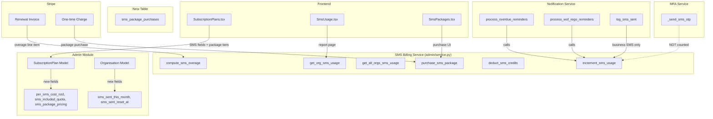
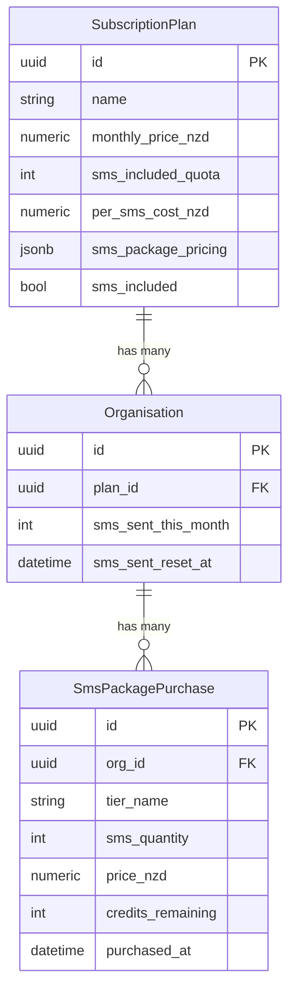

# Design Document: SMS Pricing & Packages

## Overview

This design adds a comprehensive SMS billing subsystem to the OraInvoice/WorkshopPro platform. It mirrors the existing Carjam lookup pricing/overage pattern for per-SMS cost tracking and the storage tier pricing pattern for bulk SMS package add-ons.

The system introduces:
- Per-SMS cost and included quota fields on `SubscriptionPlan`
- Monthly SMS usage counters on `Organisation` (identical to `carjam_lookups_this_month`)
- SMS overage calculation using `compute_sms_overage()` (identical to `compute_carjam_overage()`)
- SMS package tier definitions on plans (JSONB, identical to `storage_tier_pricing`)
- SMS package purchase records with FIFO credit deduction
- Overage billing as a line item on Stripe renewal invoices
- SMS usage dashboard and admin reporting (mirroring `CarjamUsage.tsx`)
- Strict exclusion of MFA/verification SMS from all tracking and billing

MFA SMS sent via `mfa_service._send_sms_otp()` is never counted, never restricted, and never deducted from package credits. Only business SMS dispatched through `process_overdue_reminders()`, `process_wof_rego_reminders()`, and similar notification functions counts toward usage.

## Architecture

The SMS billing system integrates into the existing admin module and notification service without introducing new modules. It follows the established layered architecture:



### Key Design Decisions

1. **No new Python module** — SMS billing logic lives in `app/modules/admin/service.py` alongside `compute_carjam_overage` and `get_all_orgs_carjam_usage`. This keeps the pattern consistent and avoids unnecessary module proliferation.

2. **FIFO credit deduction** — When computing overage, package credits are consumed oldest-first by ordering `sms_package_purchases` by `purchased_at ASC`. This is simple, predictable, and auditable.

3. **Increment at dispatch time** — `sms_sent_this_month` is incremented inside the notification service immediately after a business SMS is successfully dispatched. MFA SMS never touches this counter because `_send_sms_otp()` uses a completely separate code path.

4. **JSONB for package tiers** — Follows the `storage_tier_pricing` pattern exactly. Each plan can define an array of `{tier_name, sms_quantity, price_nzd}` objects.

5. **Separate purchases table** — Unlike tier definitions (which live on the plan), actual purchases need their own table to track `credits_remaining` per purchase for FIFO deduction.

## Components and Interfaces

### Backend Components

#### 1. Database Migration (`alembic/versions/XXXX_add_sms_billing_fields.py`)

Adds columns to existing tables and creates the `sms_package_purchases` table.

#### 2. Model Changes (`app/modules/admin/models.py`)

**SubscriptionPlan** — new columns:
- `per_sms_cost_nzd: Numeric(10,4)` — default 0
- `sms_included_quota: Integer` — default 0
- `sms_package_pricing: JSONB` — nullable, default `[]`

**Organisation** — new columns:
- `sms_sent_this_month: Integer` — default 0
- `sms_sent_reset_at: DateTime(timezone=True)` — nullable

**SmsPackagePurchase** — new model:
- `id: UUID` (PK)
- `org_id: UUID` (FK → organisations)
- `tier_name: String`
- `sms_quantity: Integer`
- `price_nzd: Numeric(10,2)`
- `credits_remaining: Integer`
- `purchased_at: DateTime(timezone=True)`
- `created_at: DateTime(timezone=True)`

#### 3. Schema Changes (`app/modules/admin/schemas.py`)

New schemas:
- `SmsPackageTierPricing` — validates tier entries (mirrors `StorageTierPricing`)
- `OrgSmsUsageRow` — single org SMS usage (mirrors `OrgCarjamUsageRow`)
- `AdminSmsUsageResponse` — all orgs SMS usage (mirrors `AdminCarjamUsageResponse`)
- `OrgSmsUsageResponse` — single org's own SMS usage (mirrors `OrgCarjamUsageResponse`)
- `SmsPackagePurchaseResponse` — package purchase record
- `SmsPackagePurchaseRequest` — purchase request with `tier_name`

Updated schemas:
- `PlanCreateRequest` — add `per_sms_cost_nzd`, `sms_included_quota`, `sms_package_pricing`
- `PlanUpdateRequest` — add same fields as optional
- `PlanResponse` — add same fields to response

#### 4. Service Functions (`app/modules/admin/service.py`)

New functions:
- `compute_sms_overage(total_sent: int, included_quota: int) -> int` — `max(0, total_sent - included_quota)`
- `get_effective_sms_quota(db, org_id) -> int` — `sms_included_quota + sum(credits_remaining)` from active packages
- `get_org_sms_usage(db, org_id) -> dict` — mirrors `get_org_carjam_usage`
- `get_all_orgs_sms_usage(db) -> tuple[list[dict], float]` — mirrors `get_all_orgs_carjam_usage`
- `increment_sms_usage(db, org_id) -> None` — increments counter, deducts from oldest package if over plan quota
- `purchase_sms_package(db, org_id, tier_name) -> dict` — validates tier, creates Stripe charge, creates purchase record
- `get_org_sms_packages(db, org_id) -> list[dict]` — returns active packages with remaining credits
- `compute_sms_overage_for_billing(db, org_id) -> dict` — calculates overage considering package credits for renewal invoice

Updated functions:
- `create_plan` — handle new SMS fields
- `update_plan` — handle new SMS fields

#### 5. Router Endpoints (`app/modules/admin/router.py`)

New admin endpoints:
- `GET /api/v1/admin/sms-usage` — all orgs SMS usage (Global Admin)

New org endpoints (in a new or existing org router):
- `GET /api/v1/org/sms-usage` — org's own SMS usage
- `GET /api/v1/org/sms-packages` — org's active package purchases
- `POST /api/v1/org/sms-packages/purchase` — purchase a package

New report endpoint:
- `GET /api/v1/reports/sms-usage` — SMS usage report with daily breakdown

#### 6. Notification Service Integration (`app/modules/notifications/service.py`)

Modified functions:
- `log_sms_sent()` — after logging, call `increment_sms_usage(db, org_id)` for business SMS only
- A new `is_business_sms` parameter or calling-context flag distinguishes business SMS from MFA SMS

### Frontend Components

#### 1. Admin Plan Form (`frontend/src/pages/admin/SubscriptionPlans.tsx`)

Extended `PlanFormModal` with:
- `per_sms_cost_nzd` numeric input (shown when `sms_included` is toggled on)
- `sms_included_quota` integer input
- SMS package tier table (add/remove rows) — identical pattern to `StorageTierRow`

#### 2. SMS Usage Report (`frontend/src/pages/reports/SmsUsage.tsx`)

New page mirroring `CarjamUsage.tsx`:
- Summary cards: Total SMS Sent, Included in Plan, Overage Count, Overage Charge
- Daily breakdown bar chart
- Active SMS packages section with remaining credits

#### 3. SMS Package Purchase UI

Within the SMS Usage report page or a dedicated section:
- Available tiers from the plan
- Purchase button per tier
- Confirmation dialog with Stripe charge amount


## Data Models

### SubscriptionPlan (extended)

```python
# New columns added to existing SubscriptionPlan model
per_sms_cost_nzd: Mapped[float] = mapped_column(
    Numeric(10, 4), nullable=False, server_default="0"
)
sms_included_quota: Mapped[int] = mapped_column(
    Integer, nullable=False, server_default="0"
)
sms_package_pricing: Mapped[dict | None] = mapped_column(
    JSONB, nullable=True, server_default="'[]'"
)
```

### Organisation (extended)

```python
# New columns added to existing Organisation model
sms_sent_this_month: Mapped[int] = mapped_column(
    Integer, nullable=False, server_default="0"
)
sms_sent_reset_at: Mapped[datetime | None] = mapped_column(
    DateTime(timezone=True), nullable=True
)
```

### SmsPackagePurchase (new model)

```python
class SmsPackagePurchase(Base):
    """SMS package purchase record for FIFO credit tracking."""
    __tablename__ = "sms_package_purchases"

    id: Mapped[uuid.UUID] = mapped_column(
        UUID(as_uuid=True), primary_key=True, default=uuid.uuid4,
        server_default=func.gen_random_uuid()
    )
    org_id: Mapped[uuid.UUID] = mapped_column(
        UUID(as_uuid=True), ForeignKey("organisations.id"), nullable=False
    )
    tier_name: Mapped[str] = mapped_column(String(100), nullable=False)
    sms_quantity: Mapped[int] = mapped_column(Integer, nullable=False)
    price_nzd: Mapped[float] = mapped_column(Numeric(10, 2), nullable=False)
    credits_remaining: Mapped[int] = mapped_column(Integer, nullable=False)
    purchased_at: Mapped[datetime] = mapped_column(
        DateTime(timezone=True), nullable=False, server_default=func.now()
    )
    created_at: Mapped[datetime] = mapped_column(
        DateTime(timezone=True), nullable=False, server_default=func.now()
    )
```

### Pydantic Schemas

```python
class SmsPackageTierPricing(BaseModel):
    """A single SMS package tier pricing entry (mirrors StorageTierPricing)."""
    tier_name: str = Field(..., min_length=1, max_length=100)
    sms_quantity: int = Field(..., gt=0)
    price_nzd: float = Field(..., ge=0)

class OrgSmsUsageRow(BaseModel):
    """Single organisation's SMS usage for the current billing month."""
    organisation_id: str
    organisation_name: str
    total_sent: int
    included_in_plan: int
    package_credits_remaining: int
    effective_quota: int
    overage_count: int
    overage_charge_nzd: float

class AdminSmsUsageResponse(BaseModel):
    """GET /api/v1/admin/sms-usage — all orgs' SMS usage table."""
    organisations: list[OrgSmsUsageRow]

class OrgSmsUsageResponse(BaseModel):
    """GET /api/v1/org/sms-usage — single org's own SMS usage."""
    organisation_id: str
    organisation_name: str
    total_sent: int
    included_in_plan: int
    package_credits_remaining: int
    effective_quota: int
    overage_count: int
    overage_charge_nzd: float
    per_sms_cost_nzd: float

class SmsPackagePurchaseResponse(BaseModel):
    """Single SMS package purchase record."""
    id: str
    tier_name: str
    sms_quantity: int
    price_nzd: float
    credits_remaining: int
    purchased_at: datetime

class SmsPackagePurchaseRequest(BaseModel):
    """POST /api/v1/org/sms-packages/purchase request body."""
    tier_name: str = Field(..., min_length=1)
```

### Entity Relationship




## Correctness Properties

*A property is a characteristic or behavior that should hold true across all valid executions of a system — essentially, a formal statement about what the system should do. Properties serve as the bridge between human-readable specifications and machine-verifiable correctness guarantees.*

### Property 1: SMS overage computation is `max(0, total_sent - included_quota)`

*For any* non-negative integers `total_sent` and `included_quota`, `compute_sms_overage(total_sent, included_quota)` should return `max(0, total_sent - included_quota)`. This implies the result is always non-negative, and is 0 whenever `total_sent <= included_quota`.

**Validates: Requirements 3.1, 3.5, 3.6**

### Property 2: Negative SMS cost and quota values are rejected by validation

*For any* `per_sms_cost_nzd < 0` or `sms_included_quota < 0`, the `PlanCreateRequest` and `PlanUpdateRequest` Pydantic schemas should raise a validation error.

**Validates: Requirements 1.5, 1.6**

### Property 3: SMS plan fields round-trip through create and update

*For any* valid plan creation payload containing `per_sms_cost_nzd`, `sms_included_quota`, and `sms_package_pricing`, creating the plan and then reading it back should return the same SMS field values. Similarly, updating those fields and reading back should reflect the updated values.

**Validates: Requirements 1.3, 1.4, 5.3**

### Property 4: When `sms_included` is false, effective quota is 0

*For any* subscription plan where `sms_included` is `false`, regardless of the stored `sms_included_quota` value or any purchased package credits, the effective SMS quota used for overage calculation should be 0.

**Validates: Requirements 1.7, 3.4**

### Property 5: Business SMS dispatch increments the monthly counter by exactly 1

*For any* organisation, each successful business SMS dispatch should increment `sms_sent_this_month` by exactly 1. After `n` business SMS dispatches, the counter should equal the initial value plus `n`.

**Validates: Requirements 2.3**

### Property 6: MFA SMS never affects usage counter or package credits

*For any* organisation and any number of MFA SMS sent via `_send_sms_otp()`, the `sms_sent_this_month` counter should remain unchanged and all `sms_package_purchases.credits_remaining` values should remain unchanged. MFA SMS delivery should succeed even when all quota and credits are exhausted.

**Validates: Requirements 2.4, 8.1, 8.2, 8.3**

### Property 7: Monthly reset sets counter to 0

*For any* organisation with any `sms_sent_this_month` value, after a monthly billing reset, `sms_sent_this_month` should be 0 and `sms_sent_reset_at` should be updated to a timestamp no earlier than the reset invocation time.

**Validates: Requirements 2.5**

### Property 8: Overage charge equals overage count times per-SMS cost

*For any* organisation with overage count `o` and plan `per_sms_cost_nzd` of `c`, the overage charge should equal `o × c`.

**Validates: Requirements 3.2**

### Property 9: Effective quota includes package credits

*For any* organisation with plan `sms_included_quota` of `q` and purchased packages with total `credits_remaining` of `r` (where `sms_included` is true), the effective quota should equal `q + r`.

**Validates: Requirements 3.3**

### Property 10: SMS overage line item appears if and only if overage is greater than 0

*For any* subscription renewal, an SMS overage line item should be present on the invoice if and only if the computed overage count is greater than 0. When present, the line item quantity should equal the overage count and the unit price should equal `per_sms_cost_nzd`.

**Validates: Requirements 4.2, 4.3**

### Property 11: SMS package tier validation rejects invalid entries

*For any* `SmsPackageTierPricing` object where `tier_name` is empty, `sms_quantity` is ≤ 0, or `price_nzd` is < 0, the Pydantic schema should raise a validation error.

**Validates: Requirements 5.2**

### Property 12: Package purchase requires valid tier name

*For any* tier name that does not exist in the organisation's plan `sms_package_pricing`, the purchase request should be rejected with an error.

**Validates: Requirements 6.1**

### Property 13: Successful Stripe charge creates a purchase record; failed charge does not

*For any* valid package purchase where Stripe charge succeeds, an `sms_package_purchase` record should exist with `credits_remaining` equal to `sms_quantity`. *For any* purchase where Stripe charge fails, no `sms_package_purchase` record should be created.

**Validates: Requirements 6.3, 6.4**

### Property 14: FIFO credit deduction from oldest package first

*For any* organisation with multiple SMS package purchases at different timestamps, when credits are consumed, the package with the earliest `purchased_at` should have its `credits_remaining` decremented first. A newer package's credits should only be touched after all older packages are exhausted.

**Validates: Requirements 6.7**

### Property 15: MFA SMS appears in notification log but not in usage counts

*For any* MFA SMS sent, the `notification_log` table should contain an entry with `channel = 'sms'`, but the `sms_sent_this_month` counter and billing calculations should not include it.

**Validates: Requirements 8.5**

## Error Handling

### Validation Errors

| Scenario | Response | HTTP Status |
|---|---|---|
| `per_sms_cost_nzd < 0` | Pydantic validation error | 422 |
| `sms_included_quota < 0` | Pydantic validation error | 422 |
| Invalid `sms_package_pricing` entry (empty tier_name, quantity ≤ 0, price < 0) | Pydantic validation error | 422 |
| Purchase tier_name not found in plan | `{"detail": "SMS package tier not found on plan"}` | 404 |
| Organisation not found for usage query | `{"detail": "Organisation not found"}` | 404 |

### Stripe Errors

| Scenario | Handling |
|---|---|
| Stripe charge fails (card declined, insufficient funds) | Return 402 with Stripe error message; no purchase record created |
| Stripe API unreachable | Return 502 with `{"detail": "Payment service unavailable"}`; no purchase record created |
| Stripe charge succeeds but DB write fails | Log error; Stripe charge remains (manual reconciliation needed); return 500 |

### Usage Tracking Errors

| Scenario | Handling |
|---|---|
| `increment_sms_usage` fails after SMS dispatch | Log error to `error_log` table; SMS is still sent (usage tracking is best-effort, not blocking) |
| Monthly reset fails for an org | Log error; retry on next scheduled run; counter remains at previous value |
| FIFO credit deduction encounters no packages with remaining credits | Fall through to plan quota only; overage calculated normally |

### Edge Cases

- Organisation on a plan with `sms_included = false` but `sms_included_quota > 0`: effective quota is 0
- Organisation with no plan (deleted plan): treat as 0 quota, 0 per-SMS cost
- Package with `credits_remaining = 0`: skip in FIFO deduction, move to next package
- Concurrent SMS dispatches: use `UPDATE ... SET sms_sent_this_month = sms_sent_this_month + 1` for atomic increment

## Testing Strategy

### Property-Based Testing

Property-based tests use the `hypothesis` library (Python) and `fast-check` (TypeScript/frontend) with a minimum of 100 iterations per property.

Each property test must reference its design document property with a comment tag:
`# Feature: sms-pricing-packages, Property {number}: {title}`

**Backend property tests** (`tests/properties/test_sms_pricing_properties.py`):

| Property | Test Description | Library |
|---|---|---|
| Property 1 | Generate random non-negative `total_sent` and `included_quota`, verify `compute_sms_overage` returns `max(0, total_sent - included_quota)` | hypothesis |
| Property 2 | Generate random negative values for `per_sms_cost_nzd` and `sms_included_quota`, verify Pydantic rejects them | hypothesis |
| Property 4 | Generate random plans with `sms_included=false` and any quota value, verify effective quota is 0 | hypothesis |
| Property 8 | Generate random overage counts and per-SMS costs, verify charge equals their product | hypothesis |
| Property 9 | Generate random plan quotas and package credit totals, verify effective quota is their sum | hypothesis |
| Property 11 | Generate random invalid tier entries, verify Pydantic rejects them | hypothesis |
| Property 14 | Generate random sets of packages with different timestamps and credit amounts, simulate consumption, verify FIFO order | hypothesis |

**Frontend property tests** (`frontend/src/__tests__/sms-pricing.property.test.ts`):

| Property | Test Description | Library |
|---|---|---|
| Property 1 | Generate random usage/quota values, verify overage display calculation | fast-check |
| Property 2 | Generate random negative SMS cost values, verify form validation rejects them | fast-check |
| Property 4 | Generate random plans with sms_included=false, verify UI shows effective quota as 0 | fast-check |
| Property 8 | Generate random overage/cost pairs, verify charge display calculation | fast-check |

### Unit Tests

Unit tests cover specific examples, edge cases, and integration points:

**Backend unit tests** (`tests/test_sms_pricing.py`):
- Plan CRUD with SMS fields (create, read, update)
- SMS usage increment and reset
- Package purchase flow (success and failure)
- Overage billing line item generation
- MFA SMS exclusion from tracking
- Migration up/down verification

**Frontend unit tests** (`frontend/src/__tests__/sms-pricing.test.tsx`):
- SubscriptionPlans form renders SMS fields when `sms_included` is toggled
- SMS package tier table add/remove rows
- SmsUsage report page renders summary cards and chart
- Package purchase confirmation dialog

### Integration Tests

- End-to-end plan creation with SMS fields → org usage tracking → overage billing
- Package purchase → credit deduction → overage recalculation
- Monthly reset across multiple organisations
- MFA SMS dispatch does not affect any billing state
