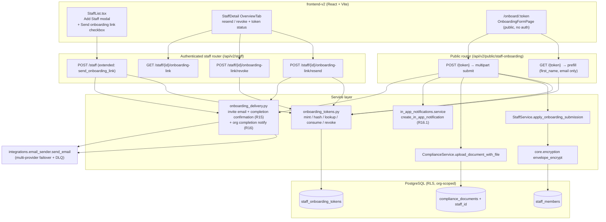
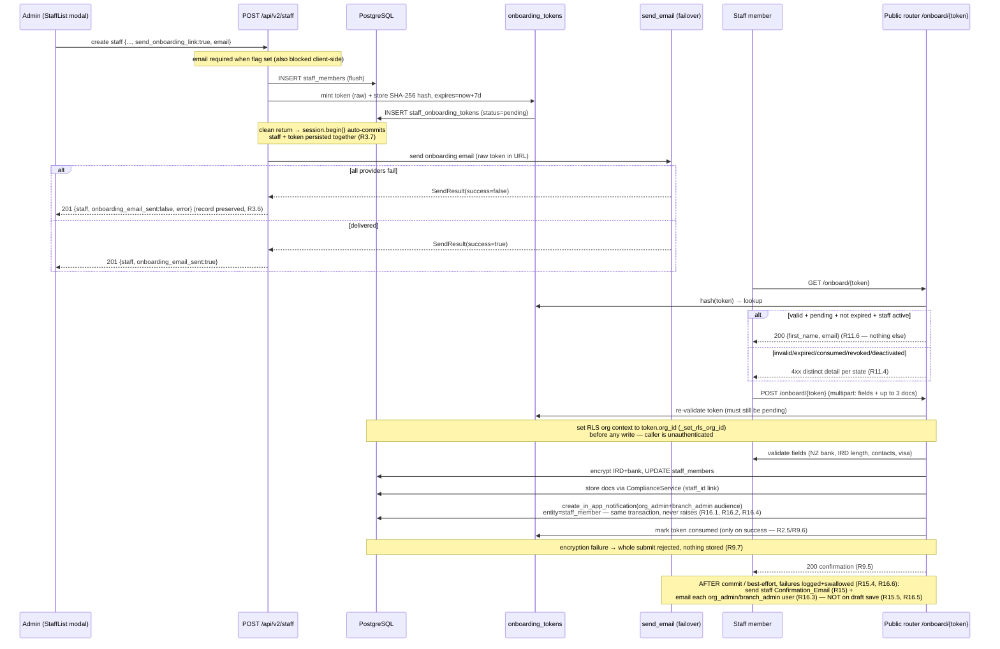

# Design Document — Staff Onboarding Link

## Overview

This feature adds self-service staff onboarding via a secure, token-gated public link. When an admin adds a new staff member they can tick a **"Send onboarding link"** checkbox; the system creates the staff record, mints a single-use onboarding token, and emails the staff member a `/onboard/{token}` link. The staff member opens the link without logging in and completes a sectioned form (personal details, bank account, IRD/tax, residency, working-rights documents). On submission the data is written back into the **existing** `StaffMember` columns — with IRD and bank account envelope-encrypted — and the token is consumed.

The design is deliberately a near-clone of the **existing** staff public-token feature (`StaffRosterViewToken` + `app/modules/staff/public_router.py` + the roster-token service + the rate-limit prefix). We reuse rather than reinvent:

| Concern | Existing thing we reuse | Source |
|---|---|---|
| Public, no-auth, token-gated route | `staff_public_router` mounted under `/api/v2/public/...` | `app/modules/staff/public_router.py`, `app/main.py` (lines ~559-565) |
| JWT bypass for public routes | `PUBLIC_PREFIXES` contains `/api/v2/public/` | `app/middleware/auth.py` (`_is_public`) |
| Per-IP sliding-window rate limit | `RateLimitMiddleware` prefix check (roster = 30/min) | `app/middleware/rate_limit.py` |
| Token generation entropy | `secrets.token_urlsafe(32)` | `app/modules/staff/roster_tokens.py` (`_new_token`) |
| Token table shape, RLS, cascade | `staff_roster_view_tokens` table + `tenant_isolation` policy | migration `0203_staff_phase1_schema.py` |
| Auto-revoke tokens on deactivation | `_revoke_active_roster_tokens` in the staff router | `app/modules/staff/router.py` |
| Field-level encryption | `envelope_encrypt` / `envelope_decrypt_str` (AES-256-GCM envelope) | `app/core/encryption.py` |
| Whole-blob draft encryption at rest | `envelope_encrypt` / `envelope_decrypt_str` applied to the serialized draft JSON | `app/core/encryption.py` |
| PII masking on read | `mask_ird` / `mask_bank_account` | `app/modules/staff/security.py` |
| Masked-field "don't re-send" heuristic (draft resume) | `isMaskedIrd` / `isMaskedBank` regex heuristic | `frontend-v2/src/pages/staff/tabs/OverviewTab.tsx` |
| Humanized, stack-trace-free error mapping | `humanize_restore_db_error` precedent (a `humanize_onboarding_error` sibling) | `app/modules/backup_restore/restore/per_org_restore.py` |
| Multi-provider email + failover + DLQ | `EmailMessage` + `send_email` | `app/integrations/email_sender.py` |
| Fire-and-forget background email send | `send_email_task` (background task) | `app/tasks/notifications` |
| Transactional HTML + CTA button | `render_transactional_html(... cta_url, cta_label)` | `app/integrations/email_sender.py` |
| In-app notification (role-broadcast, never-raises) | `create_in_app_notification(db, *, org_id, category, severity, title, body, audience_roles, link_url, entity_type, entity_id, ...)` | `app/modules/in_app_notifications/service.py` |
| Org-user resolution by role (notification recipients) | `users` table query filtered by `org_id` + role (`org_admin`/`branch_admin`) + active, deduped by email | `app/modules/staff/router.py` (authorization baseline) |
| Document upload (validate + store) | `ComplianceFileStorage` + `ComplianceDocument` + `ComplianceService.upload_document_with_file` | `app/modules/compliance_docs/*` |
| IRD validation reference | `validate_ird_number` (mod-11) | `app/modules/ledger/service.py` |
| Add Staff dialog + "Also create as a user" checkbox | `StaffList.tsx` modal | `frontend-v2/src/pages/staff/StaffList.tsx` |
| Public token page routing | `/public/staff-roster/:token` → `StaffRosterPublicView` | `frontend-v2/src/App.tsx`, `frontend-v2/src/pages/public/StaffRosterPublicView.tsx` |

The single notable **divergence** from the roster-token pattern is that onboarding tokens store a **SHA-256 hash** of the token (`token_hash`) rather than the raw token string. The roster-token table stores the raw token; onboarding tokens grant write access to a far larger, more sensitive PII surface (IRD, bank account, identity documents), so a DB-read attacker must not be able to replay a live link. This is an intentional security uplift and is called out in Security below.

### Requirements coverage map

- R1 — Add Staff checkbox + email-required blocking → Frontend Design, API (`POST /staff` extension)
- R2 — Token generation/storage (≥32 bytes, 7-day expiry, single-use, deactivation rejection) → Data Models, Token Lifecycle
- R3 — Email delivery + atomic transaction semantics → API, Transaction Boundaries
- R4–R8 — Onboarding form sections + validation → API (public submit), Frontend, Validation Rules
- R9 — Submission, encryption, encryption-failure rejection, completion audit entry → API, Security
- R10 — Resend/revoke/auto-revoke + status display → API (admin endpoints), Frontend
- R11 — Public routing, rate limiting, HTTPS, error states, minimal data exposure → Architecture, Security
- R12 — Save draft + debounced autosave, server-side resumable draft, whole-blob encryption at rest, draft purge on submit/revoke/expiry, token stays pending → Data Models (draft columns), API (`PUT .../draft`, extended prefill), Token Lifecycle (purge), Frontend
- R13 — Admin progress visibility: lifecycle label (not_started/in_progress/completed/expired/revoked) + server-computed section-weighted completion percentage + last-saved timestamp → API (extended admin status endpoint), Completion percentage, Frontend
- R14 — Human-readable error messages everywhere (public + admin), `{message, code}` shape, no raw DB/exception text → Error Handling, API
- R15 — Staff completion confirmation email (best-effort, only on submit, not on draft) → Components (`onboarding_delivery.send_onboarding_confirmation_email`), Transaction Boundaries, Error Handling
- R16 — Organisation notification on completion: in-app notification (in-transaction) + best-effort emails to `org_admin`/`branch_admin`, only on submit, not on draft → Components (`onboarding_delivery.notify_org_onboarding_complete`), Transaction Boundaries, Error Handling

### Scope and gating decisions

These are explicit, documented decisions so a reviewer does not flag them as omissions.

- **Trade-family gating: none (universal feature).** Staff onboarding is a universal, all-trades HR capability — every trade family (automotive, electrical, plumbing, construction, hospitality, retail, etc.) hires staff who must supply the same personal/bank/IRD/residency details. Per the always-loaded trade-family-gating steering, a feature "for all trades" needs **no** `tradeFamily` gate. We therefore deliberately apply **no** trade-family gating to the Add Staff "Send onboarding link" checkbox, the public `/onboard/:token` page, or the staff-detail "Onboarding link" card. None of these sub-sections is trade-specific, so no internal gated sub-region applies either. (`useTenant()` / `isAutomotive`-style guards are intentionally absent here.)
- **Mobile scope.** The public `/onboard/:token` form is a **responsive web page** reachable from any browser — including a staff member's phone — so the onboarded person's mobile experience is already fully covered without any native-app work. The admin-side actions (the Add Staff checkbox and the **Send / Resend / Revoke** onboarding-link controls) live on the **web admin** staff screens (`frontend-v2/`). Surfacing Resend/Revoke inside the Capacitor mobile app's staff screens is **out of scope for this spec** and recorded as an explicit follow-up: the mobile steering scopes staff management to org users and the responsive public form already serves the staff member directly, so there is no functional gap to close here.

## Architecture

### Component / data-model diagram



### Send → email → open → submit sequence



### Save draft, resume, and admin progress sequence (R12, R13)

```mermaid
sequenceDiagram
  participant S as Staff member (OnboardingFormPage)
  participant P as Public router /staff-onboarding/{token}
  participant DB as PostgreSQL (staff_onboarding_tokens)
  participant A as Admin (OverviewTab card)
  participant API as GET /staff/{id}/onboarding-link

  Note over S: explicit "Save as draft" OR debounced autosave on field blur (~800ms)
  S->>P: PUT /{token}/draft  {partial fields, documents_staged_count}
  P->>DB: re-validate token pending/unexpired/staff-active
  Note over P,DB: set RLS org context (_set_rls_org_id) BEFORE write;<br/>do NOT consume the token (R12.7)
  P->>DB: envelope_encrypt(JSON) → draft_data_encrypted; draft_updated_at=now()
  P-->>S: 200 { ok, completion_percentage, last_saved_at }
  Note over S: render subtle "Saved {time}" indicator

  S->>P: GET /{token}  (reopen link, any device)
  P->>DB: resolve + classify
  P-->>S: 200 prefill {first_name, email (read-only)} + draft (IRD/bank MASKED, has_ird/has_bank, documents_staged_count)
  Note over S: repopulate; masked IRD/bank are not re-sent unless retyped (isMaskedIrd/isMaskedBank)

  A->>API: GET onboarding-link status
  API->>DB: resolve latest token row
  Note over API,DB: lifecycle = not_started | in_progress | completed | expired | revoked
  alt in_progress (draft_updated_at IS NOT NULL, pending, not expired)
    API-->>A: 200 { state:"in_progress", completion_percentage, last_saved_at }
  else other states
    API-->>A: 200 { state, expires_at, consumed_at }
  end
```

On successful submit (previous sequence, step 7) and on any revoke/resend/expire/deactivation path, the draft columns (`draft_data_encrypted`, `draft_updated_at`) are NULLed **in the same transaction** as the status change (R12.8, R12.9).

### Routing & middleware chain

The public endpoints live under `/api/v2/public/staff-onboarding/...`. This prefix is already covered by:

- `app/middleware/auth.py` → `PUBLIC_PREFIXES` includes `/api/v2/public/` so `_is_public()` returns `True` and **no JWT is required** (R11.1). No code change needed there.
- `app/middleware/rate_limit.py` → we add a new prefix constant `_PUBLIC_STAFF_ONBOARDING_PATH_PREFIX = "/api/v2/public/staff-onboarding/"` with `_PUBLIC_STAFF_ONBOARDING_RATE_LIMIT = 30`, mirroring the existing `_PUBLIC_STAFF_ROSTER_*` block verbatim (R11.2).
- TLS/HTTPS is terminated at nginx (and Cloudflare Tunnel for prod) for all `/api/...` paths, satisfying R11.5 with no app change.

The admin endpoints live under the **existing authenticated** `/api/v2/staff` router (`app/modules/staff/router.py`), inheriting its module gate (`_require_staff_management_module`) and RBAC.

## Data Models

### New table: `staff_onboarding_tokens`

Mirrors `staff_roster_view_tokens` (same org-scoping, RLS, cascade), with three differences: it stores `token_hash` instead of a raw `token`, it has an explicit `status` lifecycle column, and it tracks `consumed_at`.

New ORM model in `app/modules/staff/models.py`:

```python
class StaffOnboardingToken(Base):
    """Single-use, token-gated self-service onboarding link.

    Mirrors StaffRosterViewToken (org-scoped, RLS, ON DELETE CASCADE)
    but stores a SHA-256 hash of the URL token rather than the raw
    value, and carries an explicit status lifecycle.

    Validates: Requirements 2.1, 2.2, 2.3, 2.5, 10.2, 10.3, 10.4.
    """

    __tablename__ = "staff_onboarding_tokens"

    id: Mapped[uuid.UUID] = mapped_column(
        UUID(as_uuid=True), primary_key=True, default=uuid.uuid4,
    )
    org_id: Mapped[uuid.UUID] = mapped_column(
        UUID(as_uuid=True),
        ForeignKey("organisations.id", ondelete="CASCADE"),
        nullable=False,
    )
    staff_id: Mapped[uuid.UUID] = mapped_column(
        UUID(as_uuid=True),
        ForeignKey("staff_members.id", ondelete="CASCADE"),
        nullable=False,
    )
    # SHA-256 hex digest of the URL-safe token (64 chars). The raw token
    # is never persisted; it lives only in the emailed URL.
    token_hash: Mapped[str] = mapped_column(String(64), nullable=False, unique=True)
    # pending | consumed | revoked  (expiry is derived from expires_at,
    # not a stored status, so a row can be pending-but-expired).
    status: Mapped[str] = mapped_column(String(20), nullable=False, server_default="pending")
    created_at: Mapped[datetime] = mapped_column(
        DateTime(timezone=True), server_default=func.now(), nullable=False,
    )
    expires_at: Mapped[datetime] = mapped_column(
        DateTime(timezone=True), nullable=False,
    )
    consumed_at: Mapped[datetime | None] = mapped_column(
        DateTime(timezone=True), nullable=True,
    )
    # --- Draft (R12) — the partial form payload, stored ON the token row ---
    # The ENTIRE partial form payload is serialized to JSON and stored
    # envelope-encrypted here (reusing core.encryption). Encrypting the whole
    # blob means partial IRD/bank values are encrypted at rest with no
    # field-by-field handling (R12.6). NULL until the first draft is saved;
    # NULLed again on submit / revoke / expiry-purge (R12.8, R12.9).
    draft_data_encrypted: Mapped[bytes | None] = mapped_column(
        LargeBinary, nullable=True,
    )
    # "last saved" timestamp surfaced to the admin (R13.2). NULL ⇒ no draft
    # has been saved yet (the not_started ⇄ in_progress discriminator, R13.1).
    draft_updated_at: Mapped[datetime | None] = mapped_column(
        DateTime(timezone=True), nullable=True,
    )
```

> The completion percentage is **not** stored — it is computed on read from the decrypted draft by `compute_completion_percentage` (see *Completion percentage* below), so it can never drift out of sync with the saved data. No extra index is needed for the draft columns; drafts are always read via the same `token_hash` / `staff_id` lookups that already exist.

### Draft storage (R12)

A draft is **server-side** (so it is resumable on any device and visible to the admin) and lives directly on the `staff_onboarding_tokens` row — **no new table**. The flow:

- **Serialize** the partial form payload (all non-file fields, plus a small `documents_staged_count` integer — see below) to JSON.
- **Encrypt** the whole JSON blob with `envelope_encrypt` and store the ciphertext in `draft_data_encrypted`; set `draft_updated_at = now()`. Encrypting the entire blob automatically satisfies R12.6 (partial IRD/bank encrypted at rest) without any field-by-field encryption logic.
- **Lifetime** = the token's existing 7-day TTL. Drafts are purged (columns NULLed) on successful submit (R12.8) and on revoke / resend / expiry / deactivation auto-revoke (R12.9).
- **Saving a draft never consumes the token** (R12.7): the `status` stays `pending` and only `draft_data_encrypted` / `draft_updated_at` change.
- **`in_progress` is inferred from the first saved draft** — i.e. `draft_updated_at IS NOT NULL` — not from merely opening the link.

**Documents are not stored in the draft.** Uploaded files are not persisted in the draft blob (browser file inputs cannot be securely re-populated, and binaries do not belong in the encrypted JSON). Documents still upload only on final submit. So the Documents section can contribute to the completion percentage deterministically, the client stores a small integer `documents_staged_count` in the draft (the number of files staged locally); the actual files upload at submit. This is an explicit, documented decision so it is not flagged as an omission.

**PII on resume (do not re-transmit plaintext secrets).** The decrypted draft is **not** returned verbatim on resume. Reusing the masking + heuristic pattern already in the codebase: the extended prefill returns non-sensitive draft fields in full, but returns IRD and bank as **masked placeholders** (`mask_ird` / `mask_bank_account` from `app/modules/staff/security.py`) plus boolean flags `has_ird` / `has_bank`. On the client, the existing `isMaskedIrd` / `isMaskedBank` heuristic (already present in `OverviewTab.tsx`) ensures a field left as the masked display is **not** re-sent — only a freshly typed value overwrites the stored secret. Resume therefore works without ever re-transmitting plaintext IRD/bank.

| Draft field group | Returned on resume |
|---|---|
| Personal (last_name, phone, emergency_*), tax_code, student_loan, kiwisaver_*, residency_type, visa_expiry_date | full value |
| IRD number | `mask_ird(...)` placeholder + `has_ird: bool` |
| Bank account number | `mask_bank_account(...)` placeholder + `has_bank: bool` |
| Documents | `documents_staged_count: int` (files themselves not stored) |

**Status vs expiry.** `status` holds the *deliberate* lifecycle (`pending` → `consumed` on successful submit; `pending` → `revoked` on resend/revoke/deactivation). Expiry is **not** a stored status — it is computed by comparing `expires_at <= now()` at read time. This lets the public router distinguish all four R11.4 error states from one row:

| Condition (evaluated in order) | Public response |
|---|---|
| no row for `hash(token)` | `404 onboarding_token_not_found` |
| `status == "revoked"` | `410 onboarding_token_revoked` |
| `status == "consumed"` | `410 onboarding_token_consumed` |
| `status == "pending"` and `expires_at <= now()` | `410 onboarding_token_expired` |
| `status == "pending"`, not expired, staff `is_active == False` | `410 onboarding_token_staff_inactive` |
| `status == "pending"`, not expired, staff active | `200` (prefill) / proceed (submit) |

### Existing table reused: `staff_members`

No new staff columns are needed — the onboarding form writes into columns that already exist (migration 0203):

| Form section | Field(s) | `staff_members` column |
|---|---|---|
| Personal | last name, phone, emergency contact name/phone | `last_name`, `phone`, `emergency_contact_name`, `emergency_contact_phone` |
| Bank | NZ account number | `bank_account_number_encrypted` (bytes, envelope-encrypted) |
| IRD/Tax | IRD number | `ird_number_encrypted` (bytes, envelope-encrypted) |
| IRD/Tax | tax code | `tax_code` |
| IRD/Tax | student loan, KiwiSaver enrolled, KiwiSaver rate | `student_loan`, `kiwisaver_enrolled`, `kiwisaver_employee_rate` |
| Residency | residency type, visa expiry | `residency_type`, `visa_expiry_date` |
| Documents | working-rights uploads | `compliance_documents` rows (see below) |

`first_name` and `email` are pre-filled read-only (R4.2) and are **not** mutated by the submit.

### Existing table extended: `compliance_documents`

The compliance documents table (`app/modules/compliance_docs/models.py`) already carries optional link columns `invoice_id` and `job_id` but **no** `staff_id`. To link working-rights documents to a staff member (R7.6) while reusing the existing storage infra, the migration adds one nullable column following the exact pattern of the existing link columns:

```python
staff_id: Mapped[uuid.UUID | None] = mapped_column(
    UUID(as_uuid=True), nullable=True,
)
```

This is the minimal, idiomatic extension — it reuses `ComplianceFileStorage` (validation, magic-byte checks, 10 MB cap, path safety) and `ComplianceService.upload_document_with_file` unchanged; we only pass `staff_id` in the metadata dict. Documents are stored with `document_type="working_rights"`.

> Note: `ComplianceFileStorage.ACCEPTED_MIME_TYPES` already accepts PDF/JPEG/PNG (plus GIF/Word) with a 10 MB cap (`MAX_FILE_SIZE`). R7.2 restricts the onboarding form to **PDF/JPEG/PNG only**; the public submit handler enforces that narrower allow-list before delegating to the shared storage helper, and caps the count at 3 (R7.3).

## Components and Interfaces

This section defines the API endpoints (admin and public), the token service, the transaction boundaries, the frontend components, and the validation rules that make up the feature.

### API Design

#### 1. Admin — extend `POST /api/v2/staff` (R1.3, R1.4, R3)

The existing create endpoint (`create_staff` in `router.py`) gains two request-only fields on `StaffMemberCreate`:

```python
# StaffMemberCreate additions (schemas.py)
send_onboarding_link: bool = False
# (email already exists on the schema)
```

Response model gains two advisory fields (used only when `send_onboarding_link` was true):

```python
# StaffMemberResponse additions
onboarding_email_sent: bool | None = None
onboarding_email_error: str | None = None   # machine code, e.g. "send_failed" / "no_email"
```

Handler flow (extends the existing `create_staff`):

```
0. if not payload.email: raise 422 {"detail": "email_required"}   # email required regardless
                                                                   # of the checkbox state (R1.2, R1.6)
1. svc.create_staff(...)            # existing logic, INSERT + flush (only on actual submit, R1.7)
2. if payload.send_onboarding_link:
     2a. if not staff.email: raise 422 {"detail": "onboarding_email_required"}   # belt-and-braces (R1.2)
     2b. token_raw = onboarding_tokens.mint(db, org_id, staff.id)  # stores hash, expires=now+7d
3. return StaffMemberResponse(...)   # clean return → auto-commit persists staff+token (R3.7)
   # ...email send happens AFTER commit; see Transaction Boundaries
```

> **Email always required (R1.6).** An email address is validated as required on submit of the Add Staff form regardless of the "Send onboarding link" checkbox state (step 0), in addition to the checkbox-specific check in step 2a. The record is created only when the admin actually submits the form (R1.7); no staff record is created before submission.

Because the request handler must persist the staff+token atomically **before** the fallible email side-effect (R3.6/R3.7), the email send is performed by a thin wrapper that runs inside the same handler but whose failure is folded into the response body rather than raised. See **Transaction Boundaries** below.

#### 2. Admin — onboarding link management (R10)

All under the authenticated `/api/v2/staff` router, module-gated, audit-logged.

```
GET  /api/v2/staff/{staff_id}/onboarding-link
  → 200 { state: "not_started"|"in_progress"|"completed"|"expired"|"revoked"|"none",
          expires_at: ISO8601|null, created_at: ISO8601|null, consumed_at: ISO8601|null,
          completion_percentage: int|null,   # 0..100, present only when state=="in_progress"
          last_saved_at: ISO8601|null }       # = draft_updated_at, only when state=="in_progress"
  Resolves the latest token row for the staff member. `state` is the admin
  lifecycle label from the pure helper `onboarding_lifecycle_label(row, now)`:
  "not_started" (pending, draft_updated_at IS NULL), "in_progress" (pending,
  draft saved), "completed" (consumed), "expired" (pending AND expires_at<=now),
  "revoked", or "none" (no row). When "in_progress", the body additionally
  carries the server-computed completion_percentage and last-saved timestamp.
  (R10.1, R13.1, R13.2, R13.5)

POST /api/v2/staff/{staff_id}/onboarding-link/resend
  body: {} (email taken from staff record)
  → revoke any active token (status→revoked, draft purged), mint a new one, send email.
  → 200 { onboarding_email_sent: bool, onboarding_email_error: str|null, expires_at }
  → 422 { message, code:"onboarding_email_required" } when staff has no email. (R10.2)
  → 409 { message, code:"staff_inactive" } when the staff member is deactivated —
        no new token is minted for a deactivated staff member (R10.5).

POST /api/v2/staff/{staff_id}/onboarding-link/revoke
  → set the active token status→revoked AND purge its draft. Idempotent (no active token → 200 no-op).
  → 200 { status: "revoked" }  (R10.3)
```

> **No new tokens for deactivated staff (R10.5).** Both the create flow (`POST /staff` with `send_onboarding_link`) and the resend flow guard on `staff.is_active`: when the staff member is deactivated, the system refuses to mint a new onboarding token (returns the `staff_inactive` error) so that no onboarding link can be generated for a deactivated member. This complements the auto-revoke-on-deactivation behaviour (R10.4): existing tokens are revoked, and new ones cannot be issued.

> **Lifecycle label vs public token-state.** This admin lifecycle is a *derived* label that additionally factors in **draft presence** (`not_started` vs `in_progress`). It is intentionally kept separate from the public `classify_token_state` helper, which stays focused on the public 404/410 outcomes (not-found / revoked / consumed / expired / staff-inactive). `onboarding_lifecycle_label` is a pure, side-effect-free function (placed alongside the other token-state helpers) so it is property-testable without a DB:
>
> ```
> onboarding_lifecycle_label(row, now) -> str
>   if row is None:                       return "none"
>   if row.status == "revoked":           return "revoked"
>   if row.status == "consumed":          return "completed"
>   if row.expires_at <= now:             return "expired"      # pending + past expiry
>   if row.draft_updated_at is not None:  return "in_progress"
>   return "not_started"
> ```
>
> It is **total** (every `row`/`None` maps to exactly one of the six labels) and returns exactly one state.

**Auto-revoke on deactivation (R10.4).** The existing `deactivate_staff` handler already calls `_revoke_active_roster_tokens(...)` in the same transaction as the `is_active=False` flip. We add a sibling call `_revoke_active_onboarding_tokens(db, org_id, staff_id, user_id, ip)` immediately after it, implemented identically (an `UPDATE ... SET status='revoked', draft_data_encrypted=NULL, draft_updated_at=NULL WHERE staff_id=? AND org_id=? AND status='pending'` returning the affected ids, plus a single `onboarding.tokens_revoked` audit row when count > 0). NULLing the draft columns in the same UPDATE purges the draft on auto-revoke (R12.9). The same call is added to the termination path in `update_staff` (the `is_termination_event` branch).

#### 3. Public — prefill + draft resume (R4.2, R11.3, R11.6, R12.3, R12.4)

```
GET /api/v2/public/staff-onboarding/{token}
  → 200 { first_name: str, email: str, org_name: str,           # read-only identity (R4.2, R12.4)
          tax_code_options: [...], residency_options: [...],
          kiwisaver_rate_options: [3,4,6,8,10],
          bank_account_required: bool,                            # from org config (R5.4)
          draft: {                                                # null when no draft saved
            last_name, phone, emergency_contact_name, emergency_contact_phone,
            tax_code, student_loan, kiwisaver_enrolled, kiwisaver_employee_rate,
            residency_type, visa_expiry_date,                     # non-sensitive: full values
            ird_number: <masked>|null, has_ird: bool,             # mask_ird placeholder (R11.6)
            bank_account_number: <masked>|null, has_bank: bool,   # mask_bank_account placeholder
            documents_staged_count: int
          } | null,
          completion_percentage: int|null,                        # computed from draft, 0..100
          last_saved_at: ISO8601|null }
  → 404 { message, code:"onboarding_token_not_found" }
  → 410 { message, code:"onboarding_token_revoked" | "onboarding_token_consumed"
                       | "onboarding_token_expired" | "onboarding_token_staff_inactive" }
```

The 200 body deliberately exposes **only** `first_name` and `email` of the staff member (R11.6) plus static option lists, the org display name (page chrome), and — when present — the staff member's own saved **draft** for repopulation (R12.3). No other staff PII is returned, mirroring how `public_router.py` returns only `staff_name` + schedule.

**Draft PII on resume.** The draft is decrypted server-side (`envelope_decrypt_str`) and re-serialized for the response, but IRD and bank are returned **masked** (`mask_ird` / `mask_bank_account`) with `has_ird` / `has_bank` booleans — never the decrypted plaintext (R11.6). The client uses the existing `isMaskedIrd` / `isMaskedBank` heuristic so a field left showing the masked placeholder is not re-sent; only a freshly typed value overwrites the stored secret. This makes resume work without re-transmitting plaintext secrets.

#### 3b. Public — save / update draft (R12.1, R12.2, R12.5, R12.6, R12.7, R12.10)

```
PUT /api/v2/public/staff-onboarding/{token}/draft
  Content-Type: application/json
  body: { last_name?, phone?, emergency_contact_name?, emergency_contact_phone?,
          bank_account_number?, ird_number?, tax_code?, student_loan?,
          kiwisaver_enrolled?, kiwisaver_employee_rate?,
          residency_type?, visa_expiry_date?, documents_staged_count? }   # all OPTIONAL/partial
  → 200 { ok: true, completion_percentage: int, last_saved_at: ISO8601 }
  → 404/410 { message, code } when the token is no longer valid
  → 413/422 { message, code } only for basic shape/size guards (not submit-time validation)
```

Driven by both the explicit **"Save as draft"** button and **debounced autosave on field blur** (~800ms) on the client. Handler order:

```
1. token = resolve(hash(token)); classify  → must be pending+unexpired+staff active, else 4xx (R12.7)
2. await _set_rls_org_id(db, str(token.org_id))   # trusted server-side org_id, BEFORE any write
3. basic shape/size guards only — NO submit-time field validation (R12.5: partial data is accepted)
4. blob = json(payload incl. documents_staged_count)
   token.draft_data_encrypted = envelope_encrypt(blob)   # whole-blob encryption ⇒ R12.6 for free
   token.draft_updated_at = now()
   # token.status stays "pending"; consumed_at untouched — saving NEVER consumes (R12.7)
5. pct = compute_completion_percentage(payload)   # pure, server-side (R13.3, R13.4)
6. clean return → auto-commit persists the draft
```

The draft endpoints sit under the same `/api/v2/public/staff-onboarding/` prefix, so they inherit the existing 30 req/min per-IP rate limit and HTTPS termination (R12.10) with no new middleware. As with submit, the RLS org context is set from the **token's** `org_id` (never client-supplied) before writing, and is transaction-local (`is_local=true`).

#### 4. Public — submit (R9, R4–R8)

```
POST /api/v2/public/staff-onboarding/{token}
  Content-Type: multipart/form-data
  fields (form): last_name, phone, emergency_contact_name, emergency_contact_phone,
                 bank_account_number, ird_number, tax_code, student_loan,
                 kiwisaver_enrolled, kiwisaver_employee_rate,
                 residency_type, visa_expiry_date
  files: documents[] (0..3, PDF/JPEG/PNG, ≤10 MB each)

  → 200 { ok: true, message: "Thanks — your details have been submitted." }
  → 422 { ok: false, errors: { field: { message, code } }, message }   # inline field errors (R9.2, R14)
  → 410 { message, code: "onboarding_token_*" }   # token no longer valid at submit time
```

Submit handler order (token re-validated first, consumed last):

```
1. token = validate(hash(token))     # must be pending+unexpired+staff active, else 4xx
2. set RLS org context to token.org_id   # await _set_rls_org_id(db, str(token.org_id))
                                          # the public request arrives with NO app.current_org_id;
                                          # this scopes every subsequent write below to the token's
                                          # org so the RLS-protected tables are written correctly
                                          # (see Security → "RLS on the public write path"). org_id
                                          # comes from the trusted server-side token row, never the client.
3. validate all fields               # collect ALL errors → 422 with field map (R9.1, R9.2)
4. enc_ird  = envelope_encrypt(ird)   if ird provided    } wrapped in try/except;
   enc_bank = envelope_encrypt(bank)  if bank provided   } any failure → 422 encryption_failed,
                                                            nothing written (R9.7)
5. UPDATE staff_members SET last_name, phone, emergency_*, tax_code, student_loan,
        kiwisaver_*, residency_type, visa_expiry_date,
        ird_number_encrypted=enc_ird, bank_account_number_encrypted=enc_bank
6. for each uploaded doc: ComplianceService.upload_document_with_file(
        org_id, file, {document_type:"working_rights", staff_id:staff.id})
7. create_in_app_notification(db, org_id=token.org_id, category="staff_onboarding",
        severity="success", title=..., body="{first_name} completed their onboarding",
        audience_roles=["org_admin","branch_admin"], link_url=<staff detail path>,
        entity_type="staff_member", entity_id=staff.id)   # in-transaction, never raises (R16.1,R16.2,R16.4)
8. token.status = "consumed"; token.consumed_at = now()    # ONLY here (R2.5, R9.6)
   token.draft_data_encrypted = None; token.draft_updated_at = None   # purge draft (R12.8)
8b. write_audit_log(db, org_id=token.org_id, action="onboarding.completed",
        entity_type="staff_member", entity_id=staff.id, ip_address=<request IP>,
        after_value={non-sensitive summary})   # in-transaction; NO plaintext IRD/bank (R9.9)
9. clean return → auto-commit persists steps 5-8 together
10. AFTER commit (best-effort, must not affect submit outcome — R15.4, R16.6):
    onboarding_delivery.send_onboarding_confirmation_email(...)   # staff thank-you (R15)
    onboarding_delivery.notify_org_onboarding_complete(...)       # org_admin/branch_admin emails (R16.3)
    # both wrapped so any failure is logged and swallowed; the staff still saw the 200 (R9.5)
```

Steps 7–8 are part of the same request transaction as steps 5–6: the in-app notification is an ordinary DB write that commits atomically with the submit. `create_in_app_notification` **never raises** (it catches and logs internally), so it cannot break a successful submission — this satisfies R16.6 structurally for the in-app side. Because the RLS org context was set in step 2, the `AppNotification` row is written org-scoped to `token.org_id` (R16.4). The `audience_roles=["org_admin","branch_admin"]` list drives the role-broadcast visibility so exactly the onboarding-link senders see it (R16.1).

The two **email** side-effects (R15, R16.3) are deliberately ordered **after** the DB writes and their results are folded/ignored — identical in spirit to how the create-staff handler treats the onboarding-invite email (see *Transaction Boundaries*). They must never roll back or block a successful submission (R15.4, R16.6).
```

Steps 4–8 share the single request transaction (`get_db_session`'s `session.begin()`), so a failure in encryption (step 4), document storage (step 6), or the notification write (step 7) rolls back the staff update **and** leaves the token `pending` with its draft intact — the staff member can resubmit (R9.7). (In practice `create_in_app_notification` never raises, so step 7 does not cause rollbacks; it is listed inside the transaction because it is a DB write that should commit atomically with the submit.) The token is consumed and the draft purged only when everything succeeds (R12.8). The org context set in step 2 is bound with `is_local=true`, so it is scoped to this transaction and resets automatically when the transaction ends (no cross-request leakage). The step-10 emails run only after this commit, so a send failure can never undo the persisted submission.

#### Completion percentage — `compute_completion_percentage` (R13.3, R13.4)

A pure, side-effect-free, **deterministic** function placed in `app/modules/staff/onboarding_validation.py` (the pure-validators module), so it can be property-tested without a DB. It scores the five form sections, each weighted equally at **20%**, and returns an integer in `[0, 100]`:

```
compute_completion_percentage(draft) -> int   # 0..100
  sections_complete = (
      is_personal_complete(draft)    +   # last_name AND phone present
      is_bank_complete(draft)        +   # bank account present
      is_ird_complete(draft)         +   # ird AND tax_code present
      is_residency_complete(draft)   +   # residency_type set; AND visa_expiry when a visa type
      is_documents_complete(draft)       # documents_staged_count > 0
  )                                       # each predicate returns 0 or 1
  return sections_complete * 20
```

Per-section "complete" predicates are crisp booleans over the draft fields:

| Section (20%) | Complete when |
|---|---|
| Personal | `last_name` and `phone` are both non-empty |
| Bank | `bank_account_number` present (`has_bank` on a resumed draft) |
| IRD/Tax | `ird_number` present (`has_ird`) **and** `tax_code` set |
| Residency | `residency_type` set; **and** `visa_expiry_date` present when the type is a visa (`work_visa`/`student_visa`) |
| Documents | `documents_staged_count > 0` |

Properties this guarantees (see Correctness Properties): it is **total** (defined for any draft, including empty/partial), **deterministic** (same draft → same number), always in `[0,100]`, and **monotonic non-decreasing** — filling more fields can only raise or hold the percentage, never lower it. Because the IRD/bank predicates key off presence (`has_ird`/`has_bank`), a resumed draft showing masked placeholders still counts those sections as complete without needing the plaintext.

#### Transaction Boundaries (R3.6, R3.7)

The project steering rule is: `get_db_session` wraps the request in `session.begin()` which **auto-commits on clean return** and rolls back if the handler raises. Services use `flush()`, never `commit()`. The onboarding send must honour two seemingly opposed rules:

- **R3.7** — if record creation fails, persist nothing (no partial record).
- **R3.6** — if the email fails *after* the record exists, keep the record and tell the admin.

Design decision: **do not raise after the record is created; fold the email outcome into the response.**

- Staff + token are created and `flush()`ed inside the handler. If *that* fails (e.g. duplicate email, DB error), the exception propagates, `session.begin()` rolls back, and no row remains — R3.7 satisfied for free.
- The email is sent via `onboarding_delivery.send_onboarding_email(...)` which returns a result object (it never raises for provider failures — it mirrors `send_roster_email` returning `RosterDeliveryResult`). On failure the handler sets `onboarding_email_sent=false` + `onboarding_email_error="send_failed"` on the 201 response body and logs a warning. The handler still returns cleanly, so the staff + token commit — R3.6 satisfied (record preserved, admin informed via the response the UI renders as an error banner).

This avoids the trap of `raise HTTPException(...)` *after* the data is flushed, which would roll the data back under `session.begin()` and violate R3.6. We explicitly do **not** call `db.commit()` inside the handler (which would conflict with the `session.begin()` context manager); the clean-return auto-commit is the persistence boundary. The email send is ordered *after* all DB writes in the handler body but its result only affects the response payload, never the transaction outcome.

> The resend endpoint uses the same pattern: revoke-old + mint-new + flush, then send, then fold the email result into the response.

**Completion side-effects on submit (R15, R16) follow the same discipline.** On a successful onboarding submit the in-app notification (R16.1) is a DB write that lives **inside** the submit transaction (handler step 7) and commits atomically with it; the helper never raises, so it cannot roll the submission back. The two completion **emails** — the staff Confirmation_Email (R15) and the org_admin/branch_admin notification emails (R16.3) — are dispatched **after** commit, wrapped in `try/except` so a send failure is logged and swallowed (R15.4, R16.6). The submission outcome (staff record updated, token consumed, draft purged) is therefore fully decoupled from email delivery, exactly as the create-staff invite email is decoupled above. None of these side-effects fire on a draft save (R15.5, R16.5) — the `PUT .../draft` handler never consumes the token and never calls the completion helpers.

#### Completion side-effects — `app/modules/staff/onboarding_delivery.py` (R15, R16)

The same delivery module that holds `send_onboarding_email` (the invite email) gains two completion-side-effect helpers. Both are **never-raising** (they return a small result/log internally) so the submit handler stays clean and a failure can never surface as a submit error (R15.4, R16.6).

```python
def send_onboarding_confirmation_email(*, staff_email, staff_first_name, org_name) -> DeliveryResult:
    """R15 — best-effort thank-you to the staff member after a successful submit.
    Subject + body via render_transactional_html; includes org name + a friendly
    thank-you (R15.2). Recipient = the staff member's own email. Dispatched only on
    final submit, never on draft save (R15.5). Wrapped in try/except: any send
    failure is logged and swallowed (R15.4)."""

async def notify_org_onboarding_complete(db, *, org_id, staff) -> None:
    """R16 — best-effort org notification when a staff member finishes onboarding.
    Two parts:
      1. (called inside the submit transaction by the handler, see step 7) the
         in-app notification via create_in_app_notification(...) — see below.
      2. (called AFTER commit) resolve org_admin/branch_admin users for org_id,
         dedupe by email, and email each one that '{staff name} has completed
         onboarding' with a link to the staff detail page (R16.3). The notification
         is scoped to the correct organisation via org_id alone (R16.4).
    Every email send is wrapped so a failure is logged and swallowed (R16.6).
    Dispatched only on final submit, never on draft save (R16.5)."""
```

**Recipient resolution (R16.1, R16.3).** The org-user recipients are resolved from the `User` model in `app/modules/auth/models.py` (`__tablename__ = "users"`), filtered by `org_id == token.org_id` **AND** `role IN ("org_admin", "branch_admin")` **AND** `is_active IS TRUE`, selecting `email`, then **deduped by email** before sending. `branch_admin` is a real built-in role (`app/modules/auth/rbac.py`) gated behind the `branch_management` module — in orgs without that module there simply are no `branch_admin` users, so only `org_admin` users are emailed, which is correct. The same role set is passed as `audience_roles` to the in-app notification so the in-app and email audiences match.

**In-app notification (R16.1, R16.2, R16.4).** Created by the handler **inside the submit transaction** (step 7) via the shared helper — the same helper the fleet_portal services use:

```python
await create_in_app_notification(
    db, org_id=token.org_id, category="staff_onboarding", severity="success",
    title=f"{staff.first_name} completed onboarding",
    body=f"{staff.first_name} completed their onboarding",
    audience_roles=["org_admin", "branch_admin"],   # role-broadcast visibility (R16.1)
    link_url=f"/staff/{staff.id}",                   # staff detail page (R16.2)
    entity_type="staff_member", entity_id=staff.id,
)
```

`severity` is one of `info|success|warning|error` (here `success`). The helper writes exactly one `AppNotification` row and **never raises** (it catches and logs internally), so it commits atomically with the submit and cannot break the submission — satisfying R16.6 structurally for the in-app side. Because the RLS org context is already set (submit step 2), the row is correctly org-scoped — `AppNotification.org_id = token.org_id` (R16.4).

**Scoping (R16.4) — organisation-level, not branch-level.** The completion notification is scoped to the correct organisation via `org_id` alone: the in-app `AppNotification.org_id = token.org_id`, and the email recipients are filtered by `org_id == token.org_id`. Branch-LEVEL targeting is intentionally **out of scope**: `create_in_app_notification` is org+role-broadcast (it has no branch parameter), and a staff member's branch membership lives in the `staff_location_assignments` table (`StaffLocationAssignment`) — there is **no** scalar `branch_id` field on `StaffMember`. The notification therefore reaches all `org_admin`/`branch_admin` users of the org, which fully meets R16.4 (organisation scoping). Branch fan-out (notifying only admins of the staff member's assigned branch) is a possible future refinement and is **not** part of this spec.

**In-app audience matching + link target (verified).** The `audience_roles=["org_admin", "branch_admin"]` list is matched by the inbox visibility filter `_build_visibility_filter` (`app/modules/in_app_notifications/service.py`) against the viewer's JWT role via a JSONB containment check, so org_admin/branch_admin users see the notification in the existing inbox (`InboxPage` at `/notifications/inbox`, plus the bell unread-count badge). The `link_url` is the relative staff-detail path `/staff/{staff_id}` — the same path `StaffList`/`OverviewTab` use — which `InboxItemCard` navigates to on click. The existing in-app inbox UI in `frontend-v2` is already built, so R16's in-app surface needs no new frontend component.

> **Dispatch choice (stated explicitly).** The two completion emails follow the established post-commit transactional-email pattern: they are dispatched **after** the submit transaction has committed, wrapped in `try/except` so a send failure is logged and swallowed. Where the codebase already routes post-commit transactional emails through the background `send_email_task` (fire-and-forget that survives request end), these enqueue onto that task; otherwise they send inline after the DB writes with the result ignored. Either way the send is strictly a post-commit side-effect: the staff member already received the on-screen 200 thank-you (R9.5) and the submission is durable regardless of email outcome (R15.4, R16.6).

#### Token service — `app/modules/staff/onboarding_tokens.py`

New helper module mirroring `roster_tokens.py`:

```python
_TOKEN_NBYTES = 32          # ≥32 bytes URL-safe (R2.1) — same as roster_tokens
_TOKEN_TTL_DAYS = 7         # R2.3

def _hash_token(raw: str) -> str:
    return hashlib.sha256(raw.encode("utf-8")).hexdigest()

async def mint(db, *, org_id, staff_id) -> str:
    """Revoke any existing pending token for this staff, insert a fresh
    pending row storing the hash, return the RAW token (for the URL)."""
    # UPDATE ... SET status='revoked' WHERE staff_id=? AND status='pending'
    raw = secrets.token_urlsafe(_TOKEN_NBYTES)
    row = StaffOnboardingToken(
        org_id=org_id, staff_id=staff_id, token_hash=_hash_token(raw),
        status="pending", expires_at=now_utc() + timedelta(days=_TOKEN_TTL_DAYS),
    )
    db.add(row); await db.flush(); await db.refresh(row)
    return raw

async def resolve(db, raw) -> StaffOnboardingToken | None:
    return (await db.execute(select(StaffOnboardingToken).where(
        StaffOnboardingToken.token_hash == _hash_token(raw)))).scalar_one_or_none()

async def consume(db, row): row.status = "consumed"; row.consumed_at = now_utc(); row.draft_data_encrypted = None; row.draft_updated_at = None; await db.flush()
async def revoke_active(db, *, org_id, staff_id) -> int: ...   # bulk UPDATE → revoked, draft columns NULLed

# --- Draft helpers (R12) ---
async def save_draft(db, row, payload: dict) -> None:
    """Whole-blob envelope-encrypt the partial payload onto the token row.
    Does NOT change status/consumed_at — saving never consumes (R12.7)."""
    row.draft_data_encrypted = envelope_encrypt(json.dumps(payload))
    row.draft_updated_at = now_utc(); await db.flush()

def load_draft(row) -> dict | None:
    """Decrypt the stored blob back to a dict (None when no draft saved)."""
    if row.draft_data_encrypted is None: return None
    return json.loads(envelope_decrypt_str(row.draft_data_encrypted))

async def purge_draft(db, row) -> None:
    row.draft_data_encrypted = None; row.draft_updated_at = None; await db.flush()
```

`consume` and `revoke_active` both NULL the draft columns in the same write that changes status, so a draft never outlives its token (R12.8 on submit, R12.9 on revoke/resend/expiry/deactivation). `mint` revokes any prior pending token first (purging its draft along the way).

**Expiry purge (R12.9).** Expiry is a *derived* state (no stored transition fires at the expiry instant), so an expired token's draft is purged **lazily and defensively**: any access that resolves a token and classifies it as `expired` calls `purge_draft` before returning the 410, so the partial PII blob is not retained past the link's life. (A pending background sweep that NULLs draft columns for `status='pending' AND expires_at <= now()` rows can also be added, but the lazy purge on access is the authoritative guarantee for this spec.)

`mint` revokes any prior pending token first, so a staff member always has at most one active link (and resend naturally invalidates the old one — R10.2). Each new token has a fresh hash, so the unique constraint on `token_hash` never collides.

### Frontend Design

#### Add Staff modal — `frontend-v2/src/pages/staff/StaffList.tsx` (R1)

Add a `sendOnboardingLink` state alongside the existing `createAsUser` state, and a sibling checkbox in the modal (right after the "Also create as a user" label, reusing the same checkbox markup and Tailwind classes):

```tsx
const [sendOnboardingLink, setSendOnboardingLink] = useState(false)
```

`StaffList.tsx` has **no** `resetForm()` helper — modal state (`form`, `formError`, `dupWarnings`, `createAsUser`, `userRole`, `assignBranchId`, …) is reset **inline inside `openAdd()`**. Reset the new flag the same way: add `setSendOnboardingLink(false)` inside `openAdd()`, right alongside the existing `setCreateAsUser(false)` line.

- **R1.1** — render `☐ Send onboarding link (emails a secure self-service form)` next to the existing checkbox.
- **R1.2** — when `sendOnboardingLink` is checked and `form.email.trim()` is empty, show an inline validation message and block `handleSave` (set `formError` and `return` before the POST). The two checkboxes are independent, so R1.5 (both checked) works with no special handling.
- **R1.3/R1.4** — include `send_onboarding_link: sendOnboardingLink` in the create payload. After a successful create where the flag was set, inspect `res.data.onboarding_email_sent`; if false, surface `formError` like the existing invite-failure handling ("Staff created, but the onboarding email could not be sent — you can resend it from the staff page.").

`createAsUser` and `sendOnboardingLink` can both be checked: the invite flow and the onboarding email are independent side-effects.

#### Staff detail — resend / revoke + status (R10.1)

In the staff detail Overview tab (`frontend-v2/src/pages/staff/tabs/OverviewTab.tsx`), add an "Onboarding link" card that:

- On mount calls `GET /staff/{id}/onboarding-link` and renders the lifecycle state (R13.5):
  - `not_started` → "Onboarding link sent — not started yet, expires {date}" + **Resend** and **Revoke** buttons.
  - `in_progress` → "Onboarding in progress" + a **progress bar / `{completion_percentage}%`** and "Last saved {last_saved_at}" (R13.2, R13.5) + **Resend** and **Revoke** buttons.
  - `completed` → "Onboarding completed {date}" (no actions).
  - `revoked` / `expired` / `none` → "No active onboarding link" + a **Send onboarding link** button (calls resend, which mints fresh).
- **Resend** → `POST /staff/{id}/onboarding-link/resend`; on `onboarding_email_sent=false` show an error toast (rendering the server `message`).
- **Revoke** → `POST /staff/{id}/onboarding-link/revoke` then refetch status.

The three authenticated onboarding-link helpers — get status / resend / revoke — are added to **`frontend-v2/src/api/staff.ts`**, following that module's existing conventions: typed generics on every `apiClient.*` call (never `as any`), absolute `/api/v2/staff/...` paths, defensive consumption (`res.data?.state ?? 'none'`, `res.data?.completion_percentage ?? 0`, `res.data?.last_saved_at ?? null`, `res.data?.onboarding_email_sent ?? false`), fully-populated return objects so callers never see `undefined`, and an optional `AbortSignal` parameter on each function. The status helper's return type is **extended** to carry the new `state` lifecycle label plus the optional `completion_percentage` and `last_saved_at` fields (R13.1, R13.2). The OverviewTab card **consumes these `api/staff.ts` helpers** rather than calling `apiClient` inline — keeping it consistent with how OverviewTab already imports helpers like `getStaffMonthStats` from `@/api/staff`. (The helpers themselves use the shared `apiClient`, whose response interceptor and auth-header injection are appropriate here because these are authenticated admin-side calls.)

#### Public onboarding page — `/onboard/:token` (R4–R9, R11)

New top-level public route in `frontend-v2/src/App.tsx`, declared next to the existing public token routes (it must sit **outside** `RequireAuth`/`GuestOnly`, exactly like `/public/staff-roster/:token` and `/pay/:token`):

```tsx
<Route path="/onboard/:token" element={<OnboardingFormPage />} />
```

New page `frontend-v2/src/pages/public/OnboardingFormPage.tsx`, modelled on `StaffRosterPublicView.tsx`:

> **Transport — raw `axios`, never `apiClient` (R11.1, R11.4).** Both the prefill GET and the multipart submit POST MUST use raw `import axios from 'axios'` — exactly as `StaffRosterPublicView` deliberately does — and MUST NOT use the shared `apiClient`. The shared `apiClient` (`frontend-v2/src/api/client.ts`) has a response interceptor that calls `window.location.replace('/login')` on any 401, plus a `/api/v1` baseURL and Authorization / X-Branch-Id / CSRF header injection. A logged-out staff member opening their onboarding link has no session, so routing these calls through `apiClient` would redirect them to `/login` on a 401 and inject irrelevant auth headers. Raw `axios` avoids all of that. These public helpers live either inlined in `OnboardingFormPage` (like `StaffRosterPublicView`) or in a separate public helper module that itself uses raw `axios` — they are intentionally **not** added to `api/staff.ts` (which is `apiClient`-based and for authenticated calls only).

1. On mount, prefill via raw `axios.get('/api/v2/public/staff-onboarding/{token}', { signal })` (no auth header needed), driven by an `AbortController` created in the mount-time `useEffect` (mirroring `StaffRosterPublicView`'s `controller.signal` / `return () => controller.abort()` pattern).
   - Error handling mirrors `StaffRosterPublicView`: guard with `axios.isAxiosError(err)`, read `err.response?.status` and `err.response?.data?.detail`, and map the 404/410 detail codes (`onboarding_token_not_found`, `onboarding_token_revoked`, `onboarding_token_consumed`, `onboarding_token_expired`, `onboarding_token_staff_inactive`) to distinct, friendly messages per error state (R11.4) — never a blank page. e.g. expired → "This link has expired. Please contact your employer for a new one."
   - On 200 render the sectioned form with `first_name` and `email` shown read-only (R4.2).
2. Sectioned form (each a card): Personal, Bank, IRD & Tax, Residency, Working-rights Documents.
   - **KiwiSaver rate** select is shown only when `kiwisaver_enrolled` is checked AND no validation errors are currently present elsewhere in the form; while any validation error is showing, the rate select is hidden until the form is valid (R6.4).
   - **Visa expiry** date field is shown only when `residency_type ∈ {work_visa, student_visa}` (R8.2); a past or current-dated value shows a blocking error and prevents submission until a valid future date is entered (R8.3).
   - Document picker: accept `application/pdf,image/jpeg,image/png`, max 3 files, show name + remove button (R7.4); client-side reject >10 MB.
3. Submit via raw `axios.post('/api/v2/public/staff-onboarding/{token}', formData)`. The request body MUST be a `FormData` object — append the text fields, then append up to 3 files — and the code MUST let axios set the `multipart/form-data` Content-Type (with boundary) automatically; do **not** hardcode an `application/json` (or any) Content-Type header. On `422` map `errors` onto inline field messages without clearing inputs (R9.2). On `200` swap the form for a thank-you confirmation (R9.5).

#### Save draft, autosave, and resume (R12)

The same page gains draft persistence, also over raw `axios` (never `apiClient`):

- **Save as draft button** (R12.1) and **debounced autosave on field blur** (R12.2, ~800ms debounce) both `PUT` the current partial form to `axios.put('/api/v2/public/staff-onboarding/{token}/draft', payload)` as JSON. The payload includes a `documents_staged_count` integer (the number of files staged locally) — the files themselves are not sent until final submit.
  - Autosave coalesces rapid blurs through a debounce timer; the latest pending save is flushed on unmount.
  - On a successful save, render a subtle **"Saved {time}"** indicator from the returned `last_saved_at` (and optionally the `completion_percentage`). Draft saves never block typing and never consume the token (R12.7).
  - Draft-save errors surface the server `message` quietly (a small inline note), not a blocking modal — a failed autosave must not interrupt the staff member.
- **Resume** (R12.3, R12.4): the mount-time prefill `GET` now also returns the saved `draft`. Repopulate each field from `draft.*`; keep `first_name`/`email` read-only from the staff record (R12.4). For IRD and bank, the prefill returns **masked** placeholders — render them as-is and reuse the existing `isMaskedIrd` / `isMaskedBank` heuristic so a field left showing the masked value is **not** re-sent on the next save/submit; only a freshly typed value overwrites the stored secret (mirrors the established `OverviewTab.tsx` behaviour). `documents_staged_count` rehydrates the Documents section's staged count (the actual files must be re-attached before submit).

Client-side validation mirrors the server (NZ bank format, IRD length, emergency-contact both-or-neither) for fast feedback on **submit**, but is intentionally **not** applied to draft saves (R12.5: partial/incomplete data must save freely). The **server is authoritative** for submit (R9.1).

### Validation Rules

Implemented in the public submit handler (server-authoritative) and mirrored client-side.

- **NZ bank account (R5.1, R5.2):** match `^\d{2}-\d{4}-\d{7}-\d{2,3}$` (2-4-7-2 or 2-4-7-3). Optional by default (R5.3); required only when org config `onboarding_bank_required` is true (R5.4). Empty + not-required → skip, leave column untouched.
- **IRD number (R6.2, R6.3):** hard rule — strip separators, require **8 or 9 digits**; otherwise reject the field with `ird_number: "IRD number must be 8 or 9 digits"` and store nothing for it. As a **soft, non-blocking advisory**, run the existing `validate_ird_number` (mod-11, `app/modules/ledger/service.py`) and, if it fails on an otherwise length-valid IRD, return a `warnings.ird_number` note (submission still accepted). This reconciles the requirement's length gate with the codebase's stronger checksum validator without making the checksum a hard blocker the requirement did not ask for.
- **Tax code (R6.1):** must be one of `M, ME, S, SH, ST, SB, CAE, NSW, ND` (reuse the existing `TaxCode` Literal in `schemas.py`). Optional (R6.5).
- **KiwiSaver rate (R6.1):** when provided must be one of `3,4,6,8,10` (reuse `_KIWISAVER_EMPLOYEE_RATES` in `schemas.py`). Hidden/ignored when `kiwisaver_enrolled` is false.
- **Emergency contact (R4.3):** name and phone must be **both present or both empty**; partial → `422` on the empty one.
- **Residency / visa (R8):** `residency_type` ∈ the existing `ResidencyType` Literal. `visa_expiry_date` is required for `work_visa`/`student_visa`; a missing, past, or current-dated value is **rejected** with `422 visa_expiry_date: "Enter a valid future visa expiry date"` — visa types always require a valid (future) date before submission (R8.3).
- **Documents (R7):** ≤3 files; each MIME ∈ {pdf, jpeg, png}; ≤10 MB (enforced by `ComplianceFileStorage` magic-byte + size checks). Optional (R7.5).

> **Draft saves bypass submit-time validation (R12.5).** The validation rules above apply to the **submit** endpoint only. The `PUT .../draft` endpoint accepts partial/incomplete data and applies **only** basic shape/size guards (JSON well-formedness, field types, a sane max blob size) so that incomplete fields never block saving. The same field validators are reused on submit, where they are authoritative.

## Security

- **No-auth but token-gated (R11.1):** public routes under `/api/v2/public/staff-onboarding/` are exempted from JWT by the existing `PUBLIC_PREFIXES` entry `/api/v2/public/`. Access is gated entirely by possession of a high-entropy token.
- **Token entropy:** `secrets.token_urlsafe(32)` → ~256 bits, identical to the roster/portal tokens. Brute-force is infeasible; the rate limit is defence-in-depth.
- **Token at rest is hashed (uplift over roster tokens):** only `SHA-256(token)` is stored (`token_hash`). A read of the `staff_onboarding_tokens` table cannot reconstruct a live link, so a leaked DB snapshot cannot be replayed to submit a victim's PII. The raw token exists only in the emailed URL and the recipient's browser. (Lookups hash the incoming token and match on `token_hash`, which is unique-indexed.)
- **Rate limiting (R11.2):** new 30 req/min per-IP sliding-window limit on the `/api/v2/public/staff-onboarding/` prefix, added to `RateLimitMiddleware` exactly like the roster block; returns `429` + `Retry-After`.
- **HTTPS (R11.5):** enforced at nginx / Cloudflare for all `/api/...` traffic.
- **Minimal data exposure (R11.6):** the prefill `GET` returns only `first_name`, `email`, the org display name, and static option lists. No other staff PII crosses the public boundary.
- **PII encryption (R9.4, R9.7):** IRD and bank account are envelope-encrypted with `envelope_encrypt` (AES-256-GCM, per-record DEK) before storage, exactly as `StaffService.create_staff` does today. Encryption is attempted **before** any DB write of those fields; if it raises, the whole submission is rejected with `422 encryption_failed` and the transaction rolls back so no plaintext is ever persisted.
- **Draft PII at rest (R12.6):** the entire draft payload is serialized to JSON and stored envelope-encrypted in `draft_data_encrypted` — so any partial IRD/bank values in a draft are encrypted at rest with no field-by-field handling. On resume, IRD/bank are returned **masked** (`mask_ird`/`mask_bank_account`) and never as plaintext (R11.6). Drafts are purged on submit/revoke/expiry so partial PII never outlives the token (R12.8, R12.9).
- **Draft endpoints inherit public protections (R12.10):** `PUT .../draft` sits under the same `/api/v2/public/staff-onboarding/` prefix, so the 30 req/min per-IP rate limit and HTTPS apply unchanged. Draft writes set the RLS org context from the trusted server-side `token.org_id` before writing, identical to submit.
- **PII on read:** existing `mask_ird` / `mask_bank_account` continue to mask these fields on the authenticated staff API; the onboarding submit never echoes the values back.
- **RLS (org isolation):** `staff_onboarding_tokens` gets `ENABLE ROW LEVEL SECURITY` + a `tenant_isolation` policy `USING (org_id = current_setting('app.current_org_id', true)::uuid)`, identical to `staff_roster_view_tokens`. The public router runs with no `app.current_org_id` set; as with the existing public roster viewer, public **reads** of the token table work because the application database role **owns** the table and `ENABLE` (not `FORCE`) RLS does not constrain the owner — the policy is defence-in-depth for tenant-scoped (authenticated) access paths, while the public router applies explicit `org_id`/`staff_id`/`token_hash` filters in application code. (This is the same posture the roster viewer relies on today; we deliberately do not change it.)
- **Input safety:** uploaded files pass `ComplianceFileStorage` magic-byte verification (defends against MIME spoofing) and filename sanitisation (defends against path traversal).

### RLS on the public write path (unauthenticated submit)

The public submit is the one place in this feature where an **unauthenticated** request **writes** to org-scoped, RLS-protected tables (`staff_members`, `compliance_documents`). The token-table reads above ride on owner-bypass, but the submit must additionally make those writes correctly tenant-scoped even though no JWT and therefore no `app.current_org_id` was established by the middleware. The design mandates:

> After the token is resolved (step 1 of the submit handler) and **before any write** (steps 5–7), the handler MUST set the RLS org context to the **token's** `org_id` by calling the existing helper `_set_rls_org_id(db, str(token.org_id))` from `app/core/database.py` — the same function the request middleware (`get_db_session`) uses to scope authenticated requests.

Key points:

- **The org_id is server-trusted, never client-supplied.** It is read from the `staff_onboarding_tokens` row that was located by hashing the URL token; the client never sends an org id and cannot influence which org the writes land in. A forged/expired/revoked token never reaches this step (it is rejected in step 1).
- **Injection-safe binding.** `_set_rls_org_id` first validates the value as a real `uuid.UUID`, then applies it via `SELECT set_config('app.current_org_id', :org_id, true)` — a **bound parameter** with `is_local=true`. (This corrects a common mis-statement: the helper does *not* string-interpolate the value; it both validates the UUID *and* passes it as a parameter, so there is no SQL-injection surface. The reference to ISSUE-007 is the reminder to always route org-context setting through this helper rather than hand-rolling a `SET`.) Because `is_local=true`, the setting is scoped to the current transaction and auto-resets at commit/rollback, so it cannot leak into a pooled connection's next request.
- **RLS posture verified: `ENABLE`, not `FORCE`.** Confirmed against the migration history and `docs/PERFORMANCE_AUDIT.md` (Theme A): there is **zero `FORCE ROW LEVEL SECURITY` anywhere** in `alembic/` — `staff_members` and `compliance_documents` follow the project-wide `ENABLE` posture, and the app currently connects as the `postgres` superuser. Under `ENABLE` (and as superuser), the owner/superuser **bypasses** RLS, so today these writes would technically succeed even without the org context. Setting it is therefore **correctness defence-in-depth right now, and forward-mandatory**: PERFORMANCE_AUDIT Theme A schedules a cutover to a non-superuser `orainvoice_app` role plus `FORCE ROW LEVEL SECURITY` on every tenant table. The moment that lands, an unauthenticated submit with no `app.current_org_id` would have its `INSERT`/`UPDATE` **rejected by RLS** (and any `org_id`-filtered read would return nothing). Setting the org context to `token.org_id` makes the public submit correct under both the current and the post-FORCE regimes with no further change.
- **Consistency with the handler steps.** This is step 2 in the submit handler order list under *Components and Interfaces → Public — submit*, sequenced immediately after token validation and before field validation/encryption/writes, and is shown in the submit sequence diagram. The admin endpoints (create/resend/revoke) are authenticated and already run with `app.current_org_id` set by `get_db_session`, so they need no equivalent step.

## Correctness Properties

*A property is a characteristic or behavior that should hold true across all valid executions of a system — essentially, a formal statement about what the system should do. Properties serve as the bridge between human-readable specifications and machine-verifiable correctness guarantees.*

### Property 1: Token generation is well-formed and time-bounded

*For any* organisation and staff member, minting an onboarding token produces a URL-safe token that decodes to at least 32 bytes of entropy, is distinct from every other minted token, and creates exactly one row whose `org_id`/`staff_id` match the request, whose `status` is `pending`, whose `created_at` is set, and whose `expires_at` equals `created_at + 7 days`.

**Validates: Requirements 2.1, 2.2, 2.3**

### Property 2: Tokens are single-use and consumed only by successful submission

*For any* pending onboarding token, a successful form submission sets its status to `consumed` exactly once; any subsequent use of the same token is rejected; and no expiry-rejection, revoke, or staff-deactivation path ever sets a token's status to `consumed`.

**Validates: Requirements 2.5, 9.6**

### Property 3: Token state classification is total and distinct

*For any* combination of token status, expiry instant, and owning staff `is_active` flag, validating a presented token yields exactly one outcome: it is accepted only when the row is `pending`, not expired, and the staff is active; otherwise it is rejected with the one distinct outcome matching its state — not-found, expired, consumed, revoked, or staff-inactive — and the admin-facing status endpoint reports the correspondingly derived label (`pending`/`expired`/`consumed`/`revoked`/`none`). No state maps to a blank or ambiguous result.

**Validates: Requirements 2.4, 2.6, 10.1, 11.3, 11.4**

### Property 4: Revocation invalidates all active links for a staff member

*For any* staff member holding one or more pending onboarding tokens, performing a revoke, a resend, or a staff deactivation transitions every one of that staff member's pending tokens to `revoked` so they are subsequently rejected; and a resend additionally results in exactly one new `pending` token for that staff member.

**Validates: Requirements 10.2, 10.3, 10.4**

### Property 5: Onboarding email composition contains the required elements

*For any* organisation name, staff first name, and token, the composed email has subject exactly `Complete your onboarding — {org_name}` (containing the org name), and its rendered body contains the first name as a greeting and a call-to-action linking to the `/onboard/{token}` URL for that token.

**Validates: Requirements 3.2, 3.3, 3.4**

### Property 6: Onboarding email requires a destination address

*For any* Add Staff submission with "Send onboarding link" set, the request is accepted only when a non-empty (non-whitespace) email address is present; an absent or whitespace-only email is rejected and no token is minted.

**Validates: Requirements 1.2**

### Property 7: Emergency contact is all-or-nothing

*For any* pair of emergency-contact name and phone values, the submission is accepted with respect to that pair if and only if both are empty or both are non-empty; a partially filled pair is rejected.

**Validates: Requirements 4.3**

### Property 8: NZ bank account format validation

*For any* candidate bank account string, the validator accepts it if and only if it matches the NZ pattern of 2-4-7-2 or 2-4-7-3 digit groups; all other strings are rejected.

**Validates: Requirements 5.2**

### Property 9: IRD number length validation

*For any* candidate IRD string, after stripping separators the validator accepts it if and only if it consists of exactly 8 or 9 digits; any other length or non-digit content is rejected and the IRD value is not stored.

**Validates: Requirements 6.2, 6.3**

### Property 10: Document upload constraints

*For any* set of uploaded documents, the submission's document set is accepted if and only if it contains at most 3 files and every file's MIME type is one of PDF, JPEG, or PNG and its size is at most 10 MB; otherwise it is rejected.

**Validates: Requirements 7.2, 7.3**

### Property 11: Optional fields may be omitted

*For any* otherwise-valid submission under default configuration that omits the bank account, IRD number, tax code, and documents, the submission is accepted and the corresponding staff columns are left unchanged from their prior values.

**Validates: Requirements 5.3, 6.5, 7.5**

### Property 12: Bank account becomes mandatory when configured required

*For any* submission made while the organisation has configured the bank account as required, the submission is rejected when the bank account is empty and accepted (with respect to that field) when a format-valid bank account is supplied.

**Validates: Requirements 5.4**

### Property 13: Visa types require a valid future expiry date (blocking)

*For any* work-visa or student-visa residency type, a missing, past-dated, or current-dated visa expiry date causes the submission to be rejected with a blocking `errors.visa_expiry_date` (code `visa_expiry_invalid`), while a strictly-future date is accepted with respect to that field. Non-visa residency types are always accepted regardless of the date field.

**Validates: Requirements 8.3**

### Property 14: Successful submission persists provided data and preserves identity fields

*For any* valid submission, after processing the staff record's mutable fields equal the submitted values (plaintext fields directly; IRD and bank account via decryption of the stored ciphertext), while the staff member's `first_name` and `email` are unchanged.

**Validates: Requirements 4.2, 9.3**

### Property 15: IRD and bank account encryption round-trip

*For any* IRD number and bank account plaintext that pass validation, the values stored on the staff record are ciphertext bytes that are not equal to the plaintext, and decrypting them with the envelope decryptor reproduces the original plaintext exactly.

**Validates: Requirements 9.4**

### Property 16: Rejected submissions never partially write

*For any* submission that is rejected — whether because a field fails validation or because encryption of the IRD/bank account fails after validation — no staff column is mutated and the onboarding token remains `pending` (eligible for resubmission).

**Validates: Requirements 9.2, 9.7**

### Property 17: Working-rights documents are stored and linked

*For any* set of at most 3 valid documents submitted with the form, each is persisted through the existing compliance-document storage with the owning `staff_id`, the correct `org_id`, and a working-rights document type, and each stored file is subsequently retrievable.

**Validates: Requirements 7.6**

### Property 18: Public prefill exposes only first name and email

*For any* fully populated staff record, the public prefill response contains only the allowed keys (first name, email, org display name, and static option lists) and never contains the staff member's IRD number, bank account, phone, position, or any other sensitive field value.

**Validates: Requirements 11.6**

### Property 19: Draft save/load round-trip with encrypted-at-rest secrets

*For any* partial onboarding payload (including empty, incomplete, or submit-invalid data), saving it as a draft and then loading it reproduces every non-sensitive field exactly, the stored `draft_data_encrypted` bytes are ciphertext that does not contain the IRD or bank-account plaintext, and decrypting the stored blob reproduces the original payload — so a draft accepts arbitrary partial data while keeping partial IRD/bank encrypted at rest.

**Validates: Requirements 12.1, 12.3, 12.5, 12.6**

### Property 20: Saving a draft never consumes the token

*For any* pending onboarding token and *any* partial payload, saving a draft leaves the token's `status` as `pending` with `consumed_at` still null and only updates `draft_data_encrypted` / `draft_updated_at`, so the link remains usable until a successful submission or expiry.

**Validates: Requirements 12.7**

### Property 21: Drafts are purged on submit, revoke, and expiry

*For any* onboarding token that has a saved draft, after a successful submission, a revoke/resend, or a staff deactivation — and on any access that classifies the token as expired — the `draft_data_encrypted` and `draft_updated_at` columns are NULL, so no partial draft outlives its token.

**Validates: Requirements 12.8, 12.9**

### Property 22: Completion percentage is deterministic, total, bounded, and monotonic

*For any* draft, `compute_completion_percentage` returns the same integer on repeated calls (deterministic), is defined for every draft including empty/partial ones (total), always lies in `[0, 100]`, and never decreases when additional fields are filled in (monotonic non-decreasing), reflecting the five equally-weighted sections server-side.

**Validates: Requirements 13.3, 13.4**

### Property 23: Admin lifecycle label is total and single-valued

*For any* token row (or its absence) and evaluation instant, `onboarding_lifecycle_label` returns exactly one state from `not_started`, `in_progress`, `completed`, `expired`, `revoked`, `none`, matching the defined precedence (none → revoked → completed → expired → in_progress → not_started), so the admin status is never blank or ambiguous.

**Validates: Requirements 13.1**

### Property 24: Every onboarding error carries a non-empty human-readable message

*For any* onboarding error code (token-state rejection, validation failure, encryption failure, email-send failure, or unexpected server error), the humanized error mapping returns a non-empty human-readable message and the emitted error object includes both that `message` and the machine `code`, never exposing raw database or exception text.

**Validates: Requirements 14.1, 14.2, 14.3, 14.4, 14.5**

### Property 25: Confirmation email composition contains org name and thank-you

*For any* organisation name and staff first name, the composed staff Confirmation_Email contains the organisation name and a friendly thank-you greeting addressed to the staff member.

**Validates: Requirements 15.2**

### Property 26: Successful submit fires the completion side-effects; a draft save fires none

*For any* valid onboarding submission, processing it produces **exactly one** in-app notification that is org-scoped to the token's `org_id`, targets the `["org_admin","branch_admin"]` audience, identifies the completing staff member (`entity_type="staff_member"`, `entity_id=staff.id`), and links to that staff member's detail page; and the handler attempts exactly one staff Confirmation_Email to the staff member's own address plus one notification email per distinct active `org_admin`/`branch_admin` user of that organisation (deduplicated by email, never including users of any other organisation). *For any* draft save, by contrast, **no** in-app notification is created and **no** confirmation or notification email is attempted.

**Validates: Requirements 15.1, 15.5, 16.1, 16.2, 16.3, 16.4, 16.5**

### Property 27: Completion side-effect failures never roll back or block a submission

*For any* valid onboarding submission, if the in-app notification or either completion email (the staff Confirmation_Email or the org notification emails) fails, the failure is contained — the submission still succeeds: the staff record's fields are persisted, the token is marked `consumed`, the draft is purged, and the staff member still receives the on-screen confirmation. The transactional outcome is independent of every completion side-effect's success.

**Validates: Requirements 15.4, 16.6**

## Error Handling

**Standard error shape (R14).** EVERY error response from both the public and admin onboarding endpoints uses a uniform object in the `HTTPException` detail:

```json
{ "message": "<human-readable sentence>", "code": "<machine_code>" }
```

`message` is always a friendly, corrective sentence; `code` is the secondary machine-readable discriminator (R14.3). The frontend may branch on `code` but always renders `message`. Raw DB text and raw exception text are never surfaced (R14.5) — following the humanized-error precedent already established by `humanize_restore_db_error` in the cloud-backup-restore work. A small sibling helper `humanize_onboarding_error(code_or_exc) -> str` (in the onboarding module) maps every token state, validation failure, encryption failure, email-send failure, and unexpected server error to a human sentence, e.g.:

| `code` | Human `message` (example) | HTTP |
|---|---|---|
| `onboarding_token_not_found` | "We couldn't find that onboarding link. Please check the link or contact your employer." | 404 |
| `onboarding_token_expired` | "This onboarding link has expired. Please contact your employer for a new one." | 410 |
| `onboarding_token_revoked` | "This onboarding link is no longer active. Please contact your employer." | 410 |
| `onboarding_token_consumed` | "This onboarding form has already been submitted. Thank you!" | 410 |
| `onboarding_token_staff_inactive` | "This onboarding link is no longer available. Please contact your employer." | 410 |
| `onboarding_email_required` | "An email address is required to send an onboarding link." | 422 |
| `validation_failed` (per-field entries carry their own message) | "Please correct the highlighted fields and try again." | 422 |
| `encryption_failed` | "We couldn't securely save your details. Please try submitting again." | 422 |
| `send_failed` | "The staff member was saved, but the onboarding email couldn't be sent. You can resend it from the staff page." | 201 body |
| `server_error` | "Something went wrong on our side. Please try again shortly." | 500 |

Per-field validation errors keep their inline shape `errors: { field: { message, code } }` plus a top-level human `message` (R9.2 is subsumed by R14). An unexpected exception is caught at the handler boundary, logged with full detail server-side, and returned to the caller only as `{ message: "...", code: "server_error" }` (R14.5).

- **Token resolution (public routes):** a single classification function maps `(row?, status, expires_at, staff.is_active)` to one of `404 onboarding_token_not_found`, `410 onboarding_token_revoked`, `410 onboarding_token_consumed`, `410 onboarding_token_expired`, `410 onboarding_token_staff_inactive`, or "valid" — each wrapped in the `{message, code}` shape via `humanize_onboarding_error`. This guarantees a distinct, friendly message per state (R11.4, R14) and is the single source of truth for prefill, draft-save, and submit. Mirrors the discriminator style in `public_router.py`.
- **Field validation (public submit):** all fields are validated and **all** errors collected before responding `422 { ok:false, errors:{field:{message,code}}, message }`, so the form can show every inline error at once without losing entered data (R9.1, R9.2, R14).
- **Draft save (public):** token-state rejections reuse the same `{message, code}` mapping; basic shape/size guard failures return a friendly `{message, code}` (e.g. `draft_too_large`). Draft saves never apply submit-time field validation (R12.5).
- **Encryption failure (R9.7):** `envelope_encrypt` for IRD/bank is wrapped in `try/except`; any exception → `422 { ok:false, errors:{_global:{message,code:"encryption_failed"}}, message }` and the request handler raises so `session.begin()` rolls back every write (no plaintext or partial data persisted). The token stays `pending` with its draft intact.
- **Email-provider exhaustion (R3.6):** `send_onboarding_email` returns a result object and never raises for provider failures (mirrors `send_roster_email`); the handler folds `onboarding_email_sent=false` + `onboarding_email_error={message,code:"send_failed"}` into the 201 body, logs a warning, and the staff+token still commit.
- **Completion notification/email failures (R15.4, R16.6):** the staff Confirmation_Email (R15), the org_admin/branch_admin notification emails (R16.3), and the in-app notification (R16.1) are all **best-effort** post-success side-effects. `create_in_app_notification` never raises (it catches and logs internally); the two completion emails are wrapped in `try/except` so any failure is **logged and swallowed**, never surfaced as a submit error. These are not user-facing errors — they are never mapped through the `{message, code}` shape and never alter the 200 the staff member already received (R9.5). This mirrors the best-effort email precedent of R3.6 and is consistent with the humanized-error rule (R14), which governs only user-facing error responses.
- **Record-creation failure (R3.7):** any exception during `create_staff`/`mint` propagates and `session.begin()` rolls back — no partial staff or token row.
- **Duplicate/invalid create:** existing `create_staff` behaviour preserved (409 on duplicate email/phone/employee_id; 422 on minimum-wage gate), surfaced through the same humanized shape.
- **Rate limit exceeded (R11.2, R12.10):** `429` + `Retry-After` from `RateLimitMiddleware`.
- **Upload validation:** `ComplianceFileStorage` raises `400` for bad MIME/magic-bytes/oversize; the submit handler maps these to the per-file `documents` error entry in the `422` map with a human message.
- **Module disabled / org mismatch:** admin endpoints reuse `_require_staff_management_module` (404 `not_enabled`) and org-scoped lookups (404 when the staff belongs to another org), both humanized (R14.2).

## Migration Plan

A single new Alembic revision (next sequential head after the current `0222+` line; the migration declares its real `down_revision` against the actual head at authoring time). Idempotent (`IF NOT EXISTS`) per the project rule.

Index DDL follows the **database-migration-checklist** steering: **no** `op.create_index(...)` and **no** plain `CREATE INDEX`. Every index is built with `CREATE INDEX CONCURRENTLY IF NOT EXISTS ...` inside `op.get_context().autocommit_block()`, mirroring the canonical template in `alembic/versions/2026_05_30_2300-0202_add_perf_indexes.py`. This is **mandatory** for `compliance_documents.staff_id` because `compliance_documents` is an existing, potentially large table — a plain `CREATE INDEX` takes an `ACCESS EXCLUSIVE` lock and blocks all reads/writes for the duration of the build, whereas `CONCURRENTLY` only takes `SHARE UPDATE EXCLUSIVE`. The brand-new `staff_onboarding_tokens` table is created normally (it is empty, so its own index could be created inline at `CREATE TABLE` time without a meaningful lock), but we keep its index on the same `CONCURRENTLY` path for consistency with the checklist.

The structure splits cleanly into a transactional phase (table create, RLS, the additive column) and a trailing autocommit phase (the `CONCURRENTLY` indexes). The autocommit block comes **last** so the transaction-boundary change it introduces does not affect any subsequent transactional op.

```python
# alembic/versions/<rev>_staff_onboarding_tokens.py
from alembic import op

revision = "0223"
down_revision = "0222"   # real head at authoring time


# Index DDL runs CONCURRENTLY, outside any transaction (checklist rule).
_UPGRADE_INDEXES: list[tuple[str, str]] = [
    (
        "Onboarding token lookup by staff + status",
        "CREATE INDEX CONCURRENTLY IF NOT EXISTS ix_staff_onboarding_tokens_staff "
        "ON staff_onboarding_tokens (staff_id, status)",
    ),
    (
        "Compliance docs lookup by staff (existing large table — CONCURRENTLY required)",
        "CREATE INDEX CONCURRENTLY IF NOT EXISTS ix_compliance_documents_staff "
        "ON compliance_documents (staff_id)",
    ),
]

_DOWNGRADE_INDEXES: list[tuple[str, str]] = [
    ("Drop ix_compliance_documents_staff",
     "DROP INDEX CONCURRENTLY IF EXISTS ix_compliance_documents_staff"),
    ("Drop ix_staff_onboarding_tokens_staff",
     "DROP INDEX CONCURRENTLY IF EXISTS ix_staff_onboarding_tokens_staff"),
]


def _run_outside_tx(statements: list[tuple[str, str]]) -> None:
    with op.get_context().autocommit_block():
        for _description, sql in statements:
            op.execute(sql)


def upgrade() -> None:
    # --- Transactional phase (runs inside Alembic's default transaction) ---

    # 1. staff_onboarding_tokens — mirrors staff_roster_view_tokens (0203 §4).
    #    New, empty table → created normally (no CONCURRENTLY needed for the table).
    #    Includes the two nullable draft columns (R12) inline at create time.
    op.execute("""
        CREATE TABLE IF NOT EXISTS staff_onboarding_tokens (
            id          uuid PRIMARY KEY DEFAULT gen_random_uuid(),
            org_id      uuid NOT NULL REFERENCES organisations(id) ON DELETE CASCADE,
            staff_id    uuid NOT NULL REFERENCES staff_members(id) ON DELETE CASCADE,
            token_hash  varchar(64) NOT NULL,
            status      varchar(20) NOT NULL DEFAULT 'pending',
            created_at  timestamptz NOT NULL DEFAULT now(),
            expires_at  timestamptz NOT NULL,
            consumed_at timestamptz NULL,
            -- Draft (R12): whole partial form payload, envelope-encrypted JSON.
            draft_data_encrypted bytea NULL,
            draft_updated_at     timestamptz NULL,
            CONSTRAINT uq_staff_onboarding_tokens_hash UNIQUE (token_hash)
        )
    """)

    # 2. RLS — identical posture to staff_roster_view_tokens (ENABLE, not FORCE).
    op.execute("ALTER TABLE staff_onboarding_tokens ENABLE ROW LEVEL SECURITY")
    op.execute("DROP POLICY IF EXISTS tenant_isolation ON staff_onboarding_tokens")
    op.execute("""
        CREATE POLICY tenant_isolation ON staff_onboarding_tokens
            USING (org_id = current_setting('app.current_org_id', true)::uuid)
    """)

    # 3. Additive, non-locking column on the existing compliance_documents table
    #    (mirrors the existing nullable invoice_id / job_id link columns). The
    #    ADD COLUMN ... IF NOT EXISTS with no default/volatile default is a fast
    #    catalogue-only change, safe inside the transaction.
    op.execute("ALTER TABLE compliance_documents "
               "ADD COLUMN IF NOT EXISTS staff_id uuid NULL")

    # --- Autocommit phase (LAST) — CONCURRENTLY index builds, no surrounding tx ---
    _run_outside_tx(_UPGRADE_INDEXES)


def downgrade() -> None:
    # Drop the CONCURRENTLY indexes first (also CONCURRENTLY), then the schema.
    _run_outside_tx(_DOWNGRADE_INDEXES)
    op.execute("DROP TABLE IF EXISTS staff_onboarding_tokens")
    op.execute("ALTER TABLE compliance_documents DROP COLUMN IF EXISTS staff_id")
```

Notes:
- **Index safety (checklist).** `CREATE/DROP INDEX CONCURRENTLY` cannot run inside a transaction, so it must live in `op.get_context().autocommit_block()`; `IF NOT EXISTS` / `IF EXISTS` guards keep the migration re-runnable even if a CONCURRENTLY build is interrupted and leaves an INVALID index behind. The `compliance_documents.staff_id` index is the one that strictly requires this (existing, potentially large table); the token-table index uses the same pattern for consistency.
- **Transaction boundary.** The autocommit block is intentionally the **last** thing `upgrade()` does, so the boundary change it introduces does not alter transaction semantics for any later op. The `CREATE TABLE`, RLS, and `ADD COLUMN` statements complete (and commit) before the index phase begins.
- RLS uses `ENABLE` (not `FORCE`), matching `staff_roster_view_tokens` and the entire codebase (zero `FORCE` exists today). The public submit path explicitly sets `app.current_org_id` to the token's org before writing (see Security → "RLS on the public write path"), which keeps the writes correct now and after the planned `FORCE` cutover.
- The `compliance_documents.staff_id` column is nullable and unconstrained-by-FK in the same spirit as the existing `invoice_id`/`job_id` columns on that table (which are plain `uuid` without FKs), keeping the change consistent with the table's established convention.
- The docker entrypoint runs `alembic upgrade head` on app start (per project overview), so deployment requires no manual migration step. Per the checklist, run `alembic upgrade head` inside the dev container immediately after authoring and verify the `Running upgrade 0222 -> 0223` line.
- The new ORM model is added to `app/modules/staff/models.py` and exported in `__all__`.

## Testing Strategy

### Dual approach

- **Property-based tests** (Hypothesis — the project already uses it; see `.hypothesis/`) for the 27 properties above. Each runs **≥100 iterations** and is tagged with a comment referencing the design property.
- **Unit/example tests** for the EXAMPLE-classified criteria (checkbox presence, both-flags scenario, confirmation message, 7-day expiry copy, debounced-autosave fires a PUT, read-only resume fields, in_progress response carries percentage + last-saved, the staff-detail card rendering per lifecycle state, that a successful submit returns the 200 thank-you **and** attempts the staff Confirmation_Email (R15.3), and that every error path returns a non-empty `message` with its `code` and no raw DB/exception text — R14.1, R14.2, R14.5).
- **Integration tests** for the INTEGRATION/SMOKE criteria (rate-limit 429 behaviour on both the submit and draft prefixes; no-auth reachability of the public routes; HTTPS is a deployment/config check; **the actual multi-provider dispatch/failover of the staff Confirmation_Email and the org notification emails** — 1–3 representative examples, since email provider dispatch is integration, not PBT).

### Property test tagging

Each property test carries a comment of the form:

```python
# Feature: staff-onboarding-link, Property 2: Tokens are single-use and
# consumed only by successful submission
@given(...)
@settings(max_examples=100)
def test_token_single_use(...):
    ...
```

### Library and placement

- Backend property + unit tests under `tests/` using **Hypothesis** + pytest (async via the existing async test fixtures). Pure validators (NZ bank, IRD length, emergency-contact pairing, document constraints, token-state classification, email composition, `compute_completion_percentage`, `onboarding_lifecycle_label`, `humanize_onboarding_error`) are extracted as side-effect-free functions so they can be property-tested without a DB.
- DB-touching properties (mint/consume/revoke, write-back, encryption round-trip, document storage, no-partial-write, **draft save/load round-trip, save-never-consumes, draft purge on submit/revoke/expiry, the completion in-app notification + recipient resolution (P26), and best-effort isolation of completion side-effects (P27)**) use the existing async DB test session fixtures; encryption-failure injection patches `app.core.encryption.envelope_encrypt` to raise, and the completion-side-effect failure injection (P27) patches `create_in_app_notification` and/or the completion email sender (`send_email`/`send_email_task`) to raise. The completion email composition (P25) and the org-user recipient resolution are extracted as side-effect-free helpers so P25/P26 can assert them without real dispatch (the sender is mocked).
- Frontend tests with **Vitest + React Testing Library** (and **fast-check** for any client-side validator parity) for the Add Staff checkbox/email-blocking, the detail-page resend/revoke UI **and onboarding-link card lifecycle/percentage/last-saved rendering**, and the public `OnboardingFormPage` conditional fields (KiwiSaver rate visibility, visa expiry field, document picker) **plus save-as-draft / debounced autosave / masked-resume behaviour**.

### Focus guidance

- Property tests own the broad input coverage (validators, token lifecycle, encryption). Keep example tests few and targeted at concrete scenarios and integration points.
- Do **not** property-test the email-provider dispatch, rate-limiter internals, or HTTPS — those are integration/smoke concerns covered by 1–3 representative tests. This applies to the staff Confirmation_Email and the org notification emails too: the *trigger* and *recipient resolution* are property-tested with the sender mocked (P26), the *no-rollback* guarantee is property-tested with the sender/notifier patched to raise (P27), but the actual provider failover/dispatch is integration.
- Generators must include edge cases the prework flagged: whitespace-only emails (P6), separators in IRD strings (P9), boundary file sizes around 10 MB and exactly-3 vs 4 documents (P10), past/today/future visa dates (P13), fully populated staff records (P18), empty/partial/submit-invalid draft payloads (P19, P20), drafts containing IRD/bank to confirm ciphertext inequality (P19), drafts that fill sections incrementally to exercise monotonicity (P22), token rows spanning every status × expiry × draft-presence combination plus `None` for the lifecycle label (P23), every enumerated error code for the humanized-message mapping (P24), and — for the completion side-effects — org-user sets spanning multiple orgs with duplicate emails and a mix of `org_admin`/`branch_admin`/other/inactive roles to exercise recipient dedupe and org-scoping (P26), and submit-vs-draft paths with the notifier/sender both healthy and patched-to-raise to exercise the best-effort isolation (P27).
