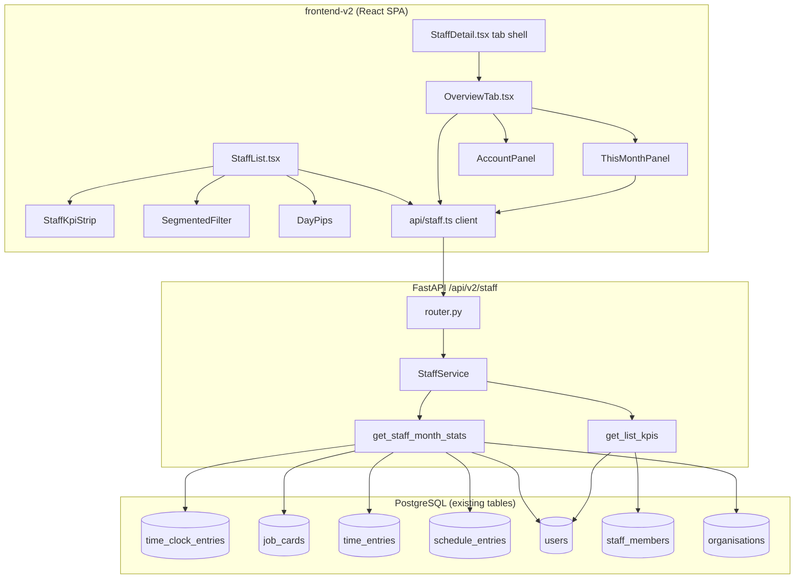
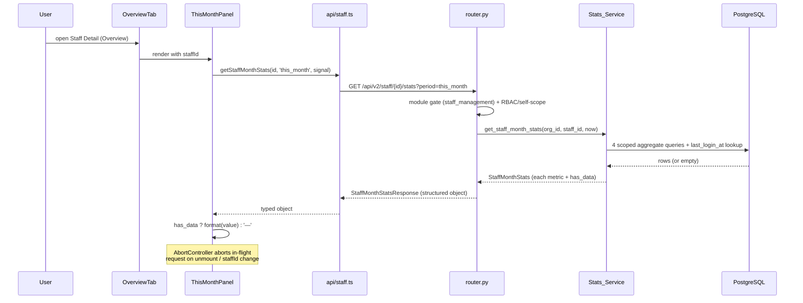

# Design Document

## Overview

The Staff Redesign brings the existing `frontend-v2` Staff list and Staff Detail Overview tab into line with the approved mockups (`Staff.html`, `StaffDetail.html`) and adds one new backend metrics aggregation endpoint. The work is predominantly frontend polish on top of mature, already-shipped staff infrastructure (Staff Management Phases 1–4), plus a single new read-only endpoint and a small extension to the staff list response.

This design follows the three surfaces defined in the requirements:

1. **Staff list page** (`StaffList.tsx`) — add a KPI strip, segmented pill filters, work-day "day pips", avatar initials with a role subline, and Leave/Export header actions, while preserving the existing add/edit modal, duplicate detection, deactivate/activate, permanent-delete, and pagination.
2. **Staff detail Overview tab** (`OverviewTab.tsx`) — keep the existing tabbed shell (Overview / Roster / Payslips / Documents) and the existing Overview sections; add a "This month" metrics panel and a "Last sign-in" row + create-account prompt to the right sidebar.
3. **Stats endpoint** — new `GET /api/v2/staff/{id}/stats?period=this_month` returning four month metrics plus last sign-in, each metric carrying a `has_data` flag, module-gated and access-controlled.

Key design principles, all derived from the approved requirements and project rules:

- **No new tables or migrations.** Every metric maps to existing columns on `time_clock_entries`, `job_cards`, `time_entries`, `schedule_entries`, and `users` (R11.9, Out of Scope §4).
- **No routing change.** The detail page keeps its tabbed shell; only the Overview tab's presentation and sidebar change (R7.4, R7.5).
- **Structured payloads, never bare arrays.** The stats endpoint returns a structured object with one sub-object per metric (R14.5).
- **Safe API consumption, dark mode, responsive, mono IDs/dates** across both surfaces (R14).

### Research summary — grounding the metric definitions

The metric definitions in R11 were validated against the live schema and the existing reporting code:

- **`time_clock_entries`** (`app/modules/time_clock/models.py`) carries `worked_minutes` (nullable int, set at clock-out), `clock_in_at`, `clock_out_at`, `scheduled_entry_id` (nullable FK to `schedule_entries.id`), `staff_id`, and `org_id`. This is the source for Hours_Logged and On_Time_Rate.
- **`job_cards`** (`app/modules/job_cards/models.py`) carries `assigned_to` (FK to `staff_members.id`), `status` (CHECK constraint `open|in_progress|awaiting_parts|completed|invoiced`), and `updated_at`. There is no `completed_at` column, so `updated_at` is the accepted completion proxy (R11.3, Out of Scope §3).
- **`time_entries`** (`app/modules/time_tracking_v2/models.py`) carries `staff_id`, `duration_minutes`, `is_billable`, `start_time`, and `org_id`. The existing `reports_v2/service.py::_generate_staff_utilisation` computes billable ratio as `SUM(duration_minutes WHERE is_billable) / SUM(duration_minutes) * 100` using a `case()` filter — the Stats_Service Billable_Ratio query mirrors this exactly so the two surfaces stay consistent (R11.4).
- **`schedule_entries`** (`app/modules/scheduling_v2/models.py`) carries `start_time` (timezone-aware UTC). On_Time_Rate joins `time_clock_entries.scheduled_entry_id` to `schedule_entries.id` and compares `clock_in_at <= start_time + 5 minutes`.
- **`users.last_login_at`** (`app/modules/auth/models.py`, line 82) is the last-sign-in field. Last_Sign_In is sourced from this column via `staff.user_id` (R11.8).
- **Org timezone**: `organisations.timezone` (`app/modules/organisations/models.py`, default `Pacific/Auckland`) plus the `app/core/timezone_utils.py::to_org_timezone` helper give the month-boundary calculation in org-local time (R11.7).

The existing staff list response is `StaffMemberListResponse` (`{ staff, total, page, page_size, compliance_summary }`) — note it uses `staff` not `items` (an intentional Phase 1 decision, P1-N8). The frontend already reads `data?.staff ?? []`.

## Architecture

### Component overview



### Data flow — Overview "This month" panel



### Layering

- **Router** (`app/modules/staff/router.py`) — owns HTTP concerns: module gate, RBAC + self-scope resolution, org-context extraction, and response shaping. No SQL beyond the existing helpers.
- **Service** (`app/modules/staff/service.py::StaffService`) — owns the metric SQL. Two new methods: `get_staff_month_stats(...)` (the four metrics + last sign-in) and `get_list_kpis(...)` (the two list aggregates). Pure aggregation against existing tables; no writes.
- **Frontend api layer** (`frontend-v2/src/api/staff.ts`, new) — typed client functions mirroring the response schema, each accepting an `AbortSignal`, following the `api/leave.ts` convention.
- **Frontend presentation** — small presentational components composed into the existing pages; no new routes.

## Components and Interfaces

### Backend

#### `Stats_Service.get_staff_month_stats`

```python
async def get_staff_month_stats(
    self,
    org_id: uuid.UUID,
    staff_id: uuid.UUID,
    *,
    now: datetime | None = None,
) -> StaffMonthStats:
    """Compute the four "this month" metrics + last sign-in for one
    staff member. `now` is injectable for deterministic testing;
    defaults to datetime.now(tz=UTC). The calendar-month window is
    derived in the org timezone (R11.7).

    Returns a dataclass; the router maps it to StaffMonthStatsResponse.
    Assumes the caller has already verified the staff member belongs
    to org_id and passed the RBAC/self-scope check.
    """
```

Internally it:
1. Resolves the org timezone from `organisations.timezone` and computes `[month_start_utc, month_end_utc)` (see Data Models → Month boundary).
2. Runs four scoped aggregate queries (one per metric) plus a `users.last_login_at` lookup via `staff.user_id`.
3. Sets each metric's `has_data` flag per R12 and returns a `StaffMonthStats` dataclass.

#### `Stats_Service.get_list_kpis`

```python
async def get_list_kpis(self, org_id: uuid.UUID) -> StaffListKpis:
    """Org-wide staff KPIs for the list page: with-login count and
    average hourly rate. Total/employee counts are derivable from the
    existing list payload, but with-login and avg rate need a scan that
    the paginated list page cannot do client-side."""
```

#### Router signature

```python
@router.get(
    "/{staff_id}/stats",
    response_model=StaffMonthStatsResponse,
    summary="Staff month stats (this month metrics + last sign-in)",
)
async def get_staff_stats(
    staff_id: UUID,
    request: Request,
    period: str = Query("this_month", pattern="^this_month$"),
    db: AsyncSession = Depends(get_db_session),
) -> StaffMonthStatsResponse:
    ...
```

Behaviour:
1. `await _require_staff_management_module(request, db)` — 404 `not_enabled` when the module is off (R13.1), matching the existing detail-endpoint pattern.
2. Resolve `org_id`, `role`, `user_id`, and `branch_ids` from `request.state` (the established pattern; see `leave/router.py`).
3. Load the staff member via `svc.get_staff(org_id, staff_id)` — `None` → 404 (also covers the cross-org case, R13.6, since `get_staff` filters by `org_id`).
4. **RBAC / self-scope** (R13.2–R13.5) — see the access-control matrix below. On denial raise `HTTPException(403)`.
5. `stats = await svc.get_staff_month_stats(org_id, staff_id)`.
6. Map to `StaffMonthStatsResponse` and return.

The route is registered alongside the other `/{staff_id}/...` routes. Because `/{staff_id}/stats` has a literal `stats` suffix it does not collide with the bare `/{staff_id}` route, and the existing static routes (`/utilisation`, `/labour-costs`, `/check-duplicate`) are declared before the `/{staff_id}` group, so no path-ordering change is needed.

**Middleware gating precondition (verified).** Two gates run BEFORE this route's own RBAC: (1) `ModuleMiddleware` for the `/api/v2/staff` prefix, and (2) `RBACMiddleware` → `check_role_path_access`. Verified in `app/modules/auth/rbac.py`: `staff_member` reaches `/api/v2/staff` via `STAFF_MEMBER_ALLOWED_PREFIXES` (GET is allowed; the route is not in `STAFF_MEMBER_READONLY_PREFIXES`, but it is a GET so that is moot), and `salesperson`/`branch_admin` are NOT blocked (`/api/v2/staff/...` is absent from `SALESPERSON_DENIED_PREFIXES` and `BRANCH_ADMIN_DENIED_PREFIXES`, which only list `/api/v1/...` admin/billing/user paths). Therefore the path-based middleware admits all four roles to the stats GET, and this route's own RBAC/self-scope matrix (below) is the authoritative data-scope gate — no change to `rbac.py` prefix lists is required. The `staff_member` self-scope (`target.user_id == request.state.user_id`) is enforced HERE, because the coarse prefix gate alone would otherwise let a staff member read another staff member's stats.

#### Access-control matrix (R13)

| Requester role | Scope | Behaviour |
|---|---|---|
| `org_admin` | Any staff in org | Allowed (R13.2) |
| `salesperson` | Any staff in org | Allowed (R13.2) |
| `branch_admin` | Staff assigned to a location in the admin's `branch_ids` | Allowed only when the target's `staff_location_assignments.location_id` intersects `request.state.branch_ids`; else 403 (R13.3) |
| `staff_member` | Own record only | Allowed only when the target staff row's `user_id == request.state.user_id`; else 403 (R13.4, R13.5) |
| any | Target in a different org | 404 (R13.6 — `get_staff` returns `None`) |

Branch-scope resolution reuses the `staff_location_assignments` ↔ `request.state.branch_ids` pattern already used in `leave/router.py`. Self-scope compares the target staff row's `user_id` against `request.state.user_id`.

### Frontend

#### `api/staff.ts` (new typed client)

```typescript
export interface StaffMetric {
  value: number          // numeric value; 0 when has_data is false
  has_data: boolean      // false → render '—'
}

export interface StaffMonthStats {
  period: 'this_month'
  hours_logged: StaffMetric      // hours, one decimal
  jobs_completed: StaffMetric    // integer count
  billable_ratio: StaffMetric    // whole percent 0–100
  on_time_rate: StaffMetric      // whole percent 0–100
  last_sign_in: string | null    // ISO 8601 or null
  user_role: string | null       // linked user's role, or null when no account
}

export interface StaffListKpis {
  total_staff: number
  employee_count: number
  with_login_count: number
  avg_hourly_rate: number | null   // null → render '—'
}

export async function getStaffMonthStats(
  staffId: string,
  period: 'this_month' = 'this_month',
  signal?: AbortSignal,
): Promise<StaffMonthStats>

export async function getStaffListKpis(
  signal?: AbortSignal,
): Promise<StaffListKpis>
```

Each function reads response data defensively (`res.data?.x ?? default`) and returns a fully-populated object so callers never see `undefined`.

#### Staff list components

- **`StaffKpiStrip`** — four `.kpi` cards (Total staff, Employees, With login access, Avg hourly rate). Total and Employees come from the list payload; With login access and Avg hourly rate come from `getStaffListKpis`. Any unavailable value renders `—` (R1.7).
- **`SegmentedFilter`** — reusable `.seg` pill group; controlled `value` + `onChange`. Two instances: role (All roles / Employees / Contractors) and status (All / Active / Inactive). Selecting an option maps to the existing `roleFilter` / `activeFilter` state and resets `page` to 1 (R2).
- **`DayPips`** — seven labelled squares Mon–Sun; active style when `availability_schedule[day]` is present, inactive otherwise; all inactive when the schedule is empty (R3).
- **Name cell** — avatar initials (first + last initial) + role subline ("Employee"/"Contractor"); the name remains a button navigating to `/staff/{id}` (R4).
- **Header actions** — `Leave` link (navigates to `/leave/approvals`, with a pending-count badge) + `Export` (CSV of the current filter/search) + the retained `Add staff` button (R5).

  **Pending-count source:** the badge count comes from the EXISTING role-scoped approval queue `GET /api/v2/leave/approvals` (`LeaveRequestListResponse.total`, server-scoped to the requester's role per `leave/router.py`). The Staff list fetches it once on mount via a small `getPendingLeaveCount(signal)` helper in `api/staff.ts` (or reuses `api/leave.ts` if a queue fetch already exists there); on failure or a zero count the badge is hidden (R5.2). No new backend endpoint is needed for the count.

#### Overview tab additions

- **`ThisMonthPanel`** — right-sidebar card consuming `getStaffMonthStats`. Renders four `.stat-mini` rows. Uses `AbortController` keyed on `staffId`. Each row: `has_data ? formatted : '—'` (R8).
- **`AccountPanel`** — extends the existing Account card. The current panel (verified in `OverviewTab.tsx`, ~line 1394) shows only a **Login access** badge and a static link to Settings → Users; there is **no** existing "User role" row, "Last sign-in" row, or create-account modal in the Overview tab today. This feature ADDS:
  - a **Last sign-in** row sourced from the stats response (`last_sign_in`, "—" when null);
  - a **User role** row — see "User role sourcing" below;
  - when there is no linked user account, a **"No account?"** prompt with a **Create user account** action. A create-account modal does **not** exist in `OverviewTab.tsx` and must be **built new** in this feature; it calls the EXISTING backend endpoint `POST /api/v2/staff/{staff_id}/create-account` (verified in `staff/router.py`, the `create_staff_account` handler taking `CreateStaffAccountRequest`). The list page's "also create as user" flow uses the separate `/org/users/invite` path and is NOT reused here. (R9)

#### User role sourcing (Account panel)

The staff record exposes `user_id` but NOT the linked user's role; no existing staff endpoint returns it. To populate the **User role** row, `get_staff_month_stats` additionally returns `user_role: str | None` — resolved from the same `users` row already loaded for `last_login_at` (`SELECT last_login_at, role FROM users WHERE id = staff.user_id`). This avoids a second round-trip and a separate endpoint. When there is no linked user, both `user_role` and `last_sign_in` are `null` and the panel shows the "No account?" prompt instead of the role/last-sign-in rows. (R9.2)

## Data Models

### Backend response schemas (Pydantic, `app/modules/staff/schemas.py`)

```python
class StaffMetricValue(BaseModel):
    """One month metric: a numeric value plus a has_data flag.

    has_data=false signals the frontend to render '—' rather than the
    (meaningless) zero value. value is always a number so the schema
    stays a structured object, never null-in-a-bare-field (R12.5).
    """
    value: Decimal
    has_data: bool


class StaffMonthStatsResponse(BaseModel):
    """GET /api/v2/staff/{id}/stats response — a structured object,
    NOT a bare array (R14.5). One sub-object per metric so each can
    carry its own has_data flag (R11.1, R12.1)."""
    staff_id: UUID
    period: Literal["this_month"]
    hours_logged: StaffMetricValue       # hours, 1 dp
    jobs_completed: StaffMetricValue     # integer count
    billable_ratio: StaffMetricValue     # whole percent 0–100
    on_time_rate: StaffMetricValue       # whole percent 0–100
    last_sign_in: datetime | None = None # from users.last_login_at
    user_role: str | None = None         # from users.role (null when no linked user)


class StaffListKpisResponse(BaseModel):
    """Org-wide list KPIs (R1.6)."""
    total_staff: int
    employee_count: int
    with_login_count: int
    avg_hourly_rate: Decimal | None = None  # null → '—'
```

### Service dataclass

```python
@dataclass
class StaffMonthStats:
    hours_logged: Decimal
    hours_logged_has_data: bool
    jobs_completed: int
    jobs_completed_has_data: bool
    billable_ratio: int
    billable_ratio_has_data: bool
    on_time_rate: int
    on_time_rate_has_data: bool
    last_sign_in: datetime | None
    user_role: str | None
```

### List KPI surfacing — recommendation

**Recommendation: add a separate lightweight `GET /api/v2/staff/kpis` endpoint rather than extending the list response or the `compliance_summary` block.**

Rationale:
- The list response is **paginated** (`page_size` default 50). With-login count and average hourly rate are **org-wide** aggregates — embedding them in a paged response means recomputing the same org-wide scan on every page turn, and conceptually conflates "this page of rows" with "whole-org totals".
- `compliance_summary` is a Phase 1 compliance-counter contract (probation/visa/agreement/etc.). Overloading it with unrelated KPI fields couples two independent concerns and risks confusing future readers of that schema.
- A dedicated endpoint is cacheable independently, is fetched once on list mount (not per page), and keeps the existing `StaffMemberListResponse` contract untouched (lower regression risk on a mature, shipped endpoint).
- Total-staff and employee counts are **not** part of this endpoint: total comes from the existing list `total`, and the employee count is derivable, so we avoid duplicating values the client already has. The KPIs endpoint returns all four for convenience and single-source-of-truth, but the frontend may prefer list `total` for the "Total staff" card — both agree.

The `with_login_count` is `COUNT(*) WHERE user_id IS NOT NULL AND is_active`; `avg_hourly_rate` is `AVG(hourly_rate) WHERE hourly_rate IS NOT NULL` over active staff, returned as `null` when no staff have a rate (so the card renders `—`, R1.7).

**Route placement (critical).** `GET /api/v2/staff/kpis` MUST be declared with the other static-suffix routes (`/utilisation`, `/labour-costs`, `/check-duplicate`) **before** the `@router.get("/{staff_id}")` handler. FastAPI matches in declaration order, so a `/kpis` route declared after `/{staff_id}` would be shadowed — the literal `kpis` would be parsed as a `staff_id` UUID and 422. This mirrors the existing comment in `router.py`: "Reports (must be before /{staff_id} to avoid path conflict)."

### Month boundary (org timezone) — R11.7

```python
from zoneinfo import ZoneInfo

# org_tz_name from organisations.timezone (default 'Pacific/Auckland')
tz = ZoneInfo(org_tz_name)            # falls back to UTC on a bad name
local_now = (now or datetime.now(ZoneInfo("UTC"))).astimezone(tz)
month_start_local = local_now.replace(
    day=1, hour=0, minute=0, second=0, microsecond=0
)
# first day of next month
if month_start_local.month == 12:
    month_end_local = month_start_local.replace(year=month_start_local.year + 1, month=1)
else:
    month_end_local = month_start_local.replace(month=month_start_local.month + 1)
# Convert the local boundaries back to UTC for comparison against the
# timezone-aware UTC columns (clock_in_at, start_time, updated_at, etc.).
month_start_utc = month_start_local.astimezone(ZoneInfo("UTC"))
month_end_utc = month_end_local.astimezone(ZoneInfo("UTC"))
```

All metric queries filter on `column >= month_start_utc AND column < month_end_utc` (half-open interval — no double-counting at the boundary).

### Metric query designs (SQLAlchemy)

All queries are `org_id`- and `staff_id`-scoped.

**Hours_Logged (R11.2)** — sum worked minutes for completed clock entries this month, divide by 60:

```python
row = (await self.db.execute(
    select(
        func.coalesce(func.sum(TimeClockEntry.worked_minutes), 0).label("minutes"),
        func.count(TimeClockEntry.id).label("n"),
    ).where(
        TimeClockEntry.org_id == org_id,
        TimeClockEntry.staff_id == staff_id,
        TimeClockEntry.clock_out_at.isnot(None),
        TimeClockEntry.clock_in_at >= month_start_utc,
        TimeClockEntry.clock_in_at < month_end_utc,
    )
)).one()
hours = Decimal(row.minutes) / Decimal(60)
hours_has_data = row.n > 0          # R12.2
```

**Jobs_Completed (R11.3)** — count completed/invoiced job cards assigned this month:

```python
count = (await self.db.execute(
    select(func.count(JobCard.id)).where(
        JobCard.org_id == org_id,
        JobCard.assigned_to == staff_id,
        JobCard.status.in_(("completed", "invoiced")),
        JobCard.updated_at >= month_start_utc,
        JobCard.updated_at < month_end_utc,
    )
)).scalar() or 0
# Count is always meaningful (0 jobs is a true 0), so has_data tracks
# whether the staff member is assignable; per R12 only hours, billable,
# and on-time have explicit empty-data flags. jobs_completed_has_data
# is true whenever a count was computed.
jobs_has_data = True
```

**Billable_Ratio (R11.4)** — mirrors `reports_v2` Staff Utilisation:

```python
row = (await self.db.execute(
    select(
        func.coalesce(func.sum(TimeEntry.duration_minutes), 0).label("total"),
        func.coalesce(
            func.sum(case((TimeEntry.is_billable.is_(True), TimeEntry.duration_minutes), else_=0)),
            0,
        ).label("billable"),
    ).where(
        TimeEntry.org_id == org_id,
        TimeEntry.staff_id == staff_id,
        TimeEntry.start_time >= month_start_utc,
        TimeEntry.start_time < month_end_utc,
    )
)).one()
if row.total > 0:
    ratio = round(Decimal(row.billable) / Decimal(row.total) * 100)
    billable_has_data = True
else:
    ratio = 0
    billable_has_data = False        # R12.3
```

**On_Time_Rate (R11.5, R11.6)** — scheduled clock-ins on time within 5-min grace; unscheduled excluded:

```python
GRACE = timedelta(minutes=5)
row = (await self.db.execute(
    select(
        func.count(TimeClockEntry.id).label("scheduled"),
        func.coalesce(func.sum(
            case(
                (TimeClockEntry.clock_in_at <= ScheduleEntry.start_time + GRACE, 1),
                else_=0,
            )
        ), 0).label("on_time"),
    )
    .select_from(TimeClockEntry)
    .join(ScheduleEntry, TimeClockEntry.scheduled_entry_id == ScheduleEntry.id)
    .where(
        TimeClockEntry.org_id == org_id,
        TimeClockEntry.staff_id == staff_id,
        TimeClockEntry.scheduled_entry_id.isnot(None),   # R11.6 exclude unscheduled
        TimeClockEntry.clock_in_at >= month_start_utc,
        TimeClockEntry.clock_in_at < month_end_utc,
    )
)).one()
if row.scheduled > 0:
    on_time_rate = round(Decimal(row.on_time) / Decimal(row.scheduled) * 100)
    on_time_has_data = True
else:
    on_time_rate = 0
    on_time_has_data = False         # R12.4
```

**Last_Sign_In + User_Role (R11.8, R9.2)** — via `staff.user_id`, one combined lookup:

```python
last_sign_in = None
user_role = None
if staff.user_id is not None:
    row = (await self.db.execute(
        select(User.last_login_at, User.role).where(User.id == staff.user_id)
    )).one_or_none()
    if row is not None:
        last_sign_in, user_role = row
```

## Correctness Properties

*A property is a characteristic or behavior that should hold true across all valid executions of a system — essentially, a formal statement about what the system should do. Properties serve as the bridge between human-readable specifications and machine-verifiable correctness guarantees.*

Property-based testing applies to this feature because the Stats_Service metric computations and the small frontend transforms (initials, day-pip mapping, metric formatting) are pure functions with clear input/output behaviour over a large input space (arbitrary clock entries, job cards, time entries, schedules, names, timezones). The RBAC/gating rules, UI structure, and preservation requirements are example/edge cases instead (see Testing Strategy).

### Property 1: Hours_Logged sums completed in-month worked minutes

*For any* set of `time_clock_entries` for a staff member, `get_staff_month_stats` SHALL return `hours_logged` equal to `SUM(worked_minutes) / 60` over exactly the entries whose `clock_out_at` is non-null and whose `clock_in_at` falls within This_Month, and SHALL set `hours_logged.has_data` to false (value rendered as "—") when no such entries exist.

**Validates: Requirements 11.2, 12.2**

### Property 2: Jobs_Completed counts assigned completed/invoiced cards in-month

*For any* set of `job_cards`, `get_staff_month_stats` SHALL return `jobs_completed` equal to the count of cards where `assigned_to` is the staff member, `status` is in (`completed`, `invoiced`), and `updated_at` falls within This_Month.

**Validates: Requirements 11.3**

### Property 3: Billable_Ratio is billable over total logged minutes

*For any* set of `time_entries` for a staff member within This_Month, `get_staff_month_stats` SHALL return `billable_ratio` equal to `round(SUM(duration_minutes WHERE is_billable) / SUM(duration_minutes) * 100)`, matching the reports_v2 Staff Utilisation formula, and SHALL set `billable_ratio.has_data` to false (rendered "—") when total logged minutes is zero.

**Validates: Requirements 11.4, 12.3**

### Property 4: On_Time_Rate counts only scheduled clock-ins within grace

*For any* set of `time_clock_entries` (a mix of scheduled and unscheduled), `get_staff_month_stats` SHALL compute `on_time_rate` as the percentage of in-month entries with a non-null `scheduled_entry_id` whose `clock_in_at` is at or before the scheduled `start_time` plus the 5-minute Grace_Window, SHALL exclude unscheduled entries from the denominator, and SHALL set `on_time_rate.has_data` to false (rendered "—") when there are no scheduled in-month entries.

**Validates: Requirements 11.5, 11.6, 12.4**

### Property 5: This_Month boundary is evaluated in the org timezone

*For any* organisation timezone and any clock entry whose `clock_in_at` is near a calendar-month boundary, the entry SHALL be included in a date-filtered metric if and only if its timestamp falls within `[start-of-month, start-of-next-month)` evaluated in the org timezone (converted to UTC for comparison).

**Validates: Requirements 11.7**

### Property 6: List KPI aggregates reflect the staff population

*For any* set of active staff members, `get_list_kpis` SHALL return `with_login_count` equal to the number of active staff with a non-null `user_id`, and `avg_hourly_rate` equal to the mean of the non-null `hourly_rate` values (or `null` when no active staff have an hourly rate).

**Validates: Requirements 1.6**

### Property 7: Avatar initials derive from first and last name

*For any* first name and last name, the Name-cell avatar SHALL render initials equal to the uppercased first character of the first name followed by the uppercased first character of the last name (omitting the second initial when there is no last name).

**Validates: Requirements 4.1**

### Property 8: Day pips reflect the availability schedule

*For any* `availability_schedule`, the Work-days cell SHALL render seven pips ordered Monday through Sunday where each day's pip is in the active style if and only if the schedule contains an entry for that day (all seven inactive for an empty schedule).

**Validates: Requirements 3.1, 3.2, 3.3, 3.4**

### Property 9: Metric rendering honours has_data and formatting rules

*For any* `StaffMonthStats` response, the This-month panel SHALL render each metric cell as "—" when its `has_data` flag is false, and otherwise render Hours_Logged to one decimal place suffixed with "h" and Billable_Ratio / On_Time_Rate as whole-number percentages.

**Validates: Requirements 8.3, 8.4, 8.5, 12.5**

### Property 10: Stats endpoint returns a structured object

*For any* computed stats, the `GET /api/v2/staff/{id}/stats` response body SHALL be a JSON object carrying the named keys `hours_logged`, `jobs_completed`, `billable_ratio`, `on_time_rate`, and `last_sign_in`, and SHALL NOT be a bare array.

**Validates: Requirements 11.1, 14.5**

## Error Handling

### Backend

- **Module disabled** — `_require_staff_management_module` raises `HTTPException(404, {"detail": "not_enabled", "module": "staff_management"})`, matching the existing detail/pay-rate endpoints so the frontend degrades to the legacy view rather than surfacing a 404 (R13.1).
- **Staff not found / cross-org** — `svc.get_staff(org_id, staff_id)` returns `None` (it filters by `org_id`), and the router raises `HTTPException(404, "Staff member not found")`. This covers both a genuinely missing record and a record in another org (R13.6).
- **Authorization denied** — branch-scope and self-scope violations raise `HTTPException(403)` with a clear detail message (R13.3–R13.5).
- **Bad `period`** — the `period` query param is constrained by `pattern="^this_month$"`, so any other value yields a 422 from FastAPI validation before the service runs.
- **Empty data is not an error** — absence of clock entries, time entries, or scheduled shifts is normal; the service returns `has_data=false` with a zero value rather than raising (R12). Aggregates use `func.coalesce(..., 0)` so a `NULL` sum never propagates.
- **Missing/invalid org timezone** — `ZoneInfo` construction falls back to UTC on a bad zone name (mirroring `to_org_timezone`), so the month window is always computable.
- **Null `last_login_at` / no linked user** — returned as `null`; never an error (R9.4, R11.8).

### Frontend

- **In-flight request cancellation** — `ThisMonthPanel` uses an `AbortController` keyed on `staffId`; the effect's cleanup aborts the request on unmount or when `staffId` changes, and aborted requests are swallowed (no error state) (R8.7).
- **Fetch failure** — on a non-abort error the panel renders all four metrics as "—" (treated as no-data) and does not crash the Overview tab; the rest of the tab remains usable.
- **Malformed / partial response** — all reads use safe access (`res.data?.hours_logged?.value ?? 0`, `?.has_data ?? false`), so a missing field renders "—" rather than throwing (R8.6, R14.1).
- **KPI strip** — if `getStaffListKpis` fails, the With-login and Avg-rate cards render "—"; Total and Employees still render from the list payload (R1.7).
- **Export** — CSV generation operates on already-fetched, client-filtered rows, so it cannot fail on a network error; an empty filtered set produces a header-only CSV.

## Testing Strategy

A dual approach: property-based tests for the pure aggregation/transform logic, and example/edge/integration tests for UI structure, RBAC, gating, and preservation.

### Property-based testing

- **Library**: backend — **Hypothesis** (already in use, see `.hypothesis/` and `tests/`); frontend — **fast-check** with Vitest + React Testing Library.
- **Iterations**: minimum 100 per property.
- **Tagging**: each property test carries a comment `Feature: staff-redesign, Property {n}: {property text}`.
- **One property → one property-based test.** Backend metric properties (P1–P6, P10) seed the relevant tables (or use mock query layers) with generated rows and assert the computed metric equals an independently-computed reference value. Frontend properties (P7–P9) generate inputs and assert the rendered output.

Mapping:
- P1 Hours_Logged, P2 Jobs_Completed, P3 Billable_Ratio, P4 On_Time_Rate — backend service tests over generated row sets, including the empty-data flag sub-cases.
- P5 month boundary — generate random org timezones and timestamps within ±a few hours of a local month boundary; assert inclusion/exclusion.
- P6 list KPIs — generate random staff populations; assert with-login count and average (and `null` when no rates).
- P7 initials, P8 day-pip mapping, P9 metric rendering/formatting — frontend transform tests.
- P10 structured object — assert the serialized response is an object with the named keys for any generated stats.

### Backend unit / integration tests (example, edge, smoke)

- **Per-metric examples** beyond the properties: a fully-populated staff member with a known fixture set producing exact expected values; the all-empty staff member producing `has_data=false` on hours/billable/on-time (R12.2–R12.4).
- **Last_Sign_In** — linked user with a timestamp (returned), linked user with `null` (returned `null`), no linked user (`null`) (R11.8, R9.4).
- **Router auth/scope** (R13): module-disabled → 404 `not_enabled`; `org_admin` and `salesperson` → 200 for any in-org staff; `branch_admin` → 200 in-scope / 403 out-of-scope; `staff_member` → 200 self / 403 other; cross-org target → 404. Bad `period` → 422.
- **Smoke**: confirm no Alembic migration is added by this feature (R11.9) — a review checklist item, plus a test asserting the endpoint runs against the existing schema.

### Frontend component tests (example, edge)

- **KPI strip** (R1): four labelled cards; values from list + KPIs payload; `null` avg → "—".
- **Segmented filters** (R2): options render; selecting marks active and forwards `role_type` + `is_active` to the fetch; search preserved.
- **Name cell** (R4): role subline Employee/Contractor; name click navigates to `/staff/{id}`.
- **Leave/Export** (R5): Leave links to `/leave/approvals`; pending badge; Export yields CSV matching the visible filtered set; Add staff retained.
- **Preservation** (R6, R10): add/edit modal incl. WorkSchedule, invite flow, deactivate/activate, permanent-delete (+ delete user), duplicate detection, pagination; Overview sections, compliance warnings, PayRateHistoryPanel, RecurringAllowancesPanel all still render.
- **Hero** (R7): avatar/name/status badge; subline "position · employee ID · branch"; absent component → "—"; tab shell unchanged.
- **This-month panel** (R8): labelled "This month" with four metrics; fetches with `period=this_month` on load; AbortController aborts on unmount/staff change; malformed response → "—".
- **Account panel** (R9): Login access / role / Last sign-in; linked vs unlinked rendering; no last sign-in → "—"; "No account?" prompt + Create action opens the existing create-account modal.
- **Cross-cutting** (R14): mono font on IDs/dates; dark-mode classes present; responsive layout at supported widths.

## Requirements Traceability

| Requirement | Design section(s) |
|---|---|
| R1 — List KPI strip | Components → Staff list components (StaffKpiStrip); Data Models → List KPI surfacing recommendation, `get_list_kpis`; Property 6; Testing (KPI strip) |
| R2 — Segmented filters | Components → SegmentedFilter; Testing (Segmented filters) |
| R3 — Work-day pips | Components → DayPips; Property 8; Testing (frontend) |
| R4 — Name cell avatar + subline | Components → Name cell; Property 7; Testing (Name cell) |
| R5 — Leave/Export actions | Components → Header actions; Testing (Leave/Export) |
| R6 — Preserve list functionality | Overview (principles); Testing (Preservation) |
| R7 — Overview hero | Components → Overview tab additions; Testing (Hero) |
| R8 — This-month metrics panel | Components → ThisMonthPanel; Data-flow sequence; Property 9; Error Handling (frontend); Testing (This-month panel) |
| R9 — Account panel + create-account | Components → AccountPanel; Last_Sign_In query; Testing (Account panel) |
| R10 — Preserve Overview content | Overview (principles); Testing (Preservation) |
| R11 — Stats endpoint contract + metric definitions | Backend (Stats_Service, router signature); Data Models (schemas, month boundary, metric queries, Last_Sign_In); Properties 1–5, 10 |
| R12 — Empty-data handling | Data Models (metric queries `has_data`); Error Handling (empty data); Properties 1, 3, 4, 9 |
| R13 — Access control + gating | Backend → Router behaviour + access-control matrix; Error Handling (backend); Testing (Router auth/scope) |
| R14 — Cross-cutting standards | Overview (principles); Error Handling (frontend safe access); Property 10; Testing (Cross-cutting) |
