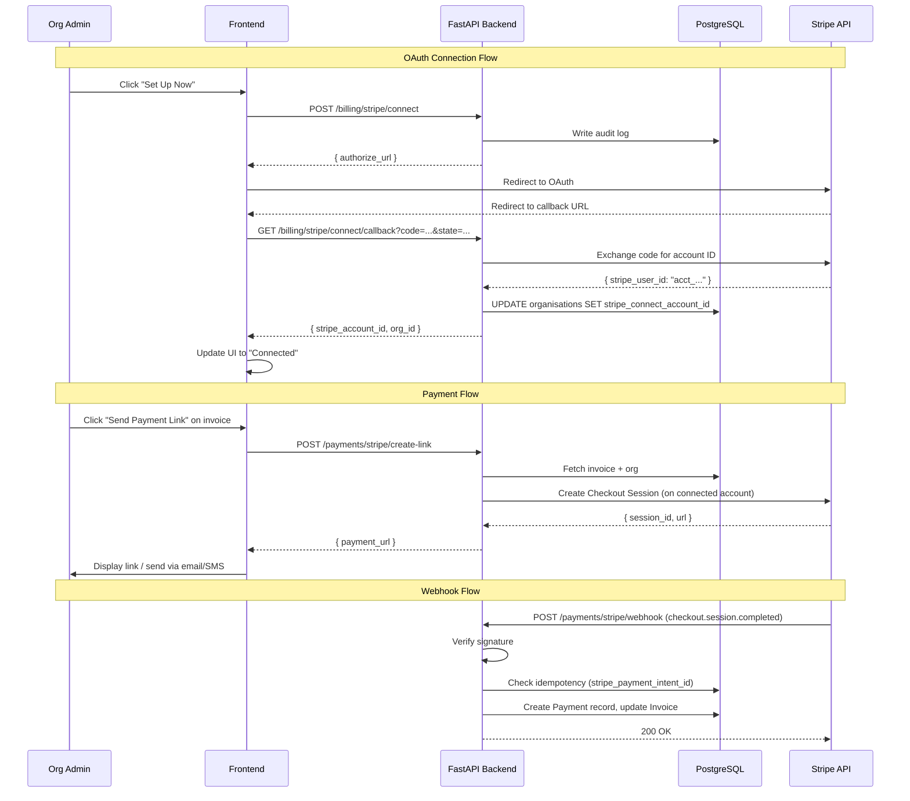
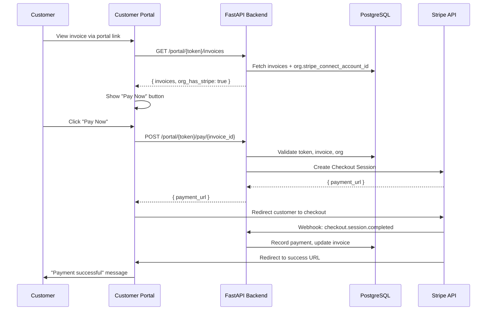

# Design Document: Stripe Connect Online Payments

## Overview

This feature adds an org-facing "Online Payments" settings page and invoice payment capabilities using Stripe Connect (Standard). The platform already has backend infrastructure for Stripe Connect OAuth (`app/modules/billing/router.py`), payment link generation (`app/integrations/stripe_connect.py`), webhook handling (`app/modules/payments/service.py`), and customer portal payment support (`app/modules/portal/service.py`).

The design focuses on:
1. A new **Online Payments settings page** in org settings (frontend)
2. A new **settings status API** endpoint (backend gap)
3. A **disconnect endpoint** (backend gap)
4. Wiring the existing "Pay Now" button on the **customer portal** to show conditionally
5. Adding **application fee support** to checkout session creation
6. Adding **online payment indicators** to the invoice list/detail pages
7. **Idempotency** for the existing webhook handler

### What Already Exists

| Component | Location | Status |
|---|---|---|
| Stripe Connect OAuth initiate | `POST /api/v1/billing/stripe/connect` | ✅ Complete |
| Stripe Connect OAuth callback | `GET /api/v1/billing/stripe/connect/callback` | ✅ Complete |
| `stripe_connect_account_id` column on `organisations` | `app/modules/admin/models.py` | ✅ Complete |
| Payment link generation | `POST /api/v1/payments/stripe/create-link` | ✅ Complete |
| Checkout session creation | `app/integrations/stripe_connect.create_payment_link()` | ✅ Needs app fee support |
| Webhook handler | `POST /api/v1/payments/stripe/webhook` | ✅ Needs idempotency |
| Webhook signature verification | `app/integrations/stripe_connect.verify_webhook_signature()` | ✅ Complete |
| Portal payment | `POST /api/v1/portal/{token}/pay/{invoice_id}` | ✅ Complete |
| Payment model (cash + stripe) | `app/modules/payments/models.py` | ✅ Complete |
| Connect client ID in global admin | `app/modules/admin/schemas.py` | ✅ Complete |

### What Needs to Be Built

| Component | Type | Effort |
|---|---|---|
| Settings status API (`GET /api/v1/payments/online-payments/status`) | Backend endpoint | Small |
| Disconnect API (`POST /api/v1/payments/online-payments/disconnect`) | Backend endpoint | Small |
| Application fee in checkout session | Backend enhancement | Small |
| Webhook idempotency (duplicate check) | Backend enhancement | Small |
| `application_fee_percent` in Stripe config | Backend + admin schema | Small |
| Online Payments settings page | Frontend page | Medium |
| Pay Now button conditional display (invoice detail) | Frontend enhancement | Small |
| Pay Now button conditional display (portal) | Frontend enhancement | Small |
| Online payment badge on invoice list/detail | Frontend enhancement | Small |

## Architecture

### Data Flow



### Portal Payment Flow



## Components and Interfaces

### Backend — New Endpoints

#### 1. Online Payments Status API

**Endpoint:** `GET /api/v1/payments/online-payments/status`
**Auth:** `require_role("org_admin", "global_admin")`
**Module:** `app/modules/payments/router.py`

Returns the org's Stripe Connect status for the settings page.

**Response schema (`OnlinePaymentsStatusResponse`):**
```python
class OnlinePaymentsStatusResponse(BaseModel):
    is_connected: bool
    account_id_last4: str = ""          # e.g. "xK3m" — never the full ID
    connect_client_id_configured: bool  # whether global admin set up client ID
    application_fee_percent: Decimal | None = None
```

**Logic:**
1. Fetch `Organisation` by `org_id` from request context
2. Check `org.stripe_connect_account_id` is not None → `is_connected`
3. Mask account ID: `account_id[-4:]` if present, else `""`
4. Call `get_stripe_connect_client_id()` to check if configured → `connect_client_id_configured`
5. Read `application_fee_percent` from Stripe integration config

#### 2. Disconnect Stripe Account API

**Endpoint:** `POST /api/v1/payments/online-payments/disconnect`
**Auth:** `require_role("org_admin")`
**Module:** `app/modules/payments/router.py`

Clears the connected account from the org record.

**Response schema (`OnlinePaymentsDisconnectResponse`):**
```python
class OnlinePaymentsDisconnectResponse(BaseModel):
    message: str
    previous_account_last4: str
```

**Logic:**
1. Fetch `Organisation` by `org_id`
2. If no `stripe_connect_account_id`, return 400
3. Capture `previous_account_id` for audit
4. Set `org.stripe_connect_account_id = None`
5. `db.flush()`
6. Write audit log: `stripe_connect.disconnected` with masked previous ID and user ID
7. Return success with masked previous account ID

### Backend — Enhancements to Existing Code

#### 3. Application Fee in Checkout Session

**File:** `app/integrations/stripe_connect.py` → `create_payment_link()`

Add optional `application_fee_amount` parameter:

```python
async def create_payment_link(
    *,
    amount: int,
    currency: str,
    invoice_id: str,
    stripe_account_id: str,
    success_url: str | None = None,
    cancel_url: str | None = None,
    application_fee_amount: int | None = None,  # NEW
) -> dict:
```

When `application_fee_amount` is provided and > 0, add to the Checkout Session payload:
```python
if application_fee_amount and application_fee_amount > 0:
    payload["payment_intent_data[application_fee_amount]"] = str(application_fee_amount)
```

**Callers updated:**
- `app/modules/payments/service.py` → `generate_stripe_payment_link()`: Read fee percentage from Stripe config, calculate `int(amount_cents * fee_percent / 100)`, pass to `create_payment_link()`
- `app/modules/portal/service.py` → `create_portal_payment()`: Same calculation

#### 4. Application Fee Percentage in Stripe Config

**File:** `app/modules/admin/schemas.py` → `StripeConfigRequest`

Add field:
```python
application_fee_percent: Decimal | None = Field(
    default=None,
    ge=0,
    le=50,
    description="Application fee percentage (0-50%) for Stripe Connect payments"
)
```

Store in the encrypted `integration_configs` JSON alongside existing Stripe keys.

**File:** `app/integrations/stripe_billing.py`

Add helper:
```python
async def get_application_fee_percent() -> Decimal | None:
    """Return the configured application fee percentage, or None if not set."""
```

#### 5. Webhook Idempotency

**File:** `app/modules/payments/service.py` → `handle_stripe_webhook()`

Before creating a Payment record, check for existing payment with the same `stripe_payment_intent_id`:

```python
# Idempotency check — prevent duplicate payments
existing = await db.execute(
    select(Payment).where(
        Payment.stripe_payment_intent_id == stripe_payment_intent,
        Payment.is_refund == False,
    )
)
if existing.scalar_one_or_none() is not None:
    return {"status": "ignored", "reason": "Duplicate event — payment already recorded"}
```

#### 6. Portal Invoice Response Enhancement

**File:** `app/modules/portal/service.py` → `get_portal_invoices()`

Add `org_has_stripe_connect: bool` to `PortalInvoicesResponse` so the portal frontend knows whether to show the "Pay Now" button:

```python
class PortalInvoicesResponse(BaseModel):
    # ... existing fields ...
    org_has_stripe_connect: bool = False  # NEW
```

Set from `bool(org.stripe_connect_account_id)` in the service.

### Frontend — New Components

#### 7. Online Payments Settings Page

**File:** `frontend/src/pages/settings/OnlinePaymentsSettings.tsx`

**State management:**
- `status: OnlinePaymentsStatus | null` — loaded from status API
- `loading: boolean`
- `error: string | null`
- `showDisconnectDialog: boolean`

**Conditional rendering:**
- If `!status?.connect_client_id_configured` → Show "Online payments not available" message
- If `!status?.is_connected` → Show "Set Up Now" button + "Not Connected" badge
- If `status?.is_connected` → Show "Connected" badge + masked account ID + "Disconnect" button

**OAuth flow:**
1. "Set Up Now" → `POST /api/v1/billing/stripe/connect` → redirect to `authorize_url`
2. Stripe redirects back to `/settings/online-payments?code=...&state=...`
3. Frontend detects query params → `GET /api/v1/billing/stripe/connect/callback?code=...&state=...`
4. On success → re-fetch status → show "Connected"
5. On error → display error message from API

**Disconnect flow:**
1. "Disconnect" → show confirmation dialog
2. Confirm → `POST /api/v1/payments/online-payments/disconnect`
3. On success → re-fetch status → show "Not Connected"

#### 8. Settings Sidebar Navigation

**File:** `frontend/src/pages/settings/SettingsLayout.tsx` (or equivalent)

Add "Online Payments" nav item, visible only to `org_admin` and `global_admin` roles.

#### 9. Invoice Detail — Payment Link Action

**File:** `frontend/src/pages/invoices/InvoiceDetail.tsx` (or equivalent)

Add conditional "Send Payment Link" / "Pay Now" button:
- Visible when: `invoice.status in ['issued', 'partially_paid', 'overdue']` AND org has connected Stripe account
- On click: calls existing `POST /api/v1/payments/stripe/create-link`
- Shows result: payment URL with copy/email/SMS options

The org's Stripe Connect status can be fetched once on page load via the status API or passed from a context.

#### 10. Portal Invoice — Conditional Pay Now Button

**File:** `frontend/src/pages/portal/PortalInvoices.tsx` (or equivalent)

The portal already has a "Pay Now" flow (`POST /portal/{token}/pay/{invoice_id}`). Enhancement:
- Only show "Pay Now" when `org_has_stripe_connect` is true (from enhanced portal invoices response)
- Only show for invoices with status `issued`, `partially_paid`, or `overdue`

#### 11. Invoice List — Online Payment Badge

**File:** `frontend/src/pages/invoices/InvoiceList.tsx` (or equivalent)

Add a small badge/icon next to invoices that have at least one Stripe payment. The payment history endpoint already returns `method` per payment. The invoice list can check if any payment has `method === 'stripe'`.

**Approach:** Extend the invoice list API response to include `has_stripe_payment: bool` per invoice, computed from a subquery on the `payments` table.

## Data Models

### Existing Tables — No Schema Changes Required

The `organisations` table already has `stripe_connect_account_id` (String, nullable). The `payments` table already has `method` (CHECK: 'cash' or 'stripe') and `stripe_payment_intent_id`. No new columns or tables are needed.

### Configuration Storage

The application fee percentage is stored in the existing `integration_configs` table under the `stripe` config row, inside the encrypted JSON blob:

```json
{
  "secret_key": "sk_...",
  "publishable_key": "pk_...",
  "signing_secret": "whsec_...",
  "connect_client_id": "ca_...",
  "application_fee_percent": "2.5"
}
```

### Invoice List Enhancement

To efficiently show the online payment badge on the invoice list without N+1 queries, add a computed field to the invoice list query:

```python
# In the invoice list service, add a subquery:
has_stripe_payment = (
    select(func.count(Payment.id))
    .where(
        Payment.invoice_id == Invoice.id,
        Payment.method == "stripe",
        Payment.is_refund == False,
    )
    .correlate(Invoice)
    .scalar_subquery()
    > 0
).label("has_stripe_payment")
```

This avoids adding a denormalized column and keeps the data consistent.

## Correctness Properties

*A property is a characteristic or behavior that should hold true across all valid executions of a system — essentially, a formal statement about what the system should do. Properties serve as the bridge between human-readable specifications and machine-verifiable correctness guarantees.*

### Property 1: Account ID masking never leaks the full ID

*For any* Stripe account ID string of length ≥ 4, the masked version returned by the settings API SHALL contain exactly the last 4 characters and SHALL NOT contain the full account ID.

**Validates: Requirements 1.6, 1.7**

### Property 2: CSRF state token binds to the originating org

*For any* two distinct org IDs A and B, a state token generated for org A SHALL be rejected by the callback handler when the authenticated org is B.

**Validates: Requirements 2.5**

### Property 3: Checkout session amount and metadata correctness

*For any* valid invoice with `balance_due > 0` and any requested payment amount `0 < amount ≤ balance_due`, the created Checkout Session SHALL have `line_items[0].price_data.unit_amount` equal to `int(amount * 100)`, SHALL include the invoice ID in `metadata.invoice_id`, and SHALL use the invoice's currency.

**Validates: Requirements 4.2, 4.3, 4.6**

### Property 4: Webhook payment updates invoice balances correctly

*For any* invoice with `balance_due > 0` and any webhook payment amount, the handler SHALL record `min(amount, balance_due)` as the payment, the new `balance_due` SHALL equal `old_balance_due - min(amount, balance_due)`, and the new status SHALL be `"paid"` if `new_balance_due == 0` else `"partially_paid"`.

**Validates: Requirements 6.1, 6.2, 6.3, 6.8**

### Property 5: Webhook signature verification accepts valid and rejects invalid signatures

*For any* payload bytes and signing secret, `verify_webhook_signature` SHALL accept a correctly computed HMAC-SHA256 signature and SHALL raise `ValueError` for any signature that does not match.

**Validates: Requirements 6.4**

### Property 6: Webhook idempotency — duplicate events produce no additional records

*For any* valid `checkout.session.completed` event, processing it N times (N ≥ 1) SHALL result in exactly one Payment record with the corresponding `stripe_payment_intent_id`.

**Validates: Requirements 6.6**

### Property 7: Application fee calculation

*For any* payment amount in cents > 0 and any fee percentage in [0, 50], the `application_fee_amount` SHALL equal `round(amount * percentage / 100)`. When fee percentage is 0 or not configured, no application fee SHALL be included.

**Validates: Requirements 7.1, 7.2**

## Error Handling

| Scenario | Component | Response | User-Facing Message |
|---|---|---|---|
| Global admin hasn't configured Connect client ID | Settings page | 200 with `connect_client_id_configured: false` | "Online payments are not available. Contact your platform administrator." |
| OAuth callback — invalid/expired code | Callback endpoint | 400 | "Failed to connect Stripe account. Please try again." |
| OAuth callback — state mismatch | Callback endpoint | 403 | "Security verification failed. Please try again from settings." |
| Stripe API down during OAuth | Callback endpoint | 400 | "Could not reach Stripe. Please try again later." |
| Disconnect — no connected account | Disconnect endpoint | 400 | "No Stripe account is connected." |
| Payment link — org not connected | Create link endpoint | 400 | "Please connect a Stripe account first." |
| Payment link — invoice not payable | Create link endpoint | 400 | "Cannot generate payment link for this invoice status." |
| Payment link — amount > balance_due | Create link endpoint | 400 | "Payment amount exceeds outstanding balance." |
| Webhook — invalid signature | Webhook endpoint | 400 | (No user-facing message — logged server-side) |
| Webhook — duplicate event | Webhook endpoint | 200 (ignored) | (No user-facing message — idempotent) |
| Webhook — invoice not found | Webhook endpoint | 200 (error logged) | (No user-facing message — logged server-side) |
| Portal pay — org not connected | Portal pay endpoint | 400 | "Online payment is not available for this invoice." |
| Email/SMS delivery failure | Payment link generation | 201 (link still returned) | Link is returned; delivery failure logged server-side |

## Testing Strategy

### Property-Based Tests (Hypothesis)

The project already uses Hypothesis for property-based testing. Each correctness property maps to a Hypothesis test with minimum 100 examples.

**Library:** `hypothesis` (already in project dependencies)
**Location:** `tests/properties/test_stripe_connect_properties.py`

| Property | Test Function | Generator Strategy |
|---|---|---|
| P1: Account ID masking | `test_account_id_masking` | `st.text(min_size=4, max_size=50, alphabet=st.characters(whitelist_categories=('L', 'N')))` |
| P2: CSRF state token | `test_csrf_state_token_binding` | `st.uuids()` for org IDs |
| P3: Checkout session correctness | `test_checkout_session_amount_metadata` | `st.integers(min_value=1, max_value=10_000_000)` for amounts, `st.uuids()` for invoice IDs, `st.sampled_from(["nzd", "aud", "usd"])` for currencies |
| P4: Webhook balance update | `test_webhook_payment_balance_update` | `st.decimals(min_value=Decimal("0.01"), max_value=Decimal("999999.99"))` for amounts and balances |
| P5: Signature verification | `test_webhook_signature_verification` | `st.binary(min_size=1, max_size=10000)` for payloads, `st.text(min_size=10, max_size=50)` for secrets |
| P6: Webhook idempotency | `test_webhook_idempotency` | `st.uuids()` for invoice IDs, `st.integers(min_value=100, max_value=1_000_000)` for amounts |
| P7: Application fee calculation | `test_application_fee_calculation` | `st.integers(min_value=1, max_value=10_000_000)` for amounts, `st.decimals(min_value=Decimal("0"), max_value=Decimal("50"))` for percentages |

Each test is tagged: `# Feature: stripe-connect-online-payments, Property N: <description>`

### Unit Tests

| Test | What It Verifies |
|---|---|
| `test_status_api_connected` | Returns `is_connected=True` and masked ID when org has account |
| `test_status_api_not_connected` | Returns `is_connected=False` when org has no account |
| `test_status_api_hides_full_id` | Response never contains full account ID |
| `test_disconnect_clears_account` | Disconnect sets `stripe_connect_account_id` to None |
| `test_disconnect_writes_audit_log` | Audit log entry created with masked ID |
| `test_disconnect_no_account_400` | Returns 400 when no account connected |
| `test_oauth_callback_state_mismatch` | Returns 403 when state org doesn't match auth org |
| `test_payment_link_no_account_400` | Returns 400 when org not connected |
| `test_payment_link_draft_invoice_400` | Returns 400 for draft invoices |
| `test_webhook_duplicate_ignored` | Second webhook for same PI returns "ignored" |
| `test_webhook_unknown_event_ignored` | Non-checkout events return "ignored" |
| `test_portal_pay_no_account_400` | Portal pay returns 400 when org not connected |
| `test_application_fee_included` | Checkout session includes fee when configured |
| `test_application_fee_absent` | Checkout session has no fee when not configured |

### Integration / E2E Tests

**Script:** `scripts/test_online_payments_e2e.py`

Following the project's e2e testing pattern:
1. Login as org_admin
2. GET status → verify "not connected"
3. POST initiate connect → verify authorize_url returned
4. Simulate callback with mocked Stripe response → verify org updated
5. GET status → verify "connected" with masked ID
6. POST create payment link for an issued invoice → verify URL returned
7. Simulate webhook → verify payment recorded, invoice status updated
8. Simulate duplicate webhook → verify idempotent (no duplicate payment)
9. POST disconnect → verify account cleared
10. GET status → verify "not connected"
11. Security: try disconnect with salesperson token → expect 403
12. Security: try status with no token → expect 401
