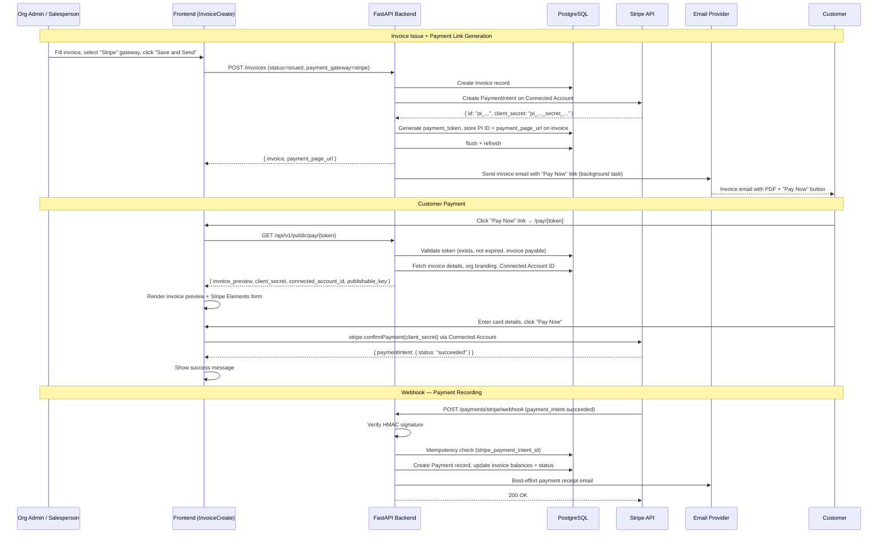
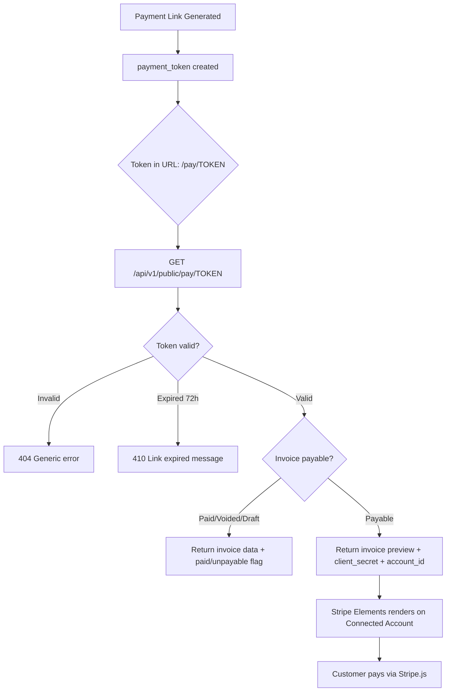

# Design Document: Stripe Invoice Payment Flow

## Overview

This feature replaces the existing Stripe hosted Checkout flow for invoice payments with a **custom payment page** using Stripe Elements. When an invoice with `payment_gateway: "stripe"` is issued via "Save and Send", the system automatically:

1. Creates a **PaymentIntent** (not a Checkout Session) on the org's Connected Account
2. Generates a **payment token** for secure, unauthenticated access to the payment page
3. Stores the PaymentIntent ID and payment page URL on the invoice record
4. Includes a **"Pay Now" link** in the invoice email
5. Serves a **public custom payment page** showing an invoice preview alongside a Stripe Elements form
6. Records the payment via the existing webhook handler (extended to handle `payment_intent.succeeded`)

### What Already Exists

| Component | Location | Status |
|---|---|---|
| Stripe Connect OAuth flow | `app/modules/billing/router.py` | ✅ Complete |
| `create_payment_link()` (Checkout Sessions) | `app/integrations/stripe_connect.py` | ✅ Exists — new function needed for PaymentIntents |
| `email_invoice()` | `app/modules/invoices/service.py` | ✅ Needs payment link injection |
| Webhook handler (`checkout.session.completed`) | `app/modules/payments/service.py` | ✅ Needs `payment_intent.succeeded` support |
| Webhook signature verification | `app/integrations/stripe_connect.verify_webhook_signature()` | ✅ Complete |
| Payment model (cash + stripe) | `app/modules/payments/models.py` | ✅ Complete |
| `stripe_connect_account_id` on organisations | `app/modules/admin/models.py` | ✅ Complete |
| `payment_gateway` field in `invoice_data_json` | Frontend sends it; backend stores in JSONB | ✅ Complete |
| Signup `PaymentStep.tsx` with Stripe Elements | `frontend/src/pages/auth/PaymentStep.tsx` | ✅ Reference pattern |
| Portal `PaymentPage.tsx` (placeholder) | `frontend/src/pages/portal/PaymentPage.tsx` | ✅ Placeholder — needs real implementation |
| Auth middleware public path bypass | `app/middleware/auth.py` → `PUBLIC_PREFIXES` | ✅ `/api/v1/public/` already public |
| Stripe publishable key endpoint | `GET /api/v1/auth/stripe-publishable-key` | ✅ Complete |
| Application fee support | `app/integrations/stripe_connect.py` | ✅ Complete |

### What Needs to Be Built

| Component | Type | Effort |
|---|---|---|
| `payment_tokens` database table + Alembic migration | Database | Small |
| `stripe_payment_intent_id` + `payment_page_url` columns on invoices | Database migration | Small |
| `create_payment_intent()` function | Backend — new Stripe integration | Medium |
| Payment token generation service | Backend — new service | Small |
| Public payment page API (`GET /api/v1/public/pay/{token}`) | Backend — new endpoint | Medium |
| Auto-generate PaymentIntent on "Save and Send" with Stripe gateway | Backend — enhance invoice issue flow | Small |
| Inject "Pay Now" link into invoice email | Backend — enhance `email_invoice()` | Small |
| Extend webhook handler for `payment_intent.succeeded` | Backend — enhance existing handler | Small |
| Payment link regeneration endpoint | Backend — new endpoint | Small |
| Custom payment page (React + Stripe Elements) | Frontend — new public page | Medium |
| Invoice detail — regenerate payment link action | Frontend — enhancement | Small |

## Architecture

### Payment Flow — End to End



### Payment Token Security Model



## Components and Interfaces

### Backend — New Database Objects

#### 1. `payment_tokens` Table

A new table to store secure, time-limited tokens for public payment page access.

```python
class PaymentToken(Base):
    __tablename__ = "payment_tokens"

    id: Mapped[uuid.UUID] = mapped_column(
        UUID(as_uuid=True), primary_key=True, default=uuid.uuid4,
        server_default=func.gen_random_uuid(),
    )
    token: Mapped[str] = mapped_column(
        String(64), nullable=False, unique=True, index=True,
    )
    invoice_id: Mapped[uuid.UUID] = mapped_column(
        UUID(as_uuid=True), ForeignKey("invoices.id", ondelete="CASCADE"), nullable=False,
    )
    org_id: Mapped[uuid.UUID] = mapped_column(
        UUID(as_uuid=True), ForeignKey("organisations.id"), nullable=False,
    )
    expires_at: Mapped[datetime] = mapped_column(
        DateTime(timezone=True), nullable=False,
    )
    is_active: Mapped[bool] = mapped_column(
        Boolean, nullable=False, server_default="true",
    )
    created_at: Mapped[datetime] = mapped_column(
        DateTime(timezone=True), nullable=False, server_default=func.now(),
    )

    invoice = relationship("Invoice", backref="payment_tokens")
    organisation = relationship("Organisation", backref="payment_tokens")
```

**Token format:** 64-character URL-safe random string via `secrets.token_urlsafe(48)` (produces ~64 chars).

**Expiry:** 72 hours from creation.

**Invalidation:** When a new token is generated for the same invoice, all previous tokens for that invoice are set to `is_active = False`.

#### 2. New Columns on `invoices` Table

Add two nullable columns via Alembic migration:

```python
# In the migration
op.add_column('invoices', sa.Column('stripe_payment_intent_id', sa.String(255), nullable=True))
op.add_column('invoices', sa.Column('payment_page_url', sa.String(500), nullable=True))
```

These store the current PaymentIntent ID and the public payment page URL for the invoice.

### Backend — New Stripe Integration

#### 3. `create_payment_intent()` Function

**File:** `app/integrations/stripe_connect.py`

A new function (separate from the existing `create_payment_link()` which creates Checkout Sessions) that creates a PaymentIntent directly on the Connected Account.

```python
async def create_payment_intent(
    *,
    amount: int,
    currency: str,
    invoice_id: str,
    stripe_account_id: str,
    application_fee_amount: int | None = None,
) -> dict:
    """Create a Stripe PaymentIntent on a Connected Account.

    Returns {"payment_intent_id": "pi_...", "client_secret": "pi_..._secret_..."}
    """
```

**Stripe API call:**
```
POST https://api.stripe.com/v1/payment_intents
Headers: Stripe-Account: {stripe_account_id}
Auth: platform secret key
Body:
  amount={amount}
  currency={currency}
  metadata[invoice_id]={invoice_id}
  metadata[platform]=workshoppro_nz
  application_fee_amount={application_fee_amount}  # if > 0
```

**Key difference from `create_payment_link()`:** No `success_url`/`cancel_url` — the frontend handles the payment confirmation flow entirely client-side via `stripe.confirmPayment()`.

### Backend — New Payment Token Service

#### 4. Payment Token Service

**File:** `app/modules/payments/token_service.py`

```python
async def generate_payment_token(
    db: AsyncSession,
    *,
    org_id: uuid.UUID,
    invoice_id: uuid.UUID,
) -> tuple[str, str]:
    """Generate a payment token and payment page URL for an invoice.

    Invalidates any existing active tokens for the same invoice.
    Returns (token_string, payment_page_url).
    """

async def validate_payment_token(
    db: AsyncSession,
    *,
    token: str,
) -> PaymentToken | None:
    """Validate a payment token. Returns the token record if valid, None if invalid.
    Raises ValueError with specific message if expired.
    """
```

**Token generation flow:**
1. Deactivate all existing active tokens for this invoice (`UPDATE payment_tokens SET is_active = False WHERE invoice_id = :id AND is_active = True`)
2. Generate token: `secrets.token_urlsafe(48)`
3. Set expiry: `datetime.now(timezone.utc) + timedelta(hours=72)`
4. Insert new `PaymentToken` record
5. Build URL: `{frontend_base_url}/pay/{token}`
6. Return `(token, url)`

**Token validation flow:**
1. Query `payment_tokens` where `token = :token AND is_active = True`
2. If not found → return `None` (generic "invalid link")
3. If `expires_at < now()` → raise `ValueError("expired")`
4. Return the token record

### Backend — New Public Payment Page API

#### 5. Public Payment Page Endpoint

**File:** `app/modules/payments/public_router.py`

**Endpoint:** `GET /api/v1/public/pay/{token}`

This is a **public endpoint** (no authentication required) — the `/api/v1/public/` prefix is already in `PUBLIC_PREFIXES` in the auth middleware.

**Response schema:**
```python
class PaymentPageResponse(BaseModel):
    # Invoice preview
    org_name: str
    org_logo_url: str | None = None
    org_primary_colour: str | None = None
    invoice_number: str | None = None
    issue_date: date | None = None
    due_date: date | None = None
    currency: str = "NZD"
    line_items: list[PaymentPageLineItem] = []
    subtotal: Decimal
    gst_amount: Decimal
    total: Decimal
    amount_paid: Decimal
    balance_due: Decimal
    status: str

    # Stripe config (only when invoice is payable)
    client_secret: str | None = None
    connected_account_id: str | None = None
    publishable_key: str | None = None

    # Flags
    is_paid: bool = False
    is_payable: bool = False
    error_message: str | None = None

class PaymentPageLineItem(BaseModel):
    description: str
    quantity: Decimal
    unit_price: Decimal
    line_total: Decimal
```

**Logic:**
1. Validate token via `validate_payment_token()`
2. If invalid → return 404 `{"detail": "Invalid payment link"}`
3. If expired → return 410 `{"detail": "This payment link has expired. Please contact the business for a new link."}`
4. Fetch invoice with line items
5. Fetch org for branding (name, logo, primary colour)
6. If invoice status is "paid" → return data with `is_paid=True`, no `client_secret`
7. If invoice status is "voided" or "draft" → return data with `is_payable=False`, `error_message`
8. If payable → fetch Stripe publishable key, return full data with `client_secret`, `connected_account_id`, `publishable_key`

**Security:**
- Rate limited: 20 requests/minute per IP (add to rate limiter config)
- Token is NOT logged in application logs
- Response does NOT include: org's Stripe secret key, full Connected Account ID (only the `acct_...` ID needed for Stripe.js `stripeAccount` option — this is safe, it's equivalent to a publishable key), internal user info
- CSP headers set by nginx/frontend for Stripe.js domains

### Backend — Enhance Invoice Issue Flow

#### 6. Auto-Generate PaymentIntent on Issue

**File:** `app/modules/invoices/service.py` — in the `email_invoice()` function and/or the invoice creation flow

When an invoice is issued (status transitions to "issued") and `invoice_data_json.payment_gateway == "stripe"`:

1. Check org has `stripe_connect_account_id` — if not, skip (log warning)
2. Calculate amount in cents: `int(invoice.balance_due * 100)`
3. Calculate application fee if configured
4. Call `create_payment_intent()` with the Connected Account
5. Generate payment token via `generate_payment_token()`
6. Store `stripe_payment_intent_id` and `payment_page_url` on the invoice record
7. `db.flush()` + `await db.refresh(invoice)`

**Error handling:** If PaymentIntent creation fails (Stripe API error, network timeout), the invoice is still issued and the email is still sent — just without the payment link. The error is logged for investigation.

### Backend — Enhance Invoice Email

#### 7. Payment Link in Email

**File:** `app/modules/invoices/service.py` → `email_invoice()`

After the invoice is issued and has a `payment_page_url`:

- **Plain text:** Add a line: `Pay online: {payment_page_url}`
- **HTML (if added later):** Add a styled "Pay Now" button linking to the URL

The email is sent regardless of whether the payment link exists — if `payment_page_url` is None, the email is sent in its current format.

### Backend — Extend Webhook Handler

#### 8. Handle `payment_intent.succeeded`

**File:** `app/modules/payments/service.py` → `handle_stripe_webhook()`

Extend the existing handler to also process `payment_intent.succeeded` events:

```python
if event_type not in ("checkout.session.completed", "payment_intent.succeeded"):
    return {"status": "ignored", "reason": f"Unhandled event type: {event_type}"}
```

For `payment_intent.succeeded`:
- Extract `invoice_id` from `metadata.invoice_id`
- Extract `amount` from `amount_received` (already in cents)
- Extract `stripe_payment_intent` from `id` (the PI ID itself)
- The rest of the flow (idempotency check, payment creation, balance update) is identical

### Backend — Payment Link Regeneration

#### 9. Regeneration Endpoint

**File:** `app/modules/payments/router.py`

**Endpoint:** `POST /api/v1/payments/invoice/{invoice_id}/regenerate-payment-link`
**Auth:** `require_role("org_admin", "salesperson")`

**Logic:**
1. Validate invoice exists, belongs to org, is payable (issued/partially_paid/overdue)
2. Validate org has Connected Account
3. Create new PaymentIntent (the old one can be cancelled or left to expire)
4. Generate new payment token (invalidates old tokens)
5. Update invoice's `stripe_payment_intent_id` and `payment_page_url`
6. Return `{ payment_page_url, invoice_id }`

### Frontend — Custom Payment Page

#### 10. Public Payment Page Component

**File:** `frontend/src/pages/public/InvoicePaymentPage.tsx`

**Route:** `/pay/:token` (public, no auth required)

**Layout (desktop):** Two-column — invoice preview on the left, Stripe Elements form on the right.
**Layout (mobile < 768px):** Stacked — invoice preview on top, payment form below.

**Data flow:**
1. On mount, call `GET /api/v1/public/pay/{token}`
2. If error (404/410) → show error message
3. If `is_paid` → show "This invoice has been paid" message
4. If `!is_payable` → show appropriate message
5. If payable → initialise Stripe.js with `publishable_key` and `stripeAccount: connected_account_id`, render `<Elements>` with `clientSecret`

**Stripe Elements integration** (following `PaymentStep.tsx` pattern):
```tsx
const stripePromise = loadStripe(publishableKey, {
  stripeAccount: connectedAccountId,
})

<Elements stripe={stripePromise} options={{ clientSecret }}>
  <PaymentForm amount={balanceDue} currency={currency} invoiceNumber={invoiceNumber} />
</Elements>
```

**Payment form:**
- Shows amount to be charged and "Pay Now" button
- On submit: `stripe.confirmPayment({ elements, confirmParams: { return_url } })` or `stripe.confirmCardPayment(clientSecret, { payment_method: { card: cardElement } })`
- On success: show confirmation with amount paid and invoice number
- On failure: show Stripe error message, allow retry
- Button disabled while processing (prevent double submission)

**Invoice preview section:**
- Org name + logo (if configured) + primary colour accent
- Invoice number, issue date, due date
- Line items table: description, quantity, unit price, amount
- Subtotal, GST, total, amount paid, balance due

#### 11. Frontend Route Registration

**File:** `frontend/src/App.tsx`

Add public route (outside auth wrapper):
```tsx
<Route path="/pay/:token" element={<InvoicePaymentPage />} />
```

#### 12. Invoice Detail — Regenerate Payment Link

**File:** `frontend/src/pages/invoices/InvoiceDetail.tsx`

Add a "Regenerate Payment Link" button when:
- Invoice status is `issued`, `partially_paid`, or `overdue`
- Org has Connected Account (check via existing status API or from invoice data)
- The existing payment link has expired or doesn't exist

On click: `POST /api/v1/payments/invoice/{id}/regenerate-payment-link`
On success: show the new URL with copy-to-clipboard option

## Data Models

### New Table: `payment_tokens`

| Column | Type | Constraints | Description |
|---|---|---|---|
| `id` | UUID | PK, default gen_random_uuid() | Primary key |
| `token` | VARCHAR(64) | NOT NULL, UNIQUE, INDEX | URL-safe random token |
| `invoice_id` | UUID | FK → invoices.id ON DELETE CASCADE | Associated invoice |
| `org_id` | UUID | FK → organisations.id | Owning organisation |
| `expires_at` | TIMESTAMPTZ | NOT NULL | Token expiry (72h from creation) |
| `is_active` | BOOLEAN | NOT NULL, default TRUE | Soft-delete for invalidation |
| `created_at` | TIMESTAMPTZ | NOT NULL, default now() | Creation timestamp |

### Modified Table: `invoices`

| New Column | Type | Constraints | Description |
|---|---|---|---|
| `stripe_payment_intent_id` | VARCHAR(255) | NULLABLE | Stripe PaymentIntent ID (`pi_...`) |
| `payment_page_url` | VARCHAR(500) | NULLABLE | Public payment page URL |

### Alembic Migration

Single migration file adding:
1. `payment_tokens` table with all columns, FK constraints, and unique index on `token`
2. `stripe_payment_intent_id` column on `invoices`
3. `payment_page_url` column on `invoices`

Following the database-migration-checklist: run `alembic upgrade head` in the container immediately after creating the migration.

## Correctness Properties

*A property is a characteristic or behavior that should hold true across all valid executions of a system — essentially, a formal statement about what the system should do. Properties serve as the bridge between human-readable specifications and machine-verifiable correctness guarantees.*

**Note:** Several acceptance criteria in this feature (7.1–7.4, 7.6 — webhook balance updates and idempotency, and 1.6 — application fee calculation) are already covered by properties in the `stripe-connect-online-payments` spec (Properties 4, 6, and 7). The webhook handler extension to `payment_intent.succeeded` reuses the same balance/idempotency logic, so those properties still validate correctness. The properties below cover the **new** logic introduced by this feature.

### Property 1: PaymentIntent creation correctness

*For any* valid invoice with `balance_due > 0`, any supported currency, and any Connected Account ID, the `create_payment_intent()` function SHALL produce a Stripe API payload where `amount` equals `int(balance_due * 100)`, `currency` matches the invoice currency (lowercased), and `metadata[invoice_id]` equals the invoice ID string. After creation, the invoice record SHALL have `stripe_payment_intent_id` and `payment_page_url` set to non-empty values.

**Validates: Requirements 1.1, 1.2, 1.3, 1.4**

### Property 2: Payment token generation produces unique, secure tokens with correct expiry

*For any* invoice and org, generating a payment token SHALL produce a URL-safe string of at least 32 characters, and the associated `expires_at` SHALL be exactly 72 hours after `created_at`. Furthermore, generating N tokens (N ≥ 2) for different invoices SHALL produce N distinct token strings.

**Validates: Requirements 3.1, 3.2, 3.6**

### Property 3: Invoice email includes payment link when present

*For any* invoice that has a non-null `payment_page_url`, the plain-text email body produced by `email_invoice()` SHALL contain the payment page URL as a substring. When `payment_page_url` is null, the email body SHALL NOT contain "/pay/" substring.

**Validates: Requirements 2.1, 2.3**

### Property 4: Valid payment token returns correct invoice data and client secret

*For any* valid, non-expired payment token associated with a payable invoice (status in issued/partially_paid/overdue), the payment page API SHALL return a response where `invoice_number` matches the invoice, `balance_due` matches the invoice balance, `client_secret` is non-null, `connected_account_id` is non-null, and `is_payable` is true.

**Validates: Requirements 3.3, 6.1**

### Property 5: Payment page response never leaks sensitive data

*For any* payment page API response (whether the token is valid, expired, or invalid), the serialized JSON response SHALL NOT contain any string matching the patterns `sk_live_`, `sk_test_`, `whsec_`, or any full Stripe account ID (string starting with `acct_` longer than 30 characters). The response SHALL NOT contain any user ID or internal database ID other than the invoice-related fields.

**Validates: Requirements 6.2, 9.4**

### Property 6: Token regeneration invalidates all previous tokens

*For any* invoice, after calling the regeneration service, all previously active payment tokens for that invoice SHALL have `is_active = False`, and exactly one new active token SHALL exist. The invoice's `stripe_payment_intent_id` and `payment_page_url` SHALL be updated to new values different from the previous ones.

**Validates: Requirements 8.2, 8.4**

## Error Handling

| Scenario | Component | HTTP Status | User-Facing Message |
|---|---|---|---|
| PaymentIntent creation fails (Stripe API error) | Invoice issue flow | 201 (invoice still created) | Invoice issued; payment link generation logged as failed |
| PaymentIntent creation fails (network timeout) | Invoice issue flow | 201 (invoice still created) | Invoice issued; payment link generation logged as failed |
| Org has no Connected Account when issuing with Stripe gateway | Invoice issue flow | 201 (invoice still created) | Invoice issued without payment link; warning logged |
| Invalid payment token | Public payment page API | 404 | "Invalid payment link" |
| Expired payment token | Public payment page API | 410 | "This payment link has expired. Please contact the business for a new link." |
| Invoice already paid (via valid token) | Public payment page API | 200 | Response with `is_paid: true`, no client_secret |
| Invoice voided/draft (via valid token) | Public payment page API | 200 | Response with `is_payable: false`, error_message |
| Rate limit exceeded on payment page API | Public payment page API | 429 | "Too many requests. Please try again later." + `Retry-After` header |
| Card declined / insufficient funds | Stripe Elements (frontend) | N/A | Stripe error message displayed, retry allowed |
| 3D Secure authentication required | Stripe Elements (frontend) | N/A | Stripe handles redirect automatically |
| Webhook — invalid signature | Webhook endpoint | 400 | (No user-facing message — logged server-side) |
| Webhook — duplicate `payment_intent.succeeded` | Webhook endpoint | 200 (ignored) | (No user-facing message — idempotent) |
| Webhook — invoice not found for PI metadata | Webhook endpoint | 200 (error logged) | (No user-facing message — logged server-side) |
| Regeneration — invoice not payable | Regeneration endpoint | 400 | "Cannot regenerate payment link for this invoice status." |
| Regeneration — org not connected | Regeneration endpoint | 400 | "Please connect a Stripe account first." |
| Email delivery failure after payment link generation | Email sending | 201 (link still on invoice) | Link stored on invoice; email failure logged |

## Testing Strategy

### Property-Based Tests (Hypothesis)

The project uses Hypothesis for property-based testing. Each correctness property maps to a Hypothesis test with minimum 100 examples.

**Library:** `hypothesis` (already in project dependencies)
**Location:** `tests/properties/test_stripe_invoice_payment_properties.py`

| Property | Test Function | Generator Strategy |
|---|---|---|
| P1: PaymentIntent creation | `test_payment_intent_creation_correctness` | `st.decimals(min_value=Decimal("0.01"), max_value=Decimal("999999.99"))` for balance_due, `st.sampled_from(["nzd", "aud", "usd"])` for currency, `st.uuids()` for invoice IDs, `st.text(min_size=10, max_size=30, alphabet=st.characters(whitelist_categories=('L','N')))` for account IDs |
| P2: Token generation | `test_payment_token_generation` | `st.uuids()` for invoice IDs and org IDs, `st.integers(min_value=2, max_value=20)` for batch sizes |
| P3: Email payment link | `test_email_contains_payment_link` | `st.text(min_size=10, max_size=200, alphabet=st.characters(whitelist_categories=('L','N','P')))` for URLs |
| P4: Token validation round-trip | `test_valid_token_returns_invoice_data` | `st.uuids()` for invoice IDs, `st.decimals(min_value=Decimal("0.01"), max_value=Decimal("999999.99"))` for balances |
| P5: No sensitive data leakage | `test_payment_page_no_sensitive_data` | `st.text(min_size=5, max_size=50)` for various field values, `st.sampled_from(["valid", "expired", "invalid"])` for token states |
| P6: Token regeneration | `test_token_regeneration_invalidates_previous` | `st.uuids()` for invoice IDs, `st.integers(min_value=1, max_value=5)` for number of regenerations |

Each test is tagged: `# Feature: stripe-invoice-payment-flow, Property N: <description>`

**Configuration:** Minimum 100 iterations per property test (`@settings(max_examples=100)`).

### Unit Tests

| Test | What It Verifies |
|---|---|
| `test_create_payment_intent_success` | PaymentIntent created with correct amount, currency, metadata |
| `test_create_payment_intent_with_app_fee` | Application fee included when configured |
| `test_create_payment_intent_no_app_fee` | No application fee when not configured |
| `test_create_payment_intent_stripe_error` | Stripe API error handled gracefully, invoice still issued |
| `test_generate_payment_token` | Token created with correct expiry and length |
| `test_validate_token_valid` | Valid token returns token record |
| `test_validate_token_expired` | Expired token raises ValueError |
| `test_validate_token_invalid` | Non-existent token returns None |
| `test_validate_token_inactive` | Deactivated token returns None |
| `test_payment_page_api_valid_token` | Returns invoice data + client_secret for payable invoice |
| `test_payment_page_api_paid_invoice` | Returns is_paid=True, no client_secret |
| `test_payment_page_api_voided_invoice` | Returns is_payable=False with error message |
| `test_payment_page_api_invalid_token` | Returns 404 |
| `test_payment_page_api_expired_token` | Returns 410 |
| `test_payment_page_api_rate_limit` | Returns 429 after 20 requests/minute |
| `test_email_invoice_with_payment_link` | Email body contains payment URL |
| `test_email_invoice_without_payment_link` | Email body unchanged when no URL |
| `test_webhook_payment_intent_succeeded` | Payment recorded, invoice updated |
| `test_webhook_payment_intent_duplicate` | Idempotent — no duplicate payment |
| `test_regenerate_payment_link` | New PI + token created, old token invalidated |
| `test_regenerate_payment_link_not_payable` | Returns 400 for paid/voided invoices |
| `test_issue_invoice_stripe_gateway_creates_pi` | Issuing with stripe gateway creates PaymentIntent |
| `test_issue_invoice_cash_gateway_no_pi` | Issuing with cash gateway does not create PaymentIntent |

### Integration / E2E Tests

**Script:** `scripts/test_stripe_invoice_payment_e2e.py`

Following the project's e2e testing pattern (httpx, asyncio, ok/fail helpers):

1. Login as org_admin
2. Create invoice with `payment_gateway: "stripe"`, issue via "Save and Send"
3. Verify invoice has `stripe_payment_intent_id` and `payment_page_url` set
4. GET public payment page API with token from URL → verify response shape
5. Verify response contains invoice preview data, client_secret, connected_account_id
6. Verify response does NOT contain secret keys or full account IDs
7. Simulate `payment_intent.succeeded` webhook → verify payment recorded, invoice status updated
8. Simulate duplicate webhook → verify idempotent
9. GET payment page again → verify is_paid=True, no client_secret
10. Create another invoice, issue with stripe gateway
11. Regenerate payment link → verify new URL, old token invalid
12. GET old token → verify 404
13. GET new token → verify valid response
14. Wait/mock token expiry → verify 410 response
15. **Security checks:**
    - OWASP A1: GET payment page with no token → 404
    - OWASP A1: POST regenerate with salesperson token for another org → 403
    - OWASP A2: Verify response never contains `sk_live_`, `sk_test_`, `whsec_`
    - OWASP A3: Send SQL injection payload as token → no error, 404
    - OWASP A4: Verify rate limiting on payment page endpoint (21st request → 429)
    - OWASP A8: Verify audit log created for payment link generation
16. Clean up test data

