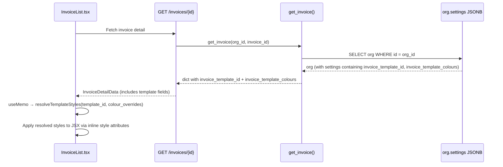
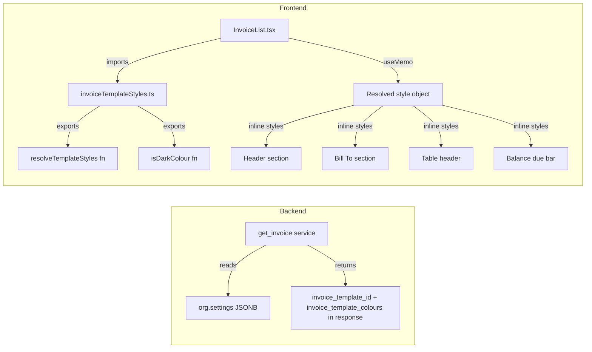

# Design Document: Template-Aware Invoice Preview

## Overview

This feature makes the in-browser invoice preview in `InvoiceList.tsx` reflect the org's configured PDF template styling — colours, layout type, and logo position — so the HTML preview matches the actual PDF output.

### Key Design Decisions

1. **No new API calls** — The invoice detail endpoint (`GET /invoices/{id}`) already fetches the org and its settings. We add two fields (`invoice_template_id`, `invoice_template_colours`) to the response dict by reading from the existing `org.settings` JSONB. Zero additional database queries.

2. **Frontend style map mirrors backend registry** — A new `invoiceTemplateStyles.ts` module contains the same 13 template colour/layout definitions as `template_registry.py`. This avoids a network round-trip to fetch template metadata at render time. The style map is a pure data module with a resolver function.

3. **Inline styles over Tailwind classes** — The existing preview already uses inline `style={{ background: '#3b5bdb' }}` for the table header and balance bar (for print compatibility). We extend this pattern to all template-coloured elements. This avoids fighting Tailwind's purge/JIT and keeps print styles working via `WebkitPrintColorAdjust: 'exact'`.

4. **Single `useMemo` for style resolution** — The resolved template styles are computed once via `useMemo` when the invoice data changes. No new `useState`, no new `useEffect`, no new API calls.

5. **JSX structure preserved** — Only `className` strings and `style` attributes change. The JSX tree, event handlers, conditional rendering, and all existing functionality remain untouched. This follows the `no-shortcut-implementations` steering rule.

6. **Luminance-based contrast** — A small utility function computes relative luminance from a hex colour to decide whether header text should be light or dark. This handles dark-header templates like `modern-dark` and `bold-header`.

## Architecture

### Data Flow



### Component Architecture



## Components and Interfaces

### 1. Backend: Add Template Fields to Invoice Response

**File:** `app/modules/invoices/service.py` — `get_invoice()` function

Add two lines after the existing org settings reads (after `org_website`):

```python
result["invoice_template_id"] = settings.get("invoice_template_id")
result["invoice_template_colours"] = settings.get("invoice_template_colours")
```

**File:** `app/modules/invoices/schemas.py` — `InvoiceResponse` class

Add two optional fields:

```python
invoice_template_id: str | None = None
invoice_template_colours: dict | None = None
```

No new database queries. No new joins. Just reading two more keys from the same `org.settings` dict that's already loaded.

### 2. Frontend: Template Style Map Module

**File:** `frontend/src/utils/invoiceTemplateStyles.ts`

```typescript
/** Style definition for a single invoice template. */
export interface TemplateStyle {
  primaryColour: string
  accentColour: string
  headerBgColour: string
  logoPosition: 'left' | 'center' | 'side'
  layoutType: 'standard' | 'compact'
}

/** Colour overrides from org settings (snake_case to match backend). */
export interface ColourOverrides {
  primary_colour?: string | null
  accent_colour?: string | null
  header_bg_colour?: string | null
}

/** Resolved styles ready for JSX consumption. */
export interface ResolvedInvoiceStyles {
  primaryColour: string
  accentColour: string
  headerBgColour: string
  logoPosition: 'left' | 'center' | 'side'
  layoutType: 'standard' | 'compact'
  isHeaderDark: boolean
}
```

**Template registry (13 entries matching `template_registry.py` exactly):**

```typescript
const TEMPLATE_STYLES: Record<string, TemplateStyle> = {
  default:        { primaryColour: '#3b5bdb', accentColour: '#3b5bdb', headerBgColour: '#ffffff', logoPosition: 'left',   layoutType: 'standard' },
  classic:        { primaryColour: '#2563eb', accentColour: '#1e40af', headerBgColour: '#ffffff', logoPosition: 'left',   layoutType: 'standard' },
  'modern-dark':  { primaryColour: '#6366f1', accentColour: '#4f46e5', headerBgColour: '#1e1b4b', logoPosition: 'left',   layoutType: 'standard' },
  'compact-blue': { primaryColour: '#0284c7', accentColour: '#0369a1', headerBgColour: '#f0f9ff', logoPosition: 'left',   layoutType: 'compact' },
  'bold-header':  { primaryColour: '#dc2626', accentColour: '#b91c1c', headerBgColour: '#1a1a1a', logoPosition: 'center', layoutType: 'standard' },
  minimal:        { primaryColour: '#374151', accentColour: '#6b7280', headerBgColour: '#ffffff', logoPosition: 'left',   layoutType: 'standard' },
  'trade-pro':    { primaryColour: '#059669', accentColour: '#047857', headerBgColour: '#ecfdf5', logoPosition: 'side',   layoutType: 'standard' },
  corporate:      { primaryColour: '#1e3a5f', accentColour: '#2563eb', headerBgColour: '#f8fafc', logoPosition: 'center', layoutType: 'standard' },
  'compact-green':{ primaryColour: '#16a34a', accentColour: '#15803d', headerBgColour: '#f0fdf4', logoPosition: 'left',   layoutType: 'compact' },
  elegant:        { primaryColour: '#7c3aed', accentColour: '#6d28d9', headerBgColour: '#faf5ff', logoPosition: 'center', layoutType: 'standard' },
  'compact-mono': { primaryColour: '#1a1a1a', accentColour: '#525252', headerBgColour: '#fafafa', logoPosition: 'side',   layoutType: 'compact' },
  sunrise:        { primaryColour: '#ea580c', accentColour: '#c2410c', headerBgColour: '#fff7ed', logoPosition: 'side',   layoutType: 'standard' },
  ocean:          { primaryColour: '#0891b2', accentColour: '#0e7490', headerBgColour: '#ecfeff', logoPosition: 'left',   layoutType: 'standard' },
}
```

**Exported functions:**

```typescript
/**
 * Compute relative luminance of a hex colour (sRGB).
 * Returns true if the colour is "dark" (luminance < 0.5).
 */
export function isDarkColour(hex: string): boolean

/**
 * Resolve template styles with optional colour overrides.
 * Precedence: colour override > template default > 'default' template fallback.
 */
export function resolveTemplateStyles(
  templateId: string | null | undefined,
  colourOverrides?: ColourOverrides | null,
): ResolvedInvoiceStyles
```

**`isDarkColour` implementation** uses the standard sRGB relative luminance formula:
1. Parse hex to R, G, B (0–255)
2. Convert each channel to linear: `c <= 0.04045 ? c / 12.92 : ((c + 0.055) / 1.055) ^ 2.4`
3. Luminance = `0.2126 * R + 0.7152 * G + 0.0722 * B`
4. Return `luminance < 0.5`

**`resolveTemplateStyles` implementation:**
1. Look up `templateId` in `TEMPLATE_STYLES`. If not found or null, use `'default'`.
2. Merge colour overrides: for each of `primary_colour`, `accent_colour`, `header_bg_colour`, use the override if it's a non-empty string, otherwise use the template default.
3. Compute `isHeaderDark` from the resolved `headerBgColour`.
4. Return the `ResolvedInvoiceStyles` object.

### 3. Frontend: InvoiceList.tsx Modifications

**Type change** — Add two optional fields to `InvoiceDetailData`:

```typescript
interface InvoiceDetailData {
  // ... existing fields ...
  invoice_template_id?: string | null
  invoice_template_colours?: {
    primary_colour?: string
    accent_colour?: string
    header_bg_colour?: string
  } | null
}
```

**Style resolution** — Add a single `useMemo` near the top of the invoice detail rendering section:

```typescript
import { resolveTemplateStyles, isDarkColour } from '@/utils/invoiceTemplateStyles'

const templateStyles = useMemo(
  () => resolveTemplateStyles(
    invoice?.invoice_template_id,
    invoice?.invoice_template_colours,
  ),
  [invoice?.invoice_template_id, invoice?.invoice_template_colours],
)
```

**JSX changes** — Only inline style attributes and className strings change. The JSX tree structure is untouched.

| Element | Current | After |
|---------|---------|-------|
| Invoice header section `<div>` | `className="... px-8 pt-8 pb-6"` | Add `style={{ backgroundColor: templateStyles.headerBgColour }}` |
| Header text (INVOICE title, org name, etc.) | `text-gray-900` / `text-gray-500` | Conditionally use `color: '#fff'` when `templateStyles.isHeaderDark` |
| "Bill To" card | `bg-blue-50/50 border-blue-100` + `text-blue-600` label | Replace with `style={{ backgroundColor: accentColour + '10', borderColor: accentColour + '30' }}` and `style={{ color: accentColour }}` on label |
| Line items `<thead>` | `style={{ background: '#3b5bdb', color: '#fff' }}` | `style={{ background: templateStyles.primaryColour, color: '#fff' }}` |
| Balance due bar | `style={{ background: '#3b5bdb', color: '#fff' }}` | `style={{ background: templateStyles.primaryColour, color: '#fff' }}` |
| Line item `<td>` padding (compact) | `py-3` | Conditionally `py-1.5` when `templateStyles.layoutType === 'compact'` |
| Section padding (compact) | `px-8 pb-6` | Conditionally `px-6 pb-4` when compact |
| Logo/org info (center) | Flex `justify-between` | Flex `flex-col items-center text-center` with invoice title below |
| Logo/org info (side) | Org info left, title right | Swap: title+balance left, org info right |
| Logo/org info (left) | Current layout | No change (default) |
| Org logo fallback gradient | `from-blue-500 to-indigo-600` | `style={{ background: templateStyles.primaryColour }}` |

**Print classes preserved** — `print-table-header` and `print-balance-bar` classes remain on their elements. The inline `style` attributes with `WebkitPrintColorAdjust: 'exact'` and `printColorAdjust: 'exact'` are preserved, just with the dynamic colour value.

### 4. Logo Position Layout Variants

**Left (default — no change):**
```
┌─────────────────────────────────────┐
│ [Logo] Org Name    INVOICE #INV-001 │
│ Org Address        Balance Due      │
│                    $581.90           │
└─────────────────────────────────────┘
```

**Center:**
```
┌─────────────────────────────────────┐
│         [Logo] Org Name             │
│         Org Address                 │
│                                     │
│  INVOICE #INV-001    Balance Due    │
│                      $581.90        │
└─────────────────────────────────────┘
```

**Side:**
```
┌─────────────────────────────────────┐
│ INVOICE #INV-001    [Logo] Org Name │
│ Balance Due         Org Address     │
│ $581.90                             │
└─────────────────────────────────────┘
```

The layout variants are implemented with conditional flex direction and order, not by restructuring the JSX tree. The same child elements render in all three layouts — only their container's flex properties change.

## Data Models

### Template Style Map — Full Registry

| ID | Primary | Accent | Header BG | Logo Pos | Layout |
|----|---------|--------|-----------|----------|--------|
| `default` | #3b5bdb | #3b5bdb | #ffffff | left | standard |
| `classic` | #2563eb | #1e40af | #ffffff | left | standard |
| `modern-dark` | #6366f1 | #4f46e5 | #1e1b4b | left | standard |
| `compact-blue` | #0284c7 | #0369a1 | #f0f9ff | left | compact |
| `bold-header` | #dc2626 | #b91c1c | #1a1a1a | center | standard |
| `minimal` | #374151 | #6b7280 | #ffffff | left | standard |
| `trade-pro` | #059669 | #047857 | #ecfdf5 | side | standard |
| `corporate` | #1e3a5f | #2563eb | #f8fafc | center | standard |
| `compact-green` | #16a34a | #15803d | #f0fdf4 | left | compact |
| `elegant` | #7c3aed | #6d28d9 | #faf5ff | center | standard |
| `compact-mono` | #1a1a1a | #525252 | #fafafa | side | compact |
| `sunrise` | #ea580c | #c2410c | #fff7ed | side | standard |
| `ocean` | #0891b2 | #0e7490 | #ecfeff | left | standard |

All values match `app/modules/invoices/template_registry.py` exactly.

### Invoice Detail Response — New Fields

```json
{
  "id": "...",
  "invoice_number": "INV-0001",
  "invoice_template_id": "modern-dark",
  "invoice_template_colours": {
    "primary_colour": "#8b5cf6",
    "accent_colour": "#7c3aed",
    "header_bg_colour": "#1e1b4b"
  }
}
```

Both fields are `null` when the org has no template configured. The frontend treats `null` as "use default template".

### Resolved Style Object Shape

```typescript
{
  primaryColour: '#6366f1',      // from override or template default
  accentColour: '#4f46e5',       // from override or template default
  headerBgColour: '#1e1b4b',     // from override or template default
  logoPosition: 'left',          // from template (not overridable)
  layoutType: 'standard',        // from template (not overridable)
  isHeaderDark: true,            // computed from headerBgColour luminance
}
```

## Correctness Properties

*A property is a characteristic or behavior that should hold true across all valid executions of a system — essentially, a formal statement about what the system should do. Properties serve as the bridge between human-readable specifications and machine-verifiable correctness guarantees.*

### Property 1: Template style map completeness and backend consistency

*For any* template ID present in the backend `TEMPLATES` registry, the frontend `TEMPLATE_STYLES` map SHALL contain an entry with the same `primaryColour`, `accentColour`, `headerBgColour`, `logoPosition`, and `layoutType` values, and vice versa — the two registries SHALL have identical sets of template IDs.

**Validates: Requirements 2.2, 2.3, 7.1, 7.3**

### Property 2: Colour override precedence

*For any* valid template ID and *for any* combination of colour overrides (where each of `primary_colour`, `accent_colour`, `header_bg_colour` may be a valid hex string or null/undefined), calling `resolveTemplateStyles` SHALL return the override value when the override is a non-empty hex string, and the template's default value when the override is null, undefined, or empty.

**Validates: Requirements 2.4, 3.5, 7.2**

### Property 3: Fallback to default for unknown template IDs

*For any* string that is not a key in the `TEMPLATE_STYLES` map (including empty string and null), calling `resolveTemplateStyles` SHALL return a style object whose colour values equal the `default` template's colours (`#3b5bdb` primary, `#3b5bdb` accent, `#ffffff` header background).

**Validates: Requirements 2.5, 3.6**

### Property 4: Dark colour detection correctness

*For any* valid 6-digit hex colour string, `isDarkColour` SHALL return `true` when the sRGB relative luminance is below 0.5, and `false` when the luminance is 0.5 or above. The luminance is computed as `0.2126 * R_lin + 0.7152 * G_lin + 0.0722 * B_lin` where each channel is linearised from sRGB.

**Validates: Requirements 6.1, 6.2, 6.3**

## Error Handling

### Backend

| Scenario | Handler | Response |
|----------|---------|----------|
| `org.settings` is `None` or empty | `get_invoice()` already handles: `settings = org.settings or {}` | `invoice_template_id: null`, `invoice_template_colours: null` |
| `invoice_template_id` key missing from settings | `settings.get("invoice_template_id")` returns `None` | `invoice_template_id: null` |
| `invoice_template_colours` key missing from settings | `settings.get("invoice_template_colours")` returns `None` | `invoice_template_colours: null` |

No new error paths are introduced. The two new fields are read with `.get()` which returns `None` for missing keys.

### Frontend

| Scenario | Handler | UX |
|----------|---------|-----|
| `invoice_template_id` is null/undefined | `resolveTemplateStyles` returns default styles | Preview renders with current blue (#3b5bdb) styling — backward compatible |
| `invoice_template_id` is an unknown string | `resolveTemplateStyles` falls back to default | Same as above |
| `invoice_template_colours` is null/undefined | `resolveTemplateStyles` uses template defaults | Preview renders with template's default colours |
| `invoice_template_colours` has partial overrides | `resolveTemplateStyles` merges: override where present, default where not | Correct partial override behaviour |
| `isDarkColour` receives invalid hex | Function returns `false` (safe default — assumes light background) | Dark text on header (safe fallback) |

### Graceful Degradation

- If `invoiceTemplateStyles.ts` fails to import (build error), the component won't compile — caught at build time, not runtime.
- If the `useMemo` receives undefined invoice data, it returns default styles — the preview looks exactly like it does today.
- All existing functionality (print, payments, notes, POS receipt, click handlers, conditional rendering) is unaffected because only `style` attributes and `className` strings change.

## Testing Strategy

### Property-Based Tests (Hypothesis / fast-check)

Property-based testing is appropriate for this feature because:
- The `resolveTemplateStyles` function has a large input space (13 templates × arbitrary hex colour overrides × null combinations)
- The `isDarkColour` function operates on any hex colour (16.7M possible inputs)
- The colour override precedence logic must hold universally
- The frontend/backend registry consistency must hold for all templates

**Library:** fast-check (frontend, TypeScript) for Properties 2, 3, 4. Hypothesis (backend, Python) for Property 1 (cross-registry consistency).

**Configuration:** Minimum 100 iterations per property test.

**Tag format:** `Feature: template-aware-invoice-preview, Property {N}: {description}`

| Property | Test File | Strategy |
|----------|-----------|----------|
| 1: Registry completeness + consistency | `tests/properties/test_template_preview_properties.py` | `st.sampled_from(list(TEMPLATES.keys()))` — for each template, verify frontend map has matching colours. Also verify ID sets are equal. |
| 2: Colour override precedence | `frontend/src/utils/__tests__/invoiceTemplateStyles.test.ts` | `fc.record({ templateId: fc.constantFrom(...ids), overrides: fc.record({ primary_colour: fc.option(hexColourArb), ... }) })` — verify override > default |
| 3: Fallback for unknown IDs | `frontend/src/utils/__tests__/invoiceTemplateStyles.test.ts` | `fc.string()` filtered to exclude valid template IDs — verify default styles returned |
| 4: isDarkColour correctness | `frontend/src/utils/__tests__/invoiceTemplateStyles.test.ts` | `fc.string({ minLength: 7, maxLength: 7 }).filter(isValidHex)` — compute expected luminance, verify function output matches |

### Unit Tests (Example-Based)

| Test | What it verifies |
|------|-----------------|
| `test_invoice_response_includes_template_fields` | `get_invoice()` returns `invoice_template_id` and `invoice_template_colours` from org settings |
| `test_invoice_response_null_when_no_template` | Fields are `null` when org has no template configured |
| `test_resolve_default_template` | `resolveTemplateStyles(null)` returns default blue styles |
| `test_resolve_known_template` | `resolveTemplateStyles('modern-dark')` returns correct colours |
| `test_resolve_with_partial_overrides` | Override only `primary_colour`, verify accent and header_bg use template defaults |
| `test_is_dark_colour_known_values` | `isDarkColour('#1e1b4b')` → true, `isDarkColour('#ffffff')` → false, `isDarkColour('#808080')` → boundary |
| `test_compact_layout_flag` | Compact templates return `layoutType: 'compact'` |
| `test_logo_position_variants` | Each logo position value is correctly returned |

### E2E Test Script

**File:** `scripts/test_template_preview_e2e.py`

Following the project's e2e testing pattern:
1. Login as org admin
2. Set `invoice_template_id` via `PUT /org/settings`
3. Fetch an invoice via `GET /invoices/{id}`
4. Verify response includes `invoice_template_id` and `invoice_template_colours`
5. Reset template to null
6. Verify response has null template fields
7. Clean up

### Frontend Component Tests (Vitest + React Testing Library)

| Test | What it verifies |
|------|-----------------|
| `test_preview_applies_template_colours` | Render with `invoice_template_id: 'modern-dark'`, verify inline styles contain the correct hex values |
| `test_preview_default_when_no_template` | Render with null template, verify default blue (#3b5bdb) styles |
| `test_preview_compact_layout_padding` | Render with compact template, verify reduced padding classes |
| `test_preview_center_logo_layout` | Render with center-logo template, verify header layout |
| `test_preview_side_logo_layout` | Render with side-logo template, verify header layout |
| `test_preview_dark_header_text_contrast` | Render with dark-header template, verify light text in header |
| `test_preview_preserves_print_classes` | Verify `print-table-header` and `print-balance-bar` classes present |
| `test_preview_preserves_payment_history` | Render with payments, verify payment history section renders |
| `test_preview_preserves_internal_notes` | Render with `notes_internal`, verify amber card renders |
| `test_preview_preserves_click_handlers` | Simulate clicks, verify handlers fire |
