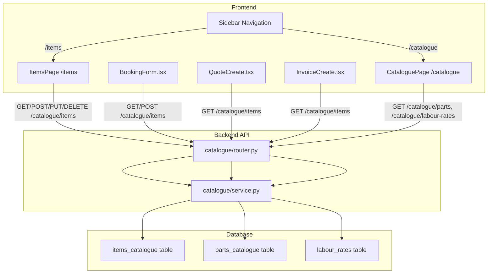

# Design Document: Universal Items Catalogue

## Overview

This design transforms the existing garage-specific `service_catalogue` table and API into a universal "Items" concept. The approach is evolutionary — we rename the table, remove the hardcoded category CHECK constraint, update the backend model/schemas/service/router, update all frontend consumers (BookingForm, QuoteCreate, InvoiceCreate), and add a dedicated Zoho-style Items management page at `/items`.

The existing `/catalogue` route remains for Parts and Labour Rates. Legacy `/api/v1/catalogue/services` endpoints are preserved as thin proxies for backward compatibility.

## Architecture



The key change is that `ServiceCatalogue` becomes `ItemsCatalogue` at every layer: DB table, SQLAlchemy model, Pydantic schemas, service functions, router endpoints, and all frontend components. The `category` column becomes a free-text `String(100)` with no CHECK constraint.

## Components and Interfaces

### 1. Alembic Migration (New)

**File**: `alembic/versions/2026_03_11_1100-0082_universal_items_catalogue.py`

Renames the table and removes the CHECK constraint:

```python
def upgrade():
    # Remove the hardcoded category CHECK constraint
    op.drop_constraint("ck_service_catalogue_category", "service_catalogue", type_="check")

    # Rename table
    op.rename_table("service_catalogue", "items_catalogue")

    # Update the FK on bookings table that references service_catalogue
    op.drop_constraint(
        "bookings_service_catalogue_id_fkey", "bookings", type_="foreignkey"
    )
    op.create_foreign_key(
        "bookings_service_catalogue_id_fkey",
        "bookings", "items_catalogue",
        ["service_catalogue_id"], ["id"],
    )

def downgrade():
    op.drop_constraint(
        "bookings_service_catalogue_id_fkey", "bookings", type_="foreignkey"
    )
    op.create_foreign_key(
        "bookings_service_catalogue_id_fkey",
        "bookings", "service_catalogue",
        ["service_catalogue_id"], ["id"],
    )
    op.rename_table("items_catalogue", "service_catalogue")
    op.create_check_constraint(
        "ck_service_catalogue_category",
        "service_catalogue",
        "category IN ('warrant','service','repair','diagnostic')",
    )
```

This preserves all existing data rows. The FK from `bookings.service_catalogue_id` is updated to point to the renamed table.

### 2. SQLAlchemy Model Update

**File**: `app/modules/catalogue/models.py`

Rename `ServiceCatalogue` to `ItemsCatalogue`, update `__tablename__` to `"items_catalogue"`, and remove the CHECK constraint from `__table_args__`:

```python
class ItemsCatalogue(Base):
    """Organisation-scoped items catalogue entry."""

    __tablename__ = "items_catalogue"

    id: Mapped[uuid.UUID] = mapped_column(UUID(as_uuid=True), primary_key=True, default=uuid.uuid4, server_default=func.gen_random_uuid())
    org_id: Mapped[uuid.UUID] = mapped_column(UUID(as_uuid=True), ForeignKey("organisations.id"), nullable=False)
    name: Mapped[str] = mapped_column(String(255), nullable=False)
    description: Mapped[str | None] = mapped_column(Text, nullable=True)
    default_price: Mapped[Decimal] = mapped_column(Numeric(10, 2), nullable=False)
    is_gst_exempt: Mapped[bool] = mapped_column(Boolean, nullable=False, server_default="false")
    category: Mapped[str | None] = mapped_column(String(100), nullable=True)
    is_active: Mapped[bool] = mapped_column(Boolean, nullable=False, server_default="true")
    created_at: Mapped[datetime] = mapped_column(DateTime(timezone=True), nullable=False, server_default=func.now())
    updated_at: Mapped[datetime] = mapped_column(DateTime(timezone=True), nullable=False, server_default=func.now(), onupdate=func.now())

    organisation = relationship("Organisation", backref="items_catalogue_entries")
```

Key changes:
- Class name: `ServiceCatalogue` → `ItemsCatalogue`
- Table name: `service_catalogue` → `items_catalogue`
- `category`: `String(50), nullable=False` → `String(100), nullable=True`
- Removed `__table_args__` with CHECK constraint
- Backref: `service_catalogue_items` → `items_catalogue_entries`

### 3. Pydantic Schema Updates

**File**: `app/modules/catalogue/schemas.py`

New/updated schemas for Items:

```python
class ItemCreateRequest(BaseModel):
    name: str = Field(..., min_length=1, max_length=255)
    description: Optional[str] = Field(None, max_length=5000)
    default_price: str = Field(..., description="Price as decimal string")
    is_gst_exempt: bool = Field(False)
    category: Optional[str] = Field(None, max_length=100)
    is_active: bool = Field(True)

class ItemUpdateRequest(BaseModel):
    name: Optional[str] = Field(None, min_length=1, max_length=255)
    description: Optional[str] = Field(None, max_length=5000)
    default_price: Optional[str] = Field(None)
    is_gst_exempt: Optional[bool] = Field(None)
    category: Optional[str] = Field(None, max_length=100)
    is_active: Optional[bool] = Field(None)

class ItemResponse(BaseModel):
    id: str
    name: str
    description: Optional[str] = None
    default_price: str
    is_gst_exempt: bool = False
    category: Optional[str] = None
    is_active: bool = True
    created_at: str
    updated_at: str

class ItemListResponse(BaseModel):
    items: list[ItemResponse] = Field(default_factory=list)
    total: int = Field(0)

class ItemCreateResponse(BaseModel):
    message: str
    item: ItemResponse

class ItemUpdateResponse(BaseModel):
    message: str
    item: ItemResponse
```

Key changes from `Service*` schemas:
- `category` field: `Literal["warrant", "service", "repair", "diagnostic"]` → `Optional[str]` with `max_length=100`
- Response list key: `services` → `items`
- All class names: `Service*` → `Item*`

The old `Service*` schemas are kept temporarily for backward-compatible legacy endpoints.

### 4. Service Layer Updates

**File**: `app/modules/catalogue/service.py`

Rename functions and remove hardcoded category validation:

| Old Function | New Function |
|---|---|
| `_service_to_dict(service)` | `_item_to_dict(item)` |
| `list_services(...)` | `list_items(...)` — adds `search` parameter for name filtering |
| `create_service(...)` | `create_item(...)` — removes `valid_categories` check, accepts any string or None |
| `update_service(...)` | `update_item(...)` — removes `valid_categories` check |
| `get_service(...)` | `get_item(...)` |

The `list_items` function gains a `search` parameter:

```python
async def list_items(
    db: AsyncSession,
    *,
    org_id: uuid.UUID,
    active_only: bool = False,
    category: str | None = None,
    search: str | None = None,
    limit: int = 100,
    offset: int = 0,
) -> dict:
    filters = [ItemsCatalogue.org_id == org_id]
    if active_only:
        filters.append(ItemsCatalogue.is_active.is_(True))
    if category:
        filters.append(ItemsCatalogue.category == category)
    if search:
        filters.append(ItemsCatalogue.name.ilike(f"%{search}%"))
    # ... count + paginated query ...
    return {"items": [...], "total": total}
```

The `create_item` function no longer validates category against a fixed set:

```python
async def create_item(
    db: AsyncSession,
    *,
    org_id: uuid.UUID,
    user_id: uuid.UUID,
    name: str,
    default_price: str,
    category: str | None = None,
    description: str | None = None,
    is_gst_exempt: bool = False,
    is_active: bool = True,
    ip_address: str | None = None,
) -> dict:
    # Validate price (same as before)
    # No category validation — any string or None accepted
    item = ItemsCatalogue(org_id=org_id, name=name, ...)
    db.add(item)
    await db.flush()
    await db.refresh(item)
    # Audit log with action="catalogue.item.created"
    return _item_to_dict(item)
```

### 5. Router Updates

**File**: `app/modules/catalogue/router.py`

New endpoints alongside legacy proxies:

| Endpoint | Method | Description |
|---|---|---|
| `/catalogue/items` | GET | List items with `active_only`, `category`, `search`, `limit`, `offset` |
| `/catalogue/items` | POST | Create item |
| `/catalogue/items/{id}` | PUT | Update item |
| `/catalogue/items/{id}` | DELETE | Soft-delete (set `is_active=false`) |
| `/catalogue/services` | GET | Legacy proxy → `list_items()` |
| `/catalogue/services` | POST | Legacy proxy → `create_item()` |
| `/catalogue/services/{id}` | PUT | Legacy proxy → `update_item()` |

The legacy `/services` endpoints call the same `list_items`/`create_item`/`update_item` functions but return responses using the old `ServiceListResponse`/`ServiceCreateResponse` schemas for backward compatibility.

The new DELETE endpoint is a soft-delete:

```python
@router.delete("/items/{item_id}", status_code=200)
async def delete_item_endpoint(item_id: str, request: Request, db: AsyncSession = Depends(get_db_session)):
    # Calls update_item with is_active=False
    # Returns {"message": "Item deactivated", "item": ItemResponse}
```

### 6. Frontend: Items Management Page (New)

**File**: `frontend/src/pages/items/ItemsPage.tsx`

A Zoho-style full CRUD page with:

- Table columns: Name, Category, Price, GST Exempt, Status (Active/Inactive)
- Search input above the table for real-time name filtering
- "New Item" button opens a slide-over/modal form
- Clicking a row opens the edit form pre-populated
- Active/Inactive toggle directly in the table row
- Pagination controls at the bottom
- Success/error toast notifications

The page fetches from `GET /api/v1/catalogue/items` and creates/updates via `POST/PUT /api/v1/catalogue/items`.

Form fields for create/edit:
- Name (required, text input)
- Description (optional, textarea)
- Default Price (required, number input)
- Category (optional, free-text input)
- GST Exempt (toggle)
- Active (toggle, edit only)

### 7. Frontend: Sidebar Navigation Update

**File**: `frontend/src/layouts/OrgLayout.tsx`

Add an "Items" entry to `navItems` before the existing "Catalogue" entry:

```typescript
{ to: '/items', label: 'Items', icon: CatalogueIcon, module: 'catalogue' },
```

The existing `{ to: '/catalogue', ... }` entry remains for Parts and Labour Rates.

### 8. Frontend: BookingForm Updates

**File**: `frontend/src/pages/bookings/BookingForm.tsx`

Changes:
1. Label: "Service Type" → "Item"
2. Placeholder: "Search services…" → "Search items…"
3. API call: `GET /catalogue/services` → `GET /catalogue/items`
4. Inline creation API: `POST /catalogue/services` → `POST /catalogue/items`
5. Remove the `<Select>` dropdown for category in the inline form — replace with a free-text `<Input>` for category (optional)
6. "Add new service" → "Add new item"
7. Inline form heading: "New Service" → "New Item"
8. Variable names: `serviceSearch` → `itemSearch`, `serviceResults` → `itemResults`, etc. (internal refactor)

### 9. Frontend: QuoteCreate and InvoiceCreate Updates

**Files**: `frontend/src/pages/quotes/QuoteCreate.tsx`, `frontend/src/pages/invoices/InvoiceCreate.tsx`

Change the API call from `/catalogue/services` to `/catalogue/items`:

```typescript
// Before
apiClient.get('/catalogue/services', { params: { active: true } })

// After
apiClient.get('/catalogue/items', { params: { active_only: true } })
```

The `CatalogueItem` interface remains the same — it already has the right shape. The response parsing changes from `data.services` to `data.items`.

### 10. Frontend: Route Registration

**File**: `frontend/src/App.tsx` (or routes file)

Add the `/items` route pointing to `ItemsPage`:

```tsx
<Route path="/items" element={<ItemsPage />} />
```

## Data Models

### items_catalogue Table (Renamed from service_catalogue)

| Column | Type | Nullable | Default | Description |
|--------|------|----------|---------|-------------|
| `id` | `UUID` | No | `gen_random_uuid()` | Primary key |
| `org_id` | `UUID` | No | — | FK → `organisations.id` |
| `name` | `String(255)` | No | — | Item name |
| `description` | `Text` | Yes | `NULL` | Item description |
| `default_price` | `Numeric(10,2)` | No | — | Default price ex-GST |
| `is_gst_exempt` | `Boolean` | No | `false` | GST exemption flag |
| `category` | `String(100)` | Yes | `NULL` | Free-text category (no constraint) |
| `is_active` | `Boolean` | No | `true` | Active/inactive status |
| `created_at` | `DateTime(tz)` | No | `now()` | Creation timestamp |
| `updated_at` | `DateTime(tz)` | No | `now()` | Last update timestamp |

Changes from `service_catalogue`:
- Table name: `service_catalogue` → `items_catalogue`
- `category`: `String(50) NOT NULL` with CHECK → `String(100) NULL` without CHECK

### Existing Models (Unchanged)

- `PartsCatalogue` — `parts_catalogue` table
- `LabourRate` — `labour_rates` table
- `Booking` — `bookings` table (the `service_catalogue_id` FK now points to `items_catalogue`)

## Correctness Properties

### Property 1: Table rename preserves all data

*For any* set of existing rows in the `service_catalogue` table before migration, after the migration is applied, the `items_catalogue` table shall contain the same number of rows with identical column values for all columns.

**Validates: Requirement 1.1, 1.3**

### Property 2: Category accepts any string or null

*For any* non-empty string of length ≤ 100 provided as the `category` value when creating an Item, the Items API shall accept and persist the value. *For any* create request with no category value, the Items API shall accept the Item with a null category.

**Validates: Requirement 1.4, 1.5**

### Property 3: Search filters by name case-insensitively

*For any* search query string `q` and any Item with name `n`, the Item shall appear in the list results if and only if `q.lower()` is a substring of `n.lower()`.

**Validates: Requirement 2.5**

### Property 4: Legacy endpoints return equivalent data

*For any* request to `GET /api/v1/catalogue/services`, the response shall contain the same Item data as an equivalent request to `GET /api/v1/catalogue/items`, with the response key being `services` instead of `items`.

**Validates: Requirement 2.6, 2.7**

### Property 5: Soft-delete sets is_active to false

*For any* DELETE request to `/api/v1/catalogue/items/{id}` where the Item exists and belongs to the authenticated organisation, the Item's `is_active` field shall be set to `false` and the Item shall still be retrievable via the list endpoint with `active_only=false`.

**Validates: Requirement 2.4**

### Property 6: Negative price rejected

*For any* create or update request where `default_price` parses to a negative decimal value, the Items API shall return a 400 status code.

**Validates: Requirement 2.8**

### Property 7: Cross-org access denied

*For any* update or delete request where the Item ID belongs to a different organisation than the authenticated user's organisation, the Items API shall return a 404 status code.

**Validates: Requirement 2.9**

### Property 8: Items page displays all table columns

*For any* Item returned by the list API, the Items page table shall display the Item's name, category (or empty if null), formatted price, GST exempt status, and active/inactive status.

**Validates: Requirement 3.2**

### Property 9: BookingForm uses Items API

*For any* search query entered in the BookingForm item typeahead, the component shall call `GET /api/v1/catalogue/items` with `active_only=true`. *For any* inline item creation, the component shall call `POST /api/v1/catalogue/items`.

**Validates: Requirement 5.4, 5.5**

### Property 10: Schema round-trip preservation

*For any* valid Item object, serialising to a response dict via `_item_to_dict()` and then constructing an `ItemResponse` Pydantic model shall produce an equivalent representation with all field values preserved.

**Validates: Requirement 7.6**

## Error Handling

### Backend

| Scenario | Handling |
|----------|----------|
| Create/update with invalid price format | Return 400: "Invalid price format" |
| Create/update with negative price | Return 400: "Price cannot be negative" |
| Update/delete item not found or wrong org | Return 404: "Item not found" |
| Legacy `/services` endpoint with new free-text category | Accepted — legacy endpoints proxy to the same `create_item` function |
| Migration applied to DB without `service_catalogue` table | Migration fails — requires the table to exist (standard Alembic behavior) |

### Frontend

| Scenario | Handling |
|----------|----------|
| Items list API fails | Display error message, show empty table |
| Item create/update fails (validation) | Display API error message in the form |
| Item create/update fails (network) | Display generic "Failed to save item" error |
| BookingForm item search fails | Silently clear results, show empty dropdown (existing pattern) |
| BookingForm inline item creation fails | Display error inline below the form (existing pattern) |

## Testing Strategy

### Property-Based Tests

Use `hypothesis` with `max_examples=20` for backend and `fast-check` with `numRuns: 20` for frontend.

**Backend property tests** (in `tests/test_items_catalogue_property.py`):

| Test | Property | Tag |
|------|----------|-----|
| Category accepts any string or null | Property 2 | `Feature: universal-items-catalogue, Property 2: Category accepts any string or null` |
| Search filters by name case-insensitively | Property 3 | `Feature: universal-items-catalogue, Property 3: Search filters by name case-insensitively` |
| Legacy endpoints return equivalent data | Property 4 | `Feature: universal-items-catalogue, Property 4: Legacy endpoints return equivalent data` |
| Soft-delete sets is_active to false | Property 5 | `Feature: universal-items-catalogue, Property 5: Soft-delete sets is_active to false` |
| Negative price rejected | Property 6 | `Feature: universal-items-catalogue, Property 6: Negative price rejected` |
| Cross-org access denied | Property 7 | `Feature: universal-items-catalogue, Property 7: Cross-org access denied` |
| Schema round-trip preservation | Property 10 | `Feature: universal-items-catalogue, Property 10: Schema round-trip preservation` |

**Frontend property tests** (in `frontend/src/__tests__/items-catalogue.property.test.tsx`):

| Test | Property | Tag |
|------|----------|-----|
| Items page displays all table columns | Property 8 | `Feature: universal-items-catalogue, Property 8: Items page displays all table columns` |
| BookingForm uses Items API | Property 9 | `Feature: universal-items-catalogue, Property 9: BookingForm uses Items API` |
