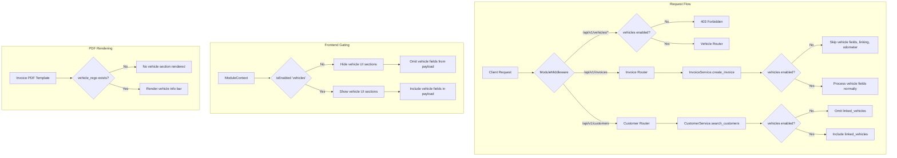

# Design Document: Vehicle Module Gating

## Overview

This design gates all vehicle/CarJam functionality behind the `vehicles` module slug in OraInvoice's existing module system. The approach leverages three existing gating mechanisms:

1. **Module Middleware** (`app/middleware/modules.py`): Intercepts API requests and returns 403 for disabled modules based on URL prefix mapping. Currently only maps `/api/v2/` paths.
2. **ModuleService** (`app/core/modules.py`): Backend service with `is_enabled(org_id, slug)` for programmatic checks with Redis caching.
3. **Frontend ModuleGate/useModules** (`ModuleGate.tsx`, `ModuleContext.tsx`): React component and hook that conditionally render UI based on module enablement.

The vehicle router is mounted at `/api/v1/vehicles` (not `/api/v2/`), so we use a dual approach: add the v1 path to `MODULE_ENDPOINT_MAP` for automatic middleware gating, and add explicit `ModuleService.is_enabled()` checks in the invoice and customer services where vehicle logic is interleaved with non-vehicle logic.

On the frontend, existing `<ModuleGate module="vehicles">` wrappers and `isEnabled('vehicles')` checks hide vehicle UI sections and prevent unnecessary API calls.

The Alembic migration registers the `vehicles` slug in `module_registry` using the established `INSERT ... ON CONFLICT DO NOTHING` pattern for idempotency.

## Architecture



## Components and Interfaces

### 1. Alembic Migration (New)

**File**: `alembic/versions/2026_03_11_0900-0076_register_vehicles_module.py`

Inserts a single row into `module_registry`:

```python
op.execute("""
    INSERT INTO module_registry (
        id, slug, display_name, description, category,
        is_core, dependencies, status, created_at
    ) VALUES (
        gen_random_uuid(),
        'vehicles',
        'Vehicles',
        'Vehicle database, CarJam lookups, vehicle search, odometer tracking, and vehicle info on invoices.',
        'automotive',
        false,
        '[]'::jsonb,
        'available',
        now()
    )
    ON CONFLICT ON CONSTRAINT uq_module_registry_slug DO NOTHING
""")
```

Follows the exact pattern from migration `0068`.

### 2. Module Middleware Update

**File**: `app/middleware/modules.py`

Add the v1 vehicles path to `MODULE_ENDPOINT_MAP`:

```python
MODULE_ENDPOINT_MAP: dict[str, str] = {
    # ... existing entries ...
    "/api/v1/vehicles": "vehicles",   # v1 vehicle endpoints
}
```

This gives automatic 403 gating for all `/api/v1/vehicles/*` endpoints without modifying the vehicle router itself. The middleware already handles the 403 response with the message format `"Module 'vehicles' is not enabled for your organisation."`.

### 3. Invoice Service Modification

**File**: `app/modules/invoices/service.py` — `create_invoice()`

Add a module check early in the function. When disabled, null out all vehicle parameters before they're used:

```python
from app.core.modules import ModuleService

module_svc = ModuleService(db)
vehicles_enabled = await module_svc.is_enabled(str(org_id), "vehicles")

if not vehicles_enabled:
    vehicle_rego = None
    vehicle_make = None
    vehicle_model = None
    vehicle_year = None
    vehicle_odometer = None
    global_vehicle_id = None
```

This approach is minimal — the rest of the function naturally skips vehicle processing because:
- The invoice record stores `NULL` for all vehicle fields
- The `if global_vehicle_id:` guard skips customer-vehicle auto-linking
- The `if vehicle_odometer and ... and global_vehicle_id:` guard skips odometer recording

### 4. Customer Service Modification

**File**: `app/modules/customers/service.py` — `search_customers()`

Add a module check that overrides `include_vehicles` to `False` when the module is disabled:

```python
from app.core.modules import ModuleService

module_svc = ModuleService(db)
if not await module_svc.is_enabled(str(org_id), "vehicles"):
    include_vehicles = False
```

This prevents the linked_vehicles query and ensures no vehicle data leaks in customer search results.

### 5. PDF Template Updates

**Files**: `app/templates/pdf/invoice.html`, `app/templates/pdf/invoice_share.html`

Both templates already have the correct conditional:
```jinja2


  <!-- vehicle bar -->

```

When the vehicles module is disabled and `create_invoice` stores `NULL` for vehicle fields, `invoice.vehicle_rego` will be falsy and the vehicle section naturally won't render. No template changes are needed — the backend gating in the invoice service is sufficient.

### 6. Frontend: InvoiceCreate Gating

**File**: `frontend/src/pages/invoices/InvoiceCreate.tsx`

Wrap the vehicle search section with `<ModuleGate module="vehicles">`:

```tsx
import { ModuleGate } from '@/components/common/ModuleGate'

{/* Vehicle Search — only shown when vehicles module is enabled */}
<ModuleGate module="vehicles">
  <div className="space-y-2">
    <label className="text-sm font-medium text-gray-700">Vehicles</label>
    {/* ... vehicle cards, VehicleLiveSearch, odometer inputs ... */}
  </div>
</ModuleGate>
```

Also gate the `buildPayload` function to omit vehicle fields:

```tsx
const { isEnabled } = useModules()
const vehiclesEnabled = isEnabled('vehicles')

const buildPayload = (status: 'draft' | 'sent') => ({
    customer_id: customer?.id,
    // Only include vehicle fields when module is enabled
    ...(vehiclesEnabled ? {
        vehicle_rego: vehicles[0]?.rego,
        vehicle_make: vehicles[0]?.make,
        vehicle_model: vehicles[0]?.model,
        vehicle_year: vehicles[0]?.year,
        vehicle_odometer: vehicles[0]?.newOdometer ?? vehicles[0]?.odometer ?? undefined,
        global_vehicle_id: vehicles[0]?.id,
        vehicles: vehicles.map(v => ({ ... })),
    } : {}),
    // ... rest of payload
})
```

Also gate the `onVehicleAutoSelect` callback in `CustomerSearch` to be a no-op when disabled.

### 7. Frontend: InvoiceList Gating

**File**: `frontend/src/pages/invoices/InvoiceList.tsx`

Wrap the vehicle info card (around line 1026) with `<ModuleGate>`:

```tsx
<ModuleGate module="vehicles">
  {(invoice.vehicle || invoice.vehicle_rego) && (
    <div className="relative z-10 px-8 pb-4">
      {/* ... vehicle info card ... */}
    </div>
  )}
</ModuleGate>
```

### 8. Frontend: InvoiceDetail Gating

**File**: `frontend/src/pages/invoices/InvoiceDetail.tsx`

Wrap the vehicle section (around line 482) with `<ModuleGate>`:

```tsx
<ModuleGate module="vehicles">
  <section className="rounded-lg border border-gray-200 p-4">
    <h2 className="text-sm font-medium text-gray-500 uppercase tracking-wider mb-2">Vehicle</h2>
    {/* ... vehicle display ... */}
  </section>
</ModuleGate>
```

### 9. Frontend: VehicleLiveSearch Guard

**File**: `frontend/src/components/vehicles/VehicleLiveSearch.tsx`

The component is already wrapped by `<ModuleGate>` in InvoiceCreate, so it won't render when disabled. No changes needed to the component itself — the parent gate prevents it from mounting, which prevents any API calls.

### 10. Frontend: Customer Search Vehicle Inclusion

When the vehicles module is disabled, the customer search component should not pass `include_vehicles=true` to the API. This is handled by checking `isEnabled('vehicles')` before adding the query parameter.

## Data Models

### Module Registry Row (New)

| Column | Value |
|--------|-------|
| `id` | Auto-generated UUID |
| `slug` | `vehicles` |
| `display_name` | `Vehicles` |
| `description` | Vehicle database, CarJam lookups, vehicle search, odometer tracking, and vehicle info on invoices. |
| `category` | `automotive` |
| `is_core` | `false` |
| `dependencies` | `[]` (empty JSON array) |
| `status` | `available` |

### Existing Models (Unchanged)

No schema changes are required. The gating operates on existing tables:

- **`module_registry`**: Stores the new `vehicles` row
- **`org_modules`**: Existing table tracks per-org enablement (no changes)
- **`invoices`**: Vehicle fields (`vehicle_rego`, `vehicle_make`, `vehicle_model`, `vehicle_year`, `vehicle_odometer`) remain nullable — they simply store `NULL` when the module is disabled
- **`customer_vehicles`**: Existing linking table — no new links created when module is disabled
- **`odometer_readings`**: Existing table — no new readings recorded when module is disabled


## Correctness Properties

*A property is a characteristic or behavior that should hold true across all valid executions of a system — essentially, a formal statement about what the system should do. Properties serve as the bridge between human-readable specifications and machine-verifiable correctness guarantees.*

### Property 1: Migration idempotency

*For any* number of executions N ≥ 1 of the vehicles module migration, the `module_registry` table should contain exactly one row with slug `vehicles`, and that row should have `display_name = 'Vehicles'`, `category = 'automotive'`, `is_core = false`, `dependencies = []`, and `status = 'available'`.

**Validates: Requirements 1.1, 1.2**

### Property 2: Vehicle path resolution completeness

*For any* known vehicle endpoint path (lookup, lookup-with-fallback, search, manual entry, link, refresh, vehicle profile, odometer recording, odometer history, odometer update), the module middleware's `_resolve_module()` function should return `'vehicles'` as the module slug.

**Validates: Requirements 2.1, 2.4**

### Property 3: Vehicle endpoint access gating

*For any* organisation ID and any vehicle endpoint path, the middleware should return HTTP 403 if and only if the `vehicles` module is not enabled for that organisation. When the module is enabled, the request should pass through to the router.

**Validates: Requirements 2.2, 2.3**

### Property 4: Invoice creation vehicle field gating

*For any* invoice creation request with arbitrary vehicle parameters (`vehicle_rego`, `vehicle_make`, `vehicle_model`, `vehicle_year`, `vehicle_odometer`, `global_vehicle_id`), when the `vehicles` module is disabled for the organisation, the resulting invoice record should have `NULL` for all six vehicle fields, no `CustomerVehicle` link should be created, and no `OdometerReading` should be recorded. When the module is enabled, the vehicle fields should be stored as provided.

**Validates: Requirements 3.1, 3.2, 3.3, 3.4**

### Property 5: Customer search linked_vehicles gating

*For any* customer search request with `include_vehicles=true`, when the `vehicles` module is disabled for the organisation, the search results should not contain `linked_vehicles` data (either omitted or empty array). When the module is enabled, `linked_vehicles` data should be present for customers that have linked vehicles.

**Validates: Requirements 6.1, 6.2**

### Property 6: PDF template vehicle section conditional rendering

*For any* invoice record where `vehicle_rego` is `NULL` or empty, the rendered HTML output of both `invoice.html` and `invoice_share.html` templates should not contain the vehicle info bar markup (no element with class `vehicle-bar`). *For any* invoice record where `vehicle_rego` is non-empty, the rendered HTML should contain the vehicle info bar.

**Validates: Requirements 7.1, 7.2, 7.3**

### Property 7: Frontend vehicle UI visibility

*For any* organisation where the `vehicles` module is disabled, the InvoiceCreate, InvoiceList, and InvoiceDetail pages should not render vehicle-related UI sections (VehicleLiveSearch, vehicle cards, vehicle info card, vehicle detail section). When the module is enabled, these sections should render.

**Validates: Requirements 4.1, 4.2, 5.1, 5.2, 5.3**

### Property 8: Frontend payload omits vehicle fields when disabled

*For any* invoice form submission when the `vehicles` module is disabled, the API payload should not contain the keys `vehicle_rego`, `vehicle_make`, `vehicle_model`, `vehicle_year`, `vehicle_odometer`, `global_vehicle_id`, or `vehicles`.

**Validates: Requirements 4.3**

### Property 9: Customer search API omits vehicle inclusion when disabled

*For any* customer search API call made from the frontend when the `vehicles` module is disabled, the request should not include the `include_vehicles=true` query parameter.

**Validates: Requirements 8.3**

## Error Handling

### Backend

| Scenario | Handling |
|----------|----------|
| Vehicle endpoint called with module disabled | Middleware returns 403 with `{"detail": "Module 'vehicles' is not enabled for your organisation.", "module": "vehicles"}` |
| Invoice creation with vehicle data and module disabled | Vehicle fields silently nulled; no error returned. Invoice created successfully without vehicle data. |
| Customer search with `include_vehicles=true` and module disabled | `include_vehicles` silently overridden to `false`; no error returned. Search results returned without vehicle data. |
| Redis cache failure during module check | ModuleService falls back to database query (existing behavior). Middleware fails open — request proceeds if check itself errors. |
| Migration re-run on existing database | `ON CONFLICT DO NOTHING` ensures no duplicate rows or errors. |

### Frontend

| Scenario | Handling |
|----------|----------|
| ModuleContext fails to load modules | `useModules()` outside provider returns `isEnabled: () => true` (fail-open default). Vehicle UI would show, but backend gating still protects. |
| Vehicle API call made despite frontend gate | Backend middleware returns 403. Frontend should handle 403 gracefully (existing error handling). |

## Testing Strategy

### Unit Tests

Unit tests cover specific examples and edge cases:

- Migration creates the expected row with correct field values
- `CORE_MODULES` set does not contain `'vehicles'`
- `_resolve_module('/api/v1/vehicles/lookup')` returns `'vehicles'`
- `_resolve_module('/api/v1/invoices')` returns `None` (not gated as vehicles)
- Invoice creation with module disabled stores NULL vehicle fields (specific example with known input)
- Customer search with module disabled returns empty `linked_vehicles`
- PDF template renders without vehicle bar when `vehicle_rego` is None
- PDF template renders with vehicle bar when `vehicle_rego` is set
- `ModuleGate` component renders children when module enabled
- `ModuleGate` component renders fallback when module disabled
- `buildPayload` omits vehicle keys when `vehiclesEnabled` is false

### Property-Based Tests

Property-based tests verify universal properties across generated inputs. Use `hypothesis` (Python) for backend and `fast-check` (TypeScript) for frontend.

Each property test must:
- Run a minimum of 100 iterations
- Reference its design document property with a tag comment
- Use a single property-based test per correctness property

**Backend property tests** (using `hypothesis`):

| Test | Property | Tag |
|------|----------|-----|
| Migration idempotency | Property 1 | `Feature: vehicle-module-gating, Property 1: Migration idempotency` |
| Vehicle path resolution | Property 2 | `Feature: vehicle-module-gating, Property 2: Vehicle path resolution completeness` |
| Vehicle endpoint gating | Property 3 | `Feature: vehicle-module-gating, Property 3: Vehicle endpoint access gating` |
| Invoice creation gating | Property 4 | `Feature: vehicle-module-gating, Property 4: Invoice creation vehicle field gating` |
| Customer search gating | Property 5 | `Feature: vehicle-module-gating, Property 5: Customer search linked_vehicles gating` |
| PDF conditional rendering | Property 6 | `Feature: vehicle-module-gating, Property 6: PDF template vehicle section conditional rendering` |

**Frontend property tests** (using `fast-check`):

| Test | Property | Tag |
|------|----------|-----|
| Vehicle UI visibility | Property 7 | `Feature: vehicle-module-gating, Property 7: Frontend vehicle UI visibility` |
| Payload field omission | Property 8 | `Feature: vehicle-module-gating, Property 8: Frontend payload omits vehicle fields when disabled` |
| Customer search param | Property 9 | `Feature: vehicle-module-gating, Property 9: Customer search API omits vehicle inclusion when disabled` |
