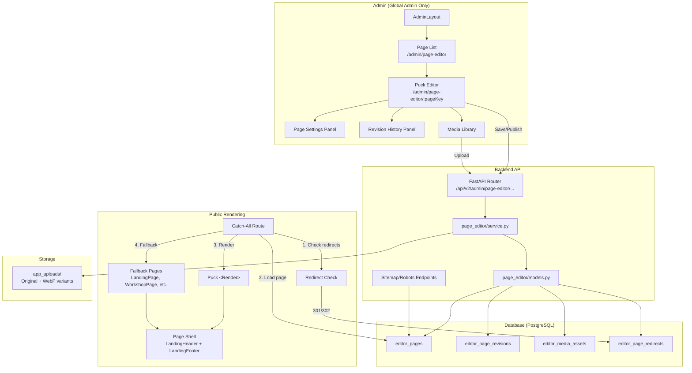

# Design Document: Visual Page Editor (Puck Integration)

## Overview

This feature integrates **Puck** (`@puckeditor/core`) as the visual page editor for OraInvoice's public marketing pages. Rather than building a custom drag-and-drop editor, we leverage Puck's editor UI, component picker, field configuration panels, viewport controls, and structured JSON data model.

**What we build:**
- 18 custom Puck component configs with Tailwind-based render functions
- Backend module (`app/modules/page_editor/`) for content storage, revisions, media, and redirects
- Admin UI wrapping Puck in `AdminLayout` with page list, create/delete flows
- Draft/Publish workflow with revision history (50 revisions per page)
- Public rendering via Puck's `<Render>` inside the existing page shell
- Dynamic sitemap.xml and robots.txt generation
- Slug management with automatic 301 redirects on rename
- Media upload with WebP variant generation
- Page registry syncing hand-coded pages to the editor

**Architecture Decision:** Puck owns the editor UX and JSON data model. We own storage, access control, SEO, media, and the public rendering shell. This keeps the integration surface small (~1 week) and avoids reinventing drag-and-drop.

## Architecture



**Request Flow — Public Page:**
1. Visitor hits `/workshop` → nginx `try_files` → SPA loads → React Router catch-all
2. Catch-all component calls `GET /api/v2/public/pages/resolve?slug=/workshop`
3. Backend checks `editor_page_redirects` → if match, returns redirect response
4. Backend checks `editor_pages` → if found with `published_content`, returns page data
5. Frontend renders via `<Render config={puckConfig} data={publishedData} />`
6. If no `published_content` and `page_origin = hand-coded` → render Fallback_Page
7. If no match → 404

**Request Flow — Admin Editor:**
1. Global Admin navigates to `/admin/page-editor/:pageKey`
2. Frontend loads `draft_content` via `GET /api/v2/admin/page-editor/pages/:pageKey`
3. Puck editor renders with `<Puck config={puckConfig} data={draftContent} />`
4. Save Draft → `PUT /api/v2/admin/page-editor/pages/:pageKey/draft`
5. Publish → `POST /api/v2/admin/page-editor/pages/:pageKey/publish`

## Components and Interfaces

### Backend Module Structure

```
app/modules/page_editor/
├── __init__.py
├── router.py          # FastAPI router (admin + public endpoints)
├── service.py         # Business logic (CRUD, publish, revisions, sitemap)
├── models.py          # SQLAlchemy ORM models
├── schemas.py         # Pydantic request/response schemas
├── sanitiser.py       # HTML sanitisation + href validation
└── media_service.py   # Upload, WebP generation, variant management
```

### Frontend Module Structure

```
frontend/src/admin/page-editor/
├── puckConfig.ts          # Puck component config (shared with public renderer)
├── templates.ts           # Page templates (blank, landing, workshop-style, etc.)
├── components/
│   ├── Hero.tsx
│   ├── FeatureGrid.tsx
│   ├── Section.tsx
│   ├── Columns.tsx
│   ├── Heading.tsx
│   ├── RichText.tsx
│   ├── ImageBlock.tsx
│   ├── VideoEmbed.tsx
│   ├── Button.tsx
│   ├── FAQAccordion.tsx
│   ├── PricingCard.tsx
│   ├── TestimonialCard.tsx
│   ├── CTABanner.tsx
│   ├── Spacer.tsx
│   ├── Divider.tsx
│   ├── Badge.tsx
│   ├── List.tsx
│   ├── DemoRequestForm.tsx
│   └── NZTrustSignals.tsx
├── fields/
│   └── MediaField.tsx     # Custom Puck field for Media Library
├── pages/
│   ├── PageEditorList.tsx
│   ├── PageEditorEdit.tsx
│   └── PageEditorRedirects.tsx
└── hooks/
    └── useAutoSave.ts
```

**Puck CSS Isolation:** Puck CSS (`puck.css`) is imported ONLY in `PageEditorEdit.tsx` (which is lazy-loaded via `React.lazy()`), ensuring it doesn't affect AdminLayout's sidebar, header, or other admin pages. This is critical because Puck's CSS includes global resets that would break our Tailwind-based admin UI if imported at the app level.

```

frontend/src/pages/public/
├── _registry.ts           # Hand-coded page registry
├── PublicPageRenderer.tsx  # Catch-all renderer (Puck <Render> + fallback)
├── LandingPage.tsx        # Existing (becomes Fallback_Page)
├── WorkshopPage.tsx       # Existing (becomes Fallback_Page)
├── TradesPage.tsx         # Existing (becomes Fallback_Page)
└── PrivacyPage.tsx        # Existing (becomes Fallback_Page)
```

### Frontend Component Breakdown

This section specifies every frontend component, panel, modal, toolbar, and integration point needed to implement the visual page editor feature without ambiguity.

#### Component Tree Overview

```
App.tsx
├── AdminLayout (RequireGlobalAdmin)
│   ├── PageEditorList.tsx (/admin/page-editor)
│   │   ├── CreatePageModal.tsx
│   │   ├── DeleteConfirmModal.tsx
│   │   └── RevertToFallbackModal.tsx
│   ├── PageEditorEdit.tsx (/admin/page-editor/:pageKey)
│   │   ├── EditorToolbar.tsx
│   │   ├── <Puck config={puckConfig} data={draftContent} />
│   │   ├── PageSettingsDrawer.tsx (slide-over, right)
│   │   ├── RevisionHistoryDrawer.tsx (slide-over, right)
│   │   ├── MediaLibraryModal.tsx
│   │   ├── ConcurrentEditBanner.tsx
│   │   ├── DraftConflictBanner.tsx
│   │   └── PublishConfirmModal.tsx
│   └── PageEditorRedirects.tsx (/admin/page-editor/redirects)
└── PublicPageRenderer.tsx (catch-all route: path="*")
    ├── PageShell (LandingHeader + LandingFooter)
    │   └── <Render config={puckConfig} data={publishedContent} />
    └── FallbackPage (LandingPage | WorkshopPage | TradesPage | PrivacyPage)
```

---

#### Gap A: Navigation Item Placement

**Location:** `frontend/src/layouts/AdminLayout.tsx` → `adminNavItems` array

Add a new "Content" section between the existing "Configuration" section and the "Monitoring" section:

```typescript
// In adminNavItems array, after the last Configuration item ({ to: '/admin/security', label: 'Security' }):
{ type: 'section', label: 'Content' },
{ to: '/admin/page-editor', label: 'Page Editor' },
// Then the existing: { type: 'section', label: 'Monitoring' },
```

**Resulting nav order:**
1. Core (Dashboard, Organisations, Branches, Users)
2. Configuration (Subscription Management, Trade Families, Feature Flags, Branding, Integrations, Settings, Security)
3. **Content (Page Editor)** ← NEW
4. Monitoring (Analytics, Reports, Audit Log, Error Log, Notifications)
5. Tools (Migration Tool, Live Migration, HA Replication)

---

#### Gap B: Route Registration

**File:** `frontend/src/App.tsx`

**Lazy imports** (add with existing lazy imports at top of file):

```typescript
const PageEditorList = React.lazy(() => import('@/admin/page-editor/pages/PageEditorList'))
const PageEditorEdit = React.lazy(() => import('@/admin/page-editor/pages/PageEditorEdit'))
const PageEditorRedirects = React.lazy(() => import('@/admin/page-editor/pages/PageEditorRedirects'))
const PublicPageRenderer = React.lazy(() => import('@/pages/public/PublicPageRenderer'))
```

**Admin route entries** (inside `<Route element={<RequireGlobalAdmin />}>` → `<Route path="/admin" element={<AdminLayout />}>`):

```typescript
<Route path="page-editor" element={<SafePage name="page-editor"><PageEditorList /></SafePage>} />
<Route path="page-editor/redirects" element={<SafePage name="page-editor-redirects"><PageEditorRedirects /></SafePage>} />
<Route path="page-editor/:pageKey" element={<SafePage name="page-editor-edit"><PageEditorEdit /></SafePage>} />
```

**Public catch-all route** (AFTER all explicit public routes, BEFORE the existing 404 fallback, outside any auth guard):

```typescript
{/* Editor-only public pages — catch-all MUST be last */}
<Route path="*" element={<SafePage name="public-page"><PublicPageRenderer /></SafePage>} />
```

**Route priority:** React Router uses score-based matching. Static paths (`/workshop`, `/trades`, `/privacy`) always beat the `*` wildcard, so existing hand-coded page routes are unaffected.

---

#### Gap C: Page Settings Panel (`PageSettingsDrawer.tsx`)

**Type:** Slide-over drawer (right side)
**Parent:** `PageEditorEdit.tsx`
**Trigger:** "Settings ⚙️" icon button in `EditorToolbar`
**Close:** X button or backdrop click

**Component structure:**

```
PageSettingsDrawer.tsx
├── Drawer backdrop (fixed inset-0, bg-black/30, onClick → close)
├── Drawer panel (fixed right-0, w-96, bg-white, overflow-y-auto)
│   ├── Header: "Page Settings" + X close button
│   ├── Form fields:
│   │   ├── Title (text input, 1–120 chars, required)
│   │   ├── Slug (text input — editable for editor-created, read-only for hand-coded with lock icon)
│   │   ├── Noindex toggle (switch: "Hide from search engines")
│   │   ├── --- Divider: "SEO" ---
│   │   ├── Meta Title (text input, max 120 chars, placeholder: "Defaults to page title")
│   │   ├── Meta Description (textarea, max 320 chars, character counter)
│   │   ├── Canonical URL (text input, must be https://)
│   │   ├── --- Divider: "Social" ---
│   │   ├── OG Image (text input or MediaField picker)
│   │   ├── OG Type (select: website, article, product)
│   │   ├── Twitter Card (select: summary, summary_large_image)
│   │   ├── --- Divider: "Structured Data" ---
│   │   └── JSON-LD (code textarea, monospace font, validated on blur — shows red border + error if invalid JSON)
│   ├── [Revert to Fallback] button (danger zone, only for hand-coded pages — see Gap I)
│   └── Footer: [Save Settings] primary button
└── (no unsaved-changes guard — settings save is explicit)
```

**API call on save:** `PUT /api/v2/admin/page-editor/pages/:pageKey/settings` with `PageSettingsRequest` body

**State management:** Local `useState` for form fields, initialised from `pageDetail.seo` + `pageDetail.page_slug` + `pageDetail.noindex` on drawer open.

---

#### Gap D: Revision History Panel (`RevisionHistoryDrawer.tsx`)

**Type:** Slide-over drawer (right side)
**Parent:** `PageEditorEdit.tsx`
**Trigger:** "History 🕐" icon button in `EditorToolbar`
**Close:** X button or backdrop click

**Component structure:**

```
RevisionHistoryDrawer.tsx
├── Drawer backdrop (fixed inset-0, bg-black/30, onClick → close)
├── Drawer panel (fixed right-0, w-96, bg-white, overflow-y-auto)
│   ├── Header: "Revision History" + X close button
│   ├── Scrollable list of revisions (newest first):
│   │   └── RevisionItem (for each revision):
│   │       ├── Version badge: "v{version}"
│   │       ├── Author email (text-sm, text-gray-600)
│   │       ├── Timestamp (relative: "2 hours ago" with full date tooltip)
│   │       ├── Note (if present, text-sm italic)
│   │       └── Actions row:
│   │           ├── [View] button → opens RevisionPreviewModal (read-only <Render> in a full-screen modal)
│   │           └── [Revert] button → copies revision content to draft_content, closes drawer, shows toast "Reverted to v{N}. Review and publish when ready."
│   └── Empty state: "No revisions yet. Publish the page to create the first revision."
└── RevisionPreviewModal (full-screen modal with <Render config={puckConfig} data={revision.content} />)
```

**API calls:**
- On open: `GET /api/v2/admin/page-editor/pages/:pageKey/revisions?limit=50&offset=0`
- On revert: `POST /api/v2/admin/page-editor/pages/:pageKey/revisions/:version/revert`

**After revert:** Close drawer, update editor's `draftContent` state with the response's `draft_content`, mark document as dirty.

---

#### Gap E: Media Library Browser (`MediaLibraryModal.tsx`)

**Type:** Modal (centered, large: max-w-4xl)
**Parent:** Triggered from `MediaField.tsx` (custom Puck field for Image components)
**Trigger:** "Browse Library" button inside the MediaField
**Close:** X button, backdrop click, or image selection

**Component structure:**

```
MediaLibraryModal.tsx
├── Modal backdrop (fixed inset-0, bg-black/50)
├── Modal panel (max-w-4xl, max-h-[80vh], flex flex-col)
│   ├── Header: "Media Library" + X close button
│   ├── Toolbar row:
│   │   ├── Search input (placeholder: "Search by filename...")
│   │   └── [Upload] button (opens file picker)
│   ├── Upload drop zone (dashed border, shows on drag-over entire modal)
│   │   └── "Drop image here or click Upload"
│   ├── Image grid (4 columns, gap-3, overflow-y-auto, flex-1):
│   │   └── MediaThumbnail (for each asset):
│   │       ├── Thumbnail image (aspect-square, object-cover, rounded)
│   │       ├── Filename (text-xs, truncate)
│   │       ├── Dimensions + size (text-xs, text-gray-500: "1920×1080 · 245 KB")
│   │       ├── Click → selects image, calls onChange(asset.id), closes modal
│   │       └── Delete button (trash icon, top-right corner on hover):
│   │           ├── If asset is referenced → shows error toast: "Cannot delete: used by {page_title}"
│   │           └── If not referenced → confirms and deletes
│   └── Footer: "Load more" button (or infinite scroll via IntersectionObserver)
│       └── Shows "{total} images" count
```

**API calls:**
- On open: `GET /api/v2/admin/page-editor/media?limit=50&offset=0`
- Search: `GET /api/v2/admin/page-editor/media?limit=50&offset=0&search={query}` (debounced 300ms)
- Upload: `POST /api/v2/admin/page-editor/media` (multipart/form-data)
- Delete: `DELETE /api/v2/admin/page-editor/media/:id`
- Load more: increment offset by 50

**Accepted formats:** image/jpeg, image/png, image/webp, image/svg+xml, image/gif (max 10 MB)

---

#### Gap F: Create New Page Dialog (`CreatePageModal.tsx`)

**Type:** Modal (centered, max-w-lg)
**Parent:** `PageEditorList.tsx`
**Trigger:** "New Page" button in the page list header
**Close:** X button, backdrop click (with unsaved-changes check if fields are dirty)

**Component structure:**

```
CreatePageModal.tsx
├── Modal backdrop
├── Modal panel (max-w-lg)
│   ├── Header: "Create New Page" + X close button
│   ├── Form:
│   │   ├── Title (text input, required, 1–120 chars)
│   │   │   └── onChange → auto-suggests slug (kebab-cased, ASCII-folded, prefixed with /)
│   │   ├── Slug (text input, required, validated on blur):
│   │   │   ├── Auto-populated from title but editable
│   │   │   ├── Validation: regex + length + reserved prefix check (client-side)
│   │   │   └── On blur: calls backend validation or shows inline error
│   │   ├── Template (radio cards with preview thumbnails):
│   │   │   ├── Blank Page (empty icon)
│   │   │   ├── Landing Page (hero + features layout thumbnail)
│   │   │   ├── Workshop Style (workshop layout thumbnail)
│   │   │   ├── Trades (trades layout thumbnail)
│   │   │   └── Privacy (text-heavy layout thumbnail)
│   │   ├── Meta Title (text input, optional, max 120 chars)
│   │   └── Meta Description (textarea, optional, max 320 chars)
│   ├── Error display:
│   │   ├── Inline red text below slug field for validation errors
│   │   └── Toast for server errors (409 slug conflict, 500 server error)
│   └── Footer: [Cancel] secondary + [Create Page] primary (shows spinner while submitting)
```

**Props:**

```typescript
interface CreatePageModalProps {
  isOpen: boolean
  onClose: () => void
  initialData?: {
    title: string
    slug: string
    content: dict | null  // For duplicate flow (Gap G)
  }
}
```

**API call on submit:** `POST /api/v2/admin/page-editor/pages` with `CreatePageRequest`
**On success:** Navigate to `/admin/page-editor/:newPageKey`, show toast "Page created. Not visible until published."

---

#### Gap G: Duplicate Page Flow

**Mechanism:** Reuses `CreatePageModal` with the `initialData` prop.

**Trigger:** "Duplicate" button in page list row actions (dropdown or inline button).

**Behaviour:**

1. User clicks "Duplicate" on a page row in `PageEditorList`
2. `CreatePageModal` opens with `initialData`:
   ```typescript
   initialData = {
     title: `${originalPage.title} (Copy)`,
     slug: `${originalPage.page_slug}-copy`,
     content: originalPage.draft_content ?? originalPage.published_content
   }
   ```
3. Title and slug fields are pre-filled but editable
4. Template selector is hidden (content comes from source page)
5. On submit: `POST /api/v2/admin/page-editor/pages` with the pre-filled content as `draft_content`
6. The new page is always `page_origin = editor-created` regardless of source page origin

**Note:** The backend `CreatePageRequest` needs an optional `content` field (or a separate `DuplicatePageRequest`) to accept pre-filled Puck_Data instead of template-derived content.

---

#### Gap H: Editor Toolbar (`EditorToolbar.tsx`)

**Type:** Custom component rendered above `<Puck>` in `PageEditorEdit.tsx`
**Layout:** `flex items-center justify-between border-b border-gray-200 px-4 py-2 bg-white`

**Component structure:**

```
EditorToolbar.tsx
├── Left side (flex items-center gap-3):
│   ├── Page title (text-lg font-semibold, display only — editable via Settings)
│   └── Publish state badge:
│       ├── "Never Published" (gray badge)
│       ├── "Published v{N}" (green badge) + "Last: {relative_time}"
│       └── "Draft Ahead" (amber badge)
├── Right side (flex items-center gap-2):
│   ├── [Save Draft] button:
│   │   ├── Variant: secondary (outline)
│   │   ├── Shows spinner while saving
│   │   ├── Disabled when: not dirty OR save in-flight
│   │   ├── Text changes: "Save Draft" → "Saving..." → "Saved ✓" (reverts after 2s)
│   │   └── onClick → PUT /pages/:pageKey/draft
│   ├── [Preview] button:
│   │   ├── Variant: secondary (outline)
│   │   ├── onClick → POST /pages/:pageKey/preview → opens preview_url in new tab
│   │   └── Disabled when: draft_content is empty
│   ├── [Publish] button:
│   │   ├── Variant: primary (solid blue)
│   │   ├── onClick → opens PublishConfirmModal
│   │   ├── Disabled when: draft_content is empty
│   │   └── PublishConfirmModal: "Publish this page? It will be live immediately."
│   │       ├── Optional note field (text input: "Publish note (optional)")
│   │       └── [Cancel] + [Publish Now] buttons
│   ├── [Settings ⚙️] icon button:
│   │   ├── Variant: ghost (icon only, tooltip: "Page Settings")
│   │   └── onClick → opens PageSettingsDrawer
│   └── [History 🕐] icon button:
│       ├── Variant: ghost (icon only, tooltip: "Revision History")
│       └── onClick → opens RevisionHistoryDrawer
```

**Props:**

```typescript
interface EditorToolbarProps {
  pageDetail: PageDetail
  isDirty: boolean
  isSaving: boolean
  onSaveDraft: () => Promise<void>
  onPreview: () => Promise<void>
  onPublish: (note?: string) => Promise<void>
  onOpenSettings: () => void
  onOpenHistory: () => void
}
```

---

#### Gap I: "Revert to Fallback" Action

**Locations:**
1. Page list row actions — visible only for hand-coded pages that have `published_content`
2. `PageSettingsDrawer` — danger-zone button at the bottom, only for hand-coded pages

**Trigger:** Clicking "Revert to Fallback" button

**Confirmation modal (`RevertToFallbackModal.tsx`):**

```
RevertToFallbackModal.tsx
├── Warning icon (red exclamation triangle)
├── Title: "Revert to Original Page"
├── Body: "This will remove all editor content and revert to the original hand-coded page.
│          The page will display its React fallback component. This cannot be undone."
├── [Cancel] secondary button
└── [Revert to Fallback] danger button (red)
```

**API call on confirm:** `PUT /api/v2/admin/page-editor/pages/:pageKey/settings` with `{ published_content: null }`

**Alternative:** A dedicated endpoint `POST /pages/:pageKey/revert-to-fallback` that:
- Sets `published_content = null`
- Sets `draft_content = null`
- Resets `published_version` to null
- Creates an audit entry

**After revert:** Toast "Page reverted to fallback. The original hand-coded page is now live."

---

#### Gap J: "Show Deleted" Filter

**Location:** `PageEditorList.tsx` filter bar (above the page table)

**Component structure:**

```
Filter bar (flex items-center gap-4 px-4 py-2 border-b):
├── Search input (text, placeholder: "Search pages...")
├── Origin filter (select: All / Hand-coded / Editor-created)
├── State filter (select: All / Published / Never Published / Draft Ahead)
└── [Show deleted] toggle/checkbox:
    ├── Label: "Show deleted pages"
    ├── Default: unchecked (deleted pages hidden)
    └── When checked: API call includes ?include_deleted=true
```

**Deleted page row appearance:**
- Reduced opacity (`opacity-60`)
- "Deleted" badge (red, next to origin badge)
- Strikethrough on page title
- Available actions: only "Undelete" and "View History" (no Edit, no Duplicate, no Delete)

**API:** `GET /api/v2/admin/page-editor/pages?include_deleted=true`

---

#### Gap K: Undelete Action

**Location:** Page list row actions for deleted pages (only visible when "Show deleted" is enabled)

**Trigger:** "Undelete" button on a deleted page row

**Confirmation modal:**

```
UndeleteConfirmModal.tsx
├── Title: "Restore Page"
├── Body: "Restore this page? It will become a draft (not published)."
├── [Cancel] secondary button
└── [Restore] primary button
```

**API call:** `POST /api/v2/admin/page-editor/pages/:pageKey/undelete`

**Error handling:**
- If slug conflicts with an active page → 409 response → show error: "Cannot restore: slug '{slug}' is already in use by '{conflicting_page_title}'."
- On success → page reappears in the active list with "never-published" state, toast "Page restored as draft."

---

#### Gap L: Concurrent Editing Warning Banner (`ConcurrentEditBanner.tsx`)

**Type:** Warning banner (yellow/amber background)
**Location:** Top of `PageEditorEdit.tsx`, above `EditorToolbar`
**Condition:** Shown when `GET /pages/:pageKey` response includes `editing_lock: { user_email, opened_at }` where `user_email` ≠ current user

**Component structure:**

```
ConcurrentEditBanner.tsx
├── Container: w-full bg-amber-50 border-b border-amber-200 px-4 py-2 flex items-center justify-between
├── Left: flex items-center gap-2
│   ├── ⚠️ icon (amber)
│   └── Text: "This page is currently being edited by {user_email}. Your changes may overwrite theirs."
└── Right: [X] dismiss button (hides banner for this session via useState)
```

**State:** `const [dismissed, setDismissed] = useState(false)` — resets on page navigation (component unmount).

**Data source:** The `PageDetail` response from `GET /pages/:pageKey` includes an optional `editing_lock` field:
```typescript
interface EditingLock {
  user_email: string
  opened_at: string // ISO timestamp
}
```

---

#### Gap M: Auto-save Conflict Warning (`DraftConflictBanner.tsx`)

**Type:** Error banner (red background)
**Location:** Top of `PageEditorEdit.tsx`, below `ConcurrentEditBanner` (if both shown)
**Condition:** Shown when auto-save returns HTTP 409 (draft was updated by another session)

**Component structure:**

```
DraftConflictBanner.tsx
├── Container: w-full bg-red-50 border-b border-red-200 px-4 py-2 flex items-center justify-between
├── Left: flex items-center gap-2
│   ├── ⚠️ icon (red)
│   └── Text: "This draft was updated by another session. Reload to see the latest version."
└── Right: flex items-center gap-2
    ├── [Reload] button (primary-sm):
    │   └── onClick → refetch GET /pages/:pageKey, reset Puck editor data, clear banner
    └── [Ignore] button (ghost-sm):
        └── onClick → dismiss banner (user accepts they'll overwrite on next save)
```

**Trigger:** In `useAutoSave.ts`, when `PUT /pages/:pageKey/draft` returns 409:
```typescript
catch (err: any) {
  if (err.response?.status === 409) {
    setShowConflictBanner(true)
  }
}
```

---

#### Gap N: Observability View (Page List Enhancements)

**Location:** `PageEditorList.tsx` — the page list IS the observability view

**Already shown:** published_version, last publish time, page_slug, page_origin, noindex state

**Additional indicators to add:**

1. **Draft dirty indicator:**
   - Yellow dot (●) next to the page title when `draft_updated_at > published_at`
   - Tooltip: "Draft has unpublished changes (last edited {relative_time})"
   - Computed client-side from `PageSummary` fields

2. **Audit log link:**
   - Small "📋" icon button in each row's actions
   - Links to: `/admin/audit-log?filter=page_editor&page_key={pageKey}`
   - Tooltip: "View audit log for this page"

**Column layout for PageEditorList table:**

| Column | Content |
|--------|---------|
| Title | Page title + draft dirty dot (●) |
| Slug | `page_slug` (monospace, text-sm) |
| Origin | Badge: "Hand-coded" (blue) or "Editor" (purple) |
| State | Badge: "Published v{N}" (green) / "Never Published" (gray) / "Draft Ahead" (amber) |
| Noindex | 🚫 icon if true |
| Last Published | Relative timestamp or "—" |
| Actions | Edit, Duplicate, Delete/Revert, Audit Log link |

---

#### Gap O: PublicPageRenderer noindex Handling

**Location:** `frontend/src/pages/public/PublicPageRenderer.tsx`

When rendering Puck content for a resolved page, call `usePageMeta` to inject SEO meta tags:

```typescript
// Inside PublicPageRenderer, after pageData is loaded and before rendering:
usePageMeta({
  noindex: pageData?.noindex ?? false,
  title: pageData?.seo?.meta_title ?? pageData?.title ?? '',
  description: pageData?.seo?.meta_description ?? '',
  canonical: pageData?.seo?.canonical ?? undefined,
  jsonLd: pageData?.seo?.json_ld ?? undefined,
})
```

This ensures:
- `noindex = true` → injects `<meta name="robots" content="noindex, nofollow">` into `<head>`
- Meta title/description are set for SEO
- Canonical URL is set if configured
- JSON-LD structured data is injected

The same pattern applies inside the `ManagedPage` wrapper for hand-coded pages that have published Puck content.

---

#### Loading States

| Component | Loading Behaviour |
|-----------|-------------------|
| `PageEditorList` | Centered `<Spinner />` while fetching page list. Table skeleton (gray pulsing rows) as alternative. |
| `PageEditorEdit` | Centered `<Spinner />` with "Loading editor..." text while fetching `draft_content`. Once loaded, Puck renders immediately. |
| `PublicPageRenderer` (editor-only pages) | `<PageSkeleton />` — full-width gray pulsing blocks mimicking a page layout while API resolves. |
| `PublicPageRenderer` (hand-coded pages via `ManagedPage`) | Show `<FallbackPage />` immediately (no spinner). If published Puck content exists, swap in Puck render after API response. User sees the fallback page for ~200ms then the Puck version (or stays on fallback if no published content). |
| `MediaLibraryModal` | Grid of gray placeholder squares (skeleton) while loading assets. |
| `RevisionHistoryDrawer` | Skeleton list items (3 pulsing rows) while loading revisions. |
| `PageSettingsDrawer` | Fields pre-populated from already-loaded `pageDetail` — no additional loading state needed. |

---

#### Empty States

| Component | Empty State Message |
|-----------|---------------------|
| `PageEditorList` (no pages at all) | Centered illustration + "No pages configured. Hand-coded pages will appear after the next app restart. Click 'New Page' to create one." + [New Page] button |
| `PageEditorList` (no results for filter) | "No pages match your filters." + [Clear Filters] link |
| `MediaLibraryModal` (no uploads) | Centered upload icon + "No images uploaded yet. Drag and drop an image or click Upload." + [Upload] button |
| `RevisionHistoryDrawer` (no revisions) | Centered clock icon + "No revisions yet. Publish the page to create the first revision." |
| `PageEditorRedirects` (no redirects) | "No redirects configured. Redirects are created automatically when you rename a page slug." |

---

#### Error States

| Scenario | UI Treatment |
|----------|--------------|
| API error on page list (`GET /pages` fails) | Full-page error: "Failed to load pages." + [Retry] button. No partial render. |
| API error on draft save (`PUT /draft` fails, non-409) | Toast (amber): "Failed to save draft. Retrying..." + auto-retry once after 5 seconds. If retry fails: toast (red) "Draft save failed. Check your connection." |
| API error on publish (`POST /publish` fails) | Toast (red): "Failed to publish. {error.detail}" — no auto-retry. User must click Publish again. |
| Slug validation error (on create/settings) | Inline red text below slug field: "{validation message}" (e.g., "Slug conflicts with reserved path: /admin") |
| Media upload error | Toast (red): "Upload failed: {reason}" (e.g., "File too large (max 10 MB)", "Unsupported format") |
| Media delete with references | Toast (red): "Cannot delete: image is used by '{page_title}'" |
| Preview token generation fails | Toast (red): "Failed to generate preview. Try again." |
| Revision revert fails | Toast (red): "Failed to revert. {error.detail}" |
| Undelete slug conflict | Modal error text (red): "Cannot restore: slug '{slug}' is already in use by '{page_title}'." |
| JSON-LD validation error (in Settings) | Red border on textarea + inline error: "Invalid JSON. Check syntax." |
| Puck render error (public page) | ErrorBoundary catches → renders FallbackPage (hand-coded) or generic error page (editor-created). Logged to error tracking. |

---

### API Endpoints

#### Admin Endpoints (`/api/v2/admin/page-editor/...`)

All require `global_admin` role.

| Method | Path | Description | Request | Response |
|--------|------|-------------|---------|----------|
| GET | `/pages` | List all pages | `?include_deleted=false` | `{ pages: PageSummary[], total: int }` |
| POST | `/pages` | Create new page | `CreatePageRequest` | `{ page: PageDetail }` |
| GET | `/pages/:pageKey` | Get page with draft | — | `{ page: PageDetail }` |
| PUT | `/pages/:pageKey/draft` | Save draft | `SaveDraftRequest` | `{ page: PageDetail }` |
| POST | `/pages/:pageKey/publish` | Publish | `PublishRequest` | `{ page: PageDetail, revision: RevisionSummary }` |
| POST | `/pages/:pageKey/preview` | Generate preview token | — | `{ preview_url: str, expires_at: str }` |
| DELETE | `/pages/:pageKey` | Soft-delete | — | `{ message: str }` |
| POST | `/pages/:pageKey/undelete` | Restore | — | `{ page: PageDetail }` |
| PUT | `/pages/:pageKey/settings` | Update SEO/slug | `PageSettingsRequest` | `{ page: PageDetail }` |
| GET | `/pages/:pageKey/revisions` | List revisions | `?limit=50&offset=0` | `{ revisions: RevisionSummary[], total: int }` |
| POST | `/pages/:pageKey/revisions/:version/revert` | Revert to revision | — | `{ page: PageDetail }` |
| GET | `/redirects` | List redirects | `?include_deleted=false` | `{ redirects: RedirectItem[], total: int }` |
| POST | `/redirects` | Create redirect | `CreateRedirectRequest` | `{ redirect: RedirectItem }` |
| DELETE | `/redirects/:id` | Soft-delete redirect | — | `{ message: str }` |
| POST | `/media` | Upload media | multipart/form-data | `{ asset: MediaAsset }` |
| GET | `/media` | List media | `?limit=50&offset=0` | `{ assets: MediaAsset[], total: int }` |
| DELETE | `/media/:id` | Delete media | — | `{ message: str }` |

#### Public Endpoints

| Method | Path | Description | Response |
|--------|------|-------------|----------|
| GET | `/api/v2/public/pages/resolve` | Resolve slug | `{ page: PublicPageData }` or `{ redirect: RedirectData }` or 404 |
| GET | `/api/v2/public/pages/preview/:token` | Preview draft | `{ page: PublicPageData }` |
| GET | `/sitemap.xml` | Dynamic sitemap | XML |
| GET | `/robots.txt` | Dynamic robots | text/plain |

### Pydantic Schemas

```python
# app/modules/page_editor/schemas.py

from pydantic import BaseModel, Field, field_validator
import uuid
from datetime import datetime
from enum import Enum


class PageOrigin(str, Enum):
    hand_coded = "hand-coded"
    editor_created = "editor-created"


class PublishState(str, Enum):
    never_published = "never-published"
    published = "published"
    draft_ahead = "draft-ahead"


# --- Request Schemas ---

class CreatePageRequest(BaseModel):
    title: str = Field(..., min_length=1, max_length=120)
    page_slug: str = Field(..., max_length=80)
    template: str = Field(default="blank")
    meta_title: str | None = Field(default=None, max_length=120)
    meta_description: str | None = Field(default=None, max_length=320)

    @field_validator("page_slug")
    @classmethod
    def validate_slug(cls, v: str) -> str:
        import re
        if not re.match(r"^/(?:[a-z0-9-]+)(?:/[a-z0-9-]+){0,2}$", v):
            raise ValueError("Slug must match /segment or /seg/seg or /seg/seg/seg")
        if len(v) > 80:
            raise ValueError("Slug must be at most 80 characters")
        return v


class SaveDraftRequest(BaseModel):
    content: dict = Field(..., description="Puck_Data JSON")


class PublishRequest(BaseModel):
    note: str | None = Field(default=None, max_length=500)


class PageSettingsRequest(BaseModel):
    page_slug: str | None = Field(default=None, max_length=80)
    meta_title: str | None = Field(default=None, max_length=120)
    meta_description: str | None = Field(default=None, max_length=320)
    canonical: str | None = None
    noindex: bool | None = None
    og_image: str | None = None
    og_type: str | None = None
    twitter_card: str | None = None
    json_ld: list[dict] | None = None

    @field_validator("canonical")
    @classmethod
    def validate_canonical(cls, v: str | None) -> str | None:
        if v is not None and not v.startswith("https://"):
            raise ValueError("Canonical URL must use https://")
        return v


class CreateRedirectRequest(BaseModel):
    from_slug: str = Field(..., max_length=80)
    to_slug_or_url: str = Field(..., max_length=500)
    status_code: int = Field(default=301)

    @field_validator("status_code")
    @classmethod
    def validate_status(cls, v: int) -> int:
        if v not in (301, 302):
            raise ValueError("status_code must be 301 or 302")
        return v


# --- Response Schemas ---

class PageSummary(BaseModel):
    page_key: str
    title: str
    page_slug: str
    page_origin: PageOrigin
    publish_state: PublishState
    published_at: datetime | None = None
    published_version: int | None = None
    noindex: bool = False
    deleted_at: datetime | None = None


class PageDetail(BaseModel):
    page_key: str
    title: str
    page_slug: str
    page_origin: PageOrigin
    draft_content: dict | None = None
    published_content: dict | None = None
    published_version: int | None = None
    published_at: datetime | None = None
    published_by: uuid.UUID | None = None
    draft_updated_at: datetime | None = None
    draft_updated_by: uuid.UUID | None = None
    seo: dict | None = None
    noindex: bool = False
    deleted_at: datetime | None = None


class RevisionSummary(BaseModel):
    id: uuid.UUID
    version: int
    published_at: datetime | None = None
    published_by: uuid.UUID | None = None
    note: str | None = None


class RedirectItem(BaseModel):
    id: uuid.UUID
    from_slug: str
    to_slug_or_url: str
    status_code: int
    created_at: datetime
    created_by: uuid.UUID | None = None


class MediaAsset(BaseModel):
    id: uuid.UUID
    filename: str
    content_type: str
    size_bytes: int
    width: int | None = None
    height: int | None = None
    variants: dict = Field(default_factory=dict)
    uploaded_at: datetime
    uploaded_by: uuid.UUID | None = None


class PublicPageData(BaseModel):
    page_key: str
    page_slug: str
    page_origin: PageOrigin
    published_content: dict | None = None
    seo: dict | None = None
    noindex: bool = False


class RedirectData(BaseModel):
    to_slug_or_url: str
    status_code: int
```

### Puck Component Config (TypeScript Interfaces)

```typescript
// frontend/src/admin/page-editor/puckConfig.ts

import type { Config } from "@puckeditor/core";

// --- Component Field Types ---

interface CTAButton {
  label: string;
  url: string;
  style: "primary" | "secondary" | "ghost";
  target: "_self" | "_blank";
  rel?: string;
}

interface TrustBadge {
  emoji: string;
  text: string;
}

interface FeatureCard {
  icon: string; // emoji or SVG path
  title: string;
  description: string;
  nzBadge?: boolean;
}

interface FAQItem {
  question: string;
  answer: string; // supports <strong>, <em>, <a>, <br>, <p>
}

interface PricingFeature {
  text: string;
  included: boolean;
}

interface ListItem {
  text: string;
}

// --- Component Props ---

interface HeroProps {
  gradientFrom: string;
  gradientTo: string;
  eyebrow: string;
  heading: string;
  subtext: string;
  buttons: CTAButton[];
  badges: TrustBadge[];
}

interface FeatureGridProps {
  columns: 2 | 3 | 4;
  cards: FeatureCard[];
}

interface SectionProps {
  background: "white" | "gray-50" | "slate-900" | "indigo-900" | "custom";
  customBg?: string;
  paddingY: "sm" | "md" | "lg" | "xl";
  maxWidth: "3xl" | "5xl" | "7xl" | "full";
  children: any; // Puck nested content
}

interface ColumnsProps {
  columns: 1 | 2 | 3 | 4;
  gap: "sm" | "md" | "lg";
  children: any;
}

interface HeadingProps {
  level: "h1" | "h2" | "h3" | "h4" | "h5" | "h6";
  text: string;
  align: "left" | "center" | "right";
}

interface RichTextProps {
  html: string; // sanitised HTML
  align: "left" | "center" | "right";
}

interface ImageProps {
  assetId: string; // references editor_media_assets.id
  alt: string; // required, non-empty or explicit "" with role="presentation"
  caption?: string;
  width?: "full" | "lg" | "md" | "sm";
}

interface VideoEmbedProps {
  url: string; // YouTube, Vimeo, or direct MP4
  poster?: string; // poster frame URL for MP4
  title: string; // iframe title for a11y
}

interface ButtonProps {
  label: string;
  url: string;
  style: "primary" | "secondary" | "ghost";
  target: "_self" | "_blank";
  rel?: string;
}

interface FAQAccordionProps {
  items: FAQItem[];
  heading?: string;
}

interface PricingCardProps {
  planName: string;
  price: string;
  currency: string;
  period: string;
  features: PricingFeature[];
  ctaLabel: string;
  ctaUrl: string;
  highlighted?: boolean;
}

interface TestimonialCardProps {
  quote: string;
  personName: string;
  businessName: string;
}

interface CTABannerProps {
  gradientFrom: string;
  gradientTo: string;
  heading: string;
  subtext: string;
  buttons: CTAButton[];
}

interface SpacerProps {
  size: "sm" | "md" | "lg" | "xl";
}

interface DividerProps {
  label?: string;
}

interface BadgeProps {
  text: string;
  variant: "blue" | "green" | "amber" | "red" | "gray" | "indigo";
}

interface ListProps {
  style: "bullet" | "numbered" | "check";
  items: ListItem[];
}

interface DemoRequestFormProps {
  heading: string;
  subtext: string;
  buttonLabel: string;
}

interface NZTrustSignalsProps {
  badges: TrustBadge[];
}

// --- Puck Config Export ---

export const puckConfig: Config = {
  components: {
    Hero: { fields: { /* ... */ }, render: HeroRender },
    FeatureGrid: { fields: { /* ... */ }, render: FeatureGridRender },
    Section: { fields: { /* ... */ }, render: SectionRender },
    Columns: { fields: { /* ... */ }, render: ColumnsRender },
    Heading: { fields: { /* ... */ }, render: HeadingRender },
    RichText: { fields: { /* ... */ }, render: RichTextRender },
    Image: { fields: { /* ... */ }, render: ImageRender },
    VideoEmbed: { fields: { /* ... */ }, render: VideoEmbedRender },
    Button: { fields: { /* ... */ }, render: ButtonRender },
    FAQAccordion: { fields: { /* ... */ }, render: FAQAccordionRender },
    PricingCard: { fields: { /* ... */ }, render: PricingCardRender },
    TestimonialCard: { fields: { /* ... */ }, render: TestimonialCardRender },
    CTABanner: { fields: { /* ... */ }, render: CTABannerRender },
    Spacer: { fields: { /* ... */ }, render: SpacerRender },
    Divider: { fields: { /* ... */ }, render: DividerRender },
    Badge: { fields: { /* ... */ }, render: BadgeRender },
    List: { fields: { /* ... */ }, render: ListRender },
    DemoRequestForm: { fields: { /* ... */ }, render: DemoRequestFormRender },
    NZTrustSignals: { fields: { /* ... */ }, render: NZTrustSignalsRender },
  },
};
```

## Data Models

### Database Schema

```sql
-- Migration: 0183_create_page_editor_tables.py

-- ============================================================
-- editor_pages — one row per managed page
-- ============================================================
CREATE TABLE IF NOT EXISTS editor_pages (
    page_key        VARCHAR(120)    PRIMARY KEY,
    page_origin     VARCHAR(20)     NOT NULL CHECK (page_origin IN ('hand-coded', 'editor-created')),
    page_slug       VARCHAR(80)     NOT NULL,
    title           VARCHAR(120)    NOT NULL DEFAULT '',
    draft_content   JSONB,
    published_content JSONB,
    published_version INTEGER,
    draft_updated_at  TIMESTAMPTZ,
    draft_updated_by  UUID,
    published_at    TIMESTAMPTZ,
    published_by    UUID,
    seo             JSONB           DEFAULT '{}'::jsonb,
    noindex         BOOLEAN         NOT NULL DEFAULT false,
    deleted_at      TIMESTAMPTZ,
    deleted_by      UUID,
    created_at      TIMESTAMPTZ     NOT NULL DEFAULT now(),
    updated_at      TIMESTAMPTZ     NOT NULL DEFAULT now()
);

-- Unique slug among active (non-deleted) pages
CREATE UNIQUE INDEX IF NOT EXISTS uq_editor_pages_slug_active
    ON editor_pages (page_slug) WHERE deleted_at IS NULL;

-- ============================================================
-- editor_page_revisions — immutable publish snapshots
-- ============================================================
CREATE TABLE IF NOT EXISTS editor_page_revisions (
    id              UUID            PRIMARY KEY DEFAULT gen_random_uuid(),
    page_key        VARCHAR(120)    NOT NULL REFERENCES editor_pages(page_key),
    version         INTEGER         NOT NULL,
    content         JSONB           NOT NULL,
    published_at    TIMESTAMPTZ,
    published_by    UUID,
    note            VARCHAR(500),
    created_at      TIMESTAMPTZ     NOT NULL DEFAULT now()
);

CREATE UNIQUE INDEX IF NOT EXISTS uq_editor_revisions_page_version
    ON editor_page_revisions (page_key, version);

CREATE INDEX IF NOT EXISTS idx_editor_revisions_page_key
    ON editor_page_revisions (page_key, version DESC);

-- ============================================================
-- editor_media_assets — uploaded images with variant metadata
-- ============================================================
CREATE TABLE IF NOT EXISTS editor_media_assets (
    id              UUID            PRIMARY KEY DEFAULT gen_random_uuid(),
    filename        VARCHAR(255)    NOT NULL,
    original_path   VARCHAR(500)    NOT NULL,
    content_type    VARCHAR(100)    NOT NULL,
    size_bytes      INTEGER         NOT NULL,
    width           INTEGER,
    height          INTEGER,
    variants        JSONB           NOT NULL DEFAULT '{}'::jsonb,
    uploaded_by     UUID,
    uploaded_at     TIMESTAMPTZ     NOT NULL DEFAULT now(),
    deleted_at      TIMESTAMPTZ
);

CREATE INDEX IF NOT EXISTS idx_editor_media_uploaded
    ON editor_media_assets (uploaded_at DESC) WHERE deleted_at IS NULL;

-- ============================================================
-- editor_page_redirects — slug redirects (301/302)
-- ============================================================
CREATE TABLE IF NOT EXISTS editor_page_redirects (
    id              UUID            PRIMARY KEY DEFAULT gen_random_uuid(),
    from_slug       VARCHAR(80)     NOT NULL,
    to_slug_or_url  VARCHAR(500)    NOT NULL,
    status_code     INTEGER         NOT NULL DEFAULT 301 CHECK (status_code IN (301, 302)),
    created_at      TIMESTAMPTZ     NOT NULL DEFAULT now(),
    created_by      UUID,
    deleted_at      TIMESTAMPTZ
);

CREATE UNIQUE INDEX IF NOT EXISTS uq_editor_redirects_from_active
    ON editor_page_redirects (from_slug) WHERE deleted_at IS NULL;
```

### SQLAlchemy Models

```python
# app/modules/page_editor/models.py

import uuid
from datetime import datetime

from sqlalchemy import (
    Boolean, CheckConstraint, DateTime, Index, Integer,
    String, Text, UniqueConstraint, ForeignKey, func,
)
from sqlalchemy.dialects.postgresql import JSONB, UUID
from sqlalchemy.orm import Mapped, mapped_column

from app.core.database import Base


class EditorPage(Base):
    """A managed public page (hand-coded or editor-created)."""

    __tablename__ = "editor_pages"

    page_key: Mapped[str] = mapped_column(String(120), primary_key=True)
    page_origin: Mapped[str] = mapped_column(String(20), nullable=False)
    page_slug: Mapped[str] = mapped_column(String(80), nullable=False)
    title: Mapped[str] = mapped_column(String(120), nullable=False, server_default="''")
    draft_content: Mapped[dict | None] = mapped_column(JSONB, nullable=True)
    published_content: Mapped[dict | None] = mapped_column(JSONB, nullable=True)
    published_version: Mapped[int | None] = mapped_column(Integer, nullable=True)
    draft_updated_at: Mapped[datetime | None] = mapped_column(DateTime(timezone=True), nullable=True)
    draft_updated_by: Mapped[uuid.UUID | None] = mapped_column(UUID(as_uuid=True), nullable=True)
    published_at: Mapped[datetime | None] = mapped_column(DateTime(timezone=True), nullable=True)
    published_by: Mapped[uuid.UUID | None] = mapped_column(UUID(as_uuid=True), nullable=True)
    seo: Mapped[dict] = mapped_column(JSONB, nullable=False, server_default="'{}'::jsonb")
    noindex: Mapped[bool] = mapped_column(Boolean, nullable=False, server_default="false")
    deleted_at: Mapped[datetime | None] = mapped_column(DateTime(timezone=True), nullable=True)
    deleted_by: Mapped[uuid.UUID | None] = mapped_column(UUID(as_uuid=True), nullable=True)
    created_at: Mapped[datetime] = mapped_column(DateTime(timezone=True), nullable=False, server_default=func.now())
    updated_at: Mapped[datetime] = mapped_column(DateTime(timezone=True), nullable=False, server_default=func.now(), onupdate=func.now())

    __table_args__ = (
        CheckConstraint(
            "page_origin IN ('hand-coded', 'editor-created')",
            name="ck_editor_pages_origin",
        ),
        Index("uq_editor_pages_slug_active", "page_slug", unique=True, postgresql_where="deleted_at IS NULL"),
    )


class EditorPageRevision(Base):
    """Immutable snapshot of published content."""

    __tablename__ = "editor_page_revisions"

    id: Mapped[uuid.UUID] = mapped_column(UUID(as_uuid=True), primary_key=True, default=uuid.uuid4, server_default=func.gen_random_uuid())
    page_key: Mapped[str] = mapped_column(String(120), ForeignKey("editor_pages.page_key"), nullable=False)
    version: Mapped[int] = mapped_column(Integer, nullable=False)
    content: Mapped[dict] = mapped_column(JSONB, nullable=False)
    published_at: Mapped[datetime | None] = mapped_column(DateTime(timezone=True), nullable=True)
    published_by: Mapped[uuid.UUID | None] = mapped_column(UUID(as_uuid=True), nullable=True)
    note: Mapped[str | None] = mapped_column(String(500), nullable=True)
    created_at: Mapped[datetime] = mapped_column(DateTime(timezone=True), nullable=False, server_default=func.now())

    __table_args__ = (
        UniqueConstraint("page_key", "version", name="uq_editor_revisions_page_version"),
        Index("idx_editor_revisions_page_key", "page_key", "version"),
    )


class EditorMediaAsset(Base):
    """Uploaded image with WebP variant metadata."""

    __tablename__ = "editor_media_assets"

    id: Mapped[uuid.UUID] = mapped_column(UUID(as_uuid=True), primary_key=True, default=uuid.uuid4, server_default=func.gen_random_uuid())
    filename: Mapped[str] = mapped_column(String(255), nullable=False)
    original_path: Mapped[str] = mapped_column(String(500), nullable=False)
    content_type: Mapped[str] = mapped_column(String(100), nullable=False)
    size_bytes: Mapped[int] = mapped_column(Integer, nullable=False)
    width: Mapped[int | None] = mapped_column(Integer, nullable=True)
    height: Mapped[int | None] = mapped_column(Integer, nullable=True)
    variants: Mapped[dict] = mapped_column(JSONB, nullable=False, server_default="'{}'::jsonb")
    uploaded_by: Mapped[uuid.UUID | None] = mapped_column(UUID(as_uuid=True), nullable=True)
    uploaded_at: Mapped[datetime] = mapped_column(DateTime(timezone=True), nullable=False, server_default=func.now())
    deleted_at: Mapped[datetime | None] = mapped_column(DateTime(timezone=True), nullable=True)


class EditorPageRedirect(Base):
    """Slug redirect (301/302)."""

    __tablename__ = "editor_page_redirects"

    id: Mapped[uuid.UUID] = mapped_column(UUID(as_uuid=True), primary_key=True, default=uuid.uuid4, server_default=func.gen_random_uuid())
    from_slug: Mapped[str] = mapped_column(String(80), nullable=False)
    to_slug_or_url: Mapped[str] = mapped_column(String(500), nullable=False)
    status_code: Mapped[int] = mapped_column(Integer, nullable=False, server_default="301")
    created_at: Mapped[datetime] = mapped_column(DateTime(timezone=True), nullable=False, server_default=func.now())
    created_by: Mapped[uuid.UUID | None] = mapped_column(UUID(as_uuid=True), nullable=True)
    deleted_at: Mapped[datetime | None] = mapped_column(DateTime(timezone=True), nullable=True)

    __table_args__ = (
        CheckConstraint("status_code IN (301, 302)", name="ck_editor_redirects_status"),
        Index("uq_editor_redirects_from_active", "from_slug", unique=True, postgresql_where="deleted_at IS NULL"),
    )
```


## Public Rendering Flow

### Route Architecture

The existing explicit routes for hand-coded pages (`/privacy`, `/trades`, `/workshop`) in `App.tsx` REMAIN as-is. They continue to render their React components directly. The `PublicPageRenderer` catch-all (`path="*"`) only fires for paths NOT matched by any explicit route.

This means:
- **Hand-coded pages with NO published Puck content** → rendered by their explicit React route (no API call, no catch-all)
- **Hand-coded pages WITH published Puck content** → STILL rendered by their explicit React route, BUT the route component checks for published content and renders Puck's `<Render>` if available (via the `ManagedPage` wrapper)
- **Editor-only pages** → always handled by the catch-all `PublicPageRenderer`

**Updated approach:** Instead of relying solely on a catch-all, modify the existing hand-coded page routes to check for published Puck content:

```tsx
// Wrapper that checks for Puck content before rendering fallback
function ManagedPage({ pageKey, fallback: FallbackComponent }: { pageKey: string; fallback: React.ComponentType }) {
  const [pageData, setPageData] = useState<PublicPageData | null>(null)
  const [loading, setLoading] = useState(true)

  useEffect(() => {
    const controller = new AbortController()
    apiClient.get('/public/pages/resolve', { baseURL: '/api/v2', params: { slug: window.location.pathname }, signal: controller.signal })
      .then(res => { if (res.data?.page?.published_content) setPageData(res.data.page) })
      .catch(() => {})
      .finally(() => setLoading(false))
    return () => controller.abort()
  }, [])

  if (loading) return <FallbackComponent /> // Show fallback immediately (no loading spinner for hand-coded pages)
  if (pageData?.published_content) return <PageShell pageData={pageData}><Render config={puckConfig} data={pageData.published_content} /></PageShell>
  return <FallbackComponent />
}

// In App.tsx:
<Route path="/workshop" element={<ManagedPage pageKey="workshop" fallback={WorkshopPage} />} />
<Route path="/trades" element={<ManagedPage pageKey="trades" fallback={TradesPage} />} />
<Route path="/privacy" element={<ManagedPage pageKey="privacy" fallback={PrivacyPage} />} />
<Route path="/" element={<ManagedPage pageKey="landing" fallback={LandingPage} />} />

// Catch-all for editor-only pages (AFTER all explicit routes):
<Route path="*" element={<PublicPageRenderer />} />
```

This eliminates the route conflict entirely. Hand-coded pages always render instantly (showing the fallback while the API check happens in the background), and only switch to Puck content if published content exists. Editor-only pages are handled exclusively by the catch-all.

### Catch-All Route Resolution

The public page renderer is a React component mounted as a catch-all route in `App.tsx`. It resolves incoming paths through the backend:

```typescript
// frontend/src/pages/public/PublicPageRenderer.tsx

import { useEffect, useState } from 'react'
import { useLocation, Navigate } from 'react-router-dom'
import { Render } from '@puckeditor/core'
import { puckConfig } from '@/admin/page-editor/puckConfig'
import { LandingHeader, LandingFooter } from '@/components/public'
import { usePageMeta } from '@/hooks/usePageMeta'
import { ErrorBoundary } from '@/components/ErrorBoundary'
import { apiClient } from '@/api/client'
import { PAGE_REGISTRY } from './_registry'

export default function PublicPageRenderer() {
  const location = useLocation()
  const [pageData, setPageData] = useState<PublicPageData | null>(null)
  const [redirect, setRedirect] = useState<RedirectData | null>(null)
  const [loading, setLoading] = useState(true)
  const [notFound, setNotFound] = useState(false)

  useEffect(() => {
    const controller = new AbortController()
    const resolve = async () => {
      try {
        const res = await apiClient.get<ResolveResponse>(
          '/public/pages/resolve',
          { baseURL: '/api/v2', params: { slug: location.pathname }, signal: controller.signal }
        )
        if (res.data?.redirect) {
          setRedirect(res.data.redirect)
        } else if (res.data?.page) {
          setPageData(res.data.page)
        } else {
          setNotFound(true)
        }
      } catch (err) {
        if (!controller.signal.aborted) setNotFound(true)
      } finally {
        if (!controller.signal.aborted) setLoading(false)
      }
    }
    resolve()
    return () => controller.abort()
  }, [location.pathname])

  // Handle redirect
  if (redirect) {
    if (redirect.to_slug_or_url.startsWith('/')) {
      return <Navigate to={redirect.to_slug_or_url} replace />
    }
    window.location.href = redirect.to_slug_or_url
    return null
  }

  // Handle not found
  if (notFound) return <NotFoundPage />

  // Handle loading
  if (loading) return <PageSkeleton />

  // Determine rendering strategy
  const registryEntry = PAGE_REGISTRY.find(p => p.page_slug === pageData?.page_slug)

  // If published_content exists, render via Puck
  if (pageData?.published_content) {
    return (
      <ErrorBoundary
        level="page"
        fallback={registryEntry ? <registryEntry.fallbackPage /> : <NotFoundPage />}
      >
        <PageShell pageData={pageData}>
          <Render config={puckConfig} data={pageData.published_content} />
        </PageShell>
      </ErrorBoundary>
    )
  }

  // Fallback: hand-coded page with no published content
  if (registryEntry && pageData?.page_origin === 'hand-coded') {
    return <registryEntry.fallbackPage />
  }

  // Editor-created page with no published content → 404
  return <NotFoundPage />
}
```

### Fallback Logic

| Condition | Result |
|-----------|--------|
| `editor_page_redirects` match | 301/302 redirect (one hop max) |
| `editor_pages` match + `published_content` valid | Puck `<Render>` in page shell |
| `editor_pages` match + `published_content` null + `hand-coded` | React Fallback_Page |
| `editor_pages` match + `published_content` null + `editor-created` | 404 |
| `editor_pages` match + `published_content` invalid + `hand-coded` | React Fallback_Page (ErrorBoundary) |
| No match | 404 |

### Caching Strategy

- **Backend:** `published_content` cached in-memory per `page_key` with 5-minute TTL (same pattern as integration credential caching)
- **HTTP:** Managed page responses include `Cache-Control: public, max-age=60, stale-while-revalidate=300`
- **Invalidation:** On publish, the cache entry for that `page_key` is evicted immediately

```python
# In service.py — cache pattern
import time
from typing import Dict, Tuple

_page_cache: Dict[str, Tuple[dict, float]] = {}
_CACHE_TTL = 300  # 5 minutes

def get_published_content_cached(page_key: str) -> dict | None:
    entry = _page_cache.get(page_key)
    if entry and (time.time() - entry[1]) < _CACHE_TTL:
        return entry[0]
    return None

def set_published_content_cache(page_key: str, content: dict | None):
    if content is not None:
        _page_cache[page_key] = (content, time.time())

def invalidate_page_cache(page_key: str):
    _page_cache.pop(page_key, None)
```

### noindex Handling for Editor-Only Pages

For editor-only pages served by the catch-all, the `X-Robots-Tag` header must be set when `noindex = true`. Since the page is served as an SPA (nginx serves `index.html`), the header comes from the nginx `$x_robots_tag` map. But editor-only slugs are unknown to nginx at config time.

**Solution:** The `resolve` endpoint returns `noindex` in the response. The `PublicPageRenderer` component calls `usePageMeta({ noindex: pageData.noindex })` which injects the `<meta name="robots" content="noindex, nofollow">` tag into `<head>`. This is the same pattern used by `OrgLayout`/`AdminLayout`. The nginx header is defence-in-depth for known prefixes only — editor-only pages rely on the React-level meta tag.

For additional safety, the `Dynamic_Robots` endpoint includes `Disallow:` for any editor-only page with `noindex = true`:

```python
# In generate_robots():
# After the Allow directives for published non-noindex pages, add:
noindex_stmt = select(EditorPage.page_slug).where(
    and_(
        EditorPage.deleted_at.is_(None),
        EditorPage.noindex == True,
        EditorPage.page_origin == "editor-created",
    )
)
noindex_result = await db.execute(noindex_stmt)
noindex_slugs = [row[0] for row in noindex_result.all()]

for slug in noindex_slugs:
    lines.append(f"Disallow: {slug}")
```

## Dynamic Sitemap and Robots.txt

### Sitemap Generation

```python
# In service.py

async def generate_sitemap(db: AsyncSession, host: str) -> str:
    """Generate sitemap XML from published, non-deleted, non-noindex pages."""
    from sqlalchemy import select, and_

    stmt = select(EditorPage).where(
        and_(
            EditorPage.published_content.isnot(None),
            EditorPage.deleted_at.is_(None),
            EditorPage.noindex == False,
        )
    ).order_by(EditorPage.page_slug)

    result = await db.execute(stmt)
    pages = result.scalars().all()

    urls = []
    for page in pages:
        lastmod = page.published_at.strftime("%Y-%m-%d") if page.published_at else ""
        urls.append(
            f"  <url>\n"
            f"    <loc>https://{host}{page.page_slug}</loc>\n"
            f"    <lastmod>{lastmod}</lastmod>\n"
            f"  </url>"
        )

    return (
        '<?xml version="1.0" encoding="UTF-8"?>\n'
        '<urlset xmlns="http://www.sitemaps.org/schemas/sitemap/0.9">\n'
        + "\n".join(urls) + "\n"
        '</urlset>'
    )
```

### Robots.txt Generation

```python
async def generate_robots(db: AsyncSession, host: str) -> str:
    """Generate robots.txt with dynamic Allow directives."""
    from sqlalchemy import select, and_

    # Get published, non-noindex editor-created pages
    stmt = select(EditorPage.page_slug).where(
        and_(
            EditorPage.published_content.isnot(None),
            EditorPage.deleted_at.is_(None),
            EditorPage.noindex == False,
            EditorPage.page_origin == "editor-created",
        )
    ).order_by(EditorPage.page_slug)

    result = await db.execute(stmt)
    slugs = [row[0] for row in result.all()]

    lines = [
        "User-agent: *",
        "Disallow: /admin/",
        "Disallow: /api/",
        "Disallow: /login",
        "Disallow: /signup",
        "Disallow: /dashboard",
        "Disallow: /kiosk",
        "Disallow: /portal",
        "",
        "# Published editor pages",
    ]
    for slug in slugs:
        lines.append(f"Allow: {slug}")

    lines.append("")
    lines.append(f"Sitemap: https://{host}/sitemap.xml")

    return "\n".join(lines)
```

### Nginx Changes

Update `nginx/nginx.conf` to proxy sitemap and robots to the backend:

```nginx
location = /robots.txt {
    proxy_pass http://backend;
    proxy_set_header Host $host;
    proxy_set_header Connection "";
    add_header Cache-Control "public, max-age=3600" always;
}

location = /sitemap.xml {
    proxy_pass http://backend;
    proxy_set_header Host $host;
    proxy_set_header Connection "";
    add_header Cache-Control "public, max-age=3600" always;
}
```

## Media Handling

### Upload Flow

1. Admin selects image in Media Library field → browser `<input type="file">`
2. Frontend validates: size ≤ 10 MB, MIME in allowed list
3. `POST /api/v2/admin/page-editor/media` with `multipart/form-data`
4. Backend validates content by sniffing magic bytes (not just Content-Type header)
5. Save original to `app_uploads/page-editor/{uuid}/{filename}`
6. Generate WebP variants at 640, 960, 1280, 1920px widths using Pillow
7. Store variant paths in `editor_media_assets.variants` JSONB:
   ```json
   {
     "640w": "/uploads/page-editor/abc123/image-640.webp",
     "960w": "/uploads/page-editor/abc123/image-960.webp",
     "1280w": "/uploads/page-editor/abc123/image-1280.webp",
     "1920w": "/uploads/page-editor/abc123/image-1920.webp",
     "original": "/uploads/page-editor/abc123/image.jpg"
   }
   ```
8. Return `MediaAsset` response

### WebP Generation (Pillow)

```python
# app/modules/page_editor/media_service.py

from PIL import Image
import io
from pathlib import Path

VARIANT_WIDTHS = [640, 960, 1280, 1920]

async def generate_webp_variants(
    original_path: Path,
    output_dir: Path,
    stem: str,
) -> dict[str, str]:
    """Generate WebP variants at standard widths."""
    variants = {}
    img = Image.open(original_path)
    original_width = img.width

    for width in VARIANT_WIDTHS:
        if width >= original_width:
            # Don't upscale — use original width for this and larger variants
            width = original_width

        ratio = width / img.width
        height = int(img.height * ratio)
        resized = img.resize((width, height), Image.LANCZOS)

        variant_filename = f"{stem}-{width}.webp"
        variant_path = output_dir / variant_filename
        resized.save(variant_path, "WEBP", quality=82)

        variants[f"{width}w"] = str(variant_path)

        if width == original_width:
            break  # No point generating larger variants

    return variants
```

### Custom Puck Field (Media Library)

```typescript
// frontend/src/admin/page-editor/fields/MediaField.tsx

import { useState } from 'react'
import { apiClient } from '@/api/client'

interface MediaFieldProps {
  value: string; // asset ID
  onChange: (assetId: string) => void;
}

export function MediaField({ value, onChange }: MediaFieldProps) {
  const [showLibrary, setShowLibrary] = useState(false)
  const [assets, setAssets] = useState<MediaAsset[]>([])

  const loadAssets = async () => {
    const res = await apiClient.get<{ assets: MediaAsset[], total: number }>(
      '/admin/page-editor/media',
      { baseURL: '/api/v2' }
    )
    setAssets(res.data?.assets ?? [])
    setShowLibrary(true)
  }

  const handleUpload = async (file: File) => {
    const form = new FormData()
    form.append('file', file)
    const res = await apiClient.post<{ asset: MediaAsset }>(
      '/admin/page-editor/media',
      form,
      { baseURL: '/api/v2', headers: { 'Content-Type': 'multipart/form-data' } }
    )
    if (res.data?.asset) {
      onChange(res.data.asset.id)
      setShowLibrary(false)
    }
  }

  // ... render library modal with grid of thumbnails + upload button
}
```

## Page Creation Flow

### Slug Validation

```python
# In service.py

import re
from typing import Set

# Reserved prefixes from nginx config + auth routes + product routes
RESERVED_PREFIXES: Set[str] = {
    "/admin", "/api", "/dashboard", "/login", "/signup", "/mfa-verify",
    "/forgot-password", "/reset-password", "/verify-email", "/onboarding",
    "/customers", "/vehicles", "/invoices", "/quotes", "/job-cards", "/jobs",
    "/bookings", "/inventory", "/items", "/catalogue", "/staff", "/projects",
    "/expenses", "/accounting", "/reports", "/tax", "/banking", "/time-tracking",
    "/pos", "/schedule", "/recurring", "/purchase-orders", "/data",
    "/progress-claims", "/variations", "/retentions", "/floor-plan", "/kitchen",
    "/franchise", "/locations", "/stock-transfers", "/branch-transfers",
    "/claims", "/staff-schedule", "/assets", "/compliance", "/loyalty",
    "/ecommerce", "/sms", "/settings", "/notifications", "/setup", "/setup-guide",
    "/kiosk", "/portal", "/pay", "/mobile", "/ws", "/docs", "/redoc",
    "/health", "/openapi.json", "/mechanics", "/garage",
}

SLUG_PATTERN = re.compile(r"^/(?:[a-z0-9-]+)(?:/[a-z0-9-]+){0,2}$")


def validate_slug(slug: str) -> tuple[bool, str | None]:
    """Validate a page slug. Returns (is_valid, error_message)."""
    if not slug:
        return False, "Slug is required"
    if len(slug) > 80:
        return False, "Slug must be at most 80 characters"
    if not SLUG_PATTERN.match(slug):
        return False, "Slug must match /segment or /seg/seg or /seg/seg/seg (lowercase, digits, hyphens)"

    # Check reserved prefixes
    for prefix in RESERVED_PREFIXES:
        if slug == prefix or slug.startswith(prefix + "/"):
            return False, f"Slug conflicts with reserved path: {prefix}"

    return True, None


def title_to_slug(title: str) -> str:
    """Derive a slug from a page title (kebab-case, ASCII-folded)."""
    import unicodedata
    # Normalize unicode → ASCII
    normalized = unicodedata.normalize("NFKD", title)
    ascii_str = normalized.encode("ascii", "ignore").decode("ascii")
    # Lowercase, replace non-alnum with hyphens, collapse multiple hyphens
    slug = re.sub(r"[^a-z0-9]+", "-", ascii_str.lower()).strip("-")
    return f"/{slug}" if slug else "/untitled"
```

### Template Application

```typescript
// frontend/src/admin/page-editor/templates.ts

import type { Data } from "@puckeditor/core";

export interface PageTemplate {
  key: string;
  name: string;
  description: string;
  data: Data; // Puck_Data starter document
}

export const PAGE_TEMPLATES: PageTemplate[] = [
  {
    key: "blank",
    name: "Blank Page",
    description: "Empty page with no pre-built sections",
    data: { content: [], root: { props: {} } },
  },
  {
    key: "landing",
    name: "Landing Page",
    description: "Hero + features + pricing + CTA",
    data: {
      content: [
        { type: "Hero", props: { /* default hero props */ } },
        { type: "FeatureGrid", props: { columns: 3, cards: [] } },
        { type: "PricingCard", props: { /* default pricing */ } },
        { type: "CTABanner", props: { /* default CTA */ } },
      ],
      root: { props: {} },
    },
  },
  {
    key: "workshop-style",
    name: "Workshop Style",
    description: "Matches the existing WorkshopPage layout",
    data: {
      content: [
        { type: "Hero", props: { /* workshop hero defaults */ } },
        { type: "FeatureGrid", props: { columns: 3, cards: [] } },
        { type: "NZTrustSignals", props: { badges: [] } },
        { type: "FAQAccordion", props: { items: [] } },
        { type: "PricingCard", props: { /* workshop pricing */ } },
        { type: "CTABanner", props: { /* workshop CTA */ } },
      ],
      root: { props: {} },
    },
  },
  // ... more templates
];
```

## Revision Control

### Storage and Retrieval

- Each publish creates a new `editor_page_revisions` row with the current `draft_content` snapshot
- Version numbers are sequential per `page_key` (1, 2, 3, ...)
- Cap at 50 revisions per page — on the 51st publish, delete the oldest revision and log to audit
- Revisions are never modified after creation (immutable)
- Soft-deleted pages retain all revisions indefinitely

### Revert Flow

1. Admin clicks "Revert" on revision version N
2. Backend copies revision N's `content` into `editor_pages.draft_content`
3. Sets `draft_updated_at` and `draft_updated_by`
4. Does NOT update `published_content` — admin must explicitly publish after reviewing
5. Returns updated `PageDetail` with dirty draft

## Concurrent Editing Advisory Lock

When a `global_admin` opens a page for editing, the system records an advisory lock in Redis to warn other editors:

```python
# Redis key pattern: page_editor:lock:{page_key}
# Value: JSON {"user_id": "...", "user_email": "...", "opened_at": "..."}
# TTL: 300 seconds (refreshed on every auto-save)

import json
from datetime import datetime, timezone

async def acquire_editor_lock(redis, page_key: str, user_id: str, user_email: str) -> dict | None:
    """Attempt to acquire advisory lock. Returns existing lock holder if locked by another user."""
    lock_key = f"page_editor:lock:{page_key}"
    existing = await redis.get(lock_key)

    if existing:
        lock_data = json.loads(existing)
        if lock_data["user_id"] != user_id:
            return lock_data  # Another user holds the lock — return their info for warning

    # Set/refresh the lock
    lock_data = {
        "user_id": user_id,
        "user_email": user_email,
        "opened_at": datetime.now(timezone.utc).isoformat(),
    }
    await redis.set(lock_key, json.dumps(lock_data), ex=300)
    return None  # Lock acquired successfully


async def refresh_editor_lock(redis, page_key: str, user_id: str, user_email: str) -> None:
    """Refresh lock TTL on auto-save."""
    lock_key = f"page_editor:lock:{page_key}"
    lock_data = {
        "user_id": user_id,
        "user_email": user_email,
        "opened_at": datetime.now(timezone.utc).isoformat(),
    }
    await redis.set(lock_key, json.dumps(lock_data), ex=300)


async def release_editor_lock(redis, page_key: str, user_id: str) -> None:
    """Release lock when editor is closed (best-effort)."""
    lock_key = f"page_editor:lock:{page_key}"
    existing = await redis.get(lock_key)
    if existing:
        lock_data = json.loads(existing)
        if lock_data["user_id"] == user_id:
            await redis.delete(lock_key)
```

The lock is advisory only — it does NOT block access. The frontend displays a warning banner: "This page is currently being edited by {user_email}. Changes may be overwritten." The lock is refreshed on every auto-save (every 30 seconds) and expires after 5 minutes of inactivity.

## Auto-save Race Condition Protection

Auto-save uses a `draft_version` counter to prevent race conditions:

- Each save (auto or manual) sends the current `draft_version` from the last successful load/save
- Backend checks: if `editor_pages.draft_updated_at` is newer than the client's last-known timestamp, return 409 with the server's current draft
- Frontend on 409: shows "Draft was updated by another session. Reload to see latest changes."
- Manual "Save Draft" click always wins over auto-save (auto-save is debounced and cancelled when manual save is in-flight)

```typescript
// In useAutoSave.ts
const useAutoSave = (pageKey: string, getData: () => PuckData, lastSavedAt: string | null) => {
  const manualSaveInFlight = useRef(false)
  const timerRef = useRef<ReturnType<typeof setTimeout>>()

  const autoSave = useCallback(async () => {
    if (manualSaveInFlight.current) return // Manual save takes priority

    try {
      await apiClient.put(
        `/admin/page-editor/pages/${pageKey}/draft`,
        { content: getData(), last_known_updated_at: lastSavedAt },
        { baseURL: '/api/v2' }
      )
    } catch (err: any) {
      if (err.response?.status === 409) {
        // Another session updated the draft — show warning
        showConflictWarning(err.response.data)
      }
    }
  }, [pageKey, getData, lastSavedAt])

  // Debounce: 30 seconds after last change
  const scheduleSave = useCallback(() => {
    if (timerRef.current) clearTimeout(timerRef.current)
    timerRef.current = setTimeout(autoSave, 30_000)
  }, [autoSave])

  return { scheduleSave, manualSaveInFlight }
}
```

## Publishing Workflow — Preview Tokens

Preview tokens are stateless JWTs signed with the app's `SECRET_KEY`. No database or Redis storage is needed — the token is self-contained and expires after 60 minutes:

```python
import jwt, time
from app.config import settings

def generate_preview_token(page_key: str, user_id: str) -> str:
    payload = {
        "page_key": page_key,
        "user_id": user_id,
        "exp": int(time.time()) + 3600,  # 60 minutes
        "type": "page_preview",
    }
    return jwt.encode(payload, settings.secret_key, algorithm="HS256")

def verify_preview_token(token: str) -> dict:
    return jwt.decode(token, settings.secret_key, algorithms=["HS256"])
```

The preview URL format is: `/api/v2/public/pages/preview/{token}` — the token encodes the `page_key` and expiry. The endpoint decodes the token, loads `draft_content` for the specified page, and returns it with `X-Robots-Tag: noindex` header.

## Page Creation — Title Storage

When creating a new page via `CreatePageRequest`, the `title` field from the request is written directly to `editor_pages.title`. This title is displayed in the page list and is editable via the Page Settings panel. It is separate from the SEO "Meta Title" stored in the `seo` JSONB column.

## Correctness Properties

*A property is a characteristic or behavior that should hold true across all valid executions of a system — essentially, a formal statement about what the system should do. Properties serve as the bridge between human-readable specifications and machine-verifiable correctness guarantees.*

### Property 1: HTML Sanitisation Preserves Only Allowed Tags

*For any* HTML string input, after sanitisation the output SHALL contain only the allowed tags (`<strong>`, `<em>`, `<a>`, `<br>`, `<p>`) with only allowed attributes (`href`, `target`, `rel` on `<a>` tags), and all `href` values SHALL use only `http://`, `https://`, `mailto:`, `tel:`, or path-relative (`/`) schemes.

**Validates: Requirements 2.4, 2.5**

### Property 2: Slug Validation Correctness

*For any* string input, the slug validator SHALL accept the string if and only if it matches `^/(?:[a-z0-9-]+)(?:/[a-z0-9-]+){0,2}$`, is at most 80 characters, and does not start with any reserved prefix from the Reserved_Slug_List.

**Validates: Requirements 8.2, 8.3**

### Property 3: Title-to-Slug Derivation Produces Valid Slugs

*For any* non-empty title string, the `title_to_slug` function SHALL produce a string that passes slug validation (matches the slug regex pattern and is at most 80 characters).

**Validates: Requirements 8.7**

### Property 4: Redirect Cycle Detection

*For any* set of active redirects in `editor_page_redirects`, creating a new redirect from slug A to slug B SHALL be rejected if B already redirects (directly) back to A, preventing redirect cycles.

**Validates: Requirements 6.9, 11.5**

### Property 5: Sitemap Generation Correctness

*For any* set of `editor_pages` rows, the generated sitemap SHALL include exactly those pages where `published_content IS NOT NULL`, `deleted_at IS NULL`, and `noindex = false`, and the entries SHALL be sorted alphabetically by `page_slug`.

**Validates: Requirements 9.2, 9.3, 9.8**

### Property 6: Single H1 Enforcement

*For any* Puck_Data containing N Heading components with `level = "h1"` (where N ≥ 0), the rendered HTML output SHALL contain at most one `<h1>` element — the first H1 is preserved, all subsequent H1s are demoted to `<h2>`.

**Validates: Requirements 7.4**

## Error Handling

### Invalid Puck Data

| Scenario | Response | Recovery |
|----------|----------|----------|
| JSON not parseable | 422 with `"Invalid JSON in content"` | Frontend shows validation error, draft not saved |
| Content exceeds 1 MB | 413 with `"Content too large (max 1 MB)"` | Frontend shows size warning |
| Publish validation fails | 422 with error details | Draft preserved, publish blocked |
| Render error on public page | ErrorBoundary catches → Fallback_Page (hand-coded) or 404 (editor-created) | Automatic fallback |

### Missing Media

| Scenario | Response | Recovery |
|----------|----------|----------|
| Image component references deleted asset | Render shows placeholder with broken-image icon | Admin sees warning in editor |
| Media upload fails (disk full) | 500 with `"Upload failed"` | Frontend shows retry option |
| WebP generation fails | Original image served without variants | Logged as warning, not blocking |

### Slug Conflicts

| Scenario | Response | Recovery |
|----------|----------|----------|
| New page slug matches existing active page | 409 with `"Slug already in use by page: {page_key}"` | Frontend shows conflict message |
| New page slug matches reserved prefix | 409 with `"Slug conflicts with reserved path: {prefix}"` | Frontend suggests alternative |
| Slug change on hand-coded page | 409 with `"Cannot change slug of hand-coded page"` | Field shown as read-only in UI |
| Redirect from_slug matches active page | 409 with `"Cannot redirect from an active page slug"` | Frontend shows error |

### Access Control Errors

| Scenario | Response |
|----------|----------|
| Non-global_admin calls editor API | 403 + audit log entry |
| Expired preview token | 401 with `"Preview token expired"` |
| Delete hand-coded page | 409 with `"Cannot delete hand-coded page. Use 'Revert to Fallback' instead."` |

## Testing Strategy

### Property-Based Tests (Hypothesis)

The following properties will be tested using `hypothesis` with minimum 100 iterations each:

1. **HTML Sanitisation** — Generate random HTML strings with arbitrary tags/attributes, verify output contains only allowed elements
2. **Slug Validation** — Generate random strings, verify validator correctly accepts/rejects based on regex + length + reserved list
3. **Title-to-Slug** — Generate random Unicode strings, verify output always passes slug validation
4. **Redirect Cycle Detection** — Generate random redirect graphs, verify cycle detection prevents loops
5. **Sitemap Generation** — Generate random page sets with various states, verify output correctness and sort order
6. **H1 Enforcement** — Generate random Puck_Data with varying H1 counts, verify at most one H1 in output

**Library:** `hypothesis` (already in project dependencies)
**Config:** Each test runs minimum 100 iterations
**Tag format:** `Feature: visual-page-editor, Property {N}: {property_text}`

### Unit Tests

- Component render functions produce valid HTML
- Page Settings validation (canonical URL, JSON-LD format)
- Revision cap enforcement (51st publish prunes oldest)
- Media MIME type validation by content sniffing
- Preview token generation and expiry

### Integration Tests

- Full publish workflow (draft → publish → revision created → cache invalidated)
- Page creation with template application
- Slug change creates redirect + regenerates sitemap
- Soft-delete removes from public route + sitemap
- Media upload generates WebP variants
- Registry sync on startup creates missing Page_Records
- Access control (403 for non-admin, public endpoints accessible without auth)

### E2E Tests (Playwright)

- Admin creates page → publishes → visits public URL → sees content
- Admin edits page → saves draft → public still shows old version
- Admin changes slug → old URL redirects to new URL
- Visitor hits deleted page → sees 404
- Hand-coded page with no published content → sees fallback React page

## Migration Plan

### Alembic Migration: `0183_create_page_editor_tables`

```python
# alembic/versions/2026_XX_XX_XXXX-0183_create_page_editor_tables.py

"""Create page editor tables (editor_pages, editor_page_revisions, editor_media_assets, editor_page_redirects)."""

from alembic import op
import sqlalchemy as sa
from sqlalchemy.dialects.postgresql import JSONB, UUID

revision = "0183_create_page_editor_tables"
down_revision = "0182_..."  # current head
branch_labels = None
depends_on = None


def upgrade() -> None:
    # editor_pages
    op.execute("""
        CREATE TABLE IF NOT EXISTS editor_pages (
            page_key        VARCHAR(120)    PRIMARY KEY,
            page_origin     VARCHAR(20)     NOT NULL,
            page_slug       VARCHAR(80)     NOT NULL,
            title           VARCHAR(120)    NOT NULL DEFAULT '',
            draft_content   JSONB,
            published_content JSONB,
            published_version INTEGER,
            draft_updated_at  TIMESTAMPTZ,
            draft_updated_by  UUID,
            published_at    TIMESTAMPTZ,
            published_by    UUID,
            seo             JSONB           NOT NULL DEFAULT '{}'::jsonb,
            noindex         BOOLEAN         NOT NULL DEFAULT false,
            deleted_at      TIMESTAMPTZ,
            deleted_by      UUID,
            created_at      TIMESTAMPTZ     NOT NULL DEFAULT now(),
            updated_at      TIMESTAMPTZ     NOT NULL DEFAULT now(),
            CONSTRAINT ck_editor_pages_origin CHECK (page_origin IN ('hand-coded', 'editor-created'))
        );
    """)
    op.execute("""
        CREATE UNIQUE INDEX IF NOT EXISTS uq_editor_pages_slug_active
            ON editor_pages (page_slug) WHERE deleted_at IS NULL;
    """)

    # editor_page_revisions
    op.execute("""
        CREATE TABLE IF NOT EXISTS editor_page_revisions (
            id              UUID            PRIMARY KEY DEFAULT gen_random_uuid(),
            page_key        VARCHAR(120)    NOT NULL REFERENCES editor_pages(page_key),
            version         INTEGER         NOT NULL,
            content         JSONB           NOT NULL,
            published_at    TIMESTAMPTZ,
            published_by    UUID,
            note            VARCHAR(500),
            created_at      TIMESTAMPTZ     NOT NULL DEFAULT now()
        );
    """)
    op.execute("""
        CREATE UNIQUE INDEX IF NOT EXISTS uq_editor_revisions_page_version
            ON editor_page_revisions (page_key, version);
    """)
    op.execute("""
        CREATE INDEX IF NOT EXISTS idx_editor_revisions_page_key
            ON editor_page_revisions (page_key, version DESC);
    """)

    # editor_media_assets
    op.execute("""
        CREATE TABLE IF NOT EXISTS editor_media_assets (
            id              UUID            PRIMARY KEY DEFAULT gen_random_uuid(),
            filename        VARCHAR(255)    NOT NULL,
            original_path   VARCHAR(500)    NOT NULL,
            content_type    VARCHAR(100)    NOT NULL,
            size_bytes      INTEGER         NOT NULL,
            width           INTEGER,
            height          INTEGER,
            variants        JSONB           NOT NULL DEFAULT '{}'::jsonb,
            uploaded_by     UUID,
            uploaded_at     TIMESTAMPTZ     NOT NULL DEFAULT now(),
            deleted_at      TIMESTAMPTZ
        );
    """)
    op.execute("""
        CREATE INDEX IF NOT EXISTS idx_editor_media_uploaded
            ON editor_media_assets (uploaded_at DESC) WHERE deleted_at IS NULL;
    """)

    # editor_page_redirects
    op.execute("""
        CREATE TABLE IF NOT EXISTS editor_page_redirects (
            id              UUID            PRIMARY KEY DEFAULT gen_random_uuid(),
            from_slug       VARCHAR(80)     NOT NULL,
            to_slug_or_url  VARCHAR(500)    NOT NULL,
            status_code     INTEGER         NOT NULL DEFAULT 301,
            created_at      TIMESTAMPTZ     NOT NULL DEFAULT now(),
            created_by      UUID,
            deleted_at      TIMESTAMPTZ,
            CONSTRAINT ck_editor_redirects_status CHECK (status_code IN (301, 302))
        );
    """)
    op.execute("""
        CREATE UNIQUE INDEX IF NOT EXISTS uq_editor_redirects_from_active
            ON editor_page_redirects (from_slug) WHERE deleted_at IS NULL;
    """)


def downgrade() -> None:
    op.execute("DROP TABLE IF EXISTS editor_page_redirects CASCADE;")
    op.execute("DROP TABLE IF EXISTS editor_media_assets CASCADE;")
    op.execute("DROP TABLE IF EXISTS editor_page_revisions CASCADE;")
    op.execute("DROP TABLE IF EXISTS editor_pages CASCADE;")
```

### Seed Data (Registry Sync)

On app startup, the backend syncs the frontend page registry to the database:

**Single Source of Truth:** The backend `HAND_CODED_PAGES` list is the single source of truth for the backend. It mirrors `_registry.ts` by convention. A CI check compares the two lists and fails the build if they diverge.

**Alternative considered:** Have the backend read a JSON file emitted by the frontend build. Rejected because it adds a build-time dependency between frontend and backend that complicates the Docker build order (frontend must build before backend can start).

```python
# In app/modules/page_editor/service.py

HAND_CODED_PAGES = [
    {"page_key": "landing", "page_slug": "/", "title": "Home"},
    {"page_key": "workshop", "page_slug": "/workshop", "title": "Workshop Software"},
    {"page_key": "trades", "page_slug": "/trades", "title": "Trades"},
    {"page_key": "privacy", "page_slug": "/privacy", "title": "Privacy Policy"},
]

async def sync_registry(db: AsyncSession) -> None:
    """Ensure all hand-coded pages have a row in editor_pages."""
    for entry in HAND_CODED_PAGES:
        existing = await db.execute(
            select(EditorPage).where(EditorPage.page_key == entry["page_key"])
        )
        if not existing.scalar_one_or_none():
            page = EditorPage(
                page_key=entry["page_key"],
                page_origin="hand-coded",
                page_slug=entry["page_slug"],
                title=entry["title"],
            )
            db.add(page)
    await db.flush()
```

### Frontend Route Changes

Add to `App.tsx`:

```typescript
// Admin routes (inside RequireGlobalAdmin > AdminLayout)
<Route path="page-editor" element={<SafePage name="page-editor"><PageEditorList /></SafePage>} />
<Route path="page-editor/redirects" element={<SafePage name="page-editor-redirects"><PageEditorRedirects /></SafePage>} />
<Route path="page-editor/:pageKey" element={<SafePage name="page-editor-edit"><PageEditorEdit /></SafePage>} />

// Public catch-all (AFTER all other public routes, BEFORE the 404)
<Route path="*" element={<SafePage name="public-page"><PublicPageRenderer /></SafePage>} />
```

Add to `AdminLayout.tsx` nav items:

```typescript
{ to: '/admin/page-editor', label: 'Page Editor' },
```
