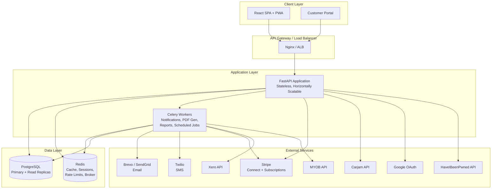
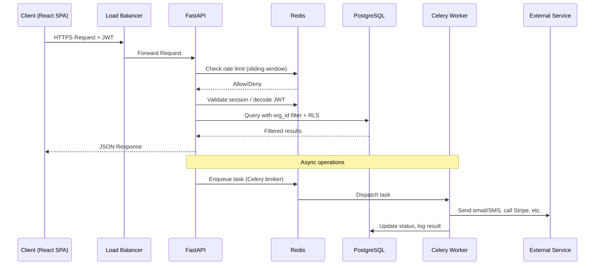
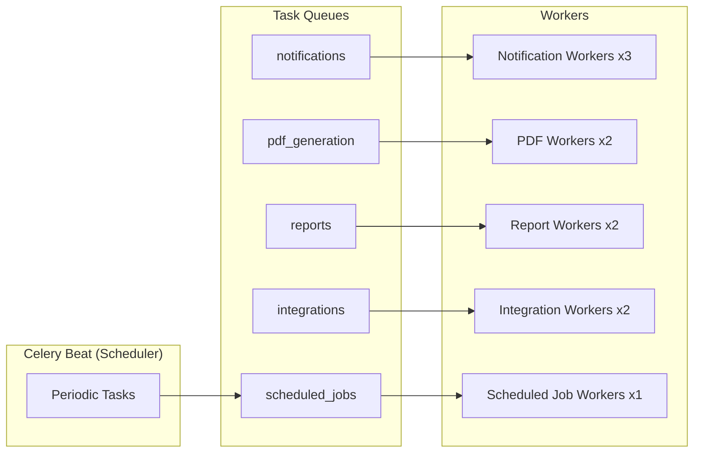
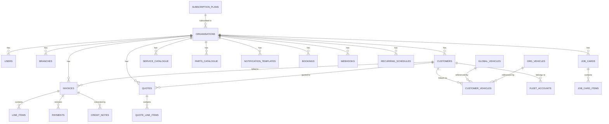

# Technical Design Document — WorkshopPro NZ

## Overview

WorkshopPro NZ is a multi-tenant SaaS platform for New Zealand workshops, garages, and service stations. The system provides invoicing, customer management, vehicle lookup (Carjam), payment processing (Cash + Stripe), subscription billing, notifications (email + SMS), reporting, and a global admin console with comprehensive error logging.

The platform operates across three tiers:

1. **Global Admin Layer** — Platform owner manages all organisations, integrations (Carjam, Stripe, SMTP, Twilio), subscription plans, storage pricing, error logging, and platform health. Global Admins never access org-level customer or invoice data directly.
2. **Organisation Layer** — Each workshop is a fully isolated tenant with its own branding, service catalogue, users, customers, vehicles, invoices, and billing view.
3. **End User Layer** — Org Admin and Salesperson roles operate within an organisation with scoped permissions.

### Key Technical Decisions

- **Single PostgreSQL cluster** with row-level security (RLS) for tenant isolation — no per-org schemas or databases. This simplifies operations and scales well with proper indexing.
- **Compressed JSON storage** for invoices in PostgreSQL — PDFs are generated on-demand server-side (WeasyPrint) and never persisted to disk.
- **Stripe Connect** for org-level payments — orgs never handle raw Stripe keys. Platform billing uses Stripe Subscriptions with metered billing for Carjam overages and storage add-ons.
- **Celery + Redis** for all async work: notifications, PDF generation, report generation, scheduled jobs (overdue status updates, reminder dispatch, WOF/rego expiry checks).
- **Redis** also handles session caching, Carjam rate limiting, and API rate limit tracking (sliding window counters).
- **JWT with refresh token rotation** for auth. Passkeys (WebAuthn) and Google OAuth as alternative login methods. MFA via TOTP, SMS OTP, or email OTP.
- **React + Tailwind CSS** frontend as a single responsive SPA with PWA support and offline capability via service workers.
- **NZ/AU data centres** for all infrastructure to comply with Privacy Act 2020.

---

## Architecture

### High-Level System Architecture




### Request Flow



### Multi-Tenant Isolation Architecture

Tenant isolation is enforced at three layers:

1. **Application Layer** — Every API endpoint extracts `org_id` from the authenticated JWT and includes it in all database queries. Middleware validates that the requesting user belongs to the target organisation.
2. **Database Layer (RLS)** — PostgreSQL Row-Level Security policies on every tenant-scoped table ensure that even if application code has a bug, queries cannot return data from another tenant. RLS policies use `current_setting('app.current_org_id')` set at the start of each database session.
3. **API Response Layer** — Response serializers filter output to only include fields appropriate for the requesting user's role.

```sql
-- Example RLS policy on invoices table
ALTER TABLE invoices ENABLE ROW LEVEL SECURITY;

CREATE POLICY tenant_isolation ON invoices
    USING (org_id = current_setting('app.current_org_id')::uuid);

-- Set at connection time by FastAPI middleware
SET app.current_org_id = '<org-uuid>';
```

### Background Task Architecture



Celery Beat runs periodic tasks:
- **Every minute**: Check for overdue invoices (update status to Overdue at midnight)
- **Every 5 minutes**: Process overdue reminder queue
- **Daily at 2am NZST**: WOF/registration expiry reminder check
- **Every minute**: Retry failed notifications (exponential backoff)
- **Daily at 3am NZST**: Archive error logs older than 12 months

---

## Components and Interfaces

### Backend Module Structure

```
app/
├── main.py                    # FastAPI app factory, middleware registration
├── config.py                  # Settings from environment variables
├── middleware/
│   ├── auth.py                # JWT validation, org_id extraction
│   ├── tenant.py              # RLS session setup, tenant context
│   ├── rate_limit.py          # Redis sliding window rate limiter
│   └── security_headers.py    # CSP, HSTS, X-Frame-Options, etc.
├── modules/
│   ├── auth/                  # Authentication, MFA, sessions, password recovery
│   │   ├── router.py
│   │   ├── service.py
│   │   ├── models.py
│   │   └── schemas.py
│   ├── organisations/         # Org CRUD, branding, settings, onboarding
│   ├── customers/             # Customer CRUD, search, merge, privacy
│   ├── vehicles/              # Vehicle lookup, Carjam integration, manual entry
│   ├── invoices/              # Invoice CRUD, line items, statuses, credit notes
│   ├── quotes/                # Quote CRUD, conversion to invoice
│   ├── job_cards/             # Job card CRUD, conversion to invoice
│   ├── payments/              # Cash + Stripe payments, refunds
│   ├── catalogue/             # Service catalogue, parts, labour rates
│   ├── inventory/             # Stock tracking, reorder alerts, suppliers
│   ├── storage/               # Quota enforcement, PDF generation, bulk export
│   ├── notifications/         # Email + SMS sending, templates, reminders
│   ├── subscriptions/         # Plans, billing lifecycle, trials, plan changes
│   ├── bookings/              # Appointment scheduling, calendar
│   ├── reporting/             # Org-level and global reports
│   ├── webhooks/              # Outbound webhook dispatch
│   └── admin/                 # Global admin console, error logging, integrations
├── integrations/
│   ├── carjam.py              # Carjam API client with Redis rate limiting
│   ├── stripe_connect.py      # Stripe Connect OAuth + payment operations
│   ├── stripe_billing.py      # Stripe Subscriptions + metered billing
│   ├── brevo.py               # Brevo/SendGrid email client
│   ├── twilio_sms.py          # Twilio SMS client
│   ├── xero.py                # Xero OAuth + invoice/payment sync
│   ├── myob.py                # MYOB OAuth + invoice/payment sync
│   ├── hibp.py                # HaveIBeenPwned password check (k-anonymity)
│   └── google_oauth.py        # Google OAuth 2.0 client
├── tasks/
│   ├── notifications.py       # Celery tasks for email/SMS dispatch + retry
│   ├── pdf_generation.py      # Celery tasks for PDF rendering (WeasyPrint)
│   ├── reports.py             # Celery tasks for report generation
│   ├── scheduled.py           # Overdue checks, expiry reminders, log archival
│   └── integrations.py        # Xero/MYOB sync tasks
├── core/
│   ├── database.py            # SQLAlchemy async engine, session factory
│   ├── redis.py               # Redis connection pool
│   ├── encryption.py          # Envelope encryption for secrets
│   ├── audit.py               # Audit log helper (append-only)
│   └── errors.py              # Error logging service
└── templates/
    └── pdf/                   # Jinja2 + WeasyPrint invoice/quote/statement templates
```


### Frontend Component Architecture

```
src/
├── App.tsx                     # Root component, routing, auth context
├── main.tsx                    # Entry point, service worker registration
├── service-worker.ts           # PWA caching, offline sync
├── manifest.json               # PWA manifest
├── api/
│   ├── client.ts               # Axios instance with JWT interceptor + refresh
│   ├── auth.ts                 # Auth API calls
│   ├── invoices.ts             # Invoice API calls
│   ├── customers.ts            # Customer API calls
│   ├── vehicles.ts             # Vehicle API calls
│   └── ...                     # One file per module
├── hooks/
│   ├── useAuth.ts              # Auth state, login/logout, MFA flow
│   ├── useOffline.ts           # Offline detection, local cache, sync
│   ├── useSearch.ts            # Debounced global search
│   └── useKeyboardShortcuts.ts # Global keyboard shortcut handler
├── contexts/
│   ├── AuthContext.tsx          # JWT, user role, org context
│   ├── TenantContext.tsx        # Org branding, settings
│   └── OfflineContext.tsx       # Offline state, pending sync queue
├── layouts/
│   ├── OrgLayout.tsx           # Org-facing layout (sidebar, header, branding)
│   ├── AdminLayout.tsx         # Global admin layout (separate nav)
│   └── PortalLayout.tsx        # Customer portal layout (branded, minimal)
├── pages/
│   ├── auth/                   # Login, MFA, password reset, passkey setup
│   ├── onboarding/             # Org setup wizard (step-by-step)
│   ├── dashboard/              # Role-specific dashboards
│   ├── invoices/               # Invoice list, create, detail, search
│   ├── quotes/                 # Quote list, create, detail
│   ├── job-cards/              # Job card list, create, detail
│   ├── customers/              # Customer list, profile, merge
│   ├── vehicles/               # Vehicle list, profile
│   ├── payments/               # Payment recording, Stripe checkout
│   ├── catalogue/              # Service catalogue, parts, labour rates
│   ├── inventory/              # Stock levels, reorder alerts, suppliers
│   ├── bookings/               # Calendar view, appointment management
│   ├── notifications/          # Notification settings, templates, logs
│   ├── reports/                # Report views with charts
│   ├── settings/               # Org settings, branding, billing, users
│   ├── admin/                  # Global admin console pages
│   └── portal/                 # Customer self-service portal pages
├── components/
│   ├── ui/                     # Reusable primitives (Button, Input, Modal, etc.)
│   ├── forms/                  # Form components (CustomerForm, LineItemRow, etc.)
│   ├── search/                 # GlobalSearchBar, CustomerSearch, InvoiceSearch
│   ├── invoices/               # InvoiceForm, LineItemEditor, StatusBadge
│   ├── charts/                 # Chart components for reports
│   └── notifications/          # Toast, AlertBanner, StorageWarning
└── utils/
    ├── formatCurrency.ts       # NZD + multi-currency formatting
    ├── formatDate.ts           # NZ date formatting (dd/MM/yyyy)
    ├── gstCalculation.ts       # GST calculation helpers
    ├── offlineStorage.ts       # IndexedDB wrapper for offline cache
    └── printStyles.ts          # Print-optimised CSS injection
```

### Key API Endpoints

All endpoints are prefixed with `/api/v1/`. Tenant-scoped endpoints require a valid JWT with `org_id`. Global admin endpoints require `Global_Admin` role.

#### Authentication (`/api/v1/auth`)
| Method | Endpoint | Description |
|--------|----------|-------------|
| POST | `/login` | Email + password login, returns JWT pair |
| POST | `/login/google` | Google OAuth callback |
| POST | `/login/passkey` | WebAuthn authentication |
| POST | `/mfa/verify` | Verify MFA code (TOTP/SMS/Email) |
| POST | `/mfa/enrol` | Start MFA enrolment |
| POST | `/mfa/backup-codes` | Generate backup codes |
| POST | `/token/refresh` | Refresh access token |
| POST | `/password/reset-request` | Request password reset email |
| POST | `/password/reset` | Complete password reset |
| GET | `/sessions` | List active sessions |
| DELETE | `/sessions/{id}` | Terminate a session |

#### Organisations (`/api/v1/org`)
| Method | Endpoint | Description |
|--------|----------|-------------|
| GET | `/settings` | Get org settings + branding |
| PUT | `/settings` | Update org settings |
| POST | `/onboarding` | Save onboarding wizard step |
| GET | `/users` | List org users |
| POST | `/users/invite` | Invite new user |
| PUT | `/users/{id}` | Update user role/status |
| DELETE | `/users/{id}` | Deactivate user |
| GET | `/branches` | List branches |
| POST | `/branches` | Create branch |

#### Customers (`/api/v1/customers`)
| Method | Endpoint | Description |
|--------|----------|-------------|
| GET | `/` | List/search customers |
| POST | `/` | Create customer |
| GET | `/{id}` | Customer profile with vehicles + invoices |
| PUT | `/{id}` | Update customer |
| POST | `/{id}/merge` | Merge with another customer |
| DELETE | `/{id}` | Anonymise customer (Privacy Act) |
| GET | `/{id}/export` | Export customer data as JSON |
| POST | `/{id}/notify` | Send one-off email/SMS |

#### Vehicles (`/api/v1/vehicles`)
| Method | Endpoint | Description |
|--------|----------|-------------|
| GET | `/lookup/{rego}` | Lookup by rego (cache → Carjam) |
| POST | `/manual` | Manual vehicle entry |
| POST | `/{id}/refresh` | Force Carjam refresh |
| GET | `/{id}` | Vehicle profile |
| POST | `/{id}/link` | Link vehicle to customer |

#### Invoices (`/api/v1/invoices`)
| Method | Endpoint | Description |
|--------|----------|-------------|
| GET | `/` | List/search/filter invoices |
| POST | `/` | Create invoice (draft or issued) |
| GET | `/{id}` | Invoice detail |
| PUT | `/{id}` | Update invoice |
| POST | `/{id}/issue` | Issue a draft invoice |
| POST | `/{id}/void` | Void an invoice |
| POST | `/{id}/duplicate` | Duplicate invoice as new draft |
| POST | `/{id}/credit-note` | Create credit note |
| GET | `/{id}/pdf` | Generate and download PDF |
| POST | `/{id}/email` | Email invoice to customer |

#### Quotes (`/api/v1/quotes`)
| Method | Endpoint | Description |
|--------|----------|-------------|
| GET | `/` | List/search quotes |
| POST | `/` | Create quote |
| PUT | `/{id}` | Update quote |
| POST | `/{id}/send` | Send quote to customer |
| POST | `/{id}/convert` | Convert quote to draft invoice |

#### Job Cards (`/api/v1/job-cards`)
| Method | Endpoint | Description |
|--------|----------|-------------|
| GET | `/` | List job cards |
| POST | `/` | Create job card |
| PUT | `/{id}` | Update job card status |
| POST | `/{id}/convert` | Convert to draft invoice |
| POST | `/{id}/timer/start` | Start time tracking |
| POST | `/{id}/timer/stop` | Stop time tracking |

#### Payments (`/api/v1/payments`)
| Method | Endpoint | Description |
|--------|----------|-------------|
| POST | `/cash` | Record cash payment |
| POST | `/stripe/create-link` | Generate Stripe payment link |
| POST | `/stripe/webhook` | Stripe webhook receiver |
| POST | `/refund` | Process refund (cash or Stripe) |
| GET | `/invoice/{id}/history` | Payment history for invoice |

#### Catalogue (`/api/v1/catalogue`)
| Method | Endpoint | Description |
|--------|----------|-------------|
| GET | `/services` | List services |
| POST | `/services` | Create service |
| PUT | `/services/{id}` | Update service |
| GET | `/parts` | List parts |
| POST | `/parts` | Create part |
| GET | `/labour-rates` | List labour rates |
| POST | `/labour-rates` | Create labour rate |

#### Inventory (`/api/v1/inventory`)
| Method | Endpoint | Description |
|--------|----------|-------------|
| GET | `/stock` | Stock levels report |
| PUT | `/stock/{part_id}` | Adjust stock level |
| GET | `/suppliers` | List suppliers |
| POST | `/suppliers` | Create supplier |
| POST | `/purchase-orders` | Generate purchase order PDF |

#### Bookings (`/api/v1/bookings`)
| Method | Endpoint | Description |
|--------|----------|-------------|
| GET | `/` | List appointments (calendar data) |
| POST | `/` | Create appointment |
| PUT | `/{id}` | Update appointment |
| DELETE | `/{id}` | Cancel appointment |
| POST | `/{id}/convert` | Convert to job card or invoice |

#### Notifications (`/api/v1/notifications`)
| Method | Endpoint | Description |
|--------|----------|-------------|
| GET | `/settings` | Get notification preferences |
| PUT | `/settings` | Update notification preferences |
| GET | `/templates` | List email/SMS templates |
| PUT | `/templates/{id}` | Update template |
| GET | `/log` | Email/SMS delivery log |

#### Subscriptions & Billing (`/api/v1/billing`)
| Method | Endpoint | Description |
|--------|----------|-------------|
| GET | `/` | Billing dashboard data |
| GET | `/invoices` | Past subscription invoices |
| POST | `/upgrade` | Upgrade plan |
| POST | `/downgrade` | Downgrade plan |
| POST | `/storage/purchase` | Purchase storage add-on |
| PUT | `/payment-method` | Update payment method |
| POST | `/stripe/connect` | Start Stripe Connect OAuth |
| GET | `/stripe/connect/callback` | Stripe Connect OAuth callback |

#### Reporting (`/api/v1/reports`)
| Method | Endpoint | Description |
|--------|----------|-------------|
| GET | `/revenue` | Revenue summary |
| GET | `/invoices/status` | Invoice status report |
| GET | `/outstanding` | Outstanding invoices |
| GET | `/top-services` | Top services by revenue |
| GET | `/gst-return` | GST return summary |
| GET | `/customer-statement/{id}` | Customer statement PDF |
| GET | `/carjam-usage` | Carjam usage report |
| GET | `/storage` | Storage usage report |
| GET | `/fleet/{id}` | Fleet account report |

#### Global Admin (`/api/v1/admin`)
| Method | Endpoint | Description |
|--------|----------|-------------|
| GET | `/organisations` | List all organisations |
| POST | `/organisations` | Provision new organisation |
| PUT | `/organisations/{id}` | Update org (suspend, reinstate, move plan) |
| DELETE | `/organisations/{id}` | Delete organisation |
| GET | `/plans` | List subscription plans |
| POST | `/plans` | Create plan |
| PUT | `/plans/{id}` | Update plan |
| GET | `/integrations/{name}` | Get integration config |
| PUT | `/integrations/{name}` | Update integration config |
| POST | `/integrations/{name}/test` | Test integration connection |
| GET | `/errors` | Error log dashboard |
| GET | `/errors/{id}` | Error detail |
| PUT | `/errors/{id}` | Update error status/notes |
| GET | `/vehicle-db` | Global vehicle database stats |
| GET | `/vehicle-db/{rego}` | Search global vehicle DB |
| PUT | `/settings` | Platform settings (T&C, announcements) |
| GET | `/reports/mrr` | Platform MRR |
| GET | `/reports/organisations` | Organisation overview |
| GET | `/reports/carjam-cost` | Carjam cost vs revenue |
| GET | `/reports/churn` | Churn report |

#### Webhooks (`/api/v1/webhooks`)
| Method | Endpoint | Description |
|--------|----------|-------------|
| GET | `/` | List configured webhooks |
| POST | `/` | Register webhook URL |
| PUT | `/{id}` | Update webhook |
| DELETE | `/{id}` | Remove webhook |

#### Customer Portal (`/api/v1/portal`)
| Method | Endpoint | Description |
|--------|----------|-------------|
| GET | `/{token}` | Access portal via secure link |
| GET | `/{token}/invoices` | Customer's invoices |
| GET | `/{token}/vehicles` | Customer's vehicle history |
| POST | `/{token}/pay/{invoice_id}` | Pay invoice via Stripe |

#### Data Import/Export (`/api/v1/data`)
| Method | Endpoint | Description |
|--------|----------|-------------|
| POST | `/import/customers` | Import customers from CSV |
| POST | `/import/vehicles` | Import vehicles from CSV |
| GET | `/export/customers` | Export customers as CSV |
| GET | `/export/vehicles` | Export vehicles as CSV |
| GET | `/export/invoices` | Export invoices as CSV |


---

## Data Models

### PostgreSQL Schema Design

All tables use UUIDs as primary keys. Tenant-scoped tables include an `org_id` column with RLS policies. Timestamps use `TIMESTAMPTZ` (UTC storage, NZ display in frontend). Soft deletes are used where accounting integrity requires it.

### Entity Relationship Diagram (Core)




### Core Tables

#### Global Tables (No RLS — platform-wide)

```sql
-- Subscription plans configured by Global Admin
CREATE TABLE subscription_plans (
    id UUID PRIMARY KEY DEFAULT gen_random_uuid(),
    name VARCHAR(100) NOT NULL,
    monthly_price_nzd DECIMAL(10,2) NOT NULL,
    user_seats INT NOT NULL,
    storage_quota_gb INT NOT NULL,
    carjam_lookups_included INT NOT NULL,
    enabled_modules JSONB NOT NULL DEFAULT '[]',
    is_public BOOLEAN NOT NULL DEFAULT true,
    is_archived BOOLEAN NOT NULL DEFAULT false,
    created_at TIMESTAMPTZ NOT NULL DEFAULT now(),
    updated_at TIMESTAMPTZ NOT NULL DEFAULT now()
);

-- Organisations (tenants)
CREATE TABLE organisations (
    id UUID PRIMARY KEY DEFAULT gen_random_uuid(),
    name VARCHAR(255) NOT NULL,
    plan_id UUID NOT NULL REFERENCES subscription_plans(id),
    status VARCHAR(20) NOT NULL DEFAULT 'active'
        CHECK (status IN ('trial','active','grace_period','suspended','deleted')),
    trial_ends_at TIMESTAMPTZ,
    stripe_customer_id VARCHAR(255),
    stripe_subscription_id VARCHAR(255),
    stripe_connect_account_id VARCHAR(255),
    storage_quota_gb INT NOT NULL,
    storage_used_bytes BIGINT NOT NULL DEFAULT 0,
    carjam_lookups_this_month INT NOT NULL DEFAULT 0,
    carjam_lookups_reset_at TIMESTAMPTZ,
    settings JSONB NOT NULL DEFAULT '{}',
    -- settings includes: logo_url, primary_colour, secondary_colour,
    -- gst_number, gst_percentage, invoice_prefix, invoice_start_number,
    -- default_due_days, default_notes, payment_terms_text,
    -- terms_and_conditions, email_signature, mfa_policy,
    -- ip_allowlist, max_sessions_per_user, multi_currency_enabled
    created_at TIMESTAMPTZ NOT NULL DEFAULT now(),
    updated_at TIMESTAMPTZ NOT NULL DEFAULT now()
);

-- Global vehicle database (shared across all orgs)
CREATE TABLE global_vehicles (
    id UUID PRIMARY KEY DEFAULT gen_random_uuid(),
    rego VARCHAR(20) NOT NULL UNIQUE,
    make VARCHAR(100),
    model VARCHAR(100),
    year INT,
    colour VARCHAR(50),
    body_type VARCHAR(50),
    fuel_type VARCHAR(50),
    engine_size VARCHAR(50),
    num_seats INT,
    wof_expiry DATE,
    registration_expiry DATE,
    odometer_last_recorded INT,
    last_pulled_at TIMESTAMPTZ NOT NULL DEFAULT now(),
    created_at TIMESTAMPTZ NOT NULL DEFAULT now()
);
CREATE INDEX idx_global_vehicles_rego ON global_vehicles(rego);
```


```sql
-- Global admin integration configuration
CREATE TABLE integration_configs (
    id UUID PRIMARY KEY DEFAULT gen_random_uuid(),
    name VARCHAR(50) NOT NULL UNIQUE
        CHECK (name IN ('carjam','stripe','smtp','twilio')),
    config_encrypted BYTEA NOT NULL,  -- envelope encrypted JSON
    is_verified BOOLEAN NOT NULL DEFAULT false,
    updated_at TIMESTAMPTZ NOT NULL DEFAULT now()
);

-- Platform settings (T&C, announcements)
CREATE TABLE platform_settings (
    key VARCHAR(100) PRIMARY KEY,
    value JSONB NOT NULL,
    version INT NOT NULL DEFAULT 1,
    updated_at TIMESTAMPTZ NOT NULL DEFAULT now()
);

-- Global admin users (separate from org users for clarity)
-- Actually stored in users table with role='global_admin' and org_id IS NULL
```

#### Tenant-Scoped Tables (RLS enabled)

```sql
-- Users (org users + global admins)
CREATE TABLE users (
    id UUID PRIMARY KEY DEFAULT gen_random_uuid(),
    org_id UUID REFERENCES organisations(id),  -- NULL for global admins
    email VARCHAR(255) NOT NULL UNIQUE,
    password_hash VARCHAR(255),  -- NULL if using only OAuth/Passkey
    role VARCHAR(20) NOT NULL
        CHECK (role IN ('global_admin','org_admin','salesperson')),
    is_active BOOLEAN NOT NULL DEFAULT true,
    is_email_verified BOOLEAN NOT NULL DEFAULT false,
    mfa_methods JSONB NOT NULL DEFAULT '[]',
    -- mfa_methods: [{type: 'totp', secret_encrypted: '...', enrolled_at: '...'},
    --              {type: 'sms', phone: '...', enrolled_at: '...'},
    --              {type: 'email', enrolled_at: '...'}]
    backup_codes_hash JSONB,  -- hashed backup codes
    passkey_credentials JSONB NOT NULL DEFAULT '[]',
    google_oauth_id VARCHAR(255),
    branch_ids JSONB NOT NULL DEFAULT '[]',
    last_login_at TIMESTAMPTZ,
    created_at TIMESTAMPTZ NOT NULL DEFAULT now(),
    updated_at TIMESTAMPTZ NOT NULL DEFAULT now()
);
ALTER TABLE users ENABLE ROW LEVEL SECURITY;
CREATE INDEX idx_users_org ON users(org_id);
CREATE INDEX idx_users_email ON users(email);

-- User sessions
CREATE TABLE sessions (
    id UUID PRIMARY KEY DEFAULT gen_random_uuid(),
    user_id UUID NOT NULL REFERENCES users(id),
    org_id UUID REFERENCES organisations(id),
    refresh_token_hash VARCHAR(255) NOT NULL,
    family_id UUID NOT NULL,  -- for refresh token rotation detection
    device_type VARCHAR(100),
    browser VARCHAR(100),
    ip_address INET,
    last_activity_at TIMESTAMPTZ NOT NULL DEFAULT now(),
    expires_at TIMESTAMPTZ NOT NULL,
    is_revoked BOOLEAN NOT NULL DEFAULT false,
    created_at TIMESTAMPTZ NOT NULL DEFAULT now()
);
ALTER TABLE sessions ENABLE ROW LEVEL SECURITY;
```


```sql
-- Branches
CREATE TABLE branches (
    id UUID PRIMARY KEY DEFAULT gen_random_uuid(),
    org_id UUID NOT NULL REFERENCES organisations(id),
    name VARCHAR(255) NOT NULL,
    address TEXT,
    phone VARCHAR(50),
    is_active BOOLEAN NOT NULL DEFAULT true,
    created_at TIMESTAMPTZ NOT NULL DEFAULT now()
);
ALTER TABLE branches ENABLE ROW LEVEL SECURITY;

-- Customers
CREATE TABLE customers (
    id UUID PRIMARY KEY DEFAULT gen_random_uuid(),
    org_id UUID NOT NULL REFERENCES organisations(id),
    first_name VARCHAR(100) NOT NULL,
    last_name VARCHAR(100) NOT NULL,
    email VARCHAR(255),
    phone VARCHAR(50),
    address TEXT,
    notes TEXT,
    fleet_account_id UUID REFERENCES fleet_accounts(id),
    is_anonymised BOOLEAN NOT NULL DEFAULT false,
    email_bounced BOOLEAN NOT NULL DEFAULT false,
    tags JSONB NOT NULL DEFAULT '[]',
    portal_token UUID UNIQUE,
    created_at TIMESTAMPTZ NOT NULL DEFAULT now(),
    updated_at TIMESTAMPTZ NOT NULL DEFAULT now()
);
ALTER TABLE customers ENABLE ROW LEVEL SECURITY;
CREATE INDEX idx_customers_org ON customers(org_id);
CREATE INDEX idx_customers_search ON customers
    USING gin(to_tsvector('english', first_name || ' ' || last_name || ' ' || COALESCE(email,'') || ' ' || COALESCE(phone,'')));

-- Fleet accounts
CREATE TABLE fleet_accounts (
    id UUID PRIMARY KEY DEFAULT gen_random_uuid(),
    org_id UUID NOT NULL REFERENCES organisations(id),
    company_name VARCHAR(255) NOT NULL,
    primary_contact_name VARCHAR(255),
    billing_address TEXT,
    pricing_overrides JSONB NOT NULL DEFAULT '{}',
    created_at TIMESTAMPTZ NOT NULL DEFAULT now(),
    updated_at TIMESTAMPTZ NOT NULL DEFAULT now()
);
ALTER TABLE fleet_accounts ENABLE ROW LEVEL SECURITY;

-- Org-level manually entered vehicles
CREATE TABLE org_vehicles (
    id UUID PRIMARY KEY DEFAULT gen_random_uuid(),
    org_id UUID NOT NULL REFERENCES organisations(id),
    rego VARCHAR(20) NOT NULL,
    make VARCHAR(100),
    model VARCHAR(100),
    year INT,
    colour VARCHAR(50),
    body_type VARCHAR(50),
    fuel_type VARCHAR(50),
    is_manual_entry BOOLEAN NOT NULL DEFAULT true,
    created_at TIMESTAMPTZ NOT NULL DEFAULT now()
);
ALTER TABLE org_vehicles ENABLE ROW LEVEL SECURITY;

-- Customer-vehicle links (many-to-many)
CREATE TABLE customer_vehicles (
    id UUID PRIMARY KEY DEFAULT gen_random_uuid(),
    org_id UUID NOT NULL REFERENCES organisations(id),
    customer_id UUID NOT NULL REFERENCES customers(id),
    global_vehicle_id UUID REFERENCES global_vehicles(id),
    org_vehicle_id UUID REFERENCES org_vehicles(id),
    -- exactly one of global_vehicle_id or org_vehicle_id must be set
    created_at TIMESTAMPTZ NOT NULL DEFAULT now(),
    CONSTRAINT vehicle_link_check CHECK (
        (global_vehicle_id IS NOT NULL AND org_vehicle_id IS NULL) OR
        (global_vehicle_id IS NULL AND org_vehicle_id IS NOT NULL)
    )
);
ALTER TABLE customer_vehicles ENABLE ROW LEVEL SECURITY;
```


```sql
-- Service catalogue
CREATE TABLE service_catalogue (
    id UUID PRIMARY KEY DEFAULT gen_random_uuid(),
    org_id UUID NOT NULL REFERENCES organisations(id),
    name VARCHAR(255) NOT NULL,
    description TEXT,
    default_price DECIMAL(10,2) NOT NULL,
    is_gst_applicable BOOLEAN NOT NULL DEFAULT true,
    category VARCHAR(50) NOT NULL
        CHECK (category IN ('warrant','service','repair','diagnostic','other')),
    is_active BOOLEAN NOT NULL DEFAULT true,
    created_at TIMESTAMPTZ NOT NULL DEFAULT now(),
    updated_at TIMESTAMPTZ NOT NULL DEFAULT now()
);
ALTER TABLE service_catalogue ENABLE ROW LEVEL SECURITY;

-- Parts catalogue
CREATE TABLE parts_catalogue (
    id UUID PRIMARY KEY DEFAULT gen_random_uuid(),
    org_id UUID NOT NULL REFERENCES organisations(id),
    name VARCHAR(255) NOT NULL,
    part_number VARCHAR(100),
    default_price DECIMAL(10,2),
    stock_quantity INT NOT NULL DEFAULT 0,
    min_stock_threshold INT NOT NULL DEFAULT 0,
    reorder_quantity INT NOT NULL DEFAULT 0,
    created_at TIMESTAMPTZ NOT NULL DEFAULT now(),
    updated_at TIMESTAMPTZ NOT NULL DEFAULT now()
);
ALTER TABLE parts_catalogue ENABLE ROW LEVEL SECURITY;

-- Suppliers
CREATE TABLE suppliers (
    id UUID PRIMARY KEY DEFAULT gen_random_uuid(),
    org_id UUID NOT NULL REFERENCES organisations(id),
    name VARCHAR(255) NOT NULL,
    contact_person VARCHAR(255),
    email VARCHAR(255),
    phone VARCHAR(50),
    address TEXT,
    account_number VARCHAR(100),
    created_at TIMESTAMPTZ NOT NULL DEFAULT now()
);
ALTER TABLE suppliers ENABLE ROW LEVEL SECURITY;

-- Part-supplier links
CREATE TABLE part_suppliers (
    id UUID PRIMARY KEY DEFAULT gen_random_uuid(),
    part_id UUID NOT NULL REFERENCES parts_catalogue(id),
    supplier_id UUID NOT NULL REFERENCES suppliers(id),
    supplier_part_number VARCHAR(100),
    supplier_cost DECIMAL(10,2),
    UNIQUE(part_id, supplier_id)
);

-- Labour rates
CREATE TABLE labour_rates (
    id UUID PRIMARY KEY DEFAULT gen_random_uuid(),
    org_id UUID NOT NULL REFERENCES organisations(id),
    name VARCHAR(100) NOT NULL,
    hourly_rate DECIMAL(10,2) NOT NULL,
    is_active BOOLEAN NOT NULL DEFAULT true,
    created_at TIMESTAMPTZ NOT NULL DEFAULT now()
);
ALTER TABLE labour_rates ENABLE ROW LEVEL SECURITY;
```


```sql
-- Invoices
CREATE TABLE invoices (
    id UUID PRIMARY KEY DEFAULT gen_random_uuid(),
    org_id UUID NOT NULL REFERENCES organisations(id),
    invoice_number VARCHAR(50),  -- NULL for drafts, assigned on issue
    customer_id UUID NOT NULL REFERENCES customers(id),
    vehicle_rego VARCHAR(20),
    vehicle_make VARCHAR(100),
    vehicle_model VARCHAR(100),
    vehicle_year INT,
    vehicle_odometer INT,
    branch_id UUID REFERENCES branches(id),
    status VARCHAR(20) NOT NULL DEFAULT 'draft'
        CHECK (status IN ('draft','issued','partially_paid','paid','overdue','voided')),
    issue_date DATE,
    due_date DATE,
    currency VARCHAR(3) NOT NULL DEFAULT 'NZD',
    subtotal DECIMAL(12,2) NOT NULL DEFAULT 0,
    discount_amount DECIMAL(12,2) NOT NULL DEFAULT 0,
    discount_type VARCHAR(10) CHECK (discount_type IN ('percentage','fixed')),
    discount_value DECIMAL(12,2),
    gst_amount DECIMAL(12,2) NOT NULL DEFAULT 0,
    total DECIMAL(12,2) NOT NULL DEFAULT 0,
    amount_paid DECIMAL(12,2) NOT NULL DEFAULT 0,
    balance_due DECIMAL(12,2) NOT NULL DEFAULT 0,
    notes_internal TEXT,
    notes_customer TEXT,
    void_reason TEXT,
    voided_at TIMESTAMPTZ,
    voided_by UUID REFERENCES users(id),
    recurring_schedule_id UUID REFERENCES recurring_schedules(id),
    job_card_id UUID REFERENCES job_cards(id),
    quote_id UUID REFERENCES quotes(id),
    invoice_data_json JSONB NOT NULL DEFAULT '{}',  -- compressed full invoice for PDF
    created_by UUID NOT NULL REFERENCES users(id),
    created_at TIMESTAMPTZ NOT NULL DEFAULT now(),
    updated_at TIMESTAMPTZ NOT NULL DEFAULT now()
);
ALTER TABLE invoices ENABLE ROW LEVEL SECURITY;
CREATE INDEX idx_invoices_org ON invoices(org_id);
CREATE INDEX idx_invoices_number ON invoices(org_id, invoice_number);
CREATE INDEX idx_invoices_customer ON invoices(customer_id);
CREATE INDEX idx_invoices_status ON invoices(org_id, status);
CREATE INDEX idx_invoices_rego ON invoices(org_id, vehicle_rego);
CREATE INDEX idx_invoices_due_date ON invoices(org_id, due_date) WHERE status IN ('issued','partially_paid');

-- Invoice line items
CREATE TABLE line_items (
    id UUID PRIMARY KEY DEFAULT gen_random_uuid(),
    invoice_id UUID NOT NULL REFERENCES invoices(id) ON DELETE CASCADE,
    org_id UUID NOT NULL REFERENCES organisations(id),
    item_type VARCHAR(10) NOT NULL CHECK (item_type IN ('service','part','labour')),
    description VARCHAR(500) NOT NULL,
    catalogue_item_id UUID,  -- references service_catalogue or parts_catalogue
    part_number VARCHAR(100),
    quantity DECIMAL(10,3) NOT NULL DEFAULT 1,
    unit_price DECIMAL(10,2) NOT NULL,
    hours DECIMAL(6,2),  -- for labour items
    hourly_rate DECIMAL(10,2),  -- for labour items
    discount_type VARCHAR(10) CHECK (discount_type IN ('percentage','fixed')),
    discount_value DECIMAL(10,2),
    is_gst_exempt BOOLEAN NOT NULL DEFAULT false,
    warranty_note TEXT,
    line_total DECIMAL(12,2) NOT NULL,
    sort_order INT NOT NULL DEFAULT 0,
    created_at TIMESTAMPTZ NOT NULL DEFAULT now()
);
ALTER TABLE line_items ENABLE ROW LEVEL SECURITY;
CREATE INDEX idx_line_items_invoice ON line_items(invoice_id);
```


```sql
-- Credit notes
CREATE TABLE credit_notes (
    id UUID PRIMARY KEY DEFAULT gen_random_uuid(),
    org_id UUID NOT NULL REFERENCES organisations(id),
    credit_note_number VARCHAR(50) NOT NULL,
    invoice_id UUID NOT NULL REFERENCES invoices(id),
    amount DECIMAL(12,2) NOT NULL,
    reason TEXT NOT NULL,
    items JSONB NOT NULL DEFAULT '[]',
    stripe_refund_id VARCHAR(255),
    created_by UUID NOT NULL REFERENCES users(id),
    created_at TIMESTAMPTZ NOT NULL DEFAULT now()
);
ALTER TABLE credit_notes ENABLE ROW LEVEL SECURITY;

-- Payments
CREATE TABLE payments (
    id UUID PRIMARY KEY DEFAULT gen_random_uuid(),
    org_id UUID NOT NULL REFERENCES organisations(id),
    invoice_id UUID NOT NULL REFERENCES invoices(id),
    amount DECIMAL(12,2) NOT NULL,
    method VARCHAR(10) NOT NULL CHECK (method IN ('cash','stripe')),
    stripe_payment_intent_id VARCHAR(255),
    is_refund BOOLEAN NOT NULL DEFAULT false,
    refund_note TEXT,
    recorded_by UUID NOT NULL REFERENCES users(id),
    created_at TIMESTAMPTZ NOT NULL DEFAULT now()
);
ALTER TABLE payments ENABLE ROW LEVEL SECURITY;
CREATE INDEX idx_payments_invoice ON payments(invoice_id);

-- Quotes
CREATE TABLE quotes (
    id UUID PRIMARY KEY DEFAULT gen_random_uuid(),
    org_id UUID NOT NULL REFERENCES organisations(id),
    quote_number VARCHAR(50) NOT NULL,
    customer_id UUID NOT NULL REFERENCES customers(id),
    vehicle_rego VARCHAR(20),
    vehicle_make VARCHAR(100),
    vehicle_model VARCHAR(100),
    vehicle_year INT,
    status VARCHAR(20) NOT NULL DEFAULT 'draft'
        CHECK (status IN ('draft','sent','accepted','declined','expired')),
    valid_until DATE,
    subtotal DECIMAL(12,2) NOT NULL DEFAULT 0,
    gst_amount DECIMAL(12,2) NOT NULL DEFAULT 0,
    total DECIMAL(12,2) NOT NULL DEFAULT 0,
    notes TEXT,
    created_by UUID NOT NULL REFERENCES users(id),
    created_at TIMESTAMPTZ NOT NULL DEFAULT now(),
    updated_at TIMESTAMPTZ NOT NULL DEFAULT now()
);
ALTER TABLE quotes ENABLE ROW LEVEL SECURITY;

-- Quote line items (same structure as invoice line items)
CREATE TABLE quote_line_items (
    id UUID PRIMARY KEY DEFAULT gen_random_uuid(),
    quote_id UUID NOT NULL REFERENCES quotes(id) ON DELETE CASCADE,
    org_id UUID NOT NULL REFERENCES organisations(id),
    item_type VARCHAR(10) NOT NULL CHECK (item_type IN ('service','part','labour')),
    description VARCHAR(500) NOT NULL,
    quantity DECIMAL(10,3) NOT NULL DEFAULT 1,
    unit_price DECIMAL(10,2) NOT NULL,
    hours DECIMAL(6,2),
    hourly_rate DECIMAL(10,2),
    is_gst_exempt BOOLEAN NOT NULL DEFAULT false,
    warranty_note TEXT,
    line_total DECIMAL(12,2) NOT NULL,
    sort_order INT NOT NULL DEFAULT 0
);
ALTER TABLE quote_line_items ENABLE ROW LEVEL SECURITY;
```


```sql
-- Job cards
CREATE TABLE job_cards (
    id UUID PRIMARY KEY DEFAULT gen_random_uuid(),
    org_id UUID NOT NULL REFERENCES organisations(id),
    customer_id UUID NOT NULL REFERENCES customers(id),
    vehicle_rego VARCHAR(20),
    status VARCHAR(20) NOT NULL DEFAULT 'open'
        CHECK (status IN ('open','in_progress','completed','invoiced')),
    description TEXT,
    created_by UUID NOT NULL REFERENCES users(id),
    created_at TIMESTAMPTZ NOT NULL DEFAULT now(),
    updated_at TIMESTAMPTZ NOT NULL DEFAULT now()
);
ALTER TABLE job_cards ENABLE ROW LEVEL SECURITY;

-- Job card items
CREATE TABLE job_card_items (
    id UUID PRIMARY KEY DEFAULT gen_random_uuid(),
    job_card_id UUID NOT NULL REFERENCES job_cards(id) ON DELETE CASCADE,
    org_id UUID NOT NULL REFERENCES organisations(id),
    item_type VARCHAR(10) NOT NULL CHECK (item_type IN ('service','part','labour')),
    description VARCHAR(500) NOT NULL,
    quantity DECIMAL(10,3) NOT NULL DEFAULT 1,
    unit_price DECIMAL(10,2) NOT NULL,
    sort_order INT NOT NULL DEFAULT 0
);
ALTER TABLE job_card_items ENABLE ROW LEVEL SECURITY;

-- Time tracking entries
CREATE TABLE time_entries (
    id UUID PRIMARY KEY DEFAULT gen_random_uuid(),
    org_id UUID NOT NULL REFERENCES organisations(id),
    user_id UUID NOT NULL REFERENCES users(id),
    job_card_id UUID REFERENCES job_cards(id),
    invoice_id UUID REFERENCES invoices(id),
    started_at TIMESTAMPTZ NOT NULL,
    stopped_at TIMESTAMPTZ,
    duration_minutes INT,
    created_at TIMESTAMPTZ NOT NULL DEFAULT now()
);
ALTER TABLE time_entries ENABLE ROW LEVEL SECURITY;

-- Recurring invoice schedules
CREATE TABLE recurring_schedules (
    id UUID PRIMARY KEY DEFAULT gen_random_uuid(),
    org_id UUID NOT NULL REFERENCES organisations(id),
    customer_id UUID NOT NULL REFERENCES customers(id),
    frequency VARCHAR(20) NOT NULL
        CHECK (frequency IN ('weekly','fortnightly','monthly','quarterly','annually')),
    line_items JSONB NOT NULL DEFAULT '[]',
    auto_issue BOOLEAN NOT NULL DEFAULT false,
    is_active BOOLEAN NOT NULL DEFAULT true,
    next_due_at TIMESTAMPTZ NOT NULL,
    last_generated_at TIMESTAMPTZ,
    created_by UUID NOT NULL REFERENCES users(id),
    created_at TIMESTAMPTZ NOT NULL DEFAULT now()
);
ALTER TABLE recurring_schedules ENABLE ROW LEVEL SECURITY;

-- Bookings / Appointments
CREATE TABLE bookings (
    id UUID PRIMARY KEY DEFAULT gen_random_uuid(),
    org_id UUID NOT NULL REFERENCES organisations(id),
    customer_id UUID REFERENCES customers(id),
    vehicle_rego VARCHAR(20),
    branch_id UUID REFERENCES branches(id),
    service_type VARCHAR(255),
    scheduled_at TIMESTAMPTZ NOT NULL,
    duration_minutes INT NOT NULL DEFAULT 60,
    notes TEXT,
    status VARCHAR(20) NOT NULL DEFAULT 'scheduled'
        CHECK (status IN ('scheduled','confirmed','completed','cancelled')),
    reminder_sent BOOLEAN NOT NULL DEFAULT false,
    created_by UUID NOT NULL REFERENCES users(id),
    created_at TIMESTAMPTZ NOT NULL DEFAULT now()
);
ALTER TABLE bookings ENABLE ROW LEVEL SECURITY;
```


```sql
-- Notification templates
CREATE TABLE notification_templates (
    id UUID PRIMARY KEY DEFAULT gen_random_uuid(),
    org_id UUID NOT NULL REFERENCES organisations(id),
    template_type VARCHAR(50) NOT NULL,
    -- e.g. 'invoice_issued', 'payment_received', 'overdue_reminder',
    -- 'wof_expiry', 'rego_expiry', 'storage_warning_80', etc.
    channel VARCHAR(10) NOT NULL CHECK (channel IN ('email','sms')),
    subject VARCHAR(255),  -- email only
    body_blocks JSONB NOT NULL DEFAULT '[]',  -- visual block editor content
    is_enabled BOOLEAN NOT NULL DEFAULT false,
    updated_at TIMESTAMPTZ NOT NULL DEFAULT now(),
    UNIQUE(org_id, template_type, channel)
);
ALTER TABLE notification_templates ENABLE ROW LEVEL SECURITY;

-- Notification log
CREATE TABLE notification_log (
    id UUID PRIMARY KEY DEFAULT gen_random_uuid(),
    org_id UUID NOT NULL REFERENCES organisations(id),
    channel VARCHAR(10) NOT NULL CHECK (channel IN ('email','sms')),
    recipient VARCHAR(255) NOT NULL,
    template_type VARCHAR(50) NOT NULL,
    subject VARCHAR(255),
    status VARCHAR(20) NOT NULL DEFAULT 'queued'
        CHECK (status IN ('queued','sent','delivered','bounced','opened','failed')),
    retry_count INT NOT NULL DEFAULT 0,
    error_message TEXT,
    sent_at TIMESTAMPTZ,
    created_at TIMESTAMPTZ NOT NULL DEFAULT now()
);
ALTER TABLE notification_log ENABLE ROW LEVEL SECURITY;
CREATE INDEX idx_notification_log_org ON notification_log(org_id, created_at DESC);

-- Overdue reminder rules
CREATE TABLE overdue_reminder_rules (
    id UUID PRIMARY KEY DEFAULT gen_random_uuid(),
    org_id UUID NOT NULL REFERENCES organisations(id),
    days_after_due INT NOT NULL,
    send_email BOOLEAN NOT NULL DEFAULT true,
    send_sms BOOLEAN NOT NULL DEFAULT false,
    sort_order INT NOT NULL DEFAULT 0,
    is_enabled BOOLEAN NOT NULL DEFAULT false,
    UNIQUE(org_id, days_after_due)
);
ALTER TABLE overdue_reminder_rules ENABLE ROW LEVEL SECURITY;

-- Notification preferences (org-level toggles)
CREATE TABLE notification_preferences (
    id UUID PRIMARY KEY DEFAULT gen_random_uuid(),
    org_id UUID NOT NULL REFERENCES organisations(id),
    notification_type VARCHAR(50) NOT NULL,
    is_enabled BOOLEAN NOT NULL DEFAULT false,
    channel VARCHAR(20) NOT NULL DEFAULT 'email'
        CHECK (channel IN ('email','sms','both')),
    config JSONB NOT NULL DEFAULT '{}',
    -- config for WOF/rego reminders: {days_before: 30}
    UNIQUE(org_id, notification_type)
);
ALTER TABLE notification_preferences ENABLE ROW LEVEL SECURITY;
```


```sql
-- Audit log (append-only, no RLS — filtered by application)
CREATE TABLE audit_log (
    id UUID PRIMARY KEY DEFAULT gen_random_uuid(),
    org_id UUID,  -- NULL for global admin actions
    user_id UUID,
    action VARCHAR(100) NOT NULL,
    entity_type VARCHAR(50) NOT NULL,
    entity_id UUID,
    before_value JSONB,
    after_value JSONB,
    ip_address INET,
    device_info VARCHAR(255),
    created_at TIMESTAMPTZ NOT NULL DEFAULT now()
);
-- Append-only: REVOKE UPDATE, DELETE on audit_log from application role
CREATE INDEX idx_audit_log_org ON audit_log(org_id, created_at DESC);
CREATE INDEX idx_audit_log_entity ON audit_log(entity_type, entity_id);

-- Error log (Global Admin only)
CREATE TABLE error_log (
    id UUID PRIMARY KEY DEFAULT gen_random_uuid(),
    severity VARCHAR(10) NOT NULL
        CHECK (severity IN ('info','warning','error','critical')),
    category VARCHAR(30) NOT NULL
        CHECK (category IN ('payment','integration','storage',
            'authentication','data','background_job','application')),
    module VARCHAR(100) NOT NULL,
    function_name VARCHAR(100),
    message TEXT NOT NULL,
    stack_trace TEXT,
    org_id UUID,
    user_id UUID,
    http_method VARCHAR(10),
    http_endpoint VARCHAR(500),
    request_body_sanitised JSONB,
    response_body_sanitised JSONB,
    status VARCHAR(20) NOT NULL DEFAULT 'open'
        CHECK (status IN ('open','investigating','resolved')),
    resolution_notes TEXT,
    created_at TIMESTAMPTZ NOT NULL DEFAULT now()
);
CREATE INDEX idx_error_log_severity ON error_log(severity, created_at DESC);
CREATE INDEX idx_error_log_category ON error_log(category, created_at DESC);
CREATE INDEX idx_error_log_org ON error_log(org_id, created_at DESC);

-- Webhooks (org-configured outbound webhooks)
CREATE TABLE webhooks (
    id UUID PRIMARY KEY DEFAULT gen_random_uuid(),
    org_id UUID NOT NULL REFERENCES organisations(id),
    event_type VARCHAR(50) NOT NULL,
    url VARCHAR(500) NOT NULL,
    secret_encrypted BYTEA NOT NULL,
    is_active BOOLEAN NOT NULL DEFAULT true,
    created_at TIMESTAMPTZ NOT NULL DEFAULT now()
);
ALTER TABLE webhooks ENABLE ROW LEVEL SECURITY;

-- Webhook delivery log
CREATE TABLE webhook_deliveries (
    id UUID PRIMARY KEY DEFAULT gen_random_uuid(),
    webhook_id UUID NOT NULL REFERENCES webhooks(id),
    event_type VARCHAR(50) NOT NULL,
    payload JSONB NOT NULL,
    response_status INT,
    retry_count INT NOT NULL DEFAULT 0,
    status VARCHAR(20) NOT NULL DEFAULT 'pending'
        CHECK (status IN ('pending','delivered','failed')),
    created_at TIMESTAMPTZ NOT NULL DEFAULT now()
);

-- Accounting integration state (Xero/MYOB)
CREATE TABLE accounting_integrations (
    id UUID PRIMARY KEY DEFAULT gen_random_uuid(),
    org_id UUID NOT NULL REFERENCES organisations(id),
    provider VARCHAR(10) NOT NULL CHECK (provider IN ('xero','myob')),
    access_token_encrypted BYTEA,
    refresh_token_encrypted BYTEA,
    token_expires_at TIMESTAMPTZ,
    is_connected BOOLEAN NOT NULL DEFAULT false,
    last_sync_at TIMESTAMPTZ,
    created_at TIMESTAMPTZ NOT NULL DEFAULT now(),
    UNIQUE(org_id, provider)
);
ALTER TABLE accounting_integrations ENABLE ROW LEVEL SECURITY;

-- Accounting sync log
CREATE TABLE accounting_sync_log (
    id UUID PRIMARY KEY DEFAULT gen_random_uuid(),
    org_id UUID NOT NULL REFERENCES organisations(id),
    provider VARCHAR(10) NOT NULL,
    entity_type VARCHAR(20) NOT NULL,  -- 'invoice', 'payment', 'credit_note'
    entity_id UUID NOT NULL,
    external_id VARCHAR(255),
    status VARCHAR(20) NOT NULL CHECK (status IN ('synced','failed','pending')),
    error_message TEXT,
    created_at TIMESTAMPTZ NOT NULL DEFAULT now()
);
ALTER TABLE accounting_sync_log ENABLE ROW LEVEL SECURITY;

-- Discount rules (loyalty/fleet)
CREATE TABLE discount_rules (
    id UUID PRIMARY KEY DEFAULT gen_random_uuid(),
    org_id UUID NOT NULL REFERENCES organisations(id),
    name VARCHAR(255) NOT NULL,
    rule_type VARCHAR(20) NOT NULL
        CHECK (rule_type IN ('visit_count','spend_threshold','customer_tag')),
    threshold_value DECIMAL(10,2),
    discount_type VARCHAR(10) NOT NULL CHECK (discount_type IN ('percentage','fixed')),
    discount_value DECIMAL(10,2) NOT NULL,
    is_active BOOLEAN NOT NULL DEFAULT true,
    created_at TIMESTAMPTZ NOT NULL DEFAULT now()
);
ALTER TABLE discount_rules ENABLE ROW LEVEL SECURITY;

-- Stock movement log
CREATE TABLE stock_movements (
    id UUID PRIMARY KEY DEFAULT gen_random_uuid(),
    org_id UUID NOT NULL REFERENCES organisations(id),
    part_id UUID NOT NULL REFERENCES parts_catalogue(id),
    quantity_change INT NOT NULL,  -- negative for decrements
    reason VARCHAR(50) NOT NULL
        CHECK (reason IN ('invoice','manual_adjustment','restock','return')),
    reference_id UUID,  -- invoice_id or NULL
    recorded_by UUID NOT NULL REFERENCES users(id),
    created_at TIMESTAMPTZ NOT NULL DEFAULT now()
);
ALTER TABLE stock_movements ENABLE ROW LEVEL SECURITY;

-- Invoice number sequence (per org, gap-free)
CREATE TABLE invoice_sequences (
    org_id UUID PRIMARY KEY REFERENCES organisations(id),
    next_number INT NOT NULL DEFAULT 1
);
-- Use SELECT ... FOR UPDATE to ensure gap-free sequential numbering

-- Quote number sequence (per org)
CREATE TABLE quote_sequences (
    org_id UUID PRIMARY KEY REFERENCES organisations(id),
    next_number INT NOT NULL DEFAULT 1
);

-- Credit note number sequence (per org)
CREATE TABLE credit_note_sequences (
    org_id UUID PRIMARY KEY REFERENCES organisations(id),
    next_number INT NOT NULL DEFAULT 1
);
```

### Key Data Model Design Decisions

1. **Invoice JSON storage**: The `invoice_data_json` column on `invoices` stores a complete snapshot of the invoice at time of issuance (customer details, vehicle details, line items, org branding). This is what gets rendered to PDF. The relational columns (`customer_id`, `vehicle_rego`, etc.) are for querying and filtering. This dual approach gives us fast search + accurate historical PDF rendering.

2. **Gap-free invoice numbering**: Uses `SELECT ... FOR UPDATE` on `invoice_sequences` within a transaction to guarantee contiguous numbering. Voided invoices retain their number.

3. **Global vehicle DB vs org vehicles**: `global_vehicles` is shared and populated by Carjam lookups. `org_vehicles` stores manually entered vehicles scoped to an org. `customer_vehicles` links customers to either type.

4. **Audit log immutability**: The application database role has `INSERT` only on `audit_log`. `UPDATE` and `DELETE` are revoked at the PostgreSQL role level, making it tamper-evident.

5. **Encrypted secrets**: Integration credentials, webhook secrets, and MFA secrets use envelope encryption (`encryption.py`). The encryption key is stored in environment variables, never in the database.

6. **Notification templates**: Use a JSONB `body_blocks` column to store the visual block editor structure. The frontend renders this as a drag-and-drop editor; the backend renders it to HTML (email) or plain text (SMS) at send time.


---

## Correctness Properties

*A property is a characteristic or behavior that should hold true across all valid executions of a system — essentially, a formal statement about what the system should do. Properties serve as the bridge between human-readable specifications and machine-verifiable correctness guarantees.*

### Property 1: Tenant Data Isolation

*For any* two organisations A and B, and *for any* API endpoint that returns tenant-scoped data, a request authenticated as organisation A shall never return any record where `org_id` equals organisation B's ID. This must hold regardless of query parameters, filters, or path manipulation.

**Validates: Requirements 5.6, 54.1, 54.2, 54.3, 54.4**

### Property 2: Invoice Number Contiguity

*For any* organisation, the set of assigned invoice numbers (including voided invoices) shall form a contiguous sequence starting from the organisation's configured starting number with no gaps. Formally: if invoice numbers are sorted, then for every consecutive pair (n, n+1), the difference shall be exactly 1.

**Validates: Requirements 23.1, 23.2**

### Property 3: Invoice Number Immutability

*For any* issued invoice, the assigned invoice number shall be immutable — any attempt to modify the invoice number via the API or application shall be rejected, and the number shall remain unchanged in the database.

**Validates: Requirements 23.2, 23.3**

### Property 4: GST Calculation Correctness

*For any* invoice with an arbitrary mix of taxable and GST-exempt line items, with optional per-line-item discounts (percentage or fixed) and an optional invoice-level discount, the following shall hold:
- `subtotal` = sum of (each line item's `quantity × unit_price − line_discount`) for all items
- `gst_amount` = sum of (each taxable line item's discounted amount × `gst_rate`) — GST-exempt items contribute zero
- `total` = `subtotal − invoice_discount + gst_amount`

**Validates: Requirements 17.5, 18.6, 18.7**

### Property 5: Invoice Balance Consistency

*For any* invoice at any point in time, the following accounting identity shall hold: `amount_paid + credit_note_total + balance_due = total`. When a payment is recorded, `amount_paid` increases and `balance_due` decreases by the same amount. When a credit note is issued, `credit_note_total` increases and `balance_due` decreases by the credited amount.

**Validates: Requirements 24.1, 24.2, 24.3, 20.3**

### Property 6: Audit Log Append-Only Immutability

*For any* audit log entry, once written, it shall be impossible to update or delete via the application database role. The database role used by the application shall have only INSERT privilege on the audit log table — UPDATE and DELETE shall be revoked at the PostgreSQL role level.

**Validates: Requirements 51.1, 51.3**

### Property 7: Authentication Events Are Fully Logged

*For any* authentication event (successful login, failed login, MFA verification, session creation, session termination), the audit log shall contain an entry with: the acting user (or attempted email), action type, timestamp, IP address, and device information. Failed logins shall additionally include the failure reason.

**Validates: Requirements 1.7, 1.8**

### Property 8: Refresh Token Rotation Detects Reuse

*For any* session family, if a refresh token that has already been consumed is presented again, the system shall invalidate all tokens in that session family (every refresh token sharing the same `family_id`) and send an alert email to the account holder.

**Validates: Requirements 1.5**

### Property 9: Account Lockout After Failed Attempts

*For any* user account, if 5 consecutive failed login attempts occur, the account shall be locked for 15 minutes during which all login attempts are rejected. If 10 consecutive failures occur, the account shall be locked until manual unlock, and a notification email shall be sent.

**Validates: Requirements 3.1, 3.2**

### Property 10: Session Limit Enforcement

*For any* user within an organisation, the number of active (non-revoked, non-expired) sessions shall never exceed the organisation's configured maximum sessions per user. When a new session would exceed the limit, the oldest session shall be revoked.

**Validates: Requirements 3.6**

### Property 11: Password Reset Response Uniformity

*For any* email address submitted to the password reset endpoint — whether it exists in the system or not — the HTTP response status code, response body structure, and response timing shall be indistinguishable, preventing account enumeration.

**Validates: Requirements 4.4**

### Property 12: Role-Based Access Control Enforcement

*For any* API request, the system shall verify the requesting user's role and organisation membership before processing. A Salesperson shall be denied access to org settings, billing, and user management endpoints. An Org_Admin shall be denied access to Global Admin endpoints. A Global_Admin shall be denied direct access to org-level customer and invoice data.

**Validates: Requirements 5.2, 5.3, 5.4, 5.5**

### Property 13: IP Allowlist Enforcement

*For any* organisation with IP allowlisting enabled, and *for any* login attempt from an IP address not contained in the configured allowlist ranges, the login shall be rejected with an appropriate error and the attempt shall be logged in the audit log.

**Validates: Requirements 6.1, 6.3**

### Property 14: Customer Anonymisation Preserves Financial Records

*For any* customer deletion (Privacy Act request), all linked invoice records shall remain in the database with the customer name replaced by "Anonymised Customer" and all contact details (email, phone, address) cleared. The invoice amounts, line items, and payment history shall remain unchanged.

**Validates: Requirements 13.2**

### Property 15: Vehicle Lookup Cache-First with Accurate Counter

*For any* vehicle registration lookup: if the rego exists in the Global_Vehicle_DB, the result shall be returned without a Carjam API call and the organisation's `carjam_lookups_this_month` counter shall not increment. If the rego does not exist, a Carjam API call shall be made, the result stored in Global_Vehicle_DB, and the counter shall increment by exactly 1.

**Validates: Requirements 14.1, 14.2, 14.3**

### Property 16: Storage Quota Enforcement at 100%

*For any* organisation whose `storage_used_bytes` equals or exceeds their `storage_quota_gb` (converted to bytes), all invoice creation requests shall be rejected with an appropriate error. All other operations (viewing, searching, recording payments) shall continue to function normally.

**Validates: Requirements 29.4, 29.5**

### Property 17: Subscription Billing Lifecycle State Machine

*For any* organisation, the subscription status shall follow this state machine: `trial → active → (on payment failure) → active with retries → grace_period → suspended → deleted`. Specifically: after the final payment retry (14 days), the status shall transition to `grace_period`. After 7 days in grace period without payment, the status shall transition to `suspended`. Data shall be retained for 90 days after suspension before deletion.

**Validates: Requirements 42.4, 42.5, 42.6**

### Property 18: Plan Downgrade Validation

*For any* plan downgrade request, if the organisation's current storage usage exceeds the target plan's storage quota OR the current active user count exceeds the target plan's seat limit, the downgrade shall be rejected with a specific message listing the constraints that must be resolved.

**Validates: Requirements 43.4**

### Property 19: Notification Retry Bounded at Three

*For any* notification (email or SMS) that fails to send, the system shall retry up to 3 times with exponential backoff. After the third failure, the notification shall be marked as permanently failed and logged in the error log. The total number of send attempts shall never exceed 4 (1 initial + 3 retries).

**Validates: Requirements 37.2, 37.3**

### Property 20: API Rate Limit Enforcement

*For any* user exceeding the configured rate limit (default 100 requests/minute per user), subsequent requests within the same window shall receive HTTP 429 with a valid `Retry-After` header. Authentication endpoints shall enforce a stricter limit (default 10 requests/minute per IP). The rate limit counter shall use a sliding window algorithm in Redis.

**Validates: Requirements 71.1, 71.2, 71.3, 71.4**

### Property 21: NZ Tax Invoice Compliance

*For any* issued invoice, the generated document shall contain: the words "Tax Invoice", the supplier's name and GST number, the invoice date, a description of goods/services, the total amount including GST, and the GST amount. Additionally, *for any* invoice where the GST-inclusive total exceeds $1,000 NZD, the buyer's name and address shall also be included.

**Validates: Requirements 80.1, 80.2**

### Property 22: Invoice Status State Machine

*For any* invoice, status transitions shall follow the valid state machine: Draft → Issued → {Partially Paid, Overdue} → Paid, and any non-Voided status → Voided. Invalid transitions (e.g., Paid → Draft, Voided → Issued) shall be rejected. A voided invoice shall retain its invoice number and be excluded from revenue reporting.

**Validates: Requirements 19.1, 19.2, 19.3, 19.4, 19.5, 19.6, 19.7**

### Property 23: Inventory Stock Consistency

*For any* part added to an invoice with quantity Q, the part's stock level shall decrease by exactly Q. Formally: `stock_after = stock_before − Q`. If `stock_after` falls below the configured minimum threshold, a reorder alert shall be generated.

**Validates: Requirements 62.2, 62.3**

---

## Error Handling

### Error Handling Strategy

Errors are categorised into seven types matching the Global Admin error log categories:

1. **Payment Errors** — Stripe webhook failures, payment processing errors, refund failures. Handled by logging the error, notifying the Org_Admin, and queuing for retry where applicable.
2. **Integration Errors** — Carjam API failures, Xero/MYOB sync failures, email/SMS delivery failures. Handled with retry logic (up to 3 attempts with exponential backoff) and fallback behavior (e.g., manual vehicle entry when Carjam is down).
3. **Storage Errors** — Quota exceeded, PDF generation failures. Quota errors return clear user-facing messages with upgrade options. PDF generation failures are retried once, then logged.
4. **Authentication Errors** — Invalid credentials, expired tokens, MFA failures, rate limit exceeded. Return appropriate HTTP status codes (401, 403, 429) with user-friendly messages that do not leak internal details.
5. **Data Errors** — Validation failures, constraint violations, RLS policy violations. Return HTTP 400/422 with field-level error details. RLS violations return 404 (not 403) to prevent information leakage about other tenants' data.
6. **Background Job Errors** — Celery task failures for notifications, reports, scheduled jobs. Logged with full context, retried per task-specific policy, and surfaced in the Global Admin error dashboard.
7. **Application Errors** — Unhandled exceptions, unexpected states. Caught by global exception handler, logged with full stack trace, return HTTP 500 with a generic error message and a unique error ID for support reference.

### Critical Error Escalation

When a Critical-severity error occurs (affecting invoicing or payment capability), the system:
1. Logs the error with full context
2. Sends push notification to all logged-in Global_Admins
3. Sends email alert to all Global_Admin email addresses
4. Sets the error status to "Open" for tracking

### Tenant-Aware Error Handling

All error responses and logs are tenant-scoped. Error messages never include data from other organisations. Stack traces in error logs include `org_id` and `user_id` for context but sanitise any PII (customer names, emails, phone numbers are replaced with record IDs).

---

## Testing Strategy

### Dual Testing Approach

The platform uses both unit tests and property-based tests for comprehensive coverage:

- **Unit tests** verify specific examples, edge cases, integration points, and error conditions
- **Property-based tests** verify universal invariants across randomly generated inputs

### Property-Based Testing Configuration

- **Library**: [Hypothesis](https://hypothesis.readthedocs.io/) for Python (backend)
- **Minimum iterations**: 100 per property test (configurable via `@settings(max_examples=100)`)
- **Each property test references its design document property** using the tag format:
  `Feature: workshoppro-nz-platform, Property {number}: {property_title}`

### Property Test Implementation Plan

Each of the 23 correctness properties above maps to a single property-based test:

| Property | Test Focus | Key Generators |
|----------|-----------|----------------|
| 1: Tenant Data Isolation | Query with org_id A never returns org_id B data | Random org pairs, random table queries |
| 2: Invoice Number Contiguity | Issued invoice numbers form gap-free sequence | Random sequences of invoice issue operations |
| 3: Invoice Number Immutability | Issued invoice numbers cannot be changed | Random issued invoices, random update attempts |
| 4: GST Calculation Correctness | Math is correct for all line item combinations | Random line items (taxable/exempt, with/without discounts) |
| 5: Invoice Balance Consistency | amount_paid + credits + balance = total always | Random payment/credit note sequences |
| 6: Audit Log Immutability | UPDATE/DELETE on audit_log are rejected | Random audit entries, random modification attempts |
| 7: Auth Event Logging | All auth events produce complete audit entries | Random login/logout/MFA events |
| 8: Refresh Token Rotation | Reused tokens invalidate the family | Random session families, token reuse scenarios |
| 9: Account Lockout | 5 failures → lock, 10 failures → permanent lock | Random accounts, failure sequences |
| 10: Session Limit | Active sessions ≤ configured max | Random session creation sequences |
| 11: Password Reset Uniformity | Response identical for existing/non-existing emails | Random email addresses (mix of valid/invalid) |
| 12: RBAC Enforcement | Role determines endpoint access | Random role/endpoint combinations |
| 13: IP Allowlist | Non-allowlisted IPs are rejected | Random IPs, random allowlist configurations |
| 14: Customer Anonymisation | Deletion anonymises customer but preserves invoices | Random customers with linked invoices |
| 15: Vehicle Lookup Caching | Cache hit → no API call, miss → API call + counter | Random regos, pre-populated cache states |
| 16: Storage Quota at 100% | Invoice creation blocked, other ops allowed | Random orgs at/above quota |
| 17: Billing Lifecycle | State transitions follow the defined machine | Random payment failure/recovery sequences |
| 18: Plan Downgrade Validation | Over-limit downgrades are rejected | Random org states, random target plans |
| 19: Notification Retry Limit | Max 4 total attempts (1 + 3 retries) | Random notification failures |
| 20: API Rate Limiting | Over-limit requests get 429 | Random request bursts at various rates |
| 21: Tax Invoice Compliance | All required fields present, $1000 threshold | Random invoices with varying totals |
| 22: Invoice Status Machine | Only valid transitions succeed | Random status transition sequences |
| 23: Inventory Stock Consistency | stock_after = stock_before − quantity | Random parts, random quantities |

### Unit Test Focus Areas

Unit tests complement property tests by covering:

- **Specific examples**: Known invoice calculations, specific GST scenarios (15% standard rate)
- **Edge cases**: Zero-amount invoices, maximum line items, boundary storage quotas (79.9%, 80.0%, 90.0%, 100.0%)
- **Integration points**: Stripe webhook payload parsing, Carjam API response mapping, Xero/MYOB sync payload construction
- **Error conditions**: Malformed JWT tokens, expired sessions, invalid Stripe signatures, Carjam API timeouts
- **Privacy Act compliance**: Specific anonymisation scenarios, data export format validation
- **NZ-specific rules**: IRD GST number format validation, $1,000 threshold for buyer details on tax invoices

### Test Organisation

```
tests/
├── unit/
│   ├── test_auth.py
│   ├── test_invoices.py
│   ├── test_payments.py
│   ├── test_gst_calculation.py
│   ├── test_customers.py
│   ├── test_vehicles.py
│   ├── test_storage.py
│   ├── test_subscriptions.py
│   ├── test_notifications.py
│   └── test_inventory.py
├── property/
│   ├── test_tenant_isolation_props.py
│   ├── test_invoice_number_props.py
│   ├── test_gst_calculation_props.py
│   ├── test_invoice_balance_props.py
│   ├── test_audit_log_props.py
│   ├── test_auth_props.py
│   ├── test_storage_quota_props.py
│   ├── test_billing_lifecycle_props.py
│   ├── test_rate_limit_props.py
│   ├── test_tax_compliance_props.py
│   ├── test_invoice_status_props.py
│   └── test_inventory_props.py
└── integration/
    ├── test_stripe_integration.py
    ├── test_carjam_integration.py
    ├── test_xero_integration.py
    └── test_notification_delivery.py
```
