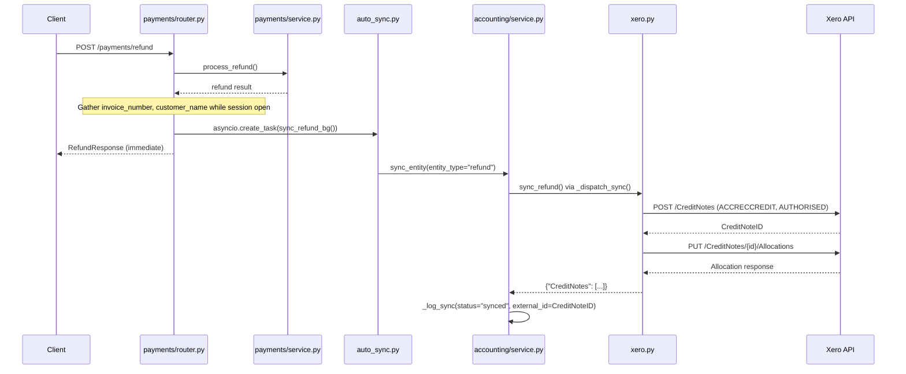

# Design Document: Xero Refund Sync

## Overview

This feature adds Xero synchronisation for refunds processed in OraInvoice. When a refund is recorded (a `Payment` with `is_refund=True`), the system creates a Xero Credit Note (type `ACCRECCREDIT`) and allocates it against the original invoice via the Xero Allocations endpoint. This mirrors the existing sync pattern used for invoices, payments, and credit notes.

Additionally, the existing credit note sync path is fixed to resolve the customer name from the invoice's customer record instead of hardcoding `"Unknown"`.

### Key Design Decisions

1. **Refunds map to Xero Credit Notes + Allocations** — Xero has no standalone "refund" entity. The correct accounting representation is a Credit Note allocated to the original invoice, which reduces the invoice's outstanding balance.
2. **Two-step Xero API call** — First `POST /CreditNotes` to create the credit note, then `PUT /CreditNotes/{id}/Allocations` to link it to the invoice. Both calls go through the existing `_xero_api_call` helper with rate limiting.
3. **Follow existing patterns exactly** — `sync_refund()` in `xero.py`, `sync_refund_bg()` in `auto_sync.py`, `"refund"` entity type in `_dispatch_sync()` and `_reconstruct_entity_data()` all follow the same structure as their invoice/payment/credit_note counterparts.
4. **Fire-and-forget from endpoint** — The refund endpoint dispatches `sync_refund_bg()` via `asyncio.create_task()` after preparing the payload while the DB session is still open, identical to how `record_cash_payment_endpoint` dispatches `sync_payment_bg()`.

## Architecture



## Components and Interfaces

### 1. `sync_refund()` — `app/integrations/xero.py`

New function following the pattern of `sync_invoice()`, `sync_payment()`, `sync_credit_note()`.

```python
async def sync_refund(
    access_token: str,
    tenant_id: str,
    refund_data: dict[str, Any],
) -> dict[str, Any]:
```

**Behaviour:**
- Builds a Xero Credit Note payload with `Type: ACCRECCREDIT`, `Status: AUTHORISED`, contact name from `refund_data["customer_name"]`, reference containing the invoice number, and a single line item with the refund amount and reason as description.
- Calls `POST /CreditNotes` via `_xero_api_call`.
- Extracts the `CreditNoteID` from the response.
- Calls `PUT /CreditNotes/{CreditNoteID}/Allocations` with the invoice number and refund amount to allocate the credit note against the original invoice.
- Returns the full Xero Credit Note response (same shape as `sync_credit_note()`).

### 2. `sync_refund_bg()` — `app/modules/accounting/auto_sync.py`

New function following the exact pattern of `sync_invoice_bg()`, `sync_payment_bg()`, `sync_credit_note_bg()`.

```python
async def sync_refund_bg(org_id: uuid.UUID, refund_data: dict[str, Any]) -> None:
```

**Behaviour:**
- Creates its own DB session via `async_session_factory()`.
- Checks for active Xero connection via `_has_active_xero_connection()`.
- Calls `sync_entity()` with `entity_type="refund"`.
- On failure, logs to sync log with status `"failed"` and error message truncated to 500 chars.
- Never raises exceptions to the caller.

### 3. `_dispatch_sync()` update — `app/modules/accounting/service.py`

Add `elif entity_type == "refund":` branch that calls `xero_client.sync_refund()` and extracts `CreditNoteID` from the response.

### 4. `_reconstruct_entity_data()` update — `app/modules/accounting/service.py`

Add `elif entity_type == "refund":` branch that queries the `Payment` record (where `is_refund=True`) and the associated `Invoice` to build the sync payload with: refund ID, invoice number, customer name, refund amount, date, and refund reason.

### 5. `process_refund_endpoint()` update — `app/modules/payments/router.py`

After `process_refund()` returns and before the response is sent:
- Query the invoice number and customer name from the DB (session is still open).
- Build the Xero sync payload dict.
- Dispatch `sync_refund_bg()` via `asyncio.create_task()`.

### 6. `create_credit_note_endpoint()` fix — `app/modules/invoices/router.py`

Replace the hardcoded `"customer_name": "Unknown"` with a DB query to resolve the customer name from the invoice's `customer_id`, following the same pattern used in `create_invoice_endpoint()`.

## Data Models

### Refund Sync Payload (passed to `sync_refund()`)

```python
{
    "id": str,                  # Payment UUID (the refund record)
    "invoice_number": str,      # Original invoice number for Xero reference + allocation
    "customer_name": str,       # Resolved from invoice → customer
    "amount": float,            # Refund amount
    "date": str,                # Refund date (YYYY-MM-DD)
    "reason": str,              # Refund note/reason
}
```

### Xero Credit Note Payload (sent to Xero API)

```python
{
    "CreditNotes": [{
        "Type": "ACCRECCREDIT",
        "Contact": {"Name": "<customer_name>"},
        "Date": "<date>",
        "Reference": "Refund for <invoice_number>",
        "Status": "AUTHORISED",
        "LineItems": [{
            "Description": "Refund: <reason>",
            "Quantity": 1,
            "UnitAmount": "<amount>",
            "AccountCode": "200",
            "TaxType": "OUTPUT2",
        }],
        "CurrencyCode": "NZD",
    }]
}
```

### Xero Allocation Payload (sent to Xero Allocations endpoint)

```python
{
    "Allocations": [{
        "Invoice": {"InvoiceNumber": "<invoice_number>"},
        "Amount": <amount>,
        "Date": "<date>",
    }]
}
```

### Sync Log Entry (existing `accounting_sync_log` table)

No schema changes. Uses existing columns:
- `entity_type`: `"refund"`
- `entity_id`: Payment UUID (the refund record)
- `external_id`: Xero CreditNoteID
- `status`: `"synced"` or `"failed"`


## Correctness Properties

*A property is a characteristic or behavior that should hold true across all valid executions of a system — essentially, a formal statement about what the system should do. Properties serve as the bridge between human-readable specifications and machine-verifiable correctness guarantees.*

### Property 1: Credit Note payload construction invariant

*For any* valid refund data (non-empty customer name, positive amount, valid date, non-empty invoice number, non-empty reason), the Xero Credit Note payload constructed by `sync_refund()` shall have `Type` equal to `"ACCRECCREDIT"`, `Status` equal to `"AUTHORISED"`, `Contact.Name` equal to the customer name, `Date` equal to the formatted date, `Reference` containing the invoice number, exactly one `LineItem` with `UnitAmount` equal to the refund amount and `Description` containing the reason, and `CurrencyCode` equal to `"NZD"`.

**Validates: Requirements 1.1, 1.3, 1.4**

### Property 2: Allocation payload matches refund data

*For any* valid refund data and a successful Credit Note creation response containing a `CreditNoteID`, the Allocation payload sent to Xero shall contain the original invoice number and the refund amount, ensuring the credit note is linked to the correct invoice.

**Validates: Requirements 1.2**

### Property 3: CreditNoteID extraction from response

*For any* Xero API response containing a non-empty `CreditNotes` array where the first element has a `CreditNoteID`, `sync_refund()` shall return a dict where `CreditNotes[0]["CreditNoteID"]` matches the expected ID, and `_dispatch_sync()` shall extract and return that ID as the external ID.

**Validates: Requirements 1.5, 4.1**

### Property 4: Background task error containment

*For any* exception raised during refund sync execution, `sync_refund_bg()` shall not propagate the exception to the caller, and shall log a sync failure entry with the error message truncated to at most 500 characters.

**Validates: Requirements 2.3, 2.4**

### Property 5: Refund sync payload completeness

*For any* refund result containing a refund ID, amount, date, and reason, and an associated invoice with an invoice number and customer, the sync payload assembled in `process_refund_endpoint()` shall contain all six required fields: `id`, `invoice_number`, `customer_name`, `amount`, `date`, and `reason`, with none being None.

**Validates: Requirements 3.1**

### Property 6: Refund data reconstruction round-trip

*For any* Payment record with `is_refund=True` and an associated Invoice with a customer, `_reconstruct_entity_data()` with `entity_type="refund"` shall return a dict containing `id`, `invoice_number`, `customer_name`, `amount`, `date`, and `reason`, where the amount matches the Payment's amount and the invoice_number matches the Invoice's invoice_number.

**Validates: Requirements 5.1, 5.2**

### Property 7: Credit note sync resolves customer name

*For any* credit note created against an invoice that has an associated customer with a display name, the Xero sync payload dispatched from `create_credit_note_endpoint()` shall contain the actual customer name (not `"Unknown"`).

**Validates: Requirements 6.1, 6.2**

### Property 8: Sync log records correct entity type and status

*For any* refund sync attempt, the resulting `AccountingSyncLog` entry shall have `entity_type` equal to `"refund"`. On success, `status` shall be `"synced"` and `external_id` shall be the Xero CreditNoteID. On failure, `status` shall be `"failed"` and `error_message` shall be non-empty.

**Validates: Requirements 8.1, 8.2**

## Error Handling

| Scenario | Handling | Outcome |
|---|---|---|
| No active Xero connection | `_has_active_xero_connection()` returns False | `sync_refund_bg()` returns silently, no sync log entry |
| Token expired / refresh fails | `_ensure_valid_token()` returns None | Sync log entry with status `"failed"`, error `"Failed to obtain valid access token"` |
| Xero 429 rate limit | `_rate_limited_request` retries after `Retry-After` header | Transparent retry, no special handling needed in `sync_refund()` |
| Credit Note creation fails (4xx/5xx) | `resp.raise_for_status()` raises `httpx.HTTPStatusError` | Caught by `sync_entity()`, logged as `"failed"` with error message |
| Credit Note created but Allocation fails | `sync_refund()` logs partial failure with CreditNoteID, then re-raises | Sync log entry with `"failed"` status, error includes CreditNoteID for manual resolution |
| Payment record not found during reconstruction | `_reconstruct_entity_data()` returns `None` | Retry skipped, logged as warning |
| Background task crashes | Outer `except Exception` in `sync_refund_bg()` | Error logged, fallback sync log entry written, no exception propagated to caller |
| Refund endpoint DB query fails for customer name | Wrapped in try/except | Falls back to `"Unknown"`, sync still dispatched |

## Testing Strategy

### Property-Based Tests (Hypothesis)

Each correctness property above maps to a single Hypothesis property test. Tests generate random valid refund data and verify the stated invariants. Minimum 100 examples per test.

Library: **Hypothesis** (already used in the project — see `.hypothesis/` directory).

Each test must be tagged with a comment:
```python
# Feature: xero-refund-sync, Property {N}: {property_text}
```

**Property tests to implement:**

1. **Payload construction** — Generate random refund data dicts, call the payload-building logic, assert all fields are correct. *(Property 1)*
2. **Allocation payload** — Generate random refund data + mock CreditNoteID, verify allocation payload shape. *(Property 2)*
3. **CreditNoteID extraction** — Generate random Xero response shapes, verify correct ID extraction. *(Property 3)*
4. **Error containment** — Generate random exception messages (including very long ones), verify truncation to 500 chars and no propagation. *(Property 4)*
5. **Payload completeness** — Generate random refund results + invoice data, verify all 6 required fields present and non-None. *(Property 5)*
6. **Reconstruction round-trip** — Generate random Payment + Invoice records, verify reconstructed payload matches source data. *(Property 6)*
7. **Customer name resolution** — Generate random customer names, verify they appear in the sync payload (not "Unknown"). *(Property 7)*
8. **Sync log correctness** — Generate random sync outcomes (success/failure), verify log entry fields. *(Property 8)*

### Unit Tests

Unit tests cover specific examples, edge cases, and integration points:

- `sync_refund()` with mocked `_xero_api_call` — verify both API calls are made in order (Credit Note creation, then Allocation)
- `sync_refund()` when allocation fails after successful credit note creation — verify partial failure logging
- `sync_refund_bg()` with no active Xero connection — verify early return
- `sync_refund_bg()` with sync failure — verify sync log entry written
- `_dispatch_sync()` with `entity_type="refund"` — verify routing to `sync_refund()`
- `_reconstruct_entity_data()` with `entity_type="refund"` and missing Payment — verify returns None
- `_reconstruct_entity_data()` with valid refund Payment — verify payload fields
- `process_refund_endpoint()` Xero payload assembly — verify customer name and invoice number resolved from DB
- `create_credit_note_endpoint()` — verify customer name is resolved, not hardcoded as "Unknown"
- Sync log visibility — verify "refund" entries appear in `get_sync_log()` results
